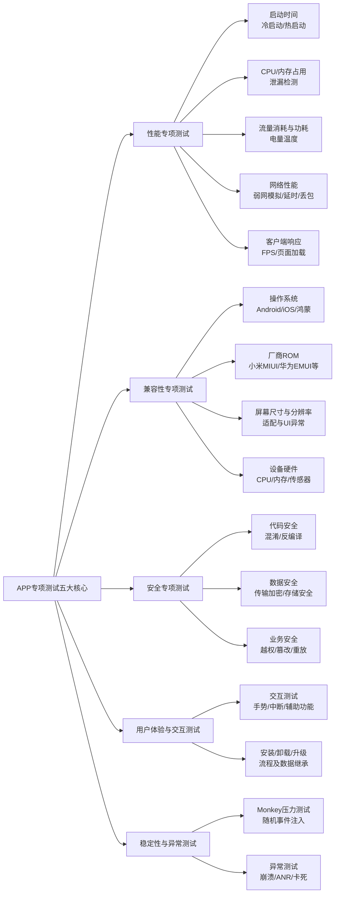

# APP专项测试介绍

APP的专项测试是确保应用高质量上线的关键环节，它超越了基本的功能测试，深入到应用的各个性能和质量维度。

移动应用的专项测试主要围绕**性能、兼容性、安全、用户体验**和**稳定性**这几个核心方面展开。下图清晰地展示了这五大专项及其子领域：

以下是这些专项测试的详细说明、关注点和常用工具：

---

### 一、性能专项测试

这是最核心的专项测试，旨在确保应用在各种情况下都运行流畅、响应迅速。

1.  **启动时间测试**
    *   **关注点**：冷启动、热启动、温启动的耗时。
    *   **工具**：`adb shell am start -W [package名]/.[Activity名]`、Android Studio Profiler、Xcode Instruments、高通Trepn。

2.  **CPU & 内存占用测试**
    *   **关注点**：应用在空闲、中等负载、高负载下的CPU使用率和内存占用量（PSS、Private Dirty），检查内存泄漏。
    *   **工具**：Android Studio Profiler / Memory Profiler、Xcode Instruments (Allocations & Leaks)、`adb shell top`、`adb shell dumpsys meminfo`。

3.  **流量与功耗测试**
    *   **关注点**：应用在静止、操作等不同状态下的网络流量消耗和电量消耗。监控发热情况。
    *   **工具**：Android Studio Profiler (Network & Energy)、Battery Historian、iOS Settings → Battery、硬件功率计。

4.  **网络性能测试**
    *   **关注点**：在弱网（2G/3G、高延迟、高丢包）、断网、网络切换等场景下的表现，如请求成功率、重连机制、数据一致性。
    *   **工具**：**Charles**、**Fiddler**（网络抓包和弱网模拟）、Facebook ATC(Atc)、腾讯企鹅电竞开源的QNET。

5.  **客户端响应能力测试（渲染性能）**
    *   **关注点**：帧率（FPS）、滑动流畅度、页面加载耗时、列表滚动性能。检查是否出现卡顿（Jank）或掉帧。
    *   **工具**：Android **Perfetto** / GPU呈现模式分析、iOS Xcode **Core Animation** Instrument、**GT**、**PerfDog**（跨平台）。

---

### 二、兼容性测试

确保应用在不同软硬件环境下都能正常工作。

1.  **操作系统兼容**
    *   **关注点**：在不同版本的Android（如10, 11, 12, 13）、iOS（如14, 15, 16）上的功能、UI和性能表现。关注新系统API的适配和旧系统上的降级处理。

2.  **厂商ROM兼容**
    *   **关注点**：特别是在Android上，需要测试小米(MIUI)、华为(EMUI/HarmonyOS)、OPPO(ColorOS)、vivo(FuntouchOS/OriginOS)等主流厂商的定制系统。重点关注**权限管理、后台管理、推送机制、深色模式**等方面的差异。

3.  **屏幕与分辨率兼容**
    *   **关注点**：在不同屏幕尺寸（手机、平板、折叠屏）、分辨率、密度（DPI）下的UI适配情况，检查布局错乱、重叠、拉伸等问题。

4.  **设备兼容**
    *   **关注点**：在不同硬件配置（CPU型号如骁龙/联发科/麒麟、内存大小）、传感器（GPS、陀螺仪、NFC）上的表现。
    *   **工具**：**云测平台**（如WeTest、Testin、AWS Device Farm、Firebase Test Lab）是高效完成兼容性测试的最佳选择，它们提供了海量的真机集群。

---

### 三、安全专项测试

保护用户数据安全，防止应用被破解和攻击。

1.  **安装包安全**
    *   **关注点**：是否可反编译、代码是否混淆、资源文件是否加密、签名证书是否合规。
    *   **工具**：Jadx、GDA（反编译工具）、Keytool。

2.  **数据安全**
    *   **关注点**：
        *   **传输安全**：是否使用HTTPS、证书是否校验（防止中间人攻击）、敏感信息是否明文传输。
        *   **存储安全**：本地敏感数据（密码、Token）是否明文存储。SD卡上的数据是否可被其他应用读取。
    *   **工具**：Charles/Fiddler（抓包验证）、**MobSF** (Mobile Security Framework)。

3.  **业务安全**
    *   **关注点**：接口是否防抓包、防重放攻击、参数是否防篡改、越权操作（用户A能操作用户B的数据）。
    *   **方法**：手动测试与工具结合。

---

### 四、用户体验与交互测试

确保应用符合人机交互准则，提供舒适的用户体验。

1.  **交互体验测试**
    *   **关注点**：手势操作是否流畅、符合预期；点击热区是否足够大；动画效果是否顺滑；是否与系统交互冲突。

2.  **中断测试**
    *   **关注点**：应用在处理来电、短信、低电量提醒、闹钟、切换应用、插拔数据线等中断事件时，行为是否正常（如暂停、保存状态）。

3.  **辅助功能测试**
    *   **关注点**：是否支持无障碍功能（如TalkBack/Screen Reader），供视障用户使用。

---

### 五、稳定性测试（强度测试）

通过施加压力，发现潜在的崩溃和ANR。

1.  **Monkey / MonkeyRunner测试**
    *   **关注点**：使用Android提供的Monkey工具向应用发送随机的事件流（点击、滑动、按键），持续运行一段时间，检查是否发生崩溃（Crash）或无响应（ANR）。
    *   **命令**：`adb shell monkey -p [package名] --throttle 500 -v -v 100000`

2.  **Maxim / AppCrawler 等高级Monkey**
    *   **关注点**：比原生Monkey更智能，可以进行**定向遍历**，覆盖更深的页面，提高测试效率。
    *   **工具**：Maxim、AppCrawler。

3.  **ANR（Application Not Responding）分析**
    *   **关注点**：监控主线程是否在执行耗时操作（如网络请求、数据库操作），导致应用无法响应。
    *   **方法**：分析 `/data/anr/traces.txt` 文件（Android）。

### 总结：如何选择专项测试？

*   **所有项目都必须做**：**性能（启动、内存、CPU）、核心兼容性、稳定性（Monkey）**。
*   **依赖网络的项目**：必须进行**弱网测试 & 流量测试**。
*   **涉及金融、支付的App**：必须进行**深度安全测试**。
*   **面向大规模用户的App**：必须进行**大规模兼容性测试**（使用云测平台）。
*   **对用户体验要求极高的App（如游戏）**：必须进行**深度UX交互测试 & 功耗发热测试**。

专项测试是衡量一个测试团队技术深度和广度的关键指标，能极大地提升App的整体质量感和用户满意度。