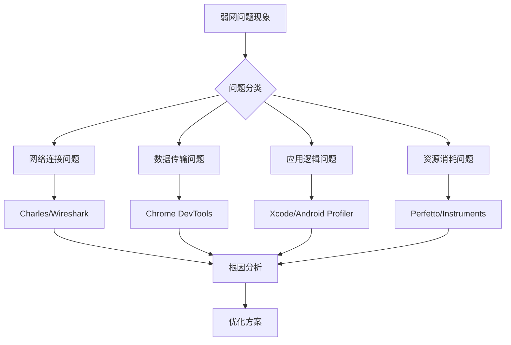

# 弱网测试代码问题定位工具与操作指南

## 一、问题定位工具栈全景图



## 二、不同问题类型的定位工具选择

### 1. 网络连接问题定位工具

#### (1) Charles Proxy - 网络请求详细分析
```markdown
适用问题：
- 请求超时、重连失败
- 连接建立失败
- SSL握手问题

操作步骤：
1. 配置代理并开启弱网模拟
   Proxy → Throttle Settings → Enable Throttling
   设置：带宽限制100kbps，延迟300ms，丢包5%

2. 启动会话记录
   File → New Session
   Proxy → Start Recording

3. 分析具体请求
   - 查看Timeline视图：DNS解析、TCP连接、SSL握手、请求响应时间
   - 重点关注红色标记的失败请求
   
4. 关键信息提取：
   - 请求总耗时：Duration列
   - 各个阶段耗时：右键 → View Timeline
   - 响应状态码：Status列
   - 请求重试次数：查看重复请求
   
5. 导出分析报告：
   File → Export Session → 选择格式（.chls或JSON）
```

#### (2) Wireshark - 底层网络协议分析
```bash
# 操作步骤：
1. 开始抓包
   $ adb shell tcpdump -i any -s 0 -w /sdcard/capture.pcap
   $ adb pull /sdcard/capture.pcap .

2. 过滤器设置：
   - 只查看特定IP：ip.addr == 192.168.1.100
   - 查看TCP重传：tcp.analysis.retransmission
   - 查看零窗口：tcp.analysis.zero_window
   - 查看丢包：tcp.analysis.lost_segment

3. 关键分析点：
   - 三次握手时间：SYN到SYN-ACK的间隔
   - TLS握手时间：Client Hello到Server Hello Done
   - TCP窗口大小变化：Window size value
   - 重传包统计：Statistics → TCP Stream Graphs
```

### 2. 数据传输问题定位工具

#### (1) Chrome DevTools - 前端资源加载分析
```javascript
// 操作步骤：
1. 打开开发者工具：F12 → Network选项卡
2. 设置网络条件：Online下拉框选择"Slow 3G"
3. 触发页面加载，分析瀑布流图：

关键指标：
- 排队时间（Queueing）：资源等待时间
- 停滞时间（Stalled）：代理协商、等待可用连接
- DNS查找时间
- 初始连接时间（TCP握手）
- SSL/TLS握手时间
- 请求发送时间
- 等待时间（TTFB）
- 内容下载时间

4. 使用Performance API获取精确数据：
// 监控资源加载
const resources = performance.getEntriesByType('resource');
resources.forEach(resource => {
    console.log(`${resource.name}: 
        DNS: ${resource.domainLookupEnd - resource.domainLookupStart}ms,
        TCP: ${resource.connectEnd - resource.connectStart}ms,
        Request: ${resource.responseStart - resource.requestStart}ms,
        Response: ${resource.responseEnd - resource.responseStart}ms`);
});
```

#### (2) Fiddler - 请求/响应内容分析
```markdown
操作步骤：
1. 设置弱网规则：
   Rules → Performance → Simulate Modem Speeds

2. 查看请求详情：
   - Inspector标签：查看请求头、响应头、原始数据
   - Timeline视图：可视化请求时间线
   - Statistics标签：请求统计信息

3. 使用AutoResponder模拟慢响应：
   - 拖拽请求到AutoResponder
   - 设置延迟规则：delay:5000（延迟5秒）
   - 保存并启用规则

4. 使用Fiddler Script自定义逻辑：
   // 在CustomRules.js中添加
   static function OnBeforeRequest(oSession: Session) {
       if (oSession.uriContains("api.example.com")) {
           // 模拟丢包
           if (Math.random() < 0.1) {
               oSession["x-abortwith"] = "掉线";
           }
       }
   }
```

### 3. 应用逻辑问题定位工具

#### (1) Android Studio Profiler - Android应用深度分析
```markdown
操作步骤：
1. 启动Profiler：
   View → Tool Windows → Profiler
   或点击工具栏Profiler图标

2. 网络分析：
   - 选择Network行
   - 查看实时网络活动图
   - 点击具体时间点查看请求详情

3. CPU分析：
   - 录制CPU活动
   - 查看主线程阻塞情况
   - 分析热点方法（Flame Chart）

4. 内存分析：
   - 捕获堆转储（Capture heap dump）
   - 查找内存泄漏
   - 分析网络相关对象生命周期

5. 查看日志：
   Logcat中过滤网络相关日志：
   adb logcat | grep -E "(HttpURLConnection|OkHttp|Retrofit|timeout|connect)"
   
6. 代码定位技巧：
   // 在代码中添加标记
   StrictMode.setThreadPolicy(new StrictMode.ThreadPolicy.Builder()
       .detectNetwork()
       .penaltyLog()  // 在Logcat中输出违规信息
       .build());
```

#### (2) Xcode Instruments - iOS应用深度分析
```swift
// 操作步骤：
1. 启动Instruments：
   Xcode → Open Developer Tool → Instruments
   
2. 选择模板：
   - Network：网络连接分析
   - Time Profiler：CPU使用分析
   - Energy Log：能耗分析
   - Leaks：内存泄漏检测

3. 配置网络模拟：
   - 在测试设备上：设置 → 开发者 → Network Link Conditioner
   - 选择预设：3G/Edge/100% Loss

4. 开始录制并重现问题

5. 分析网络请求：
   - 查看TCP/IP连接状态
   - 分析HTTP请求/响应时间
   - 检查SSL握手过程

6. 在代码中添加调试信息：
   // 使用URLSession的调试模式
   let configuration = URLSessionConfiguration.default
   configuration.httpAdditionalHeaders = ["User-Agent": "MyApp/1.0"]
   configuration.timeoutIntervalForRequest = 30
   configuration.timeoutIntervalForResource = 60
   
   // 添加网络活动指示器
   URLSession.shared.dataTask(with: url) { data, response, error in
       if let error = error as? URLError {
           print("网络错误: \(error.code.rawValue)")
           print("失败原因: \(error.localizedDescription)")
       }
   }
```

### 4. 性能瓶颈定位工具

#### (1) Perfetto - 系统级追踪
```bash
# Android系统级跟踪
操作步骤：
1. 记录跟踪数据：
   $ adb shell perfetto --txt -c /data/misc/perfetto-traces/trace_config.pbtx -o /data/misc/perfetto-traces/trace.perfetto-trace

2. 创建配置文件trace_config.pbtx：
   buffers {
       size_kb: 63488
   }
   data_sources {
       config {
           name: "linux.ftrace"
           ftrace_config {
               ftrace_events: "net/net_dev_queue"
               ftrace_events: "net/netif_receive_skb"
               ftrace_events: "net/netif_rx"
               ftrace_events: "tcp/tcp_retransmit_skb"
           }
       }
   }
   duration_ms: 10000

3. 拉取跟踪文件并分析：
   $ adb pull /data/misc/perfetto-traces/trace.perfetto-trace
   在 https://ui.perfetto.dev/ 中打开分析

4. 关键分析点：
   - 网络设备队列长度
   - TCP重传事件
   - 套接字读写延迟
```

#### (2) Android Battery Historian - 能耗分析
```markdown
操作步骤：
1. 收集电池数据：
   $ adb shell dumpsys batterystats --reset
   $ adb shell dumpsys batterystats --enable full-wake-history
   # 执行测试用例
   $ adb shell dumpsys batterystats > batterystats.txt
   $ adb bugreport > bugreport.zip

2. 分析网络耗电：
   - 在Battery Historian中查看"Network"部分
   - 分析移动数据/WiFi的激活时间
   - 检查后台网络请求

3. 定位高耗电网络操作：
   - 长时间保持的网络连接
   - 高频的心跳包
   - 大数据量传输
```

## 三、实战案例：定位弱网登录超时问题

### 1. 问题现象
用户在弱网环境下登录时，界面卡住30秒后提示超时。

### 2. 定位流程
```python
# 定位步骤代码示例
class LoginTimeoutDebugger:
    def __init__(self):
        self.tools = {
            'network': 'Charles',
            'android': 'Android Profiler',
            'ios': 'Xcode Instruments',
            'logs': 'Logcat/Console'
        }
    
    def step1_capture_network_traffic(self):
        """步骤1：捕获网络流量"""
        print("""
        操作步骤：
        1. 打开Charles，设置弱网模拟（上行50kbps，延迟300ms）
        2. 清空会话，开始录制
        3. 在App中执行登录操作
        4. 停止录制，分析登录请求
        """)
        
        # 预期发现：登录API请求耗时30秒才返回
        
    def step2_analyze_request_details(self):
        """步骤2：分析请求详情"""
        print("""
        Charles分析要点：
        1. 查看登录请求的Timeline
           - DNS解析时间：正常（<100ms）
           - TCP连接时间：正常（<200ms）
           - SSL握手时间：正常（<300ms）
           - 等待时间（TTFB）：29秒 <- 问题所在！
           - 下载时间：正常（<1秒）
        
        2. 查看请求内容：
           - 请求体大小：2KB（正常）
           - 请求头：包含正确的认证信息
        
        3. 查看响应内容：
           - 状态码：200
           - 响应体：正常的登录响应
           - 但响应延迟了29秒
        """)
        
    def step3_check_server_logs(self):
        """步骤3：检查服务器端"""
        print("""
        联系后端同事，检查服务器日志：
        1. 查找对应时间点的登录请求
        2. 发现：服务器在收到请求后立即处理完成
        3. 问题：响应在网络传输中延迟了
        """)
        
    def step4_analyze_client_code(self):
        """步骤4：分析客户端代码"""
        print("""
        使用Android Studio Profiler分析：
        1. 在Profiler中查看登录时的网络活动
        2. 发现：登录请求发出后，App在等待响应期间发起了多次重试
        
        检查代码实现：
        // 问题代码示例
        OkHttpClient client = new OkHttpClient.Builder()
            .connectTimeout(10, TimeUnit.SECONDS)
            .readTimeout(30, TimeUnit.SECONDS)  // 读超时30秒！
            .writeTimeout(10, TimeUnit.SECONDS)
            .retryOnConnectionFailure(true)     // 开启重试
            .build();
        
        问题分析：
        1. readTimeout设置为30秒，在弱网下容易达到
        2. retryOnConnectionFailure在弱网下可能多次重试
        3. 用户看到的就是30秒的等待
        """)
        
    def step5_validate_fix(self):
        """步骤5：验证修复"""
        print("""
        优化方案：
        1. 缩短读超时：readTimeout(15, TimeUnit.SECONDS)
        2. 添加重试策略：最多重试2次，使用指数退避
        3. 前端优化：10秒后显示"网络不佳，正在重试"
        
        验证测试：
        1. 在相同弱网环境下测试
        2. 现在登录流程：10秒提示 → 15秒超时 → 提示友好错误
        3. 用户体验大幅提升
        """)
```

### 3. 代码层面具体定位技巧

#### (1) 添加网络请求标记
```kotlin
// Android - 使用OkHttp拦截器添加调试信息
class DebugInterceptor : Interceptor {
    override fun intercept(chain: Interceptor.Chain): Response {
        val request = chain.request()
        val requestStartTime = System.nanoTime()
        
        Log.d("NetworkDebug", "开始请求: ${request.url}")
        Log.d("NetworkDebug", "请求头: ${request.headers}")
        
        try {
            val response = chain.proceed(request)
            val requestEndTime = System.nanoTime()
            val duration = (requestEndTime - requestStartTime) / 1_000_000
            
            Log.d("NetworkDebug", "请求完成: ${request.url}")
            Log.d("NetworkDebug", "状态码: ${response.code}")
            Log.d("NetworkDebug", "耗时: ${duration}ms")
            Log.d("NetworkDebug", "响应头: ${response.headers}")
            
            // 记录到文件，便于后续分析
            logToFile("${System.currentTimeMillis()},${request.url},${duration},${response.code}")
            
            return response
        } catch (e: IOException) {
            Log.e("NetworkDebug", "请求失败: ${e.message}")
            Log.e("NetworkDebug", "失败URL: ${request.url}")
            
            // 分析具体错误类型
            when (e) {
                is SocketTimeoutException -> {
                    Log.e("NetworkDebug", "超时类型: ${if (e.message?.contains("connect") == true) "连接" else "读取"}")
                }
                is ConnectException -> {
                    Log.e("NetworkDebug", "连接被拒绝")
                }
                is SSLHandshakeException -> {
                    Log.e("NetworkDebug", "SSL握手失败")
                }
            }
            
            throw e
        }
    }
}
```

#### (2) 使用StrictMode检测主线程网络操作
```java
// Android - 检测主线程中的网络请求
public class DebugApplication extends Application {
    @Override
    public void onCreate() {
        super.onCreate();
        
        if (BuildConfig.DEBUG) {
            StrictMode.setThreadPolicy(new StrictMode.ThreadPolicy.Builder()
                .detectNetwork()  // 检测网络操作
                .detectCustomSlowCalls()
                .penaltyLog()
                .penaltyDialog()  // 弹出对话框提示
                .build());
                
            StrictMode.setVmPolicy(new StrictMode.VmPolicy.Builder()
                .detectLeakedSqlLiteObjects()
                .detectLeakedClosableObjects()
                .penaltyLog()
                .build());
        }
    }
}
```

#### (3) iOS网络调试代码
```swift
// iOS - URLSession调试扩展
extension URLSession {
    static var debugEnabled = false
    
    static func createDebugSession() -> URLSession {
        let configuration = URLSessionConfiguration.default
        
        if debugEnabled {
            // 启用详细日志
            configuration.httpAdditionalHeaders = ["X-Debug": "true"]
            configuration.timeoutIntervalForRequest = 20
            configuration.timeoutIntervalForResource = 40
            
            // 使用自定义协议类记录网络活动
            configuration.protocolClasses = [DebugURLProtocol.self] + (configuration.protocolClasses ?? [])
        }
        
        return URLSession(configuration: configuration)
    }
}

// 自定义URLProtocol记录网络请求
class DebugURLProtocol: URLProtocol {
    override class func canInit(with request: URLRequest) -> Bool {
        // 记录所有请求
        print("📡 请求开始: \(request.url?.absoluteString ?? "未知")")
        print("  方法: \(request.httpMethod ?? "GET")")
        print("  头信息: \(request.allHTTPHeaderFields ?? [:])")
        
        return false  // 不处理，只记录
    }
    
    static func logResponse(_ response: URLResponse, data: Data?, error: Error?) {
        if let httpResponse = response as? HTTPURLResponse {
            print("📡 响应收到: \(response.url?.absoluteString ?? "未知")")
            print("  状态码: \(httpResponse.statusCode)")
            print("  响应头: \(httpResponse.allHeaderFields)")
            
            if let error = error {
                print("  错误: \(error.localizedDescription)")
            }
            
            if let data = data {
                print("  数据大小: \(data.count) 字节")
            }
        }
    }
}
```

## 四、自动化定位框架

### 1. 自动化测试+问题定位框架
```python
import subprocess
import time
import json
from dataclasses import dataclass
from typing import List, Optional

@dataclass
class NetworkIssue:
    issue_type: str  # timeout, connection_failed, slow_response
    url: str
    duration: float
    error_message: Optional[str]
    stack_trace: Optional[str]
    
class WeakNetworkDebugger:
    def __init__(self, app_package: str):
        self.app_package = app_package
        self.issues: List[NetworkIssue] = []
        
    def run_with_weak_network(self, test_scenario):
        """在弱网环境下运行测试并收集问题"""
        
        # 1. 设置弱网环境
        self._setup_weak_network("2g")
        
        # 2. 开始收集日志
        logcat_process = self._start_logcat_capture()
        
        # 3. 运行测试
        test_result = test_scenario.run()
        
        # 4. 停止日志收集
        logcat_data = self._stop_logcat_capture(logcat_process)
        
        # 5. 分析问题
        issues = self._analyze_logs(logcat_data)
        
        # 6. 生成报告
        self._generate_report(test_result, issues)
        
        return issues
    
    def _setup_weak_network(self, profile: str):
        """设置弱网环境"""
        profiles = {
            "2g": {
                "delay": "300ms 100ms",
                "loss": "5%",
                "rate": "50kbps"
            },
            "3g": {
                "delay": "200ms 50ms", 
                "loss": "3%",
                "rate": "200kbps"
            }
        }
        
        config = profiles.get(profile, profiles["2g"])
        
        # 使用tc命令设置网络条件
        cmd = (
            f"tc qdisc add dev wlan0 root netem "
            f"delay {config['delay']} "
            f"loss {config['loss']} "
            f"rate {config['rate']}"
        )
        
        subprocess.run(["adb", "shell", cmd])
        
    def _start_logcat_capture(self):
        """开始收集日志"""
        # 清空旧日志
        subprocess.run(["adb", "logcat", "-c"])
        
        # 开始记录
        process = subprocess.Popen(
            ["adb", "logcat", "-v", "threadtime"],
            stdout=subprocess.PIPE,
            stderr=subprocess.PIPE
        )
        
        return process
    
    def _analyze_logs(self, log_data: str) -> List[NetworkIssue]:
        """分析日志，找出网络问题"""
        issues = []
        
        lines = log_data.split('\n')
        for line in lines:
            # 查找超时错误
            if "timeout" in line.lower() and self.app_package in line:
                issue = NetworkIssue(
                    issue_type="timeout",
                    url=self._extract_url_from_log(line),
                    duration=self._extract_duration(line),
                    error_message=line,
                    stack_trace=self._extract_stack_trace(lines, line)
                )
                issues.append(issue)
                
            # 查找连接失败
            elif any(keyword in line.lower() for keyword in 
                    ["connection refused", "failed to connect", "network unreachable"]):
                issue = NetworkIssue(
                    issue_type="connection_failed",
                    url=self._extract_url_from_log(line),
                    duration=0,
                    error_message=line,
                    stack_trace=self._extract_stack_trace(lines, line)
                )
                issues.append(issue)
                
        return issues
    
    def _generate_report(self, test_result, issues):
        """生成问题报告"""
        report = {
            "test_scenario": test_result.name,
            "network_conditions": self.current_network_profile,
            "issues_found": len(issues),
            "issues": [issue.__dict__ for issue in issues],
            "recommendations": self._generate_recommendations(issues)
        }
        
        with open(f"weak_network_report_{int(time.time())}.json", "w") as f:
            json.dump(report, f, indent=2)
        
        print(f"报告已生成，发现 {len(issues)} 个问题")
```

### 2. 实时监控告警系统
```javascript
// Web端网络监控脚本
class NetworkHealthMonitor {
    constructor() {
        this.metrics = {
            successRate: 0,
            averageLatency: 0,
            timeouts: 0,
            errors: []
        };
        
        this.startMonitoring();
    }
    
    startMonitoring() {
        // 拦截所有fetch请求
        const originalFetch = window.fetch;
        window.fetch = async (...args) => {
            const startTime = performance.now();
            const url = typeof args[0] === 'string' ? args[0] : args[0].url;
            
            try {
                const response = await originalFetch(...args);
                const endTime = performance.now();
                const duration = endTime - startTime;
                
                this.recordRequest({
                    url,
                    duration,
                    status: response.status,
                    success: response.ok
                });
                
                // 检查是否是慢请求
                if (duration > 5000) { // 5秒阈值
                    this.reportSlowRequest(url, duration);
                }
                
                return response;
            } catch (error) {
                this.recordError({
                    url,
                    error: error.message,
                    timestamp: Date.now()
                });
                
                // 自动捕获错误堆栈
                this.captureStackTrace(url, error);
                throw error;
            }
        };
        
        // 监控XMLHttpRequest
        this.monitorXHR();
        
        // 定期报告健康状况
        setInterval(() => this.reportHealth(), 60000);
    }
    
    captureStackTrace(url, error) {
        // 使用Error.captureStackTrace获取堆栈
        const stack = error.stack || new Error().stack;
        
        // 发送到监控服务器
        this.sendToMonitoringServer({
            type: 'network_error',
            url,
            error: error.message,
            stack: stack,
            userAgent: navigator.userAgent,
            timestamp: Date.now(),
            networkType: navigator.connection?.effectiveType || 'unknown'
        });
    }
    
    reportSlowRequest(url, duration) {
        // 收集性能时间线数据
        const perfEntries = performance.getEntriesByName(url);
        
        // 发送详细分析数据
        this.sendToMonitoringServer({
            type: 'slow_request',
            url,
            duration,
            timing: this.getResourceTiming(url),
            networkInfo: navigator.connection,
            timestamp: Date.now()
        });
    }
}
```

## 五、问题定位检查清单

### 1. 快速定位流程
```markdown
## 弱网问题定位检查清单

### 第一步：现象确认
- [ ] 问题是否稳定复现？
- [ ] 在什么网络条件下出现？（2G/3G/弱4G）
- [ ] 出现频率如何？
- [ ] 影响用户范围？

### 第二步：数据收集
- [ ] 捕获网络请求（Charles/Fiddler）
- [ ] 收集客户端日志（Logcat/Console）
- [ ] 记录性能数据（Profiler/Instruments）
- [ ] 获取用户操作步骤

### 第三步：问题分类
□ 连接建立失败
  - 检查：DNS解析、TCP握手、SSL握手
  - 工具：Wireshark、nslookup

□ 请求超时
  - 检查：客户端超时设置、服务器响应时间
  - 工具：Charles Timeline、服务器日志

□ 数据传输慢
  - 检查：带宽限制、数据压缩、分片策略
  - 工具：Chrome Network瀑布图

□ 频繁重连
  - 检查：重试逻辑、心跳机制、连接保持
  - 工具：日志分析、代码审查

### 第四步：根因分析
- [ ] 是客户端配置问题？
- [ ] 是服务器响应问题？
- [ ] 是网络传输问题？
- [ ] 是业务逻辑问题？

### 第五步：验证修复
- [ ] 修复代码后，在相同弱网环境测试
- [ ] 验证相关指标是否改善
- [ ] 确保没有引入新问题
```

### 2. 常见问题与解决方案对照表
| 问题现象     | 可能原因                                              | 定位工具                         | 解决方案                                              |
| ------------ | ----------------------------------------------------- | -------------------------------- | ----------------------------------------------------- |
| 登录超时     | 1. 读超时设置过长<br>2. 服务器处理慢<br>3. 网络延迟高 | Charles Timeline<br>服务器日志   | 1. 优化超时策略<br>2. 添加加载提示<br>3. 使用快速重试 |
| 图片加载失败 | 1. 连接中断<br>2. 缓存策略问题<br>3. CDN问题          | Chrome Network<br>浏览器缓存检查 | 1. 实现断点续传<br>2. 优化缓存策略<br>3. 添加重试机制 |
| 频繁重连     | 1. 心跳间隔太短<br>2. 网络不稳定<br>3. 后台保活策略   | Wireshark抓包<br>电池消耗分析    | 1. 调整心跳频率<br>2. 实现退避重连<br>3. 优化保活策略 |
| 数据不同步   | 1. 请求顺序问题<br>2. 冲突解决策略<br>3. 本地存储问题 | 日志分析<br>数据库检查           | 1. 实现请求队列<br>2. 优化冲突解决<br>3. 加强数据校验 |

## 六、高级调试技巧

### 1. 使用LLDB/GDB调试网络问题
```bash
# iOS - LLDB调试网络请求
(lldb) breakpoint set -n "-[NSURLSession dataTaskWithRequest:completionHandler:]"
(lldb) breakpoint command add 1
Enter your debugger command(s). Type 'DONE' to end.
> po $arg2  # 打印URLRequest
> continue
> DONE

# Android - 使用JDWP调试
$ adb jdwp  # 列出可调试进程ID
$ adb forward tcp:8700 jdwp:<pid>
$ jdb -attach localhost:8700

# 设置断点
> stop in com.example.network.NetworkManager.sendRequest
> stop at com.example.network.NetworkManager:45
```

### 2. 内存和线程分析
```java
// Android - 检查网络相关内存泄漏
public void checkNetworkLeaks() {
    // 使用LeakCanary
    Debug.dumpHprofData("/sdcard/leak.hprof");
    
    // 分析线程问题
    Map<Thread, StackTraceElement[]> allThreads = Thread.getAllStackTraces();
    for (Thread thread : allThreads.keySet()) {
        if (thread.getName().contains("OkHttp") || 
            thread.getName().contains("Network")) {
            System.out.println("网络线程: " + thread.getName());
            System.out.println("状态: " + thread.getState());
            
            // 检查是否阻塞
            if (thread.getState() == Thread.State.BLOCKED) {
                System.out.println("⚠️ 网络线程被阻塞！");
            }
        }
    }
}
```

通过这套完整的工具链和操作流程，你可以系统性地定位弱网环境下的各种代码问题，从表面现象深入到根本原因，最终实现有效的优化。