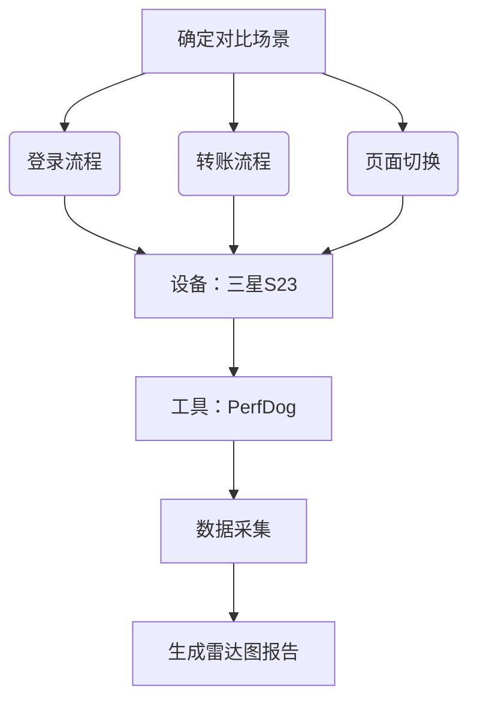

以下是针对**移动应用性能测试**的全面测试点梳理与补充，涵盖客观指标测量与主观用户体验优化，并结合金融类应用示例说明：

---

### **1. 核心业务流程性能指标测试**
#### **1.1 关键路径耗时（端到端）**
| **测试场景** | **性能目标** | **测量方法**            | **金融应用示例**                |
| ------------ | ------------ | ----------------------- | ------------------------------- |
| 冷启动时间   | ≤1.5秒       | `adb shell am start -W` | 网银APP图标点击到登录页渲染完成 |
| 核心功能响应 | ≤2秒         | 代码插桩/APM工具        | 转账确认后到结果页展示          |
| 页面跳转延迟 | ≤1秒         | Systrace/Instruments    | 从首页跳转至理财详情页          |

#### **1.2 资源消耗基准**
- **内存占用**：  
  - 单页面内存峰值≤50MB（通过Android Profiler监测`Native Heap`）  
  - 后台驻留10分钟后内存增长≤10%（防内存泄漏）  
- **CPU/电量**：  
  - 转账流程CPU占用率≤15%（中端设备）  
  - 持续导航1小时耗电≤15%（实测5000mAh电池）  

---

### **2. 用户感知性能优化测试**
#### **2.1 视觉流畅性提升**
- **测试点**：  
  - **帧率稳定性**：  
    - 列表滑动/动画渲染保持≥55 FPS（使用PerfDog监测）  
    - 避免Jank（卡顿帧）：每10秒卡顿帧≤1帧  
  - **占位图策略**：  
    - 数据加载前显示骨架屏（Skeleton），等待感知时间缩短40%  

#### **2.2 交互反馈设计**
- **测试用例**：  
  - 点击按钮后150ms内提供视觉反馈（如涟漪效果）  
  - 网络请求超过1秒时显示进度条（防止用户误判卡死）  

---

### **3. 网络性能专项测试**
#### **3.1 弱网环境适配**
| **网络场景**      | **性能要求**              | **测试工具**       |
| ----------------- | ------------------------- | ------------------ |
| 3G网络（500kbps） | 转账结果页加载≤5秒        | Facebook ATC       |
| 高延迟（500ms）   | 登录请求超时重试≤2次      | Charles Throttling |
| 0.1%丢包率        | 视频客服画面冻结≤1秒/分钟 | WANem硬件模拟      |

#### **3.2 数据优化策略**
- **用例验证**：  
  - 接口响应>100KB时是否启用GZIP压缩（节省流量≥60%）  
  - 图片加载是否根据网络切换分辨率（Wi-Fi下加载原图，4G加载WebP）  

---

### **4. 竞品对比测试方法论**
#### **4.1 横向对标流程**


#### **4.2 关键对比维度**
- **速度维度**：首屏时间、API响应速度  
- **资源维度**：内存占用、CPU温度  
- **体验维度**：卡顿率、操作流畅度  

---

### **5. 极端场景性能边界测试**
#### **5.1 硬件压力场景**
- **测试用例**：  
  - 低端设备（红米9A/2GB内存）运行多任务时，网银APP是否被系统强杀  
  - 设备温度＞45℃时，是否禁用复杂动画（防止CPU降频）  

#### **5.2 数据量压力**
- **测试点**：  
  - 交易记录加载1000条数据，滚动流畅度（FPS≥45）  
  - 大数据包解析（10MB JSON）在主线程耗时≤200ms  

---

### **6. 工具链与自动化策略**
#### **6.1 推荐工具组合
| **测试类型** | **工具**                | **关键能力**                      |
| ------------ | ----------------------- | --------------------------------- |
| 端到端监控   | Firebase Perf           | 自动统计启动时间/网络请求百分位值 |
| 代码级优化   | Android Studio Profiler | 定位CPU热点方法/内存分配堆栈      |
| 竞品数据抓取 | PerfDog/Emmagee         | 免Root跨应用性能对比              |
| 自动化脚本   | Appium + Python         | 批量执行转账流程并记录耗时        |

#### **6.2 自动化实施建议**
```python
# Appium示例：登录流程性能测试
def test_login_performance():
    start_time = time.time()
    driver.find_element(ID, "username").send_keys("test")
    driver.find_element(ID, "password").send_keys("123456")
    driver.find_element(ID, "login_btn").click()
    WebDriverWait(driver, 10).until(EC.visibility_of_element_located((ID, "home_page")))
    elapsed = time.time() - start_time
    assert elapsed < 3.0, f"登录耗时{elapsed}s超限！"
    # 结果写入ElasticSearch生成趋势图
```

---

### **7. 用户体验量化模型**
#### **7.1 感知性能公式**
```
用户可容忍等待时间 = 基础等待阈值 × 交互反馈系数
```
- **基础阈值**：功能型操作（如转账）≤2秒，复杂操作（如报表生成）≤10秒  
- **反馈系数**：  
  - 进度条显示：系数=1.5（容忍延长至3秒）  
  - 静态等待：系数=0.8（实际1.6秒即焦虑）  

#### **7.2 优化案例**
- **网银转账场景**：  
  后台处理耗时3秒 → 添加“银行处理中”动画 + 预计完成进度条 → 用户感知等待时间降至1.8秒  

---

**执行优先级建议**：  
1. **紧急**：核心路径性能基线（启动/登录/支付）  
2. **重要**：弱网/低端设备适配  
3. **优化级**：竞品对标与感知体验提升  
4. **长期监控**：自动化CI集成性能门禁（如PR合并要求启动时间退化<5%）  

通过以上测试点，可构建覆盖技术指标与用户体验的全方位性能评估体系，确保应用在留存率竞争中占据优势。