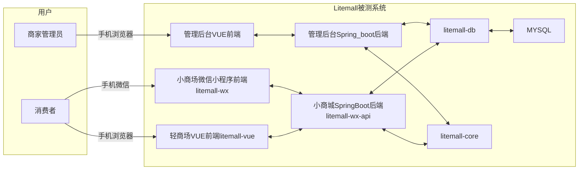
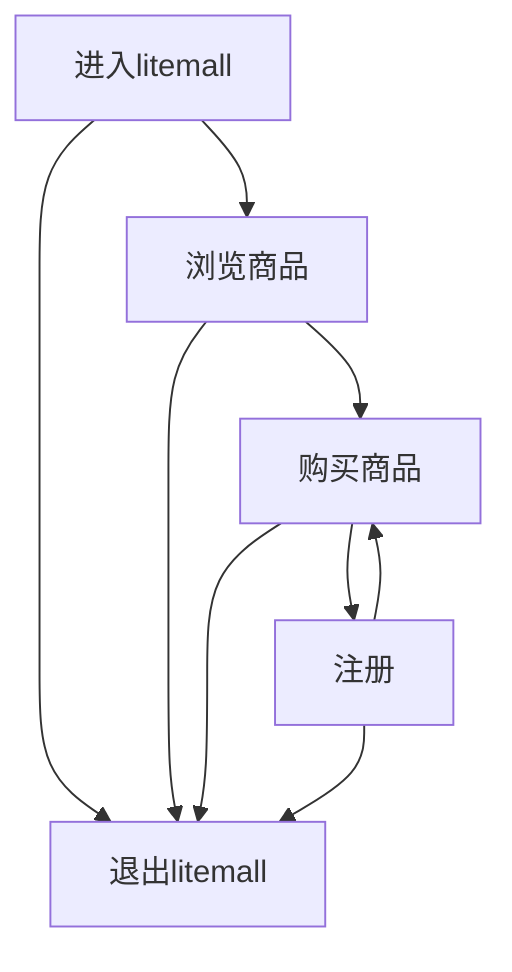
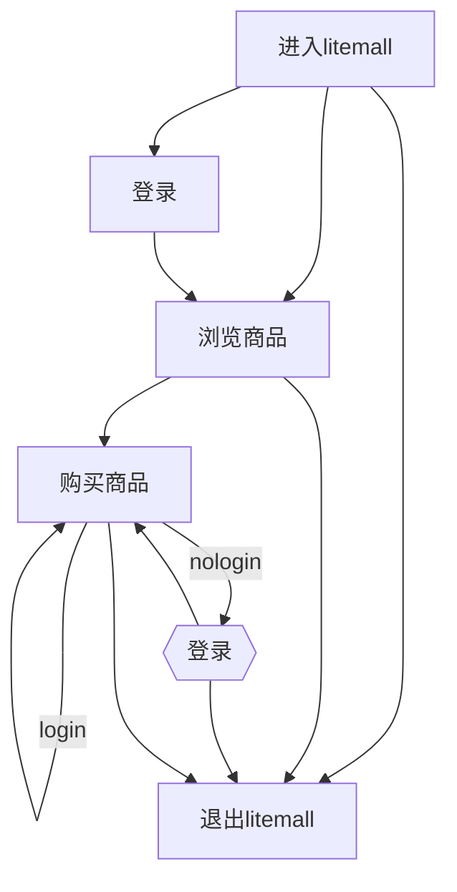
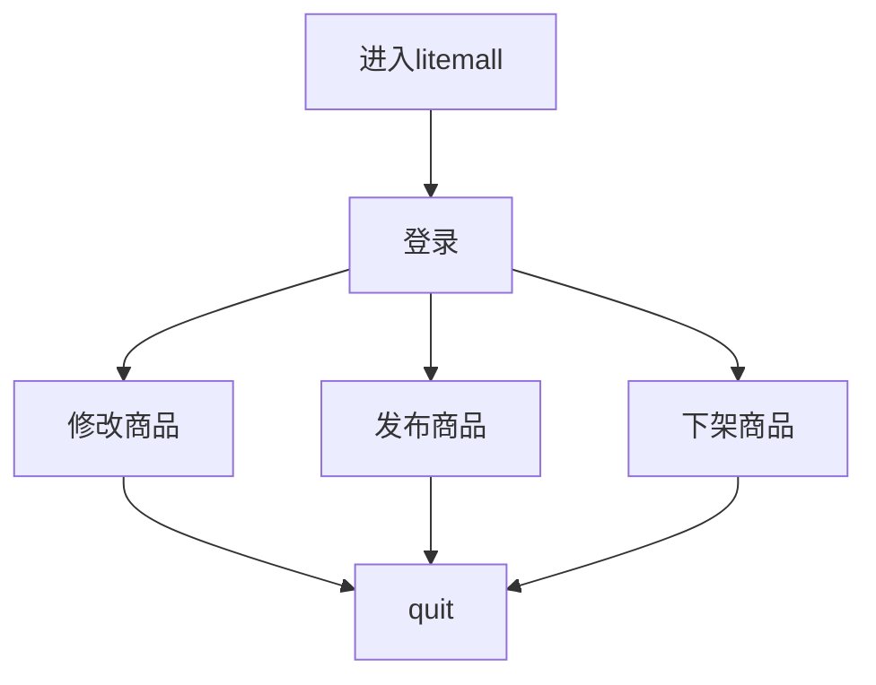

# Litemall性能测试实战_02需求分析

说在前面: 初次系统的学习全流程性能测试,所以先通过摘抄书籍重点内容以加强自身记忆,后续再根据实际项目做思考和修改

## 前言

### 所要完成的两项工作

1. 采集性能测试需求
   采集对象包括
   业务交易,业务量,业务指标,业务量趋势,
   用户信息,
   系统架构,系统硬件指标等
2. 分析性能测试需求
   确定性能测试范围,分析出那些业务纳入性能测试范围及性能指标是什么
   另外要分析用户使用行为,业务分布,分析业务量
   估算出TPS与并发用户数等性能测试执行依据

### 性能测试指标分为两类

1. 业务指标
   TPS, RT(ART), 事务成功率
2. 硬件性能指标
   CPU使用率,内存使用率,磁盘繁忙率等,(具体可参考开源中prometheus+grafana对指标数据的采集)

### 测试需求从何处获取

1. 系统架构
   物理结构与逻辑架构,包括中间件产品与配置,数据库配置,在测试环境建立时,我们要参考
2. 采集业务并量化业务
   我们指计算TPS数的时候会计算到
3. 了解业务扩展趋势
   比如业务年增长率是多少? 未来业务量是多少,比如系统的需求中说道要满足未来三年的业务增长需求
4. 了解系统是否有归档机制
   大家知道数据库中数据量大时候对性能是由影响的,如果有归档价值,可以把一些无用或者过时的信息移到归档库,这样就减少了当前库中的数据,有利于提高系统性能
5. 采集业务发生时段
   比如一天产生20000订单,而高峰期1小时就能完成10000单,而不是平均到每小时,主要再估算TPS与并发用户数时用到
6. 采集在线用户数
   活动用户数,业务分布,有些系统用户量特别大,会对系统造成性能瓶颈,可以通过分析活动用户数和业务分布来分析负载情况
7. 系统是否与第三方系统由关联关系
   这决定我们是否要做系统单板,即用程序来代替第三方系统
8. 采集业务性能指标
   比如响应时间,吞吐量,等
9. 采集系统硬件指标
   CPU利用率,内存利用率,可用内存

### 被测系统分为3类

1. 新应用类
   NP全新立项系统,没有原型系统
2. 升级改造类
   CIP, 旧系统重构
3. 需求变动类
   基于享有业务系统功能需求变更
   基于RFC有可能存在于新应用中,也有可能存在于CIP中,所以实际上我们只讨论新应用类与CIP类,不同类别的系统我们的分析方法会有不同,
   对于新业务系统我们从需求文档中采集性能需求,对于不完善的内容进行补充,
   对于升级类我们分析原型系统业务数据就即可,最直接的办法就是分析原型系统的数据,统计业务量,业务分布等信息

## 需求采集

### 系统架构

本次系统将被测对象定位litemall,是一个开源项目,具体地址为https://github.com/linlinjava/litemall

1. 绘制出环境物理架构
   Linux下部署Mysql,Java,npm,nodejs,并使用同一台虚拟机拉起前端服务
   该虚拟机的规格为2U4G
2. 逻辑架构
   逻辑架构展现的是软件系统中元件之间的关系,比如用户界面,数据库,外部系统接口等等

业务逻辑架构如下

### 业务流程

游客如下

注册用户

说明:

**游客**

1. 被引流过来之后发现平台风格不好看,不喜欢,以及发现被忽悠过来的,就直接退出了litemall
2. 初步浏览商品后,发现商品不感兴趣,直接退出
3. 发现商品还挺优惠的,有想买的冲动
4. 于是去注册,注册完之后继续购买,最后退出

**注册用户**

1. 相比较于游客,多了一个登录的过程

**商家**

1. 商家主要做的是上下架商品,以为修改商品的信息

### 业务相关性能需求

系统初次上线,或者初步初次做测试,初次规划容量,暂定为注册用户规模为10万,每天活跃用户数量为5%,即5K,这个数据参考书本中的比例,实际数据需要参考其他友商的数据

1. 根据初次性能测试说做规划,暂定注册用户规模为10万,即下次规划大规模改善系统性能或重构前的注册用户规模,每天活跃用户数量为5%

2. 用户在商城中以浏览商品,购买商品,登录注册为主.(实际业务情况根据实际分析,或者根据运营人员的数据去规划),日PV预计为2万PV(pageView), 其中浏览,购买登录注册比例约为8:1:1, 即浏览的为1.6万PV, 购买商品为0.2万PV, 登录注册为0.2万PV
   具体业务情况,可使用测试右移技术,对nginx进行监控,以及对其他关键节点打点记录数据

3. 系统业务增长率为30%, 系统在3年内部打算进行分库分表处理,需要系统在性能上能够撑住,也就是隐形要求在3年内不进行数据归档,在测试时候需要3年的存量数据

4. 要求系统能够提供良好的体验,比如各项业务的响应控制在3秒之内

5. 为了系统稳定,要求在日常运营时CPU使用率<70%. 磁盘Disk ime < 70%且无网络瓶颈

   | 指标名称 | 业务量      | 业务增长率 | 响应时间 | 事务成功率 |
   | -------- | ----------- | ---------- | -------- | ---------- |
   | 登录     | 0.1万 PV/天 | 大约30%    | 小于3秒  | 99%        |
   | 注册     | 0.1万 PV/天 | 大约30%    | 小于3秒  | 99%        |
   | 浏览商品 | 1.6万 PV/天 | 大约30%    | 小于3秒  | 99%        |
   | 购买商品 | 0.2万 PV/天 | 大约30%    | 小于3秒  | 99%        |

### 系统硬件指标

系统硬件指标对象时硬件资源,比如CPU,内存,磁盘,网络,网络带宽等等
相关阈值

30% ==> 运行稳定正常

50% ==> 需要开始着重关注

70% ==> 即将要发生故障,或者业务中断

90% ==> 故障已经在发生,用户体验极差

## 需求分析

### 圈定测试范围

1. 确定高频次的业务
2. 确定性能影响大的业务
3. 确定此功能的可验证性
   如果涉及第三方软件,那么就有可能设置单板程序,即编写软件来模拟第三方服务

### 明确性能指标

1. 吞吐量
   日PV是2万, 3年30%增长, 日PV=2 * (1+30%) ^2 约等于3.8万
2. 响应时间
   要求3秒以内
3. 成功率
   要求99%以上
4. 稳定的波动正常范围
   基础设施行业,对于指标的波动,容忍度为5%
5. 其他各项硬件等性能指标

### 分析业务量

我们除了要做足一定数量的历史数据,还得关注业务量的增长

### 计算TPS

1. TPS我们一般取系统业务最高峰期的值
   然后这里需要绘制出各个时间时间段的业务量,即多个业务量的折线图

2. 根据28定律,即在20%的时间,完成80%的事情

   假设最高峰期设计5208 PV, (根据友商数据,或者评估,或者初步上线后的数据评估)
   即TPS = 5208 * 80% / (3600 * 20%) 约等于 5.8 , 即每秒5.8次
   所以根据数据我们估算出TPS

   | 功能     | 高峰期 | TPS  | 响应时间 |
   | -------- | ------ | ---- | -------- |
   | 登录     | 260    | 0.39 | 小于3秒  |
   | 注册     | 260    | 0.39 | 小于3秒  |
   | 浏览商品 | 4166   | 4.64 | 小于3秒  |
   | 购买商品 | 520    | 0.78 | 小于3秒  |

   

### 分析系统协议

1. 我们可以像开发团队咨询,了解程序的架构与协议
2. 我们可以抓包分析

## 并发数计算

通常在互联网产品领域,这个概念会用的比较多,即并发的用户数,而在基础设施行业,比如交换机,核心网网元,就不会有这个概念,因为他们的核心指标是,每秒处理多少的请求,或者业务流

**业内常用的并发数计算方法**

1. 由TPS来估算并发数
2. 有在线活动用户数来估算并发数
3. 根据经验来估算并发数

TPS反映了系统在每秒内可以执行成功的事务数,是由事务数出时间得来,事务由用户完成

**总结为**

Vu(业务名称) = TPS(业务名称) * (RunTime+ThinkTime)

Thinktime行业内一般为3秒, 
每一个提交或者点击,按照0.2秒计算
Runtime 是测试程序/脚本运行(迭代或响应)一次说消耗的时间,包括事务时间+非事务时间

注: Vu(业务名称)表示此业务的虚拟用户数

**计算VU**

1. 不包括非事务时间计算VU
   Vu=TPS*2 = 12  
   2为处理事务所需要的时间 
   即如果按照这个来计算的话,name将要测试并发用户数,以验证系统能够同时承载这么多用户
2. 包括非事务时间计算VU
   Vu=Tps * (2+3) = 29 
   3 为Thinktime
   即如果按照这个来计算的话,name将要测试并发用户数,以验证系统能够同时承载这么多用户

通常按照包括非事务时间来计算Vu

参考书籍: <全栈性能测试修炼宝典>
致谢: 这是一本极好的书,给了我极大的帮助

