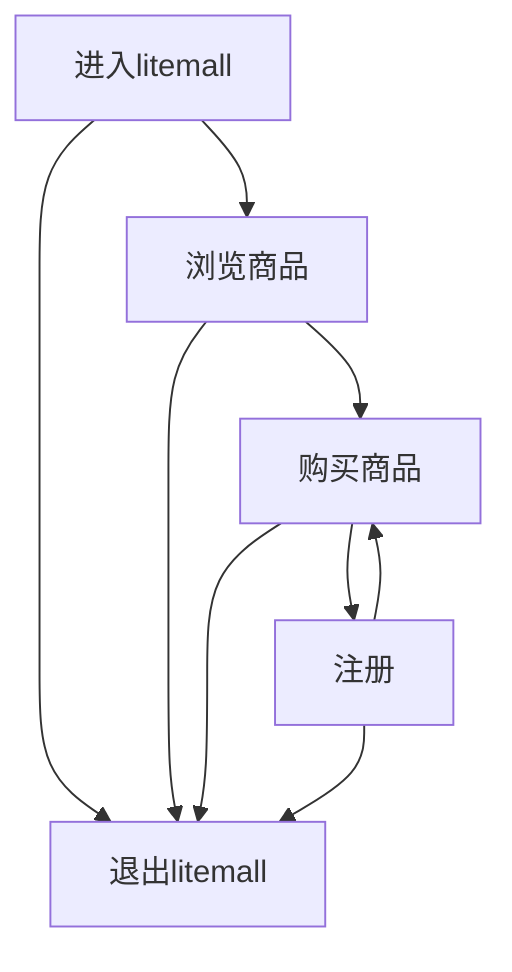
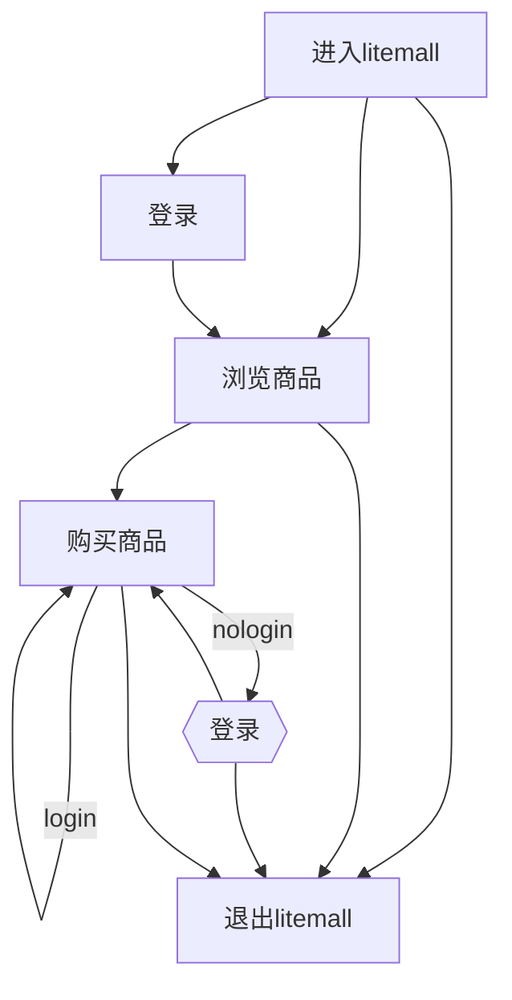
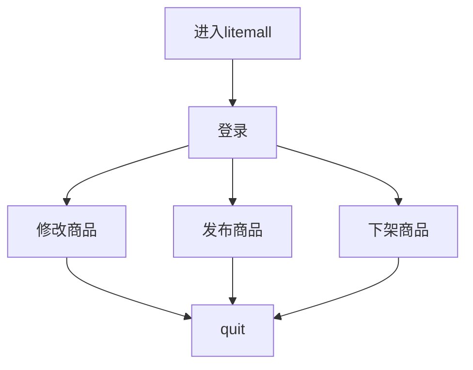
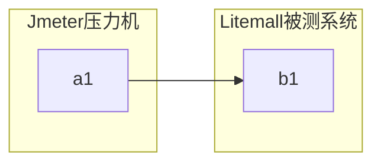

# Litemall性能测试实战_03测试模型

具体的测试模型参考02需求分析,以02的为准,如有不同,这里重复贴图一下,这里为依次实践,所以可能具体的业务分析还待修改

### 业务流程

游客如下

```mermaid
graph TD;
    Enter[进入litemall] --> browse[浏览商品];
    Enter --> quit[退出litemall];
    browse --> buy[购买商品];
    browse --> quit;
    buy --> quit[退出litemall];
    buy --> register[注册];
    register --> buy;
    register --> quit;
```

注册用户

```mermaid
graph TD;
    Enter[进入litemall] --> browse[浏览商品];
    Enter[进入litemall] --> login1[登录];
    login1 --> browse;
    Enter[进入litemall] --> quit[退出litemall];    
    browse --> buy[购买商品];
    buy --> |login| buy;
    buy --> |nologin| login{{登录}};    
    login --> buy;
    browse --> quit;    
    login --> quit;
    buy --> quit;    
    
```

商家管理员

```mermaid
graph TD;
    Enter[进入litemall] --> login[登录];
    login --> fabu[发布商品];
    login --> xiajia[下架商品];
    login --> xiugai[修改商品];    
    xiugai --> quit;    
    fabu --> quit;
    xiajia --> quit;    
```

性能测试模型

```mermaid
flowchart LR
    a1--> b1
    subgraph Jmeter压力机
    a1
    end
    subgraph Litemall被测系统
    b1
    end
 
```

