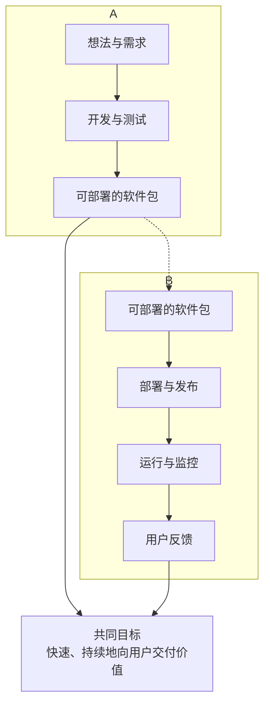

DevOps 和敏捷开发（Agile Development）经常被一起提及，甚至被混淆，但它们解决的是不同层面、不同阶段的问题。

简单来说，它们的核心区别是：

*   **敏捷开发** 关注的是 **“如何更快更好地开发软件”**，侧重于**开发过程**本身。
*   **DevOps** 关注的是 **“如何更快更可靠地交付和运维软件”**，侧重于**开发之后**的交付与运维流程，并将其与开发集成。

下面我们用一张图来直观地展示它们的范围和焦点：

---

为了更清晰地理解，我们从一个详细的对比表格开始：

| 维度         | 敏捷开发                                                     | DevOps                                                       |
| :----------- | :----------------------------------------------------------- | :----------------------------------------------------------- |
| **核心目标** | **快速响应变化**，通过迭代持续交付**有价值的软件**。         | **缩短软件交付生命周期**，实现**持续、高速、高质量**的发布。 |
| **关注范围** | **软件开发过程**（从需求到可工作的软件）。                   | **端到端的价值流**（从代码提交到部署、运维、监控反馈）。     |
| **主要焦点** | **优化开发与测试之间的协作**。                               | **优化开发、测试与运维之间的协作**，打破其间的壁垒。         |
| **实践侧重** | **管理实践**：Scrum, Kanban, 站会, 迭代规划, 回顾会。 **技术实践**：TDD, 结对编程。 | **技术实践**：CI/CD, 基础设施即代码, 自动化, 监控。 **文化实践**：共享责任,  blameless文化。 |
| **团队结构** | 通常是**跨功能的开发团队**（包括开发、测试、产品经理）。     | 强调**开发、运维、安全等角色的深度融合**，甚至组成一个团队。 |
| **产出物**   | 一个**可工作的、经过测试的软件增量**（通常是一个迭代结束时）。 | 一个**已部署上线、正在稳定运行的服务**，并附带完整的监控数据。 |
| **衡量指标** | **速率**、**迭代燃尽图**、**故事点完成率**。                 | **部署频率**、**变更前置时间**、**变更失败率**、**平均恢复时间**。 |
| **周期**     | 以**迭代**为单位，通常1-4周。                                | 以**持续**为单位，理想状态下每次代码提交都可触发部署流程。   |

---

### 深入解读：它们如何互补与合作？

尽管有上述区别，但敏捷和 DevOps 绝对不是对立的，而是**天然互补、相辅相成**的。你可以这样理解它们的关系：

**敏捷开发负责“造”得更快，而 DevOps 负责“运”得更快且更稳。**

#### 一个典型的协作场景：

1.  **敏捷团队**在一个为期两周的迭代中，使用 Scrum 框架，高效地完成了 5 个新功能的开发和质量保证，并打包成一个可部署的 `v1.2.0` 版本。
2.  在过去，这个软件包会被扔给运维团队，可能需要等待数周甚至数月才能被部署上线。
3.  **现在，DevOps 文化和工具链介入：**
    *   代码一旦合并，**CI/CD 流水线**自动启动：编译、代码扫描、运行自动化测试。
    *   测试通过后，自动构建出 **Docker 镜像**。
    *   通过**基础设施即代码**的工具，一键式地准备测试环境和生产环境。
    *   通过**自动化部署**工具（如蓝绿部署、金丝雀发布），将这个新版本安全、平滑地部署到生产环境，整个过程可能只需要几分钟或几小时。
    *   上线后，**监控系统**持续观察运行状态，如有问题立即告警并可能自动回滚。

#### 如果没有 DevOps：
敏捷团队迭代得再快，也会在部署阶段遇到瓶颈，形成所谓的“**部署墙**”。这会导致新功能积压，无法快速交付给用户，违背了敏捷的初衷。

#### 如果没有敏捷：
DevOps 团队自动化了一个缓慢、不频繁的交付流程。虽然部署效率提高了，但源头上的开发速度依然很慢，价值产出依然有限。

### 总结与类比

*   **比喻一：造车与赛车**
    *   **敏捷**是设计和制造赛车的团队，他们不断根据反馈优化赛车设计。
    *   **DevOps**是整个赛车团队，包括维修站。他们确保赛车不仅能造出来，还能快速、安全地换胎、加油、调试，并跑完全程。

*   **比喻二：厨房与送餐**
    *   **敏捷**是厨房里的厨师，他们用高效的协作方式快速做出美味的菜肴。
    *   **DevOps**是服务员、传菜员和收银员组成的系统，确保菜肴能快速、准确、完好地从厨房送到顾客桌上。

**结论：**
一个现代的高效能组织，**既需要敏捷来保证开发侧的效率和灵活性，也需要 DevOps 来保证交付和运维侧的可靠性与速度**。它们共同构成了一个从想法到价值反馈的完整、高速的闭环。