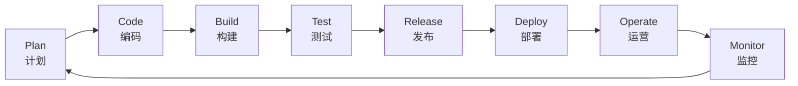

**DevOps** 的全面简介。我会从它的核心思想、为什么需要它、关键实践、常用工具以及它能带来的好处等方面进行阐述。

### 一、什么是 DevOps？

**DevOps** 这个词是 **Development**（开发）和 **Operations**（运维）的组合。它是一种**文化理念、实践和工具的组合**，旨在缩短软件开发生命周期，并以更高的频率、更可靠地交付高质量的软件。

简单来说，DevOps 的核心是：

*   **打破壁垒**： 打破传统企业中开发团队和运维团队之间的隔阂（部门墙）。
*   **自动化一切**： 将软件开发过程中的所有环节（构建、测试、部署、监控等）尽可能自动化。
*   **协作与共享**： 倡导开发、运维、QA（测试）等所有角色在整个应用生命周期中紧密协作。

你可以把它想象成一座桥，连接了软件从“诞生”（开发）到“上岗”（运维）的全过程，让这个过程变得快速、顺畅且高效。

### 二、为什么需要 DevOps？—— 传统模式的痛点

在 DevOps 出现之前，大多数公司采用传统的“瀑布模型”或孤立的团队模式：

1.  **部门墙严重**： 开发团队的目标是“快速发布新功能”，而运维团队的目标是“保持系统稳定”。这两个目标本质上是冲突的，导致互相指责：
    *   **开发说**：“运维不理解我们的需求，部署太慢了！”
    *   **运维说**：“开发写的代码质量太差，一上线就出问题！”

2.  **发布周期漫长**： 一次发布需要经历漫长的开发、测试、部署流程，可能数月才发布一次，无法快速响应市场和用户的需求。

3.  **手动操作，容易出错**： 部署过程大量依赖手动操作，效率低下且极易出错。

4.  **问题反馈慢**： 线上环境的问题需要很长时间才能反馈到开发人员那里，修复成本极高。

DevOps 正是为了解决这些痛点而生。

### 三、DevOps 的核心文化与实践（The DevOps Way）

DevOps 不仅仅是一套工具，更首先是一种文化和一套实践方法。其中最著名的实践是 **DevOps 生命周期循环**，通常用一个无限的符号来表示，强调持续性和自动化。

这个循环的每一个阶段都贯穿着**自动化**和**协作**的理念。

### 四、DevOps 的主要好处

1.  **极快的发布速度**： 从每年发布几次，到每天发布成千上万次（例如，Amazon、Netflix）。
2.  **更高的软件质量**： 持续的自动化测试和集成保证了代码质量。
3.  **更高的可靠性**： 自动化的、标准化的部署流程和基础设施即代码（IaC）使部署更加可靠、可预测。
4.  **增强的协作**： 团队目标一致，沟通效率大幅提升。
5.  **快速的问题修复**： 监控系统能快速发现问题并反馈，平均恢复时间（MTTR）大幅缩短。
6.  **更高的安全性**： 将安全实践集成到自动化流程中（DevSecOps）。

### 五、常见的 DevOps 工具链

DevOps 依赖强大的工具链来实现自动化。以下是一些代表性工具：

| 阶段                           | 代表工具                                                     |
| :----------------------------- | :----------------------------------------------------------- |
| **代码管理与协作**             | **Git** (GitLab, GitHub, Bitbucket)                          |
| **持续集成与持续部署 (CI/CD)** | **Jenkins**, GitLab CI, GitHub Actions, CircleCI             |
| **自动化测试**                 | Selenium, JUnit, pytest, Cypress                             |
| **基础设施即代码 (IaC)**       | **Terraform**, Ansible, Puppet, Chef                         |
| **容器化与编排**               | **Docker**, **Kubernetes**                                   |
| **监控与日志**                 | **Prometheus**, Grafana, ELK Stack (Elasticsearch, Logstash, Kibana) |

### 总结

**DevOps 是一场地道的软件工程文化和实践革命。** 它通过**打破组织壁垒、强化自动化、强调度量和共享**，构建了一条从代码到用户的**高速公路**，使得企业能够更快、更可靠地构建、发布和运营软件，从而在激烈的市场竞争中脱颖而出。

它不是一个可以购买的现成产品，而是一个需要整个组织共同努力去拥抱和践行的持续改进过程。