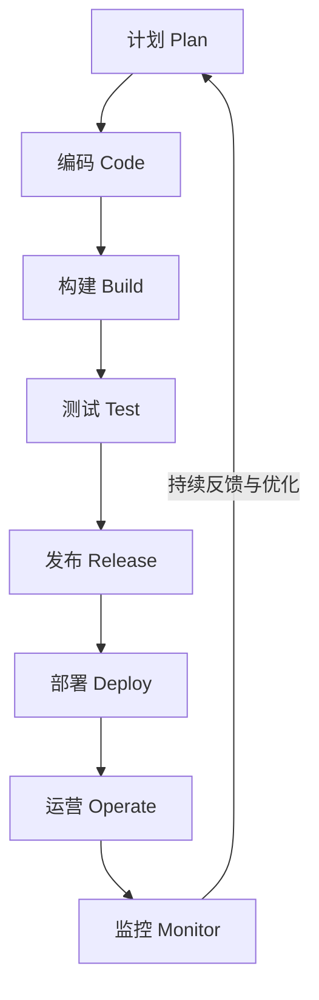

好的，我们用一种简单、直观的方式来理解 DevOps 的流程。

可以把 DevOps 想象成一个**无限的循环**，这个循环的核心目标是：**更快、更频繁、更可靠地交付软件价值**。它打破了传统开发（Dev）和运维（Ops）之间的墙，让它们融为一体。

这个循环主要包含以下 8 个核心阶段，如下图所示：

下面我们来详细解读每个阶段做的事情和常用的工具。

---

### DevOps 流程的八个核心阶段

#### 1. 计划 (Plan)
*   **做什么：** 确定要开发什么功能、修复什么 Bug、优先级是什么。这里需要开发、测试、运维和产品经理共同参与。
*   **关键：** 将大任务拆分成小任务，以便快速交付。
*   **常用工具：** Jira, Trello, Notion, GitHub Projects。

#### 2. 编码 (Code)
*   **做什么：** 程序员编写代码。
*   **关键：** 使用**版本控制系统**（如 Git）来协作和管理代码。代码被存放在共享仓库中，大家通过分支和合并请求（Pull Request）来协作。
*   **常用工具：** Git, GitHub, GitLab, Bitbucket。

#### 3. 构建 (Build)
*   **做什么：** 将代码编译、打包成一个可以运行的软件。比如，将 Java 代码编译成 JAR 包，或者将应用程序和它的环境一起打包成一个 **Docker 镜像**。
*   **关键：** 实现**自动化**。每次提交代码后都自动触发构建，确保能快速发现问题。
*   **常用工具：** Jenkins, GitLab CI, GitHub Actions, Maven, Gradle, Docker。

#### 4. 测试 (Test)
*   **做什么：** 自动化地测试软件质量，确保新代码没有破坏现有功能。
*   **测试类型包括：**
    *   **单元测试：** 测试最小的代码单元。
    *   **集成测试：** 测试多个模块组合在一起是否正常工作。
    *   **性能测试：** 测试软件在高负载下的表现。
*   **关键：** 自动化测试是保证频繁发布而不翻车的基石。
*   **常用工具：** Selenium, JUnit, pytest, JMeter, Cypress。

#### 5. 发布 (Release)
*   **做什么：** 为发布做准备。一旦测试通过，就可以决定将软件发布到生产环境。
*   **关键：** **审批流程自动化**。可以设置一些规则，比如“所有自动化测试通过后，自动批准发布”。

#### 6. 部署 (Deploy)
*   **做什么：** 将软件部署到生产环境，让用户可以使用。
*   **关键：** 使用**自动化部署**和**现代化部署策略**，让发布过程平滑、无感、可快速回滚。
    *   **蓝绿部署：** 准备两套环境，切换流量即可发布和回滚。
    *   **金丝雀发布：** 先让一小部分用户使用新版本，没问题再全面推开。
*   **常用工具：** Kubernetes, Ansible, Terraform, ArgoCD, Spinnaker。

#### 7. 运营 (Operate)
*   **做什么：** 软件在生产环境运行起来后，确保其稳定、可用。运维团队负责维护基础设施（服务器、网络等）。
*   **关键：** 基础设施也通过代码来管理（**基础设施即代码，IaC**），使得环境搭建和配置可以自动化和版本化。
*   **常用工具：** Kubernetes, Docker, Terraform, AWS, Azure。

#### 8. 监控 (Monitor)
*   **做什么：** 7x24 小时监控线上软件的性能和用户行为。收集日志、指标等信息。
*   **关键：** **监控是闭环的终点，也是新循环的起点**。通过监控发现的问题（比如 Bug、性能瓶颈、用户体验问题）会直接反馈到“计划”阶段，从而开启下一个改进和发布的循环。
*   **常用工具：** Prometheus, Grafana, ELK Stack (Elasticsearch, Logstash, Kibana), Datadog, New Relic。

---

### 核心思想总结

*   **自动化一切 (Automate Everything)：** 从构建、测试到部署，能自动化的绝不手动操作。
*   **协作文化 (Culture of Collaboration)：** 开发、测试、运维不再是独立的部门，而是同一个团队，为共同的目标负责。
*   **持续一切 (Continuous Everything)：**
    *   **持续集成 (CI)：** 频繁地将代码集成到主干，并自动构建和测试。
    *   **持续交付/部署 (CD)：** 软件可以随时被可靠地发布到生产环境。
*   **反馈循环 (Feedback Loops)：** 通过监控快速获取反馈，并持续改进产品。

简单来说，DevOps 就是一个 **“自动化流水线”**：代码从提交开始，自动经过一系列工序（构建、测试、部署），最终安全地交付给用户，并从用户那里获取反馈，从而开始下一个改进循环。