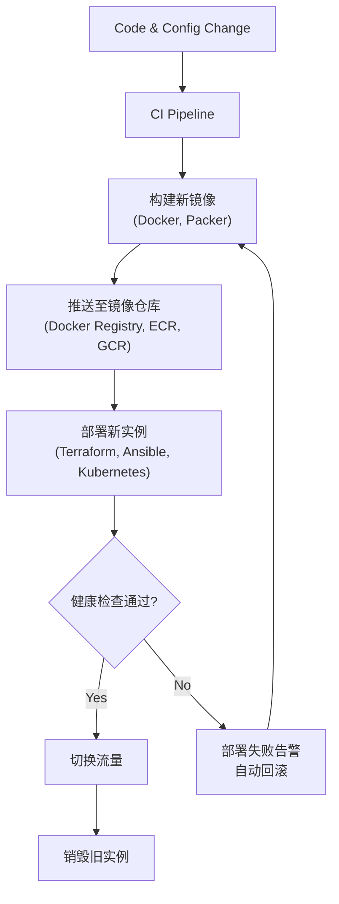

不可变基础设施是现代化运维和云原生架构的基石之一。下面我将为您详细拆解其技术方案，包括核心原则、技术栈、实施步骤和最佳实践。

---

### 一、核心思想再理解

**可变基础设施 (Mutable Infrastructure):**
*   **模式：** 部署一台服务器（或虚拟机），命名为 `server-A`。每次需要更新应用、修改配置或打补丁时，都通过 SSH 连接到 `server-A` 上进行操作。这台服务器的状态会随时间推移不断变化。
*   **问题：** 容易导致**配置漂移 (Configuration Drift)** 和**雪花服务器 (Snowflake Server)**。即：`server-A` 和理论上应该一样的 `server-B` 变得完全不同，且`server-A`的当前状态成了一个“谜”，难以复制，极易导致部署时的一致性问题。

**不可变基础设施 (Immutable Infrastructure):**
*   **模式：** 任何变更都不在现有服务器上直接修改。而是通过**构建一个全新的、包含所有更新和配置的镜像**，然后**部署这个新镜像并销毁旧实例**来实现。
*   **优势：**
    1.  **一致性：** 每个实例都来自同一个已知状态的镜像，100%一致。
    2.  **可追溯性：** 每个镜像都有一个唯一ID（如哈希值），可以追溯到生成它的代码和配置。
    3.  **简单可靠的部署与回滚：** 部署新版本和回滚到旧版本只是切换流量并销毁新/旧实例的操作，非常简单、快速、可靠。
    4.  **安全性：** 减少了被攻击的面，因为运行中的实例不会被修改，且生命周期短。

---

### 二、技术方案与工具链

实现不可变基础设施需要一个完整的技术工具链来支持。下图清晰地展示了从代码变更到新实例上线的核心工作流及其对应的工具栈：



以下是每个环节的详细说明和技术选型：

#### 1. 构建镜像 (Build Image)

这是实现不可变的基础。你需要将你的应用程序、运行时环境、依赖库、配置文件等所有东西都打包成一个标准化的镜像。

*   **容器镜像 (当前最主流和灵活的方案):**
    *   **技术：** **Docker**
    *   **怎么做：** 编写 `Dockerfile` 来定义镜像内容。
        ```dockerfile
        # 使用一个确定版本的基础镜像，保证一致性
        FROM alpine:3.18
        # 安装依赖
        RUN apk add --no-cache openjdk17-jre
        # 将构建好的应用jar包（从CI流水线中来）复制到镜像中
        COPY target/my-app.jar /app/my-app.jar
        # 定义启动命令和配置（配置可在启动时通过环境变量注入）
        CMD ["java", "-jar", "/app/my-app.jar", "--spring.profiles.active=${ENV}"]
        ```
    *   **优点：** 轻量、快速、可移植性极强、分层构建缓存。

*   **虚拟机镜像 (在需要特定内核或非容器化环境的场景使用):**
    *   **技术：** **HashiCorp Packer**
    *   **怎么做：** 编写 `packer.json` 模板文件，定义如何从一个基础ISO或云镜像开始，通过一系列配置器（如Shell, Ansible）来安装和配置软件，最终生成一个新的云镜像（如AWS AMI, Azure VHD）。
    *   **优点：** 更适合需要深度定制操作系统或运行不适合容器化的工作负载（如数据库，但数据库是否应该不可变仍有争议）。

#### 2. 存储与版本化镜像 (Store & Version Image)

构建好的镜像需要被集中存储和管理，并且必须有明确的版本号。

*   **技术：** **容器镜像仓库:** Docker Hub, Harbor, AWS ECR, Google GCR, Azure ACR。
*   **怎么做：**
    *   镜像标签必须包含版本信息，**严禁使用默认的 `latest`**。
    *   推荐使用**语义化版本** (`v1.2.3`) 或**Git Commit SHA** (`githash`) 作为标签。
    *   `docker push my-registry.com/my-app:git-abc1234`

#### 3. 部署与编排 (Deploy & Orchestrate)

这是“替换”动作发生的地方。工具需要根据新版本的镜像来创建新的计算实例，并纳入负载均衡。

*   **容器编排平台 (首选的自动化方案):**
    *   **技术：** **Kubernetes**
    *   **怎么做：** 你不需要直接管理服务器。你通过提交一个部署清单（YAML）来声明你的期望状态。
        ```yaml
        # deployment.yaml
        apiVersion: apps/v1
        kind: Deployment
        metadata:
          name: my-app
        spec:
          replicas: 3
          selector:
            matchLabels:
              app: my-app
          template: # 这里定义Pod模板，即一个“实例”的模板
            metadata:
              labels:
                app: my-app
            spec:
              containers:
              - name: my-app
                image: my-registry.com/my-app:git-abc1234 # 指定新镜像版本
                ports:
                - containerPort: 8080
        ```
    *   **工作流程：** 当你修改 `image` 字段并执行 `kubectl apply -f deployment.yaml` 时，Kubernetes 的控制器会执行**滚动更新**：创建新的 Pod（实例），等待它们通过健康检查，然后逐步终止旧的 Pod。这完美体现了不可变基础设施的理念。

*   **基础设施即代码工具 (用于配置底层资源):**
    *   **技术：** **Terraform**, **OpenTofu**, Pulumi
    *   **怎么做：** 如果你的应用是运行在虚拟机上的，你可以用 Terraform 来定义虚拟机实例模板，该模板指向一个新的 AMI ID（由 Packer 生成）。当你更新 AMI ID 并执行 `terraform apply` 时，Terraform 会先创建新的虚拟机，然后销毁旧的。

#### 4. 配置管理 (Configuration Management)

“不可变”并不意味着配置不能变，而是意味着配置的变更要和镜像构建一起走流程。配置应在**构建时**或**启动时**注入，而不是在运行时修改。

*   **构建时注入：** 在 `Docker build` 阶段通过 `--build-arg` 传入参数。**不推荐**，因为这会使同一个镜像在不同环境不一致，破坏了一致性。
*   **启动时注入 (推荐)：**
    *   **环境变量：** 最常用的方式。在Kubernetes的Deployment YAML或Docker `run` 命令中指定。适合大多数应用配置。
        ```yaml
        env:
        - name: DB_URL
          valueFrom:
            secretKeyRef:
              name: app-secret
              key: database-url
        ```
    *   **配置文件挂载：** 将ConfigMap或Secret以文件形式挂载到容器中。适合复杂的配置文件（如Nginx config, Java properties文件）。
    *   **配置中心：** 如Spring Cloud Config, Consul, Apollo。应用在启动后主动从中心拉取配置。这增加了一点复杂性，但提供了动态配置的能力（可视为对不可变模式的一种妥协和增强）。

---

### 三、实施步骤与最佳实践

1.  **容器化你的应用：** 这是最容易入手的起点。编写 `Dockerfile`，确保本地可以成功构建和运行。
2.  **建立自动化CI流水线：** 使用Jenkins, GitLab CI, GitHub Actions等。流水线的核心任务是：**代码变更 -> 运行测试 -> 构建镜像 -> 推送镜像**。
3.  **采用Kubernetes进行编排：** 即使你先从单节点的K3s或MicroK8s开始，也要使用其Deployment等资源来管理你的应用。学习基本的YAML编写。
4.  **实现GitOps工作流（进阶）：** 使用ArgoCD或FluxCD等工具。**将你的部署清单（YAML文件）也放在Git仓库中**。当镜像仓库中有新镜像推送时，或者当YAML文件本身变更时，GitOps工具会自动同步变更到Kubernetes集群。这实现了整个过程的完全自动化化和可审计。
5.  **处理数据持久化：** 这是不可变基础设施的主要挑战。对于有状态服务（如数据库），通常：
    *   **数据与计算分离：** 将数据存储在容器之外的持久化存储中（如AWS EBS, EFS, 云数据库RDS）。这样销毁容器实例不会破坏数据。
    *   **对有状态服务采用“半不可变”模式：** 即基础镜像和软件版本是不可变的，但数据是持久化的。更新时，在旧容器旁启动一个新版本容器，进行数据迁移或验证后，再切换和销毁旧容器。**对于生产环境的核心数据库，传统的、谨慎的升级方式可能更合适。**

通过这套组合拳，你就能真正实现“任何变更都通过替换而非修改来实现”，从而获得不可变基础设施所带来的所有巨大优势：一致性、可靠性和部署的轻松愉悦。