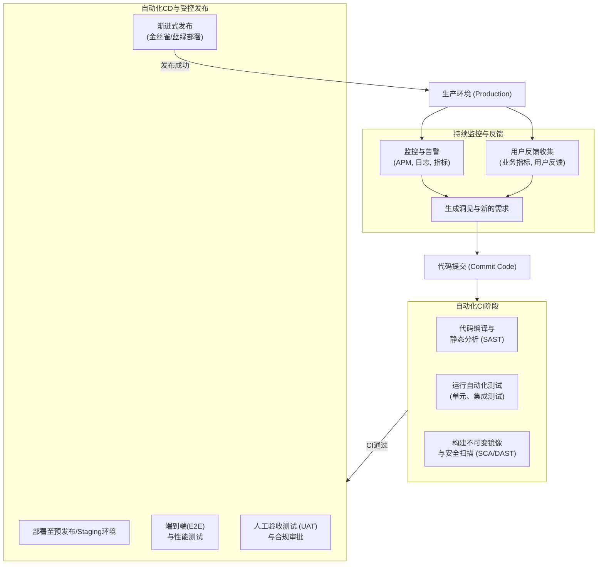

从代码提交到代码在生产环境运行，是一个自动化与人工保障相结合的精益流程，其目标是**安全、快速、可靠地交付价值**。

整个流程可以概括为以下几个核心阶段，它形成了一个从开发到运维再到监控反馈的完整闭环：

下面我将为您详细分解每一个阶段需要做的事情、用到的工具和背后的理念。

---

### 阶段一：代码提交与 CI（持续集成）流水线

**目标：** 快速验证代码更改的质量和安全性，并生成不可变的交付物。

1.  **代码提交 (Commit & Push)**
    *   **事情：** 开发者在功能分支上完成工作后，向共享仓库（如 GitLab, GitHub）发起合并请求（Merge Request / Pull Request）。
    *   **最佳实践：** 小步提交、清晰的提交信息、关联需求或缺陷单号。

2.  **自动化代码扫描**
    *   **静态应用程序安全测试 (SAST)：** 扫描源代码中的安全漏洞、硬编码密码等。
        *   **工具：** SonarQube, Checkmarx, Snyk Code, Semgrep。
    *   **代码质量分析：** 检查代码风格、复杂度、重复率等。
        *   **工具：** SonarQube, ESLint, Pylint。

3.  **自动化构建与编译**
    *   **事情：** 将源代码编译成可执行文件（如Java -> JAR）、或打包依赖。
    *   **工具：** Maven, Gradle, NPM, Go Build, .NET CLI。

4.  **运行自动化测试（第一道质量门禁）**
    *   **单元测试 (Unit Tests):** 快速、隔离地测试最小代码单元。**必须快速**。
    *   **集成测试 (Integration Tests):** 测试模块间的集成。
    *   **工具：** JUnit, pytest, Jest, TestNG。通常由 CI 工具（如 Jenkins, GitLab CI）触发。

5.  **构建不可变镜像**
    *   **事情：** 将应用程序及其所有依赖（运行时、系统库、配置）打包成一个**不可变的镜像**。这是现代交付的黄金标准。
    *   **工具：** Docker build -> Docker Image。
    *   **关键：** 使用版本明确的标签（如 `git commit hash`），严禁使用 `latest`。

6.  **漏洞扫描与软件成分分析 (SCA)**
    *   **事情：** 对生成的 Docker 镜像进行扫描，检查基础镜像和第三方库的已知漏洞。
    *   **工具：** Trivy, Grype, Snyk, Clair。
    *   **策略：** 发现高危漏洞可自动失败流水线。

7.  **推送制品到仓库**
    *   **事情：** 将测试通过、扫描干净的镜像推送到制品仓库存储。
    *   **工具：** Docker Registry, JFrog Artifactory, Harbor, Nexus Repository。

---

### 阶段二：CD（持续交付/部署）与预发布流水线

**目标：** 将经过验证的制品安全、可控地部署到生产环境。

1.  **部署到预发布（Staging）环境**
    *   **事情：** 将新镜像部署到一个尽可能模拟生产环境的环境。
    *   **工具：** Kubernetes (`kubectl set image`), Helm, ArgoCD, Terraform。

2.  **进行更全面的测试**
    *   **端到端测试 (E2E Tests)：** 在Staging环境模拟真实用户场景进行测试。
        *   **工具：** Selenium, Cypress, Playwright。
    *   **集成测试 (与外部服务)：** 测试与第三方API、支付网关等的集成。
    *   **性能测试：** 压测API，评估响应时间和资源消耗是否符合预期。
        *   **工具：** JMeter, k6, Gatling。
    *   **动态应用程序安全测试 (DAST)：** 对运行中的Staging环境进行安全扫描。
        *   **工具：** OWASP ZAP, Burp Suite。

3.  **人工验收与审批（第二道质量门禁）**
    *   **事情：** 测试工程师进行手动探索性测试，产品经理或业务方进行验收测试（UAT）。运维或安全团队可能需要进行合规性审批。
    *   **理念：** 这是一个关键的人工卡点，确保自动化测试无法覆盖的业务逻辑和用户体验是正确的。

---

### 阶段三：生产环境发布

**目标：** 以最小化风险的方式，将新功能逐步暴露给用户。

1.  **制定发布策略**
    *   **金丝雀发布 (Canary Release):** 先将新版本部署给一小部分用户（如1%），监控指标正常后再逐步扩大范围。
    *   **蓝绿部署 (Blue-Green Deployment):** 准备一套与当前生产环境（蓝）完全相同的新环境（绿），部署新版本后，将流量一次性从蓝环境切换到绿环境。回滚只需切回蓝环境。
    *   **滚动更新 (Rolling Update):** 逐步替换旧版本的实例（Kubernetes原生支持）。
    *   **功能开关 (Feature Flags):** 将新功能代码隐藏在开关后面，无需部署即可动态开启/关闭功能，用于灰度发布或A/B测试。
        *   **工具：** LaunchDarkly, Unleash。

2.  **执行部署**
    *   **事情：** 使用CD工具执行上述选定的发布策略。
    *   **工具：** ArgoCD (用于K8s), Spinnaker, GitLab CD, Jenkins CD。

3.  **生产环境冒烟测试**
    *   **事情：** 部署完成后，立即运行一套最核心的测试用例，确保应用在生产环境的基本功能是正常的。

---

### 阶段四：生产环境监控与反馈

**目标：** 验证发布是否成功，并形成闭环，指导下一步开发。

1.  **实时监控与告警**
    *   **事情：** 密切关注发布后的各项指标。
    *   **监控维度 (四大黄金指标):**
        *   **流量 (Traffic):** 请求量、QPS。
        *   **错误率 (Error Rate):** HTTP 5xx/4xx 错误数量。
        *   **延迟 (Latency):** P95, P99响应时间。
        *   **饱和度 (Saturation):** CPU、内存、磁盘I/O使用率。
    *   **工具：** Prometheus, Grafana, Datadog, New Relic, ELK Stack (日志)。

2.  **用户反馈与业务指标观察**
    *   **事情：** 观察新功能是否带来预期的业务价值。
    *   **方式：** 分析业务指标（如转化率、订单量）、查看用户反馈、监控社交媒体舆情。

3.  **回滚 (Rollback)**
    *   **事情：** 如果监控到关键指标异常（如错误率飙升），应立即启动回滚流程，将系统恢复到上一个稳定版本。
    *   **理念：** **回滚能力是发布策略设计的重中之重**。一个好的流程必须允许快速、低风险的回滚。

### 总结

这个过程远不止是“编译和部署”。它融合了：

*   **自动化：** 覆盖构建、测试、扫描、部署的每一步。
*   **质量内建：** 将测试和安全左移，问题发现得越早，修复成本越低。
*   **可控性与可观测性：** 通过渐进式发布和全面监控，以最小风险交付价值。
*   **协作文化：** 开发、测试、运维、安全团队共同为交付流程负责。

一个成熟的团队会致力于将上述几乎所有步骤自动化，形成一条高效、可靠的**部署流水线**，从而能够自信地频繁发布。