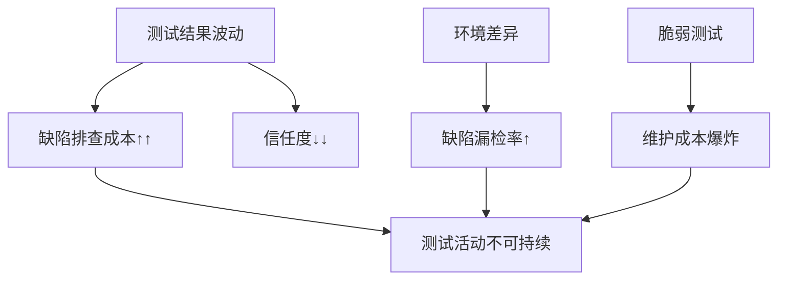

从**稳定性**角度分析软件产品的**可测试性**，是指评估软件在测试过程中能否**持续、可靠地保持预期行为**，避免因系统波动、环境干扰或自身缺陷导致测试结果失真。稳定性差的系统会使测试活动陷入“噪声迷宫”——难以区分真实缺陷与环境干扰，严重削弱测试的有效性和可信度。

以下从五个关键维度展开稳定性对可测试性的影响及优化策略：

---

### 一、**测试目标的稳定性：被测系统的确定性**
#### **问题场景**
- 内存泄漏导致长时间测试后性能衰退，掩盖真实瓶颈。  
- 随机数算法未隔离，相同输入产生不同输出，破坏测试可重复性。  
- 多线程竞争引发偶发性崩溃，缺陷难以复现。  

#### **高可测试性设计原则**
1. **无状态设计**  
   - 业务逻辑与状态分离（如RESTful服务），避免会话残留污染后续测试。  
   - *测试收益*：测试顺序无关性，支持并行测试。  
2. **确定性逻辑**  
   - 封装随机性（注入`RandomService`接口，测试时替换为固定序列）。  
   - 并发操作使用线程安全数据结构（如`ConcurrentHashMap`）。  
3. **资源闭环管理**  
   - 自动释放资源（连接池、文件句柄），防止资源耗尽导致测试中断。  
   ```java
   try (Connection conn = dataSource.getConnection()) { // 自动关闭连接
     // 测试逻辑
   }
   ```

---

### 二、**测试环境的稳定性：基础设施的可控性**
#### **典型干扰源**
| 干扰类型         | 测试影响案例                            |
| ---------------- | --------------------------------------- |
| **环境漂移**     | 生产与测试环境JDK版本差异引发兼容性错误 |
| **依赖服务波动** | 第三方API超时导致自动化测试随机失败     |
| **数据污染**     | 残留测试数据影响订单流水号唯一性校验    |

#### **稳定性加固策略**
1. **环境即代码（IaC）**  
   - 使用Terraform/Ansible定义环境，确保每次测试从相同基准启动。  
2. **服务虚拟化**  
   - 用MockServer模拟依赖服务，返回**稳定响应**（即使模拟故障也是确定性的）。  
3. **数据库沙盒**  
   - 每个测试用例在独立事务中运行，自动回滚数据（`@Transactional`）。  
   ```python
   @pytest.fixture(autouse=True)
   def clean_db():  # 每个测试后清理数据库
     yield
     db.reset()
   ```

---

### 三、**测试执行的稳定性：过程抗干扰能力**
#### **脆弱测试（Flaky Test）的根源**
- **异步等待失效**：UI测试因元素加载延迟随机失败。  
- **时序敏感逻辑**：定时任务未完成即进行结果校验。  
- **全局状态冲突**：多测试共享静态变量导致结果交叉污染。  

#### **稳健性提升方案**
1. **自适应等待机制**  
   ```java
   WebDriverWait wait = new WebDriverWait(driver, 10); // 显式等待
   wait.until(ExpectedConditions.visibilityOfElementLocated(By.id("submit")));
   ```
2. **异步操作同步化**  
   - 监听事件回调（如Kafka消息消费完成通知）而非固定`sleep`。  
3. **测试隔离设计**  
   - JUnit 5的`@TestInstance(Lifecycle.PER_CLASS)` + 并行锁控制。  

---

### 四、**测试结果的稳定性：输出的一致性**
#### **结果波动陷阱**
- 性能测试中因CPU抢占导致响应时间波动±200ms。  
- 日志时间戳包含毫秒值，导致快照比对失败。  

#### **结果归一化技术**
1. **去噪指标采集**  
   - 性能测试取多次运行**分位数P90**（排除偶发峰值）。  
2. **确定性输出格式化**  
   - JSON序列化强制字段排序（`JsonPropertyOrder`）。  
3. **容忍度断言**  
   ```python
   assert result == pytest.approx(3.14, abs=0.01)  # 允许浮点误差
   ```

---

### 五、**测试资产的稳定性：用例的可持续性**
#### **维护成本黑洞**
- 前端CSS选择器变更导致100个UI测试失败。  
- 接口版本升级后测试脚本批量报错。  

#### **资产韧性构建**
1. **抗变更定位策略**  
   - 优先使用语义化属性（`data-testid="submit-button"`）而非XPath路径。  
2. **契约测试**  
   - 用Pact验证服务接口兼容性，防止提供方破坏消费者测试。  
3. **测试分层免疫**  
   ```mermaid
   graph LR
   A[单元测试] -->|覆盖核心算法| B[业务稳定]
   C[API测试] -->|验证接口契约| D[技术细节隔离]
   E[UI测试] -->|仅验用户流| F[前端变更影响最小化]
   ```

---

### 稳定性不足对测试的致命影响


---

### 高稳定性可测试性的实践框架
1. **设计阶段**  
   - 采用**容错模式**（断路器、重试策略），确保异常路径可稳定触发。  
2. **实现阶段**  
   - 关键模块植入**自检探针**（如内存占用监控），实时捕获退化。  
3. **测试阶段**  
   - **混沌工程注入**：可控故障验证系统韧性（如Simian Army）。  
4. **部署阶段**  
   - **蓝绿部署**：新旧版本并行运行，支持A/B测试结果比对。  

---

### 终极结论：稳定性是可测试性的“信任锚点”
- **高质量测试** = **稳定性** ×（可观察性 + 可控性）  
- **没有稳定性**，可观察性沦为“观察噪声”，可控性退化为“失控开关”。  
- 投资稳定性本质是降低测试的**熵值**——让每一次测试执行都成为可复现的科学实验，而非概率性占卜。  

> **稳定者生存**：在持续交付的战场上，只有通过稳定性考验的测试资产才能成为守护质量的可靠防线。