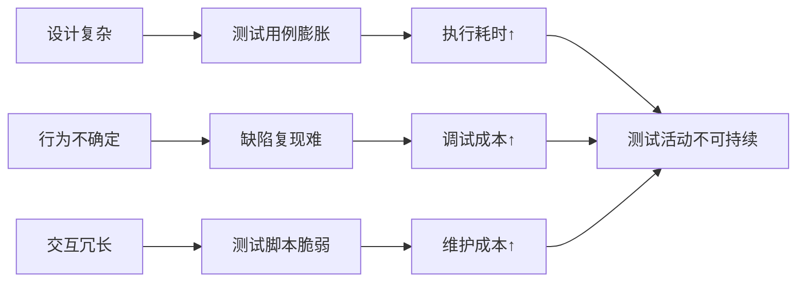

从**简单性**角度分析软件产品的**可测试性**，是指评估系统是否通过**降低认知复杂度、减少意外行为和简化交互路径**，使测试活动能够**高效、准确且低成本**地执行。简单性是可测试性的“加速器”——它通过消除不必要的复杂性，让测试资源聚焦于核心质量验证。

以下从四个维度解析简单性与可测试性的深层关联：

---

### 一、**设计简单性：降低测试的认知负荷**
#### **复杂设计的测试代价**
- **反模式**：一个订单处理类包含价格计算、库存锁定、物流调度等10个职责。  
- **测试影响**：  
  - 需构造超复杂测试场景覆盖所有分支组合 → 测试用例爆炸性增长。  
  - 修改价格逻辑可能意外破坏库存功能 → 测试范围模糊不清。  

#### **简单性原则与测试收益**
| **设计原则**     | **简化机制**                                   | **测试效率提升**                               |
| ---------------- | ---------------------------------------------- | ---------------------------------------------- |
| **单一职责原则** | 拆分为`PriceCalculator`、`InventoryService`    | 单元测试精准靶向，修改价格逻辑仅需重测计价模块 |
| **约定优于配置** | 框架自动处理事务/日志（如Spring Boot Starter） | 无需为基础设施编写冗余测试                     |
| **最少知识原则** | 模块仅与直接依赖交互                           | 集成测试只需模拟相邻依赖                       |

```java
// 复杂设计 → 难测试
class OrderService {
  void processOrder() {
    calculatePrice();   // 价格计算
    lockInventory();    // 锁库存
    scheduleDelivery(); // 调度物流
  }
}

// 简单设计 → 易测试
class OrderService {
  private PriceCalculator priceCalc;
  private InventoryService inventory;
  
  // 测试时可单独验证价格逻辑
  void calculatePrice(Order order) {
    priceCalc.execute(order);
  }
}
```

---

### 二、**行为简单性：消除测试的不确定性**
#### **“意外行为”对测试的破坏**
- 全局配置隐式修改组件行为（如`FeatureFlag`开启导致验证逻辑变化）。  
- 多线程非确定执行引发偶现缺陷，测试难以复现。  

#### **简化策略**
1. **幂等性与无状态**  
   - 相同输入始终产生相同输出 → 测试结果可重复验证。  
2. **显式替代隐式**  
   - 禁用魔术变量（如全局`TIME_ZONE`），改为参数传递：  
     ```python
     def format_time(dt, timezone):  # 显式时区参数
         return dt.astimezone(timezone)
     ```
3. **防御性编程**  
   - 非法输入立即报错而非静默容错 → 错误路径易触发和捕获。

---

### 三、**交互简单性：缩短测试路径**
#### **复杂交互的测试困境**
- 完成一次支付需：登录 → 选商品 → 填地址 → 选支付方式 → 3DS认证。  
- UI测试脚本长达200行，维护成本极高。  

#### **交互简化方案**
1. **接口扁平化**  
   - 将多步流程合并为原子操作：  
     ```rest
     POST /checkout  // 一次性提交订单+支付
     Body: {items, address, paymentToken}
     ```
2. **状态机显式化**  
   - 定义有限状态转换（如订单：`CREATED → PAID → SHIPPED`），测试仅需验证状态跳转。  
3. **测试专用入口**  
   - 提供绕过冗余步骤的测试API：  
     ```bash
     curl -X POST /test/create-paid-order  # 直接创建已支付订单
     ```

---

### 四、**测试资产简单性：提升可维护性**
#### **复杂测试的维护噩梦**
- 一个端到端测试脚本包含：数据库初始化、API调用、UI操作、结果校验 → 任一环节失败即整体崩溃。  
- 断言语句冗长：  
  ```java
  assert response.get("status").equals("success") 
      && response.get("code") == 200 
      && response.getBody().contains("orderId");
  ```

#### **简化实践**
1. **分层测试金字塔**  
   ```mermaid
   pie
       title 测试资产分布
       "单元测试" : 70
       "集成测试" : 20
       "端到端测试" : 10
   ```
2. **组合式断言**  
   ```python
   # 使用Hamcrest等工具提升可读性
   assert_that(response, 
       has_status(200) 
       and has_json_field("status", "success")
   ```
3. **测试数据工厂**  
   - 用`OrderFactory.createPaidOrder()`替代手动构建订单对象。  

---

### 简单性不足的连锁反应


---

### 高简单性系统的测试优势
| **维度**       | **测试效率提升**                    | **案例**                      |
| -------------- | ----------------------------------- | ----------------------------- |
| **用例设计**   | 用例数减少50%+（因分支组合简化）    | 价格计算逻辑从20个用例降至5个 |
| **缺陷定位**   | 平均定位时间缩短70%（因依赖链清晰） | 直接锁定`TaxCalculator`模块   |
| **自动化维护** | 脚本变更成本降低90%（因接口稳定）   | 支付接口升级仅修改1个测试类   |

---

### 简单性设计实践框架
1. **代码层面**  
   - **函数级简单性**：一个函数只做一件事（如`validateEmail()`而非`validateAndSaveUser()`）。  
   - **复杂度监控**：SonarQube设置圈复杂度阈值（CC < 10）。  
2. **架构层面**  
   - **垂直拆分**：按业务域划分微服务（用户/订单/支付）。  
   - **异步解耦**：消息队列替代同步调用（Kafka解耦库存与订单）。  
3. **测试策略层面**  
   - **契约测试**：验证接口兼容性，避免“链式破坏”（Pact工具）。  
   - **可视化测试**：用Cucumber+Living Documentation生成可读用例。  

> **终极价值**：简单性通过**降低认知熵**，将测试从“破解复杂谜题”变为“验证明确目标”。它是应对软件复杂性膨胀的终极武器——当系统简单到“显然正确”，测试便能以最小成本捕获最大风险。