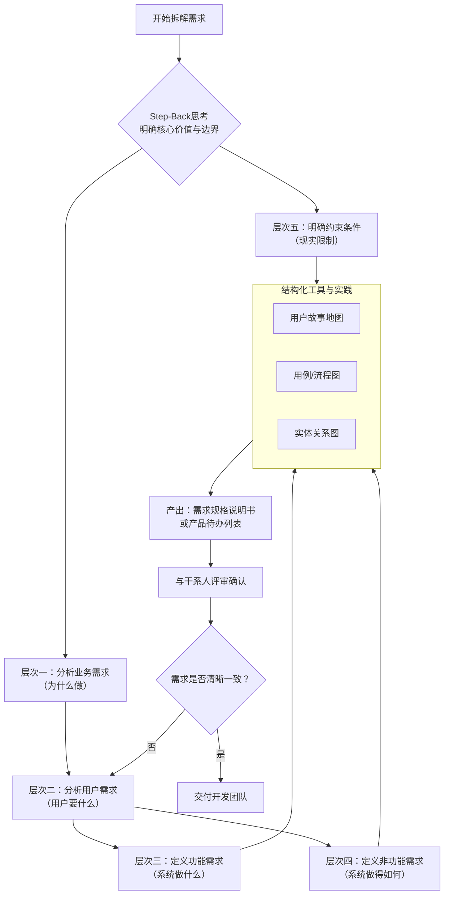

# 如何系统的拆解分析需求

要系统性地拆解和分析软件需求，我们需要采用一个**结构化、多层次**的方法。这不仅仅是列出功能清单，更是要深入理解问题的本质、用户的目标和系统的约束。

我将遵循 **Step-Back思考范式**，先构建一个宏观的分析框架，再进行渐进式深度分解。

### **第一步：Step-Back思考 - 建立宏观认知框架**

在开始具体拆解前，我们先退后一步，回答几个根本问题：

1.  **核心价值是什么？** 这个软件要解决什么根本问题？为用户/客户创造什么核心价值？（例如：提升效率、降低成本、创造新的娱乐方式、连接人与人）
2.  **边界在哪里？** 软件系统的范围是什么？什么在系统内，什么在系统外？（这有助于避免“范围蔓延”）
3.  **关键干系人是谁？** 除了最终用户，还有谁会影响或受系统影响？（如：客户、开发团队、测试团队、运维、管理者等）

---

### **第二步：渐进式深度分解 - 需求分析的层次化模型**

我们可以将需求想象成一个金字塔，从抽象到具体，从商业到技术。

#### **层次一：业务需求 - 战略层面**
这是需求的根源，回答“为什么”要做这个系统。
-   **目标：** 提升市场份额20%、将客户服务成本降低15%、实现一个新的商业模式。
-   **分析方法：** 与决策者、产品负责人沟通，分析市场数据和竞争环境。
-   **产出物：** 项目愿景与范围文档、商业案例。

#### **层次二：用户需求 - 用户体验层面**
从用户视角描述他们需要完成什么“任务”或达到什么“目标”。这是**用户故事** 的源头。
-   **目标：** “作为一个[用户角色]，我想要[完成某件事]，以便于[实现某个价值]”。
    -   例如：*“作为一个购物者，我想要快速搜索商品，以便于快速找到我想买的东西。”*
-   **分析方法：** 用户访谈、问卷调查、现场观察、创建用户画像。
-   **产出物：** 用户故事地图、用户画像、用户体验流程图。

#### **层次三：功能需求 - 系统行为层面**
这是最常被想到的“需求”，具体描述系统“应该做什么”。它直接源于用户需求。
-   **目标：** 详细描述系统的功能点。
    -   承接上例：“系统应提供关键词搜索框”、“系统应支持按分类、价格、品牌筛选”、“系统应显示搜索结果的缩略图、名称和价格”。
-   **分析方法：** 从用户故事和流程中提取功能点。使用**用例** 或**用户故事** 的验收标准进行细化。
-   **产出物：** 功能需求列表、用例规格说明、用户故事及其验收标准。

#### **层次四：非功能需求 - 系统品质层面**
描述系统“运行得如何”，是系统的质量约束。**这部分极易被忽略，但至关重要。**
-   **类别：**
    -   **性能：** 响应时间（如页面加载<2秒）、吞吐量（如支持10000用户同时在线）。
    -   **安全性：** 数据加密、权限控制、防SQL注入等。
    -   **可用性：** 界面直观易用，学习成本低。
    -   **可靠性：** 系统宕机时间（如99.99%可用性）、容错能力。
    -   **可扩展性：** 未来能否容易地增加功能或支持更多用户。
    -   **兼容性：** 支持哪些浏览器、操作系统、设备。
-   **分析方法：** 通过场景化提问（“如果同时有1万人访问会怎样？”）、行业标准、干系人期望来挖掘。
-   **产出物：** 非功能需求规格说明书，通常以“系统应能...”的形式描述。

#### **层次五：约束条件 - 现实限制层面**
描述项目必须遵守的规则和限制。
-   **类型：**
    -   **技术约束：** 必须使用Java语言、必须与现有某系统集成、必须部署在阿里云上。
    -   **业务约束：** 必须在6个月内上线、预算不超过100万。
    -   **法规约束：** 必须符合GDPR（数据保护条例）、网络安全法。
-   **产出物：** 通常在项目章程或需求文档的引言部分明确。

---

### **第三步：结构化拆解工具与实践方法**

为了将上述层次落地，需要具体的工具和方法。

#### **1. 用户故事地图**
这是一个强大的可视化工具，将用户故事按用户活动（Activities）、任务（Tasks）、步骤（Steps）组织成一张地图。它能帮你：
-   **看清全局：** 避免陷入功能细节而丢失整体业务流程。
-   **排定优先级：** 清晰地划分第一个版本应该实现的核心功能（“行走的骨架”）和后续迭代的功能。

#### **2. 用例**
一种更结构化的方式描述用户与系统的交互，特别适合复杂的业务流程。
-   **组成部分：** 主要成功场景、扩展场景（分支流程）、前置条件、后置条件。

#### **3. 流程图/时序图/状态图**
-   **流程图：** 描述整个业务的步骤和逻辑分支。
-   **时序图：** 清晰展示不同对象（用户、界面、后端服务）之间按时间顺序的交互消息。
-   **状态图：** 描述一个特定对象（如“订单”）在其生命周期内所有可能的状态（待支付、已支付、发货中、已完成）以及触发状态转换的事件。

#### **4. 实体关系图**
识别系统需要管理的核心数据实体（如用户、商品、订单）以及它们之间的关系。这是数据库设计的基础。

---

### **总结：一个可操作的拆解流程**

为了更直观地展示这个结构化过程，我们可以用以下流程图来总结：

**最后，请记住：**
-   **沟通是核心：** 需求分析不是闭门造车，要持续与用户、开发、测试等干系人沟通。
-   **需求是会变的：** 采用敏捷思维，拥抱变化，将需求视为渐进明细的过程。
-   **可测试性：** 每个需求（尤其是功能需求）都应该是可验证的。清晰的验收标准是关键。

通过这个系统性的方法，你可以确保需求拆解得全面、深入、结构清晰，为后续的设计、开发和测试打下坚实的基础。