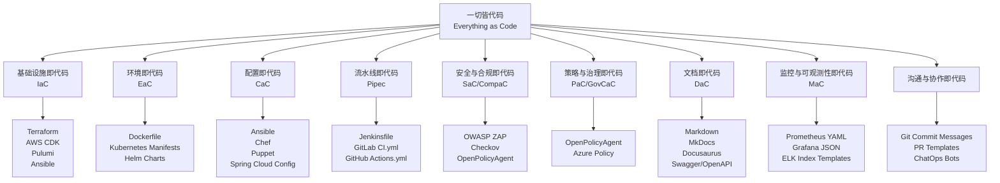

“一切皆代码” (Everything as Code) 是 DevOps 和实践中的核心原则，它通过将软件交付生命周期中的几乎所有元素都代码化、版本化和自动化，来**显著提升交付的速度、可靠性、安全性和一致性**。它远不止是基础设施即代码 (IaC)。

下面我将为你详细列举“一切皆代码”所包含的方方面面，并附上具体做法和技术方案。我将这些内容归纳为几个核心领域，以便你更好地理解其全貌。

下面我来详细说明图表中每个部分的具体内容和技术实现。

### 🗂️ 基础设施即代码 (IaC)

基础设施即代码 (IaC) 是用代码和配置文件来定义和管理计算、存储、网络等基础设施资源的方法。通过版本控制、代码审查和自动化测试等软件工程实践，IaC 能确保基础设施变更的可重复性、一致性和可审计性，是“一切皆代码”理念的源头和核心实践之一。

| 方面               | 具体内容与技术方案                                           |
| :----------------- | :----------------------------------------------------------- |
| **云资源编排**     | 定义虚拟网络、子网、安全组、负载均衡器、数据库实例等。**技术**: Terraform, AWS CloudFormation, Azure Resource Manager (ARM) Templates, Google Cloud Deployment Manager, Pulumi, OpenTofu。 |
| **服务器配置管理** | 自动化操作系统的配置、软件包的安装、服务的启动和配置。**技术**: Ansible (无代理，YAML语法易懂), Chef, Puppet, SaltStack。 **做法**: 编写 Playbook (Ansible)、Cookbook (Chef) 或 Manifest (Puppet) 来描述服务器的期望状态。 |
| **网络配置**       | 定义防火墙规则、路由表、网关、DNS 记录等。**技术**: 通常集成在云资源编排工具中 (Terraform), 或使用厂商特定工具 (如 Cisco NAPALM, Juniper PyEZ)。 |
| **安全基础架构**   | 定义 IAM (身份与访问管理) 角色、策略、密钥管理、加密证书。**技术**: Terraform, AWS IAM 策略文档, Vault 策略即代码。 |

### 📦 环境即代码 (EaC)

在基础设施即代码 (IaC) 的基础上，环境即代码 (EaC) 进一步通过容器镜像构建文件（如 Dockerfile）等环境描述性脚本，来定义应用运行所需的环境，包括操作系统、中间件、数据库及其他依赖资源。

| 方面             | 具体内容与技术方案                                           |
| :--------------- | :----------------------------------------------------------- |
| **容器镜像构建** | 以文本文件（Dockerfile）定义容器镜像的构建步骤，包括基础镜像、依赖安装、环境变量、启动命令等，从而实现环境描述脚本化。**技术**: Dockerfile, Buildah, Kaniko。 |
| **容器编排**     | 定义容器如何部署、扩展和管理。**技术**: Kubernetes YAML/Helm Charts, Docker Compose, HashiCorp Nomad Jobs。 **做法**: 编写 YAML 文件来定义 Deployment, Service, Ingress, ConfigMap, Secret 等资源。 |
| **环境依赖**     | 定义环境所需的外部服务，如特定版本的数据库、缓存、消息队列。**技术**: 通常通过容器编排或 IaC 工具来一并定义和创建。Docker Compose 很适合在本地定义复杂的服务依赖。 |

### ⚙️ 配置即代码 (CaC)

配置即代码 (CaC) 强调将应用配置、环境配置和部署流程等通过代码化和脚本化方式进行管理，并借助配置管理工具实现自动化，以确保交付的一致性和可靠性。

| 方面                                 | 具体内容与技术方案                                           |
| :----------------------------------- | :----------------------------------------------------------- |
| **应用配置**                         | 管理不同环境（开发、测试、生产）的应用配置文件。**技术**: 将配置存储在环境变量、云厂商的 Parameter Store (AWS SSM) 或 Secrets Manager、HashiCorp Vault 中，并在部署时注入。或者使用 Spring Cloud Config, Apollo 等配置中心，其配置本身也以代码形式存储。 |
| **特性开关 (Feature Toggles)**       | 将功能发布的开关配置代码化。**技术**: 使用像 LaunchDarkly, Unleash 这样的特性管理平台，其开关状态和规则可以通过 API 或配置文件定义和版本控制。 |
| **数据库迁移 (Database Migrations)** | 将数据库结构变更（DDL）和数据变更（DML）脚本化、版本化。**技术**: Liquibase, Flyway, Django Migrations, Alembic (Python SQLAlchemy)。 **做法**: 每次变更都编写一个增量 SQL 脚本或定义文件（如 Liquibase 的 XML/YAML/JSON），并纳入版本控制。 |

### 🔄 流水线即代码 (Pipeline as Code)

| 方面                 | 具体内容与技术方案                                           |
| :------------------- | :----------------------------------------------------------- |
| **CI/CD 流水线定义** | 将构建、测试、部署的整个流程以代码形式定义。**技术**: Jenkinsfile (Groovy), GitLab CI/CD (.gitlab-ci.yml, YAML), GitHub Actions (.github/workflows/*.yml, YAML), Azure Pipelines (YAML), Tekton, Drone。 **做法**: 在代码库中创建对应的配置文件，描述流水线的各个阶段、任务、执行环境和触发条件。 |
| **质量门禁与审批**   | 将代码质量扫描、测试覆盖率阈值、安全扫描规则和部署审批流程代码化。**技术**: 通常在 CI/CD 工具的配置文件中定义，例如：在 Jenkinsfile 中定义 `post { always { archiveArtifacts ... } }`，或在 GitLab CI 中定义 `coverage` 正则表达式。SonarQube 的质量Profile也可以导出为代码。 |

### 🔒 安全与合规即代码 (Security/Compliance as Code)

安全与合规即代码旨在通过可代码化、自动化的方式，将安全策略和合规性要求嵌入到开发和交付流程中，以实现持续的安全与合规验证，并减少人工审计的负担。

| 方面               | 具体内容与技术方案                                           |
| :----------------- | :----------------------------------------------------------- |
| **安全扫描与审计** | 将安全漏洞扫描、依赖检查、合规性审计集成到CI/CD流水线中，其策略和规则可通过代码定义。**技术**: OWASP ZAP, Trivy, Grype, Checkov (扫描IaC合规性), OpenSCAP, Inspec。 **做法**: 在流水线中增加安全扫描步骤，并定义失败阈值（如发现Critical漏洞则中断构建）。 |
| **合规性策略定义** | 用代码定义安全与合规策略（如“所有S3存储桶必须加密”）。**技术**: OpenPolicyAgent (OPA) 及其声明性策略语言 Rego, HashiCorp Sentinel, AWS Config Rules, Azure Policy Definitions。 |

### 📋 策略与治理即代码 (Policy/Gov as Code)

| 方面               | 具体内容与技术方案                                           |
| :----------------- | :----------------------------------------------------------- |
| **访问控制与权限** | 用代码定义谁（人或服务）在什么条件下能对什么资源执行什么操作。**技术**: 通常与“安全基础架构”重叠，使用 Terraform 管理 IAM，或使用 OPA/Sentinel 定义更复杂的业务逻辑策略。 |
| **成本优化与治理** | 通过代码定义成本约束和预算告警规则。**技术**: Infracost (与Terraform集成评估成本), CloudHealth, AWS Budgets (可通过Terraform或AWS CLI定义)。 |

### 📖 文档即代码 (Documentation as Code)

文档即代码强调将项目文档、API文档等与源代码一同用轻量级标记语言编写、存储和版本控制，确保文档随代码同步更新和发布，并将其纳入自动化流水线进行构建和部署。

| 方面                  | 具体内容与技术方案                                           |
| :-------------------- | :----------------------------------------------------------- |
| **项目文档与API文档** | 将文档和源代码一起版本化，随代码变更而更新。**技术**: Markdown, AsciiDoc, Swagger/OpenAPI Spec (YAML/JSON), MkDocs, Docusaurus, Jekyll, ReadTheDocs, Slate。 **做法**: 在代码库中创建 `docs` 目录存放 `.md` 文件，使用 Swagger 编写 API 规范，在 CI 中自动构建和发布文档站点。 |

### 📊 监控与可观测性即代码 (Monitoring as Code)

| 方面                 | 具体内容与技术方案                                           |
| :------------------- | :----------------------------------------------------------- |
| **监控仪表盘与告警** | 用代码定义监控指标、仪表盘、告警规则和通知渠道。**技术**: Grafana JSON Model (通过代码导入仪表盘), Prometheus Alerting Rules (YAML), Datadog Dashboards (可通过API以JSON定义), PagerDuty Events API。 **做法**: 将监控配置文件放入Git，通过CI/CD流程应用到监控系统，实现变更可追溯和环境一致性（例如，开发、生产环境使用相同的告警逻辑）。 |
| **日志聚合配置**     | 定义日志的解析规则、索引策略和过滤条件。**技术**: Elasticsearch Index Templates, Logstash Pipelines (可定义为代码文件), Fluentd 配置。 |

### 💬 沟通与协作即代码

| 方面                  | 具体内容与技术方案                                           |
| :-------------------- | :----------------------------------------------------------- |
| **变更通知与ChatOps** | 将关键CI/CD事件（构建失败、部署成功）通过代码配置自动通知到协作工具。**技术**: 在CI/CD流水线中集成 Slack, Microsoft Teams, Discord 的 Incoming Webhook。使用 Hubot, Mattermost 等实现 ChatOps，通过聊天命令触发部署等操作。 |
| **工单与项目管理**    | 将issue模板、合并请求模板、工作流自动化代码化。**技术**: GitHub Issue/PR Templates, Jira Automation Rules, ZenHub。 |

### 🧠 核心指导思想与收益

“一切皆代码”不仅仅是一系列技术实践，更是一种**文化和思维方式的转变**。其核心指导思想和带来的巨大收益在于：

*   **版本控制一切 (Version Everything)**：将所有与项目相关的资产（从项目规范、文档到基础设施、环境配置和测试用例等）都纳入版本控制系统（如Git），为项目提供**单一事实来源**，确保变更可追踪、可回滚，并方便团队协作。
*   **声明式优于命令式 (Declarative over Imperative)**：专注于**定义“期望的状态”**（如“我需要一个运行Nginx的容器”），而不是编写一系列命令来达到这个状态（“安装Nginx，修改配置，启动...”）。这让系统更易于理解和维护，并由工具自动完成状态同步。
*   **自动化一切 (Automate Everything)**：一旦实现代码化，就可以利用CI/CD等自动化工具来执行相关任务，从而减少人工干预，提高效率、可靠性和一致性。
*   **实现一致性与可靠性**：通过代码化和脚本化，可以**通过自动化的方式来驱动，从而实现一致性和幂等性**。
*   **提升交付速度与效率**：自动化处理繁琐工作，让团队能**更专注于创新和解决更大的问题**，从而**更快地交付和迭代**。
*   **增强安全与合规**：安全策略和合规要求被明确定义、版本化并自动执行，**减少了人为疏忽和配置漂移带来的风险**。

### 💡 实施建议与注意事项

1.  **循序渐进**：不要试图一次性覆盖所有方面。从一个痛点开始（例如，先用 Terraform 管理网络，再用 Ansible 配置服务器），逐步推广。
2.  **技能提升与文化转变**：这不仅是工具的改变，更是**思维方式的转变**。需要对团队进行培训，让大家接受“定义而非操作”的心态。
3.  **选择合适的技术栈**：根据你的云环境、技术偏好和社区支持来选择工具。例如，多云首选 Terraform，简单自动化用 Ansible，容器编排无疑是 Kubernetes。
4.  **代码质量与测试**：对待这些“代码”要像对待业务代码一样：**进行代码审查、编写测试（如 Terratest 测试 Terraform 代码）、实施静态分析（如 TFLint, Checkov）**。
5.  **模块化与复用**：将通用组件（如一个标准的网络模块或一个K8s应用部署模块）封装成可复用的模块，提高一致性和维护效率。
6.  **安全地管理Secret**：**永远不要将密码、密钥等敏感信息明文存放在代码库中**。使用 Vault, AWS Secrets Manager 等专业工具，在部署时动态注入。

希望这份详细的清单能帮助你全面理解“一切皆代码”的广阔内涵，并为你的实践提供清晰的指引。