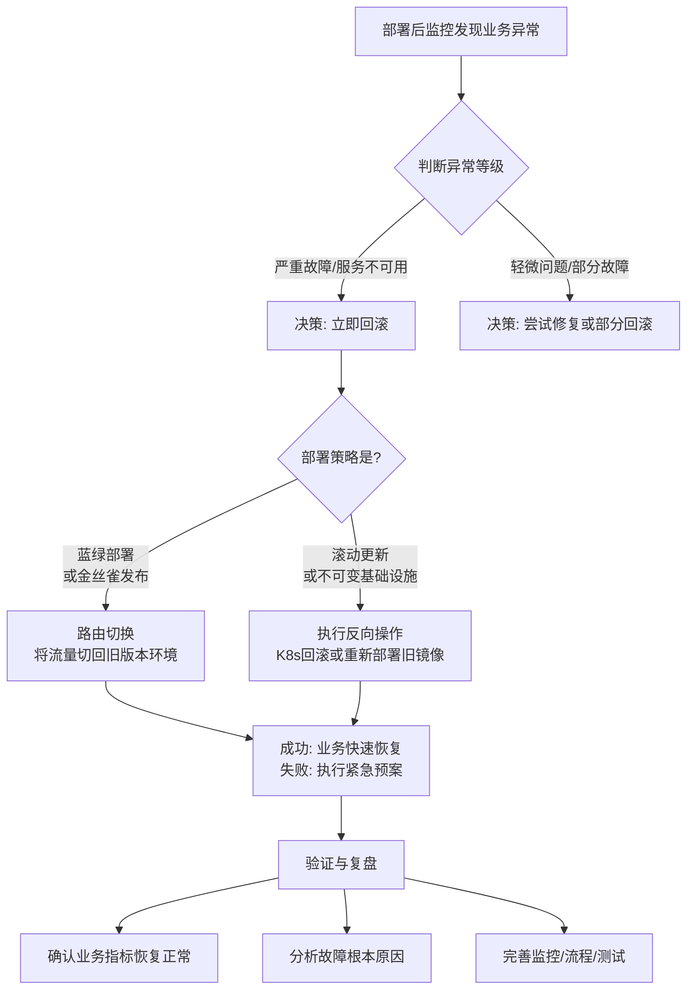

部署后发现问题并决定回滚，这是一个成熟发布流程中必须规划的核心应急方案。这个过程的目标是：**快速、安全地将系统恢复到上一个已知的、稳定的版本，以最小化对用户的影响。**

回滚不是一个单一的“撤销”按钮，而是一个**策略和流程**。其具体过程**高度依赖于你采用的部署策略和技术架构**。

下图清晰地展示了在不同部署策略下，回滚决策与执行路径的差异：

以下是不同部署策略下的回滚流程详解：

---

### 场景一：蓝绿部署 (Blue-Green Deployment) - **最快、最经典的回滚**

这是回滚体验最好的方式，因为旧版本（蓝色）始终在原地待命。

1.  **决策与触发：**
    *   监控系统告警（错误率飙升、延迟增加）或用户/测试人员报告问题。
    *   运维负责人根据预案迅速做出**回滚决策**。

2.  **执行回滚：**
    *   **操作：** 将流量路由（例如，修改负载均衡器的配置或更新API Gateway的规则）**从绿色环境（新版本）切换回蓝色环境（旧版本）**。
    *   **工具：** AWS Route53, Nginx, Istio, Kubernetes Ingress Controller。
    *   **耗时：** **秒级到分钟级**。几乎是瞬间完成。

3.  **后续处理：**
    *   流量切换后，用户请求立即由稳定版的蓝色环境处理，业务恢复。
    *   现在，你可以从容地**下线有问题的绿色环境**，并仔细排查问题所在。

**优点：** 回滚速度极快，风险极低，就像切换电视频道一样简单。

---

### 场景二：滚动更新 (Rolling Update) - **常见于Kubernetes**

Kubernetes原生支持滚动更新，其回滚机制也内置了。

1.  **决策与触发：** （同上）

2.  **执行回滚：**
    *   **操作：** 使用一条命令即可让Kubernetes自动将Pod的镜像版本回退到之前的版本。
    *   **命令：** `kubectl rollout undo deployment/<deployment-name>`
    *   **原理：** Kubernetes会记录每次部署的版本（ReplicaSet）。这条命令会**立即开始用旧版本的Pod替换新版本的Pod**，并遵循你在Deployment中定义的滚动更新策略（最大不可用Pod数等）。

3.  **后续处理：**
    *   通过 `kubectl rollout status deployment/<deployment-name>` 观察回滚状态。
    *   回滚完成后，所有Pod都运行着旧版本的代码。

**优点：** 原生集成，操作简单，自动化程度高。

---

### 场景三：金丝雀发布 (Canary Release) - **精准回滚**

金丝雀发布是逐步放量的，所以它的回滚也更为精细。

1.  **决策与触发：** （同上）

2.  **执行回滚：**
    *   **操作：**
        *   **Scenario A（金丝雀阶段发现问题）：** 如果只对1%的用户发布后就发现问题，只需**将流量规则修改为0%流向新版本，100%流向旧版本**即可。
        *   **Scenario B（全量后发现问题）：** 这实际上就变成了蓝绿部署的回滚模式，需要将所有流量切回旧版本。

3.  **后续处理：** （同上）

**优点：** 因为只影响小部分用户，所以回滚的影响范围也更小。

---

### ⚠️ 所有场景都必须考虑的通用要点和陷阱

无论采用哪种部署模式，以下几个点是回滚时都必须警惕的：

1.  **数据备份与兼容性（最关键的陷阱！）**
    *   **问题：** 如果新版本包含了**破坏性的数据库变更**（如删除了一个字段、修改了表结构），回滚代码到旧版本后，旧版本无法识别新版本写入的数据，会导致更严重的错误！
    *   **解决方案（必须遵守的规则）：**
        *   **向后兼容的数据库变更：** 所有数据库变更（DDL）必须是向后兼容的。例如：
            *   只**增加**新的字段或表，并且允许为NULL或有默认值。
            *   **不要**在部署中删除字段或表。删除操作应在所有代码版本都不再使用该字段后，由一个单独的、后续的变更来完成。
        *   **代码兼容性：** 新版本的代码要能读写旧版本的数据结构。这样在回滚时，旧版本代码也能处理新版本写入的数据（即使它忽略新字段）。
        *   **预写回滚脚本：** 如果变更不可逆转（如删除列），必须在部署前准备好**数据库回滚脚本**，并在回滚代码后**立即执行**，将数据结构恢复回去。

2.  **配置与秘钥管理**
    *   确保旧版本的镜像或代码能够与当前的配置中心、环境变量、秘钥管理系统兼容。如果新版本使用了新的配置项，回滚时旧版本不应因为缺少配置而崩溃。

3.  **监控与验证**
    *   **回滚前：** 确认问题确实存在，避免误操作。
    *   **回滚后：** **必须立即验证**回滚是否成功。查看监控仪表盘，确认错误率下降、延迟恢复正常、核心业务指标健康。

4.  **沟通**
    *   回滚过程应及时通知到所有相关方：开发团队、测试团队、产品经理、客服等。

5.  **事后复盘**
    *   回滚是**一次宝贵的学习机会**，但不是问责的机会。必须召开复盘会议，问五个为什么（5 Whys），分析导致回滚的根本原因，并制定行动项防止未来再次发生。

### 总结：一个可靠的回滚流程

1.  **监控发现异常** -> **人工/自动决策回滚**。
2.  **根据部署策略执行回滚操作**（切换流量 / `kubectl rollout undo`）。
3.  **（关键检查）处理数据兼容性问题**（如果需要）。
4.  **立即验证**业务指标是否恢复正常。
5.  **通知团队**回滚已完成。
6.  **下线故障版本**，保留现场用于分析。
7.  **复盘**，找出根因并改进。

将回滚视为一个**正常的、计划内的运维操作**，而不是一个失败的表现，这是DevOps文化成熟度的一个重要标志。