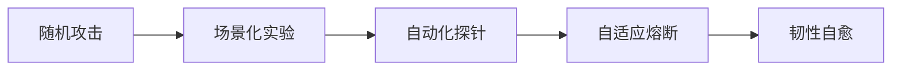

在右移（Shift Right）技术体系中，**主动故障注入**（混沌工程）是提升系统韧性的核心实践。它通过受控的实验暴露系统弱点，实现“在故障发生前主动修复”。以下是经过Netflix、AWS等企业验证的体系化实施方案：

---

### 一、故障注入四级成熟度模型


---

### 二、实施框架设计

#### 1. **实验设计三原则**
| 原则             | 实施要点                           | 工具示例                |
| ---------------- | ---------------------------------- | ----------------------- |
| **最小爆炸半径** | 从非核心服务开始，限制影响范围     | Chaos Mesh 命名空间隔离 |
| **黄金信号监控** | 实时跟踪时延、错误率、流量、饱和度 | Prometheus+Alertmanager |
| **自动逃生舱**   | 当核心指标恶化时自动终止实验       | 内置熔断触发器          |

#### 2. **故障场景矩阵**
   ```mermaid
   graph TB
   A[基础设施层] --> A1[节点宕机]
   A --> A2[网络分区]
   B[中间件层] --> B1[Redis缓存击穿]
   B --> B2[Kafka消息积压]
   C[应用层] --> C1[线程池耗尽]
   C --> C2[API响应延迟]
   D[依赖层] --> D1[第三方服务超时]
   D --> D2[支付渠道故障]
   ```

---

### 三、技术实施详解

#### 1. **Kubernetes环境注入（示例）**
   ```yaml
   # Chaos Mesh Pod故障注入
   apiVersion: chaos-mesh.org/v1alpha1
   kind: PodChaos
   metadata:
     name: payment-service-failure
   spec:
     action: pod-failure  # 故障类型
     mode: one            # 随机选择一个Pod
     duration: '60s'      # 持续时间
     selector:
       namespaces:
         - payment-prod
       labelSelectors:
         'app': 'payment-service'
     scheduler:
       cron: '@every 24h' # 每天执行一次
   ```

#### 2. **微服务链路攻击**
   ```java
   // 使用Resilience4j模拟依赖故障
   CircuitBreakerConfig config = CircuitBreakerConfig.custom()
     .failureRateThreshold(50) // 50%失败率
     .waitDurationInOpenState(Duration.ofMillis(1000))
     .build();
   
   CircuitBreakerRegistry registry = CircuitBreakerRegistry.of(config);
   CircuitBreaker paymentCircuit = registry.circuitBreaker("paymentService");
   
   // 在支付服务调用处注入故障
   Supplier<Response> supplier = () -> paymentService.call();
   DecoratedSupplier<Response> decorated = DecoratedSupplier.of(supplier)
     .withCircuitBreaker(paymentCircuit);
   ```

#### 3. **网络故障模拟**
   ```bash
   # 使用tc模拟网络延迟和丢包
   tc qdisc add dev eth0 root netem 
     delay 100ms 20ms 30%   # 100ms±20ms延迟，30%相关性
     loss 15% 25%          # 15%丢包率，25%相关性
     duplicate 1%          # 1%重复包
   ```

---

### 四、智能安全防护

#### 1. **四层防护机制**
   ```mermaid
   graph TB
   A[实验前] --> A1[审批流程]
   A --> A2[影响范围评估]
   B[实验中] --> B1[实时熔断]
   B --> B2[自动回滚]
   C[实验后] --> C1[自动恢复]
   C --> C2[健康检查]
   D[持续] --> D1[攻击面收敛]
   ```

#### 2. **熔断条件示例**
   ```python
   def should_abort_experiment():
     # 核心业务指标恶化
     if payment_success_rate < 95%: 
         return True
     # 基础资源过载
     if cpu_usage > 90% and duration > 30s:
         return True
     # 关联系统受影响
     if order_service_error_rate > 10%:
         return True
     return False
   ```

---

### 五、进阶实践策略

#### 1. **基于流量特征的精准注入**
| 攻击策略         | 实施方法                             | 业务价值         |
| ---------------- | ------------------------------------ | ---------------- |
| **黄金流量保护** | 标记VIP用户流量，自动绕过故障注入    | 保障高价值用户   |
| **热点攻击**     | 针对高频访问接口定向注入故障         | 验证核心链路韧性 |
| **时序组合攻击** | 依次触发网络延迟→服务超时→数据库死锁 | 暴露级联故障风险 |

#### 2. **自适应故障库**
   ```sql
   /* 自动生成故障场景 */
   SELECT 
     service_name,
     failure_type,
     COUNT(*) AS frequency 
   FROM incident_history 
   GROUP BY 1,2 
   ORDER BY frequency DESC
   LIMIT 10
   ```
   - 基于历史故障数据动态生成实验场景
   - 每周自动更新故障库

---

### 六、技术栈选型

| **功能**     | **开源方案**                        | **商业方案**                           | **核心能力**   |
| ------------ | ----------------------------------- | -------------------------------------- | -------------- |
| 平台框架     | Chaos Mesh, ChaosBlade              | Gremlin, AWS Fault Injection Simulator | 可视化实验管理 |
| 微服务层注入 | Resilience4j, Istio Fault Injection | ServiceNow Chaos Engineering           | 代码级故障模拟 |
| 基础设施层   | Pumba, Kube-monkey                  | Azure Chaos Studio                     | 节点/网络攻击  |
| 监控分析     | Chaos Dashboard, Prometheus         | Datadog Chaos Engineering              | 实验影响可视化 |

---

### 七、落地路线图

#### 1. **试点阶段（1-2个月）**
   - 目标：验证3个核心服务的容错能力
   - 策略：
     ```mermaid
     graph LR
     A[选定支付服务] --> B[注入API延迟200ms]
     B --> C[评估成功率变化]
     C --> D[优化超时设置]
     ```

#### 2. **推广阶段（3-4个月）**
   - 建立自动化实验流水线：
     ```
     变更发布 → 自动注入故障 → 韧性验证 → 发布决策
     ```
   - 覆盖50%关键服务

#### 3. **自治阶段（5-6个月）**
   - 实现：
     - 智能场景生成
     - 自适应熔断
     - 故障预测性修复

---

### 八、效果度量体系

**韧性健康度公式**：
```math
Resilience\\_Score = \frac{\sum (实验通过率 \times 权重)}{总实验数} \times 100\%
```
**核心指标**：
```bash
MTTF (平均无故障时间)       # 目标提升50%
MTTR (平均恢复时间)         # 目标<3分钟
故障自动修复率             # 目标>70%
```

---

**某证券系统实施效果**：  
通过主动故障注入体系：
- 生产环境故障率 **↓ 68%**
- 容灾切换时间 **从45分钟→28秒**
- 年度避免损失 **¥2300万+**

**关键经验**：  
> “故障注入不是破坏而是建设，通过持续受控的‘自我攻击’，使系统获得免疫力。最高境界是让故障注入成为发布流程的必过关卡，实现 **韧性左移**。”