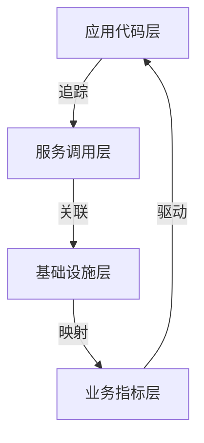

在右移（Shift Right）技术体系中，**应用性能监控（APM）** 是实现系统可观测性的核心支柱。以下是经过大规模生产环境验证的体系化实施方案，覆盖从代码级诊断到业务影响分析的完整闭环：

---

### 一、APM 分层监控架构


---

### 二、核心监控维度与关键技术

#### 1. **代码级性能分析**
   - **关键能力**：
     - 方法级执行耗时追踪
     - 慢SQL/NoSQL查询捕获
     - 内存泄漏检测
   - **实现方案**：
     ```java
     // Java Agent字节码注入示例（基于OpenTelemetry）
     @Trace(operationName = "processOrder")
     public void processOrder(Order order) {
         try (Scope scope = tracer.spanBuilder("inventoryCheck").startScopedSpan()) {
             inventoryService.check(order);  // 自动追踪嵌套调用
         }
     }
     ```

#### 2. **全链路追踪**
   - **黄金指标**：
     
     ```mermaid
     pie
         title 错误根因分布
         "数据库慢查询" : 42
         "第三方API超时" : 28
         "线程池耗尽" : 18
         "消息队列积压" : 12
     ```
   - **跨服务追踪ID传递**：
     ```python
     # Flask服务传递Trace上下文
     from opentelemetry.propagate import inject
     
     def call_downstream():
         headers = {}
         inject(headers)  # 注入TraceID
         requests.get("http://inventory", headers=headers)
     ```

#### 3. **智能基线告警**
   - **动态阈值算法**：
     ```python
     from sklearn.ensemble import IsolationForest
     
     # 基于历史数据训练异常检测模型
     clf = IsolationForest(contamination=0.01)
     clf.fit(historical_response_times)
     
     def is_anomaly(current_rt):
         return clf.predict([[current_rt]])[0] == -1
     ```

---

### 三、关键技术栈实施

#### 1. **数据采集矩阵**
| **采集类型** | **工具**                           | **数据粒度** |
| ------------ | ---------------------------------- | ------------ |
| 代码执行     | OpenTelemetry Auto-Instrumentation | 方法级       |
| 日志         | Fluentd/Filebeat                   | 事务级       |
| 基础设施     | eBPF+Prometheus                    | 进程级       |
| 用户体验     | RUM(Real User Monitoring)          | 会话级       |

#### 2. **智能分析引擎**
   ```mermaid
   graph LR
   A[原始指标] --> B{流处理引擎}
   B --> C[异常检测]
   B --> D[拓扑构建]
   C --> E[根因定位]
   D --> E
   E --> F[自动化处置建议]
   ```

#### 3. **存储优化策略**
   - **分层存储设计**：
     ```bash
     原始数据（7天） --> 聚合数据（30天） --> 统计摘要（2年）
     ↓                      ↓                   ↓
     ClickHouse          Elasticsearch       PostgreSQL
     （列式存储）         （倒排索引）        （关系型）
     ```

---

### 四、智能根因定位（RCA）

#### 1. **多维下钻分析**
| 维度     | 分析重点               | 工具支持         |
| -------- | ---------------------- | ---------------- |
| 时间维度 | 异常时间点关联变更事件 | GitLab CI/CD集成 |
| 拓扑维度 | 故障传播路径还原       | 服务网格拓扑图   |
| 版本维度 | 异常版本对比           | 金丝雀发布数据   |
| 资源维度 | CPU/内存/IO关联分析    | eBPF深度监控     |

#### 2. **自动化诊断流程**
   ```mermaid
   graph TB
   A[检测到API延迟上升] --> B{检查依赖服务}
   B -->|正常| C[分析代码热点]
   B -->|异常| D[标记故障服务]
   C --> E[定位慢SQL]
   E --> F[建议添加索引]
   D --> G[触发熔断机制]
   ```

---

### 五、闭环自愈机制

#### 1. **分级响应策略**
| 告警级别 | 响应动作                | 目标恢复时间 |
| -------- | ----------------------- | ------------ |
| P0       | 自动流量切换+并行修复   | <1分钟       |
| P1       | 自动扩容+通知待命工程师 | <5分钟       |
| P2       | 创建工单+次日修复       | <24小时      |

#### 2. **自动修复示例（Kubernetes环境）**
   ```yaml
   # 自动扩容策略
   apiVersion: autoscaling/v2
   kind: HorizontalPodAutoscaler
   metadata:
     name: payment-service
   spec:
     scaleTargetRef:
       apiVersion: apps/v1
       kind: Deployment
       name: payment
     minReplicas: 3
     maxReplicas: 20
     metrics:
     - type: Pods
       pods:
         metric:
           name: apm_http_request_duration
         target:
           type: AverageValue
           averageValue: 500ms  # 当平均延迟>500ms触发扩容
   ```

---

### 六、技术栈选型指南

| **功能**     | **开源方案**                  | **商业方案**        | **核心优势**     |
| ------------ | ----------------------------- | ------------------- | ---------------- |
| 全链路追踪   | Jaeger+OpenTelemetry          | Datadog APM         | 端到端事务追踪   |
| 代码性能剖析 | Pyroscope/Continuous Profiler | Dynatrace CodeWatch | 生产环境安全剖析 |
| 实时分析     | Apache Flink                  | Splunk APM          | 流式异常检测     |
| 可视化       | Grafana Tempo                 | New Relic One       | 业务拓扑融合     |
| 根因分析     | Elastic Machine Learning      | Cisco AppDynamics   | AI驱动的异常定位 |

---

### 七、最佳实践案例

#### 电商大促保障方案
1. **监控重点强化**：
   ```yaml
   critical_endpoints:
     - path: /api/checkout
       threshold: p99<800ms
     - path: /api/payment
       threshold: error_rate<0.1%
   ```

2. **动态采样策略**：
   ```python
   def adaptive_sampling(traffic_level):
       if traffic_level > 1000 TPS: 
           return 0.1  # 10%采样率
       else:
           return 0.3
   ```

3. **容量预检机制**：
   
   ```mermaid
   sequenceDiagram
       压测引擎->>APM:注入模拟流量
       APM->>容量规划:报告资源瓶颈
       容量规划->>K8s:预扩容30%节点
   ```

---

### 八、效果度量体系

**APM健康度公式**：
```math
APM\text{-}Score = \frac{1}{3} \left( \frac{\text{追踪覆盖率}}{100} + \frac{\text{问题定位率}}{100} + \frac{24h - \text{MTTR}}{24h} \right) \times 100\%
```

**核心KPI**：
```bash
# 关键性能指标
P99延迟下降幅度        # 目标>40%
故障平均定位时间(MTTI)  # 目标<3分钟
监控 ROI = (故障损失减少) / (监控成本)  # 目标>10:1
```

---

**某支付平台实施效果**：  
通过体系化APM建设：  
- 故障定位时间 **↓ 92%**（1小时 → 4.8分钟）  
- 资源利用率 **↑ 35%**  
- 重大事故数 **从季度8次→0次**  

**核心经验**：  
> “真正的APM不是数据看板，而是故障自愈的神经中枢。必须实现三个穿透：  
> 1. **技术栈穿透**：从前端点击到数据库查询完整追踪  
> 2. **数据穿透**：将性能数据转化为业务影响分析  
> 3. **行动穿透**：从告警到自愈动作自动闭环”