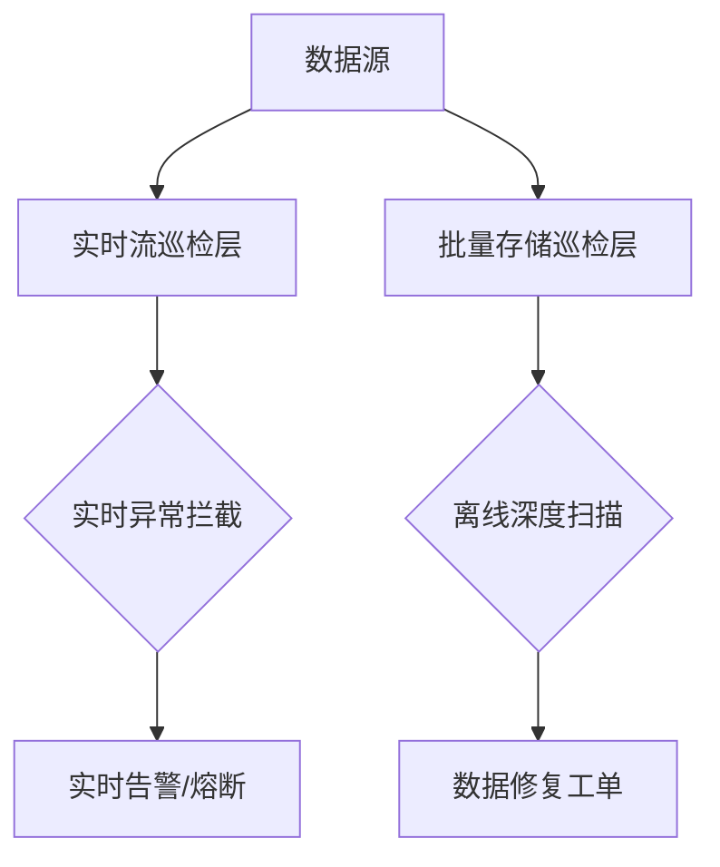

在右移（Shift Right）技术体系中，**数据巡检**是保障生产环境数据质量的核心实践，通过主动探测数据异常、逻辑错误和一致性风险，避免脏数据引发业务故障。以下是体系化的数据巡检实施方案：

---

### 一、数据巡检核心目标
| **风险类型**   | **巡检重点**               | **业务影响案例**               |
| -------------- | -------------------------- | ------------------------------ |
| **准确性风险** | 数值偏差、计算逻辑错误     | 财务报表统计错误导致决策失误   |
| **一致性风险** | 跨系统数据不一致、主键冲突 | 订单与库存数据不一致引发超卖   |
| **完整性风险** | 空值率、字段缺失           | 用户画像缺失关键标签影响推荐   |
| **时效性风险** | 数据延迟、流水断档         | 实时风控因数据延迟漏判欺诈交易 |
| **合规性风险** | 敏感数据泄露、隐私违规     | GDPR罚款、用户信任崩塌         |

---

### 二、分层巡检架构设计


#### 1. **实时流巡检层（毫秒级响应）**
   - **技术栈**：Apache Flink + Apache Pulsar
   - **关键能力**：
     ```python
     # Flink实时数据校验示例
     class DataValidator(ProcessFunction):
         def process_element(self, event, ctx):
             if event["amount"] < 0:  # 金额负值检测
                 ctx.output(alert_tag, f"非法金额: {event['id']}")
             if event["user_id"] is None:  # 关键字段空值检测
                 ctx.output(block_tag, event)  # 阻断问题数据
     ```

#### 2. **批量存储巡检层（T+1深度扫描）**
   - **技术栈**：Great Expectations + Spark SQL
   - **巡检规则配置**：
     ```yaml
     # Great Expectations规则配置
     validations:
       - expectation_type: expect_column_values_to_be_between
         kwargs:
           column: "temperature"
           min_value: -50
           max_value: 100
       - expectation_type: expect_column_pair_values_to_be_equal
         kwargs:
           column_A: "orders.total_amount"
           column_B: "order_details.sum(item_price * quantity)"
     ```

---

### 三、智能巡检策略
#### 1. **动态阈值检测**
   - **场景**：电商GMV波动巡检
   - **方案**：
     - 基于Prophet时间序列预测生成动态阈值
     - 当实际值偏离预测区间3个标准差时告警
     ```
     # 动态阈值SQL示例（BigQuery）
     SELECT day, actual_gmv,
        holt_winters(actual_gmv, 7, 0.2, 0.1) OVER(ORDER BY day) AS predicted
     FROM gmv_daily
     WHERE ABS(actual_gmv - predicted) > 3 * stddev_pop() OVER()
     ```

#### 2. **关联一致性校验**
   - **跨表校验逻辑**：
     ```sql
     /* 订单主表与明细表金额一致性校验 */
     SELECT o.order_id, o.total_amount, SUM(d.item_amount) AS calc_amount
     FROM orders o 
     JOIN order_details d ON o.order_id = d.order_id
     GROUP BY 1,2
     HAVING ABS(o.total_amount - calc_amount) > 0.01  -- 允许1分钱误差
     ```

#### 3. **血缘关系追溯**
   - **实现方案**：
     - 使用Apache Atlas构建数据血缘图谱
     - 当源数据异常时自动标记下游影响范围
     ```mermaid
     graph LR
     S[用户注册表] -->|ETL| A[用户画像表]
     S -->|API| B[营销系统]
     A --> C[推荐引擎]
     ```

---

### 四、关键实施模块
#### 1. **智能基线生成**
| **基线类型** | **适用场景**   | **算法选择**          |
| ------------ | -------------- | --------------------- |
| 统计基线     | 数值型字段分布 | 高斯分布/KDE估计      |
| 模式基线     | 文本/枚举字段  | LSTM序列预测          |
| 关系基线     | 跨字段逻辑约束 | 关联规则挖掘(Apriori) |

#### 2. **分级熔断机制**
   ```mermaid
   graph TB
   A[发现数据异常] --> B{异常等级}
   B -->|P1：关键业务数据| C[阻断数据写入]
   B -->|P2：重要数据| D[标记问题记录]
   B -->|P3：参考数据| E[仅生成告警]
   ```

#### 3. **闭环修复流程**
   1. 巡检系统生成数据缺陷工单
   2. 自动关联影响分析报告
   3. 触发数据补偿任务：
      ```bash
      # 数据修复脚本模板
      spark-submit --class DataRepairJob \
        --sql "UPDATE user SET status=0 WHERE status IS NULL"
      ```

---

### 五、技术栈选型建议
| **功能** | **开源方案**              | **商业方案**         | **适用场景**   |
| -------- | ------------------------- | -------------------- | -------------- |
| 规则引擎 | Great Expectations, Deequ | Informatica DQ       | 结构化数据校验 |
| 实时检测 | Apache Flink, Faust       | StreamSets Dataflow  | 流数据实时拦截 |
| 血缘管理 | Apache Atlas, DataHub     | Collibra Lineage     | 影响范围分析   |
| 可视化   | Superset, Redash          | Alation Data Catalog | 巡检报告展示   |

---

### 六、落地最佳实践
1. **渐进式覆盖**：
   - 阶段1：核心业务表100%覆盖基础规则（非空、主键、枚举值）
   - 阶段2：关键业务链路覆盖一致性规则
   - 阶段3：全量数据覆盖智能基线规则

2. **巡检效能优化**：
   - **分区扫描**：按时间分区增量检查（减少90%扫描量）
   - **采样检测**：对大表使用自适应采样（如T-Digest算法）
   - **规则索引**：为高频校验字段建立统计索引

3. **度量指标体系**：
   ```bash
   # 数据健康度公式
   DATA_HEALTH_SCORE = 
     (通过校验的记录数 / 总记录数) * 70% +
     (异常修复率) * 20% +
     (血缘覆盖度) * 10%
   ```

---

**某电商平台实施效果**：  
通过上述方案，将数据问题导致的线上故障降低82%，关键业务表异常发现时间从平均**6小时**缩短至**15分钟**，数据修复效率提升5倍。**核心经验**：将数据巡检深度嵌入数据处理流水线，建立“校验-拦截-修复-验证”的闭环自治系统。