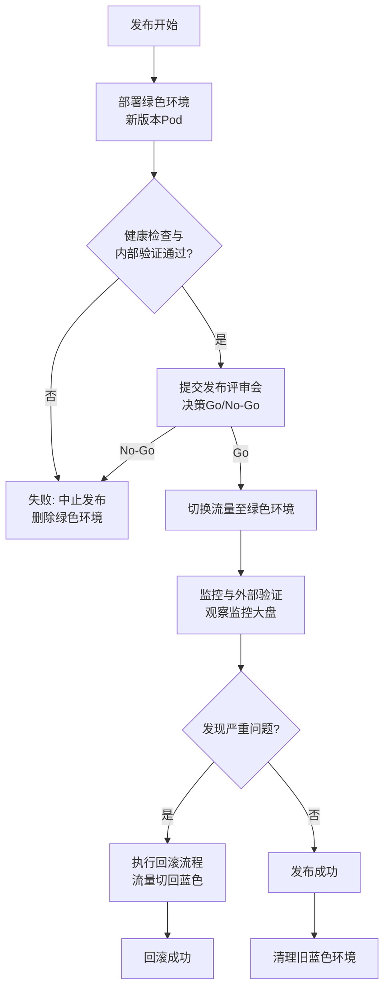

# 蓝绿部署的从0到1

这是一个从零开始系统化落地蓝绿部署的绝佳场景。对于一个目前仅支持最简单K8s部署的软件，要实现蓝绿部署，需要从多个维度进行建设和改造。这不仅仅是一个技术切换，更是一次**工程实践和团队协作的升级**。

以下是我从多个角度为您梳理的详细工作清单：

---

### 一、人员与组织角度

目标是确保团队有足够的认知、能力和明确的职责来支撑新的发布模式。

1.  **意识灌输与培训**
    *   **做什么**：向开发、测试、运维、产品经理等所有相关方普及蓝绿部署的概念、价值、流程和潜在风险。
    *   **为什么**：避免因不了解而产生抗拒，确保大家在同一个频道上对话。
    *   **具体事项**：组织1-2次分享会，讲解蓝绿部署是什么、为什么做、以及未来流程会怎样变化。

2.  **角色与职责重新定义**
    *   **做什么**：明确在新的发布流程中，每个人负责什么。
    *   **为什么**：避免发布时出现混乱（例如，谁有权限执行流量切换？出了问题谁负责决策回滚？）。
    *   **具体事项**：
        *   **开发人员**：确保代码符合无状态、配置外部化等要求；提供清晰的发布清单（如新版本特性、数据库变更脚本）。
        *   **测试人员**：不仅要测试新版本功能，还要制定**线上绿色环境的验收检查清单**（Smoke Test）。
        *   **运维/SRE**：负责部署工具链的维护、执行部署和流量切换操作、监控系统状态。
        *   **发布经理（可选）**：可以是团队负责人，负责协调并最终决策**是否执行切换**和**是否回滚**。

3.  **建立沟通与决策机制**
    *   **做什么**：建立发布前后的沟通渠道和决策流程。
    *   **为什么**：确保信息透明，快速决策。
    *   **具体事项**：
        *   建立发布专用聊天群组/频道。
        *   明确发布决策会（Go/No-Go Meeting）的参与人。
        *   制定清晰的**发布检查清单（Release Checklist）** 和**回滚决策树**。

---

### 二、软件架构角度

目标是让应用程序本身具备支持蓝绿部署的能力。

1.  **应用无状态化改造**
    *   **做什么**：这是最核心、最可能需要投入工作的部分。
    *   **为什么**：如果应用有状态，流量切换会导致数据不一致和用户会话中断。
    *   **具体事项**：
        *   **会话（Session）外部化**：将用户Session从应用内存迁移到共享缓存（如Redis）。
        *   **文件存储外部化**：用户上传的文件不应保存在Pod本地磁盘，应使用对象存储（如S3/MinIO）或网络共享存储。

2.  **配置与密钥外部化**
    *   **做什么**：确保蓝绿两个环境运行时连接的是同一套外部服务。
    *   **为什么**：不能让绿色环境连到测试数据库。
    *   **具体事项**：
        *   所有配置（数据库连接串、第三方API地址、功能开关）都必须通过K8s **ConfigMap** 和 **Secret** 注入，或从配置中心（如Apollo, Nacos）读取。
        *   绝对禁止在容器镜像内硬编码配置。

3.  **处理数据向后兼容性**
    *   **做什么**：确保新版本（绿色）和旧版本（蓝色）的代码能够读写同一套数据库，而不会导致错误。
    *   **为什么**：两者在切换前后会同时访问生产数据库。
    *   **具体事项**：
        *   数据库Schema变更必须是**向后兼容**的。
        *   **策略**：遵循“只增不改不删”的原则。例如：
            *   只增加新的表和字段。
            *   如果要废弃某个字段，先部署一个不依赖该字段的新版本，运行一段时间后再在后续版本中删除。
        *   使用数据库迁移工具（如Liquibase, Flyway）来管理所有DDL变更。

---

### 三、迭代与流程角度

目标是设计一套清晰、可靠、可重复的发布流程，并将其整合到现有的开发迭代中。

1.  **定义清晰的发布流程**
    *   **做什么**：将蓝绿部署的每一步都文档化、标准化。
    *   **具体事项**：制定一个如下图所示的完整发布流程，并将其固化：

2.  **完善测试策略**
    *   **做什么**：在现有测试流程中增加对绿色环境的专门测试环节。
    *   **具体事项**：
        *   **编写冒烟测试用例**：一套能在5-10分钟内快速验证核心功能是否正常的自动化测试脚本/工具。
        *   **制定线上验证清单**：发布后，测试人员需要按照清单手动检查关键功能点。

3.  **变更沟通计划**
    *   **做什么**：告知各方发布安排和内容。
    *   **具体事项**：发布前，向客服、运营等相关团队发送Release Notes，说明新特性、已知问题，以便他们做好准备。

---

### 四、技术与工具角度

目标是搭建或利用工具来简化、自动化蓝绿部署的操作，降低人为错误风险。

1.  **基础技术实现（K8s原生）**
    *   **做什么**：使用K8s最基本的特性实现蓝绿部署。
    *   **具体事项**：
        *   **使用Service和Label进行流量切换**：为蓝色和绿色环境的Pod设置不同标签（如`version: v1`和`version: v2`），通过修改Service的`selector`来切换流量。
        *   **使用Readiness Probe**：确保只有完全启动就绪的Pod才会接收流量，这是保证切换平滑的关键。

2.  **进阶工具引入（强烈推荐）**
    *   **做什么**：采用更高级的工具来管理复杂的部署过程，实现自动化、可视化和安全化。
    *   **为什么**：手动修改Yaml文件容易出错，且无法支持自动化回滚、指标分析等高级功能。
    *   **具体事项**：
        *   **Argo Rollouts**：**这是实现K8s蓝绿/金丝雀部署的标杆工具**。
            *   它提供了自定义资源（CRD）`Rollout`来替代原生的`Deployment`。
            *   自动执行流量切换、提供丰富的自动化策略（如基于Prometheus指标自动判断新版本健康度、自动回滚）。
            *   提供可视化UI，实时查看发布状态。
        *   **Helm/Kustomize**：用于管理不同环境的配置模板，简化部署文件的维护。

3.  **监控与可观测性加强**
    *   **做什么**：没有强大的监控，蓝绿部署就像盲人开车。
    *   **具体事项**：
        *   部署前后，重点关注**四大黄金指标**：延迟（Latency）、流量（Traffic）、错误率（Errors）、饱和度（Saturation）。
        *   设置关键业务指标看板（如订单成功率、用户活跃数），以便在流量切换后能快速从业务层面发现问题。
        *   确保日志系统（如ELK/Loki）能按版本（version标签）过滤日志，便于排障。

---

### 五、落地与执行角度

目标是采用一种平滑、渐进的方式将蓝绿部署推行下去，避免“大爆炸”式改革。

1.  **从小处着手（试点）**
    *   **做什么**：不要一开始就在最核心、最复杂的应用上实施。
    *   **具体事项**：选择一个**业务影响相对较小、架构简单、团队更熟悉**的应用作为第一个试点。成功后再逐步推广到其他应用。

2.  **进行演练和复盘**
    *   **做什么**：在真正用于生产前，进行多次完整的演练。
    *   **具体事项**：
        *   在预发布（Staging）环境模拟整个蓝绿部署流程，包括**回滚**。
        *   每次发布后进行简短复盘，优化流程和工具。

3.  **文档化一切**
    *   **做什么**：将架构规范、发布流程、操作手册、故障处理方案等全部记录下来。
    *   **为什么**：形成组织记忆，方便新成员 onboarding，并在紧急情况下提供操作指南。

**总结：**
落地蓝绿部署是一个系统工程，**技术实现只占其中一部分**。成功的核心在于**人员认知到位、架构改造彻底、流程规范清晰、工具支撑有力**。采用“试点先行，逐步推广”的策略，用小胜积累大胜，最终平滑地完成这次部署模式的升级。