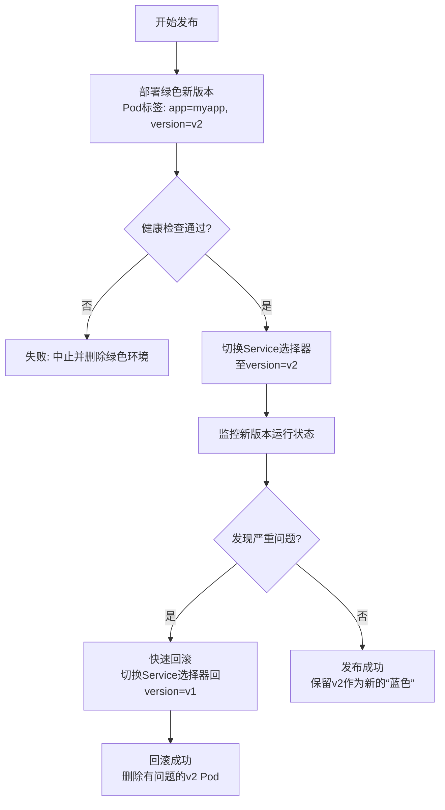

蓝绿部署的具体操作
蓝绿部署是一种旨在减少发布中断和风险的部署策略。下面我将详细拆解其**架构改造需求**、**具体的发布流程**以及**可执行的操作**，并以 Kubernetes 环境为例进行说明。

---

### 一、软件架构需要做的改造 (架构改造)

要实现蓝绿部署，你的应用架构必须满足一些前提条件，否则无法顺利实施。这些是改造的重点。

1.  **无状态化 (Statelessness)**
    *   **是什么**：这是最重要的前提。应用实例本身不能存储任何会话（Session）或用户数据。任何一次请求被路由到蓝色或绿色环境的任何一个实例，都应该返回相同的结果。
    *   **为什么**：如果有状态，流量切换后，用户会话会丢失，或者会读到错误版本的数据。
    *   **如何改造**：
        *   将会话数据外移到分布式缓存（如 Redis, Memcached）中。
        *   用户上传的文件等持久化数据应存储到对象存储（如 AWS S3, MinIO）或共享文件系统中，而不是应用服务器的本地磁盘。

2.  **配置外部化 (Externalized Configuration)**
    *   **是什么**：应用的配置（如数据库连接字符串、第三方API密钥、功能开关）不能硬编码在应用内或镜像中。
    *   **为什么**：蓝绿两个环境需要连接**相同的**后端服务（如数据库、缓存），除非数据库模式也需要同步变更（需特别处理）。你不能让绿色环境连到一个测试数据库。
    *   **如何改造**：
        *   使用配置中心（如 Spring Cloud Config, Apollo, Nacos）。
        *   或使用 Kubernetes 的 ConfigMap 和 Secret，通过环境变量或卷挂载的方式注入到容器中。

3.  **向后兼容的数据模型 (Backward-Compatible Data Schema)**
    *   **是什么**：在绿色环境（新版本）与蓝色环境（旧版本）同时运行时，它们读写的是**同一套数据库**。
    *   **为什么**：如果绿色环境的应用代码修改了数据库schema（如增加了字段、改了字段名）但无法与旧版本代码兼容，会导致旧版本蓝色环境在读写时出错。
    *   **如何改造**：
        *   **策略**：所有数据库变更必须是**向后兼容**的。
        *   **具体操作**：
            *   **只增不改**：只增加新的表或字段，不要删除或重命名现有字段。
            *   **先增后删**：如果要废弃一个字段，先部署一个能同时处理新旧字段的版本（绿色），运行一段时间后，再在未来的版本中删除旧字段。
            *  使用数据库迁移工具（如 Flyway, Liquibase）来规范化、自动化Schema变更。

---

### 二、发布流程 (发布流)

下图直观地展示了基于Kubernetes的蓝绿发布流程，其中绿色为当前版本，蓝色为新版本，通过切换Service的标签选择器来完成流量切换：



其核心流程可以分解为以下步骤：

1.  **初始状态**：
    *   “蓝色”环境（v1版本）正在处理所有生产流量。
    *   负载均衡器（Service/Ingress）将所有流量指向标签为 `version: v1` 的Pod。

2.  **部署绿色环境**：
    *   部署新版本（v2）的应用程序。这个环境的Pod具有不同的标签，例如 `version: v2`。
    *   此时，蓝色（v1）和绿色（v2）环境同时运行，**但绿色环境不接受任何外部流量**。

3.  **验证绿色环境**：
    *   进行内部测试和验证。可以通过以下几种方式：
        *   **直接访问Pod IP**（仅限内部）。
        *   **创建一个临时的测试Service**，将标签选择器指向 `version: v2`，供测试人员或自动化脚本访问。
        *   使用诸如Nginx Ingress的“canary”功能或ServiceMesh（如Istio）的流量镜像功能，将一小部分复制过来的流量导入绿色环境进行测试（不影响真实用户）。

4.  **切换流量**：
    *   当确认绿色环境（v2）稳定且功能正常后，**更改负载均衡器（Service）的标签选择器**，将其从 `version: v1` 改为 `version: v2`。
    *   Kubernetes的Service机制会瞬间将生产流量从蓝色环境切换到绿色环境。这个过程对用户是**无缝的**。

5.  **观察与监控**：
    *   切换后，紧密观察监控仪表盘（应用性能、错误日志、业务指标等），确保新版本运行平稳。

6.  **回滚（如果出现问题）**：
    *   如果绿色环境发现严重问题，**立即将Service的标签选择器改回** `version: v1`。流量会瞬间切回蓝色环境，实现秒级回滚。

7.  **清理**：
    *   当绿色环境稳定运行一段时间后（例如24小时），可以安全地**下线并删除蓝色的旧版本**（v1）以释放资源。
    *   此时，当前的绿色环境（v2）就变成了新的“蓝色”环境，为下一次发布做准备。

---

### 三、具体的可执行性操作 (以 Kubernetes + kubectl 为例)

假设我们有一个名为 `myapp` 的应用。

1.  **初始状态（蓝色）**：
    *   部署文件 `deployment-blue.yaml`：
        ```yaml
        apiVersion: apps/v1
        kind: Deployment
        metadata:
          name: myapp-blue
        spec:
          replicas: 3
          selector:
            matchLabels:
              app: myapp
              version: v1  # 版本标签
          template:
            metadata:
              labels:
                app: myapp
                version: v1 # 版本标签
            spec:
              containers:
              - name: myapp
                image: myapp:v1
        ```
    *   服务文件 `service.yaml`：
        ```yaml
        apiVersion: v1
        kind: Service
        metadata:
          name: myapp-service
        spec:
          selector:
            app: myapp
            version: v1  # Service 当前选择 v1 的 Pod
          ports:
          - port: 80
          type: ClusterIP
        ```

2.  **部署绿色环境**：
    *   部署文件 `deployment-green.yaml`：
        ```yaml
        apiVersion: apps/v1
        kind: Deployment
        metadata:
          name: myapp-green # 部署名称也不同，便于管理
        spec:
          replicas: 3
          selector:
            matchLabels:
              app: myapp
              version: v2  # 新版本标签
          template:
            metadata:
              labels:
                app: myapp
                version: v2 # 新版本标签
            spec:
              containers:
              - name: myapp
                image: myapp:v2 # 新镜像
        ```
    *   执行命令：
        ```bash
        kubectl apply -f deployment-green.yaml
        ```
    *   现在你有6个Pod在运行：3个 `version: v1`，3个 `version: v2`。

3.  **验证绿色环境**：
    *   可以端口转发到一个绿色Pod进行测试：
        ```bash
        kubectl port-forward pod/<myapp-green-pod-name> 8080:80
        ```
    *   然后访问 `localhost:8080` 进行验证。

4.  **切换流量（发布）**：
    *   **修改 `service.yaml` 文件**，将 `spec.selector.version` 从 `v1` 改为 `v2`。
        ```yaml
        spec:
          selector:
            app: myapp
            version: v2  # 改为选择 v2
        ```
    *   应用更改：
        ```bash
        kubectl apply -f service.yaml
        ```
    *   **瞬间**，所有通过 `myapp-service` 的流量都会切换到 v2 版本的Pod。

5.  **回滚操作**：
    *   如果发现v2有问题，立即将 `service.yaml` 的 `selector` 改回 `version: v1` 并应用。
        ```bash
        kubectl apply -f service.yaml
        ```
    *   流量瞬间切回稳定的蓝色环境。

6.  **清理旧版本**：
    *   确认v2稳定后，删除蓝色部署以释放资源。
        ```bash
        kubectl delete deployment myapp-blue
        ```

---

### 进阶工具与建议

*   **使用Helm/Kustomize**：上述手动修改Service文件的方式容易出错。可以使用Helm（模板化）或Kustomize（配置覆盖）来动态生成不同环境的配置，让切换操作变得更简单、更自动化。
*   **使用高级部署工具**：
    *   **Argo Rollouts**：这是一个非常强大的Kubernetes控制器，**专门用于管理蓝绿、金丝雀等高级部署策略**。它提供了自动化的流量切换、Prometheus指标分析、自动回滚、直观的UI可视化等功能，极大地简化了蓝绿部署的复杂度。**强烈推荐**。
    *   **Service Mesh (Istio/Linkerd)**：通过在网格内控制流量路由规则，可以实现更细粒度的流量控制（如按百分比切流），并且完全不需要修改Service的定义。

总结来说，蓝绿部署的核心在于**无状态架构**、**标签选择**和**流量切换**。在Kubernetes上，通过原生对象就能实现基本功能，而借助Argo Rollouts等工具则可以构建一个强大且自动化的发布系统。