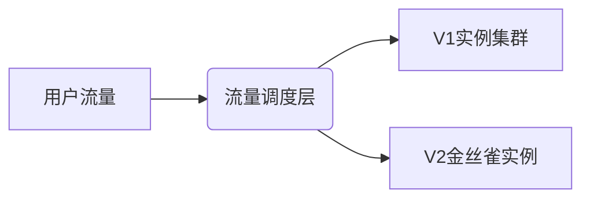
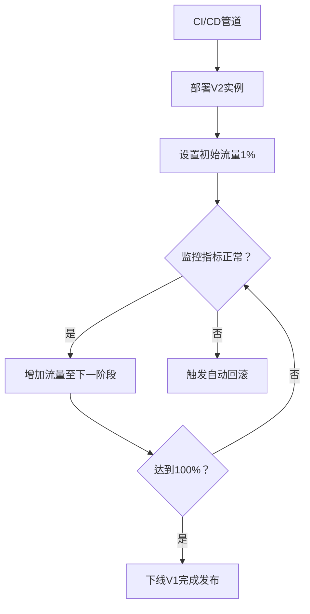

金丝雀部署（Canary Deployment）是一种**通过渐进式流量切换，在生产环境中对新版本进行小范围验证，逐步扩大范围直至全量发布的部署策略**。其名称源于煤矿工人用金丝雀探测瓦斯，比喻用少量用户流量探测新版本风险。以下是金丝雀部署的完整实施指南：

---

### **一、金丝雀部署的核心流程**
#### **1. 环境准备**
| **环境**       | **作用**                                               |
| -------------- | ------------------------------------------------------ |
| **稳定环境**   | 运行当前生产版本（V1），承载大部分用户流量             |
| **金丝雀环境** | 部署新版本（V2），初始接收极小比例流量（如1%）用于验证 |

**关键要求：**
- **环境一致性：** 金丝雀环境需与生产环境配置完全一致（服务器规格、依赖服务、数据库副本等）。
- **流量隔离能力：** 支持细粒度流量调度（按比例/按用户属性路由）。

#### **2. 部署新版本到金丝雀环境**
1. **构建新版本：** 生成可部署制品（Docker镜像/JAR包）。
2. **创建金丝雀实例：** 
   - 在现有集群中启动新版本实例（K8s中扩容`v2`的Pod）。
   - **保持`v1`实例继续服务**，用户无感知。
3. **预验证：** 
   - 内部访问测试：通过管理接口验证基础功能。
   - 自动化冒烟测试：执行核心路径测试脚本。



#### **3. 渐进式流量切换**
1. **初始放量：** 将**1%-5%** 的生产流量导入金丝雀环境（V2）。
2. **指标监控：** 实时观察关键指标（错误率、延迟、CPU负载）。
3. **逐步扩量：**  
   - 若指标正常（如错误率<0.1%），按阶梯扩大流量比例（5% → 10% → 25% → 50% → 100%）。
   - 每阶段需稳定观察**至少一个业务周期**（如30分钟~2小时）。

**流量调度策略示例：**
| **阶段** | **V2流量比例** | **持续时间** | **验证重点**                 |
| -------- | -------------- | ------------ | ---------------------------- |
| 1        | 1%             | 30分钟       | 基础存活率、崩溃监控         |
| 2        | 5%             | 1小时        | 核心功能成功率、性能基线     |
| 3        | 25%            | 2小时        | 业务指标（转化率）、资源消耗 |
| 4        | 100%           | -            | 全量覆盖                     |

#### **4. 实时监控与熔断**
- **监控维度：**
  - **技术指标：** HTTP错误率（4xx/5xx）、延迟（P99）、资源利用率（CPU/MEM）。
  - **业务指标：** 订单创建率、支付成功率、关键功能使用量。
- **熔断机制：** 
  - 预设阈值（如错误率>1%或延迟>500ms），自动将流量切回V1。
  - 人工介入：监控大屏告警，随时手动回滚。

#### **5. 发布完成或回滚**
- **成功发布：** 当V2承载100%流量且运行稳定后，下线V1实例。
- **失败回滚：** 
  1. 将流量100%切回V1。
  2. 下线V2实例。
  3. 分析日志/追踪数据定位问题。

---

### **二、关键技术实现方案**
#### 1. **流量调度工具**
| **类型**         | **工具**                                                     | **特点**                                       |
| ---------------- | ------------------------------------------------------------ | ---------------------------------------------- |
| **服务网格**     | Istio（VirtualService+DestinationRule）、Linkerd、Consul Connect | 动态权重调整、按Header路由、支持跨服务链路控制 |
| **云负载均衡器** | AWS ALB（加权路由）、GCP Cloud Load Balancing、Azure Traffic Manager | 简单权重配置，无需改造应用                     |
| **API网关**      | Kong（Canary插件）、Apisix（Traffic-Split）、Nginx（split_clients模块） | 灵活路由规则，适合API服务                      |
| **K8s原生方案**  | Service + Ingress（Nginx/ALB）配合Deployment渐进扩缩容       | 需手动调整Pod数量与Ingress权重                 |

**Istio配置示例（按流量比例路由）：**
```yaml
apiVersion: networking.istio.io/v1alpha3
kind: VirtualService
metadata:
  name: myapp-vs
spec:
  hosts:
    - myapp.example.com
  http:
  - route:
    - destination:
        host: myapp
        subset: v1
      weight: 95   # 95%流量到V1
    - destination:
        host: myapp
        subset: v2
      weight: 5    # 5%流量到V2
---
apiVersion: networking.istio.io/v1alpha3
kind: DestinationRule
metadata:
  name: myapp-dr
spec:
  host: myapp
  subsets:
  - name: v1
    labels:
      version: v1
  - name: v2
    labels:
      version: v2
```

#### 2. **数据一致性管理**
- **共享数据库（推荐）：** 
  - V1和V2同时读写**同一数据库**，确保数据实时一致。
  - **要求：** 新版本必须保持数据库Schema向后兼容。
- **双写模式（高风险）：** 
  - V2写入新数据库，同时同步到旧库（需CDC工具如Debezium）。
  - 仅适用于无法兼容Schema的重大变更（需额外设计数据迁移方案）。

#### 3. **发布自动化控制**


---

### **三、金丝雀部署的进阶模式**
#### 1. **按用户属性路由**
- **适用场景：** 定向验证特定用户群体（如内部员工、Beta测试用户）。
- **实现方式：**
  - 根据HTTP Header/Cookie分流（如`x-user-group: canary`）。
  - 按地理位置路由（如仅限上海用户访问V2）。

**Istio按Header路由示例：**
```yaml
http:
- match:
  - headers:
      x-canary:
        exact: true
  route:
  - destination:
      host: myapp
      subset: v2
- route:  # 默认路由到V1
  - destination:
      host: myapp
      subset: v1
```

#### 2. **多阶段自动化规则**
- **基于指标的自动扩量：** 
  - 若金丝雀实例错误率<0.1%且CPU<60%，自动提升10%流量。
- **渐进式实例替换：** 
  - 滚动更新策略：K8s中逐步增加V2 Pod数，同时减少V1 Pod（需配合就绪探针）。

---

### **四、适用场景 vs 避坑指南**
| **最佳场景**             | **慎用场景**                    | **规避方案**                       |
| ------------------------ | ------------------------------- | ---------------------------------- |
| 微服务架构的单个服务更新 | 数据库破坏性变更（如删字段）    | 分两步发布：先代码兼容再删字段     |
| 前端UI或算法策略迭代     | 强状态服务（如WebSocket长连接） | 会话黏滞（同一用户始终访问同版本） |
| 验证高风险的性能优化     | 资源极度受限的环境              | 改用蓝绿部署或滚动更新             |

---

### **五、与蓝绿部署的对比选择**
| **维度**     | **金丝雀部署**                 | **蓝绿部署**             |
| ------------ | ------------------------------ | ------------------------ |
| **资源成本** | 仅需额外少量实例（资源增量小） | 需100%冗余资源           |
| **发布周期** | 渐进式（分钟~小时级）          | 瞬时切换（秒级）         |
| **风险控制** | 小范围试错，故障影响可控       | 全量切换，风险集中       |
| **复杂度**   | 流量调度复杂，需完善监控       | 环境管理复杂             |
| **适用对象** | 高频发布的微服务               | 关键系统（要求秒级回滚） |

> **决策树：**  
> - 追求极致回滚速度 → 蓝绿部署  
> - 资源有限/降低爆炸半径 → 金丝雀部署  

---

### **六、最佳实践**
1. **监控驱动发布：**
   - 建立统一监控大盘，整合技术指标（Prometheus）与业务指标（Kafka+实时数仓）。
2. **自动化熔断：**
   ```bash
   # 示例：基于错误率自动回滚
   if [ $(curl -s metrics-server/error_rate) -gt 1% ]; then
     kubectl apply -f v1-config.yaml # 切回V1
     alert "金丝雀发布失败！已回滚"
   fi
   ```
3. **混沌测试结合：**
   - 在金丝雀阶段注入网络延迟（Chaos Mesh），验证韧性。
4. **用户反馈闭环：**
   - 引导金丝雀用户提交反馈（应用内弹窗），结合会话回放分析行为。

---

### **七、典型成功案例**
**场景：银行APP转账功能升级**  
- **挑战：** 零资金损失容忍，需100%验证交易成功率。  
- **实施：**  
  1. 金丝雀环境部署V2，**按账户分片**：仅路由测试账户流量。  
  2. 监控：交易错误率（必须=0%）、双方余额一致性。  
  3. 3阶段放量：测试账户 → 员工账户 → 1%真实用户 → 全量。  
- **结果：** 拦截1个边界条件BUG（大额转账超时），用户资金零影响。

---

### **总结：金丝雀部署 = 渐进放量 + 实时监控 + 自动熔断**
**成功核心：**  
- ✅ **细粒度流量调度**（服务网格/API网关）  
- ✅ **多维实时监控**（技术+业务指标可视化）  
- ✅ **自动化决策机制**（基于指标的扩量/回滚）  
- ✅ **向后兼容设计**（数据库是生命线！）  

通过金丝雀部署，企业可在**资源成本与风险控制间取得最佳平衡**，尤其适合高频迭代的云原生应用。