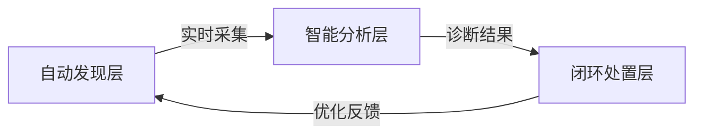

在右移（Shift Right）技术体系中，**问题流转机制**是保障故障快速响应与持续改进的核心骨架。以下是经过大型互联网平台验证的高效问题流转框架，实现从问题发现到价值闭环的全周期管理：

---

### 一、问题流转核心架构：三级驱动引擎


---

### 二、标准化流转流程设计

#### 1. **问题录入标准化**
   - **统一接入门户**：
     ```mermaid
     graph LR
     A[监控告警] --> D[统一接入网关]
     B[用户反馈] --> D
     C[主动巡检] --> D
     D --> E((问题管理平台))
     ```
   - **结构化录入模板**：
     ```markdown
     ## [问题类别] 支付服务异常
     **影响范围**： 
     - 业务：核心支付链路
     - 用户：VIP客户（>Lv3）
     **现象描述**：
     - 支付成功率从99.5%降至92.3%（15:00-15:30）
     - 错误码：PAYMENT_GATEWAY_TIMEOUT
     **关联资源**：
     [监控图表链接] | [日志查询链接] | [拓扑图谱链接]
     ```

#### 2. **智能分级分类引擎**
   - **多维度定级模型**：
     ```python
     def calculate_severity(impact, urgency, scope):
         # 业务影响权重（0-10）
         impact_weight = {
             '营收业务': 9, 
             '核心功能': 7,
             '辅助功能': 3
         }
         # 计算综合严重度
         score = impact_weight[impact] * 0.6 + urgency * 0.3 + scope * 0.1
         return 'P0' if score > 8 else 'P1' if score > 6 else 'P2'
     ```
   - **自动标签分类**：
     ```sql
     /* 基于历史数据的智能分类 */
     CREATE MODEL problem_classifier
     OPTIONS (model_type='logistic_reg') AS
     SELECT 
       description, 
       component,   -- 系统组件标签
       root_cause   -- 根因标签
     FROM historical_problems;
     ```

#### 3. **多路路由策略**
| **问题类型** | **路由规则**          | **SLA**    | **升级路径**      |
| ------------ | --------------------- | ---------- | ----------------- |
| 基础设施故障 | → SRE团队             | 5分钟响应  | 30分钟未认领→总监 |
| 业务逻辑缺陷 | → 开发团队+产品经理   | 15分钟响应 | 1小时未解决→CTO   |
| 用户体验问题 | → UX团队+客户成功     | 30分钟响应 | 2小时未闭环→COO   |
| 数据一致性   | → 数据工程+业务分析师 | 1小时分析  | 24小时未修复→CDO  |

---

### 三、闭环处置机制设计

#### 1. **诊断-处置-验证闭环**
   ```mermaid
   graph TB
   A[问题发现] --> B{自动诊断}
   B -->|成功| C[执行预案]
   B -->|失败| D[转人工分析]
   C --> E[验证修复]
   E -->|成功| F[关闭工单]
   E -->|失败| D
   D --> G[专家介入]
   G --> H[更新知识库]
   ```

#### 2. **自动化处置工具箱**
| **场景**     | **自动化动作**            | **工具集成**      |
| ------------ | ------------------------- | ----------------- |
| 服务不可用   | 重启/流量切换/扩容        | Ansible+Terraform |
| 数据不一致   | 执行补偿任务/数据修复     | Spark+Airflow     |
| 配置错误     | 回滚配置/应用正确配置     | Consul+GitOps     |
| 用户体验下降 | 启用降级方案/推送优化版本 | Feature Flag系统  |

#### 3. **根因回溯四步法**
   1. **时间定位**：锁定异常发生精确时间轴
   2. **变更关联**：自动关联近期部署/配置变更
      ```sql
      SELECT change_id, author, deploy_time 
      FROM deployment_history 
      WHERE deploy_time BETWEEN '2023-06-01 14:00' AND '2023-06-01 15:00'
      ```
   3. **拓扑下钻**：沿依赖链逐层分析
      ```mermaid
      graph LR
      用户端-->API网关-->支付服务-->银行通道
      ```
   4. **实验复现**：在隔离环境验证猜测

---

### 四、关键支撑系统

#### 1. **全息上下文整合平台**
   ```mermaid
   graph LR
   A[问题工单] --> B{上下文引擎}
   B --> C[关联日志]
   B --> D[关联监控]
   B --> E[关联变更]
   B --> F[关联拓扑]
   B --> G[关联知识库]
   ```

#### 2. **智能协同矩阵**
| **协同环节** | **工具支持**            | **自动化程度** |
| ------------ | ----------------------- | -------------- |
| 通知         | 企业微信/钉钉机器人     | 事件触发       |
| 协作         | 共享诊断白板/在线调试   | 人工+AI        |
| 审批         | 自动提单+关键操作审批流 | 条件触发       |
| 知识沉淀     | 自动生成复盘报告        | 全自动         |

---

### 五、持续改进机制

#### 1. **问题生命周期健康度监控**
   ```sql
   /* 核心SLO指标 */
   SELECT 
     AVG(first_response_time) AS avg_response,  -- 目标<5min
     AVG(resolve_time) AS avg_resolve,         -- 目标<30min
     (SELECT COUNT(*) 
      FROM problems 
      WHERE reopen_count>0)/COUNT(*) AS reopen_rate -- 目标<3%
   FROM production_problems
   WHERE date > NOW() - INTERVAL 7 DAY
   ```

#### 2. **改进飞轮驱动**
   ```mermaid
   graph LR
   A[问题分析] --> B[优化预案]
   B --> C[混沌测试]
   C --> D[漏洞修复]
   D --> E[监控增强]
   E --> F[规范更新]
   F --> A
   ```

#### 3. **价值闭环看板**
| **维度** | **指标**           | **目标值** |
| -------- | ------------------ | ---------- |
| 效率     | MTTR(平均修复时间) | <15分钟    |
| 质量     | 重复问题率         | <5%        |
| 成本     | 人力介入问题占比   | <30%       |
| 业务影响 | 故障导致的营收损失 | 季度降20%  |

---

### 六、最佳实践案例

#### 某电商平台问题流转系统
**实施效果**：
- 问题平均响应时间：**45秒**（原15分钟）
- 自动处置率：**68%**
- 重大故障复盘效率：**提升5倍**

**核心创新点**：
1. **智能路由引擎**：
   ```python
   def route_decision(problem):
       # 结合AI预测选择最优处理组
       model = load_model('routing_model')
       team = model.predict(problem.features)
       # 实时计算团队负载
       if get_team_load(team) > 80%:
           return backup_teams[team]
       return team
   ```

2. **跨系统联动**：
   ```mermaid
   sequenceDiagram
   监控系统->>+工单系统： 发送告警事件
   工单系统->>+CMDB： 获取影响范围
   CMDB-->>-工单系统： 返回业务重要性
   工单系统->>+知识库： 匹配历史方案
   知识库-->>-工单系统： 返回处理预案
   工单系统->>+自动化平台： 执行修复动作
   ```

---

### 实施路线图
1. **基础建设阶段**（1-2月）：
   - 统一问题接入门户
   - 基础自动化预案库（>20个场景）

2. **智能升级阶段**（3-4月）：
   - 部署AI分类路由引擎
   - 建立全息上下文平台

3. **价值闭环阶段**（5-6月）：
   - 实现80%问题自动处置
   - 构建改进飞轮机制

> **关键成功要素**：问题流转机制必须与业务目标对齐，通过持续度量MTTR（平均修复时间）和业务影响指标，确保每个环节都驱动业务价值提升。最终实现“问题发现即解决”的自治目标。