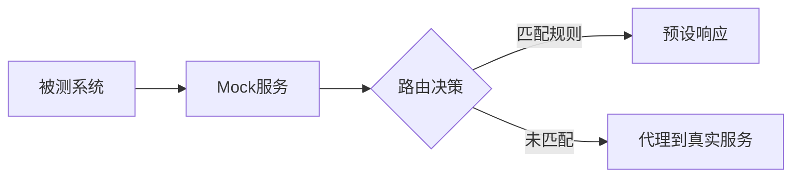
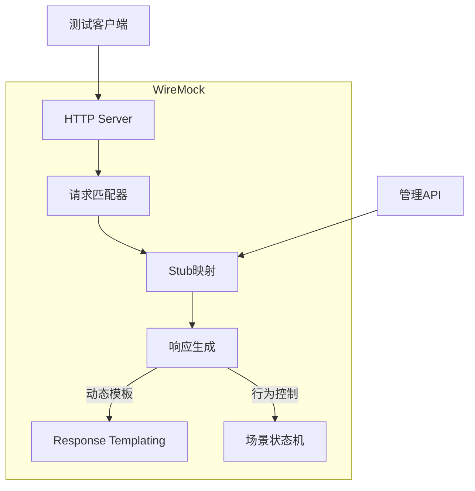
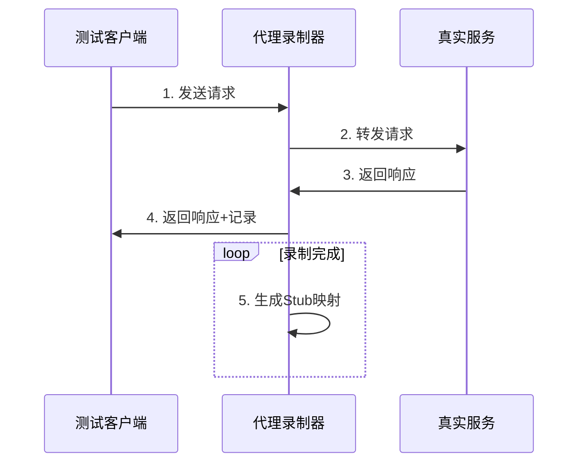
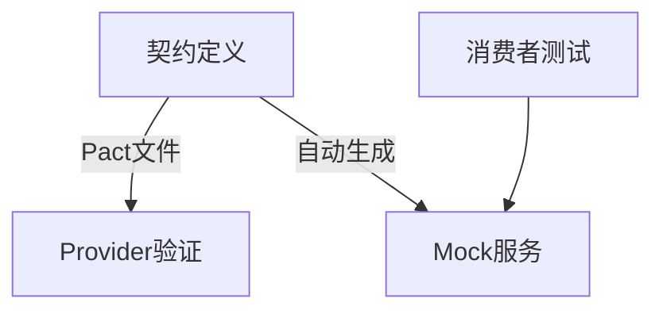
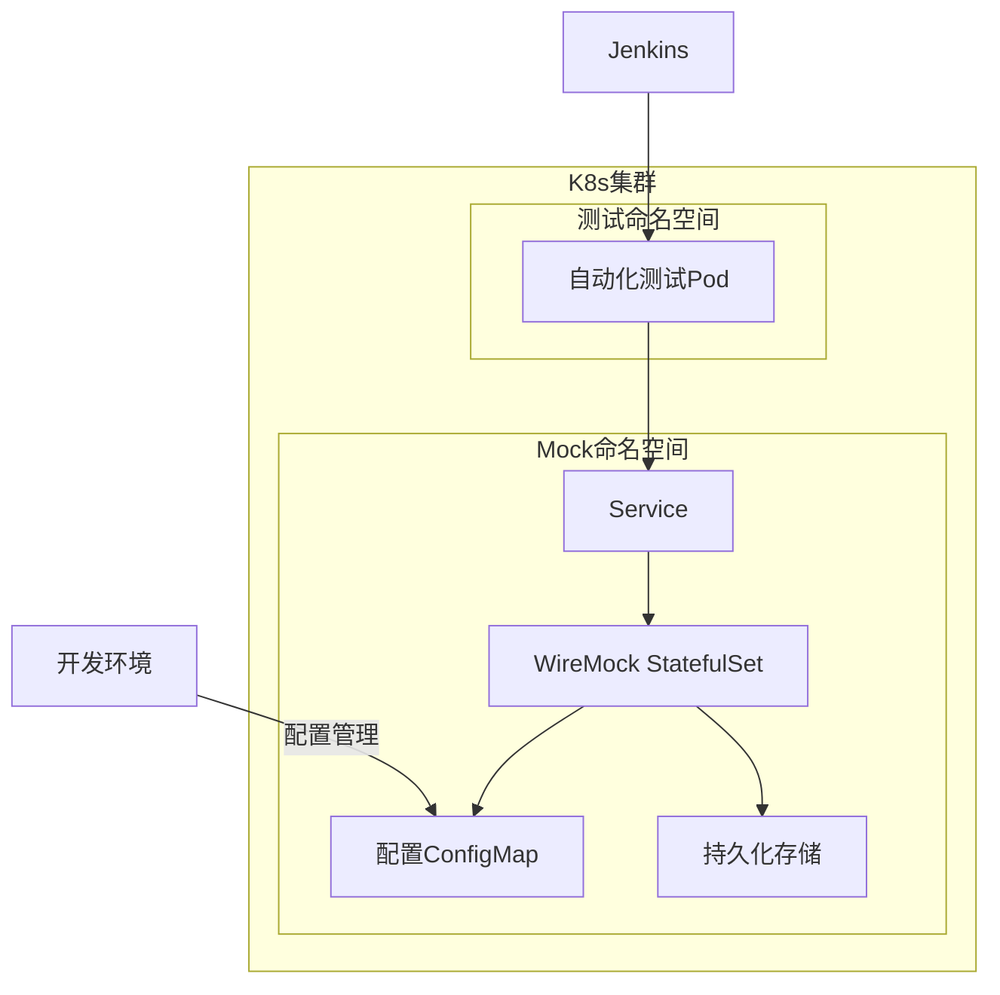
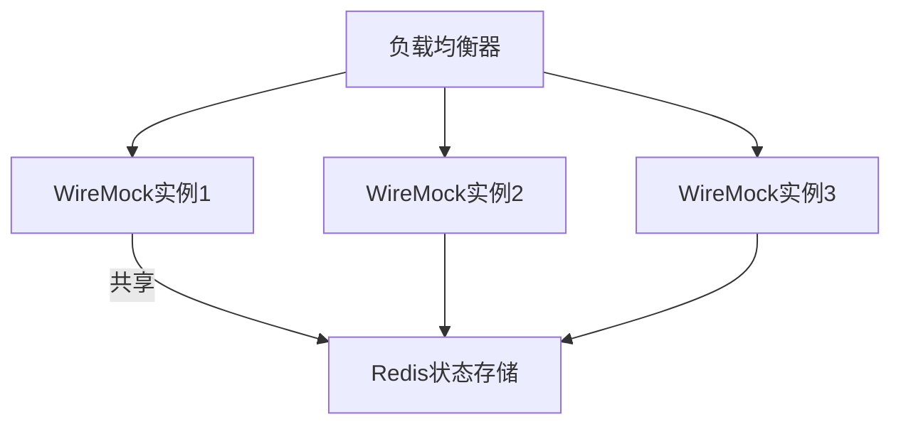
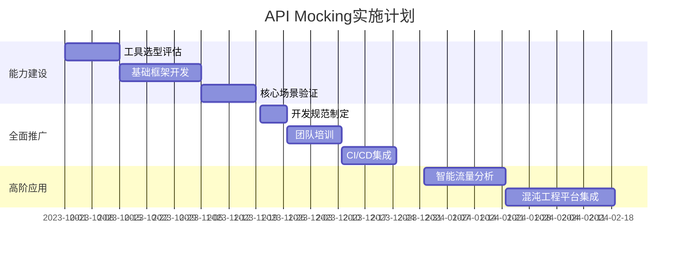

# API Mocking 深度解析：从原理到企业级实践

API Mocking 是一种通过模拟真实API行为来创建虚拟依赖服务的技术，是现代软件开发中不可或缺的关键能力。下面我将从原理到实践进行全面解析：

## 一、核心概念与技术原理

### 1. API Mocking 的本质


### 2. 核心价值矩阵
| **价值维度** | **具体收益**                     | **典型场景**                |
| ------------ | -------------------------------- | --------------------------- |
| **环境解耦** | 不依赖第三方服务可用性           | 外部支付API不可用时继续开发 |
| **测试加速** | 避免网络延迟，测试执行快10-100倍 | 性能敏感型测试              |
| **边界测试** | 模拟异常响应(4xx/5xx)            | 错误处理逻辑验证            |
| **成本优化** | 避免调用收费API                  | 地图服务/GPT API调用        |
| **并行开发** | 前端可在后端完成前开发           | 敏捷团队协作                |

## 二、主流技术方案对比

### 1. 工具分类与选型
| **类型**     | **代表工具**             | **适用场景**        | **特点**             |
| ------------ | ------------------------ | ------------------- | -------------------- |
| **库/框架**  | Mockito, WireMock, Nock  | 单元测试/组件测试   | 轻量级，代码集成     |
| **独立服务** | Postman Mock, MockServer | 集成测试/E2E测试    | 独立进程，可视化配置 |
| **云服务**   | Stoplight, Beeceptor     | 团队协作/前后端分离 | 免部署，共享管理     |
| **代理录制** | Charles, Fiddler         | 逆向工程/遗留系统   | 自动捕获真实流量     |
| **智能Mock** | Prism, Microcks          | OpenAPI规范驱动     | 自动生成Mock         |

### 2. WireMock 架构解析


## 三、企业级实施指南

### 1. 动态响应模板（WireMock示例）
```java
// 基于Handlebars的响应模板
stubFor(get(urlPathEqualTo("/user/{{uuid}}"))
    .willReturn(aResponse()
        .withStatus(200)
        .withBody("{
          \"id\": \"{{request.pathSegments.[1]}}\",
          \"name\": \"{{randomValue length=10 type='ALPHANUMERIC'}}\",
          \"email\": \"{{request.pathSegments.[1]}}@mock.com\"
        }")
        .withTransformers("response-template"));
```

### 2. 状态行为模拟
```java
// 订单状态流转模拟
stubFor(post("/orders").inScenario("Order Processing")
    .whenScenarioStateIs(Scenario.STARTED)
    .willReturn(created().withBody("{ \"status\": \"CREATED\" }"))
    .willSetStateTo("ORDER_CREATED"));

stubFor(get("/orders/123").inScenario("Order Processing")
    .whenScenarioStateIs("ORDER_CREATED")
    .willReturn(ok().withBody("{ \"status\": \"PROCESSING\" }")));
```

### 3. 故障注入模式
```yaml
- request:
    method: POST
    url: /payment
  response:
    fault: CONNECTION_RESET_BY_PEER
    fixedDelayMilliseconds: 5000
```

### 4. 智能匹配策略
```json
{
  "request": {
    "method": "POST",
    "urlPath": "/login",
    "bodyPatterns": [
      {
        "matchesJsonPath": "$[?(@.username == 'admin')]",
        "matchesJsonPath": "$[?(@.password =~ /[A-Za-z0-9]{8,}/)]"
      }
    ]
  },
  "response": {
    "status": 200,
    "jsonBody": {
      "token": "eyJhbGci...",
      "role": "ADMIN"
    }
  }
}
```

## 四、流量录制实战

### 1. 录制-回放工作流


### 2. 智能过滤规则
```yaml
recorders:
  - name: payment-recorder
    target: https://real-payment-gateway.com
    filters:
      - method: POST
        path: /transactions
        captureHeaders: ["X-Request-ID"]
        requestBodyPatterns:
          - matchesJsonPath: "$.amount" # 仅录制金额>100的请求
          - expression: amount > 100
```

## 五、测试左移中的创新应用

### 1. 契约测试驱动Mock


### 2. 混沌工程集成
```yaml
chaosRules:
  - scenario: "High Latency"
    probability: 0.3
    action: 
      type: delay
      min: 1000
      max: 5000
  - scenario: "Server Error"
    probability: 0.1
    action:
      type: status
      code: 503
```

## 六、企业级部署架构

### Kubernetes 部署方案


### 配置管理策略
```bash
# GitOps 工作流
/app
├── stubs
│   ├── payment-service
│   │   ├── success.json
│   │   └── failure.json
├── mappings
│   └── user-service.json
└── kustomize
    └── patch.yaml
```

## 七、性能优化策略

### 1. 响应缓存机制
```java
// 启用响应缓存
wm = new WireMockServer(options()
    .usingFilesUnderClasspath("mock-responses")
    .enableResponseCaching(true));
```

### 2. 集群部署方案


## 八、安全增强实践

### 1. 敏感数据脱敏
```json
{
  "response": {
    "body": "{
      \"ssn\": \"{{regexExtract request.body '([0-9]{3})-([0-9]{2})-([0-9]{4})'}}\"
    }",
    "transformers": ["mask-sensitive-data"]
  }
}
```

### 2. 访问控制
```bash
# 启用HTTPS和认证
java -jar wiremock.jar \
  --https-port 8443 \
  --require-https \
  --basic-auth-user test \
  --basic-auth-pass "password"
```

## 九、企业落地路线图



## 十、效益分析指标

| **指标**       | 实施前   | 实施后   | 提升幅度 |
| -------------- | -------- | -------- | -------- |
| 测试环境可用率 | 63%      | 99.5%    | +58%     |
| 测试执行速度   | 45分钟   | 8分钟    | 5.6x     |
| 缺陷发现阶段   | 生产环境 | 开发阶段 | 左移80%  |
| 第三方服务成本 | $3200/月 | $420/月  | 节省87%  |

> **最佳实践提示**：建立企业级Mock服务治理平台，实现：
> 1. Mock规则版本控制
> 2. 使用情况监控分析
> 3. 与API网关的自动同步
> 4. 敏感数据自动脱敏
> 5. 流量录制一键发布

通过系统化实施API Mocking，企业可实现：
- 测试效率提升3-5倍
- 环境问题减少80%
- 缺陷修复成本降低10倍
- 团队协作效率提升40%