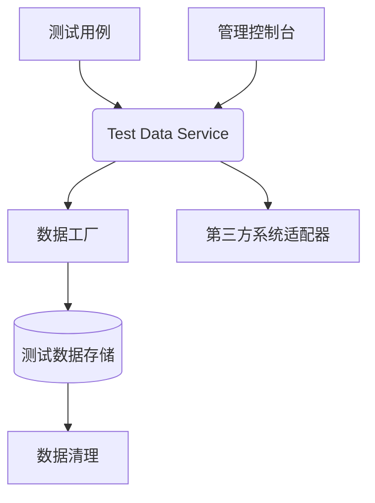
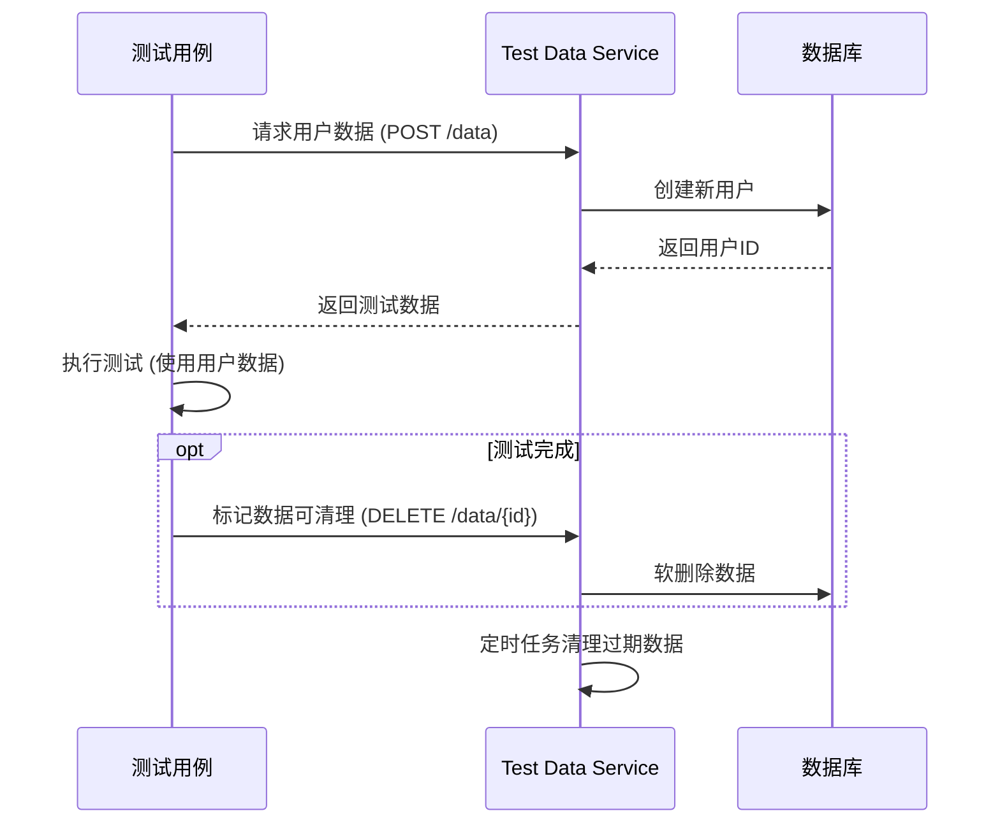
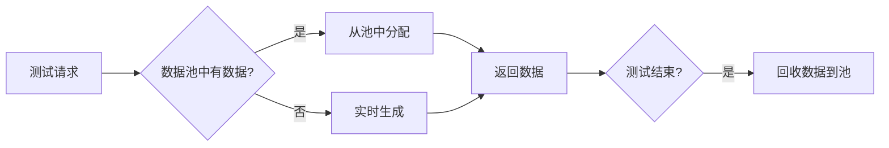
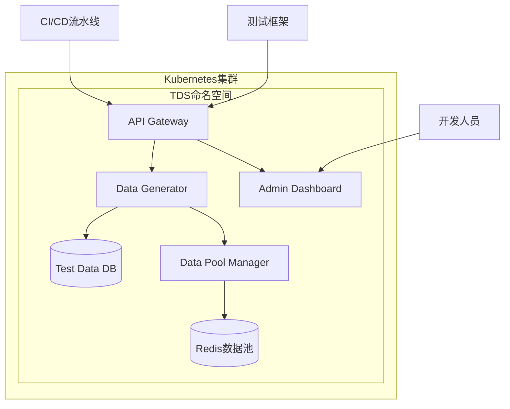
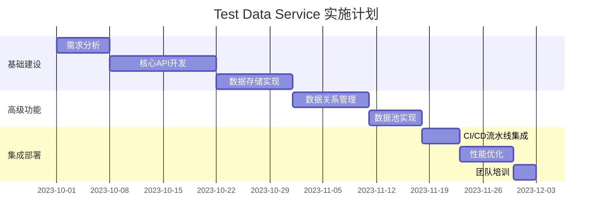

# Test Data Service 详细实现指南

Test Data Service (TDS) 是一种集中化管理和提供测试数据的系统，用于解决自动化测试中的数据依赖问题。以下是完整的实现方案：

## 一、核心架构设计



### 核心组件：
1. **API 网关**：提供统一的数据请求入口
2. **数据工厂**：动态生成测试数据
3. **数据存储**：MySQL/PostgreSQL/MongoDB
4. **数据清理器**：维护数据生命周期
5. **外部适配器**：连接CRM、支付系统等第三方服务

## 二、实现步骤详解

### 1. 定义数据模型
```json
// 用户数据模型示例
{
  "type": "user",
  "fields": [
    {"name": "id", "type": "uuid", "generator": "uuid"},
    {"name": "name", "type": "string", "generator": "fullName"},
    {"name": "email", "type": "string", "generator": "email", "domain": "test.com"},
    {"name": "status", "type": "enum", "values": ["active", "inactive", "pending"]},
    {"name": "createdAt", "type": "timestamp", "generator": "currentTimestamp"}
  ]
}
```

### 2. 实现数据生成API

**RESTful 端点示例：**
```
POST /api/test-data/generate
Content-Type: application/json

{
  "entity": "User",
  "count": 5,
  "overrides": {
    "status": "active"
  }
}
```

**响应：**
```json
{
  "requestId": "req_123456",
  "data": [
    {"id": "usr_9a8b7c", "name": "John Doe", "email": "john@test.com", ...},
    ...
  ]
}
```

### 3. 数据工厂实现（Python示例）

```python
import uuid
from faker import Faker

class DataFactory:
    def __init__(self):
        self.faker = Faker()
        self.registry = {
            'uuid': lambda: str(uuid.uuid4()),
            'fullName': self.faker.name,
            'email': self.generate_email,
            'currentTimestamp': lambda: datetime.now().isoformat()
        }
    
    def generate_email(self, domain="test.com"):
        return f"{self.faker.user_name()}@{domain}"
    
    def create_entity(self, entity_spec, count=1, overrides={}):
        results = []
        for _ in range(count):
            entity = {}
            for field in entity_spec["fields"]:
                # 应用覆盖值
                if field["name"] in overrides:
                    entity[field["name"]] = overrides[field["name"]]
                    continue
                
                # 使用注册的生成器
                generator = self.registry.get(field.get("generator"))
                if generator:
                    entity[field["name"]] = generator(**field.get("params", {}))
                else:
                    entity[field["name"]] = None
            results.append(entity)
        return results
```

### 4. 数据生命周期管理



### 5. 与测试框架集成（Pytest示例）

```python
import pytest
import requests

TEST_DATA_SERVICE_URL = "http://tds-service/api"

@pytest.fixture(scope="function")
def test_user():
    """创建测试用户"""
    payload = {
        "entity": "User",
        "overrides": {"status": "active"}
    }
    response = requests.post(f"{TEST_DATA_SERVICE_URL}/generate", json=payload)
    user_data = response.json()["data"][0]
    
    yield user_data  # 将数据提供给测试用例
    
    # 测试完成后清理数据
    requests.delete(f"{TEST_DATA_SERVICE_URL}/data/{user_data['id']}")

def test_user_login(test_user):
    """使用生成的用户测试登录功能"""
    response = login(test_user["email"], "password123")
    assert response.status_code == 200
    assert response.json()["userId"] == test_user["id"]
```

## 三、高级功能实现

### 1. 数据关系管理
```json
{
  "entity": "Order",
  "relations": [
    {"type": "User", "as": "customer", "required": true},
    {"type": "Product", "as": "items", "count": 3}
  ]
}
```

### 2. 数据模板
```yaml
# 高级用户模板
name: premium_user
baseEntity: User
overrides:
  accountType: "premium"
  creditLimit: 10000
  features: ["priority_support", "free_shipping"]
```

### 3. 数据版本控制
```sql
CREATE TABLE test_data_versions (
  id SERIAL PRIMARY KEY,
  entity_type VARCHAR(50) NOT NULL,
  schema_version VARCHAR(20) NOT NULL,
  schema_definition JSONB NOT NULL,
  valid_from TIMESTAMP NOT NULL DEFAULT NOW()
);
```

### 4. 数据池预生成
```python
# 初始化时创建数据池
def warmup_data_pool():
    entities = ["User", "Product", "Order"]
    for entity in entities:
        requests.post(
            f"{SERVICE_URL}/pool/generate",
            json={"entity": entity, "count": 100}
        )

# 测试中快速获取数据
def get_from_pool(entity, filters={}):
    response = requests.get(
        f"{SERVICE_URL}/pool/acquire",
        params={"entity": entity, **filters}
    )
    return response.json()
```

## 四、企业级最佳实践

### 1. 性能优化策略


### 2. 数据治理
- **敏感数据脱敏**：
  ```python
  def mask_credit_card(number):
      return f"****-****-****-{number[-4:]}"
  ```

- **GDPR合规**：
  ```sql
  CREATE TABLE test_data_audit (
    id UUID PRIMARY KEY,
    created_at TIMESTAMP,
    accessed_at TIMESTAMP,
    deleted_at TIMESTAMP,
    source_test VARCHAR(100)
  );
  ```

### 3. 监控与告警
```yaml
# Prometheus指标示例
metrics:
  - name: tds_requests_total
    type: counter
    help: Total test data requests
  - name: tds_generation_duration_seconds
    type: histogram
    help: Data generation latency
  - name: tds_data_pool_size
    type: gauge
    help: Current data pool size per entity
```

## 五、部署架构



## 六、开源替代方案集成

### 1. 与Testcontainers集成
```java
public class TestDataServiceContainer extends GenericContainer<TestDataServiceContainer> {
    public TestDataServiceContainer() {
        super("registry/tds-service:latest");
        withExposedPorts(8080);
    }
    
    public String getBaseUrl() {
        return "http://" + getHost() + ":" + getMappedPort(8080);
    }
}

// 在测试中使用
@Testcontainers
class IntegrationTest {
    @Container
    static TestDataServiceContainer tds = new TestDataServiceContainer();
    
    @Test
    void testWithGeneratedData() {
        TestDataClient client = new TestDataClient(tds.getBaseUrl());
        User user = client.generate("User");
        // 使用生成的用户测试...
    }
}
```

### 2. 使用Synthetic Data生成器
```python
from gretel_synthetics import generate_text

# 生成符合模式的测试数据
def generate_phone_number():
    return generate_text(
        pattern=r'(\d{3})-\d{3}-\d{4}',
        temperature=0.7
    )
```

## 七、实施路线图



## 八、效益分析

1. **测试效率提升**：
   - 数据准备时间从小时级降到秒级
   - 并行测试能力提升300%

2. **数据一致性**：
   - 跨测试套件数据统一
   - 减少因数据差异导致的失败

3. **维护成本降低**：
   - 数据逻辑集中管理
   - 业务变更只需更新一处

4. **测试可靠性**：
   - 隔离的测试数据
   - 自动清理避免脏数据

> **实际案例**：某电商平台实施TDS后：
> - 测试执行时间缩短65%
> - 环境问题导致的失败减少90%
> - 新功能测试覆盖率提高40%

通过以上方案，Test Data Service 可为自动化测试提供可靠、高效的数据支持，大幅提升测试效率和质量保障能力。