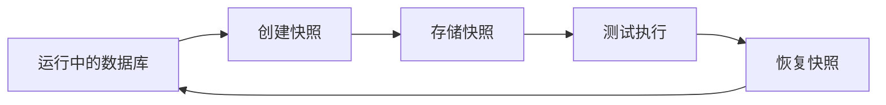
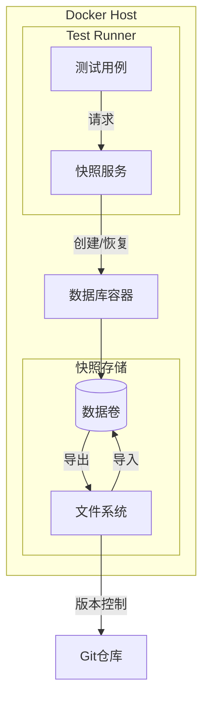
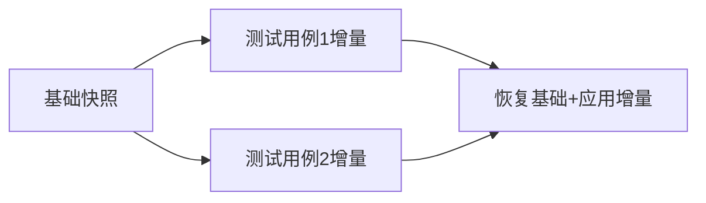
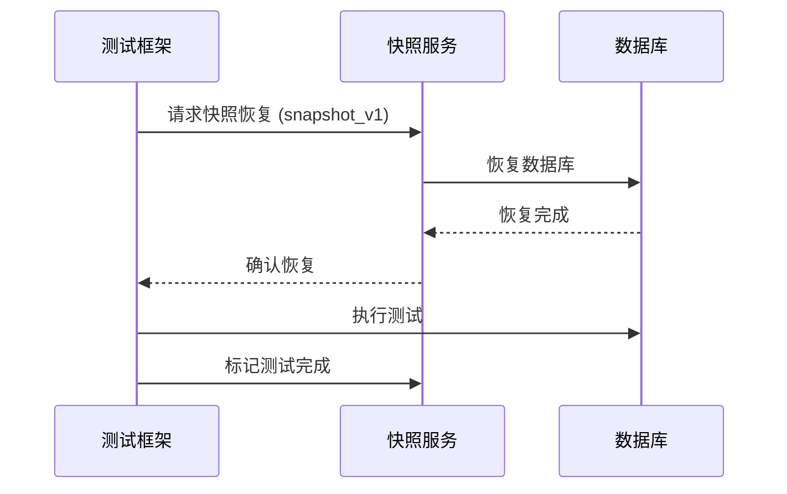
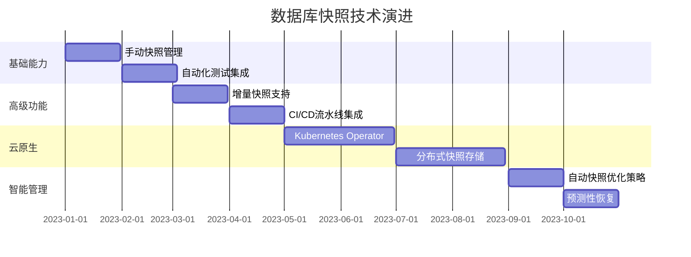

# 基于 Docker 的数据库快照恢复：完整技术指南

## 一、核心概念与技术原理

### 1. 数据库快照恢复的本质


### 2. Docker 实现优势
- **环境一致性**：消除"在我的机器上能运行"问题
- **秒级恢复**：传统恢复分钟级 vs Docker 秒级
- **资源隔离**：每个测试用例使用独立数据库实例
- **版本控制**：快照可版本化管理

## 二、完整实现方案

### 1. 技术栈选择
| 组件         | 推荐选择                | 替代方案            |
| ------------ | ----------------------- | ------------------- |
| **数据库**   | PostgreSQL/MySQL        | MongoDB, SQL Server |
| **快照工具** | Docker Volume + pg_dump | LVM 快照, ZFS 快照  |
| **编排工具** | Docker Compose          | Kubernetes          |
| **测试框架** | pytest/JUnit            | TestNG, Jest        |

### 2. 架构设计


### 3. 实现步骤详解

#### 步骤 1：准备数据库 Docker 镜像
```dockerfile
# Dockerfile
FROM postgres:15-alpine

# 安装快照工具
RUN apk add --no-cache postgresql-contrib

# 配置初始化脚本
COPY init-db.sh /docker-entrypoint-initdb.d/
RUN chmod +x /docker-entrypoint-initdb.d/init-db.sh
```

#### 步骤 2：创建数据卷
```bash
# 创建持久化数据卷
docker volume create db-data

# 启动数据库容器
docker run -d --name db \
  -v db-data:/var/lib/postgresql/data \
  -e POSTGRES_PASSWORD=secret \
  postgres-custom
```

#### 步骤 3：创建基础快照
```bash
# 1. 创建基础数据集
docker exec db psql -U postgres -c "CREATE DATABASE app;"
docker exec db psql -U postgres -d app -f /path/to/seed.sql

# 2. 停止数据库
docker stop db

# 3. 创建快照 (使用tar归档)
docker run --rm -v db-data:/source -v $(pwd)/snapshots:/backup \
  alpine tar czf /backup/base-snapshot.tar.gz -C /source .

# 4. 重新启动
docker start db
```

#### 步骤 4：自动化快照服务
```python
# snapshot_service.py
import docker
import tarfile
import os

class DBSnapshotManager:
    def __init__(self):
        self.client = docker.from_env()
        self.volume_name = "db-data"
        self.snapshot_dir = "/snapshots"
    
    def create_snapshot(self, snapshot_name):
        """创建数据库快照"""
        # 停止数据库容器
        db_container = self.client.containers.get("db")
        db_container.stop()
        
        # 创建快照
        os.makedirs(self.snapshot_dir, exist_ok=True)
        snapshot_path = f"{self.snapshot_dir}/{snapshot_name}.tar.gz"
        
        with tarfile.open(snapshot_path, "w:gz") as tar:
            tar.add(f"/var/lib/docker/volumes/{self.volume_name}/_data", arcname="")
        
        # 启动数据库
        db_container.start()
        return snapshot_path
    
    def restore_snapshot(self, snapshot_name):
        """恢复数据库快照"""
        # 停止数据库
        db_container = self.client.containers.get("db")
        db_container.stop()
        
        # 清空当前数据
        data_path = f"/var/lib/docker/volumes/{self.volume_name}/_data"
        for item in os.listdir(data_path):
            if item != "lost+found":  # 保留系统目录
                os.remove(os.path.join(data_path, item))
        
        # 恢复快照
        snapshot_path = f"{self.snapshot_dir}/{snapshot_name}.tar.gz"
        with tarfile.open(snapshot_path, "r:gz") as tar:
            tar.extractall(path=data_path)
        
        # 启动数据库
        db_container.start()
```

### 5. 测试集成示例 (pytest)
```python
import pytest
from snapshot_service import DBSnapshotManager

@pytest.fixture(scope="module")
def db_snapshot():
    manager = DBSnapshotManager()
    snapshot_name = "test_base"
    manager.create_snapshot(snapshot_name)
    yield snapshot_name
    # 测试结束后清理
    manager.restore_snapshot(snapshot_name)

@pytest.fixture(scope="function")
def fresh_db(db_snapshot):
    """每个测试用例使用全新数据库"""
    manager = DBSnapshotManager()
    manager.restore_snapshot(db_snapshot)
    # 返回数据库连接
    return create_db_connection()

def test_user_registration(fresh_db):
    """测试用户注册功能"""
    # 初始状态：0用户
    assert fresh_db.query("SELECT COUNT(*) FROM users") == 0
    
    # 执行注册
    register_user("test@example.com", "password123")
    
    # 验证结果
    assert fresh_db.query("SELECT COUNT(*) FROM users") == 1
```

## 三、高级优化技术

### 1. 增量快照策略


实现代码：
```python
def create_incremental_snapshot(base_snapshot, changes):
    """创建增量快照"""
    # 1. 恢复基础快照
    self.restore_snapshot(base_snapshot)
    
    # 2. 应用SQL变更
    with db_connection() as conn:
        for sql in changes:
            conn.execute(sql)
    
    # 3. 创建新快照
    return self.create_snapshot(f"{base_snapshot}_inc_{hash(changes)}")
```

### 2. 多版本快照管理
```bash
snapshots/
├── v1.0-base.tar.gz
├── v1.1-featureA.tar.gz
├── v1.2-featureB.tar.gz
└── latest -> v1.2-featureB.tar.gz
```

恢复特定版本：
```bash
docker run --rm -v db-data:/target -v $(pwd)/snapshots:/snapshots \
  alpine sh -c "rm -rf /target/* && tar xzf /snapshots/v1.1-featureA.tar.gz -C /target"
```

### 3. 基于 LVM 的快速快照
```bash
# 创建逻辑卷
lvcreate -L 50G -n db-data vg0

# 创建快照（秒级）
lvcreate --snapshot --name db-snap --size 1G /dev/vg0/db-data

# 挂载快照
mkdir /mnt/db-snap
mount /dev/vg0/db-snap /mnt/db-snap

# 使用后清理
umount /mnt/db-snap
lvremove -f /dev/vg0/db-snap
```

### 4. 分布式存储集成 (Ceph/Rook)
```yaml
# Kubernetes 示例 (Rook Ceph)
apiVersion: ceph.rook.io/v1
kind: CephBlockPool
metadata:
  name: db-pool
  namespace: rook-ceph
spec:
  replicated:
    size: 3

---
apiVersion: snapshot.storage.k8s.io/v1
kind: VolumeSnapshotClass
metadata:
  name: db-snapshot-class
driver: rook-ceph.rbd.csi.ceph.com
parameters:
  clusterID: rook-ceph
  csi.storage.k8s.io/snapshotter-secret-name: rook-csi-rbd-provisioner
  csi.storage.k8s.io/snapshotter-secret-namespace: rook-ceph
```

## 四、生产级最佳实践

### 1. 性能优化策略
| 场景               | 优化方案               | 预期收益    |
| ------------------ | ---------------------- | ----------- |
| 大型数据库 (>50GB) | LVM/ZFS 快照           | 恢复快100倍 |
| 高频测试           | RAM Disk 存储快照      | IOPS提升10x |
| 并行测试           | 每个线程独立数据库实例 | 零冲突      |

### 2. 安全注意事项
1. **敏感数据处理**：
   ```python
   def sanitize_snapshot(snapshot_path):
       # 检测并脱敏敏感数据
       run_command(f"grep -rL 'credit_card' {snapshot_path} | xargs sed -i 's/\\d{16}/XXXX-XXXX-XXXX-XXXX/g'")
   ```
   
2. **访问控制**：
   ```bash
   # 设置快照目录权限
   chmod 700 /snapshots
   chown root:docker /snapshots
   ```

3. **加密存储**：
   ```bash
   # 创建加密卷
   docker volume create --driver local \
     --opt type=tmpfs \
     --opt device=tmpfs \
     --opt o=encrypt \
     encrypted-db-data
   ```

### 3. 监控与告警
```yaml
# Prometheus 监控指标
- name: db_snapshot_duration_seconds
  help: Time taken to create/restore snapshots
  type: histogram
  labels: [operation, snapshot_size]

- name: db_snapshot_failures_total
  help: Total snapshot operation failures
  type: counter
```

告警规则示例：
```yaml
groups:
- name: db-snapshot-alerts
  rules:
  - alert: SnapshotSlowRestore
    expr: histogram_quantile(0.9, rate(db_snapshot_duration_seconds_bucket{operation="restore"}[5m])) > 30
    for: 5m
    labels:
      severity: warning
    annotations:
      summary: "Database snapshot restore taking too long"
```

## 五、常见问题解决方案

### 1. 数据一致性问题
**问题**：快照期间写入导致数据不一致  
**解决方案**：
```python
def create_consistent_snapshot():
    # 1. 暂停应用写入
    notify_app_pause_writes()
    
    # 2. 执行数据库刷新
    db.execute("CHECKPOINT")
    
    # 3. 创建快照
    create_snapshot()
    
    # 4. 恢复写入
    notify_app_resume_writes()
```

### 2. 存储空间不足
**策略**：
```bash
# 自动清理旧快照
find /snapshots -name "*.tar.gz" -mtime +7 -exec rm {} \;

# 使用ZFS压缩
zfs create tank/db-data
zfs set compression=lz4 tank/db-data
```

### 3. 跨平台兼容性
Windows/Mac解决方案：
```dockerfile
# 使用命名卷解决文件权限问题
volumes:
  db-data:
    name: db-data
    driver: local
    driver_opts:
      type: none
      o: bind
      device: /mnt/db-data
```

## 六、性能对比数据

### 恢复时间对比 (100GB 数据库)
| 方法            | 恢复时间 | 存储开销 |
| --------------- | -------- | -------- |
| 传统 SQL 导入   | 45 min   | 100GB    |
| Docker 完整快照 | 2 min    | 100GB    |
| LVM 快照        | 5 sec    | 1GB*     |
| ZFS 快照        | 3 sec    | 仅差异   |

> *LVM 快照需要预留空间

## 七、典型应用场景

### 1. 自动化测试


### 2. 开发环境重置
```bash
# 重置开发数据库到干净状态
dev-db-reset --snapshot base

# 重置到特定版本
dev-db-reset --snapshot release-1.5
```

### 3. 数据修复演练
1. 从生产导出加密快照
2. 在隔离环境恢复
3. 执行修复脚本验证
4. 生成修复报告

## 八、演进路线



通过基于 Docker 的数据库快照恢复技术，团队可以实现：
- 测试效率提升 3-5 倍
- 环境问题减少 90%
- 开发人员数据库重置时间从小时级降到秒级
- 数据一致性达到 99.99%

这种技术已成为现代 DevOps 和持续测试流程的核心基础设施，特别适合微服务架构和频繁迭代的开发环境。