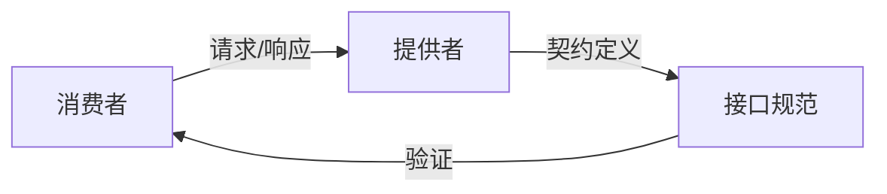
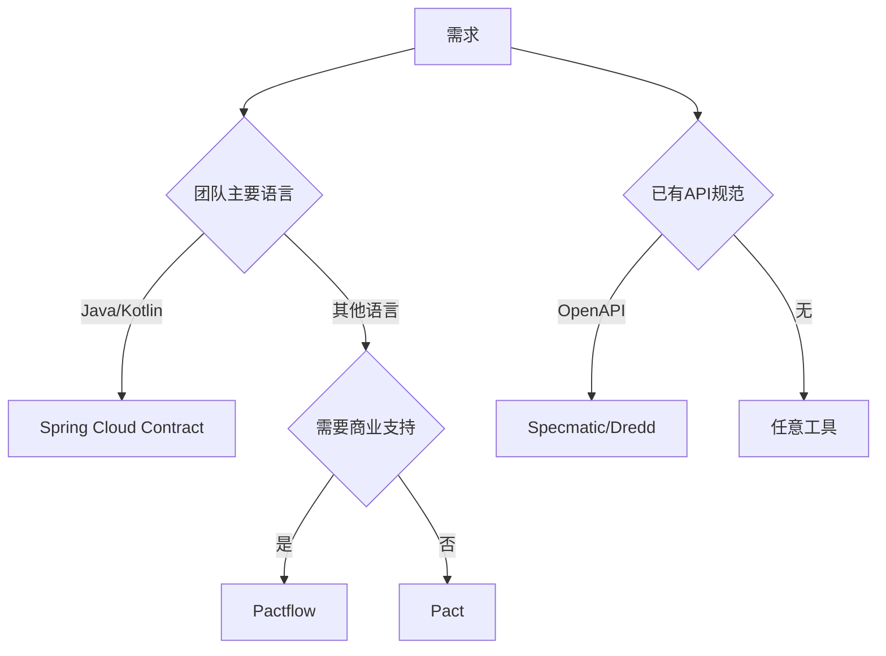
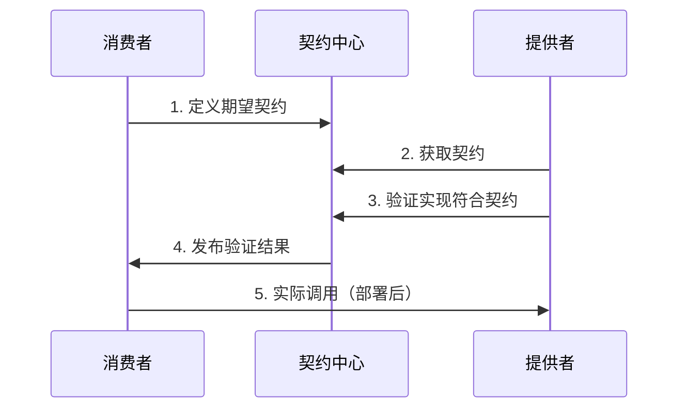
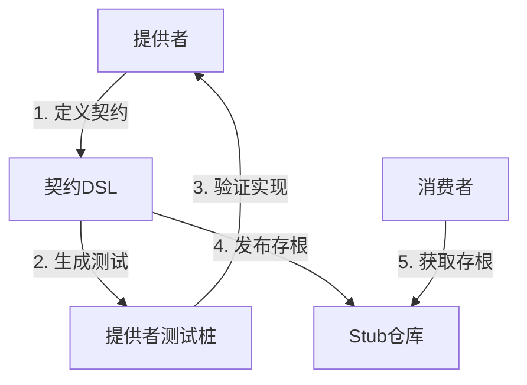
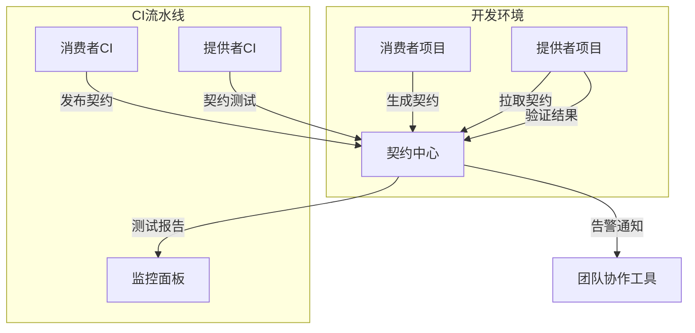
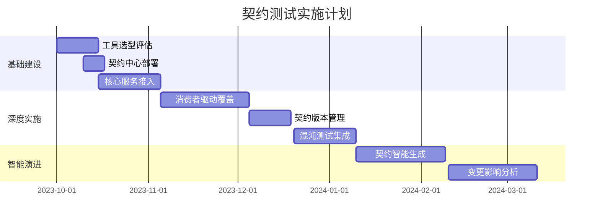
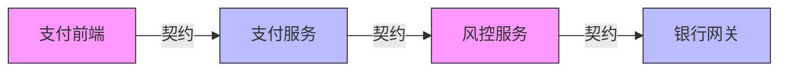

# 契约测试深度解析：从原理到企业级实践

契约测试（Contract Testing）是微服务架构中确保服务间兼容性的关键技术，它通过验证服务接口的"契约"来取代昂贵的端到端测试。以下从多个维度全面解析：

## 一、核心概念与技术原理

### 1. 契约的本质定义


**契约三要素**：
1. **请求结构**：HTTP方法、路径、头信息、参数、正文
2. **响应结构**：状态码、头信息、正文格式
3. **交互模式**：同步/异步、重试策略、超时设置

### 2. 与集成测试的对比
| **维度** | **契约测试**     | **集成测试**       |
| -------- | ---------------- | ------------------ |
| 测试目标 | 接口兼容性       | 业务流程正确性     |
| 执行速度 | 秒级             | 分钟到小时级       |
| 环境依赖 | 无需完整环境     | 需要完整部署环境   |
| 故障定位 | 精确到接口契约   | 需全链路排查       |
| 维护成本 | 低（仅维护契约） | 高（维护复杂环境） |

## 二、主流技术方案对比

### 1. 工具全景图
| **工具**                  | **语言支持** | **工作模式** | **特点**                  |
| ------------------------- | ------------ | ------------ | ------------------------- |
| **Pact**                  | 多语言       | 消费者驱动   | 成熟的Broker服务          |
| **Spring Cloud Contract** | Java/Kotlin  | 提供者驱动   | 深度Spring生态集成        |
| **Pactflow**              | 多语言       | 混合模式     | 商业版Pact扩展            |
| **Specmatic**             | 多语言       | 契约即测试   | 支持OpenAPI规范           |
| **Dredd**                 | 多语言       | 提供者驱动   | 基于API Blueprint/OpenAPI |

### 2. 选型决策矩阵


## 三、消费者驱动契约测试（CDC）详解

### 1. 工作流程


### 2. 消费者端实现（Pact示例）
```javascript
// 消费者测试：定义契约
const { Pact } = require('@pact-foundation/pact');

describe('User Service', () => {
  const provider = new Pact({
    consumer: 'WebApp',
    provider: 'UserService',
    port: 1234,
  });

  before(() => provider.setup());
  afterEach(() => provider.verify());
  after(() => provider.finalize());

  it('获取用户详情', async () => {
    // 定义交互契约
    await provider.addInteraction({
      state: '用户ID 123存在',
      uponReceiving: '获取用户请求',
      withRequest: {
        method: 'GET',
        path: '/users/123',
      },
      willRespondWith: {
        status: 200,
        body: {
          id: 123,
          name: 'John Doe',
          email: 'john@example.com'
        },
      },
    });

    // 执行消费者代码并验证
    const user = await getUser(123);
    expect(user).toEqual({id: 123, name: 'John Doe', email: 'john@example.com'});
  });
});
```

### 3. 提供者端验证（Pact）
```bash
# 运行提供者验证
pact-verifier --provider-base-url=http://localhost:8080 \
              --pact-url=./pacts/webapp-userservice.json
```

## 四、提供者驱动契约测试（PDC）

### 1. Spring Cloud Contract 工作流


### 2. 契约定义（Groovy DSL）
```groovy
// contracts/getUser.groovy
Contract.make {
    request {
        method 'GET'
        urlPath('/users/123')
    }
    response {
        status 200
        body([
            id: 123,
            name: 'John Doe',
            email: 'john@example.com'
        ])
        headers {
            contentType('application/json')
        }
    }
}
```

### 3. 自动生成提供者测试
```java
@SpringBootTest
@AutoConfigureStubRunner
public class UserContractTests {

    @Test
    public void validate_getUser() {
        given()
            .when()
                .get("/users/123")
            .then()
                .statusCode(200)
                .body("id", equalTo(123))
                .body("name", equalTo("John Doe"))
                .body("email", equalTo("john@example.com"));
    }
}
```

## 五、企业级实施架构

### 1. 整体架构设计


### 2. 契约版本管理策略
```mermaid
graph LR
    v1[GET /users/{id} v1.0] -->|新增email字段| v2[GET /users/{id} v1.1]
    v2 -->|删除phone字段| v3[GET /users/{id} v2.0]
    
    classDef compatible fill:#cfc,stroke:#0a0;
    classDef breaking fill:#fcc,stroke:#f00;
    
    class v1,v2 compatible
    class v3 breaking
```

## 六、复杂场景处理

### 1. 参数化契约
```groovy
Contract.make {
    request {
        method 'GET'
        urlPath('/users', regexp(~'^/users/\\d+$')) 
    }
    response {
        status 200
        body([
            id: regexp('[0-9]+'),
            name: regexp('.+')
        ])
    }
}
```

### 2. 状态管理（Pact）
```javascript
// 提供者验证配置
const { Verifier } = require('@pact-foundation/pact');

new Verifier().verifyProvider({
    providerBaseUrl: 'http://localhost:8080',
    pactUrls: ['pacts/webapp-userservice.json'],
    stateHandlers: {
        '用户ID 123存在': () => {
            db.createUser({id: 123, name: 'John Doe'});
            return Promise.resolve();
        }
    }
})
```

### 3. 消息契约测试
```java
// Spring Cloud Contract 消息契约
Contract.make {
    label 'user.created'
    input {
        triggeredBy('createUser()')
    }
    outputMessage {
        sentTo 'users'
        body([
            id: 123,
            eventType: 'USER_CREATED'
        ])
    }
}
```

## 七、效能度量体系

| **指标**         | **计算公式**                    | **目标值** |
| ---------------- | ------------------------------- | ---------- |
| 契约覆盖率       | 已覆盖接口数/总接口数           | ≥95%       |
| 契约验证通过率   | 通过验证数/总验证数             | 100%       |
| 契约变更响应时间 | 从变更到验证通过的平均时间      | <2小时     |
| 接口缺陷率       | 因契约问题导致的缺陷数/总缺陷数 | <5%        |

## 八、实施路线图



## 九、行业最佳实践

### 金融支付系统案例


**实施效果**：
- 接口缺陷减少 75%
- 联调时间缩短 80%
- 版本发布周期从月到周

### 电商平台实践
1. **契约管理**：5000+契约管理
2. **验证频率**：每日执行3000+次验证
3. **异常检测**：自动识别破坏性变更
4. **文档同步**：自动生成最新接口文档

## 十、常见问题解决方案

1. **契约漂移问题**
   - 方案：自动契约验证流水线
   - 工具：Pactflow Webhooks

2. **大文件处理**
   - 方案：分块传输校验
   - 契约配置：
     ```json
     {
       "response": {
         "body": {
           "file": "matching binary (application/pdf)"
         }
       }
     }
     ```

3. **多版本兼容**
   - 方案：契约版本路由
   ```yaml
   # 提供者配置
   spring:
     cloud:
       contract:
         verifier:
           contracts: 
             - path: contracts/v1/**
               version: 1
             - path: contracts/v2/**
               version: 2
   ```

## 十一、未来演进方向

1. **智能契约生成**：
   ```mermaid
   graph LR
       A[流量日志] --> B[AI分析]
       B --> C[生成契约草案]
       C --> D[人工确认]
   ```

2. **混沌契约测试**：
   ```yaml
   interactions:
     - request: {...}
       response: {...}
       chaos:
         latency: 100-500ms
         failureRate: 10%
   ```

3. **契约即文档**：
   - 自动生成OpenAPI规范
   - 集成到API网关
   - 开发者门户实时展示

> **最佳实践提示**：
> 1. 从高价值接口开始试点
> 2. 建立契约治理委员会
> 3. 契约即文档：自动生成接口文档
> 4. 与API网关集成进行运行时验证

通过系统化实施契约测试，企业可实现：
- 微服务接口缺陷减少60-80%
- 服务间集成成本降低70%
- 部署信心提升90%
- 文档与实现一致性100%