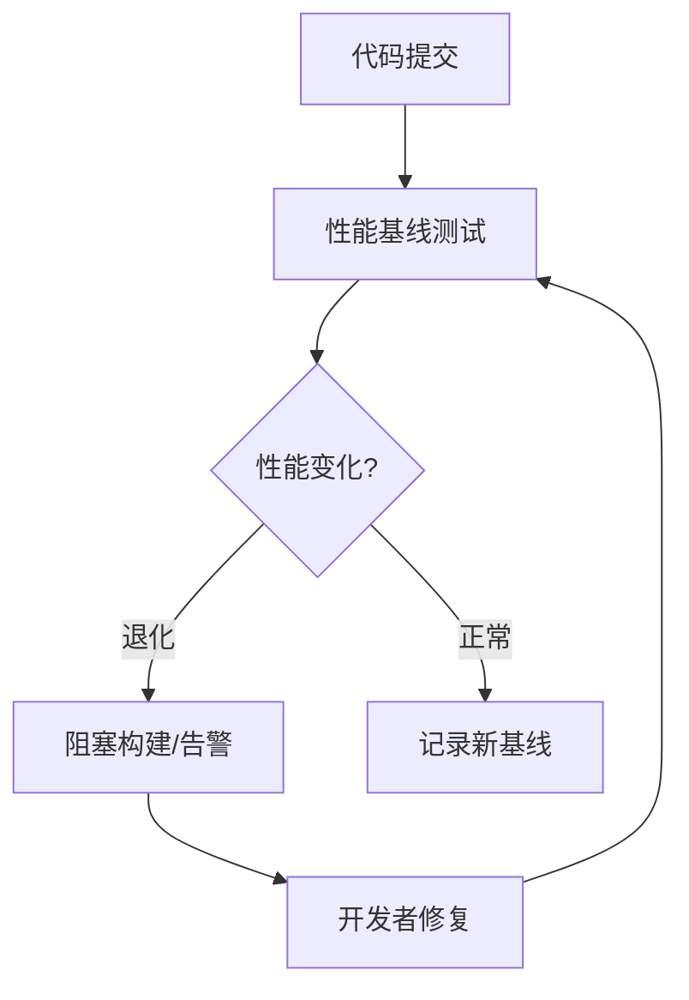
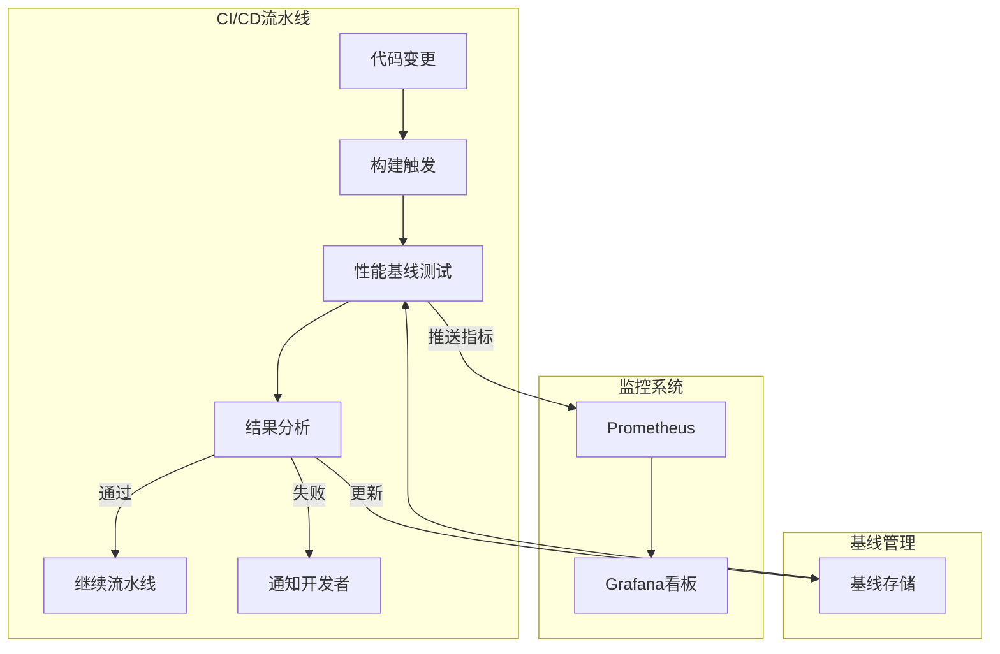
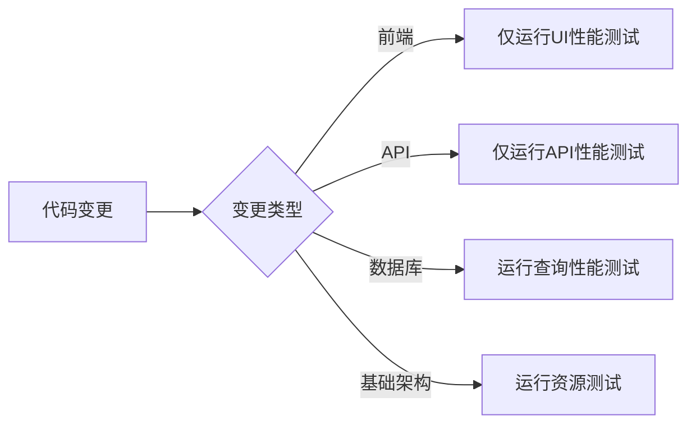
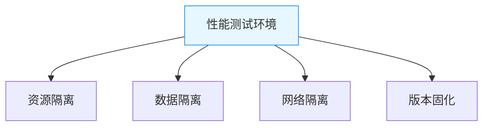
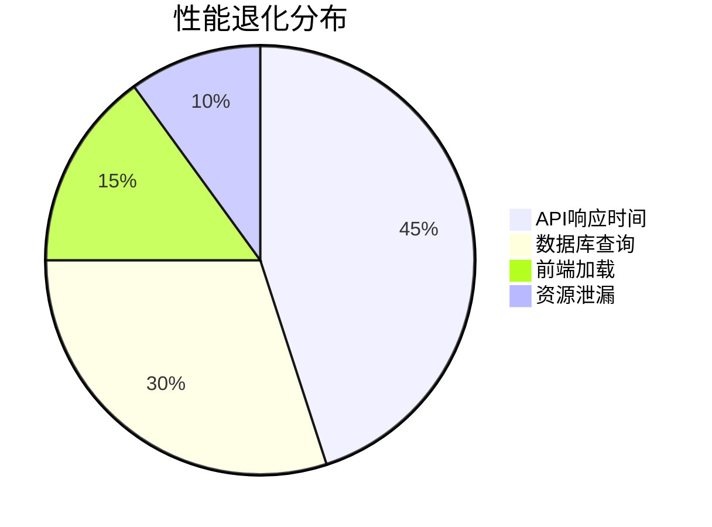
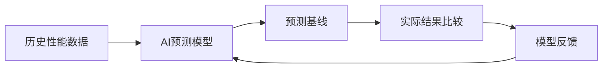
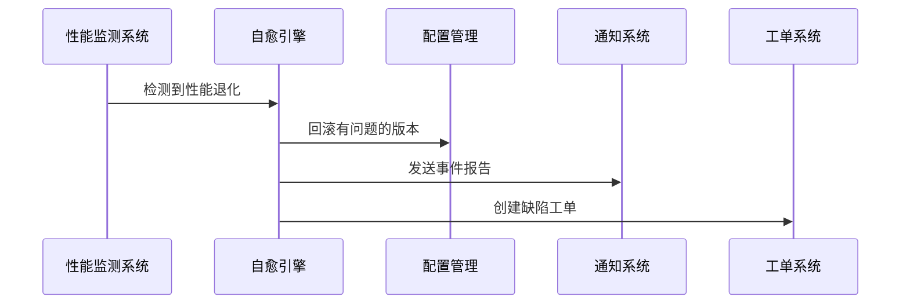
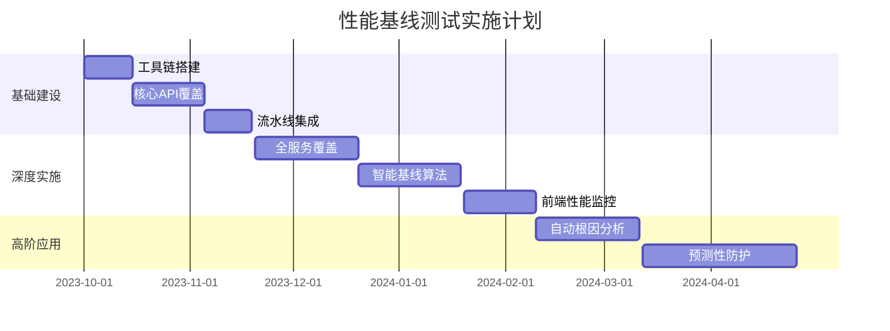

# 性能基线测试

性能基线测试在测试左移中扮演着关键角色，它通过在开发早期建立性能基准，持续监控性能变化，确保软件在迭代过程中不会出现性能退化。以下从多个维度全面解析：

## 一、核心概念与技术原理

### 1. 性能基线测试的本质


### 2. 与传统性能测试的对比
| **维度**     | **性能基线测试**      | **传统性能测试** |
| ------------ | --------------------- | ---------------- |
| **执行时机** | 每次代码变更/每日构建 | 发布前阶段       |
| **测试目标** | 检测性能退化          | 验证系统容量     |
| **执行速度** | 分钟级（快速反馈）    | 小时/天级        |
| **环境要求** | 开发/测试环境         | 生产级环境       |
| **主要价值** | 预防性能劣化          | 评估系统极限     |

## 二、技术架构与工具链

### 1. 核心组件架构


### 2. 推荐工具栈
| **功能**       | **工具**             | **特点**       |
| -------------- | -------------------- | -------------- |
| **负载生成**   | k6, Locust, JMeter   | 轻量级、CI友好 |
| **指标采集**   | Prometheus, InfluxDB | 时间序列数据库 |
| **可视化**     | Grafana, Kibana      | 自定义仪表板   |
| **基线管理**   | TimescaleDB, S3+JSON | 历史数据存储   |
| **异常检测**   | Prophet, TensorFlow  | 机器学习预测   |
| **流水线集成** | Jenkins, GitLab CI   | 自动化触发     |

## 三、实施流程详解

### 1. 建立初始基线
```bash
# 使用k6建立API响应时间基线
k6 run --out json=baseline.json \
  -e URL=http://dev-api/service \
  script.js
```

### 2. 基准指标定义
| **指标类型** | **关键指标**             | **阈值策略** |
| ------------ | ------------------------ | ------------ |
| 响应性能     | P95延迟、错误率          | 不允许退化   |
| 资源利用率   | CPU/MEM使用率            | 允许±10%波动 |
| 吞吐量       | RPS(每秒请求数)          | 允许±5%波动  |
| 业务指标     | 订单创建延迟、支付成功率 | 零退化       |

### 3. 流水线集成示例（GitLab CI）
```yaml
stages:
  - build
  - performance

performance-baseline:
  stage: performance
  image: loadimpact/k6
  variables:
    BASELINE_FILE: "baseline.json"
  script:
    - k6 run --out json=current.json script.js
    - python compare.py baseline.json current.json
  artifacts:
    paths:
      - current.json
    reports:
      junit: report.xml
  rules:
    - if: $CI_PIPELINE_SOURCE == "merge_request"
```

### 4. 智能比较算法
```python
def detect_regression(current, baseline):
    """检测性能退化"""
    # 计算关键指标变化率
    metrics = ["p95_latency", "error_rate"]
    regression = False
    
    for metric in metrics:
        curr_val = current["metrics"][metric]
        base_val = baseline["metrics"][metric]
        
        # 计算变化率
        change = (curr_val - base_val) / base_val
        
        # 应用不同指标的阈值
        thresholds = {
            "p95_latency": 0.05,  # 允许5%退化
            "error_rate": 0.01     # 错误率增加不超过1%
        }
        
        if change > thresholds[metric]:
            print(f"性能退化: {metric} 变化 {change*100:.2f}%")
            regression = True
    
    return regression
```

## 四、关键技术创新

### 1. 自适应基线算法
```python
from fbprophet import Prophet

def update_baseline(historical_data):
    """使用时间序列预测更新基线"""
    model = Prophet()
    model.fit(historical_data)
    future = model.make_future_dataframe(periods=1)
    forecast = model.predict(future)
    
    # 取最后一行的预测值作为新基线
    new_baseline = forecast.iloc[-1][['yhat', 'yhat_lower', 'yhat_upper']]
    return new_baseline
```

### 2. 微变更检测


### 3. 容器化性能测试
```dockerfile
FROM loadimpact/k6
COPY tests /tests
CMD ["run", "/tests/smoke.js"]
```

## 五、企业级实施策略

### 1. 分级基线策略
| **测试级别** | **执行频率** | **目标**     |
| ------------ | ------------ | ------------ |
| **提交级**   | 每次代码提交 | 检测严重退化 |
| **每日级**   | 每日构建     | 监控趋势变化 |
| **版本级**   | 发布候选版本 | 全面性能评估 |

### 2. 环境治理策略


### 3. 智能告警机制
```python
def generate_alert(metric, current, baseline):
    """生成智能告警"""
    # 计算变化率
    change = (current - baseline) / baseline
    
    # 分级告警
    if abs(change) > 0.5:
        level = "CRITICAL"
    elif abs(change) > 0.2:
        level = "WARNING"
    else:
        return None  # 无需告警
    
    # 关联代码变更
    last_commit = get_last_commit()
    
    return {
        "level": level,
        "metric": metric,
        "current": current,
        "baseline": baseline,
        "change": f"{change*100:.2f}%",
        "commit": last_commit
    }
```

## 六、典型应用场景

### 1. API性能监控
```javascript
// k6测试脚本示例
import http from 'k6/http';
import { check } from 'k6';

export const options = {
  thresholds: {
    http_req_duration: ['p(95)<500'], // P95延迟<500ms
    http_req_failed: ['rate<0.01'],   // 错误率<1%
  },
};

export default function () {
  const res = http.post('https://api.example.com/login', {
    username: 'test',
    password: 'test',
  });
  
  check(res, {
    'status is 200': (r) => r.status === 200,
    'response time OK': (r) => r.timings.duration < 1000,
  });
}
```

### 2. 数据库查询分析
```sql
-- 自动检测慢查询
EXPLAIN ANALYZE 
SELECT * FROM orders 
WHERE user_id = 123 
AND created_at > NOW() - INTERVAL '30 days';
```

### 3. 前端性能监控
```javascript
// 使用Lighthouse CI
module.exports = {
  ci: {
    collect: {
      url: ['http://localhost:3000'],
    },
    assert: {
      assertions: {
        'categories:performance': ['error', {minScore: 0.9}],
        'first-contentful-paint': ['warn', {maxNumericValue: 2000}],
      },
    },
  },
};
```

## 七、效能度量体系

### 1. 核心度量指标
| **指标**           | **计算公式**        | **目标值** |
| ------------------ | ------------------- | ---------- |
| 性能退化发现率     | 退化次数/总构建次数 | <5%        |
| 平均修复时间(MTTR) | 总修复时间/退化次数 | <2小时     |
| 基线覆盖率         | 覆盖服务数/总服务数 | >90%       |
| 构建阻塞率         | 被阻塞构建/总构建数 | <3%        |

### 2. 质量门禁配置
```yaml
# 性能质量门禁
performance_gate:
  rules:
    - metric: p95_latency
      max_change: 5%   # 允许最大退化
    - metric: error_rate
      max_value: 1%    # 错误率上限
    - metric: memory_usage
      max_change: 10%  # 内存增长上限
```

## 八、最佳实践案例

### 电商平台实施效果


**实施成果**：
- 生产环境性能问题减少70%
- 性能修复成本降低90%
- 发布信心指数提升40%
- 关键业务API P95延迟优化35%

## 九、常见问题解决方案

### 1. 环境差异问题
**解决方案**：
```docker-compose
services:
  test-runner:
    image: k6
    volumes:
      - ./scripts:/scripts
    environment:
      - TARGET_ENV=test
    
  target-service:
    image: app-service:${TAG}
    environment:
      - DB_HOST=test-db
    
  test-db:
    image: postgres:14
    volumes:
      - pgdata:/var/lib/postgresql/data
```

### 2. 数据干扰问题
**策略**：
- 使用数据工厂生成测试数据
- 每次测试前重置数据库
- 隔离测试数据分区

### 3. 波动容忍机制
```python
def is_regression(current, baseline):
    # 计算统计显著性
    p_value = calculate_p_value(current_samples, baseline_samples)
    if p_value > 0.05:  # 无统计学差异
        return False
    
    # 检查是否超出容忍范围
    return abs(current - baseline) / baseline > 0.05
```

## 十、未来演进方向

### 1. 智能基线预测


### 2. 因果分析引擎
```python
def find_performance_cause(regression):
    # 关联代码变更
    changes = get_code_changes(regression['time_range'])
    
    # 分析变更类型
    for change in changes:
        if change['type'] == 'database':
            run_query_analysis()
        elif change['type'] == 'algorithm':
            run_complexity_analysis()
    
    # 返回最可能原因
    return rank_causes(analysis_results)
```

### 3. 自愈系统集成


## 十一、实施路线图



> **最佳实践提示**：
> 1. 从关键业务服务开始试点
> 2. 建立性能档案库管理历史数据
> 3. 开发自助式性能测试平台
> 4. 将性能指标纳入团队OKR
> 5. 定期进行性能审查会议

通过系统化实施性能基线测试左移，企业可实现：
- 生产环境性能问题减少60-80%
- 性能优化成本降低5-10倍
- 发布周期缩短30%
- 用户体验指标提升40%