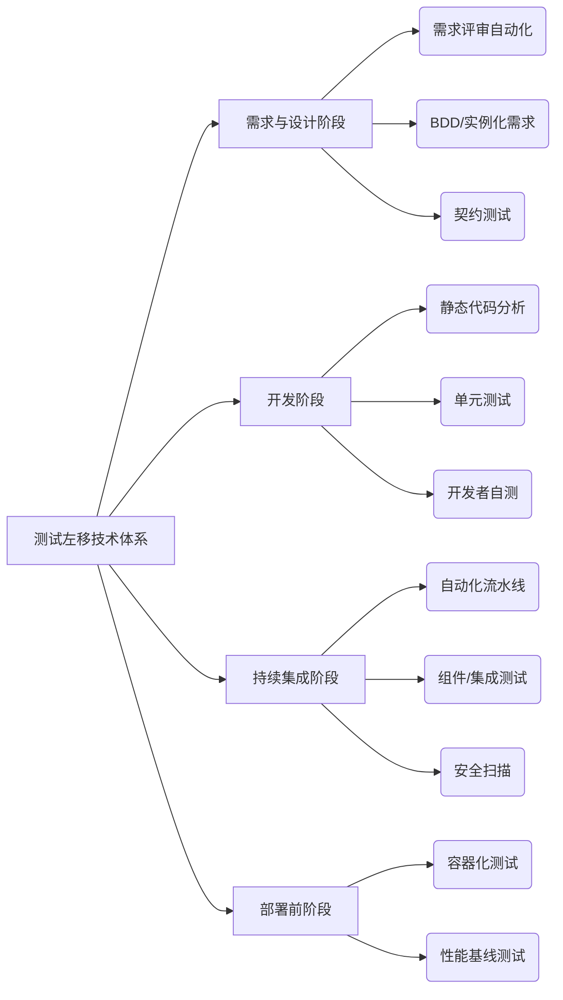
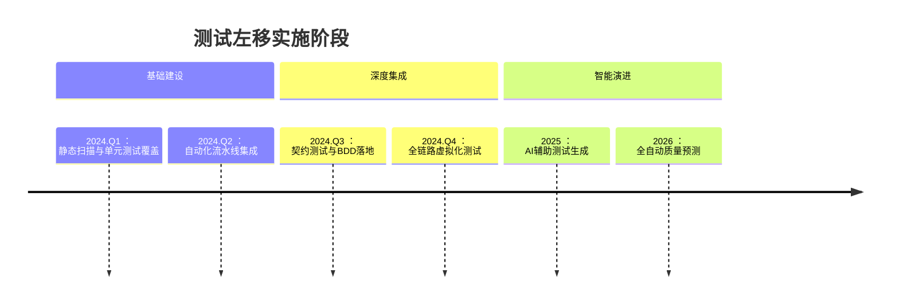

测试左移（Shift-Left Testing）是 DevOps 的核心实践之一，其核心思想是**将测试活动提前到软件开发生命周期的早期阶段**，通过建立多层次的质量防护体系，实现缺陷早发现、修复成本最小化。以下是测试左移的完整技术体系及落地实践：

---

### 一、测试左移的核心技术体系


---

### 二、各阶段关键技术详解

#### 1. 需求与设计阶段
| **技术**              | **工具示例**                        | **实施要点**                 |
| --------------------- | ----------------------------------- | ---------------------------- |
| **需求自动化评审**    | Jira + Xray                         | 自动检查需求可测试性、完整性 |
| **BDD(行为驱动开发)** | Cucumber/SpecFlow/Behave            | 用 Gherkin 语法编写场景用例  |
| **契约测试**          | Pact/PactFlow/Spring Cloud Contract | 保障微服务接口兼容性         |

**实践案例**：
```gherkin
# Cucumber 场景示例
Feature: 用户登录功能
  Scenario: 使用正确密码登录
    Given 用户打开登录页面
    When 输入用户名 "test@example.com" 和密码 "Pass123"
    Then 应显示欢迎消息 "欢迎回来"
```

#### 2. 开发阶段
| **技术**              | **工具链**                  | **关键指标**          |
| --------------------- | --------------------------- | --------------------- |
| **静态代码分析**      | SonarQube/ESLint/Checkstyle | 代码异味/安全漏洞检测 |
| **单元测试**          | JUnit/pytest/Jest           | 分支覆盖率(≥80%)      |
| **TDD(测试驱动开发)** | 结合IDE(IntelliJ/VSCode)    | 测试先行开发          |
| **开发者自测**        | Postman/Testcontainers      | 本地环境API验证       |

**配置示例** (pom.xml 单元测试配置):
```xml
<plugin>
  <groupId>org.jacoco</groupId>
  <artifactId>jacoco-maven-plugin</artifactId>
  <executions>
    <execution>
      <goals>
        <goal>prepare-agent</goal>
      </goals>
    </execution>
    <execution>
      <id>report</id>
      <phase>test</phase>
      <goals>
        <goal>report</goal>
      </goals>
    </execution>
  </executions>
  <configuration>
    <rules>
      <rule>
        <limit>
          <counter>BRANCH</counter>
          <value>COVEREDRATIO</value>
          <minimum>0.8</minimum>
        </limit>
      </rule>
    </rules>
  </configuration>
</plugin>
```

#### 3. 持续集成(CI)阶段
| **技术**             | **实现方案**                     | **质量门禁**      |
| -------------------- | -------------------------------- | ----------------- |
| **流水线自动化测试** | Jenkins/GitLab CI/GitHub Actions | 失败即阻断部署    |
| **组件/集成测试**    | Testcontainers/WireMock          | 模拟外部依赖      |
| **安全扫描**         | OWASP ZAP/Trivy/Snyk             | CVE漏洞库实时检测 |

**GitLab CI 示例**：
```yaml
stages:
  - test
  - security

unit_test:
  stage: test
  image: maven:3.8-openjdk-17
  script:
    - mvn test jacoco:report
  artifacts:
    paths:
      - target/site/jacoco/

security_scan:
  stage: security
  image: owasp/zap2docker-stable
  script:
    - zap-baseline.py -t https://${APP_URL} -r report.html
  allow_failure: false  # 安全扫描失败阻断流水线
```

#### 4. 部署前阶段
| **技术**         | **实施方式**                  | **价值**                    |
| ---------------- | ----------------------------- | --------------------------- |
| **容器化测试**   | Docker + Kubernetes Test Pods | 环境一致性验证              |
| **性能基线测试** | Gatling/k6 + Prometheus       | 性能劣化即时告警            |
| **配置验证**     | Conftest/OPA                  | 基础设施即代码(IaC)安全检查 |

**性能测试脚本示例** (k6):
```javascript
import http from 'k6/http';
import { check } from 'k6';

export const options = {
  thresholds: {
    http_req_duration: ['p(95)<500'], // 95%请求延迟<500ms
  },
};

export default function () {
  const res = http.get('https://api.example.com/v1/users');
  check(res, {
    'is status 200': (r) => r.status === 200,
    'response time OK': (r) => r.timings.duration < 1000
  });
}
```

---

### 三、测试左移基础设施支撑
1. **统一测试数据管理**：
   - 使用 TestData Service 提供数据
   - 基于 Docker 的数据库快照恢复
2. **虚拟化服务**：
   - API Mock：WireMock/Mountebank
   - Service Virtualization：Hoverfly
3. **测试环境治理**：
   - 按需创建环境：Kubernetes Namespace
   - 环境自动回收：TTL(Time-To-Live) 控制器

---

### 四、实施路线图（分阶段演进）


---

### 五、关键成功指标
| **指标**           | 目标值  | 测量工具        |
| ------------------ | ------- | --------------- |
| 缺陷逃逸率         | < 5%    | Jira/Xray       |
| 构建失败修复时间   | < 2小时 | Jenkins/GitLab  |
| 单元测试覆盖率     | ≥ 80%   | JaCoCo/Istanbul |
| CI流水线通过率     | ≥ 95%   | 平台内置报表    |
| 需求到测试用例周期 | < 1天   | 需求管理系统    |

---

### 六、避坑指南
1. **不要追求100%测试覆盖率** → 聚焦高风险模块（帕累托原则）
2. **避免“测试工具军备竞赛”** → 选择与技术栈匹配的工具链
3. **开发测试协作瓶颈** → 建立质量共同体（Quality Guild）
4. **测试数据瓶颈** → 实施数据工厂模式（Test Data Factory）
5. **环境不稳定问题** → 采用容器化 + 服务虚拟化双保障

> 💡 **终极建议**：测试左移本质是**质量文化变革**，技术体系需配套：
> - 质量左移纳入KPI考核
> - 开发人员测试能力培训
> - 质量门禁卡点自动化
> - 质量可视化看板实时反馈

通过以上体系化建设，可将缺陷发现成本降低10倍，部署频率提升5倍以上，实现真正的高效质量内建。