# 组件/集成测试深度解析：从理论到企业级实践

组件测试（Component Testing）和集成测试（Integration Testing）是软件测试金字塔的核心层，确保系统各模块协同工作。以下从多个维度全面解析：

## 一、核心概念与分层模型

### 1. 测试金字塔中的定位
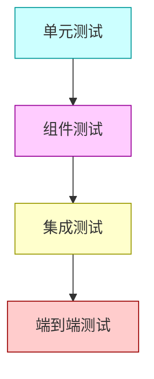

### 2. 核心区别
| **维度**     | **组件测试**     | **集成测试**           |
| ------------ | ---------------- | ---------------------- |
| **测试范围** | 单个模块/服务    | 模块间接口交互         |
| **依赖处理** | 模拟外部依赖     | 使用真实依赖或部分模拟 |
| **测试目标** | 验证模块内部逻辑 | 验证跨模块协作         |
| **执行速度** | 较快(秒级)       | 中等(秒到分钟级)       |
| **失败定位** | 精确到模块内部   | 需分析接口交互         |

## 二、技术实现框架

### 1. 组件测试架构
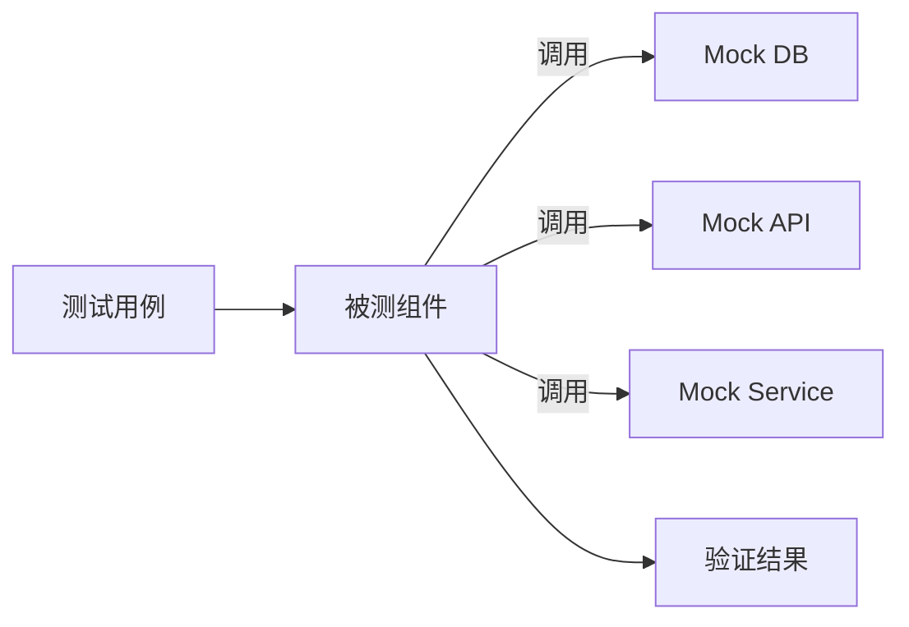

### 2. 集成测试架构


## 三、组件测试深度实践

### 1. 典型技术栈
| **技术**           | **适用语言** | **特点**         |
| ------------------ | ------------ | ---------------- |
| **JUnit+Mockito**  | Java         | 企业级成熟方案   |
| **Pytest**         | Python       | 简洁灵活         |
| **Jest**           | JavaScript   | 零配置、快照测试 |
| **Testcontainers** | 多语言       | 容器化依赖       |

### 2. Spring Boot组件测试示例
```java
@SpringBootTest
@AutoConfigureMockMvc
class UserControllerTest {

    @Autowired
    private MockMvc mockMvc;

    @MockBean
    private UserRepository userRepository;

    @Test
    void getUserById() throws Exception {
        // 模拟依赖行为
        given(userRepository.findById(1L))
            .willReturn(Optional.of(new User(1L, "John")));

        // 执行测试
        mockMvc.perform(get("/users/1"))
               .andExpect(status().isOk())
               .andExpect(jsonPath("$.name").value("John"));
    }
}
```

### 3. 测试策略矩阵
| **依赖类型** | **测试策略**   | **工具示例**         |
| ------------ | -------------- | -------------------- |
| 数据库       | 内存数据库     | H2, SQLite           |
| 外部API      | Mock Server    | WireMock, MockServer |
| 消息队列     | 嵌入式Broker   | Embedded Kafka       |
| 文件系统     | 临时目录       | JUnit TempDir        |
| 其他服务     | Testcontainers | Docker容器           |

## 四、集成测试深度实践

### 1. 典型技术栈
| **技术**               | **适用场景**   | **特点**      |
| ---------------------- | -------------- | ------------- |
| **Spring Integration** | Spring生态系统 | 消息通道测试  |
| **Postman+Newman**     | API集成测试    | 可视化+自动化 |
| **Karate DSL**         | BDD风格API测试 | 多协议支持    |
| **Testcontainers**     | 跨服务集成     | 真实依赖环境  |

### 2. Testcontainers集成测试示例
```java
@SpringBootTest
@Testcontainers
class OrderIntegrationTest {

    @Container
    static PostgreSQLContainer<?> postgres = new PostgreSQLContainer<>("postgres:15");
    
    @Container
    static RabbitMQContainer rabbit = new RabbitMQContainer("rabbitmq:3-management");

    @DynamicPropertySource
    static void configureProperties(DynamicPropertyRegistry registry) {
        registry.add("spring.datasource.url", postgres::getJdbcUrl);
        registry.add("spring.rabbitmq.host", rabbit::getHost);
    }

    @Test
    void createOrder() {
        // 测试订单创建与支付处理的集成
        Order order = orderService.create(new OrderRequest(...));
        assertThat(paymentService.getStatus(order.getId()))
            .isEqualTo(PAYMENT_PROCESSING);
    }
}
```

### 3. 集成测试模式
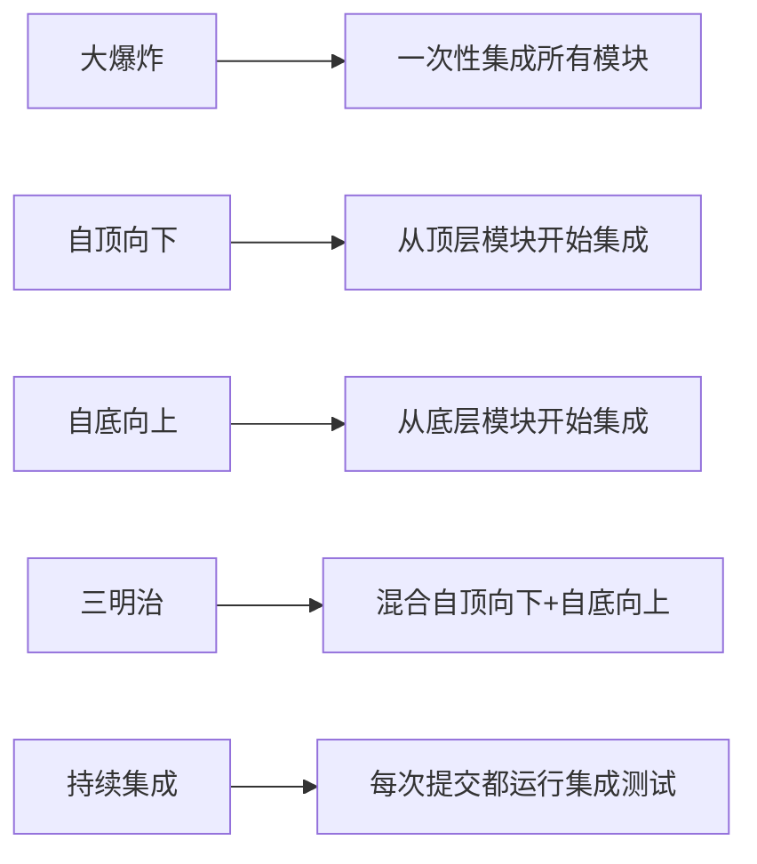

## 五、企业级实施策略

### 1. 环境治理方案
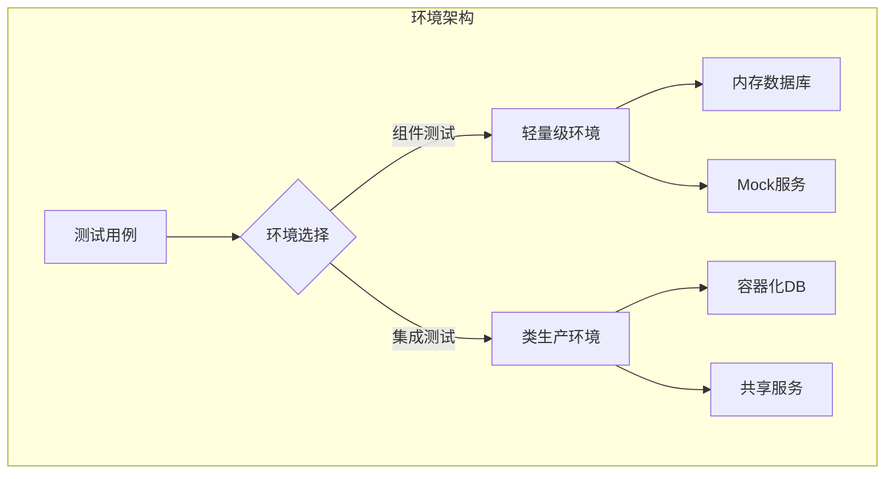

### 2. 测试数据管理
```python
# 测试数据工厂示例
class UserFactory:
    @classmethod
    def create(cls, **kwargs):
        defaults = {
            'username': fake.user_name(),
            'email': fake.email(),
            'status': 'active'
        }
        return {**defaults, **kwargs}

# 在测试中使用
user = UserFactory.create(status='inactive')
```

### 3. 流水线集成
```yaml
# GitLab CI 配置示例
stages:
  - build
  - component-test
  - integration-test

component-test:
  stage: component-test
  image: maven:3.8-openjdk-17
  script:
    - mvn test -Dgroups="component"
  rules:
    - changes:
        - "src/main/java/**"
        - "src/test/java/**"

integration-test:
  stage: integration-test
  image: docker-compose
  services:
    - docker:dind
  script:
    - docker-compose up -d
    - mvn verify -Dgroups="integration"
  dependencies:
    - component-test
```

## 六、复杂场景解决方案

### 1. 异步系统测试
```java
@SpringBootTest
class AsyncIntegrationTest {

    @Autowired
    private EventPublisher publisher;

    @Autowired
    private EventRepository repository;

    @Test
    void testEventProcessing() throws InterruptedException {
        // 发送事件
        publisher.publish(new UserEvent(123, "CREATE"));
        
        // 异步验证
        await().atMost(5, SECONDS)
               .untilAsserted(() -> {
                   assertThat(repository.findByUserId(123))
                       .isNotEmpty();
               });
    }
}
```

### 2. 分布式事务测试
```gherkin
# BDD风格测试
Feature: 分布式事务处理
  Scenario: 订单支付成功
    Given 用户有足够余额
    When 创建订单并支付
    Then 订单状态应为PAID
    And 库存应减少
    And 用户余额应扣除
```

### 3. 跨系统集成
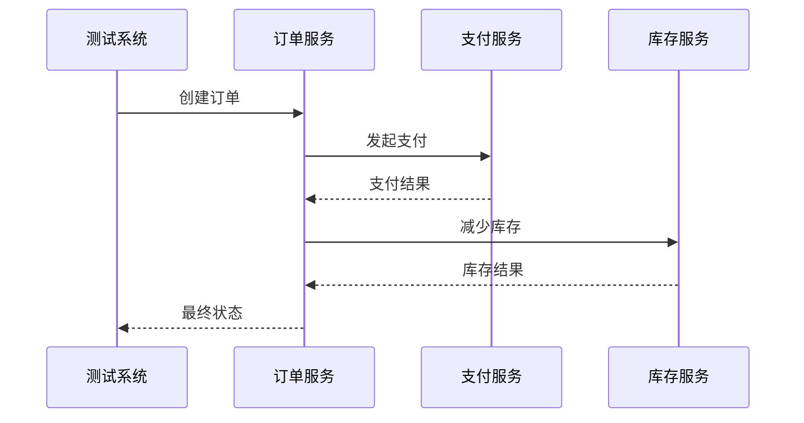

## 七、效能度量体系

### 1. 核心质量指标
| **指标**           | **计算公式**          | **目标值** |
| ------------------ | --------------------- | ---------- |
| 组件覆盖率         | 已测组件/总组件数     | ≥90%       |
| 接口覆盖率         | 已测接口/总接口数     | ≥95%       |
| 测试通过率         | 通过测试数/总测试数   | ≥98%       |
| 缺陷发现率         | 测试发现缺陷/总缺陷数 | ≥70%       |
| 平均修复时间(MTTR) | 总修复时间/缺陷数     | ≤2小时     |

### 2. 持续改进看板
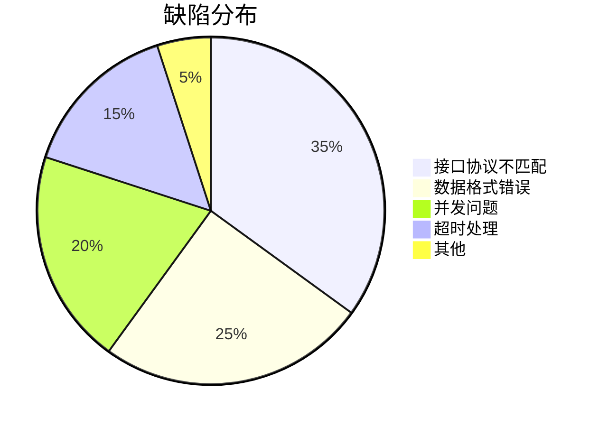

## 八、最佳实践案例

### 电商平台实施
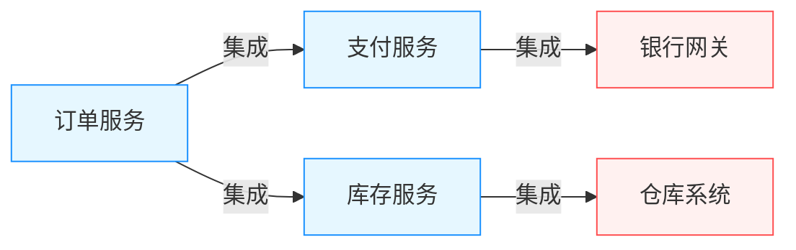

**实施成果**：
- 集成问题减少65%
- 版本发布周期缩短40%
- 生产环境接口故障下降80%
- 团队协作效率提升50%

## 九、常见问题解决方案

### 1. 测试速度优化
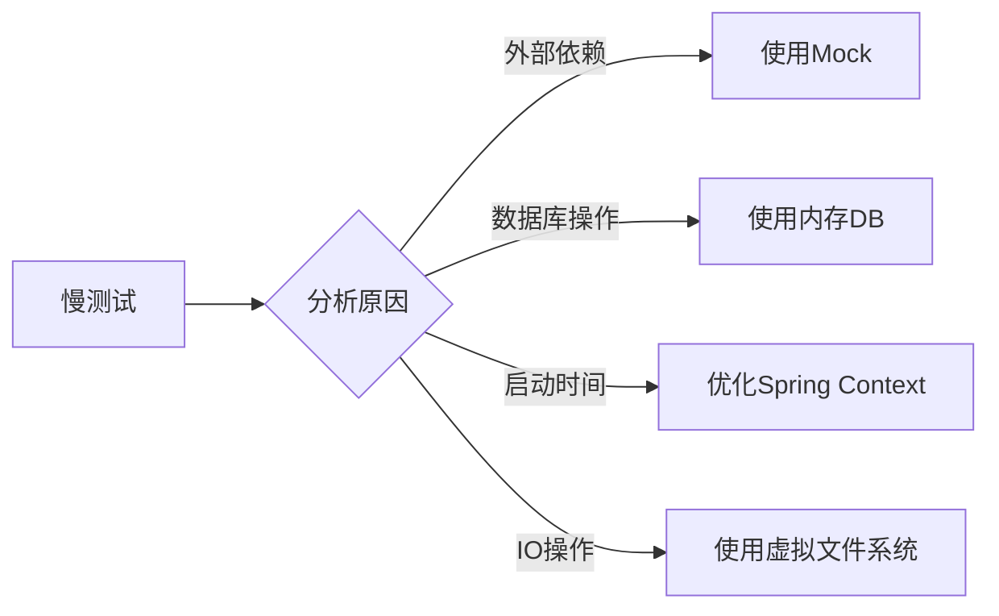

### 2. 测试污染问题
**解决方案**：
```java
@Transactional // 测试后自动回滚
@TestExecutionListeners(listeners = {
    DirtiesContextTestExecutionListener.class,
    TransactionalTestExecutionListener.class
})
public class IsolationTest {
    // 每个测试独立运行环境
    @DirtiesContext(classMode = AFTER_EACH_TEST_METHOD)
    @Test void test1() { ... }
}
```

### 3. 环境差异问题
**容器化解决方案**：
```docker-compose
services:
  app:
    build: .
    depends_on:
      db:
        condition: service_healthy
      redis:
        condition: service_started

  db:
    image: postgres:15
    healthcheck:
      test: ["CMD-SHELL", "pg_isready -U postgres"]
      interval: 5s
      timeout: 10s
      retries: 5

  redis:
    image: redis:7-alpine
```

## 十、未来演进方向

### 1. AI增强测试
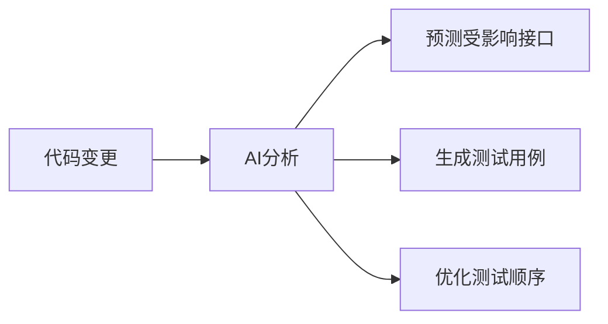

### 2. 混沌工程集成
```yaml
integration_tests:
  - name: 支付服务超时测试
    steps:
      - action: inject_latency
        target: payment_service
        duration: 3000ms
      - verify: order_fallback_activated
```

### 3. 可视化测试编排
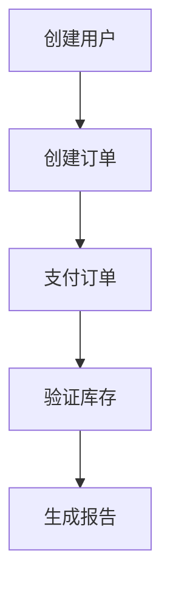

## 十一、实施路线图

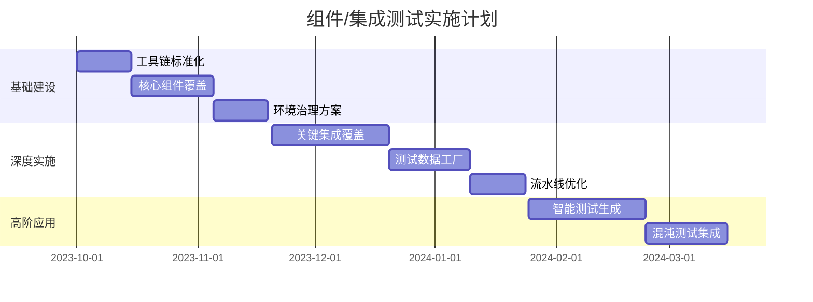

> **最佳实践提示**：
> 1. 采用"契约先行"开发模式
> 2. 建立接口健康监控看板
> 3. 实施测试环境即代码(Environment as Code)
> 4. 定期进行集成测试用例评审
> 5. 将测试指标纳入团队OKR

通过系统化实施组件/集成测试，企业可实现：
- 接口缺陷率降低60-80%
- 系统集成成本减少50%
- 发布失败率下降90%
- 团队协作效率提升40%