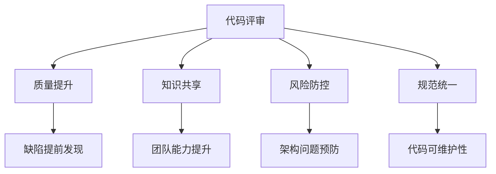
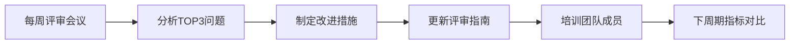
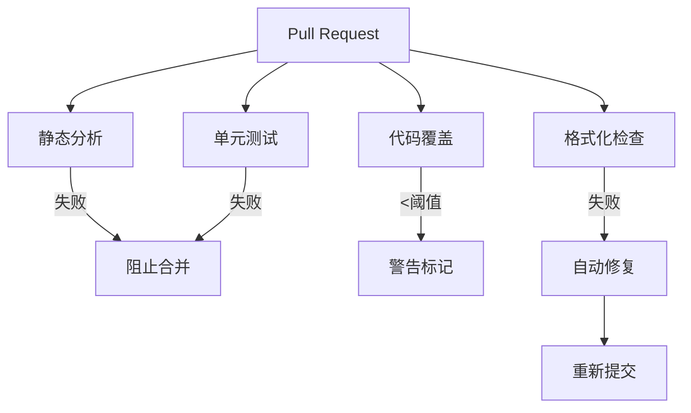

# 软件测试中的代码评审：落地实施与成效保障方案

## 一、代码评审的核心价值


## 二、评审流程标准化（关键落地步骤）

### 1. 评审流程框架
```mermaid
sequenceDiagram
    开发者->>+代码仓库： 提交Pull Request
    代码仓库->>+CI系统： 触发自动化检查
    CI系统-->>-代码仓库： 返回检查结果
    开发者->>+评审者： 发起评审请求
    评审者->>+代码： 人工评审
    评审者-->>-开发者： 提出改进意见
    开发者->>+代码： 修改并回复
    loop 直到通过
        评审者->评审者： 验证修改
    end
    评审者->>+代码仓库： 批准合并
```

### 2. 评审准入标准（必须满足才能发起评审）
| 检查项     | 工具示例               | 通过标准               |
| ---------- | ---------------------- | ---------------------- |
| 编译通过   | Maven/Gradle           | 零错误                 |
| 单元测试   | JUnit/Pytest           | 覆盖率≥80%，通过率100% |
| 静态分析   | SonarQube/ESLint       | 零严重问题             |
| 代码格式化 | Prettier/Checkstyle    | 完全符合规范           |
| 依赖安全   | OWASP Dependency Check | 无高危漏洞             |

## 三、评审内容标准（评审者检查清单）

### 1. 功能性检查
```python
# 示例：测试代码评审要点
def test_payment_process():
    # 1. 测试用例命名是否清晰？
    # 2. 是否覆盖正/异常场景？
    # 3. 断言是否充分验证业务规则？
    # 4. Mock使用是否合理？
    # 5. 是否包含并发测试？
```

### 2. 质量维度检查表
| 维度         | 检查要点           | 示例          |
| ------------ | ------------------ | ------------- |
| **可测试性** | 方法是否可独立测试 | 避免静态方法  |
| **可维护性** | 重复代码率         | <5%           |
| **性能**     | 循环时间复杂度     | O(n)优于O(n²) |
| **安全性**   | 敏感数据泄露       | 无明文密码    |
| **可读性**   | 方法长度           | <30行         |

### 3. 测试代码专项检查
```markdown
1. 测试隔离性：
   - 测试间是否相互依赖？
   - 是否使用干净的测试数据？

2. 测试有效性：
   - 是否验证了业务规则？
   - 是否包含边界值测试？

3. 测试效率：
   - 单个测试执行时间 < 100ms
   - 避免睡眠等待，使用事件驱动
```

## 四、评审执行标准（保障成效）

### 1. 评审时效要求
| 代码类型 | 最大评审时间 | 评审者数量   |
| -------- | ------------ | ------------ |
| 关键业务 | 4小时        | ≥2人         |
| 普通功能 | 24小时       | 1人          |
| 紧急修复 | 2小时        | 1人+自动评审 |

### 2. 评审量控制

- 超过800行的提交必须拆分
- 评审时长建议：100行/15分钟

### 3. 评审反馈标准
**合格反馈示例**：
```markdown
**文件路径**：src/service/payment.py  
**问题位置**：L58-63  
**问题类型**：性能风险  
**具体描述**：  
循环内执行数据库查询可能导致性能问题（N+1问题）  
**改进建议**：  
改为批量查询，使用`select_related`预加载关联数据  
**参考示例**：
```python
payments = Payment.objects.filter(user=user).select_related('order')
```

**禁止使用的反馈**：
- "这里不太好"
- "需要优化"
- "重写这部分"

## 五、成效度量与持续改进

### 1. 核心度量指标
| 指标         | 计算公式                        | 目标值      |
| ------------ | ------------------------------- | ----------- |
| 缺陷逃逸率   | 评审发现缺陷数 / 总缺陷数 ×100% | >40%        |
| 评审效率     | 评审代码行数 / 评审时长         | >100行/小时 |
| 问题解决周期 | 问题创建到关闭的平均时间        | <8小时      |
| 知识共享度   | 参与评审的开发者比例            | 100%        |

### 2. 持续改进机制


### 3. 评审文化建设
**激励措施**：
- "金眼奖"：每月发现最有价值问题
- "导师积分"：有效指导新成员
- 评审贡献计入晋升指标

**负面清单**：
- 禁止说"我的代码没问题"
- 禁止人身攻击
- 禁止未经讨论直接驳回

## 六、工具链支持（必要基础设施）

### 1. 评审工具栈
| 功能     | 推荐工具          | 关键特性   |
| -------- | ----------------- | ---------- |
| 代码托管 | GitHub/GitLab     | PR评审流程 |
| 静态分析 | SonarQube         | 质量门禁   |
| 代码覆盖 | JaCoCo/Cobertura  | 覆盖率报告 |
| 持续集成 | Jenkins/GitLab CI | 自动化检查 |
| 文档协作 | Confluence        | 评审指南   |

### 2. 自动化集成示例


## 七、不同场景的评审策略

### 1. 新功能开发评审
```markdown
1. **架构评审前置**：  
   - 设计文档评审在编码前完成  
   - 接口契约定义清晰  
2. **测试驱动开发**：  
   - 先评审测试用例再评审实现  
3. **分层评审**：  
   - 领域层 → 应用层 → 接口层
```

### 2. Bug修复评审
```markdown
1. **必须包含**：  
   - 根本原因分析  
   - 重现步骤  
   - 影响范围评估  
2. **验证要求**：  
   - 修复代码 + 回归测试  
   - 新增防止复现的测试用例
```

### 3. 重构评审
```markdown
1. **双人结对**：  
   - 重构者 + 原代码作者  
2. **保障机制**：  
   - 行为一致性测试  
   - 性能基准对比  
   - 逐步小范围重构
```

## 成效保障的关键要素

1. **领导层支持**：将代码评审纳入KPI考核
2. **时间保障**：每周预留15%时间用于评审
3. **持续培训**：新员工评审培训+季度工作坊
4. **渐进式实施**：
   ```mermaid
   gantt
       title 代码评审落地路线
       dateFormat  YYYY-MM
       阶段1： 关键模块评审 ：2023-10, 2m
       阶段2： 全量代码评审 ：2023-12, 3m
       阶段3： 质量门禁集成 ：2024-03, 1m
       阶段4： 度量驱动优化 ：2024-04, 持续
   ```

5. **心理安全**：建立"错误是学习机会"的文化

> 实施案例：某金融科技公司通过系统化代码评审：  
> - 生产缺陷减少65%  
> - 新人上手时间缩短40%  
> - 紧急修复减少80%

通过上述系统化方法，代码评审将从"形式化流程"转变为"质量保障引擎"，成为软件测试过程中不可或缺的核心实践。