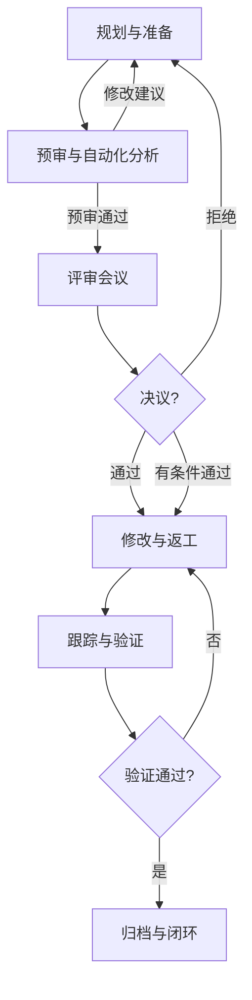

好的，我们来深入探讨需求评审的方法论、具体流程和其中的各项标准。这是软件工程中确保项目成功至关重要的一环。

### 一、需求评审的核心方法论

需求评审并非简单的“开会读文档”，而是一套系统化的质量保障方法。其主要方法论思想如下：

1.  **缺陷预防而非缺陷检测**
    *   **核心思想**：在需求阶段发现并修复一个问题的成本，远低于在开发、测试甚至上线后修复的成本（通常可达1:10:100:1000的比例）。评审的核心目的是在源头扼杀缺陷。
    *   **智能体应用**：智能体通过自动化检查，在评审前就能发现大量低级和逻辑错误，将人类专家的精力解放出来，专注于更复杂、更具创造性的逻辑和业务问题。

2.  **同行评审**
    *   **核心思想**：产品需求是由“作者”（产品经理）产生的，而评审是由其“同行”（其他产品经理、开发、测试、架构师等）进行的。不同背景的视角可以弥补单个角色的认知盲区。
    *   **智能体应用**：智能体可以扮演一个“不知疲倦的初级同行”角色，进行第一轮过滤，确保提交给人类专家的文档已达到一定的基本质量要求。

3.  **结构化与标准化**
    *   **核心思想**：评审不能是随意的、即兴的。必须基于明确的结构、清单和标准进行，确保评审的全面性和一致性。
    *   **智能体应用**：智能体的规则引擎本质就是结构化和标准化的极致体现，它可以不知疲倦地对照检查清单和标准规范进行验证。

4.  **持续反馈与协作**
    *   **核心思想**：评审不是一个孤立的事件，而是一个贯穿需求形成过程的持续活动。它应该是产品、技术、测试等多方协作达成共识的过程，而非对立或批斗会。
    *   **智能体应用**：智能体可以作为协作中枢，自动记录问题、分配任务、跟踪修改状态，并促进各方在统一平台上进行异步沟通，形成反馈闭环。

---

### 二、具体的评审过程

一个完整的需求评审流程通常包含以下五个阶段，这与您之前提到的智能体工作流完美契合：

**阶段一：规划与准备**

*   **目标**：确保所有参与者为高效的评审会议做好准备。
*   **活动**：
    1.  **确定评审人员**：选择合适的评审者（通常包括：产品经理（作者）、开发架构师、开发代表、测试代表、UI/UX设计师、运维代表等）。**评审小组宜精不宜多**，通常5-7人为佳。
    2.  **分发材料**：提前至少1-2天将需求文档（PRD）、原型、设计图等所有相关材料发送给评审人员。材料应格式清晰、版本明确。
    3.  **安排会议**：预定会议时间，并明确会议议程和目标。
*   **标准**：
    *   **准入标准**：需求文档必须使用公司规定模板、版本号清晰、内容相对完整。不接收“半成品”文档进行正式评审。

**阶段二：预审与自动化分析**

*   **目标**：让评审者 individually 审查文档，发现问题并做备注，为会议讨论做准备。
*   **活动**：
    1.  各评审成员独立阅读文档，使用注释、高亮等功能记录问题、疑问和建议。
    2.  **（智能体核心作用点）** 智能体自动运行分析，生成预审报告，标注出明确缺陷、疑似矛盾点和风险。
*   **标准**：
    *   评审者需对照**个人检查清单**（如：开发关注技术可行性，测试关注可测性）进行审查。
    *   智能体对照**自动化检查清单**（完整性、一致性、合规性）进行分析。

**阶段三：召开评审会议**

*   **目标**：集中讨论发现的问题，澄清疑问，就解决方案达成共识，并做出评审决议。
*   **活动**：
    1.  **作者宣讲**：由产品经理简要介绍需求背景和核心内容，确保所有人理解一致。
    2.  **逐项评审**：按照文档结构，逐部分、逐条地讨论预审中发现的问题。会议主持人（Moderator，通常不是作者）负责控制节奏和氛围。
    3.  **讨论与记录**：针对每个问题展开讨论，明确是否是问题、问题的严重程度、以及如何修改。记录员（Recorder）详细记录每个决议。
    4.  **形成决议**：会议结束时，所有评审人员需对需求当前状态做出决议：
        *   **通过**：无需修改或仅需微小修改，无需再次评审。
        *   **有条件通过**：需要修改，但修改后只需由主持人或指定人员验证即可，无需再次召开评审会。
        *   **拒绝**：发现重大缺陷或遗漏，需要重大修改，必须重新组织评审。
*   **标准**：
    *   **会议礼仪**：对事不对人；关注问题而非指责作者；鼓励所有成员发言；控制会议时间（建议不超过2小时）。
    *   **问题分类标准**：可定义问题的严重级别（如：致命、严重、一般、建议）。

**阶段四：修改与返工**

*   **目标**：作者根据评审决议和记录的问题列表，修改需求文档。
*   **活动**：
    1.  产品经理修改文档。
    2.  更新文档版本号。
*   **标准**：必须回应记录单上的每一个问题（修改、采纳建议或说明不修改的理由）。

**阶段五：跟踪与验证**

*   **目标**：确保所有问题都已正确修复，且没有引入新问题。
*   **活动**：
    1.  主持人或指定人员（通常是测试负责人或架构师）检查修改结果。
    2.  如果决议是“有条件通过”，验证通过后流程即结束。
    3.  如果决议是“拒绝”或修改幅度很大，则需要重新召集评审小组进行**复审**。
    4.  将所有评审材料、记录和最终文档进行归档。
*   **标准**：验证必须基于评审问题记录单进行逐项确认，确保闭环。

---

### 三、评审过程中的各种标准

标准是评审的尺度和依据，没有标准，评审就变成了主观的扯皮。

1.  **文档标准**
    *   **模板标准**：规定PRD必须包含的部分，如：版本历史、项目概述、目标用户、业务目标、功能需求、非功能需求、名词解释等。
    *   **写作标准**：要求使用“必须”、“应该”、“可以”等优先级关键词；用户故事需符合**Invest原则**；验收标准建议使用**GWT格式**。

2.  **质量属性标准**
    *   **完整性**：需求是否覆盖了所有场景？是否定义了成功标准？是否考虑了异常流？
    *   **正确性**：需求是否真实反映了业务方的意图？
    *   **无歧义性**：描述是否清晰、明确？所有术语是否在名词解释中有了统一定义？
    *   **一致性**：新需求与旧功能是否冲突？文档前后描述是否矛盾？
    *   **优先级**：是否对需求项进行了优先级划分？
    *   **可验证性**：需求是否可测试？验收标准是否明确无误？
    *   **可行性**：在现有技术、时间和预算约束下是否可实现？
    *   **可追溯性**：需求是否源自更高层的业务需求？能否追溯到相关用户反馈或市场分析？

3.  **非功能性需求标准**
    *   **性能**：响应时间、吞吐量、资源利用率等指标是否有要求？
    *   **安全性**：是否符合安全规范？是否存在OWASP Top 10中提到的风险？
    *   **可用性**：是否符合UI/UX设计规范？是否易于使用？
    *   **兼容性**：需要支持哪些浏览器、操作系统、设备？
    *   **可靠性**：对系统可用性、容错能力、可恢复性是否有要求？

4.  **流程标准**
    *   **角色与职责标准**：明确Author， Moderator， Recorder， Reviewer的职责。
    *   **准入/准出标准**：明确什么样的文档可以进入评审，什么样的评审结果可以结束流程。
    *   **缺陷管理标准**：如何记录、分类、跟踪和验证评审中发现的问题。

通过将上述方法论、流程和标准固化下来，并逐步将其中可自动化的部分赋予智能体，您就能构建一个高效、高质量且持续改进的需求评审体系，从根本上提升软件产品的成功概率。