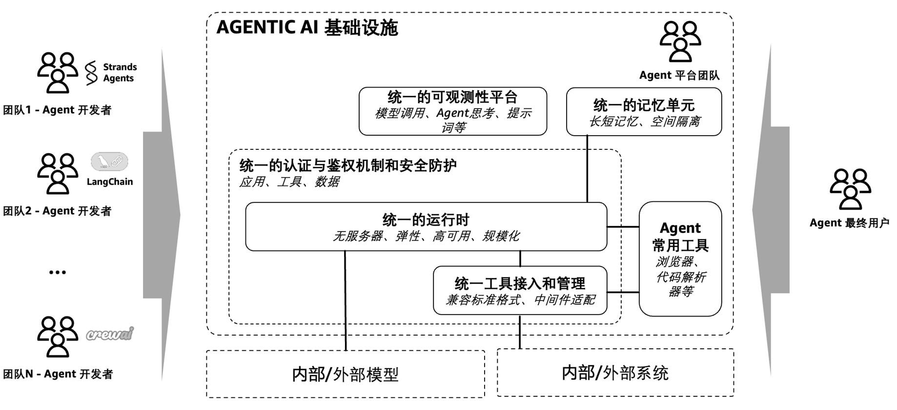
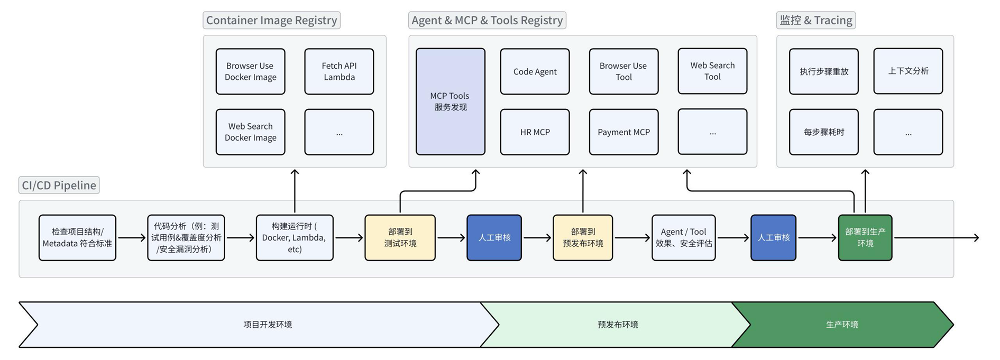
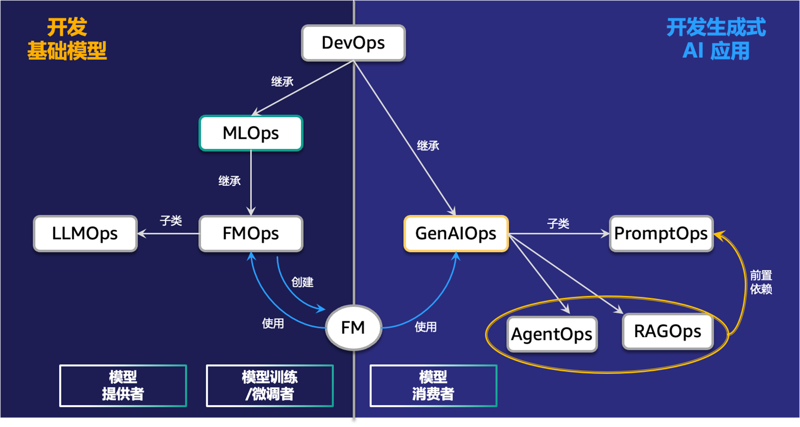
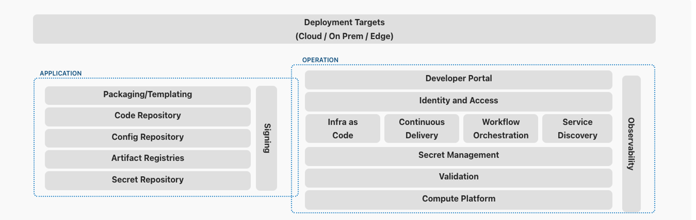
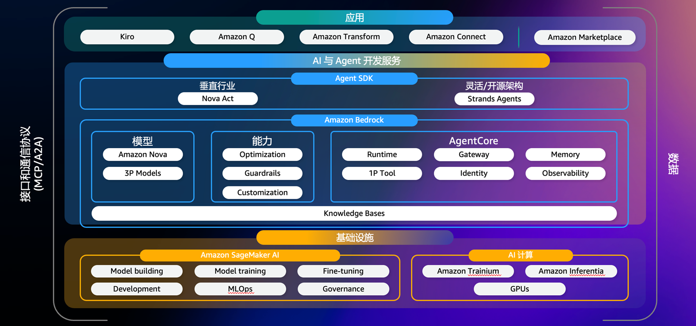
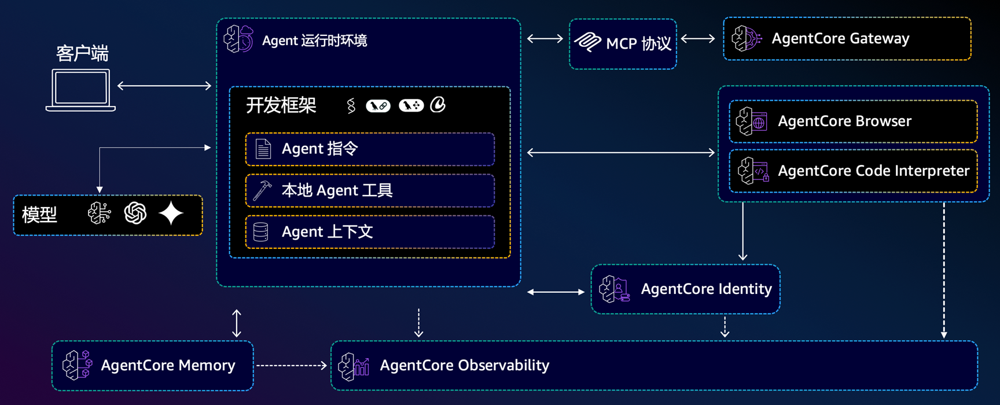

# Agentic AI基础设施实践经验系列（一）：Agent应用开发与落地实践思考

by [AWS Team](https://aws.amazon.com/cn/blogs/china/author/zhyawenm/) on 19 9月 2025 in [Artificial Intelligence](https://aws.amazon.com/cn/blogs/china/category/artificial-intelligence/), [Generative AI](https://aws.amazon.com/cn/blogs/china/category/artificial-intelligence/generative-ai/) [Permalink](https://aws.amazon.com/cn/blogs/china/agentive-ai-infrastructure-practice-series-1/) [ Share](https://aws.amazon.com/cn/blogs/china/agentive-ai-infrastructure-practice-series-1/#)

在过去的短短几年内，[基础模型(FMs)](https://aws.amazon.com/what-is/foundation-models/?trk=e61dee65-4ce8-4738-84db-75305c9cd4fe&sc_channel=el)已经从直接用于响应用户提示创建内容，发展到现在为[AI Agent](https://aws.amazon.com/what-is/ai-agents/?trk=e61dee65-4ce8-4738-84db-75305c9cd4fe&sc_channel=el)提供动力。AI Agent是一类新型软件应用，它们使用基础模型来推理、规划、行动、学习和适应，以追求用户定义的任务目标，同时只需要有限的人工监督。AI Agent由基础模型驱动，其不确定性和非预定义逻辑的运行机制，为开发者带来了全新的应用开发和运维范式。基于在多个项目中积累的Agent应用构建经验，我们为您整理了一系列Agentic AI基础设施实践经验内容。这些内容详细介绍了构建Agent应用所需的沙盒、记忆、评估、可观测性和工具部署等多个维度的经验，帮助您全面深入地掌握Agent构建的基本环节。

在系列（一）中，我们将共同探讨Agent开发和运维Agent（AgentOps）的基本要素和实践思考。

## 1. 解构 Agent 开发

在深入探讨AgentOps之前，我们需要先理解Agent开发的本质。与传统应用开发不同，Agent开发是一个多维度、多层次的工程挑战，它不仅涉及代码逻辑的实现，更关乎如何构建一个具备推理、记忆和行动能力的智能体。

**Agent** **系统的架构可以抽象为四个核心模块的协同工作：**

**（1****）推理引擎，**推理引擎是Agent的“大脑”，通常基于大语言模型实现。它负责理解用户意图、制定执行计划、任务执行。在开发层面，这意味着我们需要精心设计提示词模板、优化推理链路、控制推理成本。推理引擎的质量直接决定了Agent的智能水平。

**（2****）记忆系统，**记忆系统赋予Agent“学习”和“成长”的能力。可以简单分为短期记忆和长期记忆两个大类：短期记忆维护当前会话的上下文状态，类似于人类的工作记忆；长期记忆存储用户偏好、历史交互、知识积累等信息，需要智能的信息抽取和压缩机制。在开发实践中，我们需要设计合理的存储架构、实现高效的检索算法、建立智能的信息更新策略。

**（3****）编排模块，**规划与执行模块负责协调其他三个组件的工作，管理Agent的整体执行流程。它承担任务分解、执行计划制定、工具调用编排等职责。在开发层面，这涉及到工作流设计、异常处理策略、并发控制、状态管理等技术挑战。不同的Agent框架对这一模块有不同的实现方式，如Strands Agents的任务编排器、LangGraph的图执行器等。

**（4****）工具接口，**工具接口是Agent与外部世界交互的“手脚”。一个Agent可能需要调用数十种不同的API、数据库、外部服务。开发挑战在于：如何标准化不同工具的接入方式、如何实现工具的智能选择和组合、如何处理工具调用的异常和重试、如何确保工具调用的安全性和权限控制。

**为了保障 Agent** **能顺利从原型转变到生产，我们还需要使用如下的支撑服务模块：**

- **质量评估，**Agent的智能行为需要专门的评估机制，包括推理质量评估、任务完成率统计、用户满意度收集等。例如可以基于LLM-as-a-Judge自动化评估结合人工审核，建立持续的质量保证体系。
- **身份认证与授权，**Agent系统需要解决”谁可以访问Agent”和”Agent可以访问哪些资源”的双重身份问题。这包括用户身份验证、会话级身份隔离、细粒度权限控制、跨系统授权等。在多租户环境中，还需要确保不同用户的Agent会话在独立的安全沙箱中运行。
- **安全与隐私保护，**基于OWASP Agentic AI威胁模型，Agent系统面临记忆投毒、工具滥用、权限滥用、身份欺骗等多种安全威胁。开发时需要实施分层防护策略，在用户输入、模型推理、工具调用、输出生成等各个环节建立独立的安全过滤机制。
- **可观测性，**Agent的非确定性行为要求全新的监控方式。我们需要追踪推理链路、监控工具调用合理性、分析 记忆 使用情况、检测安全事件、收集用户体验指标。这种”思维过程”的可视化对于调试和优化Agent行为至关重要。

将上述开发和生产需求抽象出来，形成Agentic AI基础设施的单元，如图所示：

图1 – Agent系统架构与基础设施单元

### 1.1 统一的运行时

在实际部署中，Agent应用运行时和Agent工具运行时是整个系统的核心。它们需要提供兼容各种开发框架的服务接口，并在Agent业务价值尚未明确的情况下，能够动态调整资源以最大限度地节省成本。此外，我们需要考虑几个关键因素：

**（1****）会话管理。**Agent的会话隔离机制和鉴权方式实现身份管理和隔离确保了多用户环境下的安全性。每个用户的Agent会话都在独立的安全沙箱中运行，避免了数据泄露和交叉污染的风险。

**（2****）生命周期管理。**Agent的会话状态会因模型调用、服务等待等因素充满着不确定性，运行时能够根据业务需求来调整状态转换的策略。对于有状态的业务，需要将状态信息持久化，确保在系统重启或故障恢复时能够正确恢复Agent的工作状态。

**（3****）接口标准化。**通过脚手架，运行时被变成对外的HTTP服务，根据Agent类型分配不同端口和路径，支持健康检查。这种标准化的接口设计让Agent可以轻松地集成到现有的基础设施中。

### 1.2 统一的工具接入和管理

工具网关（Gateway）是解决工具生态管理问题的关键组件。它不仅需要支持已有的标准化API、MCP协议或轻量级服务集成等接入功能，还需要提供工具发现、删除、鉴权等相关能力，方便开发者更加便捷地管理和维护工具列表。

其中，工具的快速搜索功能至关重要。当Agent面对复杂的用户请求时，网关的检索能力使其无需列出和读取所有工具，而是能够根据问题动态地发现和筛选出最合适的工具子集。这种搜索功能不仅减少了返回的工具数量，还提升了上下文相关性和处理速度，同时降低了成本。这对于控制Agent的运行成本尤为重要。

### 1.3 统一的记忆单元

记忆模块是Agent智能化的核心要素。它能够通过收集用户对话信息，深入了解用户的偏好、兴趣、关注点以及历史事件等内容。这些信息作为当前会话的上下文，不仅提升了Agent回答的准确性，还使其能够更好地满足用户的个性化需求。

记忆的存储架构通常采用分层设计：短期记忆用于保存原始数据，以便在当前会话中查询历史消息；长期记忆则通过异步方式对对话历史进行加工，抽取语义事实、用户偏好和内容摘要等信息。这种设计不仅保证了实时性能，还提供了长期的智能化能力。在实际生产环境中，我们还需特别关注记忆的安全性和隔离性。每个用户的记忆数据应存储在独立的命名空间中，以防止数据泄露。此外，建立完善的数据备份和恢复机制，确保重要的用户偏好和历史信息不会丢失，也是至关重要的。

### 1.4 统一的通用基础工具

在构建 Agent 应用时，浏览器和代码解析器是两项不可或缺的工具。简单来说，浏览器工具让 Agent 能“看网页、操作网页”，实现对非 API 系统的直接操作；而代码解析器让 Agent 能“运行代码、算得更精”，胜任数据处理和复杂计算任务。

**浏览器**往往需要一个完全托管的浏览器沙箱环境（Sandbox），让Agent能够像人类那样“浏览网页”。点击按钮、填写表单、解析动态内容、抓取图像或执行页面导航等，这些往往是在隔离、安全、可监控的沙盒中进行。企业借此可绕过缺少 API 的系统，自动化处理诸如填报内部表单、跨系统数据抓取、网页内容监测等任务，同时还具备回放能力。

**代码解析器**则让 Agent 获得运行程序能力，它通过提供一个沙箱环境，可安全地让 Agent 调试并执行基础模型动态生成的代码，并能处理大规模数据、生成可视化分析、执行复杂计算任务。在企业场景中，这意味着 Agent 不再局限于文本推理，而可以亲自“动手”执行多步数据流程、处理 CSV/JSON/Excel 数据、绘制图表、执行机器学习分析等。

### 1.5 统一的认证与鉴权机制和安全防护

在构建Agent应用时，身份认证是整个安全体系的核心基石，直接影响系统在企业级场景下的稳定和安全运行。身份管理组件需要支持与多种身份提供商（IdP）集成，如GitHub、社交媒体账户以及遵循标准认证协议的企业级身份管理系统（如Okta）。此外，开发者应能配置多维度的认证规则，包括入站和出站的双向认证机制：入站认证确保只有合法授权的用户或系统能够访问Agent应用，而出站认证则保障Agent在调用外部工具或资源时能够通过安全的认证回调完成授权。这种双向认证机制不仅防止未授权访问，还确保了Agent在跨系统交互时的合规性与安全性。

在Agent输出内容的安全方面，仍需通过安全防护机制（如Guardrails）来确保大模型在引导Agent完成任务时，不受到严重的幻觉影响，也不提供非法或不合规的内容。这要求在模型本身的安全防控上，需要增加额外的规则和策略，以判断Agent的思考和执行是否合法，是否符合业务规则要求。

### 1.6 统一的可观测性

由于大语言模型会引入思考、执行和输出的多种不确定性，Agent应用在开发、调试和落地环节中，需要一个多层次的监控体系。在基础设施层，需要追踪Agent运行环境的资源使用情况；在应用层，重点监控Agent的性能表现和调用链路；在业务层，则需关注用户体验和任务完成情况。下一章节的AgentOps将重点展开这些方面的讨论。

有了以上架构支撑，Agent开发者可以更快速地将CI/CD流水线与Agentic AI基础设施单元集成，实现从应用逻辑开发到生产部署的快速上线和产品迭代。

图2 – Agentic AI 应用的CI/CD流程

Agent应用需要基于多种核心功能模块的协作，同时依赖多个支撑服务模块来提供生产级保障。Agent的非确定性行为和上下文依赖性等特性，对传统开发工具链带来了新的挑战。我们需要重新构建包括上下文工程、记忆管理、工具集成和行为调试在内的全新工具体系。这些范式转变也为接下来探讨的AgentOps体系奠定了基础。

## 2、从DevOps到AgentOps：运维复杂性的新挑战

### 2.1 生成式 AI 中有哪些 Ops

DevOps 实现了高效地管理**确定性系统**，相同的输入通常会产生可预期的输出。其监控重点、部署流程也相对标准化，我们可以通过明确的错误堆栈和日志快速定位问题。在 MLOps 时代引入了不确定性，模型的性能会随时间衰减，需要持续的数据反馈，也要管理数据集、模型权重、超参数等。AI Agent 应用不仅具有非确定性体现在它们展现出的“智能行为”：Agent 能 **自主决策**、调用外部工具或 API 并持续演化，这对 **可复现性、成本、合规性** 提出了更高要求。

图3 – 生成式 AI 中的 Ops 及其关系

在生成式AI时代，根据业务场景的不同特点，我们可以将运维划分为两大主要方向：**（****1****）基础模型开发场景，**主要聚焦于模型本身的生命周期管理，这里的核心是FMOps（Foundation Model Operations），其涵盖了从模型训练、优化到部署的全流程运维。LLMOps作为其中最重要的分支，专门处理大语言模型的特殊需求，如分布式训练、推理优化、模型版本管理等。**（****2****）生成式AI****应用开发场景，**我们看到了几个专业化的实践领域正在快速迭代发展：**PromptOps** 专注于提示词工程的运维化，包括提示词模板的版本管理、A/B测试、效果评估和持续优化；RAGOps 处理检索增强生成模块，从向量数据库管理到知识更新，再到检索质量优化等。

AgentOps 是将 DevOps/MLOps 能力扩展到 Agent 系统的一套运维范式，旨在保证 Agent 在 开发、测试/预发布、生产等各阶段都可靠、安全、高效。核心支柱包括：设计/原型验证、与运行平台的集成以便于供应与扩缩、全面可观测性、严格测试/验证，以及持续的反馈回路。

### 2.2 AgentOps 的技术需求

这里我们聚焦 Agent 运维（AgentOps）层面的技术需求，把基础设施单元放进全生命周期（开发 / 测试 / 生产）管理、部署与自动化的角度来具体化，包括 Agent 及周边工具开发构建、测试、发布、监控、安全、回滚等关键运维要点。

在 Agent 及 MCP 服务构建阶段，我们需要考虑到：**运行环境兼容性及灵活性**，可以将 Agent、工具打包为镜像或函数，以保证一致性与隔离性。运行时负责拉取镜像、注入配置、加载模型与工具；**会话隔离，**在多租户环境中，我们需要确保每个会话都在独立的安全环境中运行，防止数据泄露和交叉污染；**标准化接口，**将端口&路径配置、健康检查接口和API参数格式标准化，可以实现新Agent开发和已有Agent改造接入的一致性体验，提高接入效率；**部署自动化，**通过IaC服务（如 CDK / Terraform / Helm），并结合 CI/CD 流水线自动化创建基础网络、运行时、密钥等资源，确保开发/测试/生成环境能被可重复地供应；**全周期的可观测性，**每个实例启动时即注入日志/Tracing 埋点，保证会话从一开始就可追踪与回放。

**标准化记忆生产流程：**记忆系统在生产环境中面临的核心挑战是如何从非结构化的对话数据中稳定、准确地提取有价值的信息。在设计 AgentOps 平台时，需要考虑到**标准化的记忆生产模板，**为了避免每个业务团队重复开发记忆抽取逻辑，需要建立标准化的记忆生产模板。这些模板基于 LLM 配合精心设计的提示词，能够自动识别和抽取特定类型的信息；**提供自定义抽取能力**，不同业务场景对记忆内容有显著差异，需要允许不同的业务根据需求自定义记忆抽取及查询逻辑。

关注**版本化管理，**代码、模型及使用的提示词、配置与工具映射、记忆抽取模块应统一纳入版本控制（Git），并为每个发布打标签；**CI/CD** **自动化，**流水线负责构建镜像、运行单元/集成/安全测试、部署到预发布并执行烟雾测试；推向生产前支持金丝雀或蓝绿发布策略；**提示词与配置即代码，**提示词也像代码一样支持 diff、回滚与审查，以便在发现逻辑/合规问题时能迅速恢复到已验证版本；**快速回滚能力，**保持镜像与模型的历史版本，CI/CD 支持一键回滚并伴随会话回放供事后分析。

建立**多层次观测，**基础设施层（如 CPU、内存、网络等）；应用/运行时层（如请求/响应延迟、模型调用次数与成本）；业务层（如推理链路、任务完成率、异常率等）。也要支持**细粒度轨迹与会话回放**：记录每一步输入、中间状态（上下文）、外部工具/API输入输出、模型响应与最终输出，支持重放与根因分析；**统一语义与** **Trace** **标注**：采用统一的 Trace/Span 约定（将 agent-id、session-id、operation-type 等嵌入到 trace），便于跨 Agent 的关联分析；**实时告警与自动化响应**：基于阈值/异常检测触发告警，并可以触发自动限流、降级或重启策略。

要保证**最小权限与短期凭证，**避免长期共享密钥，CI/CD 作为凭证下发与审计点，运维侧对凭证生命周期实施策略化管理；控制入站和出站访问，以实现控制**谁可以访问****Agent****、Agent****可以访问哪些资源。**对于外部访问，可以通过网络规则或代理限制，例如仅允许受控 API并记录所有外呼以供审计。**安全护栏（****Guardrails****）与输出过滤，**在模型与 Agent / 工具层加入护栏，避免记忆投毒、工具滥用、模型幻觉、敏感信息外泄或违法输出等；**流水线合规，**在 CI/CD 中加入安全/合规扫描（提示词注入检测、依赖漏洞、配置泄露），并在发布前强制通过治理检查。**管理密钥，**通过专用安全存储服务来提供运行时凭证，并仅在运行时注入到容器中并限定生命周期。

部署阶段考虑采用金丝雀、蓝绿或 A/B 流量切换，先在小流量或影子流量中验证新版本；并可以**基于指标的切换****/****回退**：用可观测性指标与用户反馈驱动发布决策，若指标恶化则自动回滚；**提示词可回退，**提示词变更要可审计，保持历史版本便于快速恢复。

接下来，我们讨论如何根据不同客户画像构建 AgentOps 平台。

## 3、构建 AgentOps 平台

在明确 AgentOps 与传统 DevOps/MLOps 的差异之后，企业在真正落地平台时往往面临两类典型需求：一是**具备成熟研发与运维体系的中大型组织**，希望在安全合规、可观测性、版本治理等方面实现深度定制与长期演进；二是**初创或业务团队**，更关注**快速验证价值与低成本上线**。

针对这两种诉求，我们提出两条建设路径：**以平台工程为核心的可扩展平台，**强调统一治理、强可控性和深度集成，适合已有平台团队、需要长期演进和严格合规的企业；**轻量托管** **/ Serverless** **快速落地方案，**聚焦敏捷交付和弹性扩容，适合资源有限的小团队、PoC 项目或对基础设施依赖较低的业务单元。两种方案并无绝对优劣之分，而是面向**不同组织规模、治理需求**的差异化选择。

### 3.1 以平台工程为核心的可扩展平台

平台工程(**Platform Engineering**)是一门设计和构建工具链和工作流程的学科，其核心理念是通过抽象复杂性、标准化流程、提供自助服务能力来提升开发者体验和生产力。

图 4 – 平台工程的构成

可以借鉴内部开发者平台（IDP）理念，将 AgentOps 能力集成到一个统一平台中，提升开发者体验和运维效率。核心模块包括：

- **开发者门户与治理**：提供自助式门户，统一管理 Agent 及其组件。实现提示词/模型/工具注册与版本管理、权限控制和合规审查。对常用模板、最佳实践进行封装，帮助开发者快速上手。
- **CI/CD** **与交付流水线**：集成持续集成/持续交付工具（如 Jenkins、GitLab CI、GitHub Actions），支持 Agent 代码和配置的自动化测试、打包、部署。流水线中包含注册容器到仓库、提示词校验、Agent 效果评估、单元测试、人工审核等步骤。
- **统一运行时环境**：采用容器化技术（如 Docker、Kubernetes）提供可伸缩的执行环境。所有 Agent 以容器形式运行，实现资源隔离和弹性伸缩。
- **观测与日志系统**：嵌入丰富的监控、日志和链路追踪能力。包括捕获模型调用日志、提示词、工具调用、内存上下文和推理中间步骤等。使用 Prometheus/Grafana、ELK/Fluentd 或商业监控平台集中采集与分析，实时监控延迟、错误率、成本、用户满意度等指标。
- **安全凭据与策略**：提供集中化密钥和凭据管理（如 AWS Secrets Manager），对敏感数据和第三方 API 调用进行鉴权审计。配合统一的安全策略和合规扫描（如静态代码扫描、提示词注入检查）确保平台安全。模型安全护栏可以使用托管的服务，例如 Bedrock Guardrails 审核输入、输出，结合内部知识库避免模型幻觉的影响。

### 3.2 轻量托管服务/Serverless 快速落地

此方案面向小团队或 PoC，追求快速上线和低成本运营。思路是充分利用云服务托管服务，减少基础设施依赖。核心要点包括：

- **Serverless** **运行环境**：这里的环境选择较为多样。选择1）借助专门针对 Agent 场景优化的云托管服务（如 Amazon Bedrock AgentCore），将 Agent 打包为容器并通过托管服务快速构建；选择2）将 Agent 逻辑封装为云函数（如 AWS Lambda 服务）按事件触发执行；选择3）Amazon ECS Fargate 服务，同样是将 Agent 打包为容器，借助 ECS Fargate + ELB 对外提供服务。这几种选择都可以借助托管服务内置的扩缩容能力，避免自建集群，AgentCore 更适合 Agent 及 MCP 服务，后两个更适合需要更高自定义的场景。
- **托管模型服务与工具**：直接调用 LLM API（如 Amazon Bedrock），工具则同样可以采用上述Serverless方式部署，其中，AgentCore 也专门提供 Gateway 模块快速将内部或者三方 API 转为 MCP 服务供 Agent 使用。
- **简易 CI/CD**：通过 GitHub Actions、GitLab CI、AWS CodePipeline 等轻量流水线将代码部署到 Lambda / ECS Fargate，可快速迭代 Agent 功能。
- **监控和日志**：使用云服务提供的监控（如 CloudWatch）和日志服务。配合第三方可观察性工具（Datadog、Sentry 等）抓取错误和性能数据，不必自建 ELK/Grafana。
- **安全与凭据**：利用云平台的身份和访问管理（IAM）控制函数和服务权限。凭证存储可使用 Secrets Manager 等托管方案，即可实现企业级的安全保障。模型安全护栏的选型思路同上。

### 3.3 两种方案的适用建议与对比

对于**初创团队、小团队或** **PoC**，强调快速上线和成本控制，可在不投入大量基础设施前提下验证业务模型，可以优先采用托管服务或者 Serverless 的服务。对于已有成熟平台工程团队、追求高可定制性、需严格合规治理的企业，可以基于 IDP 的理念构建，优势在于高度可定制和治理能力强，适合大型企业或复杂业务场景，但前期投入和团队要求较高。通过平台工程思路，团队可以将 AgentOps 各类能力产品化，也建议结合业务GTM的时效性诉求选择复用托管服务已有能力快速构建。

表1 – 两种 AgentOps 方案对比

| **对比因素**   | **平台工程式可扩展平台**                       | **轻量托管/Serverless 方案**                 |
| -------------- | ---------------------------------------------- | -------------------------------------------- |
| **架构模式**   | 自建内部开发者平台(IDP)，高度定制化            | 云托管服务、函数计算，模块化、即插即用       |
| **技术复杂度** | 高：需要管理基础设施、集成 CI/CD、监控、安全等 | 低：主要使用云函数、托管模型服务、托管数据库 |
| **部署速度**   | 慢：需设计和测试完整流水线                     | 快：托管服务、云函数秒级部署，快速上线       |
| **成本投入**   | 高：初期需投资平台建设，人员成本较高           | 低：主要按量付费，无需自建基础设施           |
| **扩展能力**   | 强：可根据需求横向扩展平台组件和集群           | 弹性：云服务自动扩容，适应负载波动           |
| **治理与合规** | 完整：支持统一策略、版本审计、安全审查         | 简化：基于云服务安全机制，需额外关注配置权限 |
| **自定义能力** | 强：完全自主，满足特殊需求                     | 中：基于托管服务能力和配置                   |
| **运维要求**   | 高：需专业团队维护平台稳定                     | 低：主要关注监控告警和成本优化               |

## 4、在亚马逊云上构建“生产就绪”的Agent应用

目前，构建能够可靠执行复杂任务的Agent应用变得日益便捷，这主要归功于多种开源Agent开发框架，如Strands Agents、CrewAI、LangGraph和LlamaIndex等。然而，基于这些框架开发的Agent距离“生产就绪”状态仍存在显著差距。正如前文所述，运行时环境、记忆模块、浏览器、代码解析器、安全防护机制、认证鉴权系统、工具管理平台、可观测性以及AgentOps平台构建等，对Agent开发者而言不直接创造业务价值，却是部署生产环境的“必需品”。因此，在竞争激烈的Agent市场中，越来越多开发者选择云端专业Agent基础设施提供的托管功能，加速开发进程，将精力集中在提升Agent业务价值上，以更好地满足用户需求。

亚马逊云科技在Agent开发领域提供了最全面而深入的产品支持，从包含各类底层算力的加速芯片、到托管的机器学习平台Amazon SageMaker，再到Agent基础模型调用和平台服务Amazon Bedrock、Agent开发SDK Strands Agents，以及面向垂类应用场景的Agent软件服务等，端到端地为各类开发者提供专业的服务。

图5 – 亚马逊云科技Agent技术栈

其中，Amazon Bedrock AgentCore是一款业界领先的专为Agent应用打造的基础设施服务。它依托亚马逊云科技多年沉淀的强大基础能力，提供安全、弹性、高可用和免运维等一系列Agent必备组件，使开发者能便捷构建完整的”生产就绪”Agent应用。

图6 – Amazon Bedrock AgentCore能力模块及架构

**Amazon Bedrock AgentCore****包含了七大单元支撑Agent****应用由开发转生产：**

1. **AgentCore****运行时：**提供了低延迟的无服务器环境，用于部署Agent或MCP工具。该环境具备会话隔离功能，支持各类Agent框架，包括流行的开源框架（如Strands Agents、LangGraph、CrewAI等）。此外，它能够集成各种工具和模型，并有效处理多模态工作负载及长时间运行的Agent应用。
2. **AgentCore****记忆：**管理短期和长期记忆，为模型提供相关上下文，同时帮助Agent从过去的交互中学习历史知识。
3. **AgentCore****浏览器：**提供完全托管的Web浏览器工具，以扩展Agent基于Web的自动化工作流程。
4. **AgentCore****代码解释器：**提供一个隔离环境来运行Agent生成的代码，即需即用。
5. **AgentCore****身份管理：**使Agent应用能够安全访问AWS服务和第三方工具及服务，如GitHub、Salesforce和Slack，可以代表用户或在预授权用户同意的情况下自行操作。
6. **AgentCore****工具网关：**将现有API和Amazon Lambda函数转换为Agent随时可用的工具，提供跨协议的统一访问，包括MCP，以及工具快速检索等功能。
7. **AgentCore****可观测性：**提供Agent执行过程的逐步可视化功能，包括元数据标记、自定义评分、轨迹检查以及故障排除/调试过滤器等。

这七大单元共同构成了Agent应用生产的支撑体系，通过提供全面的企业级服务，使Agent开发者能够利用任意框架和模型，快速、安全地部署和运营大规模Agent应用。关于每个模块的更多细节，请参见本博客系列中的相应文章。

基于Bedrock AgentCore进行AgentOps实践时，可以很方便地实现CI/CD、运行时治理、可观测性、工具接入与记忆管理及隔离等模块的协作。具体来说，可以将CodePipeline作为流水线骨架：Agent代码提交后触发镜像构建，基于运行时的镜像版本与AgentCore的版本策略自动生成可回溯的部署单元，避免“模型升级”或“镜像漂移”带来的环境不一致问题。部署的 Agent 实例可选择接入 CloudWatch，或结合 LangSmith 等三方工具，让每一次调用的延迟、错误率、上下文链路都能被实时捕捉与回放。这种全链路观测能力为后续迭代提供了可靠的反馈回路，使 Agent 性能优化不再仅仅依靠临时的线下排查。

此外，记忆可以采用基于AgentCore记忆模块命名空间（Namespace）的隔离策略，每个环境、租户或会话拥有独立命名空间，既保证隐私合规，又方便按环境维度进行调试和回滚。所有记忆访问行为均被打点写入观测平台，既可追责也可做趋势分析。工具生态通过AgentCore Gateway统一管理，开发者只需注册OpenAPI或第三方API（如Jira、Brave等），即可被Agent发现和调用，无需在代码中硬编码接口地址。Gateway同时支持权限分级与调用审计，使工具治理与安全防护自然融入平台主干。

### 结语

随着基础模型能力的快速提升和Agent开发框架的日趋成熟，构建智能Agent的技术门槛正在快速降低。然而，真正的挑战不在于Agent本身的开发，而在于如何让这些智能体在生产环境中稳定、安全、可靠地运行。企业和开发者应该将宝贵的时间和精力投入到核心业务逻辑的创新上：理解用户需求、优化业务流程、提升服务体验，而不是被基础设施的复杂性所困扰。这也是Amazon Bedrock AgentCore 平台存在的价值所在：通过提供标准化的运行时环境、统一的工具管理、智能的记忆系统和全面的安全防护，让Agent应用开发变得像传统应用开发一样简单和可预期。在运维自动化上，结合自身当前的业务诉求、状态选择合适的 AgentOps 平台落地的路线，让 Agent 获得全生命周期的可靠、安全及高效保障。

**关于Agentic AI****基础设施的更多实践经验参考，欢迎点击：**

[Agentic AI基础设施实践经验系列（一）：Agent应用开发与落地实践思考](https://aws.amazon.com/cn/blogs/china/agentive-ai-infrastructure-practice-series-1)

[Agentic AI基础设施实践经验系列（二）：专用沙盒环境的必要性与实践方案](https://aws.amazon.com/cn/blogs/china/agentic-ai-sandbox-practice/)

[Agentic AI基础设施实践经验系列（三）：Agent记忆模块的最佳实践](https://aws.amazon.com/cn/blogs/china/agentic-ai-infrastructure-deep-practice-experience-thinking-series-three-best-practices-for-agent-memory-module)

[Agentic AI基础设施实践经验系列（四）：MCP服务器从本地到云端的部署演进](https://aws.amazon.com/cn/blogs/china/agentic-ai-infrastructure-practice-experience-series-four-mcp-server-from-local)

[Agentic AI基础设施实践经验系列（五）：Agent应用系统中的身份认证与授权管理](https://aws.amazon.com/cn/blogs/china/agentic-ai-infrastructure-practice-series-5/)

[Agentic AI基础设施实践经验系列（六）：Agent质量评估](https://aws.amazon.com/cn/blogs/china/agent-quality-evaluation/)

[Agentic AI基础设施实践经验系列（七）：可观测性在Agent应用的挑战与实践](https://aws.amazon.com/cn/blogs/china/agentic-ai-infrastructure-practice-series-7/)

[Agentic AI基础设施实践经验系列（八）：Agent应用的隐私和安全](https://aws.amazon.com/cn/blogs/china/privacy-and-security-of-agent-applications)