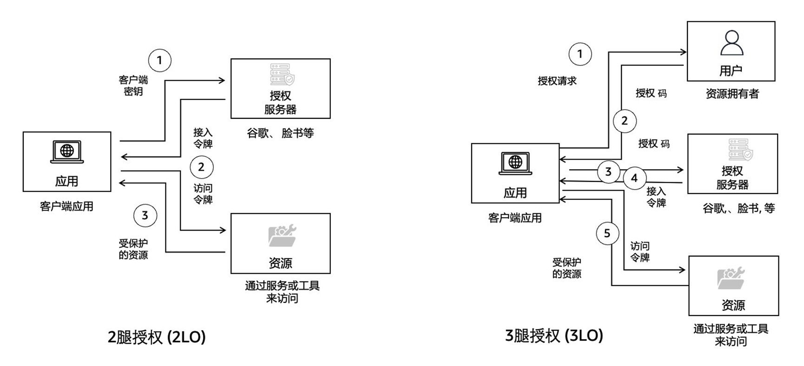
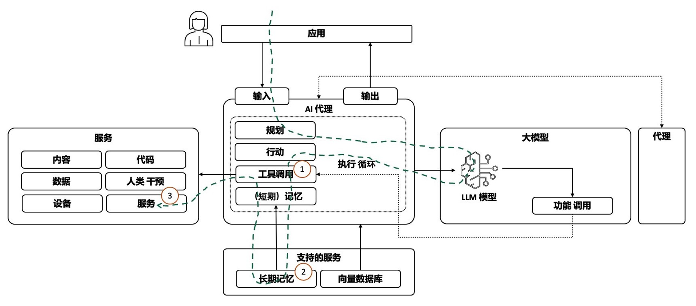
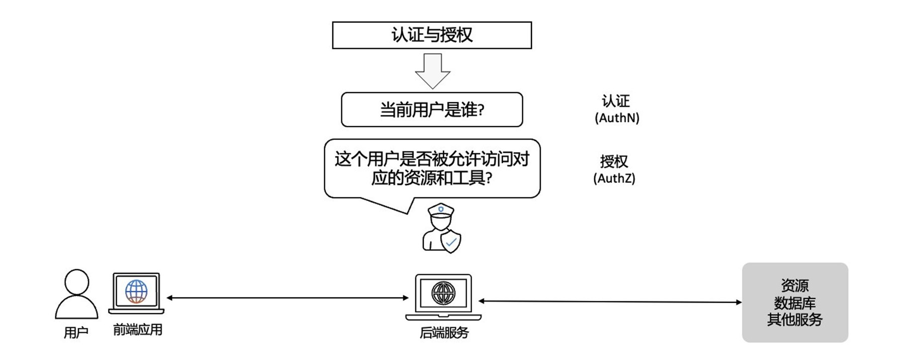
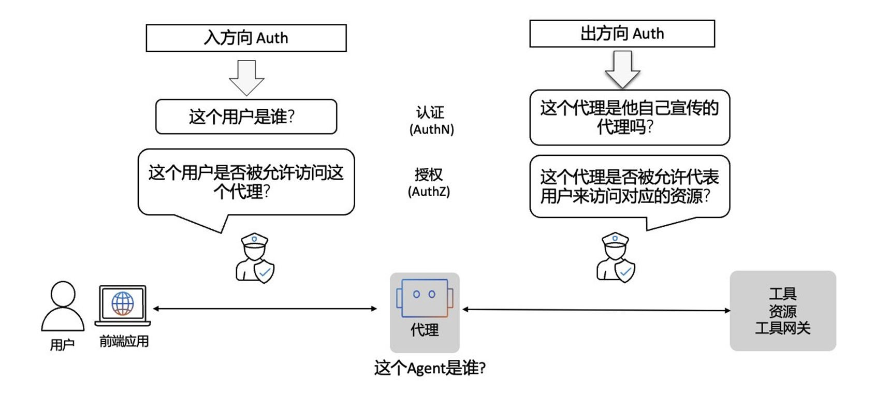
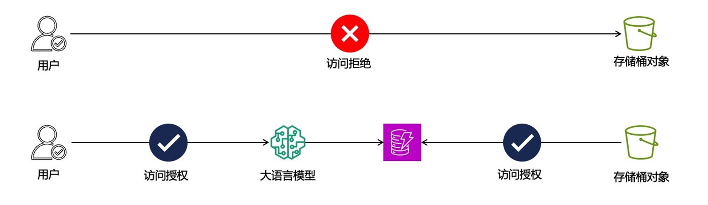
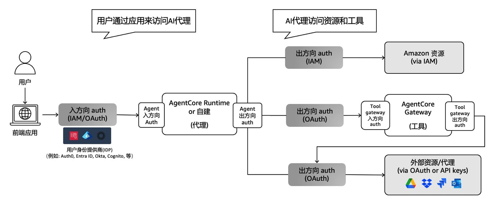
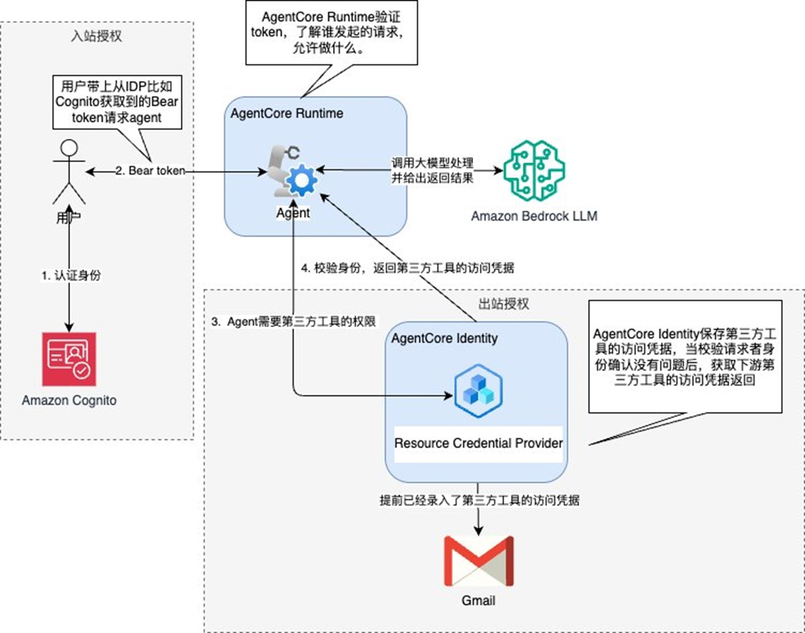
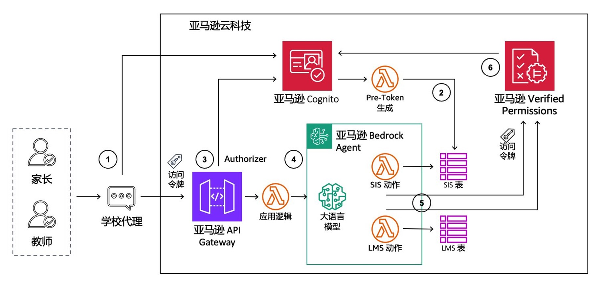
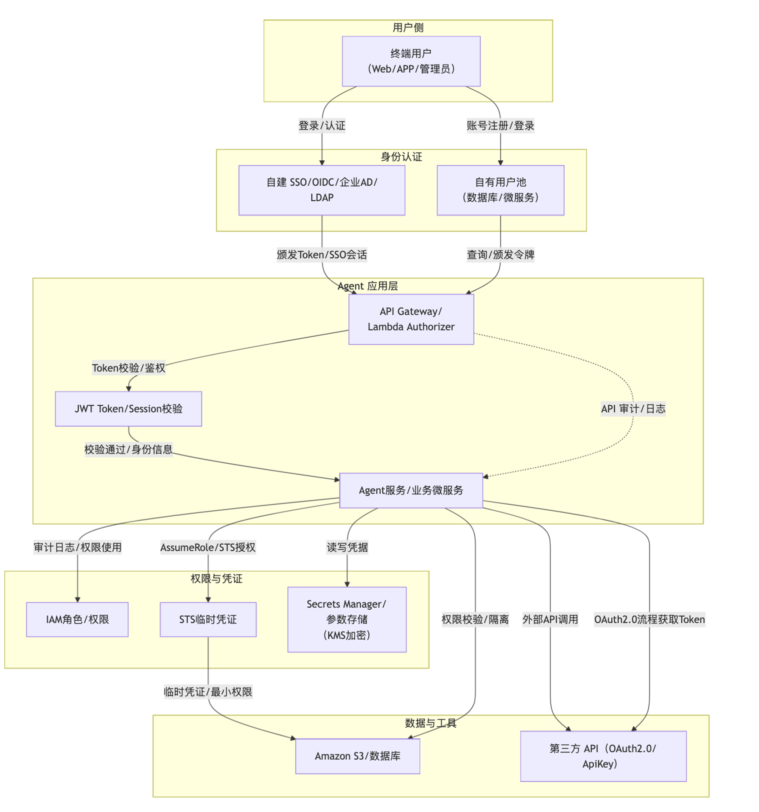

# Agentic AI基础设施实践经验系列（五）：Agent应用系统中的身份认证与授权管理

by [AWS Team](https://aws.amazon.com/cn/blogs/china/author/zhyawenm/) on 19 9月 2025 in [Artificial Intelligence](https://aws.amazon.com/cn/blogs/china/category/artificial-intelligence/), [Generative AI](https://aws.amazon.com/cn/blogs/china/category/artificial-intelligence/generative-ai/), [Security, Identity, & Compliance](https://aws.amazon.com/cn/blogs/china/category/security-identity-compliance/) [Permalink](https://aws.amazon.com/cn/blogs/china/agentic-ai-infrastructure-practice-series-5/) [ Share](https://aws.amazon.com/cn/blogs/china/agentic-ai-infrastructure-practice-series-5/#)


## 1. 引言

人工智能正经历深刻变革。传统AI多为被动工具，而随着大型语言模型（LLM）和多智能体系统（MAS）的快速发展，AI Agent正向具有高度自主性的主动智能体（Agentic AI）演进。这些AI Agents能够自主思考、规划和执行复杂任务，甚至协同完成更复杂的目标。

这种演进带来了前所未有的机遇，同时也引发了新的安全挑战，特别是在身份认证与授权管理方面。近年来发生的多起安全事件充分说明了AI Agent身份管理的重要性和紧迫性。2024年11月，LangChain生态中的LangSmith平台Prompt Hub暴露出严重的身份与权限管理漏洞“AgentSmith”。攻击者通过上传带有恶意代理配置的prompt，当用户fork并执行这些prompt时，用户的通信数据包括API密钥和上传内容会被悄然中转至攻击者控制的服务器，导致敏感信息泄露。同时，攻击可能引发代理配置篡改、未经授权的API调用及远程代码执行，严重影响系统安全。

2025年披露的MCP Inspector远程命令执行漏洞（CVE-2025-49596）则是另一典型案例。该工具缺乏客户端与本地代理之间的认证，攻击者仅需诱导开发者访问恶意网页，便能绕过浏览器安全策略，通过跨站请求伪造（CSRF）攻击向本地服务发送恶意命令，实现对终端的远程控制。

这些安全事件揭示了Agentic AI系统中两个核心问题：一是AI Agent的身份认证与授权机制如何确保可信且安全；二是在复杂的代理调用链中如何有效传递和验证身份信息。本文将深入分析这些挑战，并结合亚马逊云科技平台的实践经验，提供完整的解决方案。

## 2. AI Agent 身份管理的核心概念与技术要求

Agentic AI 身份（Agent Identity）相关的概念和术语，用于描述代理和工具等身份管理及凭证处理所涉及的组件、流程与关系。理解[这些术语](https://docs.aws.amazon.com/bedrock-agentcore/latest/devguide/identity-terminology.html)有助于深入把握AI Agent 工作流中如何协调多方组件的身份认证与授权机制。

以下列出的术语是在开发 Agentic AI 系统中常用的，已被身份与访问管理（IAM）领域广泛采纳，非亚马逊云科技的专有用语。其他通用的身份管理术语可以参考相关[官方文档](https://docs.aws.amazon.com/cognito/latest/developerguide/cognito-terms.html)。

### 2.1 身份与认证方面的概念与术语

|      | 术语                                             | 定义                                                         |
| ---- | ------------------------------------------------ | ------------------------------------------------------------ |
| 1    | **代理（Agent****）**                            | 一种由 AI 驱动的应用程序或自动化工作负载，通过访问云资源和第三方服务来代表用户执行任务。代理在获得预先授权的用户同意后采取行动，以实现用户目标，例如从 API 检索数据、处理信息或与第三方系统集成。与使用静态凭证运行的传统应用程序不同，代理需要动态身份管理才能安全地访问跨多个信任域的资源，同时维护适当的身份验证和授权边界。 |
| 2    | **代理身份（Agent identity****）**               | AI 代理或自动化工作负载的唯一标识符及其关联元数据。代理身份作为工作负载身份实现，并具有特定属性，用于标识其代理身份，从而实现专用代理功能，同时保持与更广泛的工作负载身份标准的兼容性。代理身份使代理能够以自身身份进行身份验证，而不是冒充用户，从而支持基于委托的访问模式。 |
| 3    | **代理身份目录（Agent identity directory****）** | 一个集中式注册目录，用于管理代理身份及其相关元数据和访问策略。与 亚马逊云科技的Cognito 服务的用户池类似，它充当组织账户或区域内代理身份的治理单元。 |
| 4    | **工作负载身份（Workload identity****）**        | 代理身份的底层技术实现，代表独立于特定硬件或基础架构的逻辑应用程序或工作负载。工作负载身份可以跨不同环境运行，同时保持一致的身份验证。代理身份是一种特殊类型的工作负载身份，具有代理特有的附加属性和功能。 |
| 5    | **访问令牌（Access Token****）**                 | 包含有关实体访问信息系统的授权信息的 JSON Web 令牌 (JWT)。   |
| 6    | **JSON Web Token (JWT)**                         | 包含已验证用户声明的 JSON 格式文档。ID 令牌用于验证用户身份，访问令牌用于授权用户，刷新令牌用于更新凭证。 |
| 7    | **IAM****角色**                                  | IAM 角色是一种提供短期有效凭据的访问亚马逊云科技云资源的方式，角色的安全凭据经过加密和自动轮换，是安全的认证和访问方式；适合请求AWS资源，比如访问S3存储桶，调用Amazon Lambda，读取DynamoDB里面的数据等。 |
| 8    | **API** **密钥**                                 | API密钥是一个唯一的标识符，用于验证对 API（应用程序编程接口）的请求。它就像一个密码，允许您的应用程序访问特定服务，例如 OpenAI API key。很多大模型工具的使用需要用到API密钥，包括亚马逊云科技的Bedrock服务也支持了API密钥访问的方式。 |

### 2.2 OAuth and Token 管理方面的概念和术语

|      | 术语                                                         | 定义                                                         |
| ---- | ------------------------------------------------------------ | ------------------------------------------------------------ |
| 1    | **OAuth 2.0**                                                | 行业标准授权协议和框架（定义见 RFC 6749），允许应用程序在不暴露用户凭据的情况下获得对外部服务用户帐户的有限访问权限。OAuth 2.0 允许用户通过访问令牌（而非共享密码）授予第三方应用程序对其资源的访问权限，从而提供安全委托。对于代理应用程序，OAuth 2.0 支持跨多个服务安全地访问用户数据，同时保持适当的身份验证边界和用户同意机制。 |
| 2    | **OAuth 2.0** **授权器（OAuth 2.0 authorizer****）**         | 一个 SDK 组件，用于对传入代理端点的 OAuth 2.0 API 请求进行身份验证和授权。它会在允许访问代理服务之前验证令牌。 |
| 3    | **OAuth 2.0 client credentials grant (2LO)**                 | OAuth 客户端凭据授予用于无需用户交互的机器对机器身份验证。代理使用 2LO 直接向资源服务器进行身份验证。 |
| 4    | **OAuth 2.0 authorization code grant (3LO)**                 | OAuth 授权需要用户同意和交互。例如当客服人员需要明确的用户权限才能从 Google 日历或 Salesforce 等外部服务访问用户特定数据时，他们会使用 3LO。 |
| 5    | **代理访问令牌（Agent access token**                         | 包含工作负载身份和用户身份信息的签名令牌，使下游服务能够基于这两个身份做出授权决策。这些令牌是通过令牌交换过程创建的。 |
| 6    | **令牌保险柜（Token vault****）**                            | 一个用于存储 OAuth 2.0 令牌、API 密钥和其他凭证的安全存储系统，该系统采用严格的访问控制机制。令牌保险柜确保只有最初获取凭证的特定代理和用户组合才能访问这些凭证。 |
| 7    | **服务到服务的授权（Machine-to-machine authorization****）** | 常被称作M2M授权，授权非用户交互机器实体（例如 Web 服务器应用层）对 API 端点的请求进行授权的过程。用户池通过客户端凭证授权提供 M2M 授权，并在访问令牌中使用 OAuth 2.0 范围。 |

### 2.3 OAuth 2.0的授权机制是Agentic AI身份授权的核心技术

Agentic AI系统中，普遍采用的授权机制是基于OAuth 2.0进行的，包括MCP协议也是基于其进行授权。所以，深入理解Agentic AI各组件间的身份认证与授权机制的前提是充分理解OAuth授权的流程。其中，Anthropic官方对MCP协议中采用的OAuth授权流程进行了详细描述，具体客户参考其官方网站的协议描述部分 [OAuth 2.0的授权流程](https://modelcontextprotocol.io/specification/2025-06-18/basic/authorization)。

在Agentic AI系统的设计中，需要根据不同的业务场景来选择合适的OAuth 工作模型。其中典型的模式有2腿授权（2-Legged Auth，2LO）和3腿授权（3-Legged Auth，3LO），如果需要用户（User）参与其中的授权流程适合用3LO，如果不需要用户参与的适合用2LO。

下图是2LO和3LO授权流程的典型步骤说明：



#### 2.3.1 2LO 授权流程

OAuth 客户端凭据授予用于无需用户交互的机器对机器身份验证，适用于代理使用 2LO 直接向资源服务器进行身份验证。例如代理Agent 访问具有服务角色的同一账户中数据库。

具体流程包括:

Client 认证: 应用发送 ‘client_id’ 和 ‘client_secret’ 到认证服务器；

Token 签发: 服务器验证密钥材料，并返回一个‘access_token‘；

资源访问: 应用使用Token访问受保护的资源。

#### 2.3.2 3LO 授权流程

用于应用代表用户进行操作的场景，需要用户的同意。例如代理Agent 代表用户访问电子邮件服务。

具体流程包括:

User 重定向: 客户端重定向用户请求到授权服务器；

User 同意: 用户完成认证并同意；

Code 交换: 服务器给客户端返回授权code；

Token 请求: 客户端通过授权code和 `client_secret` 与授权服务器交换 `access_token` 和 refresh_token；

资源访问: 客户端通过使用token访问用户拥有的资源。

## 3. Agentic AI 身份管理面临的核心挑战与防护策略

[OWASP](https://owasp.org/)(开放式全球应用程序安全项目，Open Worldwide Application Security Project)基于Agentic AI的特性及应用系统部署架构、各领域专家的研究及实践经验，总结了15个安全威胁，具体可参考本系列博客之《Agentic AI 安全防护-Agent隐私与安全》的对应内容。在这15个安全威胁中，有2个是与身份相关的，包括T3 权限泄漏和T9 身份欺骗和冒充。

- T3 权限滥用：当攻击者利用权限管理中的弱点执行未经授权的操作时，就会发生权限滥用。这通常涉及动态角色继承或错误配置。
- T9 身份欺骗和冒充：攻击者利用身份验证机制冒充人工智能代理或人类用户，从而以虚假身份执行未经授权的操作。

对于身份欺骗和冒充威胁，在一个典型的Agentic AI逻辑架构中，需要进行身份认证与授权的交互点非常多、且涉及到非一方自研的部分，导致风险点的控制变得复杂。身份的传递（如下图蓝色箭头和编号）是重要内容之一，最初User的身份管理和认证、Agent Action对User 身份和鉴权会话（Access Token）的传递、tools对User 的授权等，如下图：



### 3.1 Agentic AI中的身份认证与授权，和传统应用中的身份认证与授权的核心区别

传统应用（没有使用Agentic AI之前的应用）对用户的身份管理和授权是非常明确的，即对当前登录应用系统的用户身份进行认证和授权，包括单点登录SSO认证、细粒度授权和OAuth授权等。但应用系统中引入Agentic AI技术后，数据的查询和第三方系统的调用等，会由AI Agent代理来完成，因为当前登录的用户要查询或操作的内容可能不是对其自身的查询或操作，有可能是通过prompt的方式查询或操作其他用户的信息，这一点是与传统应用的最大区别。我们通过两个示例图来进行对比和说明：





Agentic AI 应用系统中的授权问题反映了传统访问控制模型的根本性局限。当数据通过训练、微调或检索增强生成（RAG）方式被输入到LLM中后，模型本身无法判断请求者是否有权访问这些数据。这种情况下，授权决策必须在AI应用的其他层面实现，而不能依赖模型本身的判断。

在企业级AI应用中，这个问题变得更加复杂。不同用户可能对同一数据集具有不同的访问权限，但LLM无法自主区分这些权限差异。例如，在一个企业知识管理系统中，销售团队和财务团队可能对客户数据具有不同的访问权限，但如果这些数据都被用于训练或增强同一个LLM，模型就无法自动执行这种权限区分。

解决授权问题需要在应用架构层面实施确定性的授权机制。这包括在数据输入LLM之前进行权限检查，根据用户身份和权限过滤可访问的数据源。在RAG系统中，可以根据用户权限动态选择可查询的向量数据库或知识库。在模型输出阶段，也需要根据用户权限对响应内容进行过滤和脱敏。

基于会话属性的权限传递是一种有效的解决方案。通过安全侧通道（如Amazon Bedrock Agents的会话属性）传递用户身份和权限信息，使后端系统能够在处理AI请求时执行适当的授权检查。这种方法将授权决策从不可靠的LLM推理转移到可控的应用逻辑中。

### 3.2 MCP协议中混淆代理人提权问题

MCP协议的设计理念导致其在架构层面就系统性地引入了传统安全领域中经典的“ 混淆代理人 ” 问题（ Confused Deputy Problem）。首先，MCP 服务器作为一个独立的进程运行，拥有其自身在主机系统上的权限集合，例如文件系统读写权限或网络访问权限。其次， LLM 客户端通常代表用户行事，向服务器发送请求以执行工具。但是 MCP 规范在其默认状态下，缺乏一个统一且被一致性执行的认证和授权机制，来将终端用户的身份和权限安全地传递给服务器。因此，当一个用户（可能是低权限用户）通过 LLM 提示调用一个工具时，服务器实际上是使用其自身的权限（可能是高权限）来执行该操作，而非用户的权限。这就创造了一个典型的权限提升场景，即一个低权限的请求者（用户）欺骗了一个高权限的代理（服务器）来执行越权操作。此类越权问题，通过给大模型LLM作系统级提示词限制也只能在少部分情况下生效，且有不确定性。

混淆代理问题是AI应用安全中最具挑战性的威胁之一，并把传统的威胁效果放大。这种攻击利用了AI系统的代理特性，通过具有更高权限的AI应用间接获取原本无权访问的资源。攻击的典型场景是：用户直接访问某个资源会被拒绝，但通过AI应用访问同样的资源却能成功，从而绕过了原有的安全控制。混淆代理安全威胁示例：直接访问 S3 存储桶的用户会被拒绝访问；但访问 LLM 的用户（使用 RAG 并存储来自同一 S3 存储桶的数据）则会获得访问权限。



这种攻击的根本原因在于AI应用和底层资源之间的权限不匹配。AI应用为了完成复杂任务，往往被授予了较高的系统权限，但这些权限的使用缺乏细粒度的控制。当用户通过AI应用间接访问资源时，实际上是借用了AI应用的权限，而不是基于用户自身的权限。

### 3.3 构建端到端的Agentic AI身份管理的整体防护策略

防范混淆代理攻击需要实施严格的权限一致性检查。无论用户通过何种途径访问资源，都应该基于相同的权限模型进行授权决策。这要求在AI应用的架构设计中引入用户身份传递机制，确保底层系统能够识别真实的请求者身份。

实施细粒度的权限代理是另一种有效的防护策略。AI应用不应该拥有超出其功能需求的权限，而应该基于具体的用户请求动态获取相应的权限。这可以通过权限委托机制实现，AI应用代表用户请求特定的权限，而不是拥有固定的高权限。

审计和监控机制对于检测混淆代理攻击至关重要。系统应该记录所有的权限使用情况，包括权限的来源、使用者、访问的资源和操作类型。通过分析这些审计日志，可以识别异常的权限使用模式和潜在的安全威胁。

OWASP对于Agentic AI的15个威胁风险中，虽然只有2个与身份相关，但这两个风险点特别是T9身份欺骗与冒充威胁，会发生在Agentic AI系统中的多个环节，因此构建Agentic AI系统的端到端身份管理解决方案是非常有必要的，具体参考架构图如下：



端到端的身份认证与授权系统，包括如下几个核心能力。具体示例可以参考下一章节的基于亚马逊Bedrock AgentCore Identity开发Agentic AI系统的身份模块的相关内容。

1. Agent入方面的认证和授权：对请求的用户进行认证和授权，包括通过第三方身份提供商登录进来的用户。
2. 外部工具或服务对Agent的授权：不论是自己研发的一方工具，还是第三方研发的商业化或开源的工具，都需要对Agent或Agent代表用户的授权，避免委托人攻击。
3. Agent访问外部工具或服务的能力（即出方向）：为了配合外部工具或服务对Agent的授权，Agent需要具备 OAuth 客户端的能力，包括2LO和3LO的方式。如果是访问云资源，需要有保存云资源访问短期权限的能力，如IAM role或STS。
4. Tool Gateway入方向认证和授权：如果通过Tool Gateway方式集中管理多个MCP服务器，Agent由Tool Gateway来访问tools，那么Tool Gateway需要具备对Agent或Agent代表用户的授权。

## 4. 亚马逊云科技云平台上的AI Agent身份管理解决方案

### 4.1 方案一： Amazon Bedrock AgentCore Identity – 全托管一站式解决方案

Amazon Bedrock AgentCore Identity 是一项全面的身份和凭证管理服务，专为 AI 代理和自动化工作负载而设计。它提供安全的身份验证、授权和凭据管理功能，使用户能够调用代理，而代理能够代表用户访问外部资源和服务的同时保持严格的安全控制和审计跟踪。该服务与 Amazon Bedrock AgentCore 原生集成，为代理应用程序提供全面的身份和凭证管理。

AgentCore Identity 解决了 AI 代理部署中的一个根本性挑战：让代理能够在多个服务中安全地访问用户特定数据，同时不牺牲安全性和用户体验。传统方法要么使用广泛的访问凭证而缺乏细粒度控制，要么需要为每次服务集成获取明确的用户同意（这会带来糟糕的用户体验）。AgentCore Identity 通过一个全面的工作流实现零信任安全原则和基于委托的身份验证来解决这一问题。

#### Amazon Bedrock AgentCore Identity 涉及的2种身份认证和授权

入站授权：Inbound Auth 是指验证用户或客户端应用的认证机制，用于控制谁可以访问和调用您的代理或工具。

出站授权：Outbound Auth 是指已通过入站认证的代理，安全访问目标服务的认证机制，使代理能够安全地调用各种外部API、Lambda函数等资源。



#### 入站授权

用户通过其组织的现有身份提供者（如 Auth0、Cognito 或其他 OIDC 兼容系统）进行身份验证，并获得访问令牌或身份令牌。该令牌包含用户身份信息和授权范围，为整个工作流程建立用户的身份上下文。应用程序接收此令牌，并将使用它来授权对代理的请求。

下面以[Amazon Cognito](https://aws.amazon.com/cn/cognito/) 为例，讲解如何配置入站授权。

在开发应用的时候，在代码中可以授权Cognito User Pool里面的用户访问权限。Amazon Cognito 是 Web 和移动的应用程序的身份识别平台。借助 Amazon Cognito，您可以从Cognito用户池、企业目录或者 Google 和 Facebook 等消费者身份提供商提供用户的身份验证和授权。首先创建1个Cognito User Pool，在这个User Pool中创建1个App client，以及1个用户，假设你执行下面的命令通过用户名密码的方式授权用户：

```apacheconf
# Authenticate User
aws cognito-idp initiate-auth \
  --client-
id "$CLIENT_ID" \
  --auth-flow USER_PASSWORD_AUTH \
  --auth-parameters USERNAME='testuser',PASSWORD='MyPassword123!' \
  
--region "$REGION" \
  > auth.json
```

可以得到授权的返回结果，结果中包含JSON Web 令牌（JWT）格式的AccessToken，RefreshToken和IdToken，AccessToken 包含权限范围(scope)，比如”cognito:groups”: [”developers”,“team-alpha”]定义允许哪些组访问，”scope”: ”myApi/profile.read myApi/profile.write myApi/account”用于API访问授权，RefreshToken 用于获取新的Access Token和ID Token，IdToken 包含用户身份信息，用于身份验证。返回的信息类似于：

```apacheconf
"eyJraWQiOiJvcHE5UmpBMTFBMWFcLzdoUFdRaUgwRmlDTjlMYm1QbnJQRWM3SVQ1M05XTT0iLCJhbGciOiJSUzI1NiJ9.eyJvcmlnaW5fanRpIjoiZTRkN2M1OWUtM2NjZC00OGFhLWFkN2YtMmY3ZTgzMmEzZDAzIiwic3ViIjoiZDRhODA0ZjgtYTA0MS03MGU0LTY3MmYtNzk2ZWM2M2VlNzQwIiwiYXVkIjoiNWFmNXBvaW8wbG5pa29zbWtnZjQxYjNrODAiLCJldmVudF9pZCI6IjFiNGZiYzA2LWVlMzgtNDBlYi1iNjRhLTA3ZTllNzIzNzVlNiIsInRva2VuX3VzZSI6ImlkIiwiYXV0aF90aW1lIjoxNzUzNzc5MzQ4LCJpc3MiOiJodHRwczpcL1wvY29nbml0by1pZHAudXMtZWFzdC0xLmFtYXpvbmF3cy5jb21cL3VzLWVhc3QtMV9vQTJKTkMxdnUiLCJjb2duaXRvOnVzZXJuYW1lIjoidGVzdHVzZXIiLCJleHAiOjE3NTM3ODI5NDgsImlhdCI6MTc1Mzc3OTM0OCwianRpIjoiNDBiNjEwODMtZmRiZi00YzBmLTk3OTEtOGJmYTJjOGUwNDk1In0.A9wVkmed3aet3Q3mgvSF5-KLcEskBf5JOQnqSuyP4Rv2uz_Q7BhGgDV-AfHiBn9SNI1LI6QxlRp-YqRrh4lyyxsdrQGAH5fIlYvVproslLHlSdq2tPb9klHzPjOpyYTNt3cBCq1WRGiiklfvSM1R-RJ8546IPLP2LN-oEXL-kKNdUpxSLUWSsjuk9kkH1ZkN27NxRtnjzc1KG7MBHJRtVsGUsF8b7m5L1rSYzorbj19j2z5oCHnfZHm8wZkWteEAED2jsjJaRCEwyzqXBgSpnTIy8gYO_tlpwswCpg9dgR1MSwK72OjQvLsf_xubRq2Ykv2RylF4cdF8EuGtLOIb_w"
```

如果没有带上Access Token，直接调用AgentCore Runtime的时候将看到一条错误消息：”AccessDeniedException: An error occurred (AccessDeniedException)when calling the InvokeAgentRuntime operation: Agent is configuredfor a different authorization token type”。这些token短期有效，可以在cognito中配置刷新的时长。并且Amazon Cognito提供托管的登录和注册页面，以及丰富的安全能力，比如要求用户绑定MFA，这样可以避免未授权的人拿到用户名密码伪装成授权用户使用访问权限。

#### 出站授权

Amazon Bedrock AgentCore Identity验证对 AWS 资源、第三方服务或 AgentCore Gateway 目标的访问权限。您可以使用 OAuth 2LO/3LO 或 API 密钥。身份系统简化了管理多种凭证类型的复杂性，同时为身份验证和授权操作提供了统一的接口。

在代码中可以通过调用API：create_api_key_credential_provider，将能够访问第三方工具的API密钥保存到AgentCore Identity的Resource Credential Provider中。当用户发起代理交互时，应用程序会发出请求，代表用户调用 AI 代理。此请求包含用户的身份验证令牌以及代理需要完成的任何必要上下文。应用程序充当代理，将用户的身份验证请求转发到代理基础架构，同时维护用户的身份上下文。

出站授权支持以下三种身份：

| 身份     | 使用范围       | 描述                                                         | 适合场景                                                     |
| -------- | -------------- | ------------------------------------------------------------ | ------------------------------------------------------------ |
| IAM 角色 | 调用AWS服务    | IAM 角色是一种提供短期有效凭据的访问AWS资源的方式，角色的安全凭据经过加密和自动轮换，是安全的认证和访问方式。 | 适合请求AWS资源，比如访问S3存储桶，调用Amazon Lambda，读取DynamoDB里面的数据等； |
| OAuth2.0 | 集成外部服务   | 一种行业标准授权框架（定义见 [RFC 6749](https://datatracker.ietf.org/doc/html/rfc6749) ），允许应用程序在不暴露用户凭据的情况下获得对外部服务用户帐户的有限访问权限。 | 此模式非常适合个人助理代理、客户服务代理以及任何需要跨多个服务访问用户特定数据的场景。以及适合企业自动化代理、数据处理工作流和 DevOps 自动化。 |
| API 密钥 | 访问第三方工具 | API密钥是一个唯一的标识符，用于验证对 API（应用程序编程接口）的请求。它就像一个密码，允许您的应用程序访问特定服务，例如 OpenAI API key。 | 很多大模型，工具的使用需要用到API密钥                        |

#### AgentCore Identity 的安全性

- 安全的凭证存储，代码中没有硬编码的API密钥，不容易泄漏机密
- 跨多种资源类型的一致身份验证接口
- 全面的审计日志以确保安全性和合规性
- 基于身份和上下文的细粒度访问控制
- 通过 AgentCore SDK 简化集成

### 4.2 方案二： 基于Amazon Bedrock Agent构建端到端的细粒度访问控制的AI Agent

我们为客户提供了一个基于Amazon Bedrock Agents构建AI Agent的细粒度访问控制的[安全实施方案](https://catalog.workshops.aws/securing-genai-app/en-US)。该方案通过结合多个AWS服务，实现了安全可靠的Agentic AI 应用访问控制体系。整个系统设计注重安全性和访问控制，确保用户只能访问其权限范围内的数据，是一个典型的教育领域生成式AI应用安全实践案例。核心内容包括：

1）通过实际的应用场景，以学校助手(SchoolAgent)为例，通过聊天界面让不同角色（如学生、教师、监护人）基于各自权限查询和获取信息。

2）安全控制机制的设计，

- 使用Amazon Cognito进行用户身份验证
- 通过Amazon Verified Permissions 实施细粒度访问控制
- 确保AI代理能识别用户身份并只提供授权范围内的数据

3）访问权限设计：

- 家长只能访问其子女的数据
- 教师仅可查看其任教班级的信息
- 通过分层安全控制确保数据访问安全

通过如下参考架构，可以实现完整的身份认证与授权流程。



### 4.3 方案三： 基于亚马逊云科技中国区服务构建灵活可控全自建方案

鉴于 Amazon Bedrock AgentCore Identity 和 Bedrock Agents 等专有托管方案在中国区尚未落地，企业可基于亚马逊云科技中国区现有服务，采用完全自建方式灵活实现 Agentic AI 应用系统中的身份认证与授权管理。

本方案充分结合企业自有 SSO/OIDC/AD、JWT Token、自主用户池、API Gateway、IAM、STS、Secrets Manager 及标准 API 调用链，实现全流程零托管、数据可控、最小权限、合规可审计。架构兼容混合云和本地 IT，便于演进和平滑升级。

**优势：**无需依赖云上托管服务，政策合规性强，权限控制细腻，组件替换灵活，适配大型企业和高度自定义场景。

**适用场景：**数据高敏感、权限差异大、异构 IT 环境、对接自有 ID 体系或多活部署的 Agent 应用。



### 4.4 MCP Server 认证&授权管理

以下章节介绍使用Amazon AgentCore和Amazon Cognito组件实现Agent代理MCP server认证鉴权的实施示例。

AWS AgentCore 是一种服务，旨在简化和加速 AI 代理的部署和管理。它提供了一系列工具和 API，帮助开发者快速构建、部署和管理 AI 代理。AWS AgentCore 支持多种编程语言和框架，使得开发者可以灵活选择最适合自己的工具。

AWS Cognito 是一种用户身份和访问管理服务，它允许开发者轻松地添加用户注册和登录功能到他们的应用中。AWS Cognito 提供了两个主要组件：

1. **用户池**：用户池是一个完全托管的用户目录，可以用于管理和验证用户。用户池支持多种身份验证机制，包括用户名和密码、电子邮件和短信验证码、社交身份提供商（如 Google、Facebook）等。
2. **身份池**：身份池允许应用程序获取临时 AWS 凭证，以访问 AWS 资源。身份池可以与用户池集成，为经过身份验证的用户提供访问权限。

部署 AgentCore MCP Server 的详细步骤：

在部署 AgentCore MCP Server 时，我们可以利用 AWS Cognito 进行用户池和应用客户端的设置，以实现鉴权功能。以下是详细的实现步骤和代码示例：

1. 创建 AWS Cognito 用户池和应用客户端

首先，我们需要在 AWS 管理控制台中创建一个 Cognito 用户池和应用客户端。以下是创建用户池和应用客户端的命令示例：

```apacheconf
aws cognito-idp create-user-pool --pool-name mcp-server-user-pool
aws cognito-idp create-user-pool-client --user-pool-id <USER_POOL_ID> --client-name mcp-server-app-client
```

1. 创建 IAM 角色

为了让 MCP 服务能够与 Cognito 进行交互，我们需要创建一个 IAM 角色，并附加相应的策略。以下是创建 IAM 角色的示例代码：

```apacheconf
import boto3

client = boto3.client('iam')

# 创建 IAM 角色
response = client.create_role(
    RoleName='agentcore-mcp-server-role',
    AssumeRolePolicyDocument=js
on.dumps({
        "Version": "2012-10-17
",
        "Statement": [
            
{
                "Effect": "Allow",
                "Principal": {
                    "Service": "ec2.amazonaws.com"
                },
                "Action": "sts:AssumeRole"
            }
        ]
    })
)

# 附加 Cognito 访问策略
client.attach_role_policy(
    RoleName='agentcore-mcp-server-role',
    PolicyArn='arn:aws:iam::aws:policy/AmazonCognitoPowerUser'
)
```

1. 配置 AgentCore Runtime

在配置 AgentCore Runtime 时，我们需要指定 Cognito 用户池和应用客户端的信息，以及 IAM 角色的 ARN。以下是配置示例：

```apacheconf
response = agentcore_runtime.configure(
    entrypoint='mcp_server.fixed.py',
    execution_role_arn='arn:aws:iam::687912291502:role/agentcore-mcp-server-auto-role',
    auto_create_ecrs=True,
    requirements_txt='requirements.txt',
    region='region',
    authorizer_configuration=auth_config,
    protocol='MCP',
    agent_name='mcp_server_auto'
)
```

1. 启动 AgentCore Runtime

最后，我们可以启动 AgentCore Runtime，并通过 Cognito 进行用户认证和鉴权。以下是启动示例代码：

launch_result = agentcore_runtime.launch()

在 AI Agent应用中，MCP Server 的鉴权机制是确保系统安全性和稳定性的关键。通过 AWS AgentCore 和 AWS Cognito，我们可以轻松地实现和管理 MCP 服务器的鉴权功能。这不仅提高了系统的安全性，还简化了开发和部署过程，使得开发者可以更专注于 AI 模型和业务逻辑的开发。

## 5. 结语

在Agentic AI应用系统快速发展的今天，身份认证与授权管理已成为构建安全可信AI生态系统的基石。从”AgentSmith”到”MCP Inspector”等安全事件的教训表明，我们必须高度重视AI Agent的身份管理问题。构建安全可信的系统需要遵循最小权限、零信任验证、纵深防御和持续监控等核心设计原则，同时采用阶段化实施策略，从基础身份认证逐步扩展到完整的安全体系。

面对传统身份管理向动态化、智能化和细粒度方向的演进，企业可以通过采用OAuth 2.0、去中心化身份等技术框架，结合[Amazon Bedrock AgentCore Identity](https://docs.aws.amazon.com/bedrock-agentcore/latest/devguide/identity-overview.html) 等云平台解决方案，有效应对混淆代理人等特有的安全威胁。通过建立确定性的授权机制和安全的身份信息传递通道，确保AI Agent在代表用户执行任务时既保持高效性，又不失安全性。

随着技术的持续成熟和标准化进程的推进，AI Agent身份管理将变得更加智能和自适应。现在正是企业规划和实施AI Agent身份管理系统的最佳时机，唯有建立起完善的身份认证与授权管理体系，才能确保AI Agent在为人类社会创造价值的同时，始终保持在可控和安全的轨道上运行。这不仅是技术发展的必然要求，更是AI技术走向成熟和普及的重要基石。

**关于Agentic AI****基础设施的更多实践经验参考，欢迎点击：**

[Agentic AI基础设施实践经验系列（一）：Agent应用开发与落地实践思考](https://aws.amazon.com/cn/blogs/china/agentive-ai-infrastructure-practice-series-1)

[Agentic AI基础设施实践经验系列（二）：专用沙盒环境的必要性与实践方案](https://aws.amazon.com/cn/blogs/china/agentic-ai-sandbox-practice/)

[Agentic AI基础设施实践经验系列（三）：Agent记忆模块的最佳实践](https://aws.amazon.com/cn/blogs/china/agentic-ai-infrastructure-deep-practice-experience-thinking-series-three-best-practices-for-agent-memory-module)

[Agentic AI基础设施实践经验系列（四）：MCP服务器从本地到云端的部署演进](https://aws.amazon.com/cn/blogs/china/agentic-ai-infrastructure-practice-experience-series-four-mcp-server-from-local)

[Agentic AI基础设施实践经验系列（五）：Agent应用系统中的身份认证与授权管理](https://aws.amazon.com/cn/blogs/china/agentic-ai-infrastructure-practice-series-5/)

[Agentic AI基础设施实践经验系列（六）：Agent质量评估](https://aws.amazon.com/cn/blogs/china/agent-quality-evaluation/)

[Agentic AI基础设施实践经验系列（七）：可观测性在Agent应用的挑战与实践](https://aws.amazon.com/cn/blogs/china/agentic-ai-infrastructure-practice-series-7/)

[Agentic AI基础设施实践经验系列（八）：Agent应用的隐私和安全](https://aws.amazon.com/cn/blogs/china/privacy-and-security-of-agent-applications)