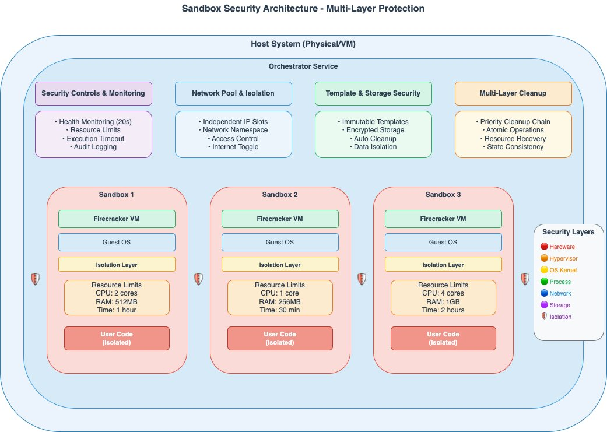
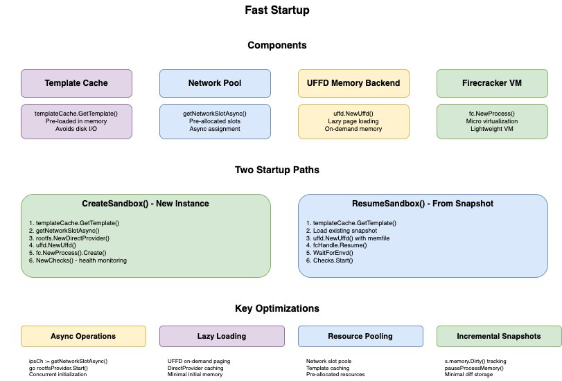
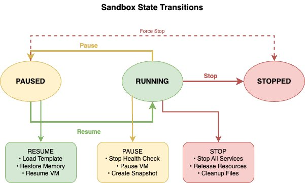
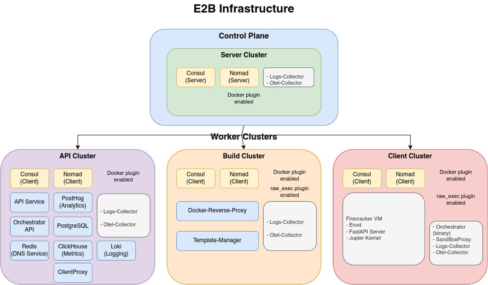
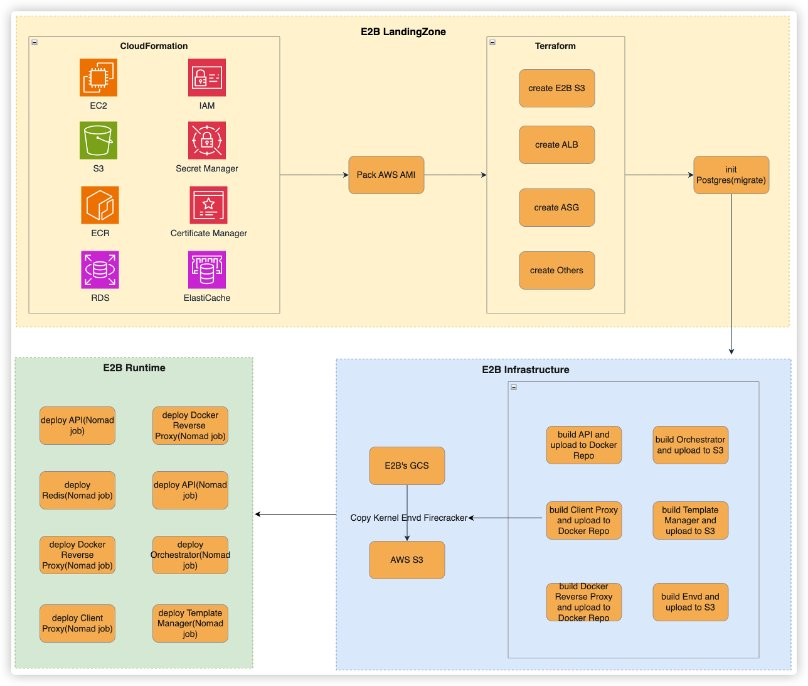
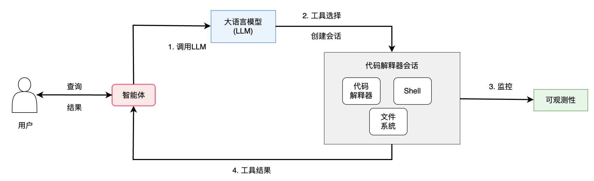
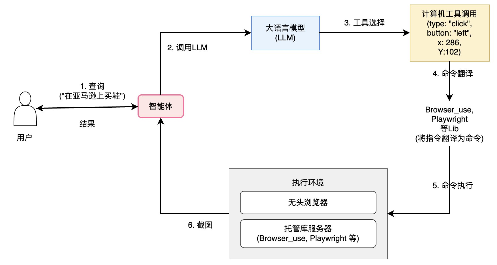

# Agentic AI基础设施实践经验系列（二）：专用沙盒环境的必要性与实践方案

by AWS Team on 18 9月 2025 in [Generative AI](https://aws.amazon.com/cn/blogs/china/category/artificial-intelligence/generative-ai/) [Permalink](https://aws.amazon.com/cn/blogs/china/agentic-ai-sandbox-practice/) [ Share](https://aws.amazon.com/cn/blogs/china/agentic-ai-sandbox-practice/#)

## 一、Agent沙盒环境的业务需求、场景与技术解析

### 1. 为什么Agent需要专门的沙盒环境

Agent应用作为新一代人工智能应用形态，能够自主理解用户意图、制定执行计划并调用各种工具完成复杂任务，正在重塑我们与AI系统的交互方式。这类智能代理不仅能够处理自然语言对话，更能够主动执行代码、操作应用程序、分析数据，真正实现从“对话式AI”向”行动式AI”的跃升。

随着Agent技术的快速发展，一个关键问题浮现：为什么这些应用需要专门的沙盒执行环境？答案在于Agent独特的工作模式和业务特性带来的全新挑战。

### 2. Agent对沙盒环境的应用场景

在实际应用中，对于沙盒环境有两大核心应用场景：代码执行环境和可视化操作环境。

#### 2.1 代码执行环境

Agent应用需要单独的代码执行环境来执行特定任务。以企业数据分析Agent为例，业务分析师可以直接上传一个1GB的销售数据文件到应用平台，然后通过自然语言告诉Agent：”分析过去一年的销售趋势，找出表现最好的产品类别，并生成可视化报表”。Agent能够自动解析用户意图，并调用大型语言模型生成数据读取、处理及分析代码。它会多次启动沙盒环境执行这些代码，最终生成包含图表和统计分析的完整报告。尽管整个流程可能需要数小时的连续计算，但用户只需通过自然语言描述需求并进行必要的修正即可。所有复杂工作均由Agent、大型语言模型和沙盒工具协同完成，无需用户直接参与技术操作。

除单一功能的Agent应用外，更为复杂的场景是AI Bot生态平台。这类平台同时服务两类用户群体：开发者（生产者）和终端用户（消费者）。开发者可在沙盒环境中利用Claude Code、Amazon Q CLI等AI编程助手快速构建各类Agent应用。完成后，他们能在同一环境中一键将应用部署为Web服务，实现AI Bot的无缝托管。终端用户则可直接访问和调用这些已部署的AI Bot服务，无需了解任何技术实现细节。这种模式以沙盒为基础，构建了从”AI辅助开发”到”一键部署”再到”即用即取”的完整生态闭环，有效连接了生产者与消费者两端。

针对多样化的应用场景，沙盒环境需提供灵活的代码执行方式，从执行模式看，系统需同时支持命令行直接执行以满足基础脚本运行需求，以及具备高阶代码解析能力的安全执行环境，确保代码在完全隔离的容器中运行；而在运行时环境方面，不同应用对技术栈的要求各异，如数据分析Agent需要Python Runtime来处理科学计算，代码编辑类Agent则依赖VSCode Server提供完整的开发体验，这种多元化的执行能力设计使沙盒能够适应不同复杂度和技术需求的应用场景，为各类Agent提供最适合的运行基础。

#### 2.2 可视化操作环境

除了代码执行，Agent应用的另一个重要应用场景是Computer Use（计算机使用）和Browser Use（浏览器使用）。Computer Use是指AI Agent能够像人类用户一样操作计算机界面，包括点击按钮、输入文本、拖拽文件等各种GUI操作。Browser Use则是Computer Use的重要场景，专门指Agent在浏览器环境中的自动化操作能力，如网页浏览、表单填写、数据抓取等。

以某社区媒体营销文案生成Agent为例，营销人员只需输入”收集某某竞品在该平台上的营销策略”，Agent就能像真实用户一样操作浏览器：自动打开多个网页标签，浏览不同的产品页面和用户评论，收集关键的市场数据和用户反馈信息，然后基于收集到的数据进行分析，最终实现精准的内容推荐和广告投放策略。整个过程中，Agent通过Browser Use功能模拟人类的点击、滚动、输入等操作，完成复杂的数据收集任务。

类似的应用还包括游戏AI测试、软件自动化测试、在线订票等场景。这些应用的共同特点是需要Agent能够精确控制鼠标和键盘操作，与图形界面进行自然交互，处理那些没有API接口、只能通过视觉操作的应用程序。

这些Computer Use应用要求沙盒系统提供一个最小化的系统环境，实现完整的人机交互模拟功能并支持执行过程的可视化。系统需要提供完整的桌面环境或浏览器环境，让Agent能够像人类用户一样进行可视化操作，同时确保所有操作都在安全隔离的环境中执行。这种可视化操作能力让Agent真正实现了从”理解指令”到”执行操作”的完整闭环，为用户带来了前所未有的自动化体验。

### 3. Agent沙盒环境的核心技术诉求

从上述应用场景可以看出，Agent应用对沙盒环境提出了独特的技术要求，我们一起来分析具体的技术诉求点。

#### 3.1 便捷的接入

Agent沙盒环境需要提供简洁易用的SDK和API接口，让开发者能够轻松接入而无需关心底层的部署、路由等复杂问题。系统应支持一键启动和发布功能，例如AI PPT生成应用只需选择模板就能直接启动服务。如果沙盒内运行Web服务，用户应能方便地连接访问，整个过程不应因为技术复杂性而阻碍业务开发进度。良好的接口设计不仅提升了开发效率，也为Agent应用的快速迭代和规模化部署奠定了基础。

#### 3.2  简化的管理

系统需要提供简化的管理机制，支持弹性扩展和运行时（Runtime）环境切换。开发者应该能够通过创建标准化模板，然后仅用一个template ID就能启动新的运行环境，大大简化部署流程。平台需要提供灵活的模板化管理能力，支持用户自定义代码运行环境模板，这种”先创建模板，再启动运行时”的标准化流程，不仅能提高部署效率，也能确保环境的一致性和可重复性。同时，系统应支持多沙盒并行运行，能够高效监控各个沙盒的运行状态，并在新物理机加入时自动实现负载均衡和资源调度。

#### 3.3 完善的生命周期管理

沙盒环境应具备完善的数据生命周期管理与毫秒级环境启停能力。在数据层面，系统需支持执行过程中临时数据的持久化存储，确保故障后数据依然存在，同时提供自动快照、恢复及pause/resume等核心功能，这对Agent多阶段推理和多分支探索等复杂任务流程尤为关键。随着用户规模增长，需要原生数据管理架构来解决状态信息存储与访问的性能瓶颈。在操作层面，环境必须实现毫秒级的启动、停止和销毁能力，这直接影响用户等待时间和并发处理能力，例如当用户发起数据分析请求时，环境需快速响应，集成、处理和分析数据并完成最终的结果输出。结合增量快照与快速克隆技术，系统能够支持复杂任务的断点续传和多路径探索，进一步提升灵活性与运行效率，为大规模并发任务处理提供坚实基础。

#### 3.4 完备的安全保障

由于Agent需要执行外部生成的代码并访问第三方数据，安全风险显著增加。系统必须提供严格的安全隔离和故障隔离能力，确保有害代码不会在不同用户之间产生影响。现代Agent要求沙盒环境具备硬件级隔离、系统调用最小化、网络和文件系统的精细权限控制等多层安全防护机制。每个沙盒环境必须完全独立运行，实现真正的故障边界隔离，即使Agent生成的代码存在问题，也不应影响其他沙盒节点的正常运行。系统需要确保不同沙盒之间不会相互影响，同时支持高密度部署以充分利用物理机资源，在安全性和性能之间找到最佳平衡点。

这些技术诉求共同构成了Agent对独立运行环境的完整要求体系，只有满足这些严格标准的技术方案，才能真正支撑起新一代Agent应用的大规模商业化部署。

## 二、Agent沙盒环境的技术细节

### 1. 安全性

Agent沙盒环境的核心在于创建一个严格隔离且受控的执行环境，使AI系统能够安全地运行代码和访问资源。这种解决方案依赖于多层次的安全隔离机制。首先，通过虚拟化技术实现硬件级别的执行环境隔离，确保沙盒内的代码无法突破边界影响宿主系统或其他实例。其次，实施严格的网络访问控制，为每个代理分配独立的网络资源，并根据需求配置从完全断网到精细访问权限的策略。在数据安全方面，系统为每个代理提供基于只读模板的独立临时文件系统，会话结束后自动清理所有数据，防止信息泄露和持久化攻击。同时，动态资源管理机制严格限制CPU、内存等资源的使用，设定最大执行时间，并通过实时监控系统检测异常行为。

这种安全沙盒架构遵循最小权限原则，确保AI代理只能访问完成任务所需的最低限度资源。整个系统设计强调可审计性、可扩展性和运行时透明性，在保障安全的同时提供近似真实的执行环境。这一平衡使AI代理能够执行复杂任务而不会带来安全风险，为AI系统的安全部署提供了关键基础设施支持。

**(1)** **虚拟化隔离**： 如亚马逊云科技开源主导的 [Firecracker](https://firecracker-microvm.github.io/) 微虚拟机技术提供了硬件级别的隔离。每个沙盒运行在独立的虚拟机中，与宿主机和其他沙盒完全隔离，防止代码突破容器边界，实现真正的安全执行环境。

**(2)** **网络隔离**：在一个实例中，为每个沙盒分配独立的网络槽位和 IP 地址空间。通过网络池管理防止网络冲突，支持可控制的网络访问权限，可配置完全断网或受限网络访问策略。

**(3)** **文件系统隔离**：每个沙盒使用独立的、基于模板创建的根文件系统，以防止恶意修改和影响其他实例。临时文件系统在执行完毕后会自动清理，确保数据不会泄露或残留。

**(4)** **资源限制与监控**：每个沙盒严格限制CPU和内存使用量，以防止资源耗尽攻击。可以设置沙盒最大生存时间以阻止长时间运行的恶意代码，同时周期性（如30秒）进行健康检查，实时监控异常并自动处理。

### 2. 快速启动

Agent沙盒系统的高性能实现依赖于多层次的优化策略，形成了一套通用的性能加速方案。首先，通过智能缓存机制将常用模板保持在内存中，有效消除了传统I/O延迟，确保资源获取的即时性。同时，采用预分配资源池设计理念，系统提前准备网络和计算资源，实现零配置延迟的资源分配，使沙盒创建过程不再受资源初始化阻塞，大幅提升了高并发场景下的性能表现。

在资源管理层面，沙盒系统需要引入按需加载技术，实现资源的懒加载机制，只在实际需要时才分配必要的系统资源，显著降低了初始化阶段的消耗。这与轻量级虚拟化技术相结合，在提供必要隔离的同时，实现了接近原生速度的启动性能，平衡了安全性与效率的双重需求。

架构设计需要充分利用异步并发处理能力，通过并行初始化关键组件，使网络配置、内存初始化和文件系统准备等操作同步展开，有效避免了串行处理带来的时间损耗。性能优化的核心突破来自状态保存与快速恢复机制，系统能够从预先创建的环境状态直接恢复运行环境，跳过繁琐的初始化流程，实现接近即时的环境准备速度。

这些通用优化策略的综合应用，使Agent沙盒在保持安全隔离的同时，实现了极速启动性能，为各类AI系统提供了高效且安全的执行基础设施。如下图所示：

**(1)** **模板缓存系统：** 需要支持预加载常用模板至内存以避免磁盘I/O延迟。可以通过API接口实现即时模板获取，基于内存缓存机制消除模板加载时间；同时支持多模板的并发访问与管理。

**(2)** **网络资源池：**需要支持预分配网络槽位池，以实现零配置延迟分配。支持异步获取网络资源，避免运行时网络配置阻塞沙盒创建；同时支持高并发网络资源的分配与回收。

**(3) UFFD****内存虚拟化：**需要支持按需内存页面加载机制，以大幅减少启动时的内存占用。通过提供懒加载机制，使内存页面仅在被访问时才从模板加载，显著降低了初始化内存需求和启动时间。

**(4)** **微虚拟机（如Firecracker****）：**轻量级虚拟化技术实现了VM的快速启动。支持创建微虚拟机来替代传统容器，既提供了硬件级隔离，又保持了极快的启动速度，支持毫秒级的VM创建和销毁。

**(5)** **异步并发处理：**支持多组件并发初始化来有效减少总体启动时间。通过异步机制，使网络分配、内存初始化和文件系统准备能够并行执行，避免了串行等待造成的时间浪费。

**(6)** **快照恢复机制：**支持从预创建快照直接恢复，这样可跳过完整初始化流程。通过API支持实现状态恢复，结合增量快照和脏页面（Dirty Page）跟踪技术，实现比新建速度快数十倍的恢复效率。

### 3. 状态转换

Agent沙盒状态管理系统通常通过四项关键策略实现高效运行：首先，动态资源分配使沙盒能在活动与暂停状态间灵活切换，避免资源长期占用，提高整体利用率；其次，基于状态快照的快速恢复机制实现亚秒级扩缩容，比传统创建流程快10-100倍，有效应对负载波动；第三，增量差异算法仅保存变更数据而非完整状态，大幅降低内存和存储需求；第四，原子性状态转换确保系统可靠性，支持零停机维护和快速故障恢复。尤为重要的是，状态转换后（特别是在暂停和恢复操作中）通过快照技术完整保留原有运行环境，确保上下文连续性，使Agent能无缝继续之前的任务处理，避免因上下文丢失导致的重复计算和用户体验断层。

**(1)** **资源利用效率**: 传统容器/虚拟机持续占用资源容易造成浪费，而通过暂停机制可实现按需资源分配。处于PAUSED状态时，系统能释放CPU和大部分内存资源，并可根据需求快速恢复，有效避免资源的长期占用，从而支持高密度沙盒部署。

**(2)** **快速扩缩容**: 新建沙盒存在启动延迟高的问题，而通过快照恢复可实现亚秒级响应。从快照直接恢复能够跳过完整的初始化流程，预热机制则预先创建处于暂停状态的沙盒，需要时可快速激活。总体而言，恢复速度比重新创建快10-100倍。

**(3)** **内存占用优化**: 大量沙盒同时运行会消耗巨大内存，通过增量快照技术可以大幅减少存储需求。脏页面跟踪机制只保存被修改过的内存页面，增量差异算法仅存储变化部分，而链式快照技术则进一步优化了存储效率。

**(4)** **服务可用性**: 沙盒故障或维护可能影响服务连续性，但通过状态一致性保证可实现零停机运维。原子性状态转换确保操作要么全部成功，要么全部回滚。完整状态快照保存系统的所有状态信息，支持在故障发生时从任意保存点快速恢复系统。

### 4. 常见虚拟化技术的定性对比

### 以下是不同虚拟化技术能力的对比，可以看到以Firecracker为代表的微虚拟化技术提供了强隔离和快速启动时间，非常适合临时启用沙盒的场景：

| **标准** | **虚拟机** | **容器** | **Firecracker** |
| -------- | ---------- | -------- | --------------- |
| 安全隔离 | ★★★★★      | ★★☆☆☆    | ★★★★★           |
| 启动时间 | ★☆☆☆☆      | ★★★★★¹   | ★★★★★¹          |
| 资源效率 | ★☆☆☆☆      | ★★★★★    | ★★★★☆           |
| 灵活性   | ★★★★★      | ★★★★☆    | ★★☆☆☆²          |

注：当镜像已在本地存储时，容器通常能够快速启动。拉取镜像则需要额外时间。如果Sandbox模板存在于本地缓存中，启动速度会非常快，一般在100-800毫秒级别。

## 三、在亚马逊云构建和应用Agent沙盒环境

### 1. E2B on AWS方案

[E2B on AWS](https://github.com/aws-samples/sample-e2b-on-aws/blob/main/README.md) 是一个企业级的AI智能体沙盒解决方案，它将开源[E2B](https://github.com/e2b-dev/E2B)的沙盒技术部署在企业自有的AWS账户中。该方案基于Firecracker microVM技术，为AI智能体提供安全、可扩展且完全可控的代码执行环境，特别适合对数据主权和安全合规有严格要求的企业客户。

#### (1) E2B on AWS企业级部署的核心优势

- 数据主权保障：所有沙盒执行环境部署在企业自有AWS账户内，满足数据本地化要求；
- 安全合规增强：更容易满足各行业的严格合规标准；
- 成本透明可控：基于AWS原生服务的精细化成本管理和预算控制；
- 技术支持专业：AWS作为Firecracker开源项目的维护者，提供更专业的技术支持。

| **对比项**   | **E2B 商业版本**  | **E2B on AWS**                         |
| ------------ | ----------------- | -------------------------------------- |
| **数据可控** | 第三方托管        | 完全自主控制                           |
| **合规**     | 依赖供应商        | 自主合规管理                           |
| **定制化**   | 标准配置          | 深度定制，支持中国区，支持Graviton部署 |
| **成本**     | 按使用量付费      | 基础设施成本                           |
| **运维难易** | 零运维            | 自主运维                               |
| **地域限制** | 受限于E2B数据中心 | 支持所有AWS区域                        |

#### (2) E2B on AWS基础设施架构

E2B on AWS采用分布式微服务架构，集群示意图如下：

- **Server Cluster****（服务集群）**：E2B集群的控制面，底层基于Consul和Nomad管理整个集群的基础设施和服务组件。负责服务发现、配置管理和集群协调，确保整个系统的高可用性和一致性。
- **API Cluster****（API****集群）**：接收来自E2B CLI、E2B SDK等客户端的请求，并将请求转发给E2B的其他组件。提供RESTful API接口，支持沙盒的创建、管理、监控等操作，是整个系统的入口网关。
- **Builder Cluster****（构建集群）**：专门负责构建E2B沙盒模板的集群。支持从Dockerfile、ECR镜像等多种方式创建自定义沙盒模板，为不同的AI应用场景提供定制化的执行环境。
- **Client Cluster****（客户端集群）**：创建和管理E2B沙盒实例的集群，此集群下的服务器必须是**裸金属实例**，以确保Firecracker microVM的最佳性能和安全隔离效果。

#### (3) E2B on AWS部署架构

为了简化E2B官方的复杂部署流程，我们将E2B on AWS的部署重构为下述3大核心部分：

- - **E2B Landingzone（基础设施层）：**通过CloudFormation和Terraform脚本自动化拉起亚马逊云科技上所需的基础资源，包括VPC网络、安全组、负载均衡器、RDS数据库、ECR容器仓库等。支持多可用区部署，确保高可用性和容灾能力。
  - **E2B Infra（组件部署层）：**通过自动化Bash脚本实现E2B各个组件的编译、打包和部署。包括API服务、构建服务、监控组件等的容器化部署，支持滚动更新和版本回滚。
  - **E2B Runtime（运行时层）：**基于Nomad调度器管理沙盒实例的生命周期，支持动态扩缩容、资源调度和故障恢复。集成AWS CloudWatch进行监控告警，支持Grafana可视化监控面板。

这种分层架构设计不仅简化了部署复杂度，还提供了良好的可维护性和扩展性，使企业能够根据自身需求灵活调整和优化E2B环境。

### 2. Amazon Bedrock AgentCore Code Interpreter

[Amazon Bedrock AgentCore Code Interpreter](https://docs.aws.amazon.com/bedrock-agentcore/latest/devguide/code-interpreter-tool.html)是亚马逊云科技推出的企业级**代码执行沙盒解决方案**，专为AI智能体的安全代码执行而设计。该服务基于microVM技术，为每个会话提供完全隔离的执行环境，确保代码执行的安全性和可靠性。下图展示了AI Agent通过Tool Use能力使用Code Interpreter的调用过程。

#### 核心特性

- **安全隔离架构**：AgentCore Code Interpreter采用容器化microVM技术，每个会话运行在独立的微虚拟机中，具备独立的CPU、内存和文件系统资源。会话结束时，microVM完全终止并进行内存清理，确保零数据泄露风险。

- **企业级配置支持**：支持多种网络模式配置，包括完全隔离的沙盒模式和支持外部API访问的公网模式。提供灵活的执行角色配置，可精确控制代码对亚马逊云科技资源的访问权限。

- **多语言运行时支持**：内置Python、JavaScript、TypeScript等多种编程语言的预构建运行时环境，支持大文件处理（内联上传最大100MB，S3上传最大5GB）和互联网访问功能。

- **智能资源管理**：提供自动会话超时机制（默认15分钟，可配置最长8小时），支持手动会话停止，确保资源的高效利用和成本控制。

#### 计费模式

AgentCore Code Interpreter采用基于消费的精确计费模式：

- **CPU****费用**：按vCPU实际使用时间计费，仅对活跃处理时间收费
- **内存费用**：按内存实际使用时间计费
- **按秒计费**：不包括I/O等待时间，确保成本效率

这种计费模式确保用户只为实际的代码执行时间付费，相比传统的按实例运行时间计费的方案具有显著的成本优势。资源在代码执行结束后会自动释放（通过超时机制），用户也可以主动停止会话来精确控制成本。

### 3. Amazon Bedrock AgentCore Browser Tool

[Amazon Bedrock AgentCore Browser Tool](https://docs.aws.amazon.com/bedrock-agentcore/latest/devguide/browser-tool.html)是亚马逊云科技推出的企业级Web自动化解决方案，为AI智能体提供安全、托管的浏览器交互能力。该工具使AI智能体能够像人类一样与网站进行交互，包括导航网页、填写表单、点击按钮等复杂操作，而无需开发者编写和维护自定义自动化脚本。

### 核心特性

- **安全托管的Web****交互**：AgentCore Browser Tool在完全托管的环境中提供安全的浏览器交互能力。每个浏览器会话运行在隔离的容器化环境中，确保Web活动与本地系统完全隔离，最大化安全性。

- **企业级安全特性**：提供VM级别的隔离，实现用户会话与浏览器会话的1:1映射，满足企业级安全需求。每个浏览器会话都在独立的沙盒环境中运行，防止跨会话数据泄露和未授权系统访问。

- **模型无关集成**：支持各种AI模型和框架，通过interact()、parse()、discover()等自然语言抽象接口简化浏览器操作。兼容Playwright、Puppeteer等多种自动化框架，为企业环境提供灵活的集成选择。

- **可视化理解能力**：通过截图功能使智能体能够像人类一样理解网站内容，支持动态内容解析和复杂Web应用导航。提供实时可视化监控和会话回放功能，便于调试和审计。
- **无服务器架构**：基于无服务器基础设施自动扩缩容，无需管理底层基础设施。支持低延迟的Web交互，确保良好的用户体验。

### 工作原理

### AgentCore Browser Tool的调用的主要过程如下：

- **请求处理**：当用户发起请求时，大语言模型选择合适的工具并将命令转换为可执行指令
- **安全执行**：命令在受控的沙盒环境中执行，该环境包含无头浏览器和托管库服务器
- **隔离保护**：沙盒提供完整的隔离和安全保护，将Web交互限制在受限空间内
- **反馈机制**：智能体通过截图和执行结果获得反馈，支持自动化任务执行

### 安全特性

- **会话隔离**：每个浏览器会话运行在独立的容器化环境中，与本地系统完全隔离，确保安全性。
- **临时会话**：浏览器会话是临时的，每次使用后自动重置，防止数据残留和跨会话污染。
- **会话超时**：支持客户端主动终止或TTL自动过期机制，确保资源及时释放。
- **审计能力**：集成CloudTrail日志记录和会话回放功能，提供完整的操作审计轨迹。

### 计费模式

AgentCore Browser Tool采用基于消费的计费模式：

- **CPU****费用**：按vCPU实际使用时间计费
- **内存费用**：按内存实际使用时间计费
- **按秒计费**：精确计费，仅对活跃处理时间收费

这种计费模式确保用户只为实际的浏览器交互时间付费。

### 典型应用场景

**Web****导航与交互**：自动化网站导航、信息提取、内容搜索等任务，支持复杂的多步骤Web操作流程。

**工作流自动化**：包括表单填写、数据录入、报告生成等重复性Web操作的自动化，大幅提升工作效率。

AgentCore Browser Tool为企业提供了一个安全、可靠、易于集成的Web自动化解决方案，使AI智能体能够高效地处理各种Web相关任务，同时确保企业级的安全性和合规性要求。

## 四、沙盒方案选型对比建议

基于不同的业务需求和技术要求，我们将常见的沙盒方案对比如下：

| **Sandbox****方案**                     | **快速** **启动/****暂停/****恢复/****销毁 Sandbox**         | **Sandbox****的易用性** | **安全隔离度** | **简单易用的Sandbox runtime****内存状态管理** | **Sandbox****运维的复杂性** | **Sandbox****最大运行时间** | **计费方式**               |
| --------------------------------------- | ------------------------------------------------------------ | ----------------------- | -------------- | --------------------------------------------- | --------------------------- | --------------------------- | -------------------------- |
| **基于AWS lambda****的方案**            | 对于非冷启动，启动速度快, 10ms级别。 不支持暂停和恢复操作。 不需要销毁操作。 | 高                      | 高             | 不支持                                        | 低                          | 15分钟                      | 按请求次数+执行时间计费    |
| **基于普通容器的方案(AWS EKS/ECS)**     | 如果docker image缓存在本地，启动速度快，秒级别启动；否则启动速度慢。 不支持暂停和恢复操作。 | 低                      | 低             | 不支持                                        | 高                          | 没有限制                    | 按实例运行时间计费         |
| **基于AWS Bedrock AgentCore****的方案** | 启动速度快，100ms级别。 不支持暂停和恢复操作。               | 高                      | 高             | 不支持                                        | 低                          | 8个小时                     | 按CPU/内存实际使用时间计费 |
| **基于E2B on AWS****的方案**            | 如果Sandbox template在local cache中，启动速度很快，100ms级别；否则，启动速度慢。 支持暂停和恢复操作。 | 高                      | 高             | 支持（增量快照）                              | 高                          | 没有限制                    | 按沙盒运行时间计费         |

### 基于以上对比，对于考虑使用沙盒方案的客户，我们建议根据以下标准进行选择：

**选择基于容器的沙盒方案的情况：**

- 仅用于执行大模型生成的简单代码
- 能够接受极少发生的容器导致底层Linux kernel crash/hung的风险
- 可以承受潜在的跨容器攻击风险
- 对成本敏感，需要最经济的解决方案

**选择基于MicroVM****的沙盒方案（如Bedrock AgentCore****或E2B****）的情况：**

- 不能接受容器导致的邻居效应和系统级影响
- 对安全隔离有严格要求，不能容忍跨容器攻击
- 需要进行复杂的可视化操作（如Computer Use应用）
- 企业级应用，对稳定性和安全性要求极高

### **特殊场景建议：**

**可视化和交互式应用**：如果需要实现炫酷的Computer use功能，建议使用E2B方案。E2B提供丰富的Desktop SDK，大大简化了可视化应用的开发工作。自建基于容器的类似方案需要投入大量开发资源。对于浏览器操作Browser Use，建议选择Bedrock AgentCore Browser Tool，可以一键集成云端托管、稳定、安全的浏览器环境，完成信息Agent交互操作。

**企业级AI****应用**：对于需要企业级安全保障、合规要求和亚马逊云科技生态集成的客户，强烈推荐Amazon Bedrock AgentCore Code Interpreter和Browser Tool。其托管特性、安全隔离能力和与亚马逊云科技服务的深度集成，为企业级AI应用提供了最佳的平衡点。

**成本敏感型应用**：对于预算有限但仍需要基本安全隔离的场景，可以考虑AWS Lambda方案，特别适合短时间、轻量级的代码执行任务。

总体来说，选择沙盒方案应该基于具体的安全要求、性能需求、运维能力和成本预算进行综合考虑。亚马逊云科技提供的托管服务通常是企业客户的首选，既能满足安全合规要求，又能降低运维复杂性。

## 本文提到的技术资料链接：

**E2B on AWS**

https://github.com/aws-samples/sample-e2b-on-aws/blob/main/README.md

**Amazon Bedrock AgentCore**

https://docs.aws.amazon.com/bedrock-agentcore/latest/devguide/what-is-bedrock-agentcore.html

**关于Agentic AI****基础设施的更多实践经验参考，欢迎点击：**

[Agentic AI基础设施实践经验系列（一）：Agent应用开发与落地实践思考](https://aws.amazon.com/cn/blogs/china/agentive-ai-infrastructure-practice-series-1/)

Agentic AI基础设施实践经验系列（二）：专用沙盒环境的必要性与实践方案

[Agentic AI基础设施实践经验系列（三）：Agent记忆模块的最佳实践](https://aws.amazon.com/cn/blogs/china/agentic-ai-infrastructure-deep-practice-experience-thinking-series-three-best-practices-for-agent-memory-module/)

[Agentic AI基础设施实践经验系列（四）：MCP服务器从本地到云端的部署演进](https://aws.amazon.com/cn/blogs/china/agentic-ai-infrastructure-practice-experience-series-four-mcp-server-from-local/)

[Agentic AI基础设施实践经验系列（五）：Agent应用系统中的身份认证与授权管理](https://aws.amazon.com/cn/blogs/china/agentic-ai-infrastructure-practice-series-5/)

[Agentic AI基础设施实践经验系列（六）：Agent质量评估](https://aws.amazon.com/cn/blogs/china/agent-quality-evaluation/)

[Agentic AI基础设施实践经验系列（七）：可观测性在Agent应用的挑战与实践](https://aws.amazon.com/cn/blogs/china/agentic-ai-infrastructure-practice-series-7/)

[Agentic AI基础设施实践经验系列（八）：Agent应用的隐私和安全](https://aws.amazon.com/cn/blogs/china/privacy-and-security-of-agent-applications/)