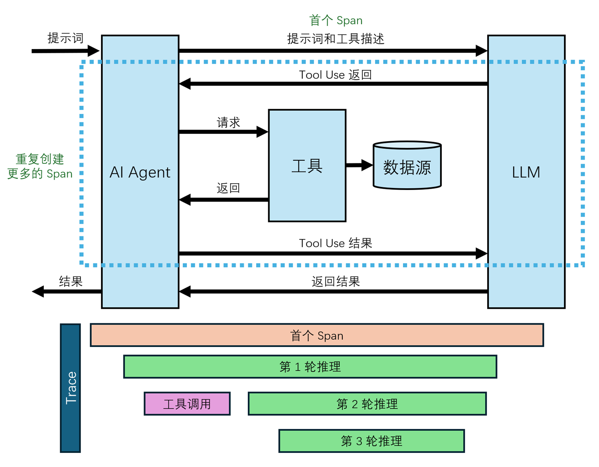
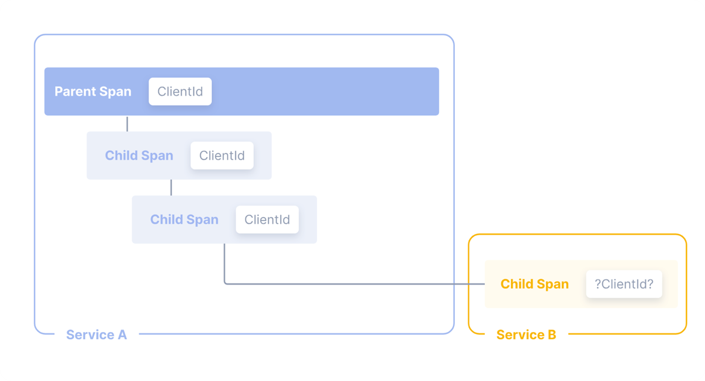
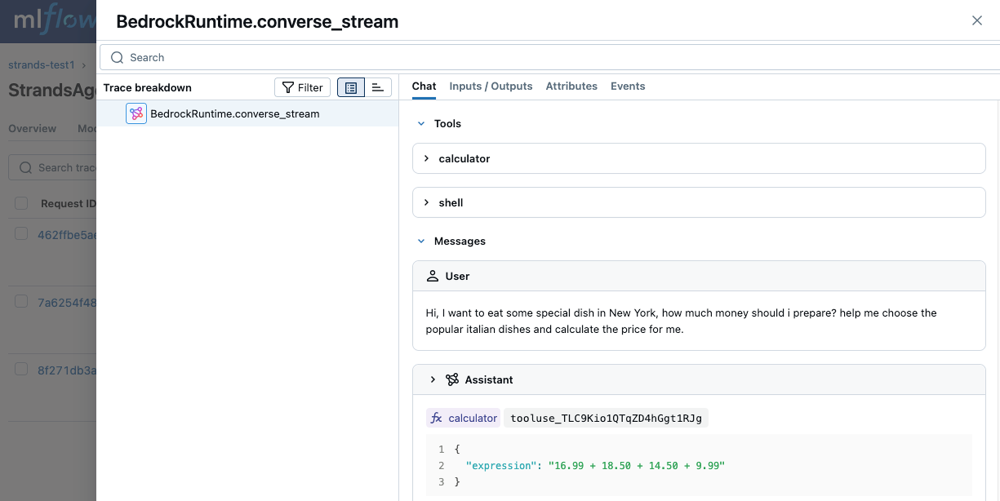
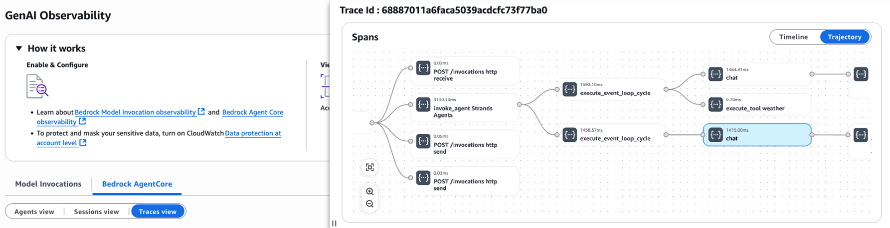
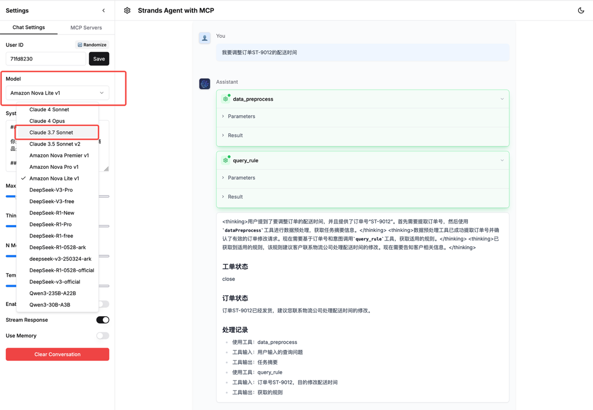
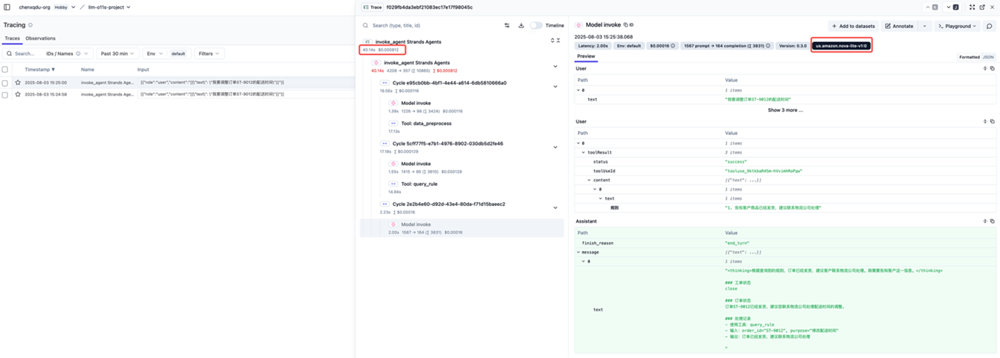
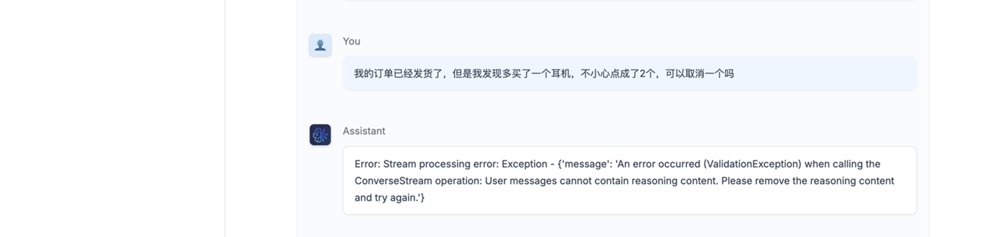
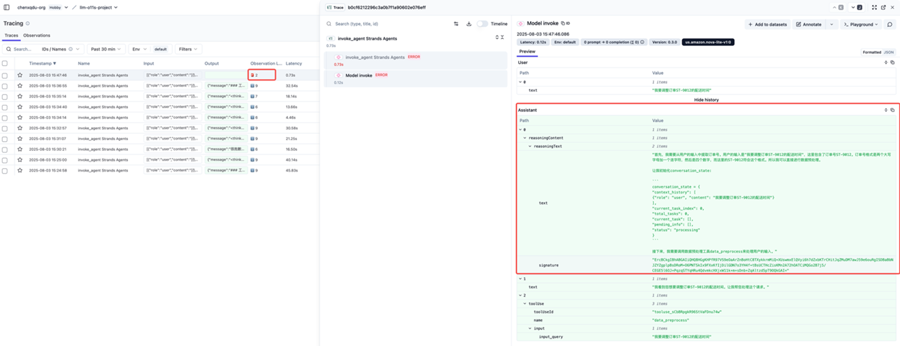
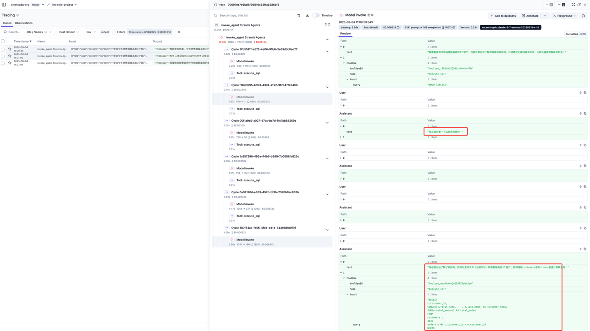

# Agentic AI基础设施实践经验系列（七）：可观测性在Agent应用的挑战与实践

by [AWS Team](https://aws.amazon.com/cn/blogs/china/author/zhyawenm/) on 19 9月 2025 in [Generative AI](https://aws.amazon.com/cn/blogs/china/category/artificial-intelligence/generative-ai/) [Permalink](https://aws.amazon.com/cn/blogs/china/agentic-ai-infrastructure-practice-series-7/) [ Share](https://aws.amazon.com/cn/blogs/china/agentic-ai-infrastructure-practice-series-7/#)


## 一. 引言：

我们正处在一个由 AI Agent 驱动的范式转换前夜。它们不再只是简单的文本生成器，而是能够理解复杂指令、自主规划多步任务，并调用各类 API 与数字世界交互的“数字工作者”；在为大型语言模型增加“执行臂膀”后，Agent 正在成为企业应用中的“能力放大器”。

过去，当我们监控传统微服务或 Web 应用时，“Metrics → Logs → Traces” 的可观测模型已足够应对。但在 Agent 场景，它只能告诉我们“发生了什么”，却无法解释“为什么会这样”——也无法指明“下一步该怎么办”。一旦将关键业务流程托付给 Agent，黑盒效应便迅速显现：

- 决策的“原因”：为何 Agent 选择在此时发起特定调用？它基于怎样的上下文与推理？
- 行为的“链条”：在这次调用之前，Agent 是否已经与用户或其他工具反复交互？这一步是解决方案的关键，还是误入歧途的昂贵尝试？
- 结果的“质量”：返回的内容是否真正提升了任务完成度，还是引入了新的偏差或错误？

在下文中，我们将结合 Amazon Bedrock、Amazon Bedrock AgentCore、Amazon CloudWatch 等原生能力，构建一套从行为洞察到质量评估、从成本监控到闭环优化的多维度可观测框架。

## 

## 二. Agent 可观测性详解

Agentic AI可观测性是一个多维度的概念，它不仅包括传统应用监控中的指标，还需要特别关注AI特有的行为特征。在Agent系统中，我们需要监控从用户输入到最终输出的整个处理流程，包括模型调用、推理过程、工具使用等各个环节。这种全方位的监控能力使我们能够及时发现问题、优化性能、提升用户体验。对于Agent系统，这里主要需要关注指标、追踪两方面。

### 重要指标

**响应时间指标：**时间相关的指标是评估Agent性能的重要维度。其中最关键的是以下几个指标：

- 总体请求处理时间（TotalTime）： 这个指标衡量了从接收用户请求到生成最终响应的完整时间。例如，当用户询问”巴黎的天气如何？”时，系统可能需要500ms来理解问题，300ms调用天气API，再用200ms生成回答，总计1000ms。监控这个指标可以帮助我们发现性能瓶颈，优化响应速度。
- 首个token生成时间（TTFT）： 这是衡量系统响应速度的关键指标。它记录从请求开始到生成第一个响应token的时间。比如，如果系统在接收到问题后能在200ms内开始生成回答，这表明系统的初始响应速度较快。这个指标对于提供流式响应的系统特别重要。
- 模型延迟（ModelLatency）： 专门衡量模型推理所需的时间。通过监控这个指标，我们可以评估不同模型的性能表现，为特定场景选择最适合的模型。

**Token****使用指标：**Token使用情况直接关系到系统的运营成本和效率

- 输入Token数量（InputTokenCount）： 记录发送给模型的token数量。例如，一个包含系统提示词、上下文历史和用户问题的请求可能使用了1000个token。这个指标帮助我们优化提示词设计和上下文管理策略。
- 输出Token数量（OutputTokenCount）： 统计模型生成的token数量。比如，一个详细的天气报告响应可能产生200个token。监控这个指标有助于控制响应的简洁度和成本。

**工具使用指标：**Agent系统中的工具调用情况也需要密切监控：

- 调用频率（InvocationCount）： 记录每个工具被调用的次数。例如，在一个客服Agent中，可能发现知识库查询工具的使用频率是订单查询工具的三倍，这样的信息可以指导我们优化工具的设计和缓存策略。
- 工具执行时间： 监控每个工具的执行耗时。比如，如果发现天气API的平均响应时间超过800ms，可能需要考虑更换更合适的模型或实施缓存机制。

### **Agent****追踪：完整的执行链路视图**

在传统的可观测性三支柱中，追踪（Tracing）对于Agent系统具有独特且至关重要的价值。与指标和日志相比，追踪能够提供Agent决策过程的完整上下文链路，这对于理解和优化AI系统的行为模式至关重要。传统指标虽然能够反映系统的健康状况和性能特征，但无法解释Agent在特定情境下做出某个决策的原因。日志虽然提供了详细的事件记录，但往往缺乏跨服务的关联性，难以构建完整的执行图谱。而追踪数据通过span的层次化结构，能够精确记录Agent从接收用户输入、理解意图、规划执行路径、调用工具、生成响应的完整决策链条。这种端到端的可见性使开发者能够快速定位性能瓶颈、识别错误根因，并深入理解Agent的推理逻辑。

根据Amazon X-Ray和OpenTelemetry的最佳实践，Agent场景下的追踪数据不仅记录了”发生了什么”，更重要的是揭示了”为什么这样发生”以及”各个组件之间如何相互作用”。具体而言，Agent追踪系统需要关注以下几个核心维度：

- **Agent****执行追踪：**提供完整的执行链路视图，包括系统级追踪和推理周期追踪。系统级追踪记录每个请求的完整生命周期，从用户输入、系统提示词到最终响应的全过程，形成完整的执行图谱帮助理解Agent的决策过程。推理周期追踪则深入到每个推理步骤的细节，详细记录当前思考步骤的内容、工具调用的决策过程以及中间结果的处理方式，这些信息对于调试复杂的推理链特别有价值。
- **错误和异常追踪：**系统中的错误和异常需要特别关注，主要包括客户端错误和服务器错误两类。客户端错误记录由客户端引起的问题，如参数错误、认证失败等，这些信息帮助改进API设计和文档。服务器错误则追踪服务器端的异常情况，如模型调用失败、资源不足等，这类信息对于提升系统可靠性至关重要。

而这些内容均可通过Opentelemerty 协议记录并传输到后端以供分析。在OpenTelemetry的追踪体系中，每个操作都有对应的span ID和trace ID，这两个标识符构成了分布式追踪的核心骨架。Trace ID代表Agent执行循环中的一次完整会话，从用户发起请求到Agent返回最终结果的整个生命周期都会共享同一个trace ID。而span ID则代表这个执行循环中的每个具体操作，如模型调用、工具执行、上下文检索等，每个span ID都是唯一的，并通过父子关系构建起完整的执行树状结构。在Agent场景中，一个trace包含了从用户输入到最终响应生成的所有中间步骤，每个步骤都通过span来表示。Agent traces通常包含模型调用span和工具调用span，这些span会根据其追踪的步骤类型，被丰富的上下文信息所充实。



除了标准属性外，OpenTelemetry还提供了baggage机制来传递自定义的跨服务元数据。Baggage是一种分布式上下文传播机制，允许开发者在整个请求链路中传递业务相关的键值对信息。例如，可以通过baggage传递用户类型、实验标识、会话主题等业务属性，这些信息会自动附加到所有相关的span中，为后续的离线评估、性能分析和A/B测试提供宝贵的上下文。通过合理使用baggage机制，开发者可以实现更精细化的Agent行为分析和优化。



许多Agent框架已自带Opentelemetry支持，但仍需要将Opentelemetry SDK嵌入应用中。对于采用Python开发的Agent，可使用自动注入方式，利用 opentelemetry-instrument 命令将SDK自动嵌入到应用中。这一命令会自动化配置流程，从参数或环境变量中生成Opentelemetry配置，并自动将SDK附加至Agent的内部，AWS调用，或其他的外部调用中。这样，Agent的所有操作都会被Opentelemetry记录并传输到后端。

下面是一段跟踪数据的样本：

```apacheconf
{
    "name": "chat",
    "con
text": {
        "trace_id": "0x68888fcdba6326c1fc004fe9396ad6a8",
        "span_i
d": "0x4f4c5c4caf92a36d",
        "trace_state": "[]"
    },
    "kind": "SpanKind.CLIENT",
    "pare
nt_id": "0xbc776902450f8294",
    "start_time": "2025-07-29T09:09:33.427326Z",
    "e
nd_time": "2025-07-29T09:09:34.932205Z
",
    "status": {
        "status_code": "OK"
    },
    "attributes": {
        "session.i
d": "session-1234",
        "gen_ai.event.start_time": "2025-07-29T
09:09:33.427342+00:00",
        "gen_ai.system": "strands-agents",
        "gen_ai.operation.name": "chat",
        "gen_ai.request
.model": "us.anthropic.claude-3-5-haiku-20241022-v1:0",
        "gen
_ai.event.end_time": "2025-07-29T09:09:34.932173+00:00",
        "gen_a
i.usage.prompt_tokens": 443,
        "gen_ai.usag
e.input_tokens": 443,
        "gen_ai.usage.completion_tokens": 76,
        "gen_ai.usage.output_tokens": 76,
        "gen_ai.
usage.total_tokens": 519
    },
    "event
s": [
        {
            "name": "gen_ai.user.message",
            "timestamp": "2025-07-29T09:09:33.427368Z",
            "attributes": {
                "content": "[{\"text\": \"Research and 
recommend suitable travel destinations for someone looking for China 
traditional culture experience in Beijing ci
ty. \\nUse web search to find current 
information about venues, \\nevents, and attractions.\"}]"
            
}
        },
        {
            "name": "gen_ai.choice",
            "timestamp": "2025-07-29T09:09:34.932167Z",
            "attributes": {
                "finish_reason": "tool_use",
                "message": "[{\"text\": \"
I'll search for the best traditional cultural exper
iences in Beijing.\"}, {\"toolUse\": {\"toolUseId\": \"tooluse_JSt-cJ9fRU
28RmhdJ1XENA\", \"name\": \"web_search\", \"input\": {\"query\": \"Top traditiona
l cultural attractions and experiences in Beijing 2024\"}}}]"
            }
        
}
    ],
    "links": [],
    "resource": {
        "attributes": {
            "telemetry.sdk.language": "python",
            "telemetry.sdk.name": "opentelemetry",
            "telemetry.sdk.version": "1.33.1",
            "service.name": "agentic-travel-strands",
            "telemetry.auto.version": "0.10.0-aws",
            "aws.local.service": "agentic-travel-strands",
            "aws.service.type": "gen_ai_agent"
        },
        "schema_url": ""
    }
}
```

从这个示例中可以看到，Strands Agent框架已经内置了对OpenTelemetry的深度集成支持。根据Strands官方文档，该框架遵循OpenTelemetry GenAI语义约定，会自动将Agent的内部决策过程以标准化的事件（event）形式发送至追踪后端。这种自动化的遥测数据收集机制大大简化了Agent应用的可观测性实现，开发者无需手动编写复杂的追踪代码，即可获得生产级别的监控能力。

Strands Agent的OpenTelemetry集成特别针对GenAI工作负载进行了优化，能够自动捕获Agent执行过程中的关键信息，包括用户消息、系统提示词、模型推理结果、工具调用参数和返回值等。每个操作都会被封装为符合OpenTelemetry语义约定的span，并通过 Baggage 机制，自动添加相应的属性标签。

从上面的示例中可以看到，常用的元数据包括session.id（会话标识符）、gen_ai.system（AI系统标识，如strands-agents）、gen_ai.operation.name（操作名称，如chat）、gen_ai.request.model（请求的模型名称）以及各种token使用统计信息。这些元数据对于后续的数据分析和问题诊断至关重要。这些标准化的属性遵循OpenTelemetry GenAI语义约定，确保了不同Agent框架和监控平台之间的互操作性。

默认情况下，Agent应用产生的遥测数据会通过OTLP（OpenTelemetry Protocol）协议直接发送到CloudWatch的OTLP端点，这种直连方式简化了部署架构，减少了额外的基础设施维护成本。然而，在生产环境中，为了实现更灵活的数据处理和路由策略，通常会在数据源和目标系统之间部署OpenTelemetry Collector作为中间处理层。

OpenTelemetry Collector是一个功能强大的独立服务组件，专门用于接收、处理和导出遥测数据到多个目标系统。其架构采用了管道化设计，包含三个核心组件：Receivers（接收器）负责从各种数据源收集遥测数据，Processors（处理器）对数据执行转换、过滤、采样、属性增删等操作，Exporters（导出器）将处理后的数据发送到指定的后端系统。

在Agent可观测性场景中，Collector的处理器组件尤其有价值。例如，可以使用attributes处理器为特定的Agent span添加环境标签或业务标识，使用sampling处理器对高频操作进行智能采样以控制数据量，使用filter处理器过滤掉敏感信息或无关数据，使用batch处理器优化网络传输效率。这种流水线式的数据处理能力使企业能够根据具体需求定制化Agent遥测数据的收集和分发策略，实现成本效益的最优平衡。

## 

## 三. 实践方式：开源生态以及AWS 托管方案

在理解了Agent可观测性的核心概念和关键指标后，我们需要将这些理论转化为实际的技术实现。AWS生态系统为Agent可观测性提供了完整的托管解决方案，同时开源社区也贡献了丰富的第三方工具。接下来，我们将详细探讨如何在不同的技术栈和部署环境中实现Agent的全方位监控。

### 3.1 Amazon Cloudwatch GenAI Observability

Amazon Cloudwatch GenAI Observability 专门用于监控生成式AI工作负载，包括Amazon Bedrock AgentCore Runtime。它提供：

1. 端到端提示词跟踪(End-to-end prompt tracing) – 跟踪 AI Agent 的所有行为（包含大模型推理和工具调用）
2. 预配置仪表板 – 提供两个内置仪表板：
   1. Model Invocations – 详细的模型使用、token消耗和成本指标
   2. Amazon Bedrock AgentCore agents – 代理的性能和决策指标
3. 关键指标监控：
   1. 总调用次数和平均调用次数
   2. Token使用情况（总数、每查询平均数、输入、输出）
   3. 延迟（平均值、P90、P99）
   4. 错误率和限流事件
   5. 按应用程序、用户角色或特定用户的成本归因

GenAI Observability的核心是Cloudwatch Transation Search，GenAI Observability利用Cloudwatch Transation Search收集并转换的结构化日志进行AI工作负载的深度分析。

AWS在现有X-ray跟踪服务的基础上，推出了CloudWatch Transaction Search。Transaction Search最核心的创新在于其双重存储策略，这一设计巧妙地平衡了成本效益与数据完整性。当用户启用Transaction Search时，所有发送到X-Ray的spans都会被自动转换为语义约定格式（semantic convention format），并以结构化日志的形式存储在CloudWatch Logs的专用日志组aws/spans中。这个转换过程完全透明，spans会自动采用W3C trace ID标准，确保与OpenTelemetry生态系统的完整兼容性。每个span都包含完整的追踪信息：开始时间、结束时间、持续时间，以及丰富的元数据，包括业务属性如客户ID、订单ID等。这些数据全部可以进行搜索和分析，完全消除了传统采样带来的”盲区”问题。

Transaction Search提供的搜索能力远超传统X-Ray的范畴。通过可视化编辑器，用户可以基于任意span属性进行搜索，包括服务名称、span持续时间、状态码，以及自定义的业务属性。系统支持多种查询格式，List格式专注于单个span的详细分析，特别适合故障排查。当出现问题时，工程师可以直接使用对应的业务ID快速定位相关的trace，然后深入分析具体的执行路径。Group analysis格式提供聚合分析能力，可以按照可用区、状态码或客户ID等维度进行分组统计，快速识别影响面最大的问题。对于熟悉SQL的用户，Transaction Search还支持CloudWatch Logs Insights查询语言，提供更灵活的数据分析能力。

#### a. 在 Bedrock AgentCore Runtime 上集成Cloudwatch GenAI Observability

Bedrock AgentCore Observability 在 Cloudwatch GenAI Observability 的基础上，为 Bedrock AgentCore Runtime上运行的 Agent 提供更便捷的可观测性体验。在基础设施层面，AgentCore Runtime会自动创建和配置所需的CloudWatch日志组（如`/aws/bedrock-AgentCore/runtimes/<agent_id>-<endpoint_name>/runtime-logs`），自动处理IAM权限，并预配置好OTEL环境变量，应用只需添加Opentemeletry SDK即可使用，无需配置任何参数或环境变量。

AgentCore为不同资源类型提供差异化的默认观测能力：

Agent资源的指标可以在GenAI Observability页面直接查看，AgentCore自动提供针对Agent运行时的丰富指标，如Invocations（API请求总数）、Session Count（Agent会话总数）、细分的错误类型统计（InvocationError.Validation、InvocationError.Internal等），以及跨所有资源的聚合指标。

而Memory、Gateway、Tools资源的指标、spans和logs会自动路由到相应的CloudWatch组件中。特别是Memory资源，AgentCore提供了独特的深度可观测性，包括Creation Count（内存事件创建数量）、Memory特定的延迟指标，以及专门的工作流日志（提取日志和整合日志）。

我们提供基于 Jupyter Notebook 的快速使用指导，帮助您快速在 Amazon Bedrock AgentCore Runtime 上部署一个AI Agent，并从Bedrock AgentCore Observability 上观测Agent 的运行状况。您可以从 [此处](https://github.com/awslabs/amazon-bedrock-agentcore-samples/tree/main/01-tutorials/06-AgentCore-observability/01-Agentcore-runtime-hosted) 获取此快速使用指导。

#### b. 在其他计算服务上集成Amazon Cloudwatch GenAI Observability

对于选择在自建运行环境（如EC2、EKS、Lambda等）部署Agent，但仍希望使用CloudWatch GenAI Observability能力的组织，可以通过标准的OpenTelemetry集成来实现。您可以在软件包管理器中安装ADOT SDK依赖，将SDK注入到Agent代码中，配置详细的OTEL环境变量后，即可将可观测性数据上送至Cloudwatch。CloudWatch GenAI Observability的体验与AgentCore一致，您同样可以基于Trace和Span进行查询，但无法使用Bedrock AgentCore Observability 的指标面板，需要您自行创建。

我们提供基于 Jupyter Notebook 的快速使用指导，帮助您在本地运行基于 Strands 框架的 AI Agent，并从Cloudwatch GenAI Observability 上观测Agent 的运行状况。您可以从 [此处](https://github.com/awslabs/amazon-bedrock-agentcore-samples/tree/main/01-tutorials/06-AgentCore-observability/02-Agent-not-hosted-on-runtime) 获取此快速使用指导。

### 3.2 MLFlow、Langfuse等第三方组件

除了Cloudwatch GenAI Observability，许多开源第三方工具，例如Langfuse、MLFlow 也作为观测数据的分析平台。可以提供包括：数据可视化和分析界面，执行边缘案例分析，评估准确性和成本的权衡，分析用户交互模式，提供性能优化建议。

以Amazon SageMaker 托管的 [MLFlow 3.0](https://aws.amazon.com/cn/blogs/machine-learning/accelerating-generative-ai-development-with-fully-managed-mlflow-3-0-on-amazon-sagemaker-ai/) 进行 Agent 开发中的 Tracing 为例，通过全托管 MLflow 3.0 的追踪能力，开发者可以记录请求每个中间步骤关联的输入、输出和元数据，从而准确定位错误根源和意外行为的来源。以下示例代码展示了使用 [Strands Agent](https://strandsagents.com/latest/)s 来构建一个基本的 Agent 工作流及使用MLFlow来对其中间环节进行追踪。

```apacheconf
@mlflow.trace(name= "strands-bedrock", attributes={"k": "v"}, span_type=SpanType.LLM)
def get_model():...

@mlflow.trace(name
= "strands-agent", attributes={"k": "v"}, span_type=SpanType.AGENT)
def create_agent(model):...

@mlflow.trace(na
me= "strands-chain", attributes={"k": "v"}, span_type=SpanType.CHAIN)
def run_agent():
    model = get_model()
    agent = create_agent(model)
    r
eturn agent("Hi
, where can I eat in San Francisco?")


with mlflow.start_run(run_name="StrandsAgentRun"):
    results = run_agent()
```

这些能力通过捕获工作负载服务、节点和工具执行的详细信息，为您的 AI 工作负载提供可观测性。可以在MLFlow Tracking Server 前端的 Trace 选项卡中，查看这些完整记录的执行信息。见如下示例：



同时，对于使用 [Bedrock AgentCore](https://aws.amazon.com/cn/bedrock/agentcore/) 执行环境的Agents工作流来说，可以直接利用其集成至CloudWatch中的 GenAI Observability能力，直接获取整个Agent调用链的轨迹信息。见以下基于 AgentCore 进行 Strands Agents 搭建的调试示例。



除了MLFlow之外，也可使用其他可观测性平台，例如Langfuse是一个专为LLM应用设计的开源可观测性平台，提供了完整的追踪、评估和分析能力。它支持多种LLM框架的集成，能够自动捕获Agent的执行轨迹、token使用情况和成本信息，并通过直观的Web界面展示这些数据，帮助开发者快速识别性能瓶颈和优化机会。

## 

## 四. 利用可观测性组件运维 Agent

此部分将以基于 Strands Agent 构建的电商售后智能客服为例，展示如何在应用开发和生产迭代的过程中遇到的多个场景使用可观测性组件进行运维。

示例环境可根据 [workshop](https://catalog.us-east-1.prod.workshops.aws/workshops/93a2eb2c-7f00-463a-92f1-ab0e6e81f48b/zh-CN) 进行创建，创建资源包括一个含有订单数据表格并通过 api gateway 对外暴露的电商系统，和一个通过网页交互的电商售后智能客服应用，智能客服 Agent 应用通过添加多个 MCP servers，其中包括调用电商系统的 API Gateway 接口的工具，来实现对电商系统中的订单进行查询并按照售后流程定义规则进行处理的功能。以下为智能客服的页面截图，支持添加丰富的 MCP servers, 选择不同的 LLM 模型。



以上应用在开发阶段会在前端页面显示所有的模型和工具调用信息，在实际生产环境中基于数据安全应该在前端隐去。此时则可以将 Agent 的追踪数据打入到 Langfuse 平台进行监控，来保证重要指标的收集和功能异常的分析。

1. 模拟新模型发布，针对不同的 LLM 模型进行效果和成本对比测试

使用两个不同的 user 对相同的问题进行测试，在 Langfuse 中观察到不同的 Latency, Token 和 Cost , 可以观察到 Claude 3.7 和 Nova Lite 分析过程和对工具的调用次数上一致，Claude 3.7 在成本上更有优势，而 Nova Lite 则在成本上更有优势。



1. 模拟模型混用、网关智能路由的场景

假设基于测试结果，团队希望使用 Nova Lite 为主要模型，Claude 3.7 为备用模型 ，对话过程中交替切换 LLM 来进行充分测试，发现出现错误。



从 Langfuse 页面可以快速定位到历史对话采用 Claude 3.7 模型和当前切换的 Nova Lite 模型的信息格式不一致导致调用出错。基于此类的追踪分析，可以针对性的快速解决开发迭代和生产中遇到的问题。



1. 模拟新功能上线，分析功能调用全流程

售后客服扩展功能为不同卖家提供数据查询功能，应用后端通过 Mysql MCP server 接入电商系统数据库。以数据查询“查询今年销售额最高的3个客户”为例，虽然两种模型都可以完成查询，通过调用流程可以看到 Claude 3.7 对数据查询语句的生成思考更严谨，更适合用在数据分析的场景。



## 

## 五. 结语

随着 AI Agent 在企业应用中扮演越来越重要的角色，建立完善的可观测性体系已成为确保其可靠运行的关键基础设施。本文探讨了 Agent 可观测性的核心要素、实现方式和最佳实践，为开发团队提供了一个实用的参考框架，详细介绍了 AWS 生态系统为 Agent 可观测性提供的完整解决方案。通过 CloudWatch GenAI Observability 和 Bedrock AgentCore Observability，团队可以快速获得对 Agent 系统的全面洞察，无需复杂的基础设施搭建。这些服务与 OpenTelemetry 的深度集成，不仅确保了与开源生态的互操作性，更为后续的分析和优化提供了坚实基础。

我们建议您从访问 [Amazon Bedrock 控制台](https://console.aws.amazon.com/bedrock)开始，体验 CloudWatch GenAI Observability 的监控能力，并参考本文提供的[Agent Observability 示例代码](https://github.com/awslabs/amazon-bedrock-agentcore-samples/tree/main/01-tutorials/06-AgentCore-observability)将 Agent 应用接入这些服务。在 AWS Sample 仓库中还有[更多资源](https://github.com/aws-samples/sample-agentic-platform)供您参考。

随着AI Agent在企业应用中的广泛部署，可观测性已经从”锦上添花”的辅助工具转变为”不可或缺”的核心能力。传统的监控方式虽然能够告诉我们系统的运行状态，但面对Agent的复杂决策链条和多步推理过程，我们需要更深层次的洞察能力。

通过本文介绍的多维度可观测性框架，我们不仅能够监控Agent的性能指标和资源消耗，更重要的是能够理解Agent的”思考过程”——从意图理解到工具调用，从推理链条到最终输出的完整决策轨迹。AWS提供的CloudWatch GenAI Observability和Bedrock AgentCore等托管服务，结合开源生态中的MLFlow、Langfuse等工具，为企业构建Agent可观测性提供了完整的技术栈支持。无论是选择全托管的便捷方案，还是基于开源工具的灵活定制，企业都能找到适合自身需求的实施路径。

在AI Agent成为企业数字化转型重要推动力的今天，建立完善的可观测性体系不仅是技术需要，更是业务成功的关键保障。只有真正”看见”和”理解”Agent的行为，我们才能充分释放其潜力，让AI真正成为企业的智能助手和效率倍增器。

**关于Agentic AI****基础设施的更多实践经验参考，欢迎点击：**

[Agentic AI基础设施实践经验系列（一）：Agent应用开发与落地实践思考](https://aws.amazon.com/cn/blogs/china/agentive-ai-infrastructure-practice-series-1)

[Agentic AI基础设施实践经验系列（二）：专用沙盒环境的必要性与实践方案](https://aws.amazon.com/cn/blogs/china/agentic-ai-sandbox-practice/)

[Agentic AI基础设施实践经验系列（三）：Agent记忆模块的最佳实践](https://aws.amazon.com/cn/blogs/china/agentic-ai-infrastructure-deep-practice-experience-thinking-series-three-best-practices-for-agent-memory-module)

[Agentic AI基础设施实践经验系列（四）：MCP服务器从本地到云端的部署演进](https://aws.amazon.com/cn/blogs/china/agentic-ai-infrastructure-practice-experience-series-four-mcp-server-from-local)

[Agentic AI基础设施实践经验系列（五）：Agent应用系统中的身份认证与授权管理](https://aws.amazon.com/cn/blogs/china/agentic-ai-infrastructure-practice-series-5/)

[Agentic AI基础设施实践经验系列（六）：Agent质量评估](https://aws.amazon.com/cn/blogs/china/agent-quality-evaluation/)

[Agentic AI基础设施实践经验系列（七）：可观测性在Agent应用的挑战与实践](https://aws.amazon.com/cn/blogs/china/agentic-ai-infrastructure-practice-series-7/)

[Agentic AI基础设施实践经验系列（八）：Agent应用的隐私和安全](https://aws.amazon.com/cn/blogs/china/privacy-and-security-of-agent-applications)