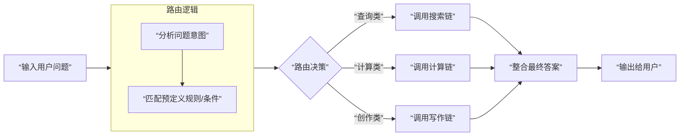

# Agent设计中的路由模式

在Agent设计中，**路由**是指Agent根据当前输入的**内容、意图或上下文，智能地选择不同处理流程、工具或子Agent**的核心机制。它是构建模块化、可扩展智能系统的关键。

你可以将它理解为一个智能调度中心：用户的问题来了，路由机制负责分析“这是什么类型的问题？该交给哪个专家（工具/链）处理最合适？”。

### 核心原理：为何需要路由？

一个万能的“通用链”处理所有任务，效果通常很差。路由机制遵循“分而治之”的软件工程原则，其核心优势在于：

1.  **专业化**：每个子链或工具只专注于处理一类特定任务，效果更优。
2.  **效率**：避免用复杂模型处理简单任务，或让不相关的工具无效运行，节省成本与时间。
3.  **可维护性**：系统像乐高积木，增删功能只需注册新的路由和对应的处理模块，而无需修改核心逻辑。

它的工作流程是一个清晰的决策环路，下图展示了一个包含LLM判断的标准路由过程：



下面，我将通过一个**“多技能AI助手”**的完整示例，展示如何实现一个基于LLM判断的内容路由。

### 代码示例：基于LLM的多路由助手

这个助手能根据问题类型，自动将其路由到“技术搜索专家”、“文学创作专家”或“通用聊天专家”进行处理。

```python
import os
from dotenv import load_dotenv
from langchain_openai import ChatOpenAI
from langchain_core.prompts import ChatPromptTemplate
from langchain_core.output_parsers import StrOutputParser
from langchain_core.runnables import RunnableBranch

# 加载环境变量，配置LLM
load_dotenv()
llm = ChatOpenAI(model="deepseek-chat", temperature=0)

# ========== 第1步：定义三个专业的子链 ==========
# 子链1：技术搜索专家 (模拟)
tech_search_prompt = ChatPromptTemplate.from_template(
    "你是一位技术专家，专门回答编程、IT和科技问题。请专业地解答以下问题：\n\n问题：{input}"
)
tech_search_chain = tech_search_prompt | llm | StrOutputParser()

# 子链2：文学创作专家
creative_writing_prompt = ChatPromptTemplate.from_template(
    "你是一位充满想象力的作家，擅长写故事和诗歌。请根据以下要求创作：\n\n要求：{input}"
)
creative_writing_chain = creative_writing_prompt | llm | StrOutputParser()

# 子链3：通用聊天专家
general_chat_prompt = ChatPromptTemplate.from_template(
    "你是一个友善的助手，进行日常聊天和回答常识问题。请回复：\n\n用户说：{input}"
)
general_chat_chain = general_chat_prompt | llm | StrOutputParser()

# ========== 第2步：构建路由判断链 ==========
# 这个链的唯一任务：分析输入，返回一个路由目的地（字符串）
route_prompt = ChatPromptTemplate.from_messages([
    ("system", """请根据用户输入的内容，判断其最符合以下哪种类型，并只返回对应的类型关键词：
    - 如果问题涉及 **编程、代码、算法、软件、硬件、科技产品**，返回 `tech`
    - 如果需求涉及 **写故事、编诗歌、创意写作、虚构内容**，返回 `writing`
    - 如果以上都不是，属于日常对话、常识问答或简单闲聊，返回 `general`
    不要解释，只返回一个词。"""),
    ("human", "用户输入：{input}")
])

classification_chain = route_prompt | llm | StrOutputParser()

# ========== 第3步：使用 RunnableBranch 构建路由逻辑 ==========
# RunnableBranch 接收一个 (condition, chain) 对的列表
branch = RunnableBranch(
    (lambda x: "tech" in x["topic"].lower(), tech_search_chain), # 如果 topic 包含 ‘tech'， 路由到 tech_search_chain
    (lambda x: "writing" in x["topic"].lower(), creative_writing_chain), # 如果 topic 包含 ‘writing'， 路由到 creative_writing_chain
    general_chat_chain # 默认路由到 general_chat_chain
)

# ========== 第4步：整合主链 ==========
# 主链的工作流：1.分类 -> 2.将分类结果和原始输入传递给路由分支
main_chain = {
    # 保留原始输入，并将分类结果放入 `topic` 键
    "input": lambda x: x["input"],
    "topic": classification_chain
} | branch # 将包含 input 和 topic 的字典传给 branch 做路由

# ========== 运行测试 ==========
if __name__ == "__main__":
    test_queries = [
        "Python中的装饰器是什么？",
        "帮我写一个关于星际探险的短诗开头",
        "今天天气怎么样？"
    ]
    
    for query in test_queries:
        print(f"\n🧪 用户输入：{query}")
        print("-" * 40)
        result = main_chain.invoke({"input": query})
        print(f"🤖 助手回复：{result}\n")
```

### 路由的实现模式详解

除了上面基于LLM判断的智能路由，实践中还有几种常见模式，适用于不同场景：

| 模式                      | 原理                                                         | 优点                                 | 缺点                                | 适用场景                                                     |
| :------------------------ | :----------------------------------------------------------- | :----------------------------------- | :---------------------------------- | :----------------------------------------------------------- |
| **基于规则/关键字的路由** | 使用 `if-elif-else` 或正则表达式匹配输入中的关键词。         | 速度快，成本为零，确定性高。         | 灵活性差，无法理解语义和上下文。    | 指令非常明确的客服菜单、简单命令（如“/search”、“/help”）。   |
| **基于LLM分类的路由**     | 如上例，用一个LLM链先对输入意图进行分类。                    | 语义理解强，能处理复杂和模糊的输入。 | 有API成本，增加延迟，分类可能出错。 | **最常见**，用于区分问题领域（如技术/商务/娱乐）、任务类型（分析/创作/总结）。 |
| **基于语义相似度的路由**  | 将输入与预设的“任务描述”进行向量化，通过余弦相似度匹配最接近的一个。 | 无需显式定义规则，可发现潜在关联。   | 需要嵌入模型和向量存储，配置复杂。  | 用户查询与已知用例库匹配，构建智能FAQ或文档导航。            |
| **多智能体路由**          | 每个路由目的地是一个完整的**子Agent**，拥有自己的记忆、规划和工具集。 | 能力最强，可处理极其复杂的子任务。   | 系统复杂度最高，开销大。            | 复杂项目分解，如“软件项目经理Agent”将任务分派给“前端Agent”、“后端Agent”、“测试Agent”。 |

### 关键应用场景

1.  **分层客服系统**：用户输入先路由到“投诉”、“咨询”、“技术支持”等分类，再由对应的专业客服子链处理，大幅提升效率和专业性。
2.  **多功能AI助手（如上例）**：让一个助手集成多种能力（查天气、写邮件、算汇率），通过路由调用不同的工具链。
3.  **工作流引擎**：在自动化流程中，根据文档内容（如发票、合同、简历）将其路由到不同的处理流水线（财务、法务、HR）。
4.  **代码生成与审查**：根据代码注释或需求描述（“添加API端点”、“修复SQL注入漏洞”），将任务路由给不同的代码生成或安全审查专家模型。

### 最佳实践与避坑指南

1.  **设置默认路由**：一定要有一个 `default_chain` 来处理无法匹配或分类失败的情况，例如礼貌地告知用户“我暂时无法处理这个问题”。
2.  **路由应轻量化**：负责路由的判断链本身应尽量简单、快速。避免在路由阶段进行大量计算或调用昂贵工具。
3.  **提供逃生通道**：允许用户在输入中通过特定指令（如“#强制写作”）覆盖自动路由结果，增加系统灵活性。
4.  **监控与评估**：记录路由决策日志，定期分析误判案例（例如，把技术问题误判为聊天），用以优化路由提示词或规则。

**总结来说，路由机制是Agent系统的“决策层”**。它让Agent从单一的“通才”转变为协调多个“专才”的“管理者”，是实现复杂、可靠AI应用不可或缺的设计模式。你可以从简单的规则路由开始，随着需求复杂化，逐步升级到基于LLM的智能路由或多智能体路由架构。