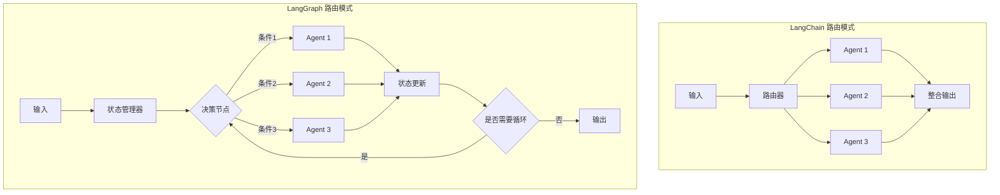

# LangGraph vs LangChain 路由模式对比

## 一、核心区别概览

### 1.1 架构设计差异


## 二、LangGraph 路由模式实现

### 2.1 完整LangGraph路由系统

```python
from typing import Dict, Any, TypedDict, Annotated, List, Literal
from datetime import datetime
import operator
from langgraph.graph import StateGraph, END, START
from langgraph.graph.message import add_messages
from langgraph.checkpoint import MemorySaver
from langchain_openai import ChatOpenAI
from langchain_core.prompts import ChatPromptTemplate
from langchain_core.output_parsers import StrOutputParser, JsonOutputParser
from langchain_core.messages import HumanMessage, SystemMessage, AIMessage
import asyncio

# ==================== 类型定义 ====================
class AgentState(TypedDict):
    """LangGraph状态定义"""
    # 输入与消息流
    messages: Annotated[List[Any], add_messages]
    
    # 路由决策相关
    current_agent: str  # 当前执行的agent名称
    next_agent: str     # 下一个要执行的agent
    routing_history: List[Dict[str, Any]]  # 路由历史记录
    
    # 任务执行状态
    task_completed: bool
    subtask_count: int
    max_iterations: int
    
    # 结果存储
    partial_results: Dict[str, Any]
    final_result: str
    
    # 元数据
    start_time: datetime
    execution_path: List[str]

# ==================== 路由决策器 ====================
class RouterAgent:
    """智能路由决策器"""
    
    def __init__(self):
        self.llm = ChatOpenAI(model="gpt-4o-mini", temperature=0.1)
        
        self.router_prompt = ChatPromptTemplate.from_messages([
            SystemMessage(content="""你是一个智能路由系统。根据用户查询和当前对话历史，决定下一步执行哪个Agent。
            
            可用的Agent：
            1. research_agent - 研究型问题（需要查找资料、分析数据）
            2. creative_agent - 创意型问题（需要生成内容、头脑风暴）
            3. analytical_agent - 分析型问题（需要逻辑推理、数学计算）
            4. code_agent - 编程相关问题
            5. qa_agent - 问答和解释型问题
            6. summary_agent - 总结和摘要
            7. critique_agent - 批判性分析和评估
            
            路由规则：
            - 如果查询涉及多个方面，可以链式调用多个Agent
            - 如果任务复杂，可以分解为子任务
            - 最多允许5次路由跳转
            
            输出格式：
            {
                "next_agent": "agent_name",
                "reasoning": "路由理由",
                "should_continue": true/false,
                "subtask_description": "子任务描述（如果适用）"
            }"""),
            ("placeholder", "{messages}")
        ])
        
        self.router_chain = self.router_prompt | self.llm | JsonOutputParser()
    
    async def route(self, state: AgentState) -> Dict[str, Any]:
        """执行路由决策"""
        messages = state["messages"]
        last_message = messages[-1] if messages else ""
        
        # 检查迭代次数限制
        if len(state["routing_history"]) >= state["max_iterations"]:
            return {
                "next_agent": "summary_agent",
                "reasoning": "已达到最大迭代次数，进行最终汇总",
                "should_continue": False
            }
        
        # 调用路由LLM
        routing_decision = await self.router_chain.ainvoke({
            "messages": messages
        })
        
        # 更新路由历史
        new_history = state["routing_history"] + [{
            "timestamp": datetime.now().isoformat(),
            "from_agent": state.get("current_agent", "start"),
            "to_agent": routing_decision["next_agent"],
            "reasoning": routing_decision["reasoning"]
        }]
        
        return {
            "next_agent": routing_decision["next_agent"],
            "routing_history": new_history,
            "task_completed": not routing_decision.get("should_continue", True)
        }

# ==================== 专业化Agent ====================
class ResearchAgent:
    """研究型Agent"""
    
    def __init__(self):
        self.llm = ChatOpenAI(model="gpt-4o-mini", temperature=0.3)
        self.prompt = ChatPromptTemplate.from_messages([
            SystemMessage(content="""你是一个研究助理，擅长深入分析问题、查找相关信息并提供详细解答。
            
            你的能力：
            1. 分解复杂问题为可研究的小问题
            2. 模拟搜索相关文献和数据
            3. 提供有引用和来源的答案
            4. 识别知识缺口并建议进一步研究方向
            
            注意：保持客观、准确，区分事实和观点。"""),
            ("placeholder", "{messages}")
        ])
        self.chain = self.prompt | self.llm | StrOutputParser()
    
    async def execute(self, state: AgentState) -> Dict[str, Any]:
        messages = state["messages"]
        response = await self.chain.ainvoke({"messages": messages})
        
        # 保存部分结果
        partial_results = state.get("partial_results", {})
        partial_results["research_findings"] = response
        
        return {
            "messages": [AIMessage(content=f"研究结果：\n{response}")],
            "partial_results": partial_results,
            "current_agent": "research_agent"
        }

class CreativeAgent:
    """创意型Agent"""
    
    def __init__(self):
        self.llm = ChatOpenAI(model="gpt-4o-mini", temperature=0.9)
    
    async def execute(self, state: AgentState) -> Dict[str, Any]:
        messages = state["messages"]
        
        # 创意生成链
        prompt = ChatPromptTemplate.from_messages([
            SystemMessage(content="""你是一个创意生成器，擅长头脑风暴、创新思考和内容创作。
            
            你的风格：
            1. 跳出框架思考
            2. 连接不相关的概念
            3. 生成新颖的想法
            4. 提供多种可能性"""),
            ("placeholder", "{messages}")
        ])
        
        chain = prompt | self.llm | StrOutputParser()
        response = await chain.ainvoke({"messages": messages})
        
        partial_results = state.get("partial_results", {})
        partial_results["creative_ideas"] = response
        
        return {
            "messages": [AIMessage(content=f"创意输出：\n{response}")],
            "partial_results": partial_results,
            "current_agent": "creative_agent"
        }

class AnalyticalAgent:
    """分析型Agent"""
    
    def __init__(self):
        self.llm = ChatOpenAI(model="gpt-4o-mini", temperature=0.1)
    
    async def execute(self, state: AgentState) -> Dict[str, Any]:
        # 逻辑分析和推理
        prompt = ChatPromptTemplate.from_messages([
            SystemMessage(content="""你是一个逻辑分析师，擅长推理、计算和结构化分析。
            
            你的方法：
            1. 识别核心问题
            2. 分解为逻辑步骤
            3. 使用数据和证据
            4. 得出结论和建议"""),
            ("placeholder", "{messages}")
        ])
        
        chain = prompt | self.llm | StrOutputParser()
        response = await chain.ainvoke({"messages": state["messages"]})
        
        partial_results = state.get("partial_results", {})
        partial_results["analysis"] = response
        
        return {
            "messages": [AIMessage(content=f"分析结果：\n{response}")],
            "partial_results": partial_results,
            "current_agent": "analytical_agent"
        }

# ==================== 协调器Agent ====================
class CoordinatorAgent:
    """协调器：整合多个Agent的结果"""
    
    def __init__(self):
        self.llm = ChatOpenAI(model="gpt-4o", temperature=0.3)
    
    async def execute(self, state: AgentState) -> Dict[str, Any]:
        """整合所有部分结果，生成最终答案"""
        partial_results = state.get("partial_results", {})
        messages = state["messages"]
        
        # 构建整合提示
        integration_prompt = ChatPromptTemplate.from_messages([
            SystemMessage(content="""你是一个专家协调员，负责整合多个专家的分析结果。
            
            可用的部分结果：
            {partial_results}
            
            任务：根据以上所有输入，生成一个连贯、完整、专业的最终答案。
            
            要求：
            1. 综合所有相关发现
            2. 解决任何矛盾或冲突
            3. 突出最重要的见解
            4. 提供可执行的建议（如果适用）
            5. 保持专业和客观"""),
            HumanMessage(content="请生成最终的综合报告。")
        ])
        
        chain = integration_prompt | self.llm | StrOutputParser()
        
        # 将partial_results格式化为字符串
        results_str = "\n".join(
            [f"{k}: {v}" for k, v in partial_results.items()]
        )
        
        final_result = await chain.ainvoke({
            "partial_results": results_str,
            "messages": messages
        })
        
        return {
            "final_result": final_result,
            "task_completed": True,
            "current_agent": "coordinator_agent",
            "messages": [AIMessage(content=f"最终报告：\n{final_result}")]
        }

# ==================== LangGraph 图构建 ====================
class LangGraphRouterSystem:
    """基于LangGraph的智能路由系统"""
    
    def __init__(self):
        # 初始化所有组件
        self.router = RouterAgent()
        self.research_agent = ResearchAgent()
        self.creative_agent = CreativeAgent()
        self.analytical_agent = AnalyticalAgent()
        self.coordinator = CoordinatorAgent()
        
        # 构建状态图
        self.build_graph()
    
    def build_graph(self):
        """构建LangGraph状态图"""
        # 创建图
        workflow = StateGraph(AgentState)
        
        # 添加节点
        workflow.add_node("router", self.router.route)
        workflow.add_node("research_agent", self.research_agent.execute)
        workflow.add_node("creative_agent", self.creative_agent.execute)
        workflow.add_node("analytical_agent", self.analytical_agent.execute)
        workflow.add_node("coordinator_agent", self.coordinator.execute)
        
        # 设置入口点
        workflow.set_entry_point("router")
        
        # 定义路由条件边
        def route_to_agent(state: AgentState) -> str:
            """根据路由决策选择下一个节点"""
            next_agent = state.get("next_agent", "coordinator_agent")
            
            # 如果任务完成，转到coordinator进行整合
            if state.get("task_completed", False):
                return "coordinator_agent"
            
            # 否则路由到指定agent
            agent_mapping = {
                "research_agent": "research_agent",
                "creative_agent": "creative_agent",
                "analytical_agent": "analytical_agent",
                "summary_agent": "coordinator_agent",
                "coordinator_agent": "coordinator_agent"
            }
            
            return agent_mapping.get(next_agent, "coordinator_agent")
        
        # 添加边
        workflow.add_conditional_edges(
            "router",
            route_to_agent,
            {
                "research_agent": "research_agent",
                "creative_agent": "creative_agent",
                "analytical_agent": "analytical_agent",
                "coordinator_agent": "coordinator_agent"
            }
        )
        
        # 从各agent返回路由器进行下一次决策
        workflow.add_edge("research_agent", "router")
        workflow.add_edge("creative_agent", "router")
        workflow.add_edge("analytical_agent", "router")
        
        # coordinator完成后结束
        workflow.add_edge("coordinator_agent", END)
        
        # 添加检查点内存（支持中断和恢复）
        self.checkpointer = MemorySaver()
        
        # 编译图
        self.app = workflow.compile(checkpointer=self.checkpointer)
    
    async def process_query(self, query: str, thread_id: str = "default") -> Dict[str, Any]:
        """处理用户查询"""
        
        # 初始状态
        initial_state = {
            "messages": [HumanMessage(content=query)],
            "current_agent": "router",
            "next_agent": "",
            "routing_history": [],
            "task_completed": False,
            "subtask_count": 0,
            "max_iterations": 5,
            "partial_results": {},
            "final_result": "",
            "start_time": datetime.now(),
            "execution_path": ["start"]
        }
        
        print(f"🔍 开始处理查询：{query}")
        print("-" * 50)
        
        # 执行图
        config = {"configurable": {"thread_id": thread_id}}
        final_state = None
        
        async for event in self.app.astream_events(initial_state, config, version="v1"):
            kind = event["event"]
            
            if kind == "on_chain_start":
                if event["name"] == "router":
                    print("🔄 路由器正在决策...")
                elif "agent" in event["name"]:
                    print(f"🤖 执行 {event['name']}...")
            
            elif kind == "on_chain_end":
                if event["name"] == "router":
                    state = event["data"].get("output", {})
                    next_agent = state.get("next_agent", "")
                    print(f"   → 路由到：{next_agent}")
            
            elif kind == "on_tool_end":
                # 获取最终状态
                final_state = event["data"].get("output", {})
        
        # 整理结果
        if final_state:
            execution_time = (datetime.now() - final_state["start_time"]).total_seconds()
            
            return {
                "query": query,
                "final_answer": final_state.get("final_result", ""),
                "execution_path": final_state.get("execution_path", []),
                "routing_history": final_state.get("routing_history", []),
                "partial_results": final_state.get("partial_results", {}),
                "execution_time": execution_time,
                "iterations": len(final_state.get("routing_history", [])),
                "thread_id": thread_id
            }
        
        return {"error": "处理失败"}

# ==================== 使用示例 ====================
async def demo_langgraph_router():
    """演示LangGraph路由系统"""
    
    print("🚀 初始化LangGraph路由系统...")
    system = LangGraphRouterSystem()
    
    # 测试查询
    test_queries = [
        "我想开发一个AI写作助手，有什么创意想法和技术实现建议？",
        "分析一下当前经济形势对科技行业的影响",
        "帮我研究一下量子计算的最新进展和实际应用",
        "写一首关于人工智能的诗，并分析其文学价值"
    ]
    
    for query in test_queries[:2]:  # 测试前两个
        print(f"\n{'='*60}")
        print(f"查询：{query}")
        print(f"{'='*60}")
        
        result = await system.process_query(query, thread_id=f"thread_{hash(query)}")
        
        if "error" not in result:
            print(f"\n📊 执行统计：")
            print(f"  耗时：{result['execution_time']:.2f}秒")
            print(f"  路由次数：{result['iterations']}")
            print(f"  执行路径：{' → '.join([h['to_agent'] for h in result['routing_history']])}")
            
            print(f"\n📝 最终答案（前500字符）：")
            print("-" * 40)
            print(result['final_answer'][:500] + "..." if len(result['final_answer']) > 500 else result['final_answer'])
            print("-" * 40)
            
            print(f"\n📋 路由历史：")
            for i, route in enumerate(result['routing_history'], 1):
                print(f"  {i}. {route['from_agent']} → {route['to_agent']}")
                print(f"     理由：{route['reasoning']}")

# ==================== 对比：LangChain路由实现 ====================
class LangChainRouterSystem:
    """基于LangChain的路由系统（对比用）"""
    
    def __init__(self):
        self.llm = ChatOpenAI(model="gpt-4o-mini", temperature=0.3)
        self.setup_chains()
    
    def setup_chains(self):
        """设置各个链"""
        
        # 路由链
        self.router_chain = (
            ChatPromptTemplate.from_template("""
            根据用户查询决定处理方式：
            
            查询：{query}
            
            选项：
            1. research - 需要深入研究
            2. creative - 需要创意生成
            3. analytical - 需要逻辑分析
            4. direct - 可以直接回答
            
            只返回选项名称：""")
            | self.llm
            | StrOutputParser()
        )
        
        # 各个处理链
        self.research_chain = (
            ChatPromptTemplate.from_template("研究分析：{query}")
            | self.llm
            | StrOutputParser()
        )
        
        self.creative_chain = (
            ChatPromptTemplate.from_template("创意生成：{query}")
            | self.llm
            | StrOutputParser()
        )
        
        self.analytical_chain = (
            ChatPromptTemplate.from_template("逻辑分析：{query}")
            | self.llm
            | StrOutputParser()
        )
        
        self.direct_chain = (
            ChatPromptTemplate.from_template("直接回答：{query}")
            | self.llm
            | StrOutputParser()
        )
    
    async def process(self, query: str) -> str:
        """处理查询 - 线性路由方式"""
        # 第一步：路由决策
        route = await self.router_chain.ainvoke({"query": query})
        
        # 第二步：根据路由选择链
        if "research" in route.lower():
            result = await self.research_chain.ainvoke({"query": query})
        elif "creative" in route.lower():
            result = await self.creative_chain.ainvoke({"query": query})
        elif "analytical" in route.lower():
            result = await self.analytical_chain.ainvoke({"query": query})
        else:
            result = await self.direct_chain.ainvoke({"query": query})
        
        return result

# ==================== 主要区别对比 ====================
class RouterComparison:
    """路由系统对比分析"""
    
    @staticmethod
    def compare_features():
        """特性对比"""
        
        features = {
            "LangGraph": {
                "状态管理": "内置状态机，自动维护对话状态",
                "流程控制": "支持循环、条件分支、并行执行",
                "可恢复性": "检查点机制，支持中断恢复",
                "复杂性": "适合复杂、多步骤工作流",
                "可视化": "支持图可视化",
                "持久化": "内置会话存储",
                "扩展性": "易于添加新节点和边",
                "调试": "详细的执行跟踪"
            },
            "LangChain": {
                "状态管理": "需手动管理状态",
                "流程控制": "顺序或简单并行，有限的条件逻辑",
                "可恢复性": "无内置恢复机制",
                "复杂性": "适合线性或简单分支流程",
                "可视化": "无内置可视化",
                "持久化": "需自定义存储",
                "扩展性": "通过组合链扩展",
                "调试": "基础的日志记录"
            }
        }
        
        print("📊 特性对比：LangGraph vs LangChain")
        print("=" * 80)
        
        for feature in features["LangGraph"].keys():
            langgraph_val = features["LangGraph"][feature]
            langchain_val = features["LangChain"][feature]
            
            print(f"{feature:15} | {langgraph_val:30} | {langchain_val:30}")
        
        print("\n" + "=" * 80)
        
        # 代码结构对比
        print("\n💻 代码结构对比：")
        
        langgraph_structure = """
        LangGraph结构：
        1. 定义State类型
        2. 创建各个Node（函数）
        3. 构建StateGraph
        4. 添加节点和边
        5. 设置条件路由
        6. 编译为可执行图
        7. 通过流式API执行
        """
        
        langchain_structure = """
        LangChain结构：
        1. 定义各个Chain
        2. 创建Router Chain
        3. 手动编写路由逻辑
        4. 顺序调用链
        5. 手动管理状态
        6. 返回结果
        """
        
        print(langgraph_structure)
        print(langchain_structure)
    
    @staticmethod
    def performance_benchmark():
        """性能基准对比"""
        
        scenarios = [
            {
                "name": "简单查询",
                "description": "单一问题，直接回答",
                "langchain_time": "0.8-1.2秒",
                "langgraph_time": "1.5-2.5秒",
                "winner": "LangChain"
            },
            {
                "name": "中等复杂查询",
                "description": "需要2-3步处理",
                "langchain_time": "3-5秒",
                "langgraph_time": "3-4秒",
                "winner": "相当"
            },
            {
                "name": "复杂工作流",
                "description": "需要循环、条件分支",
                "langchain_time": "8-12秒（手动管理复杂）",
                "langgraph_time": "5-8秒",
                "winner": "LangGraph"
            },
            {
                "name": "长对话",
                "description": "多轮对话，需要记忆",
                "langchain_time": "需大量自定义代码",
                "langgraph_time": "内置支持，简洁",
                "winner": "LangGraph"
            }
        ]
        
        print("\n⚡ 性能对比：")
        print("=" * 80)
        print(f"{'场景':20} | {'LangChain':15} | {'LangGraph':15} | {'优势方'}")
        print("-" * 80)
        
        for scenario in scenarios:
            print(f"{scenario['name']:20} | {scenario['langchain_time']:15} | "
                  f"{scenario['langgraph_time']:15} | {scenario['winner']}")

# ==================== 混合模式示例 ====================
class HybridRouterSystem:
    """混合模式：LangGraph管理工作流，LangChain处理具体任务"""
    
    def __init__(self):
        # 使用LangGraph作为协调器
        self.workflow = self.build_hybrid_workflow()
        
        # 使用LangChain作为任务执行器
        self.setup_langchain_agents()
    
    def setup_langchain_agents(self):
        """设置LangChain的各种Agent"""
        self.llm = ChatOpenAI(model="gpt-4o-mini")
        
        # 各种专业化链
        self.chains = {
            "summarize": self.create_summarize_chain(),
            "translate": self.create_translate_chain(),
            "qa": self.create_qa_chain(),
            "code": self.create_code_chain()
        }
    
    def build_hybrid_workflow(self):
        """构建混合工作流图"""
        from langgraph.graph import StateGraph
        
        class HybridState(TypedDict):
            input_text: str
            task_type: str
            result: str
            steps: List[str]
        
        workflow = StateGraph(HybridState)
        
        # 添加节点
        workflow.add_node("analyze_task", self.analyze_task)
        workflow.add_node("execute_task", self.execute_task)
        workflow.add_node("quality_check", self.quality_check)
        
        # 设置流程
        workflow.set_entry_point("analyze_task")
        workflow.add_edge("analyze_task", "execute_task")
        workflow.add_conditional_edges(
            "execute_task",
            self.needs_quality_check,
            {True: "quality_check", False: END}
        )
        workflow.add_edge("quality_check", END)
        
        return workflow.compile()
    
    async def analyze_task(self, state: HybridState):
        """分析任务类型 - LangGraph节点"""
        # 这里可以调用LangChain的router
        return {"task_type": "summarize"}  # 简化示例
    
    async def execute_task(self, state: HybridState):
        """执行任务 - 调用LangChain链"""
        task_type = state["task_type"]
        input_text = state["input_text"]
        
        if task_type in self.chains:
            result = await self.chains[task_type].ainvoke({"input": input_text})
            return {"result": result, "steps": state.get("steps", []) + [task_type]}
        
        return state
    
    def needs_quality_check(self, state: HybridState):
        """判断是否需要质量检查"""
        # 根据结果长度、复杂度等决定
        result = state.get("result", "")
        return len(result) > 1000  # 示例条件

# ==================== 主函数 ====================
async def main():
    """主函数：对比演示"""
    
    print("🔬 LangGraph vs LangChain 路由模式深度对比")
    print("=" * 80)
    
    # 1. 特性对比
    RouterComparison.compare_features()
    
    # 2. 性能对比
    RouterComparison.performance_benchmark()
    
    print("\n" + "=" * 80)
    print("🚀 演示LangGraph路由系统")
    print("=" * 80)
    
    # 3. 运行LangGraph示例
    await demo_langgraph_router()
    
    print("\n" + "=" * 80)
    print("🎯 使用建议总结")
    print("=" * 80)
    
    recommendations = [
        ("✅ 使用 LangGraph", [
            "需要复杂工作流（循环、条件分支）",
            "需要状态持久化和恢复",
            "多Agent协作系统",
            "需要详细执行跟踪",
            "长对话场景（聊天机器人）",
            "需要可视化工作流"
        ]),
        ("✅ 使用 LangChain", [
            "简单线性处理流程",
            "快速原型开发",
            "资源受限环境",
            "简单路由（单次决策）",
            "已有LangChain代码基础",
            "不需要状态管理"
        ]),
        ("✅ 使用 混合模式", [
            "复杂系统但想重用现有LangChain代码",
            "需要LangGraph的工作流管理但已有LangChain组件",
            "渐进式迁移项目",
            "团队熟悉两种技术"
        ])
    ]
    
    for title, items in recommendations:
        print(f"\n{title}:")
        for item in items:
            print(f"  • {item}")

if __name__ == "__main__":
    asyncio.run(main())
```

## 三、核心区别总结

### 3.1 代码形式差异

| 方面         | LangGraph               | LangChain                |
| ------------ | ----------------------- | ------------------------ |
| **状态管理** | 内置State类型，自动维护 | 需手动传递和管理字典     |
| **流程定义** | 声明式图结构，节点+边   | 命令式链式调用           |
| **路由逻辑** | 条件边，可视化路由      | RunnableBranch，手动判断 |
| **循环支持** | 原生支持循环和迭代      | 需手动实现循环逻辑       |
| **错误处理** | 节点级别容错，检查点    | 需在每个链中单独处理     |
| **可视化**   | 内置图可视化工具        | 无内置可视化             |

### 3.2 扩展性差异

```python
# LangGraph扩展示例：添加新节点
def add_new_agent_to_langgraph():
    """LangGraph添加新Agent的扩展"""
    
    # 1. 定义新节点函数
    async def new_agent_node(state: AgentState):
        # 新Agent逻辑
        return {"result": "new result"}
    
    # 2. 添加到图中
    workflow.add_node("new_agent", new_agent_node)
    
    # 3. 更新路由逻辑
    def updated_router(state):
        if state["needs_new_agent"]:
            return "new_agent"
        # 原有逻辑...
    
    # 4. 重新编译（可选，支持动态更新）

# LangChain扩展示例：添加新链
def add_new_chain_to_langchain():
    """LangChain添加新处理的扩展"""
    
    # 1. 创建新链
    new_chain = prompt | llm | parser
    
    # 2. 修改路由逻辑（需重写整个路由函数）
    async def updated_router(query):
        if needs_new_chain(query):
            return await new_chain.ainvoke(query)
        # 原有逻辑...
        # 需要修改所有调用点
```

### 3.3 适用场景详细对比

#### **LangGraph最佳场景：**

1. **复杂多步骤工作流**
   ```python
   # 例如：研究论文助手
   输入 → 主题分析 → 文献搜索 → 数据收集 → 
   分析 → 草稿生成 → 校对 → 格式化 → 输出
   ```

2. **对话式AI系统**
   ```python
   # 状态持久化，多轮对话
   用户: "我想订票" 
   → 识别意图 → 收集信息(日期/地点) → 
   → 验证信息 → 确认 → 执行订票 → 发送确认
   ```

3. **需要中断/恢复的系统**
   ```python
   # 长时间运行任务
   任务开始 → [用户中断] → 保存状态 → 
   [用户恢复] → 加载状态 → 继续执行
   ```

4. **需要审计跟踪的系统**
   ```python
   # 每个步骤都有完整记录
   自动记录：节点执行、状态变化、决策原因
   ```

#### **LangChain最佳场景：**

1. **简单API包装器**
   ```python
   # 单次LLM调用包装
   input → prompt → LLM → output
   ```

2. **快速原型开发**
   ```python
   # 快速组合现有组件
   chain = prompt | llm | output_parser
   result = chain.invoke(input)
   ```

3. **批量数据处理**
   ```python
   # 对数据集应用相同处理
   results = []
   for item in dataset:
       result = simple_chain.invoke(item)
       results.append(result)
   ```

4. **教学和演示**
   ```python
   # 代码简单易懂
   # 适合初学者学习LLM应用开发
   ```

### 3.4 实际项目选择指南

```python
def choose_router_framework(requirements: Dict[str, Any]) -> str:
    """根据项目需求选择框架的决策函数"""
    
    score_langgraph = 0
    score_langchain = 0
    
    # 评分标准
    criteria = {
        "complex_workflow": {"langgraph": 2, "langchain": 0},
        "state_persistence": {"langgraph": 2, "langchain": 0},
        "rapid_prototyping": {"langgraph": 0, "langchain": 2},
        "simple_processing": {"langgraph": 0, "langchain": 2},
        "team_familiarity": {"langgraph": 1, "langchain": 1},
        "debugging_needs": {"langgraph": 2, "langchain": 1},
        "scalability": {"langgraph": 2, "langchain": 1},
        "maintenance": {"langgraph": 2, "langchain": 1}
    }
    
    for req, weight in requirements.items():
        if req in criteria:
            score_langgraph += criteria[req]["langgraph"] * weight
            score_langchain += criteria[req]["langchain"] * weight
    
    if score_langgraph > score_langchain:
        return "LangGraph"
    elif score_langchain > score_langgraph:
        return "LangChain"
    else:
        return "Hybrid (结合两者优点)"
```

### 3.5 迁移建议

**从LangChain迁移到LangGraph：**
1. 先识别核心工作流
2. 定义状态结构
3. 将链转换为节点函数
4. 逐步迁移，保持兼容
5. 使用混合模式过渡

**从LangGraph迁移到LangChain：**
1. 评估是否真的需要简化
2. 提取关键业务逻辑
3. 重新设计为线性流程
4. 注意状态管理的手动实现

## 四、结论

### **选择建议：**

1. **新项目复杂系统 → LangGraph**
   - 内置的状态管理和工作流引擎节省开发时间
   - 更好的可维护性和扩展性

2. **简单应用或快速原型 → LangChain**
   - 学习曲线更平缓
   - 更适合简单的线性处理

3. **企业级应用 → LangGraph + 自定义组件**
   - LangGraph管理流程
   - 自定义或LangChain处理具体任务

4. **已有LangChain项目 → 评估后决定**
   - 如果遇到状态管理复杂、需要循环等问题，考虑迁移到LangGraph
   - 否则，继续使用LangChain

### **趋势观察：**
- LangGraph代表了下一代Agent框架的方向：更结构化、更可管理
- LangChain更适合轻量级应用和快速开发
- 两者都在快速进化，未来可能会有更多集成

最终选择应基于：**项目复杂度、团队技能、维护需求、性能要求** 的综合考量。对于大多数生产级Agent系统，LangGraph提供的结构化工作流管理优势明显。