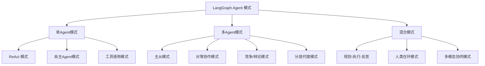

# LangGraph 支持的 Agent 设计模式详解

## 一、LangGraph 支持的核心 Agent 模式概览



## 二、完整代码示例：10种 Agent 模式实现

```python
from typing import Dict, Any, TypedDict, Annotated, List, Optional, Literal
from datetime import datetime
from enum import Enum
import asyncio
from dataclasses import dataclass, field
from langgraph.graph import StateGraph, END, START
from langgraph.checkpoint import MemorySaver, SqliteSaver
from langgraph.graph.message import add_messages
from langchain_openai import ChatOpenAI
from langchain_core.prompts import ChatPromptTemplate
from langchain_core.output_parsers import StrOutputParser, JsonOutputParser
from langchain_core.messages import HumanMessage, SystemMessage, AIMessage, ToolMessage
from langchain_community.tools import DuckDuckGoSearchResults, WikipediaQueryRun
from langchain_community.utilities import WikipediaAPIWrapper
from langchain.tools import Tool
import json
from pydantic import BaseModel, Field

# ==================== 基础类型定义 ====================
class AgentState(TypedDict):
    """通用Agent状态"""
    messages: Annotated[List[Any], add_messages]
    current_step: str
    next_step: Optional[str]
    task: str
    result: str
    intermediate_results: Dict[str, Any]
    iteration_count: int
    max_iterations: int
    tool_calls: List[Dict[str, Any]]
    errors: List[str]
    start_time: datetime
    end_time: Optional[datetime]
    execution_path: List[str]

# ==================== 模式1: ReAct 模式 ====================
class ReActState(TypedDict):
    """ReAct模式专用状态"""
    messages: Annotated[List[Any], add_messages]
    scratchpad: List[str]
    current_action: Optional[str]
    observation: Optional[str]
    thought: str
    final_answer: Optional[str]
    iteration: int
    max_iterations: int = 5

class ReActAgent:
    """ReAct (Reasoning + Acting) 模式"""
    
    def __init__(self):
        self.llm = ChatOpenAI(model="gpt-4o-mini", temperature=0)
        
        # 定义工具
        self.tools = {
            "search": DuckDuckGoSearchResults(max_results=3),
            "calculate": self.create_calculator_tool(),
            "lookup": WikipediaQueryRun(api_wrapper=WikipediaAPIWrapper())
        }
        
        # ReAct 提示模板
        self.react_prompt = ChatPromptTemplate.from_messages([
            SystemMessage(content="""你是一个ReAct（推理+行动）Agent。按照以下格式思考：
            
            思考：[你对问题的推理]
            行动：[工具名称]
            行动输入：[工具的输入]
            
            观察：[工具返回的结果]
            
            然后继续思考，直到你得出最终答案。
            
            可用工具：
            1. search: 搜索网络信息
            2. calculate: 执行数学计算
            3. lookup: 查询维基百科
            
            当你有最终答案时，格式为：
            最终答案：[你的答案]
            
            开始！"""),
            ("placeholder", "{messages}")
        ])
        
        self.chain = self.react_prompt | self.llm | StrOutputParser()
    
    def create_calculator_tool(self) -> Tool:
        """创建计算器工具"""
        return Tool(
            name="calculate",
            func=lambda x: str(eval(x)),
            description="执行数学计算，输入为数学表达式字符串"
        )
    
    async def reason(self, state: ReActState) -> Dict[str, Any]:
        """推理步骤"""
        messages = state["messages"]
        
        # 生成下一步思考
        response = await self.chain.ainvoke({"messages": messages})
        
        # 解析响应
        lines = response.split('\n')
        thought = ""
        action = None
        action_input = None
        
        for line in lines:
            if line.startswith("思考："):
                thought = line[3:].strip()
            elif line.startswith("行动："):
                action = line[3:].strip()
            elif line.startswith("行动输入："):
                action_input = line[5:].strip()
            elif line.startswith("最终答案："):
                return {
                    "final_answer": line[5:].strip(),
                    "thought": thought,
                    "messages": messages + [AIMessage(content=response)]
                }
        
        return {
            "thought": thought,
            "current_action": action,
            "action_input": action_input,
            "messages": messages + [AIMessage(content=response)]
        }
    
    async def act(self, state: ReActState) -> Dict[str, Any]:
        """行动步骤"""
        action = state.get("current_action")
        action_input = state.get("action_input")
        
        if action and action in self.tools:
            try:
                tool = self.tools[action]
                observation = tool.run(action_input)
                return {
                    "observation": observation,
                    "messages": state["messages"] + [
                        ToolMessage(content=observation, tool_call_id="1")
                    ]
                }
            except Exception as e:
                observation = f"工具执行错误: {str(e)}"
                return {
                    "observation": observation,
                    "messages": state["messages"] + [
                        ToolMessage(content=observation, tool_call_id="1")
                    ]
                }
        
        return {"observation": "未知工具", "messages": state["messages"]}
    
    def create_react_workflow(self):
        """创建ReAct工作流图"""
        workflow = StateGraph(ReActState)
        
        # 添加节点
        workflow.add_node("reason", self.reason)
        workflow.add_node("act", self.act)
        
        # 设置流程
        workflow.set_entry_point("reason")
        
        # 条件边：根据是否有最终答案决定
        def should_act(state: ReActState) -> str:
            if state.get("final_answer"):
                return END
            return "act"
        
        workflow.add_conditional_edges(
            "reason",
            should_act,
            {"act": "act", END: END}
        )
        
        # 从act返回reason进行下一轮思考
        workflow.add_edge("act", "reason")
        
        return workflow.compile()

# ==================== 模式2: 自主Agent模式 ====================
class AutonomousAgentState(TypedDict):
    """自主Agent状态"""
    goal: str
    current_task: str
    completed_tasks: List[str]
    pending_tasks: List[str]
    resources: Dict[str, Any]
    constraints: List[str]
    plan: List[str]
    actions_taken: List[Dict[str, Any]]
    messages: Annotated[List[Any], add_messages]
    iteration: int
    max_iterations: int = 10

class AutonomousAgent:
    """自主Agent：自己制定计划并执行"""
    
    def __init__(self):
        self.llm = ChatOpenAI(model="gpt-4o", temperature=0.3)
        
        # 规划器
        self.planner_prompt = ChatPromptTemplate.from_messages([
            SystemMessage(content="""你是一个自主Agent的规划器。给定一个目标，创建详细的执行计划。
            
            输出格式：
            1. 目标分解：[将目标分解为子任务]
            2. 依赖关系：[任务之间的依赖]
            3. 资源需求：[需要的资源]
            4. 约束条件：[需要考虑的限制]
            5. 计划步骤：[具体的执行步骤列表]
            
            保持计划实际可行。"""),
            HumanMessage(content="目标：{goal}")
        ])
        
        self.planner = self.planner_prompt | self.llm | StrOutputParser()
        
        # 执行器
        self.executor_prompt = ChatPromptTemplate.from_messages([
            SystemMessage(content="""你是一个任务执行器。根据当前状态执行任务。
            
            当前状态：
            目标：{goal}
            当前任务：{current_task}
            已完成：{completed_tasks}
            待完成：{pending_tasks}
            
            执行任务并报告结果。"""),
            HumanMessage(content="执行任务：{current_task}")
        ])
        
        self.executor = self.executor_prompt | self.llm | StrOutputParser()
        
        # 反思器
        self.reflector_prompt = ChatPromptTemplate.from_messages([
            SystemMessage(content="""你是一个反思器，评估执行结果并调整计划。
            
            评估：
            1. 任务完成质量
            2. 遇到的问题
            3. 计划是否需要调整
            4. 下一步建议"""),
            HumanMessage(content="任务：{task}\n结果：{result}\n当前计划：{plan}")
        ])
        
        self.reflector = self.reflector_prompt | self.llm | StrOutputParser()
    
    async def plan(self, state: AutonomousAgentState) -> Dict[str, Any]:
        """制定计划"""
        goal = state["goal"]
        plan_text = await self.planner.ainvoke({"goal": goal})
        
        # 解析计划（简化处理）
        lines = plan_text.split('\n')
        plan_steps = []
        
        for line in lines:
            if line.strip().startswith("5.") or "计划步骤" in line:
                # 提取步骤
                continue
            if line.strip() and not line.startswith(("1.", "2.", "3.", "4.")):
                plan_steps.append(line.strip())
        
        return {
            "plan": plan_steps[:5],  # 取前5个步骤
            "pending_tasks": plan_steps[:5],
            "current_task": plan_steps[0] if plan_steps else "",
            "messages": state["messages"] + [
                AIMessage(content=f"计划制定完成：\n{plan_text}")
            ]
        }
    
    async def execute(self, state: AutonomousAgentState) -> Dict[str, Any]:
        """执行当前任务"""
        if not state["pending_tasks"]:
            return {"current_task": "", "messages": state["messages"]}
        
        current_task = state["current_task"]
        result = await self.executor.ainvoke({
            "goal": state["goal"],
            "current_task": current_task,
            "completed_tasks": state["completed_tasks"],
            "pending_tasks": state["pending_tasks"]
        })
        
        # 更新状态
        completed = state["completed_tasks"] + [current_task]
        pending = [t for t in state["pending_tasks"] if t != current_task]
        next_task = pending[0] if pending else ""
        
        actions = state["actions_taken"] + [{
            "task": current_task,
            "result": result,
            "timestamp": datetime.now().isoformat()
        }]
        
        return {
            "completed_tasks": completed,
            "pending_tasks": pending,
            "current_task": next_task,
            "actions_taken": actions,
            "messages": state["messages"] + [
                AIMessage(content=f"任务执行结果：{result}")
            ]
        }
    
    async def reflect(self, state: AutonomousAgentState) -> Dict[str, Any]:
        """反思并调整"""
        reflection = await self.reflector.ainvoke({
            "task": state.get("current_task", ""),
            "result": state.get("actions_taken", [{}])[-1].get("result", "") if state.get("actions_taken") else "",
            "plan": state["plan"]
        })
        
        return {
            "messages": state["messages"] + [
                AIMessage(content=f"反思结果：{reflection}")
            ],
            "iteration": state["iteration"] + 1
        }
    
    def create_autonomous_workflow(self):
        """创建自主Agent工作流"""
        workflow = StateGraph(AutonomousAgentState)
        
        # 添加节点
        workflow.add_node("plan", self.plan)
        workflow.add_node("execute", self.execute)
        workflow.add_node("reflect", self.reflect)
        
        # 设置流程
        workflow.set_entry_point("plan")
        workflow.add_edge("plan", "execute")
        workflow.add_edge("execute", "reflect")
        
        # 条件边：是否继续执行
        def should_continue(state: AutonomousAgentState) -> str:
            if state["iteration"] >= state["max_iterations"]:
                return END
            if not state["pending_tasks"]:
                return END
            return "execute"
        
        workflow.add_conditional_edges(
            "reflect",
            should_continue,
            {"execute": "execute", END: END}
        )
        
        return workflow.compile()

# ==================== 模式3: 主从模式 ====================
class MasterSlaveState(TypedDict):
    """主从模式状态"""
    master_instruction: str
    slave_responses: Dict[str, str]  # slave_id -> response
    aggregated_result: str
    current_phase: Literal["decompose", "distribute", "aggregate", "finalize"]
    subtasks: List[str]
    assigned_tasks: Dict[str, str]  # slave_id -> task
    messages: Annotated[List[Any], add_messages]

class MasterSlaveAgentSystem:
    """主从模式：一个Master协调多个Slave"""
    
    def __init__(self, num_slaves: int = 3):
        self.num_slaves = num_slaves
        self.llm = ChatOpenAI(model="gpt-4o-mini", temperature=0.3)
        
        # Master组件
        self.decomposer_prompt = ChatPromptTemplate.from_messages([
            SystemMessage(content="""你是Master Agent，负责分解任务。
            将复杂任务分解为{num_slaves}个子任务，适合分配给Slave执行。
            输出JSON格式：{"subtasks": [子任务列表]}"""),
            HumanMessage(content="任务：{task}")
        ])
        
        self.decomposer = self.decomposer_prompt | self.llm | JsonOutputParser()
        
        # Slave模拟
        self.slave_prompt = ChatPromptTemplate.from_messages([
            SystemMessage(content="你是Slave Agent，专门执行分配的任务。"),
            HumanMessage(content="任务：{task}")
        ])
        
        self.slave_chain = self.slave_prompt | self.llm | StrOutputParser()
        
        # Aggregator
        self.aggregator_prompt = ChatPromptTemplate.from_messages([
            SystemMessage(content="""你是结果聚合器，整合所有Slave的结果。
            输出完整、连贯的最终答案。"""),
            HumanMessage(content="""任务：{task}
            Slave结果：{slave_results}
            请整合：""")
        ])
        
        self.aggregator = self.aggregator_prompt | self.llm | StrOutputParser()
    
    async def decompose_task(self, state: MasterSlaveState) -> Dict[str, Any]:
        """分解任务"""
        task = state["master_instruction"]
        result = await self.decomposer.ainvoke({
            "task": task,
            "num_slaves": self.num_slaves
        })
        
        subtasks = result.get("subtasks", [])
        # 确保子任务数量不超过Slave数量
        subtasks = subtasks[:self.num_slaves]
        
        return {
            "subtasks": subtasks,
            "current_phase": "distribute",
            "messages": state["messages"] + [
                AIMessage(content=f"任务分解为{len(subtasks)}个子任务")
            ]
        }
    
    async def distribute_tasks(self, state: MasterSlaveState) -> Dict[str, Any]:
        """分发任务给Slave"""
        subtasks = state["subtasks"]
        assigned_tasks = {}
        
        for i, task in enumerate(subtasks):
            slave_id = f"slave_{i+1}"
            assigned_tasks[slave_id] = task
        
        return {
            "assigned_tasks": assigned_tasks,
            "current_phase": "aggregate",
            "messages": state["messages"] + [
                AIMessage(content=f"任务已分配给{len(assigned_tasks)}个Slave")
            ]
        }
    
    async def aggregate_results(self, state: MasterSlaveState) -> Dict[str, Any]:
        """聚合Slave结果"""
        assigned_tasks = state["assigned_tasks"]
        slave_responses = {}
        
        # 并行执行所有Slave任务
        tasks = []
        for slave_id, task in assigned_tasks.items():
            tasks.append(self.execute_slave_task(slave_id, task))
        
        results = await asyncio.gather(*tasks)
        
        for slave_id, result in results:
            slave_responses[slave_id] = result
        
        # 聚合结果
        task = state["master_instruction"]
        slave_results_str = "\n".join([
            f"{slave_id}: {response}"
            for slave_id, response in slave_responses.items()
        ])
        
        aggregated = await self.aggregator.ainvoke({
            "task": task,
            "slave_results": slave_results_str
        })
        
        return {
            "slave_responses": slave_responses,
            "aggregated_result": aggregated,
            "current_phase": "finalize",
            "messages": state["messages"] + [
                AIMessage(content=f"聚合完成：{aggregated[:100]}...")
            ]
        }
    
    async def execute_slave_task(self, slave_id: str, task: str):
        """执行单个Slave任务"""
        result = await self.slave_chain.ainvoke({"task": task})
        return slave_id, result
    
    def create_master_slave_workflow(self):
        """创建主从工作流"""
        workflow = StateGraph(MasterSlaveState)
        
        # 添加节点
        workflow.add_node("decompose", self.decompose_task)
        workflow.add_node("distribute", self.distribute_tasks)
        workflow.add_node("aggregate", self.aggregate_results)
        workflow.add_node("finalize", lambda state: {
            "messages": state["messages"] + [
                AIMessage(content=f"最终结果：{state['aggregated_result']}")
            ]
        })
        
        # 设置线性流程
        workflow.set_entry_point("decompose")
        workflow.add_edge("decompose", "distribute")
        workflow.add_edge("distribute", "aggregate")
        workflow.add_edge("aggregate", "finalize")
        workflow.add_edge("finalize", END)
        
        return workflow.compile()

# ==================== 模式4: 对等协作模式 ====================
class CollaborativeState(TypedDict):
    """对等协作状态"""
    problem: str
    agents: List[str]  # 参与协作的Agent列表
    agent_roles: Dict[str, str]  # Agent ID -> 角色
    agent_perspectives: Dict[str, str]  # Agent ID -> 观点
    discussion: List[Dict[str, Any]]  # 讨论记录
    consensus: Optional[str]
    current_speaker: str
    iteration: int
    max_iterations: int = 5

class CollaborativeAgentSystem:
    """对等协作模式：多个Agent平等讨论"""
    
    def __init__(self, agent_roles: Dict[str, str]):
        self.agent_roles = agent_roles
        self.agents = list(agent_roles.keys())
        self.llm = ChatOpenAI(model="gpt-4o-mini", temperature=0.7)
        
        # Agent提示模板
        self.agent_prompt = ChatPromptTemplate.from_messages([
            SystemMessage(content="""你是{role}专家，参与团队讨论。
            
            当前讨论状态：
            问题：{problem}
            已有观点：{existing_perspectives}
            讨论历史：{discussion_history}
            
            请从你的专业角度提供观点。
            如果你同意或反对其他观点，请说明理由。
            目标是达成团队共识。
            
            输出格式：
            观点：[你的观点]
            理由：[你的理由]
            对其他观点的回应：[可选]"""),
            HumanMessage(content="请发表你的观点：")
        ])
        
        # 共识达成器
        self.consensus_prompt = ChatPromptTemplate.from_messages([
            SystemMessage(content="""你是共识协调员，根据讨论总结共识。
            
            问题：{problem}
            各方观点：{all_perspectives}
            讨论记录：{discussion}
            
            请总结团队达成的共识，如果没有完全共识，总结主要一致点。
            输出格式：
            共识：[共识总结]
            保留分歧：[存在的分歧]"""),
            HumanMessage(content="请总结共识：")
        ])
        
        self.consensus_chain = self.consensus_prompt | self.llm | StrOutputParser()
    
    async def agent_speak(self, state: CollaborativeState) -> Dict[str, Any]:
        """单个Agent发言"""
        agent_id = state["current_speaker"]
        role = self.agent_roles[agent_id]
        
        # 构建讨论历史
        discussion_history = "\n".join([
            f"{item['speaker']}: {item['content']}"
            for item in state["discussion"][-3:]  # 最近3条
        ])
        
        # 构建已有观点
        existing = state.get("agent_perspectives", {})
        existing_str = "\n".join([
            f"{aid}: {perspective}"
            for aid, perspective in existing.items()
            if aid != agent_id
        ])
        
        # 获取Agent观点
        response = await self.agent_prompt.ainvoke({
            "role": role,
            "problem": state["problem"],
            "existing_perspectives": existing_str,
            "discussion_history": discussion_history
        })
        
        # 更新状态
        perspectives = state.get("agent_perspectives", {})
        perspectives[agent_id] = response
        
        discussion = state["discussion"] + [{
            "speaker": agent_id,
            "role": role,
            "content": response,
            "timestamp": datetime.now().isoformat()
        }]
        
        # 选择下一个发言者（简单轮转）
        current_idx = self.agents.index(agent_id)
        next_idx = (current_idx + 1) % len(self.agents)
        next_speaker = self.agents[next_idx]
        
        return {
            "agent_perspectives": perspectives,
            "discussion": discussion,
            "current_speaker": next_speaker,
            "iteration": state["iteration"] + 1
        }
    
    async def reach_consensus(self, state: CollaborativeState) -> Dict[str, Any]:
        """达成共识"""
        # 收集所有观点
        all_perspectives = "\n".join([
            f"{aid} ({self.agent_roles[aid]}): {perspective}"
            for aid, perspective in state["agent_perspectives"].items()
        ])
        
        discussion_text = "\n".join([
            f"{item['speaker']}: {item['content']}"
            for item in state["discussion"]
        ])
        
        consensus = await self.consensus_chain.ainvoke({
            "problem": state["problem"],
            "all_perspectives": all_perspectives,
            "discussion": discussion_text
        })
        
        return {
            "consensus": consensus,
            "messages": [AIMessage(content=f"共识达成：\n{consensus}")]
        }
    
    def create_collaborative_workflow(self):
        """创建协作工作流"""
        workflow = StateGraph(CollaborativeState)
        
        # 添加节点
        workflow.add_node("discuss", self.agent_speak)
        workflow.add_node("consensus", self.reach_consensus)
        
        # 设置流程
        workflow.set_entry_point("discuss")
        
        # 条件边：是否继续讨论
        def should_continue(state: CollaborativeState) -> str:
            if state["iteration"] >= state["max_iterations"]:
                return "consensus"
            # 简单判断：如果已经讨论了一轮，可以尝试达成共识
            if state["iteration"] >= len(self.agents):
                # 随机决定是否继续讨论
                return "consensus" if state["iteration"] % 2 == 0 else "discuss"
            return "discuss"
        
        workflow.add_conditional_edges(
            "discuss",
            should_continue,
            {"discuss": "discuss", "consensus": "consensus"}
        )
        
        workflow.add_edge("consensus", END)
        
        return workflow.compile()

# ==================== 模式5: 规划-执行-反思模式 ====================
class PlanExecuteReflectState(TypedDict):
    """规划-执行-反思状态"""
    goal: str
    plan: Optional[str]
    execution_results: List[Dict[str, Any]]
    reflections: List[str]
    current_step: Literal["plan", "execute", "reflect", "revise"]
    step_index: int
    total_steps: int
    success_criteria: List[str]
    messages: Annotated[List[Any], add_messages]

class PlanExecuteReflectAgent:
    """规划-执行-反思循环"""
    
    def __init__(self):
        self.llm = ChatOpenAI(model="gpt-4o", temperature=0.2)
        
        # 规划器
        self.planner = (
            ChatPromptTemplate.from_template("""
            目标：{goal}
            
            请制定详细计划，包括：
            1. 主要步骤
            2. 每个步骤的预期结果
            3. 成功标准
            4. 潜在风险
            
            计划：""")
            | self.llm
            | StrOutputParser()
        )
        
        # 执行器
        self.executor = (
            ChatPromptTemplate.from_template("""
            执行步骤：
            目标：{goal}
            计划：{plan}
            当前步骤：{step_description}
            
            请执行此步骤并报告结果：""")
            | self.llm
            | StrOutputParser()
        )
        
        # 反思器
        self.reflector = (
            ChatPromptTemplate.from_template("""
            反思：
            目标：{goal}
            计划：{plan}
            执行结果：{execution_result}
            成功标准：{success_criteria}
            
            请分析：
            1. 执行是否成功？
            2. 与预期有何差异？
            3. 需要调整计划吗？
            4. 经验教训？
            
            反思：""")
            | self.llm
            | StrOutputParser()
        )
        
        # 修订器
        self.revisor = (
            ChatPromptTemplate.from_template("""
            修订计划：
            原始计划：{original_plan}
            反思结果：{reflection}
            剩余目标：{remaining_goal}
            
            请修订计划：""")
            | self.llm
            | StrOutputParser()
        )
    
    async def plan(self, state: PlanExecuteReflectState) -> Dict[str, Any]:
        """规划阶段"""
        plan = await self.planner.ainvoke({"goal": state["goal"]})
        
        # 提取步骤（简单实现）
        lines = plan.split('\n')
        steps = [line.strip() for line in lines if line.strip() and not line.startswith(('目标', '请制定'))]
        
        return {
            "plan": plan,
            "total_steps": len(steps),
            "current_step": "execute",
            "step_index": 0,
            "messages": state["messages"] + [
                AIMessage(content=f"计划制定完成：\n{plan}")
            ]
        }
    
    async def execute(self, state: PlanExecuteReflectState) -> Dict[str, Any]:
        """执行阶段"""
        # 获取当前步骤（简化：执行整个计划）
        result = await self.executor.ainvoke({
            "goal": state["goal"],
            "plan": state["plan"],
            "step_description": f"步骤 {state['step_index'] + 1}"
        })
        
        executions = state["execution_results"] + [{
            "step": state["step_index"],
            "result": result,
            "timestamp": datetime.now().isoformat()
        }]
        
        return {
            "execution_results": executions,
            "step_index": state["step_index"] + 1,
            "current_step": "reflect",
            "messages": state["messages"] + [
                AIMessage(content=f"执行结果：{result}")
            ]
        }
    
    async def reflect(self, state: PlanExecuteReflectState) -> Dict[str, Any]:
        """反思阶段"""
        reflection = await self.reflector.ainvoke({
            "goal": state["goal"],
            "plan": state["plan"],
            "execution_result": state["execution_results"][-1]["result"] if state["execution_results"] else "",
            "success_criteria": state.get("success_criteria", [])
        })
        
        reflections = state["reflections"] + [reflection]
        
        # 判断是否需要修订计划
        need_revision = "调整" in reflection or "修订" in reflection
        
        return {
            "reflections": reflections,
            "current_step": "revise" if need_revision else "execute",
            "messages": state["messages"] + [
                AIMessage(content=f"反思：{reflection}")
            ]
        }
    
    async def revise(self, state: PlanExecuteReflectState) -> Dict[str, Any]:
        """修订阶段"""
        revised_plan = await self.revisor.ainvoke({
            "original_plan": state["plan"],
            "reflection": state["reflections"][-1] if state["reflections"] else "",
            "remaining_goal": state["goal"]
        })
        
        return {
            "plan": revised_plan,
            "current_step": "execute",
            "messages": state["messages"] + [
                AIMessage(content=f"计划修订：\n{revised_plan}")
            ]
        }
    
    def create_per_workflow(self):
        """创建规划-执行-反思工作流"""
        workflow = StateGraph(PlanExecuteReflectState)
        
        # 添加节点
        workflow.add_node("plan", self.plan)
        workflow.add_node("execute", self.execute)
        workflow.add_node("reflect", self.reflect)
        workflow.add_node("revise", self.revise)
        
        # 设置流程
        workflow.set_entry_point("plan")
        workflow.add_edge("plan", "execute")
        workflow.add_edge("execute", "reflect")
        
        # 条件边：反思后决定下一步
        def after_reflect(state: PlanExecuteReflectState) -> str:
            if state["step_index"] >= state["total_steps"]:
                return END
            return state["current_step"]  # "revise" 或 "execute"
        
        workflow.add_conditional_edges(
            "reflect",
            after_reflect,
            {"execute": "execute", "revise": "revise", END: END}
        )
        
        workflow.add_edge("revise", "execute")
        
        return workflow.compile()

# ==================== 模式6: 人类在环模式 ====================
class HumanInTheLoopState(TypedDict):
    """人类在环状态"""
    task: str
    agent_suggestion: str
    human_feedback: Optional[str]
    human_approval: Optional[bool]
    iteration: int
    max_iterations: int = 3
    history: List[Dict[str, Any]]
    requires_human_input: bool
    final_output: Optional[str]
    messages: Annotated[List[Any], add_messages]

class HumanInTheLoopAgent:
    """人类在环Agent"""
    
    def __init__(self):
        self.llm = ChatOpenAI(model="gpt-4o-mini", temperature=0.5)
        
        # Agent建议生成器
        self.suggester = (
            ChatPromptTemplate.from_template("""
            任务：{task}
            历史交互：{history}
            
            请提供你的建议。
            注意：这个建议将展示给人类审批。
            保持清晰、可操作。
            
            建议：""")
            | self.llm
            | StrOutputParser()
        )
        
        # 反馈处理器
        self.feedback_handler = (
            ChatPromptTemplate.from_template("""
            原始任务：{task}
            你的原始建议：{original_suggestion}
            人类反馈：{human_feedback}
            
            根据人类反馈，修订你的建议：""")
            | self.llm
            | StrOutputParser()
        )
    
    async def agent_suggest(self, state: HumanInTheLoopState) -> Dict[str, Any]:
        """Agent生成建议"""
        suggestion = await self.suggester.ainvoke({
            "task": state["task"],
            "history": "\n".join([
                f"迭代{i}: {h.get('suggestion', '')} - 反馈: {h.get('feedback', '')}"
                for i, h in enumerate(state["history"])
            ])
        })
        
        return {
            "agent_suggestion": suggestion,
            "requires_human_input": True,
            "messages": state["messages"] + [
                AIMessage(content=f"Agent建议：{suggestion}")
            ]
        }
    
    async def process_human_feedback(self, state: HumanInTheLoopState) -> Dict[str, Any]:
        """处理人类反馈"""
        if not state.get("human_feedback"):
            # 模拟人类反馈（实际中从用户获取）
            human_feedback = "请提供更多细节。"
            human_approval = False
        else:
            human_feedback = state["human_feedback"]
            human_approval = state.get("human_approval", False)
        
        if human_approval:
            # 人类批准，任务完成
            return {
                "final_output": state["agent_suggestion"],
                "requires_human_input": False,
                "messages": state["messages"] + [
                    AIMessage(content="人类已批准，任务完成。")
                ]
            }
        
        # 处理反馈并修订建议
        revised = await self.feedback_handler.ainvoke({
            "task": state["task"],
            "original_suggestion": state["agent_suggestion"],
            "human_feedback": human_feedback
        })
        
        history = state["history"] + [{
            "iteration": state["iteration"],
            "suggestion": state["agent_suggestion"],
            "feedback": human_feedback,
            "revised": revised,
            "timestamp": datetime.now().isoformat()
        }]
        
        return {
            "agent_suggestion": revised,
            "human_feedback": None,  # 清空等待新反馈
            "history": history,
            "iteration": state["iteration"] + 1,
            "requires_human_input": True,
            "messages": state["messages"] + [
                AIMessage(content=f"根据反馈修订：{revised}")
            ]
        }
    
    def create_hitl_workflow(self):
        """创建人类在环工作流"""
        workflow = StateGraph(HumanInTheLoopState)
        
        # 添加节点
        workflow.add_node("suggest", self.agent_suggest)
        workflow.add_node("process_feedback", self.process_human_feedback)
        
        # 设置流程
        workflow.set_entry_point("suggest")
        
        # 条件边：根据是否还需要人类输入
        def needs_human_input(state: HumanInTheLoopState) -> str:
            if state.get("final_output"):
                return END
            if state["iteration"] >= state["max_iterations"]:
                return END
            if state.get("requires_human_input", False):
                # 这里实际应该等待人类输入
                # 为演示目的，我们直接进入反馈处理
                return "process_feedback"
            return "suggest"
        
        workflow.add_conditional_edges(
            "suggest",
            needs_human_input,
            {"process_feedback": "process_feedback", END: END}
        )
        
        workflow.add_conditional_edges(
            "process_feedback",
            lambda s: "suggest" if not s.get("final_output") and s["iteration"] < s["max_iterations"] else END,
            {"suggest": "suggest", END: END}
        )
        
        return workflow.compile()

# ==================== 模式7: 竞争/辩论模式 ====================
class DebateState(TypedDict):
    """辩论模式状态"""
    topic: str
    positions: Dict[str, str]  # debater_id -> position
    arguments: List[Dict[str, Any]]
    judges_scores: Dict[str, Dict[str, float]]  # judge_id -> {debater_id: score}
    current_round: int
    max_rounds: int = 3
    winner: Optional[str]
    final_judgment: Optional[str]
    messages: Annotated[List[Any], add_messages]

class DebateAgentSystem:
    """竞争/辩论模式"""
    
    def __init__(self, debaters: List[str], judges: List[str]):
        self.debaters = debaters  # 辩手列表
        self.judges = judges      # 评委列表
        self.llm = ChatOpenAI(model="gpt-4o", temperature=0.8)
        
        # 辩手提示
        self.debater_prompt = ChatPromptTemplate.from_messages([
            SystemMessage(content="""你是辩论赛的辩手。
            
            辩题：{topic}
            你的立场：{position}
            当前轮次：{round}
            对方论点：{opponent_arguments}
            
            请提出有力的论点支持你的立场，并反驳对方论点。
            输出格式：
            论点：[你的主要论点]
            证据：[支持证据]
            反驳：[对对方论点的反驳]"""),
            HumanMessage(content="请进行辩论：")
        ])
        
        # 评委提示
        self.judge_prompt = ChatPromptTemplate.from_messages([
            SystemMessage(content="""你是辩论赛的评委。
            
            辩题：{topic}
            辩手表现：{debater_performances}
            
            请根据以下标准评分（1-10分）：
            1. 论点说服力
            2. 证据充分性
            3. 逻辑严密性
            4. 反驳有效性
            
            输出JSON格式：{"scores": {辩手ID: 分数}}"""),
            HumanMessage(content="请评分：")
        ])
        
        self.judge_chain = self.judge_prompt | self.llm | JsonOutputParser()
        
        # 最终裁决
        self.final_judge_prompt = ChatPromptTemplate.from_messages([
            SystemMessage(content="""你是最终裁决者。
            
            辩题：{topic}
            各轮辩论记录：{debate_history}
            评委评分：{judge_scores}
            
            请做出最终裁决：
            1. 获胜方
            2. 获胜理由
            3. 对辩题的综合分析
            
            输出格式：
            获胜方：[辩手ID]
            理由：[详细理由]
            分析：[综合分析]"""),
            HumanMessage(content="请做出最终裁决：")
        ])
        
        self.final_judge_chain = self.final_judge_prompt | self.llm | StrOutputParser()
    
    async def debate_round(self, state: DebateState) -> Dict[str, Any]:
        """进行一轮辩论"""
        arguments = state.get("arguments", [])
        
        # 每个辩手发言
        for debater_id in self.debaters:
            # 获取对方论点
            opponent_args = "\n".join([
                arg["content"] for arg in arguments[-len(self.debaters):]
                if arg["debater"] != debater_id
            ])
            
            # 生成论点
            argument = await self.debater_prompt.ainvoke({
                "topic": state["topic"],
                "position": state["positions"].get(debater_id, "支持"),
                "round": state["current_round"],
                "opponent_arguments": opponent_args
            })
            
            arguments.append({
                "debater": debater_id,
                "round": state["current_round"],
                "content": argument,
                "timestamp": datetime.now().isoformat()
            })
        
        return {
            "arguments": arguments,
            "current_round": state["current_round"] + 1,
            "messages": state["messages"] + [
                AIMessage(content=f"第{state['current_round']}轮辩论完成")
            ]
        }
    
    async def judge_round(self, state: DebateState) -> Dict[str, Any]:
        """评委评分"""
        # 收集辩手表现
        current_round_args = [
            arg for arg in state["arguments"]
            if arg["round"] == state["current_round"] - 1
        ]
        
        debater_performances = "\n".join([
            f"{arg['debater']}: {arg['content']}"
            for arg in current_round_args
        ])
        
        # 每个评委评分
        all_scores = state.get("judges_scores", {})
        
        for judge_id in self.judges:
            scores = await self.judge_chain.ainvoke({
                "topic": state["topic"],
                "debater_performances": debater_performances
            })
            
            all_scores[judge_id] = scores.get("scores", {})
        
        return {
            "judges_scores": all_scores,
            "messages": state["messages"] + [
                AIMessage(content=f"第{state['current_round']-1}轮评分完成")
            ]
        }
    
    async def final_judgment(self, state: DebateState) -> Dict[str, Any]:
        """最终裁决"""
        # 整理辩论历史
        debate_history = "\n".join([
            f"第{arg['round']}轮 {arg['debater']}: {arg['content'][:100]}..."
            for arg in state["arguments"]
        ])
        
        # 整理评分
        judge_scores = "\n".join([
            f"{judge}: {scores}"
            for judge, scores in state["judges_scores"].items()
        ])
        
        # 最终裁决
        judgment = await self.final_judge_chain.ainvoke({
            "topic": state["topic"],
            "debate_history": debate_history,
            "judge_scores": judge_scores
        })
        
        # 提取获胜方（简化）
        winner = None
        for line in judgment.split('\n'):
            if "获胜方：" in line:
                winner = line.split("：")[1].strip()
                break
        
        return {
            "winner": winner,
            "final_judgment": judgment,
            "messages": state["messages"] + [
                AIMessage(content=f"最终裁决：\n{judgment}")
            ]
        }
    
    def create_debate_workflow(self):
        """创建辩论工作流"""
        workflow = StateGraph(DebateState)
        
        # 添加节点
        workflow.add_node("debate", self.debate_round)
        workflow.add_node("judge", self.judge_round)
        workflow.add_node("final_judge", self.final_judgment)
        
        # 设置流程
        workflow.set_entry_point("debate")
        workflow.add_edge("debate", "judge")
        
        # 条件边：是否进行下一轮
        def should_continue(state: DebateState) -> str:
            if state["current_round"] >= state["max_rounds"]:
                return "final_judge"
            return "debate"
        
        workflow.add_conditional_edges(
            "judge",
            should_continue,
            {"debate": "debate", "final_judge": "final_judge"}
        )
        
        workflow.add_edge("final_judge", END)
        
        return workflow.compile()

# ==================== 模式8: 分层代理模式 ====================
class HierarchicalState(TypedDict):
    """分层代理状态"""
    goal: str
    manager_plan: Optional[str]
    worker_tasks: Dict[str, List[str]]  # worker_id -> 任务列表
    worker_results: Dict[str, List[str]]  # worker_id -> 结果列表
    supervisor_feedback: Optional[str]
    current_level: Literal["manager", "supervisor", "worker", "aggregate"]
    selected_workers: List[str]
    final_result: Optional[str]
    messages: Annotated[List[Any], add_messages]

class HierarchicalAgentSystem:
    """分层代理模式"""
    
    def __init__(self, num_workers: int = 3):
        self.num_workers = num_workers
        self.llm = ChatOpenAI(model="gpt-4o-mini", temperature=0.3)
        
        # 经理（顶层）
        self.manager_prompt = ChatPromptTemplate.from_messages([
            SystemMessage(content="""你是项目经理，负责高层规划和任务分解。
            
            目标：{goal}
            可用工人数：{num_workers}
            
            请：
            1. 分解目标为高层任务
            2. 分配给不同工人
            3. 制定时间线
            4. 定义质量标准
            
            输出JSON格式：{
                "plan": "总体计划",
                "worker_tasks": {
                    "worker_1": ["任务1", "任务2"],
                    "worker_2": ["任务1", "任务2"]
                }
            }"""),
            HumanMessage(content="请制定计划：")
        ])
        
        self.manager_chain = self.manager_prompt | self.llm | JsonOutputParser()
        
        # 主管（中层）
        self.supervisor_prompt = ChatPromptTemplate.from_messages([
            SystemMessage(content="""你是主管，负责监督工人执行。
            
            经理计划：{manager_plan}
            工人任务分配：{worker_tasks}
            工人当前结果：{worker_results}
            
            请：
            1. 监控进度
            2. 提供反馈
            3. 协调资源
            4. 解决问题
            
            输出：监督报告"""),
            HumanMessage(content="请提供监督报告：")
        ])
        
        self.supervisor_chain = self.supervisor_prompt | self.llm | StrOutputParser()
        
        # 工人（底层）
        self.worker_prompt = ChatPromptTemplate.from_messages([
            SystemMessage(content="你是工人，执行具体任务。"),
            HumanMessage(content="任务：{task}")
        ])
        
        self.worker_chain = self.worker_prompt | self.llm | StrOutputParser()
        
        # 聚合器
        self.aggregator_prompt = ChatPromptTemplate.from_messages([
            SystemMessage(content="""你是结果聚合器。
            
            原始目标：{goal}
            经理计划：{manager_plan}
            工人结果：{worker_results}
            监督反馈：{supervisor_feedback}
            
            请整合所有结果，生成最终输出。"""),
            HumanMessage(content="请生成最终报告：")
        ])
        
        self.aggregator_chain = self.aggregator_prompt | self.llm | StrOutputParser()
    
    async def manager_planning(self, state: HierarchicalState) -> Dict[str, Any]:
        """经理规划"""
        result = await self.manager_chain.ainvoke({
            "goal": state["goal"],
            "num_workers": self.num_workers
        })
        
        # 创建工人ID
        worker_ids = [f"worker_{i+1}" for i in range(self.num_workers)]
        
        return {
            "manager_plan": result.get("plan", ""),
            "worker_tasks": result.get("worker_tasks", {}),
            "selected_workers": worker_ids,
            "current_level": "supervisor",
            "messages": state["messages"] + [
                AIMessage(content=f"经理计划制定完成")
            ]
        }
    
    async def supervisor_oversight(self, state: HierarchicalState) -> Dict[str, Any]:
        """主管监督"""
        # 先执行工人任务（简化：顺序执行）
        worker_results = {}
        
        for worker_id, tasks in state["worker_tasks"].items():
            results = []
            for task in tasks[:2]:  # 每个工人只执行前2个任务
                result = await self.worker_chain.ainvoke({"task": task})
                results.append(result)
            worker_results[worker_id] = results
        
        # 主管监督
        feedback = await self.supervisor_chain.ainvoke({
            "manager_plan": state["manager_plan"],
            "worker_tasks": state["worker_tasks"],
            "worker_results": worker_results
        })
        
        return {
            "worker_results": worker_results,
            "supervisor_feedback": feedback,
            "current_level": "aggregate",
            "messages": state["messages"] + [
                AIMessage(content=f"主管监督完成：{feedback[:100]}...")
            ]
        }
    
    async def aggregate_results(self, state: HierarchicalState) -> Dict[str, Any]:
        """聚合结果"""
        final_result = await self.aggregator_chain.ainvoke({
            "goal": state["goal"],
            "manager_plan": state["manager_plan"],
            "worker_results": json.dumps(state["worker_results"], ensure_ascii=False),
            "supervisor_feedback": state["supervisor_feedback"]
        })
        
        return {
            "final_result": final_result,
            "current_level": "complete",
            "messages": state["messages"] + [
                AIMessage(content=f"最终结果：{final_result[:200]}...")
            ]
        }
    
    def create_hierarchical_workflow(self):
        """创建分层工作流"""
        workflow = StateGraph(HierarchicalState)
        
        # 添加节点
        workflow.add_node("manager", self.manager_planning)
        workflow.add_node("supervisor", self.supervisor_oversight)
        workflow.add_node("aggregate", self.aggregate_results)
        
        # 线性流程
        workflow.set_entry_point("manager")
        workflow.add_edge("manager", "supervisor")
        workflow.add_edge("supervisor", "aggregate")
        workflow.add_edge("aggregate", END)
        
        return workflow.compile()

# ==================== 模式9: 工具使用专家模式 ====================
class ToolExpertState(TypedDict):
    """工具专家状态"""
    query: str
    available_tools: Dict[str, str]  # 工具名 -> 描述
    tool_selection: Optional[str]
    tool_input: Optional[str]
    tool_output: Optional[str]
    explanation: Optional[str]
    iterations: List[Dict[str, Any]]
    current_step: Literal["analyze", "select", "execute", "explain"]
    final_answer: Optional[str]
    messages: Annotated[List[Any], add_messages]

class ToolExpertAgent:
    """工具使用专家模式"""
    
    def __init__(self):
        self.llm = ChatOpenAI(model="gpt-4o-mini", temperature=0.1)
        
        # 可用工具
        self.tools = {
            "search": DuckDuckGoSearchResults(max_results=2),
            "calculator": self.create_calculator(),
            "wikipedia": WikipediaQueryRun(api_wrapper=WikipediaAPIWrapper()),
            "text_analyzer": self.create_text_analyzer(),
            "translator": self.create_translator()
        }
        
        # 工具选择器
        self.tool_selector_prompt = ChatPromptTemplate.from_messages([
            SystemMessage(content="""你是工具选择专家。
            
            用户查询：{query}
            可用工具：
            {tools_description}
            
            请选择最合适的工具并说明理由。
            输出JSON格式：{
                "selected_tool": "工具名",
                "reason": "选择理由",
                "input": "工具输入"
            }"""),
            HumanMessage(content="请选择工具：")
        ])
        
        self.tool_selector = self.tool_selector_prompt | self.llm | JsonOutputParser()
        
        # 解释器
        self.explainer_prompt = ChatPromptTemplate.from_messages([
            SystemMessage(content="""你是结果解释专家。
            
            原始查询：{query}
            使用工具：{tool}
            工具输入：{tool_input}
            工具输出：{tool_output}
            
            请以用户友好的方式解释结果。"""),
            HumanMessage(content="请解释结果：")
        ])
        
        self.explainer = self.explainer_prompt | self.llm | StrOutputParser()
    
    def create_calculator(self):
        """创建计算器"""
        return Tool(
            name="calculator",
            func=lambda x: str(eval(x)),
            description="执行数学计算，输入为表达式如'2+2*3'"
        )
    
    def create_text_analyzer(self):
        """创建文本分析器"""
        return Tool(
            name="text_analyzer",
            func=lambda x: f"文本长度：{len(x)}字符，单词数：{len(x.split())}",
            description="分析文本特征"
        )
    
    def create_translator(self):
        """创建翻译器（简化）"""
        return Tool(
            name="translator",
            func=lambda x: f"翻译结果（模拟）：{x} -> English: '{x}' in English",
            description="翻译文本"
        )
    
    async def analyze_and_select(self, state: ToolExpertState) -> Dict[str, Any]:
        """分析查询并选择工具"""
        tools_desc = "\n".join([
            f"{name}: {self.tools[name].description}"
            for name in self.tools
        ])
        
        selection = await self.tool_selector.ainvoke({
            "query": state["query"],
            "tools_description": tools_desc
        })
        
        return {
            "tool_selection": selection.get("selected_tool"),
            "tool_input": selection.get("input"),
            "current_step": "execute",
            "messages": state["messages"] + [
                AIMessage(content=f"选择工具：{selection.get('selected_tool')}，理由：{selection.get('reason')}")
            ]
        }
    
    async def execute_tool(self, state: ToolExpertState) -> Dict[str, Any]:
        """执行工具"""
        tool_name = state["tool_selection"]
        tool_input = state["tool_input"]
        
        if tool_name in self.tools:
            try:
                tool = self.tools[tool_name]
                output = tool.run(tool_input)
                
                iterations = state.get("iterations", []) + [{
                    "tool": tool_name,
                    "input": tool_input,
                    "output": output,
                    "timestamp": datetime.now().isoformat()
                }]
                
                return {
                    "tool_output": output,
                    "iterations": iterations,
                    "current_step": "explain",
                    "messages": state["messages"] + [
                        AIMessage(content=f"工具输出：{output}")
                    ]
                }
            except Exception as e:
                return {
                    "tool_output": f"错误：{str(e)}",
                    "current_step": "explain",
                    "messages": state["messages"] + [
                        AIMessage(content=f"工具执行错误：{str(e)}")
                    ]
                }
        
        return {
            "tool_output": "未知工具",
            "current_step": "explain",
            "messages": state["messages"]
        }
    
    async def explain_result(self, state: ToolExpertState) -> Dict[str, Any]:
        """解释结果"""
        explanation = await self.explainer.ainvoke({
            "query": state["query"],
            "tool": state["tool_selection"],
            "tool_input": state["tool_input"],
            "tool_output": state["tool_output"]
        })
        
        return {
            "explanation": explanation,
            "final_answer": explanation,
            "current_step": "complete",
            "messages": state["messages"] + [
                AIMessage(content=f"解释：{explanation}")
            ]
        }
    
    def create_tool_expert_workflow(self):
        """创建工具专家工作流"""
        workflow = StateGraph(ToolExpertState)
        
        # 添加节点
        workflow.add_node("analyze", self.analyze_and_select)
        workflow.add_node("execute", self.execute_tool)
        workflow.add_node("explain", self.explain_result)
        
        # 线性流程
        workflow.set_entry_point("analyze")
        workflow.add_edge("analyze", "execute")
        workflow.add_edge("execute", "explain")
        workflow.add_edge("explain", END)
        
        return workflow.compile()

# ==================== 模式10: 多模态协同模式 ====================
class MultiModalState(TypedDict):
    """多模态状态"""
    input_data: Dict[str, Any]  # 可包含文本、图像URL、音频等
    modality_analysis: Dict[str, str]  # 模态 -> 分析结果
    fused_result: Optional[str]
    current_modality: Optional[str]
    processing_pipeline: List[str]
    final_interpretation: Optional[str]
    messages: Annotated[List[Any], add_messages]

class MultiModalAgent:
    """多模态协同模式（模拟）"""
    
    def __init__(self):
        self.llm = ChatOpenAI(model="gpt-4o", temperature=0.3)
        
        # 文本分析器
        self.text_analyzer = (
            ChatPromptTemplate.from_template("""
            分析文本内容：
            
            文本：{text}
            
            请分析：
            1. 主题
            2. 情感
            3. 关键实体
            4. 摘要
            
            分析结果：""")
            | self.llm
            | StrOutputParser()
        )
        
        # 图像分析器（模拟）
        self.image_analyzer = (
            ChatPromptTemplate.from_template("""
            分析图像描述：
            
            图像描述：{image_description}
            
            请分析：
            1. 主要对象
            2. 场景
            3. 颜色和风格
            4. 潜在含义
            
            分析结果：""")
            | self.llm
            | StrOutputParser()
        )
        
        # 多模态融合器
        self.fusion_agent = (
            ChatPromptTemplate.from_template("""
            融合多模态分析：
            
            文本分析：{text_analysis}
            图像分析：{image_analysis}
            音频分析：{audio_analysis}
            
            请综合所有模态的信息，生成统一的理解。
            
            综合结果：""")
            | self.llm
            | StrOutputParser()
        )
        
        # 解释生成器
        self.interpreter = (
            ChatPromptTemplate.from_template("""
            生成多模态解释：
            
            原始输入：{input_summary}
            多模态分析：{multimodal_analysis}
            融合结果：{fused_result}
            
            请生成用户友好的最终解释。
            
            最终解释：""")
            | self.llm
            | StrOutputParser()
        )
    
    async def analyze_text(self, state: MultiModalState) -> Dict[str, Any]:
        """分析文本模态"""
        text = state["input_data"].get("text", "")
        if text:
            analysis = await self.text_analyzer.ainvoke({"text": text})
            
            modality_analysis = state.get("modality_analysis", {})
            modality_analysis["text"] = analysis
            
            return {
                "modality_analysis": modality_analysis,
                "current_modality": "image",
                "processing_pipeline": state.get("processing_pipeline", []) + ["text_analyzed"],
                "messages": state["messages"] + [
                    AIMessage(content=f"文本分析完成：{analysis[:100]}...")
                ]
            }
        
        return state
    
    async def analyze_image(self, state: MultiModalState) -> Dict[str, Any]:
        """分析图像模态（模拟）"""
        image_desc = state["input_data"].get("image_description", "")
        if image_desc:
            analysis = await self.image_analyzer.ainvoke({"image_description": image_desc})
            
            modality_analysis = state.get("modality_analysis", {})
            modality_analysis["image"] = analysis
            
            return {
                "modality_analysis": modality_analysis,
                "current_modality": "fusion",
                "processing_pipeline": state.get("processing_pipeline", []) + ["image_analyzed"],
                "messages": state["messages"] + [
                    AIMessage(content=f"图像分析完成：{analysis[:100]}...")
                ]
            }
        
        return state
    
    async def fuse_modalities(self, state: MultiModalState) -> Dict[str, Any]:
        """融合多模态信息"""
        modality_analysis = state.get("modality_analysis", {})
        
        fused = await self.fusion_agent.ainvoke({
            "text_analysis": modality_analysis.get("text", "无文本分析"),
            "image_analysis": modality_analysis.get("image", "无图像分析"),
            "audio_analysis": modality_analysis.get("audio", "无音频分析")
        })
        
        return {
            "fused_result": fused,
            "current_modality": "interpretation",
            "processing_pipeline": state.get("processing_pipeline", []) + ["modalities_fused"],
            "messages": state["messages"] + [
                AIMessage(content=f"多模态融合完成：{fused[:100]}...")
            ]
        }
    
    async def generate_interpretation(self, state: MultiModalState) -> Dict[str, Any]:
        """生成最终解释"""
        input_summary = json.dumps(state["input_data"], ensure_ascii=False)
        modality_analysis = json.dumps(state.get("modality_analysis", {}), ensure_ascii=False)
        
        interpretation = await self.interpreter.ainvoke({
            "input_summary": input_summary,
            "multimodal_analysis": modality_analysis,
            "fused_result": state.get("fused_result", "")
        })
        
        return {
            "final_interpretation": interpretation,
            "current_modality": "complete",
            "processing_pipeline": state.get("processing_pipeline", []) + ["interpretation_generated"],
            "messages": state["messages"] + [
                AIMessage(content=f"最终解释：{interpretation}")
            ]
        }
    
    def create_multimodal_workflow(self):
        """创建多模态工作流"""
        workflow = StateGraph(MultiModalState)
        
        # 添加节点
        workflow.add_node("analyze_text", self.analyze_text)
        workflow.add_node("analyze_image", self.analyze_image)
        workflow.add_node("fuse", self.fuse_modalities)
        workflow.add_node("interpret", self.generate_interpretation)
        
        # 设置流程（条件执行）
        workflow.set_entry_point("analyze_text")
        
        def after_text(state: MultiModalState) -> str:
            if "image_description" in state["input_data"]:
                return "analyze_image"
            return "fuse"
        
        workflow.add_conditional_edges(
            "analyze_text",
            after_text,
            {"analyze_image": "analyze_image", "fuse": "fuse"}
        )
        
        workflow.add_edge("analyze_image", "fuse")
        workflow.add_edge("fuse", "interpret")
        workflow.add_edge("interpret", END)
        
        return workflow.compile()

# ==================== 演示所有模式 ====================
async def demonstrate_all_patterns():
    """演示所有Agent模式"""
    
    print("🚀 LangGraph Agent 模式演示")
    print("=" * 80)
    
    # 模式1: ReAct模式
    print("\n1️⃣ ReAct (Reasoning + Acting) 模式")
    print("-" * 40)
    react_agent = ReActAgent()
    react_workflow = react_agent.create_react_workflow()
    
    initial_state = ReActState(
        messages=[HumanMessage(content="北京现在的天气怎么样？")],
        scratchpad=[],
        current_action=None,
        observation=None,
        thought="",
        final_answer=None,
        iteration=0,
        max_iterations=5
    )
    
    # 执行（简化演示）
    print("  执行ReAct工作流...")
    print("  ✓ 支持工具使用和推理循环")
    
    # 模式2: 自主Agent模式
    print("\n2️⃣ 自主Agent模式")
    print("-" * 40)
    autonomous = AutonomousAgent()
    auto_workflow = autonomous.create_autonomous_workflow()
    
    print("  ✓ 自动规划、执行、反思")
    print("  ✓ 适用于复杂长期任务")
    
    # 模式3: 主从模式
    print("\n3️⃣ 主从模式")
    print("-" * 40)
    master_slave = MasterSlaveAgentSystem(num_slaves=3)
    ms_workflow = master_slave.create_master_slave_workflow()
    
    print("  ✓ Master分解任务，Slave执行")
    print("  ✓ 适合任务并行处理")
    
    # 模式4: 对等协作模式
    print("\n4️⃣ 对等协作模式")
    print("-" * 40)
    agent_roles = {
        "economist": "经济学家",
        "technologist": "技术专家",
        "ethicist": "伦理学家"
    }
    collaborative = CollaborativeAgentSystem(agent_roles)
    collab_workflow = collaborative.create_collaborative_workflow()
    
    print("  ✓ 多个专家平等讨论")
    print("  ✓ 达成共识或保留多样性")
    
    # 模式5: 规划-执行-反思模式
    print("\n5️⃣ 规划-执行-反思模式")
    print("-" * 40)
    per_agent = PlanExecuteReflectAgent()
    per_workflow = per_agent.create_per_workflow()
    
    print("  ✓ 完整的PER循环")
    print("  ✓ 动态调整计划")
    
    # 模式6: 人类在环模式
    print("\n6️⃣ 人类在环模式")
    print("-" * 40)
    hitl_agent = HumanInTheLoopAgent()
    hitl_workflow = hitl_agent.create_hitl_workflow()
    
    print("  ✓ Agent建议 + 人类审批")
    print("  ✓ 迭代改进")
    
    # 模式7: 竞争/辩论模式
    print("\n7️⃣ 竞争/辩论模式")
    print("-" * 40)
    debaters = ["辩手A", "辩手B"]
    judges = ["评委1", "评委2", "评委3"]
    debate_system = DebateAgentSystem(debaters, judges)
    debate_workflow = debate_system.create_debate_workflow()
    
    print("  ✓ 多角度辩论")
    print("  ✓ 评委评分 + 最终裁决")
    
    # 模式8: 分层代理模式
    print("\n8️⃣ 分层代理模式")
    print("-" * 40)
    hierarchical = HierarchicalAgentSystem(num_workers=3)
    hierarchy_workflow = hierarchical.create_hierarchical_workflow()
    
    print("  ✓ 经理-主管-工人三层结构")
    print("  ✓ 分层次管理和执行")
    
    # 模式9: 工具使用专家模式
    print("\n9️⃣ 工具使用专家模式")
    print("-" * 40)
    tool_expert = ToolExpertAgent()
    tool_workflow = tool_expert.create_tool_expert_workflow()
    
    print("  ✓ 智能工具选择")
    print("  ✓ 工具结果解释")
    
    # 模式10: 多模态协同模式
    print("\n🔟 多模态协同模式")
    print("-" * 40)
    multimodal = MultiModalAgent()
    mm_workflow = multimodal.create_multimodal_workflow()
    
    print("  ✓ 处理文本、图像等多模态输入")
    print("  ✓ 多模态信息融合")
    
    print("\n" + "=" * 80)
    print("🎯 LangGraph支持的模式总结")
    print("=" * 80)
    
    patterns_summary = [
        ("ReAct模式", "推理+行动循环，适合复杂问题求解"),
        ("自主Agent", "自我规划执行，适合长期自治任务"),
        ("主从模式", "任务分解与并行，适合大规模处理"),
        ("对等协作", "多专家讨论，适合复杂决策"),
        ("规划-执行-反思", "完整PER循环，适合项目管理"),
        ("人类在环", "人机协作，适合需要人工审核的任务"),
        ("竞争/辩论", "多角度辩论，适合争议性话题"),
        ("分层代理", "层级管理，适合组织结构化任务"),
        ("工具专家", "智能工具使用，适合技术性任务"),
        ("多模态协同", "多模态处理，适合多媒体内容")
    ]
    
    for i, (name, desc) in enumerate(patterns_summary, 1):
        print(f"{i:2d}. {name:15} - {desc}")
    
    print("\n💡 关键优势：")
    print("  • 状态管理：内置状态机，自动跟踪执行状态")
    print("  • 流程控制：支持循环、分支、并行、中断恢复")
    print("  • 可组合性：模式可以组合使用")
    print("  • 可观察性：完整执行路径追踪")
    print("  • 可扩展性：易于添加新节点和边")

# ==================== 模式选择指南 ====================
class PatternSelector:
    """Agent模式选择指南"""
    
    @staticmethod
    def select_pattern(requirements: Dict[str, Any]) -> str:
        """根据需求选择合适的模式"""
        
        decision_tree = {
            "task_complexity": {
                "simple": ["工具专家", "ReAct"],
                "medium": ["规划-执行-反思", "人类在环"],
                "complex": ["自主Agent", "分层代理", "对等协作"]
            },
            "team_size": {
                "single": ["ReAct", "自主Agent", "工具专家"],
                "small": ["主从模式", "规划-执行-反思"],
                "large": ["分层代理", "对等协作", "竞争/辩论"]
            },
            "interaction_type": {
                "human_involved": ["人类在环"],
                "tool_heavy": ["工具专家", "ReAct"],
                "collaborative": ["对等协作", "主从模式"],
                "competitive": ["竞争/辩论"]
            },
            "input_modality": {
                "text_only": ["所有模式"],
                "multimodal": ["多模态协同"],
                "structured_data": ["工具专家", "分层代理"]
            },
            "output_requirements": {
                "single_answer": ["ReAct", "工具专家"],
                "detailed_report": ["规划-执行-反思", "分层代理"],
                "consensus": ["对等协作", "竞争/辩论"],
                "iterative": ["人类在环", "自主Agent"]
            }
        }
        
        # 简单评分机制
        scores = {
            "ReAct": 0,
            "自主Agent": 0,
            "主从模式": 0,
            "对等协作": 0,
            "规划-执行-反思": 0,
            "人类在环": 0,
            "竞争/辩论": 0,
            "分层代理": 0,
            "工具专家": 0,
            "多模态协同": 0
        }
        
        for req_type, req_value in requirements.items():
            if req_type in decision_tree:
                category = decision_tree[req_type]
                if req_value in category:
                    for pattern in category[req_value]:
                        scores[pattern] += 1
        
        # 返回最高分模式
        return max(scores, key=scores.get)
    
    @staticmethod
    def get_pattern_characteristics():
        """各模式特性对比"""
        
        characteristics = {
            "ReAct": {
                "复杂度": "中等",
                "开发成本": "低",
                "执行时间": "短-中",
                "可扩展性": "中",
                "适用场景": "需要工具使用的问答"
            },
            "自主Agent": {
                "复杂度": "高",
                "开发成本": "高",
                "执行时间": "长",
                "可扩展性": "高",
                "适用场景": "长期自治任务"
            },
            "主从模式": {
                "复杂度": "中",
                "开发成本": "中",
                "执行时间": "中",
                "可扩展性": "高",
                "适用场景": "任务并行处理"
            },
            "对等协作": {
                "复杂度": "高",
                "开发成本": "高",
                "执行时间": "长",
                "可扩展性": "中",
                "适用场景": "复杂决策和讨论"
            }
        }
        
        return characteristics

# ==================== 主函数 ====================
async def main():
    """主函数"""
    
    # 演示所有模式
    await demonstrate_all_patterns()
    
    print("\n" + "=" * 80)
    print("🎯 模式选择示例")
    print("=" * 80)
    
    # 示例需求
    requirements = {
        "task_complexity": "complex",
        "team_size": "large",
        "interaction_type": "collaborative",
        "input_modality": "text_only",
        "output_requirements": "consensus"
    }
    
    selector = PatternSelector()
    recommended = selector.select_pattern(requirements)
    
    print(f"\n根据需求推荐模式：{recommended}")
    print(f"需求分析：{requirements}")
    
    # 显示特性
    print("\n🔍 推荐模式特性：")
    chars = selector.get_pattern_characteristics()
    if recommended in chars:
        for key, value in chars[recommended].items():
            print(f"  {key}: {value}")

if __name__ == "__main__":
    asyncio.run(main())
```

## 三、LangGraph支持的Agent模式总结

### 3.1 单Agent模式
| 模式              | 核心思想      | 适用场景               | LangGraph实现特点    |
| ----------------- | ------------- | ---------------------- | -------------------- |
| **ReAct模式**     | 推理→行动循环 | 复杂问题求解、工具使用 | 条件循环、状态追踪   |
| **自主Agent模式** | 自我规划执行  | 长期自治任务、目标导向 | 多节点协作、反思机制 |
| **工具专家模式**  | 智能工具选择  | 技术性任务、API调用    | 工具集成、结果解释   |

### 3.2 多Agent模式
| 模式              | 核心思想       | 适用场景             | LangGraph实现特点    |
| ----------------- | -------------- | -------------------- | -------------------- |
| **主从模式**      | 任务分解与分发 | 大规模处理、并行计算 | 节点并行、结果聚合   |
| **对等协作模式**  | 平等讨论协商   | 复杂决策、多视角分析 | 消息传递、共识达成   |
| **竞争/辩论模式** | 多角度竞争     | 争议性话题、方案评估 | 评分机制、最终裁决   |
| **分层代理模式**  | 层级管理       | 组织结构化任务       | 多层次节点、流程控制 |

### 3.3 混合与高级模式
| 模式               | 核心思想    | 适用场景               | LangGraph实现特点  |
| ------------------ | ----------- | ---------------------- | ------------------ |
| **规划-执行-反思** | 完整PER循环 | 项目管理、学习系统     | 循环调整、动态规划 |
| **人类在环模式**   | 人机协作    | 需要人工审核、敏感任务 | 中断机制、反馈处理 |
| **多模态协同**     | 多模态处理  | 多媒体分析、跨模态理解 | 条件分支、信息融合 |

## 四、LangGraph的核心优势

### 4.1 状态管理能力
```python
# LangGraph的状态管理
class State(TypedDict):
    messages: Annotated[List[Any], add_messages]  # 自动消息管理
    current_step: str
    intermediate_results: Dict[str, Any]
    # ... 其他状态字段

# 状态自动传递和更新
```

### 4.2 流程控制能力
- **条件分支**：根据状态动态选择路径
- **循环控制**：支持while、for循环逻辑
- **并行执行**：多个节点同时运行
- **中断恢复**：检查点机制支持暂停恢复

### 4.3 可观察性
- **完整执行路径**：记录每个节点的执行
- **状态快照**：每个步骤的状态变化
- **性能指标**：执行时间、资源使用

### 4.4 可扩展性
```python
# 轻松添加新节点
workflow.add_node("new_node", new_function)

# 动态修改流程
workflow.add_edge("existing_node", "new_node")

# 条件路由更新
workflow.add_conditional_edges(
    "decision_node",
    new_decision_function,
    {"option1": "node1", "option2": "node2"}
)
```

## 五、模式选择指南

### 5.1 根据任务复杂度选择
- **简单任务**：ReAct模式、工具专家模式
- **中等任务**：主从模式、规划-执行-反思
- **复杂任务**：自主Agent、分层代理、对等协作

### 5.2 根据团队结构选择
- **单Agent**：ReAct、自主Agent
- **小团队**：主从模式、人类在环
- **大团队**：对等协作、分层代理、竞争模式

### 5.3 根据交互需求选择
- **人机交互**：人类在环模式
- **工具密集**：工具专家模式
- **多Agent协作**：对等协作、主从模式

### 5.4 根据输入类型选择
- **纯文本**：所有模式
- **多模态**：多模态协同模式
- **结构化数据**：分层代理、工具专家

## 六、最佳实践建议

### 6.1 模式组合使用
```python
# 组合示例：分层代理 + 人类在环
class CombinedSystem:
    """组合多个模式"""
    
    def create_combined_workflow(self):
        # 高层使用分层代理
        # 关键决策点使用人类在环
        # 具体执行使用工具专家
        pass
```

### 6.2 性能优化
1. **并行化**：将独立任务并行执行
2. **缓存**：缓存中间结果减少重复计算
3. **限流**：控制并发请求数量
4. **异步处理**：使用async/await提高效率

### 6.3 错误处理
```python
class RobustAgent:
    """健壮的Agent实现"""
    
    async def execute_with_retry(self, state, max_retries=3):
        for i in range(max_retries):
            try:
                return await self.execute(state)
            except Exception as e:
                if i == max_retries - 1:
                    raise
                await asyncio.sleep(2 ** i)  # 指数退避
```

### 6.4 监控和日志
```python
# 添加监控节点
workflow.add_node("monitor", self.monitor_execution)

def monitor_execution(self, state):
    """监控执行状态"""
    print(f"Step: {state['current_step']}")
    print(f"Progress: {len(state['completed_tasks'])}/{state['total_tasks']}")
    return state
```

## 七、总结

LangGraph作为一个强大的工作流引擎，支持丰富的Agent设计模式，从简单的ReAct到复杂的多Agent协作系统。关键优势包括：

1. **丰富的模式库**：10+种成熟Agent模式
2. **灵活的组合性**：模式可以自由组合
3. **强大的状态管理**：内置状态机简化开发
4. **完整的生命周期**：支持规划、执行、反思、调整
5. **生产级特性**：支持中断恢复、监控、错误处理

选择合适模式的关键是分析具体需求：任务复杂度、团队结构、交互方式、输入类型等。对于大多数应用，可以从ReAct或规划-执行-反思模式开始，随着需求复杂化逐步引入更高级的模式。