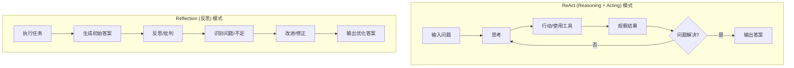

# ReAct模式 vs Reflection模式

## 一、核心概念对比



## 二、完整代码对比示例

### 2.1 ReAct模式完整实现

```python
from typing import Dict, Any, List, Optional
from dataclasses import dataclass
from enum import Enum
import re
import asyncio
from langchain_openai import ChatOpenAI
from langchain_core.prompts import ChatPromptTemplate
from langchain_core.messages import HumanMessage, SystemMessage, AIMessage
from langchain_community.tools import DuckDuckGoSearchResults, WikipediaQueryRun
from langchain_community.utilities import WikipediaAPIWrapper

class ReActState:
    """ReAct模式的状态管理"""
    
    def __init__(self, problem: str, max_iterations: int = 10):
        self.problem = problem
        self.iteration = 0
        self.max_iterations = max_iterations
        self.thoughts: List[str] = []
        self.actions: List[str] = []
        self.observations: List[str] = []
        self.final_answer: Optional[str] = None
        self.is_complete = False
    
    def add_step(self, thought: str, action: Optional[str] = None, 
                 observation: Optional[str] = None):
        """添加一个ReAct步骤"""
        self.thoughts.append(thought)
        if action:
            self.actions.append(action)
        if observation:
            self.observations.append(observation)
        self.iteration += 1
    
    def set_final_answer(self, answer: str):
        """设置最终答案"""
        self.final_answer = answer
        self.is_complete = True
    
    def get_context(self) -> str:
        """获取当前上下文"""
        context_lines = [f"问题: {self.problem}"]
        
        for i in range(len(self.thoughts)):
            context_lines.append(f"\n步骤 {i+1}:")
            context_lines.append(f"思考: {self.thoughts[i]}")
            if i < len(self.actions):
                context_lines.append(f"行动: {self.actions[i]}")
            if i < len(self.observations):
                context_lines.append(f"观察: {self.observations[i]}")
        
        return "\n".join(context_lines)

class ReActAgent:
    """ReAct模式实现：Reasoning + Acting"""
    
    def __init__(self):
        self.llm = ChatOpenAI(model="gpt-4o-mini", temperature=0)
        
        # 定义可用工具
        self.tools = {
            "search": DuckDuckGoSearchResults(max_results=3),
            "wikipedia": WikipediaQueryRun(api_wrapper=WikipediaAPIWrapper()),
            "calculator": self.calculator_tool,
            "finish": self.finish_tool
        }
        
        # ReAct提示模板
        self.react_template = """你是一个ReAct（推理+行动）Agent。请按照以下格式思考：

问题: {problem}

{history}

请按照以下格式输出：
思考：[你对问题的推理分析]
行动：[工具名称] 或 "finish"
行动输入：[工具的输入，如果行动是finish则输入最终答案]

可用工具:
1. search: 搜索网络信息，输入是查询关键词
2. wikipedia: 查询维基百科，输入是查询内容
3. calculator: 执行数学计算，输入是数学表达式
4. finish: 完成任务，输入是最终答案

注意：如果你已经获得足够信息可以回答问题，使用finish行动。"""
    
    def calculator_tool(self, expression: str) -> str:
        """计算器工具"""
        try:
            # 安全地评估数学表达式
            allowed_chars = set("0123456789+-*/(). ")
            if all(c in allowed_chars for c in expression):
                result = eval(expression)
                return f"计算结果: {expression} = {result}"
            else:
                return "错误: 表达式包含不允许的字符"
        except Exception as e:
            return f"计算错误: {str(e)}"
    
    def finish_tool(self, answer: str) -> str:
        """完成工具 - 实际上只返回答案"""
        return f"最终答案: {answer}"
    
    def parse_response(self, response: str) -> Dict[str, str]:
        """解析LLM响应"""
        thought = ""
        action = ""
        action_input = ""
        
        lines = response.strip().split('\n')
        for line in lines:
            if line.startswith('思考:'):
                thought = line[3:].strip()
            elif line.startswith('行动:'):
                action = line[3:].strip()
            elif line.startswith('行动输入:'):
                action_input = line[5:].strip()
        
        return {
            "thought": thought,
            "action": action,
            "action_input": action_input
        }
    
    async def execute_step(self, state: ReActState) -> ReActState:
        """执行一个ReAct步骤"""
        
        # 准备提示词
        prompt = self.react_template.format(
            problem=state.problem,
            history=state.get_context()
        )
        
        # 调用LLM
        response = await self.llm.ainvoke([HumanMessage(content=prompt)])
        response_text = response.content
        
        # 解析响应
        parsed = self.parse_response(response_text)
        
        if not parsed["thought"]:
            state.set_final_answer("无法解析思考过程")
            return state
        
        # 记录思考
        state.add_step(thought=parsed["thought"])
        
        # 执行行动
        action = parsed["action"]
        action_input = parsed["action_input"]
        
        if action in self.tools:
            if action == "finish":
                # 完成任务
                state.set_final_answer(action_input)
                state.actions.append(action)
                state.observations.append(f"任务完成: {action_input}")
            else:
                # 执行工具
                tool = self.tools[action]
                try:
                    observation = tool(action_input)
                    state.actions.append(action)
                    state.observations.append(observation)
                except Exception as e:
                    state.actions.append(action)
                    state.observations.append(f"工具执行错误: {str(e)}")
        else:
            state.actions.append("unknown")
            state.observations.append(f"未知行动: {action}")
        
        # 检查是否超过最大迭代次数
        if state.iteration >= state.max_iterations and not state.is_complete:
            state.set_final_answer("达到最大迭代次数，未能找到答案")
        
        return state
    
    async def solve_problem(self, problem: str) -> Dict[str, Any]:
        """使用ReAct模式解决问题"""
        state = ReActState(problem)
        
        print(f"🔍 ReAct模式求解: {problem}")
        print("=" * 60)
        
        while not state.is_complete and state.iteration < state.max_iterations:
            print(f"\n🔄 第 {state.iteration + 1} 次迭代")
            
            state = await self.execute_step(state)
            
            if state.iteration > 0:
                last_idx = state.iteration - 1
                print(f"   思考: {state.thoughts[last_idx][:100]}...")
                if last_idx < len(state.actions):
                    print(f"   行动: {state.actions[last_idx]}")
                if last_idx < len(state.observations):
                    obs = state.observations[last_idx]
                    print(f"   观察: {obs[:100]}{'...' if len(obs) > 100 else ''}")
        
        print(f"\n✅ 最终答案: {state.final_answer}")
        print("=" * 60)
        
        return {
            "problem": problem,
            "final_answer": state.final_answer,
            "iterations": state.iteration,
            "thoughts": state.thoughts,
            "actions": state.actions,
            "observations": state.observations,
            "success": state.is_complete
        }

# 示例：使用ReAct模式
async def demonstrate_react():
    """演示ReAct模式"""
    
    agent = ReActAgent()
    
    # 测试问题
    problems = [
        "2024年巴黎奥运会的金牌榜前三名是哪些国家？",
        "计算圆的面积，半径为5厘米",
        "谁写了《哈利·波特》系列小说？"
    ]
    
    for problem in problems[:2]:  # 演示前两个
        print(f"\n📝 问题: {problem}")
        result = await agent.solve_problem(problem)
        
        print(f"\n📊 执行统计:")
        print(f"  迭代次数: {result['iterations']}")
        print(f"  是否成功: {result['success']}")
        print(f"  思考步骤: {len(result['thoughts'])}")

```

### 2.2 Reflection模式完整实现

```python
class ReflectionState:
    """Reflection模式的状态管理"""
    
    def __init__(self, problem: str, max_reflections: int = 3):
        self.problem = problem
        self.initial_answer: Optional[str] = None
        self.reflections: List[str] = []
        self.improved_answers: List[str] = []
        self.current_answer: Optional[str] = None
        self.reflection_count = 0
        self.max_reflections = max_reflections
        self.is_complete = False
    
    def set_initial_answer(self, answer: str):
        """设置初始答案"""
        self.initial_answer = answer
        self.current_answer = answer
    
    def add_reflection(self, reflection: str, improved_answer: str):
        """添加反思和改进"""
        self.reflections.append(reflection)
        self.improved_answers.append(improved_answer)
        self.current_answer = improved_answer
        self.reflection_count += 1
    
    def mark_complete(self):
        """标记为完成"""
        self.is_complete = True
    
    def should_continue(self) -> bool:
        """是否应该继续反思"""
        return (self.reflection_count < self.max_reflections and 
                not self.is_complete)

class ReflectionAgent:
    """Reflection模式实现：生成-反思-改进"""
    
    def __init__(self):
        self.llm = ChatOpenAI(model="gpt-4o-mini", temperature=0.3)
        
        # 初始化提示模板
        self.initial_answer_template = """请回答以下问题：
        
问题：{problem}

请提供全面、准确的答案。"""
        
        self.reflection_template = """请对以下答案进行反思和批判：

原始问题：{problem}
当前答案：{current_answer}

请从以下角度进行反思：
1. 准确性：答案中的事实是否准确？
2. 完整性：是否遗漏了重要信息？
3. 清晰度：表达是否清晰易懂？
4. 相关性：是否直接回答了问题？
5. 逻辑性：论证是否合乎逻辑？

请先给出反思意见，然后提供改进后的答案。"""
    
    async def generate_initial_answer(self, problem: str) -> str:
        """生成初始答案"""
        prompt = self.initial_answer_template.format(problem=problem)
        response = await self.llm.ainvoke([HumanMessage(content=prompt)])
        return response.content
    
    async def reflect_and_improve(self, problem: str, current_answer: str) -> Dict[str, str]:
        """反思并改进答案"""
        prompt = self.reflection_template.format(
            problem=problem,
            current_answer=current_answer
        )
        
        response = await self.llm.ainvoke([HumanMessage(content=prompt)])
        response_text = response.content
        
        # 解析反思和改进
        lines = response_text.split('\n')
        reflection_lines = []
        improved_lines = []
        in_reflection = True
        
        for line in lines:
            if line.lower().startswith(('改进', '修正', '新答案', 'updated')):
                in_reflection = False
            if in_reflection and line.strip():
                reflection_lines.append(line)
            elif not in_reflection and line.strip():
                improved_lines.append(line)
        
        reflection = '\n'.join(reflection_lines) if reflection_lines else "未提供具体反思"
        improved = '\n'.join(improved_lines) if improved_lines else current_answer
        
        return {
            "reflection": reflection,
            "improved_answer": improved
        }
    
    async def evaluate_quality(self, answer: str) -> Dict[str, float]:
        """评估答案质量（模拟）"""
        # 在实际应用中，这里可以使用专门的评估模型
        # 这里简化实现，返回模拟分数
        return {
            "accuracy": 0.8,
            "completeness": 0.7,
            "clarity": 0.9,
            "relevance": 0.85,
            "overall": 0.8
        }
    
    async def solve_with_reflection(self, problem: str) -> Dict[str, Any]:
        """使用Reflection模式解决问题"""
        state = ReflectionState(problem)
        
        print(f"🔍 Reflection模式求解: {problem}")
        print("=" * 60)
        
        # 步骤1: 生成初始答案
        print("\n📝 步骤1: 生成初始答案")
        initial_answer = await self.generate_initial_answer(problem)
        state.set_initial_answer(initial_answer)
        print(f"   初始答案: {initial_answer[:150]}...")
        
        # 步骤2: 反思循环
        quality_history = []
        
        while state.should_continue():
            print(f"\n🔄 第 {state.reflection_count + 1} 次反思")
            
            # 评估当前答案质量
            quality = await self.evaluate_quality(state.current_answer)
            quality_history.append(quality)
            
            print(f"   当前质量: {quality['overall']:.2f}")
            
            # 反思并改进
            result = await self.reflect_and_improve(problem, state.current_answer)
            
            print(f"   反思: {result['reflection'][:100]}...")
            print(f"   改进答案: {result['improved_answer'][:150]}...")
            
            # 检查是否有实质改进
            if (result['improved_answer'] == state.current_answer or 
                len(result['improved_answer']) < 10):
                print("   ⚠️ 未检测到显著改进，停止反思")
                state.mark_complete()
                break
            
            # 记录反思
            state.add_reflection(result['reflection'], result['improved_answer'])
            
            # 评估改进后质量
            new_quality = await self.evaluate_quality(state.current_answer)
            
            # 如果质量没有提升，停止
            if new_quality['overall'] <= quality['overall']:
                print("   ⚠️ 质量未提升，停止反思")
                state.mark_complete()
                break
        
        print(f"\n✅ 最终答案: {state.current_answer[:200]}...")
        print("=" * 60)
        
        return {
            "problem": problem,
            "initial_answer": state.initial_answer,
            "final_answer": state.current_answer,
            "reflection_count": state.reflection_count,
            "reflections": state.reflections,
            "improved_answers": state.improved_answers,
            "quality_history": quality_history,
            "improvement_ratio": len(state.improved_answers) / max(state.reflection_count, 1)
        }

# 示例：使用Reflection模式
async def demonstrate_reflection():
    """演示Reflection模式"""
    
    agent = ReflectionAgent()
    
    # 测试问题（需要深度思考的问题）
    problems = [
        "人工智能将如何改变未来的教育体系？",
        "分析气候变化对全球经济的主要影响",
        "比较民主制和共和制的优缺点"
    ]
    
    for problem in problems[:2]:  # 演示前两个
        print(f"\n📝 问题: {problem}")
        result = await agent.solve_with_reflection(problem)
        
        print(f"\n📊 执行统计:")
        print(f"  反思次数: {result['reflection_count']}")
        print(f"  改进比率: {result['improvement_ratio']:.2f}")
        
        # 显示改进过程
        print(f"\n📈 改进过程:")
        print(f"  初始答案长度: {len(result['initial_answer'])} 字符")
        print(f"  最终答案长度: {len(result['final_answer'])} 字符")
        
        if result['reflection_count'] > 0:
            print(f"\n🔄 反思摘要:")
            for i, reflection in enumerate(result['reflections'], 1):
                print(f"  反思{i}: {reflection[:80]}...")
```

## 三、核心区别深度分析

### 3.1 思维过程对比

```python
class ThoughtProcessComparison:
    """思维过程对比分析"""
    
    @staticmethod
    def compare_thought_processes():
        """对比思维过程"""
        
        comparison = {
            "思维方向": {
                "ReAct": "向前思考（下一步做什么）",
                "Reflection": "向后思考（已做了什么，如何改进）"
            },
            "时间关注点": {
                "ReAct": "关注当前和未来",
                "Reflection": "关注过去和现在"
            },
            "主要活动": {
                "ReAct": "规划、执行、观察",
                "Reflection": "评估、批判、修正"
            },
            "决策依据": {
                "ReAct": "当前状态和可用工具",
                "Reflection": "输出质量和改进空间"
            },
            "终止条件": {
                "ReAct": "问题解决或达到迭代上限",
                "Reflection": "质量满意或改进收敛"
            },
            "工具使用": {
                "ReAct": "主动使用外部工具获取信息",
                "Reflection": "主要使用内部批判能力"
            }
        }
        
        print("🧠 思维过程对比：ReAct vs Reflection")
        print("=" * 80)
        print(f"{'维度':<15} | {'ReAct模式':<30} | {'Reflection模式':<30}")
        print("-" * 80)
        
        for dimension, descriptions in comparison.items():
            print(f"{dimension:<15} | {descriptions['ReAct']:<30} | {descriptions['Reflection']:<30}")

# 3.2 适用场景对比
class UseCaseComparison:
    """适用场景对比"""
    
    @staticmethod
    def get_use_cases():
        """获取适用场景"""
        
        use_cases = {
            "ReAct最佳场景": [
                "信息检索任务（需要搜索、查询）",
                "多步骤问题求解",
                "工具密集型任务",
                "需要外部验证的问题",
                "交互式环境中的决策",
                "实时系统（如机器人控制）"
            ],
            "Reflection最佳场景": [
                "内容创作和写作",
                "复杂论证和推理",
                "错误检测和纠正",
                "学习和知识整合",
                "质量提升任务",
                "需要深度思考的分析"
            ],
            "两者都适合的场景": [
                "研究型问题解答",
                "复杂决策支持",
                "教育辅导系统",
                "创意生成与优化",
                "代码编写与调试",
                "学术论文辅助"
            ]
        }
        
        print("\n🎯 适用场景对比：")
        print("=" * 80)
        
        for category, cases in use_cases.items():
            print(f"\n📌 {category}:")
            for case in cases:
                print(f"  • {case}")

# 3.3 性能特征对比
class PerformanceComparison:
    """性能特征对比"""
    
    @staticmethod
    def compare_performance():
        """对比性能特征"""
        
        performance_data = [
            {
                "指标": "响应时间",
                "ReAct": "通常较长（需要多轮交互）",
                "Reflection": "中等（需要生成和反思）",
                "解释": "ReAct可能需要多次工具调用"
            },
            {
                "指标": "答案质量",
                "ReAct": "事实准确性高",
                "Reflection": "逻辑连贯性好",
                "解释": "ReAct使用外部验证，Reflection进行内部优化"
            },
            {
                "指标": "计算成本",
                "ReAct": "高（多次LLM调用 + 工具调用）",
                "Reflection": "中等（多次LLM调用）",
                "解释": "两者都需要多次迭代"
            },
            {
                "指标": "可解释性",
                "ReAct": "非常高（每一步都记录）",
                "Reflection": "高（有反思记录）",
                "解释": "两者都提供完整的思考过程"
            },
            {
                "指标": "容错性",
                "ReAct": "中等（错误工具调用可能影响结果）",
                "Reflection": "高（通过反思修正错误）",
                "解释": "Reflection能自我纠正"
            },
            {
                "指标": "适用问题复杂度",
                "ReAct": "中到高复杂度",
                "Reflection": "高复杂度",
                "解释": "Reflection更适合需要深度思考的问题"
            }
        ]
        
        print("\n⚡ 性能特征对比：")
        print("=" * 100)
        print(f"{'指标':<15} | {'ReAct模式':<25} | {'Reflection模式':<25} | {'解释'}")
        print("-" * 100)
        
        for item in performance_data:
            print(f"{item['指标']:<15} | {item['ReAct']:<25} | "
                  f"{item['Reflection']:<25} | {item['解释']}")

# 3.4 代码架构对比
class ArchitectureComparison:
    """架构对比"""
    
    @staticmethod
    def show_architecture_diagram():
        """显示架构图"""
        
        diagram = """
        ReAct 架构:                        Reflection 架构:
        ┌─────────────┐                   ┌─────────────┐
        │   输入问题   │                   │   输入问题   │
        └──────┬──────┘                   └──────┬──────┘
               │                                  │
        ┌──────▼──────┐                   ┌──────▼──────┐
        │    思考      │                   │ 生成初始答案 │
        └──────┬──────┘                   └──────┬──────┘
               │                                  │
        ┌──────▼──────┐                           │
        │    行动      │                    ┌─────▼─────┐
        │（调用工具）   │                    │   反思    │
        └──────┬──────┘                    │（批判评估）│
               │                           └─────┬─────┘
        ┌──────▼──────┐                         │
        │    观察      │                    ┌─────▼─────┐
        │（工具结果）   │                    │   改进    │
        └──────┬──────┘                    │（修正答案）│
               │                           └─────┬─────┘
        ┌──────▼──────┐                         │
        │  是否解决？  │                    ┌─────▼─────┐
        └──────┬──────┘                    │ 质量满意？│
               │                           └─────┬─────┘
        ┌──────▼──────┐                         │
        │   输出答案   │                    ┌─────▼─────┐
        └─────────────┘                    │ 输出最终答案│
                                           └───────────┘
        
        关键区别：
        1. ReAct是"思考-行动-观察"的横向循环
        2. Reflection是"生成-反思-改进"的纵向深化
        3. ReAct关注外部信息获取
        4. Reflection关注内部质量优化
        """
        
        print("\n🏗️ 架构对比：")
        print("=" * 80)
        print(diagram)

# 3.5 结合模式示例
class CombinedApproach:
    """结合ReAct和Reflection的混合模式"""
    
    def __init__(self):
        self.llm = ChatOpenAI(model="gpt-4o-mini", temperature=0.2)
    
    async def react_with_reflection(self, problem: str) -> Dict[str, Any]:
        """ReAct + Reflection 混合模式"""
        
        print(f"🔍 ReAct+Reflection混合模式求解: {problem}")
        print("=" * 60)
        
        # 第一阶段：使用ReAct收集信息
        print("\n📋 第一阶段：ReAct信息收集")
        react_agent = ReActAgent()
        react_result = await react_agent.solve_problem(problem)
        
        # 提取收集到的信息
        collected_info = []
        for i in range(len(react_result['observations'])):
            if react_result['observations'][i]:
                collected_info.append(f"信息{i+1}: {react_result['observations'][i]}")
        
        info_summary = "\n".join(collected_info)
        
        # 第二阶段：使用Reflection整合和改进
        print("\n📋 第二阶段：Reflection整合改进")
        
        # 基于收集的信息生成初始答案
        initial_prompt = f"""基于以下信息回答问题：

问题：{problem}

收集到的信息：
{info_summary}

请综合这些信息，给出全面、准确的答案："""
        
        response = await self.llm.ainvoke([HumanMessage(content=initial_prompt)])
        initial_answer = response.content
        
        print(f"   基于信息的初始答案: {initial_answer[:150]}...")
        
        # 进行反思改进
        reflection_agent = ReflectionAgent()
        reflection_result = await reflection_agent.solve_with_reflection(problem)
        
        # 综合结果
        print("\n✅ 混合模式最终结果：")
        print("=" * 60)
        
        return {
            "problem": problem,
            "react_iterations": react_result['iterations'],
            "collected_info_count": len(collected_info),
            "reflection_iterations": reflection_result['reflection_count'],
            "final_answer": reflection_result['final_answer'],
            "combined_score": react_result['success'] * 0.4 + reflection_result['improvement_ratio'] * 0.6
        }

# 四、实战对比示例

async def comprehensive_comparison():
    """全面对比示例"""
    
    print("🤖 ReAct模式 vs Reflection模式 全面对比")
    print("=" * 80)
    
    # 1. 思维过程对比
    ThoughtProcessComparison.compare_thought_processes()
    
    # 2. 适用场景对比
    UseCaseComparison.get_use_cases()
    
    # 3. 性能对比
    PerformanceComparison.compare_performance()
    
    # 4. 架构对比
    ArchitectureComparison.show_architecture_diagram()
    
    # 5. 实际测试对比
    print("\n🔬 实际测试对比：")
    print("=" * 80)
    
    test_problems = [
        {
            "problem": "2024年诺贝尔物理学奖的获奖者是谁？他们的贡献是什么？",
            "description": "需要事实检索 + 解释说明",
            "suggested_mode": "ReAct"
        },
        {
            "problem": "分析《哈姆雷特》中主人公的性格复杂性及其悲剧命运的原因",
            "description": "需要深度分析 + 批判思考",
            "suggested_mode": "Reflection"
        },
        {
            "problem": "设计一个可持续发展的城市交通系统，考虑环境、经济和社会因素",
            "description": "需要信息收集 + 深度思考",
            "suggested_mode": "Combined"
        }
    ]
    
    for test in test_problems:
        print(f"\n📝 测试问题: {test['problem']}")
        print(f"   描述: {test['description']}")
        print(f"   推荐模式: {test['suggested_mode']}")
        print("   -" * 20)

# 五、选择指南

class SelectionGuide:
    """模式选择指南"""
    
    @staticmethod
    def decision_matrix():
        """决策矩阵"""
        
        matrix = [
            {
                "考量因素": "问题类型",
                "事实查询/工具使用": "✅ ReAct",
                "分析/写作/创意": "✅ Reflection",
                "复杂混合问题": "✅ Combined"
            },
            {
                "考量因素": "资源限制",
                "需要最小化API调用": "❌ ReAct",
                "需要最小化工具调用": "✅ Reflection",
                "可以接受较高成本": "✅ Combined"
            },
            {
                "考量因素": "质量要求",
                "事实准确性最重要": "✅ ReAct",
                "逻辑深度最重要": "✅ Reflection",
                "全面性最重要": "✅ Combined"
            },
            {
                "考量因素": "时间限制",
                "需要快速初步答案": "⚠️ ReAct可能较快",
                "可以接受较长时间": "✅ Reflection",
                "需要最佳质量，时间充足": "✅ Combined"
            },
            {
                "考量因素": "可解释性",
                "需要完整行动记录": "✅ ReAct",
                "需要思考过程记录": "✅ Reflection",
                "需要双重记录": "✅ Combined"
            }
        ]
        
        print("\n🎯 模式选择决策矩阵：")
        print("=" * 100)
        print(f"{'考量因素':<15} | {'事实查询/工具使用':<20} | {'分析/写作/创意':<20} | {'复杂混合问题':<20}")
        print("-" * 100)
        
        for row in matrix:
            print(f"{row['考量因素']:<15} | {row['事实查询/工具使用']:<20} | "
                  f"{row['分析/写作/创意']:<20} | {row['复杂混合问题']:<20}")

# 六、最佳实践总结

class BestPractices:
    """最佳实践总结"""
    
    @staticmethod
    def summarize():
        """总结最佳实践"""
        
        practices = {
            "ReAct最佳实践": [
                "明确工具的使用场景和限制",
                "设置合理的最大迭代次数",
                "实现工具调用的错误处理",
                "记录完整的思考-行动-观察链",
                "对复杂问题使用工具组合"
            ],
            "Reflection最佳实践": [
                "定义明确的评估标准",
                "设置质量改进阈值",
                "避免无限反思循环",
                "保存反思历史以供分析",
                "结合具体示例进行反思"
            ],
            "通用最佳实践": [
                "根据问题特点选择模式",
                "实现混合模式获取双重优势",
                "监控性能和成本",
                "建立评估机制",
                "持续优化提示词"
            ]
        }
        
        print("\n🏆 最佳实践总结：")
        print("=" * 80)
        
        for category, items in practices.items():
            print(f"\n📌 {category}:")
            for item in items:
                print(f"  • {item}")

# 七、运行完整对比

async def main():
    """主函数"""
    
    print("🔬 ReAct模式 vs Reflection模式 深度分析")
    print("=" * 80)
    
    # 运行全面对比
    await comprehensive_comparison()
    
    # 显示决策矩阵
    SelectionGuide.decision_matrix()
    
    # 显示最佳实践
    BestPractices.summarize()
    
    # 演示各个模式
    print("\n" + "=" * 80)
    print("🚀 模式演示")
    print("=" * 80)
    
    # 演示ReAct模式
    print("\n1️⃣ ReAct模式演示：")
    await demonstrate_react()
    
    # 演示Reflection模式
    print("\n2️⃣ Reflection模式演示：")
    await demonstrate_reflection()
    
    # 演示混合模式
    print("\n3️⃣ 混合模式演示：")
    combined = CombinedApproach()
    result = await combined.react_with_reflection(
        "人工智能在医疗诊断中的应用现状和未来趋势"
    )
    
    print(f"\n📊 混合模式统计：")
    print(f"  ReAct迭代次数: {result['react_iterations']}")
    print(f"  收集信息条数: {result['collected_info_count']}")
    print(f"  Reflection迭代次数: {result['reflection_iterations']}")
    print(f"  综合得分: {result['combined_score']:.2f}")
    
    print(f"\n💡 关键洞察：")
    print("""
    1. ReAct擅长事实获取和工具使用
    2. Reflection擅长深度思考和自我改进
    3. 混合模式结合两者优势，适合复杂问题
    4. 选择模式应考虑问题类型、资源限制和质量要求
    """)

if __name__ == "__main__":
    asyncio.run(main())
```

## 八、核心区别总结表

```
===============================================================================
| 维度             | ReAct模式                          | Reflection模式       |
|-----------------|------------------------------------|---------------------|
| 核心思想         | 推理(Reasoning) + 行动(Acting)     | 生成 + 反思 + 改进   |
| 时间方向         | 向前看（下一步做什么）              | 向后看（如何改进）   |
| 主要活动         | 思考 → 行动 → 观察 → 循环           | 生成 → 批判 → 修正   |
| 工具使用         | 主动使用外部工具获取信息            | 主要使用内部批判能力 |
| 信息源           | 外部工具和观察                      | 自身输出和知识库     |
| 迭代目的         | 逐步接近解决方案                    | 逐步提升输出质量     |
| 终止条件         | 问题解决或达到迭代上限              | 质量满意或改进收敛   |
| 适用问题         | 需要事实检索、多步骤求解            | 需要深度分析、创作   |
| 优势             | 事实准确、可解释性强                | 逻辑严密、深度思考   |
| 劣势             | 可能陷入局部最优、工具依赖          | 可能过度反思、耗时   |
| 计算成本         | 高（多次LLM调用 + 工具调用）        | 中等（多次LLM调用）  |
| 可解释性         | 非常高（完整行动链）                | 高（反思记录）       |
| 容错性           | 中等（依赖工具质量）                | 高（自我纠正）       |
===============================================================================

## 九、关键区别总结

### 1. **思维方向不同**
- **ReAct**：向前思考，关注"下一步做什么"
- **Reflection**：向后思考，关注"如何改进已做的"

### 2. **主要活动不同**
- **ReAct**：规划 → 执行 → 观察 → 调整
- **Reflection**：生成 → 评估 → 修正 → 再评估

### 3. **信息源不同**
- **ReAct**：主要依赖外部工具和环境反馈
- **Reflection**：主要依赖内部知识库和自我批判

### 4. **适用场景不同**
- **ReAct**：更适合需要外部信息的事实查询、工具密集型任务
- **Reflection**：更适合需要深度思考的分析、创作、错误纠正

### 5. **质量保证机制不同**
- **ReAct**：通过外部验证保证事实准确性
- **Reflection**：通过内部批判保证逻辑严谨性

### 6. **风险不同**
- **ReAct**：可能过于依赖工具质量，陷入错误方向
- **Reflection**：可能陷入无限反思，过度优化

## 十、实际应用建议

### 何时选择ReAct：
1. 需要查询外部信息或使用工具
2. 问题可以分解为明确步骤
3. 事实准确性至关重要
4. 需要完整的可审计行动链

### 何时选择Reflection：
1. 需要深度分析和思考
2. 问题涉及复杂逻辑和论证
3. 输出质量比速度更重要
4. 需要自我纠正和持续改进

### 何时选择混合模式：
1. 问题既需要外部信息又需要深度思考
2. 资源允许较高的计算成本
3. 需要最优的质量保证
4. 问题复杂度高，单一模式不足

### 通用建议：
1. **从简单开始**：先尝试单一模式，需要时再组合
2. **监控和评估**：建立评估指标，监控模式效果
3. **灵活切换**：根据问题类型动态选择模式
4. **持续优化**：根据实际效果调整模式和参数

## 十一、未来发展

两种模式都在快速发展中，未来的趋势包括：

1. **模式融合**：更智能的混合模式，自动选择或组合
2. **自动化优化**：自动调整反思深度、工具选择等参数
3. **多模态扩展**：支持图像、音频等多模态的ReAct和Reflection
4. **元认知能力**：Agent能够评估自身表现并选择最合适的策略
5. **协作模式**：多个Agent分别使用不同模式，协同解决问题

最终，最有效的Agent系统往往是那些能够根据具体情境智能选择或组合不同模式的系统。理解ReAct和Reflection的核心区别，能够帮助开发者设计更强大、更灵活的AI系统。