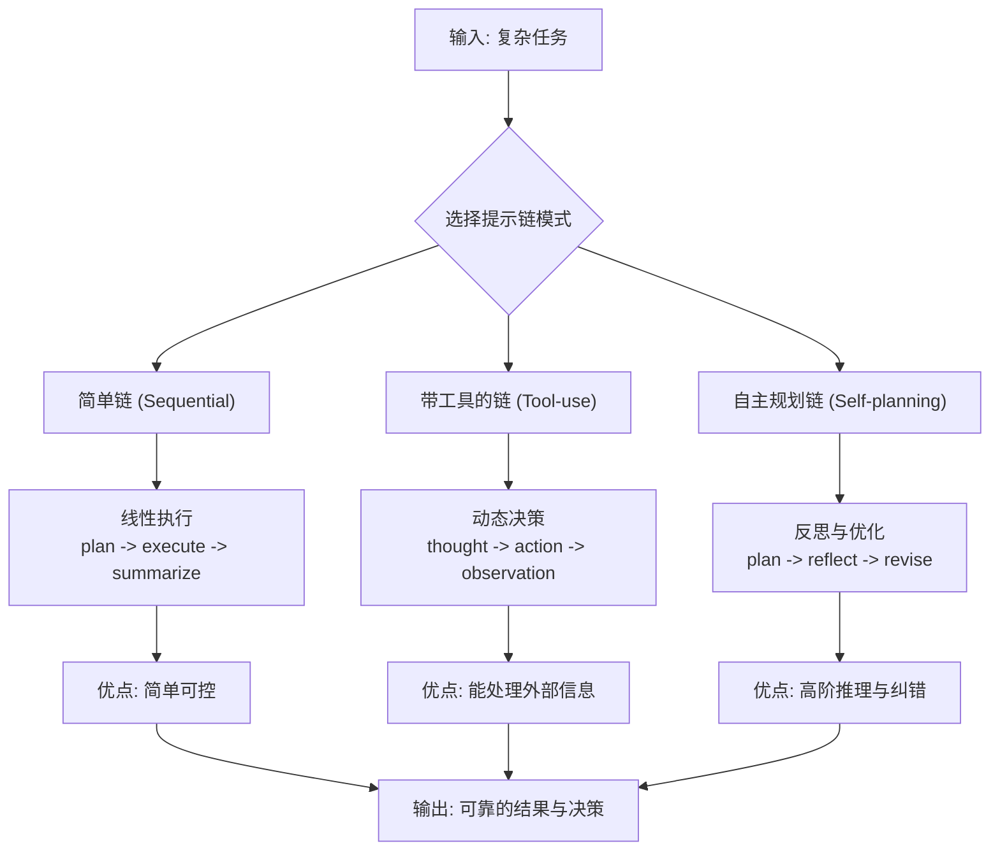

# 提示链

在 Agent 设计中，**提示链**是构建其“思维过程”的核心技术。它通过将复杂的推理任务分解为一系列连贯的提示步骤，引导大语言模型像人类一样逐步思考、调用工具并做出决策。

### 核心原理：为什么需要提示链？
传统的单次提示如同让模型“一步到位”给出答案，这在复杂任务中容易导致错误或肤浅的结果。提示链的原理在于**分治与引导**：
1.  **任务分解**：将复杂问题拆解为模型更容易处理的子步骤。
2.  **状态传递**：将上一步的输出（状态、思考或结果）作为下一步的输入，形成连贯的推理上下文。
3.  **可控性与可解释性**：每个步骤都可被观察、调试和优化，使Agent的行为更透明、更可靠。

下面，我将通过一个 **Agent 从规划到执行的完整示例**，展示提示链如何作为其“大脑”的推理骨架。这个示例模拟了一个技术顾问Agent，它需要解决一个多步骤的服务器问题。

```python
# 示例：一个基于提示链的“技术顾问”Agent
import os
from dotenv import load_dotenv
from langchain_openai import ChatOpenAI
from langchain_core.prompts import ChatPromptTemplate
from langchain_core.output_parsers import StrOutputParser, JsonOutputParser
from pydantic import BaseModel, Field
from typing import List, Optional

# 加载环境变量，假设你已配置了DeepSeek等API
load_dotenv()
llm = ChatOpenAI(model="deepseek-chat", temperature=0)

# ========== 第1步：规划链 - 定义思考步骤 ==========
class DiagnosisPlan(BaseModel):
    steps: List[str] = Field(description="诊断问题的有序步骤")

plan_parser = JsonOutputParser(pydantic_object=DiagnosisPlan)

planning_prompt = ChatPromptTemplate.from_messages([
    ("system", "你是一个资深系统运维专家。请将用户问题分解为具体的诊断步骤。"),
    ("human", "问题：{problem}\n请输出JSON格式的诊断计划。")
])

planning_chain = planning_prompt | llm | plan_parser

# ========== 第2步：执行链 - 模拟工具调用与判断 ==========
def simulate_tool_call(step: str) -> str:
    """模拟调用一个诊断工具（如检查日志、测试连接）"""
    tool_responses = {
        "检查服务状态": "nginx服务状态：active (running)",
        "检查错误日志": "日志发现错误：'connection refused to upstream server'",
        "测试数据库连接": "数据库连接成功，响应时间正常",
        "检查网络配置": "防火墙规则发现端口3306被意外屏蔽"
    }
    return tool_responses.get(step, f"已执行：{step}，未发现明显异常。")

# 用于分析每个工具返回结果的提示链
analysis_prompt = ChatPromptTemplate.from_template("""
你正在诊断服务器问题。
当前诊断步骤：{step}
工具执行结果：{observation}

请根据结果分析：
1. 发现了什么关键信息？
2. 是否需要调整后续步骤？如果需要，请建议下一个最应该执行的步骤。
3. 给出简短结论。
""")

analysis_chain = analysis_prompt | llm | StrOutputParser()

# ========== 第3步：整合为Agent执行循环 ==========
def run_agent(problem: str, max_steps: int = 5):
    """运行一个基于提示链的简单Agent"""
    print(f"🧠 用户问题：{problem}")
    print("-" * 40)
    
    # 步骤1：规划
    plan = planning_chain.invoke({"problem": problem})
    steps = plan.get("steps", [])[:max_steps]
    
    print("📋 生成的诊断计划：")
    for i, step in enumerate(steps, 1):
        print(f"  {i}. {step}")
    print("-" * 40)
    
    # 步骤2：按计划执行与推理
    for i, step in enumerate(steps, 1):
        print(f"🔧 步骤{i}: 执行 -> {step}")
        
        # 模拟工具调用
        observation = simulate_tool_call(step)
        print(f"   观察结果：{observation}")
        
        # 分析结果，决定下一步（这里简化了，实际可以动态修改plan）
        analysis = analysis_chain.invoke({"step": step, "observation": observation})
        print(f"   分析：{analysis}")
        
        # 此处可添加逻辑：根据分析结果决定继续、跳转或终止
        if "端口3306被意外屏蔽" in observation:
            print("⚠️  发现根本原因，提前终止诊断。")
            break
        print("-" * 40)
    
    print("✅ 诊断流程结束。")

# ========== 运行Agent ==========
if __name__ == "__main__":
    problem = "用户报告网站无法访问，后台显示数据库连接错误。"
    run_agent(problem)
```

### 关键技术解析与变体

以上基础Agent展示了提示链的核心流程。在实际中，根据任务的复杂度，主要有以下几种高级变体模式，它们通过更精巧的链式设计来提升Agent的推理能力：



下面我们具体看看如何实现后两种更强大的模式。

**1. 带工具调用的链（类似ReAct范式）**
这是构建实用Agent的关键，模型通过“思考 -> 行动 -> 观察”的循环与外界交互。
```python
# 一个极简的ReAct模式提示链实现框架
react_prompt = ChatPromptTemplate.from_messages([
    ("system", """你负责解决问题。在每一步，你必须输出一个JSON对象，严格包含以下两个字段：
    "thought": 你的思考，分析当前情况和下一步该做什么。
    "action": 要执行的动作。如果是查询信息，动作是 "search"。如果是计算，动作是 "calculate"。如果问题已解决，动作是 "finish"。
    """),
    ("human", "问题：{problem}\n历史记录：{history}\n当前状态：{state}")
])

def react_agent(problem):
    history = []
    state = "初始状态"
    for _ in range(5): # 限制循环次数
        # 1. 模型思考并决定动作
        response = llm.invoke(react_prompt.format_messages(
            problem=problem, history=history, state=state
        ))
        # ... 解析 response 中的 thought 和 action ...
        
        # 2. 执行动作（调用真实工具函数）
        if action == "search":
            observation = search_tool(query)
        elif action == "calculate":
            observation = calculator_tool(query)
        elif action == "finish":
            break
        
        # 3. 记录到历史，更新状态
        history.append(f"思考：{thought}， 行动：{action}， 观察：{observation}")
        state = observation
    return history
```

**2. 自主规划与反思链（Self-Reflection）**
让Agent能够评估自身计划或结果的质量，并进行调整，实现更高阶的推理。
```python
# 反思链示例：检查执行结果的完整性
reflection_prompt = ChatPromptTemplate.from_template("""
你刚刚执行了一个任务并得到了结果。
原始任务：{task}
执行结果：{result}

请严格评估：
1. 这个结果是否完全解决了任务？如果没有，缺失什么？
2. 结果的准确性或可靠性如何？
3. 是否需要以及如何改进？

你的评估：
""")

def reflective_agent(task):
    # 第一轮执行
    initial_result = basic_agent(task)
    
    # 反思评估
    reflection = llm.invoke(reflection_prompt.format_messages(
        task=task, result=initial_result
    ))
    
    # 如果评估认为需要改进，则进行第二轮优化执行
    if "不完整" in reflection or "改进" in reflection:
        refined_prompt = f"根据以下反馈优化之前的结果：{reflection}\n原始任务：{task}"
        final_result = basic_agent(refined_prompt)
        return final_result, reflection
    return initial_result, "结果已完整"
```

### 典型应用场景
1.  **复杂问题求解**：客服机器人诊断技术问题、法律顾问分析案例、医疗助理评估症状。
2.  **动态决策**：金融交易Agent（分析市场 -> 评估风险 -> 执行交易）、游戏NPC（感知环境 -> 制定策略 -> 行动）。
3.  **工作流自动化**：自动生成报告（收集数据 -> 分析 -> 撰写 -> 格式化）、代码开发助手（理解需求 -> 设计 -> 编码 -> 测试）。

### 核心优势与挑战
- **优势**：
  - **可靠性高**：将复杂任务标准化，减少模型“幻觉”。
  - **可解释性强**：每一步的输入输出都清晰可见，便于调试。
  - **灵活可扩展**：新的工具或步骤可以像乐高积木一样加入链中。

- **挑战**：
  - **延迟与成本**：多步调用意味着更多的API请求和更长的响应时间。
  - **错误累积**：链中任何一步出错都可能影响后续所有步骤。
  - **规划局限**：静态的链可能无法完美应对所有动态情况。

### 实用建议
1.  **从简单链开始**：先用2-3步的链验证核心流程，再逐步复杂化。
2.  **实施超时与重试**：在循环步骤中设置最大迭代次数，并为工具调用添加异常处理。
3.  **结构化输出是生命线**：始终坚持使用`JsonOutputParser`或Pydantic模型来解析模型的输出，这是链式传递可靠数据的前提。
4.  **将链作为测试单元**：为每个单独的提示链编写测试，确保其在不同输入下的稳定性。

提示链将Agent从“一个能聊天的模型”变成了“一个能执行结构化工作流的智能系统”。它是连接大语言模型的创造性思维与软件工程可靠性的桥梁。你可以从基础链开始，逐步引入工具调用和反思机制，构建出适合你特定场景的强大Agent。