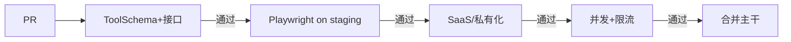

# Agent的自动化测试

**针对“Agent测试的自动化”这个特定场景**，给出更聚焦、更实战的落地方法，而不是泛泛地讲API/E2E/环境管理。下面我会从**Agent测试自动化的特殊性**出发，给出可执行的方案。

---

## Agent测试自动化的核心难点

传统自动化测试（API、UI）是**确定性**的：输入X，预期输出Y。  
而Agent测试是**概率性 + 状态性**的：
- 同样的输入，LLM可能生成不同但都正确的回答
- 多轮对话涉及状态变化
- 工具调用链路依赖外部系统

因此，自动化体系必须解决：**如何让机器判断“正确”** + **如何隔离不确定性**。

---

## 一、API测试：ToolSchema + 接口Schema的自动化

### 1.1 ToolSchema 自动化测试

**目标**：验证Agent能正确理解工具定义，生成符合Schema的工具调用参数。

| 测试类型         | 自动化实现方式                                               |
| ---------------- | ------------------------------------------------------------ |
| **参数类型校验** | 用Pydantic / JSON Schema生成随机合法参数，调用Agent的工具调用解析器，断言不抛异常 |
| **必填参数缺失** | 从Schema中删除必填参数，验证Agent返回明确的错误提示          |
| **额外参数**     | 传入未定义的参数，验证Agent忽略或拒绝                        |
| **边界值**       | 自动遍历Schema中每个字段的min/max/maxLength，生成边界值测试用例 |
| **枚举值**       | 自动生成枚举内/外的值，验证Agent行为                         |

**自动化框架示例（pytest + hypothesis）**：
```python
from hypothesis import given, strategies as st
import jsonschema

# 从工具Schema自动生成测试数据
@given(st.from_schema(tool_input_schema))
def test_tool_schema_accepts_valid_input(valid_params):
    # 模拟Agent调用工具
    response = agent.call_tool(tool_name, valid_params)
    assert response.status != "param_error"

# 故意生成非法参数
@given(st.one_of(st.integers(), st.text(), st.booleans()))
def test_tool_schema_rejects_invalid_type(param_value):
    invalid_params = {"order_id": param_value}  # 期望string却给了其他类型
    response = agent.call_tool("query_order", invalid_params)
    assert "invalid" in response.error.lower()
```

**CI集成**：每次工具定义变更，自动运行上述测试，失败则阻断合并。

### 1.2 接口Schema自动化（契约测试）

**目标**：保证Agent与下游工具/LLM网关的接口契约稳定。

- **OpenAPI规范校验**：使用 `schemathesis` 自动生成请求，验证响应是否符合OpenAPI定义。
- **错误码规范**：定义错误码枚举（如 `TOOL_TIMEOUT`, `PERMISSION_DENIED`），自动化测试断言所有错误响应使用规范格式。
- **版本兼容性**：使用 `Pact`（消费者驱动契约测试）——Agent作为消费者，工具提供者作为生产者。每次Agent变更时运行Pact验证，确保不会因假设过时而调用失败。

**示例（Pact）**：
```python
# 在Agent测试中定义契约
@pact.given("订单存在")
@pact.upon_receiving("查询订单请求")
@pact.with_request("get", "/orders/123")
@pact.will_respond_with(status=200, body={"id": "123", "status": "shipped"})
def test_agent_query_order():
    result = agent.query_order("123")
    assert result.status == "shipped"
```

---

## 二、E2E自动化：React管理台 + 编排器（Playwright）

Agent的管理台和编排器是**面向配置**的，E2E测试需要模拟真实用户操作，并验证后端Agent行为。

### 2.1 关键场景自动化

| 场景                    | Playwright实现要点                                           |
| ----------------------- | ------------------------------------------------------------ |
| **创建Agent并绑定工具** | `page.click('text=新建Agent')` → `page.fill('[name=name]', '测试助手')` → `page.check('li:has-text("查询订单")')` → `page.click('button:has-text("发布")')` → 等待API响应（`page.waitForResponse`） |
| **编排器拖拽连线**      | 使用 `page.dragAndDrop('.tool-node', '.canvas')`，然后 `page.click('.connect-button')`，验证连线出现（`expect(page.locator('.edge')).toBeVisible()`） |
| **测试对话窗口**        | 在编排器中点击“测试”，弹出聊天窗 → `page.fill('[aria-label="message input"]', '查订单123')` → `page.press('Enter')` → 等待工具调用可视化节点高亮 → 断言最终回答包含预期内容 |
| **保存与重新加载**      | 点击保存 → 刷新页面 → 验证之前配置的工具、prompt仍然存在     |

### 2.2 提高E2E稳定性的技巧

- **等待非确定性行为**：Agent响应时间不固定，使用 `expect.poll` 或 `waitForSelector` 配合超时重试。
- **Mock LLM/Tool**：使用 `page.route` 拦截Agent API的请求，返回固定的工具调用结果和最终回答，避免LLM波动。
  ```javascript
  await page.route('**/agent/chat', route => {
    route.fulfill({
      status: 200,
      body: JSON.stringify({ answer: "订单状态为已发货", tool_calls: [...] })
    });
  });
  ```
- **视觉回归**：对编排器画布截图，与基线对比（`expect(page).toHaveScreenshot()`），防止CSS意外改动。
- **并发运行**：Playwright分片运行（`--shard=x/y`），并行测试不同模块，减少总耗时。

### 2.3 CI集成

```yaml
# .github/workflows/e2e.yml
jobs:
  e2e:
    runs-on: ubuntu-latest
    steps:
      - uses: actions/checkout@v3
      - uses: microsoft/playwright@v1
      - run: npm run build && npm run start:test &
      - run: npx playwright test --shard=1/2
```

---

## 三、测试数据与环境管理（SaaS vs 私有化/离线）

### 3.1 通用测试数据管理

- **种子数据版本控制**：将SQL/CSV文件存在Git中，使用 `testcontainers` 启动数据库时自动灌入。
- **测试数据隔离**：每个测试用例使用独立的租户ID（如 `test_<uuid>`），测试结束执行清理Hook。
- **动态数据生成**：使用 `Faker` 生成符合业务规则的测试数据（订单号、用户名等），避免硬编码。

### 3.2 SaaS环境特别实践

| 挑战             | 自动化方案                                                   |
| ---------------- | ------------------------------------------------------------ |
| **多租户隔离**   | 测试脚本同时创建租户A和B，在A中创建资源，切换到B的Token调用查询，断言返回空或403 |
| **限流测试**     | 使用 `Locust` 脚本瞬间发送超过QPS限制的请求，断言返回429，且限流后自动恢复 |
| **生产流量回放** | 将脱敏后的生产请求保存为`*.har`或`*.jsonl`，在staging环境用 `replay` 工具重放，对比新旧版本响应差异 |

### 3.3 私有化/离线环境特别实践

| 挑战               | 自动化方案                                                   |
| ------------------ | ------------------------------------------------------------ |
| **离线安装包验证** | 用 `K3s` + 本地镜像仓库模拟客户环境，运行 `helm install` 或 `docker-compose up`，断言所有容器健康 |
| **无外网测试**     | 设置 `http_proxy=""` 和 `no_proxy="*"`，运行Agent，验证工具调用（如天气API）返回降级回答，且没有请求发往公网IP（用 `tcpdump` 校验） |
| **低资源限制**     | 使用 `docker run --memory=4g --cpus=2` 运行Agent服务，压测最大并发，验证不会OOM或频繁超时 |
| **离线模型切换**   | Mock `nvidia-smi` 返回0显存，验证Agent自动切换到CPU版小模型，且功能正常 |

### 3.4 环境配置即代码

使用单一配置文件管理不同环境的差异：

```yaml
# config/test-env.yaml
saas_staging:
  base_url: https://staging.example.com
  auth: { type: oauth, client_id: xxx }
  features: [rate_limiting, multi_tenant]
  cleanup: delete_test_tenants

private_offline_minimal:
  base_url: http://localhost:8080
  auth: { type: none }
  features: [offline_mode, small_model]
  resource_limits: { memory: 4GB, cpu: 2 }
  no_internet: true
```

测试脚本读取环境变量 `TEST_ENV`，动态切换配置。

---

## 四、整体自动化流水线建议



**关键指标**：
- API测试：< 1分钟
- E2E测试：< 5分钟（分片并行）
- 私有化环境启动：< 3分钟（使用预构建镜像缓存）

通过这套自动化体系，B端Agent可以在**每天数十次变更**的情况下，依然保持对SaaS和私有化交付的高置信度。