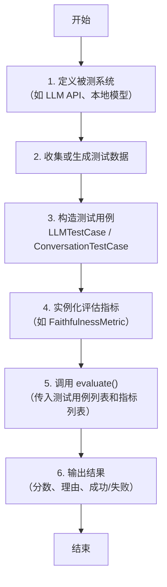

# Deepeval的脚本结构

## 不同评估指标的脚本构建过程：统一框架与差异点

是的，**所有评估指标的脚本构建过程遵循完全相同的基本模式**：准备测试数据 → 定义指标 → 调用 `evaluate()` 打分。区别仅在于**测试用例（`LLMTestCase`）中需要提供哪些字段**（例如是否需要 `expected_output` 或 `retrieval_context`）。

以下用一张流程图和对照表总结所有指标对应的脚本结构。

---

### 一、通用脚本结构流程图



> **核心统一性**：无论评估什么维度，代码中总是重复上述 6 个步骤。变化只在于第 3 步和第 4 步的具体参数。

---

### 二、不同指标所需的测试用例字段对比

| 指标类别           | 典型指标                 | `input`  | `actual_output` | `expected_output` | `retrieval_context` | 说明                               |
| :----------------- | :----------------------- | :------: | :-------------: | :---------------: | :-----------------: | :--------------------------------- |
| **基础正确性**     | `AnswerRelevancy`        |    ✅     |        ✅        |         ❌         |          ❌          | 只需问题和模型回答                 |
| **幻觉检测**       | `Faithfulness`           |    ❌     |        ✅        |         ❌         |          ✅          | 需要检索到的上下文                 |
| **检索质量**       | `ContextualRecall`       |    ✅     |        ❌        |         ✅         |          ✅          | 需要期望答案和检索上下文           |
| **端到端正确性**   | `GEval` (自定义)         |    ✅     |        ✅        |        ✅*         |          ❌          | 通常需要期望答案                   |
| **多轮对话**       | `ConversationRelevancy`  | ✅ (每轮) |    ✅ (每轮)     |         ❌         |          ❌          | 用 `ConversationTestCase` 包装多轮 |
| **智能体工具调用** | `ToolCorrectness`        |    ✅     |        ✅        |   ✅ (工具序列)    |          ❌          | 需要期望的工具调用记录             |
| **安全合规**       | `Toxicity`, `PIILeakage` |    ❌     |        ✅        |         ❌         |          ❌          | 只需模型输出                       |
| **多模态**         | `ImageCoherence`         | ✅ (文本) |   ✅ (图像URL)   |         ❌         |          ❌          | `actual_output` 为图像路径或URL    |

> ✅*: `GEval` 可以通过 `evaluation_params` 指定需要比较的字段，不强制要求 `expected_output`。

---

### 三、典型脚本示例（以 RAG 和对话为例）

#### 示例1：RAG 评估（需要 `retrieval_context`）
```python
from deepeval import evaluate
from deepeval.metrics import FaithfulnessMetric
from deepeval.test_case import LLMTestCase

test_case = LLMTestCase(
    input="什么是牛顿第一定律？",
    actual_output="牛顿第一定律是惯性定律，物体在不受外力时保持静止或匀速直线运动。",
    retrieval_context=["牛顿第一定律：任何物体都要保持匀速直线运动或静止状态，直到外力迫使它改变运动状态为止。"]
)
metric = FaithfulnessMetric(threshold=0.7)
evaluate([test_case], [metric])
```

#### 示例2：对话评估（多轮）
```python
from deepeval import evaluate
from deepeval.metrics import ConversationRelevancyMetric
from deepeval.test_case import ConversationTestCase, LLMTestCase

conversation = [
    LLMTestCase(input="我叫李明", actual_output="你好李明，有什么可以帮你？"),
    LLMTestCase(input="我的名字是什么？", actual_output="你的名字是李明。")
]
test_case = ConversationTestCase(messages=conversation)
metric = ConversationRelevancyMetric(threshold=0.6)
evaluate([test_case], [metric])
```

#### 示例3：智能体工具调用评估
```python
test_case = LLMTestCase(
    input="帮我查一下北京的天气",
    actual_output="[Tool: get_weather, params: {city: '北京'}] 今天晴天",
    expected_tool_calls=[{"name": "get_weather", "params": {"city": "北京"}}]  # 特殊字段
)
metric = ToolCorrectnessMetric()
```

---

### 四、总结：统一模板代码结构

```python
# 通用模板（适用于任何指标）
from deepeval import evaluate
from deepeval.test_case import LLMTestCase  # 或 ConversationTestCase
from deepeval.metrics import SomeMetric

# 1. 准备测试用例（字段根据指标要求填写）
test_case = LLMTestCase(
    input=...,
    actual_output=...,
    expected_output=...,      # 可选
    retrieval_context=...     # 可选
)

# 2. 实例化指标
metric = SomeMetric(threshold=0.5)

# 3. 运行评估
results = evaluate([test_case], [metric])
```

> **结论**：脚本构建过程高度统一，差异仅在于**测试用例的字段内容**。理解了这个模式，你可以轻松使用 DeepEval 中的任何指标。