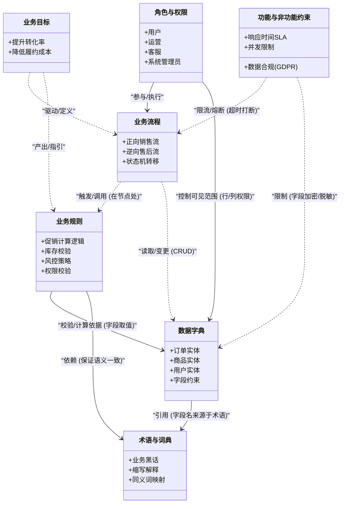

# 业务知识库规划

---

### 第一部分：知识库核心要素（6大维度）

| 维度                                         | 核心内容                                     | 具体示例（以“电商订单”为例）                                 |
| :------------------------------------------- | :------------------------------------------- | :----------------------------------------------------------- |
| **1. 术语与词典** *(是什么)*              | 专有名词、缩写、系统内特定含义。             | `OTD`（Order to Delivery，订单交付周期）；`RTO`（实时订单）；`拆单`（将父订单拆为子订单）。 |
| **2. 数据字典** *(用什么做)*              | 数据实体、字段属性、数据类型、长度、枚举值。 | 订单状态枚举：`0-待支付，1-已支付，2-已发货`；`OrderId` 生成规则（雪花算法）。 |
| **3. 业务流程** *(怎么流转)*              | 端到端的业务流程、状态机、工作流节点。       | 正向流程：下单→支付→风控校验→配货→发货→签收；逆向流程：退款/退货审批流。 |
| **4. 业务规则** *(什么能做/不能做)*       | 计算逻辑、校验逻辑、推理规则、权限控制。     | 优惠券叠加规则（不可与满减同享）；库存扣减规则（下单锁库 vs 支付锁库）；VIP免运费门槛（≥99元）。 |
| **5. 角色与权限** *(谁来做)*              | 岗位职责、操作范围、数据可见性。             | 客服可查看全量订单但无法修改金额；运营经理可配置促销活动。   |
| **6. 非功能约束与合规** *(做的多好/边界)* | 性能指标（SLA）、法律合规、安全策略。        | 接口响应 < 200ms；跨境订单需报关信息；敏感信息脱敏显示。     |

---

### 第二部分：他们之间的关系（Mermaid 元模型图）

下面这张图展示了这些要素之间的**核心依赖关系**。你可以直接把以下代码复制到支持 Mermaid 的编辑器（如 Notion、Obsidian、GitHub Markdown）中查看。

---

### 第三部分：深层逻辑关系（架构师的视角）

如果你要把这个知识库做得极深，除了上面的静态关系，还需要关注以下**动态联动关系**：

1.  **规则驱动流程（Rules govern Process）**：流程的每一个节点（如“发货”）通常挂载着多条规则（必须校验“是否黑名单”、“库存是否充足”）。**流程图必须能跳转到对应的规则卡片**。
2.  **数据承载术语（Data embodies Terms）**：系统里没有抽象的“订单状态”，只有数据库里的 `Order.Status` 字段。知识库必须建立**“业务术语 ↔ 技术字段”的映射表**，否则业务和技术会吵架。
3.  **约束裁剪范围（Constraints trim Scope）**：非功能性约束（如“仅支持微信支付”）会反过来**裁剪**业务流程（取消“支付宝支付”分支）和数据字典（删除 `alipay_id` 字段）。
4.  **权限作用于所有维度（RBAC across all）**：同一个业务流程，不同角色看到的界面按钮不同（客服看“退款”，运营看“推流”）。

---

### 第四部分：给你的落地建议（怎么建）

如果你现在要开始动手，建议不要一次性全填，而是按**“场景切片”**来组织：

- **第一步：先定“术语”和“数据”**（地基，统一语言）。
- **第二步：画“核心主流程”**（主干，比如登录、下单、支付）。
- **第三步：在流程的关键决策点上，挂载“业务规则”**（枝叶）。
- **第四步：最后补“角色权限”和“非功能约束”**（护栏）。

