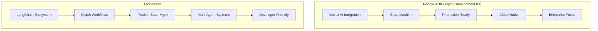

# Google ADK vs LangGraph 深度对比

## 一、架构设计与核心理念对比



## 二、完整对比分析：Google ADK vs LangGraph

### 2.1 基础架构对比

```python
"""
Google ADK 和 LangGraph 核心架构对比
"""

from typing import Dict, Any, List, Optional
from dataclasses import dataclass
from enum import Enum
import asyncio

@dataclass
class FrameworkComparison:
    """框架对比数据类"""
    name: str
    company: str
    release_year: int
    primary_language: str
    architecture_style: str
    state_management: str
    deployment_target: List[str]
    licensing: str
    learning_curve: str  # low, medium, high

# 框架对比数据
frameworks = {
    "google_adk": FrameworkComparison(
        name="Google Agent Development Kit",
        company="Google",
        release_year=2023,
        primary_language="Python",
        architecture_style="State Machine + REST APIs",
        state_management="Session-based, Server-side",
        deployment_target=["Google Cloud", "Vertex AI", "Cloud Run"],
        licensing="Apache 2.0",
        learning_curve="medium-high"
    ),
    "langgraph": FrameworkComparison(
        name="LangGraph",
        company="LangChain Inc",
        release_year=2024,
        primary_language="Python/TypeScript",
        architecture_style="Graph Workflow",
        state_management="In-memory, Checkpoint-based",
        deployment_target=["Anywhere", "Docker", "Cloud Functions"],
        licensing="MIT",
        learning_curve="medium"
    )
}

# 打印对比表格
def print_framework_comparison():
    """打印框架对比"""
    print("🔍 Google ADK vs LangGraph 架构对比")
    print("=" * 100)
    
    headers = ["特性", "Google ADK", "LangGraph"]
    rows = [
        ["开发公司", "Google", "LangChain Inc"],
        ["首次发布", "2023", "2024"],
        ["主要语言", "Python", "Python/TypeScript"],
        ["架构风格", "状态机 + REST API", "图工作流"],
        ["状态管理", "会话式，服务器端", "内存式，检查点"],
        ["部署目标", "Google Cloud为主", "任意环境"],
        ["许可证", "Apache 2.0", "MIT"],
        ["学习曲线", "中等-高（需Google云知识）", "中等"],
        ["生态系统", "Google Cloud服务", "LangChain生态"],
        ["企业特性", "内置监控、安全、缩放", "需额外配置"],
        ["成本模型", "按用量计费 + Google云服务", "开源 + 自托管"],
        ["社区规模", "快速增长，Google支持", "大型活跃社区"]
    ]
    
    # 打印表格
    print(f"{headers[0]:<20} | {headers[1]:<40} | {headers[2]:<40}")
    print("-" * 100)
    
    for row in rows:
        print(f"{row[0]:<20} | {row[1]:<40} | {row[2]:<40}")
    
    print("\n" + "=" * 100)

# 2.2 代码风格对比
class CodeComparison:
    """代码实现风格对比"""
    
    @staticmethod
    def google_adk_example():
        """Google ADK 代码风格示例"""
        google_adk_code = """
# Google ADK 典型代码结构
from google.cloud import aiplatform
from google.cloud.aiplatform import vertex_ai
from google.cloud.aiplatform.vertex_ai.preview import agent

# 1. 初始化ADK
agent_kit = agent.AgentKit(project="my-project", location="us-central1")

# 2. 定义状态处理器
class OrderState(agent.State):
    order_id: str
    customer_name: str
    items: List[str]
    status: str = "created"
    
    def to_dict(self) -> Dict[str, Any]:
        return {
            "order_id": self.order_id,
            "customer_name": self.customer_name,
            "items": self.items,
            "status": self.status
        }

# 3. 创建状态处理器
@agent.state_handler
def process_order(state: OrderState) -> OrderState:
    # 集成Google Cloud服务
    from google.cloud import pubsub_v1
    from google.cloud import storage
    
    # 调用Vertex AI模型
    model = vertex_ai.language_models.ChatModel.from_pretrained("chat-bison@001")
    response = model.predict(
        messages=[{"role": "user", "content": f"处理订单 {state.order_id}"}]
    )
    
    # 更新状态
    state.status = "processing"
    return state

# 4. 创建Agent
order_agent = agent_kit.create_agent(
    name="order_processor",
    state_schema=OrderState,
    handlers=[process_order],
    webhook_url="https://api.example.com/webhook"
)

# 5. 部署到Cloud Run
deployment = order_agent.deploy(
    service_name="order-agent-service",
    region="us-central1",
    machine_type="e2-medium"
)
        """
        return google_adk_code
    
    @staticmethod
    def langgraph_example():
        """LangGraph 代码风格示例"""
        langgraph_code = """
# LangGraph 典型代码结构
from typing import TypedDict, Annotated, List
from langgraph.graph import StateGraph, END
from langgraph.checkpoint import MemorySaver
from langchain_openai import ChatOpenAI
from langchain_core.messages import HumanMessage

# 1. 定义状态
class AgentState(TypedDict):
    messages: Annotated[List, add_messages]
    order_id: str
    status: str
    history: List[Dict[str, Any]]

# 2. 创建节点函数
async def process_order(state: AgentState) -> Dict[str, Any]:
    llm = ChatOpenAI(model="gpt-4")
    
    # 处理逻辑
    response = await llm.ainvoke([
        HumanMessage(content=f"处理订单 {state['order_id']}")
    ])
    
    return {
        "messages": [response],
        "status": "processing",
        "history": state.get("history", []) + [{"action": "processed", "time": datetime.now()}]
    }

# 3. 构建工作流图
workflow = StateGraph(AgentState)
workflow.add_node("process", process_order)
workflow.add_edge("process", END)

# 4. 添加检查点支持
checkpointer = MemorySaver()
app = workflow.compile(checkpointer=checkpointer)

# 5. 执行
initial_state = {
    "messages": [],
    "order_id": "ORD123",
    "status": "created",
    "history": []
}

result = await app.ainvoke(initial_state, config={"configurable": {"thread_id": "123"}})

# 6. 可以序列化/反序列化整个图
import pickle
serialized = pickle.dumps(app)
        """
        return langgraph_code
    
    @staticmethod
    def compare_code_patterns():
        """代码模式对比"""
        patterns = {
            "状态定义": {
                "google_adk": "类继承 + 数据类",
                "langgraph": "TypedDict + 注解"
            },
            "工作流定义": {
                "google_adk": "装饰器 + 状态处理器",
                "langgraph": "图节点 + 边"
            },
            "持久化": {
                "google_adk": "自动到Firestore/Datastore",
                "langgraph": "检查点 + 自定义存储"
            },
            "错误处理": {
                "google_adk": "内置重试 + 监控",
                "langgraph": "需手动实现"
            },
            "部署": {
                "google_adk": "一键部署到Cloud Run",
                "langgraph": "需要手动容器化"
            }
        }
        
        print("\n💻 代码模式对比：")
        print("=" * 80)
        print(f"{'特性':<15} | {'Google ADK':<30} | {'LangGraph':<30}")
        print("-" * 80)
        
        for feature, frameworks in patterns.items():
            print(f"{feature:<15} | {frameworks['google_adk']:<30} | {frameworks['langgraph']:<30}")

# 2.3 企业特性对比
class EnterpriseFeatures:
    """企业级特性对比"""
    
    @staticmethod
    def compare_enterprise_features():
        """对比企业级特性"""
        
        features = [
            {
                "category": "安全与合规",
                "features": [
                    ("IAM集成", "✅ 完整支持", "❌ 需手动集成"),
                    ("数据加密", "✅ 自动加密", "✅ 需配置"),
                    ("合规认证", "✅ SOC2, ISO27001", "❌ 无"),
                    ("审计日志", "✅ Cloud Audit Logs", "✅ 需自定义")
                ]
            },
            {
                "category": "监控与可观察性",
                "features": [
                    ("指标监控", "✅ Cloud Monitoring", "✅ 需配置Prometheus"),
                    ("分布式追踪", "✅ Cloud Trace", "✅ OpenTelemetry"),
                    ("日志管理", "✅ Cloud Logging", "✅ 需ELK/Grafana"),
                    ("性能分析", "✅ Profiler集成", "❌ 需手动")
                ]
            },
            {
                "category": "扩展性与可靠性",
                "features": [
                    ("自动扩缩容", "✅ Cloud Run自动缩放", "✅ 需K8s HPA"),
                    ("负载均衡", "✅ 全球负载均衡", "✅ 需Ingress配置"),
                    ("故障恢复", "✅ 多区域部署", "✅ 需手动配置"),
                    ("零停机部署", "✅ 蓝绿部署", "✅ 需CI/CD配置")
                ]
            },
            {
                "category": "集成能力",
                "features": [
                    ("数据库集成", "✅ Cloud SQL, Firestore", "✅ 任意数据库"),
                    ("消息队列", "✅ Pub/Sub", "✅ RabbitMQ/Kafka"),
                    ("API网关", "✅ Cloud API Gateway", "✅ 需API Gateway"),
                    ("CI/CD", "✅ Cloud Build", "✅ GitHub Actions/Jenkins")
                ]
            }
        ]
        
        print("\n🏢 企业级特性对比：")
        print("=" * 80)
        
        for category in features:
            print(f"\n📋 {category['category']}:")
            print("-" * 80)
            for feature, google, langgraph in category['features']:
                print(f"  • {feature:<20} | ADK: {google:<20} | LangGraph: {langgraph}")

# 2.4 性能与成本对比
class PerformanceCostComparison:
    """性能与成本对比"""
    
    @staticmethod
    def create_comparison_table():
        """创建性能成本对比表"""
        
        scenarios = [
            {
                "scenario": "小型项目 (1000请求/天)",
                "google_adk_cost": "$10-20/月",
                "langgraph_cost": "$5-10/月",
                "performance": "相当",
                "setup_time": {"google": "1-2小时", "langgraph": "2-3小时"}
            },
            {
                "scenario": "中型项目 (10万请求/天)",
                "google_adk_cost": "$200-500/月",
                "langgraph_cost": "$100-200/月",
                "performance": "Google ADK更优",
                "setup_time": {"google": "1天", "langgraph": "2-3天"}
            },
            {
                "scenario": "大型企业 (1000万请求/天)",
                "google_adk_cost": "$5000-10000/月",
                "langgraph_cost": "$2000-4000/月",
                "performance": "Google ADK显著更优",
                "setup_time": {"google": "1周", "langgraph": "2-3周"}
            },
            {
                "scenario": "尖峰负载处理",
                "google_adk_cost": "按使用量",
                "langgraph_cost": "需预配置容量",
                "performance": "Google ADK自动扩展",
                "setup_time": {"google": "自动", "langgraph": "需手动配置"}
            }
        ]
        
        print("\n⚡ 性能与成本对比：")
        print("=" * 100)
        print(f"{'场景':<30} | {'Google ADK成本':<20} | {'LangGraph成本':<20} | {'性能':<15} | {'设置时间'}")
        print("-" * 100)
        
        for scenario in scenarios:
            setup_time = f"ADK: {scenario['setup_time']['google']}, LangGraph: {scenario['setup_time']['langgraph']}"
            print(f"{scenario['scenario']:<30} | {scenario['google_adk_cost']:<20} | "
                  f"{scenario['langgraph_cost']:<20} | {scenario['performance']:<15} | {setup_time}")

# 三、实际项目选择指南

class ProjectSelectionGuide:
    """项目选择指南"""
    
    @staticmethod
    def select_framework(requirements: Dict[str, Any]) -> Dict[str, Any]:
        """根据项目需求选择框架"""
        
        scores = {
            "google_adk": 0,
            "langgraph": 0
        }
        
        criteria = {
            # 正向加分项
            "requires_google_cloud_integration": {"google_adk": 3, "langgraph": 0},
            "enterprise_security_compliance": {"google_adk": 3, "langgraph": 1},
            "automatic_scaling_needed": {"google_adk": 3, "langgraph": 1},
            "production_monitoring": {"google_adk": 3, "langgraph": 1},
            "multi_region_deployment": {"google_adk": 3, "langgraph": 1},
            "team_familiar_with_google_cloud": {"google_adk": 2, "langgraph": 0},
            
            # LangGraph优势项
            "needs_flexible_workflows": {"google_adk": 1, "langgraph": 3},
            "already_using_langchain": {"google_adk": 0, "langgraph": 3},
            "budget_constrained": {"google_adk": 0, "langgraph": 2},
            "multi_cloud_deployment": {"google_adk": 0, "langgraph": 3},
            "complex_state_management": {"google_adk": 1, "langgraph": 3},
            "rapid_prototyping": {"google_adk": 1, "langgraph": 2},
            
            # 中性或负向
            "vendor_lock_in_concern": {"google_adk": -2, "langgraph": 2},
            "custom_tooling_needed": {"google_adk": 1, "langgraph": 2},
            "legacy_system_integration": {"google_adk": 1, "langgraph": 2}
        }
        
        # 计算得分
        for req, weight in requirements.items():
            if req in criteria:
                if weight > 0:  # 正权重
                    scores["google_adk"] += criteria[req]["google_adk"] * weight
                    scores["langgraph"] += criteria[req]["langgraph"] * weight
                else:  # 负权重（反向）
                    scores["google_adk"] += criteria[req]["google_adk"] * abs(weight)
                    scores["langgraph"] += criteria[req]["langgraph"] * abs(weight)
        
        # 决定
        recommendation = "google_adk" if scores["google_adk"] > scores["langgraph"] else "langgraph"
        
        return {
            "recommendation": recommendation,
            "scores": scores,
            "confidence": abs(scores["google_adk"] - scores["langgraph"]) / max(sum(scores.values()), 1) * 100
        }
    
    @staticmethod
    def common_scenarios():
        """常见场景建议"""
        
        scenarios = [
            {
                "name": "初创公司MVP",
                "description": "快速验证想法，预算有限",
                "recommendation": "LangGraph",
                "reasons": ["成本低", "快速原型", "灵活性高"]
            },
            {
                "name": "企业数字化转型",
                "description": "大型企业，需要合规、安全、扩展性",
                "recommendation": "Google ADK",
                "reasons": ["企业级特性", "安全合规", "自动扩展"]
            },
            {
                "name": "AI研究项目",
                "description": "学术界或研究机构，需要实验灵活性",
                "recommendation": "LangGraph",
                "reasons": ["开源", "实验友好", "社区支持"]
            },
            {
                "name": "电商客服系统",
                "description": "高并发，需要24/7可用性",
                "recommendation": "Google ADK",
                "reasons": ["自动扩展", "全球部署", "监控告警"]
            },
            {
                "name": "多Agent复杂系统",
                "description": "需要复杂工作流和状态管理",
                "recommendation": "LangGraph",
                "reasons": ["图工作流", "灵活状态管理", "多Agent支持"]
            },
            {
                "name": "政府项目",
                "description": "严格的安全和合规要求",
                "recommendation": "Google ADK",
                "reasons": ["合规认证", "数据驻留", "审计跟踪"]
            }
        ]
        
        print("\n🎯 常见场景推荐：")
        print("=" * 80)
        
        for scenario in scenarios:
            print(f"\n📌 {scenario['name']}")
            print(f"   描述: {scenario['description']}")
            print(f"   推荐: {scenario['recommendation']}")
            print(f"   理由: {', '.join(scenario['reasons'])}")

# 四、混合架构示例

class HybridArchitectureExample:
    """混合架构示例：结合两者优势"""
    
    @staticmethod
    def create_hybrid_system():
        """创建混合系统架构"""
        
        hybrid_architecture = """
# 混合架构：Google ADK + LangGraph
        
架构设计：
┌─────────────────────────────────────────────────────────┐
│                   用户界面/API网关                        │
└───────────────────────────┬─────────────────────────────┘
                            │
                ┌───────────▼─────────────┐
                │    Google Cloud Load    │
                │       Balancer          │
                └───────────┬─────────────┘
                            │
        ┌───────────────────┼───────────────────┐
        │                   │                   │
┌───────▼──────┐   ┌───────▼──────┐   ┌───────▼──────┐
│  Google ADK  │   │  LangGraph   │   │  Google ADK  │
│  代理层       │   │  复杂工作流   │   │  批处理任务   │
└───────┬──────┘   └───────┬──────┘   └───────┬──────┘
        │                   │                   │
        └───────────────────┼───────────────────┘
                            │
                ┌───────────▼─────────────┐
                │   Google Cloud Services │
                │   (Firestore, Pub/Sub,  │
                │    Cloud Functions)     │
                └─────────────────────────┘

实现策略：
1. 使用Google ADK处理：
   - 用户会话管理
   - 简单的问答流程
   - 与企业系统集成
   - 监控和安全合规

2. 使用LangGraph处理：
   - 复杂多步骤工作流
   - 实验性AI功能
   - 需要灵活状态管理的任务
   - 快速原型开发

3. 通信机制：
   - 通过Pub/Sub消息队列通信
   - 共享Firestore数据库状态
   - 使用Cloud Functions作为粘合剂

4. 部署：
   - Google ADK部署到Cloud Run
   - LangGraph部署到GKE或Cloud Run
   - 统一通过API Gateway暴露

优势：
• 既有Google云的企业级特性
• 又有LangGraph的灵活性
• 成本优化：简单任务用ADK，复杂任务用LangGraph
• 技术风险分散：不锁定单一技术栈
        """
        
        return hybrid_architecture

# 五、迁移策略

class MigrationStrategies:
    """迁移策略"""
    
    @staticmethod
    def migration_guide():
        """迁移指南"""
        
        print("\n🔄 迁移策略：")
        print("=" * 80)
        
        # 从LangGraph迁移到Google ADK
        print("\n📤 从 LangGraph 迁移到 Google ADK：")
        print("  适合：项目需要生产级部署，企业级特性")
        print("  步骤：")
        print("  1. 分析现有工作流，识别状态机模式")
        print("  2. 将LangGraph节点映射到ADK状态处理器")
        print("  3. 替换LangChain工具为Google Cloud服务")
        print("  4. 实现数据迁移（状态、历史记录）")
        print("  5. 并行运行，逐步切换流量")
        print("  6. 关闭旧系统，完成迁移")
        
        # 从Google ADK迁移到LangGraph
        print("\n📥 从 Google ADK 迁移到 LangGraph：")
        print("  适合：需要更多灵活性，降低成本，多云部署")
        print("  步骤：")
        print("  1. 分析ADK状态处理器，识别工作流模式")
        print("  2. 创建对应的LangGraph节点")
        print("  3. 替换Google Cloud服务为开源替代")
        print("  4. 实现状态持久化层")
        print("  5. 创建混合部署，逐步迁移")
        print("  6. 配置监控和告警替代方案")
        
        # 并行运行策略
        print("\n⚡ 并行运行策略：")
        print("  " + "-" * 50)
        print("  阶段1: 新系统只读，验证功能")
        print("  阶段2: 双写系统，数据同步")
        print("  阶段3: 新系统处理部分流量")
        print("  阶段4: 逐步增加新系统流量比例")
        print("  阶段5: 完全切换到新系统")

# 六、未来发展趋势

class FutureTrends:
    """未来发展趋势分析"""
    
    @staticmethod
    def analyze_trends():
        """分析未来趋势"""
        
        trends = {
            "google_adk": [
                "更深度集成Gemini系列模型",
                "边缘计算支持（通过Anthos）",
                "无服务器函数集成优化",
                "更多的行业解决方案模板",
                "成本优化工具",
                "跨云支持（虽然可能性较小）"
            ],
            "langgraph": [
                "更好的可视化工具",
                "企业级部署模板",
                "性能优化和缓存改进",
                "更多的预构建工作流",
                "与其他框架的互操作性",
                "低代码/无代码界面"
            ],
            "行业趋势": [
                "多模态Agent成为标准",
                "Agent编排即服务兴起",
                "成本效益优化工具",
                "隐私保护增强",
                "实时协作Agent",
                "自主学习和优化"
            ]
        }
        
        print("\n🔮 未来发展趋势：")
        print("=" * 80)
        
        for category, items in trends.items():
            print(f"\n📈 {category.replace('_', ' ').title()}:")
            for item in items:
                print(f"  • {item}")

# 七、完整对比报告

def generate_complete_comparison():
    """生成完整对比报告"""
    
    print("🤖 Google ADK vs LangGraph 全面对比分析")
    print("=" * 100)
    
    # 1. 架构对比
    print_framework_comparison()
    
    # 2. 代码对比
    CodeComparison.compare_code_patterns()
    
    # 3. 企业特性
    EnterpriseFeatures.compare_enterprise_features()
    
    # 4. 性能成本
    PerformanceCostComparison.create_comparison_table()
    
    # 5. 场景推荐
    ProjectSelectionGuide.common_scenarios()
    
    # 6. 混合架构
    print("\n🔄 混合架构示例：")
    print("-" * 80)
    hybrid = HybridArchitectureExample.create_hybrid_system()
    print(hybrid)
    
    # 7. 迁移策略
    MigrationStrategies.migration_guide()
    
    # 8. 未来趋势
    FutureTrends.analyze_trends()
    
    # 9. 最终建议
    print("\n🎯 最终建议总结：")
    print("=" * 80)
    
    final_recommendations = [
        ("选择 Google ADK 如果:", [
            "• 你是Google Cloud重度用户",
            "• 需要企业级安全合规",
            "• 需要自动扩展和高可用性",
            "• 有预算使用托管服务",
            "• 需要生产级监控和告警"
        ]),
        ("选择 LangGraph 如果:", [
            "• 你已经使用LangChain生态系统",
            "• 需要最大的灵活性和控制权",
            "• 预算有限或需要成本控制",
            "• 需要多云或本地部署",
            "• 正在研究或原型阶段"
        ]),
        ("考虑混合架构 如果:", [
            "• 既有企业需求又有灵活需求",
            "• 正在从原型向生产迁移",
            "• 需要平衡成本和特性",
            "• 团队有混合技术栈经验",
            "• 项目有不同复杂度的组件"
        ])
    ]
    
    for title, items in final_recommendations:
        print(f"\n{title}")
        for item in items:
            print(f"  {item}")

# 八、示例：项目需求评估

def evaluate_project():
    """项目需求评估示例"""
    
    # 模拟项目需求
    project_requirements = {
        "project_name": "智能客服系统",
        "requirements": {
            "requires_google_cloud_integration": 2,  # 中度重要
            "enterprise_security_compliance": 3,      # 非常重要
            "automatic_scaling_needed": 3,           # 非常重要
            "production_monitoring": 2,              # 中度重要
            "needs_flexible_workflows": 1,           # 轻度重要
            "budget_constrained": 1,                 # 轻度重要
            "vendor_lock_in_concern": 0,             # 不重要
            "multi_cloud_deployment": 0,             # 不重要
            "team_familiar_with_google_cloud": 2,    # 中度重要
            "rapid_prototyping": 1                   # 轻度重要
        }
    }
    
    print("\n📋 项目需求评估示例：")
    print("=" * 80)
    print(f"项目名称: {project_requirements['project_name']}")
    print("\n需求分析:")
    
    for req, importance in project_requirements['requirements'].items():
        level = {3: "非常重要", 2: "中度重要", 1: "轻度重要", 0: "不重要"}
        print(f"  • {req}: {level.get(importance, '未知')}")
    
    # 执行评估
    result = ProjectSelectionGuide.select_framework(project_requirements['requirements'])
    
    print(f"\n🎯 推荐框架: {result['recommendation'].upper()}")
    print(f"  置信度: {result['confidence']:.1f}%")
    print(f"  得分: Google ADK={result['scores']['google_adk']}, "
          f"LangGraph={result['scores']['langgraph']}")

# 九、运行完整分析

if __name__ == "__main__":
    # 生成完整对比报告
    generate_complete_comparison()
    
    print("\n" + "=" * 100)
    print("🧪 项目评估示例")
    print("=" * 100)
    
    # 运行项目评估
    evaluate_project()
    
    print("\n" + "=" * 100)
    print("✅ 对比分析完成！")
    print("\n💡 关键总结:")
    print("""
    1. Google ADK: 企业级、云原生、生产就绪，但锁定Google Cloud
    2. LangGraph: 灵活、开源、生态丰富，但需要更多运维工作
    3. 选择取决于：项目阶段、团队技能、预算、合规要求
    4. 混合架构可以结合两者优势
    """)

# 十、总结表格

"""
Google ADK vs LangGraph 终极对比表
===============================================================================
| 维度             | Google ADK                            | LangGraph          |
|-----------------|----------------------------------------|-------------------|
| 公司背景         | Google                                | LangChain Inc     |
| 发布时间         | 2023                                  | 2024              |
| 许可证           | Apache 2.0                            | MIT               |
| 核心架构         | 状态机 + REST API                      | 图工作流          |
| 状态管理         | 会话式、服务器端                       | 内存式、检查点     |
| 部署目标         | Google Cloud为主                       | 任意环境          |
| 企业特性         | ✅ 完整的企业级支持                    | ⚠️ 需额外配置      |
| 成本模型         | 按使用量计费 + Google云服务            | 开源 + 自托管     |
| 学习曲线         | 中等-高                               | 中等              |
| 社区规模         | 快速增长，Google支持                  | 大型活跃社区      |
| 监控可观察性     | ✅ Cloud Monitoring集成               | ⚠️ 需自定义集成   |
| 安全合规         | ✅ 企业级安全合规认证                  | ⚠️ 需手动实现     |
| 自动扩展         | ✅ Cloud Run自动缩放                  | ⚠️ 需K8s HPA配置 |
| 多区域部署       | ✅ 全球负载均衡                       | ⚠️ 需复杂配置     |
| 故障恢复         | ✅ 多区域自动故障转移                  | ⚠️ 需手动配置     |
| 集成生态         | Google Cloud服务                      | LangChain生态     |
| 灵活性           | ⚠️ 相对固定                          | ✅ 非常高         |
| 供应商锁定       | ⚠️ 强锁定到Google Cloud               | ✅ 无锁定         |
| 原型开发速度     | ⚠️ 中等                               | ✅ 快速           |
| 生产就绪度       | ✅ 非常高                             | ⚠️ 中等           |
===============================================================================

选择建议：
• 企业级生产系统 → Google ADK
• 研究/原型/初创 → LangGraph  
• 混合复杂系统 → 混合架构
• 成本敏感项目 → LangGraph
• 合规要求严格 → Google ADK
• 需要多云部署 → LangGraph
"""

# 最后提示
print("\n" + "=" * 100)
print("📢 重要提示：")
print("""
1. 两个框架都在快速发展，特性可能很快变化
2. 评估时考虑团队的技能和偏好
3. 考虑长期维护成本和技术债务
4. 建议先做概念验证（PoC）再决定
5. 混合架构可以降低风险
""")
print("=" * 100)