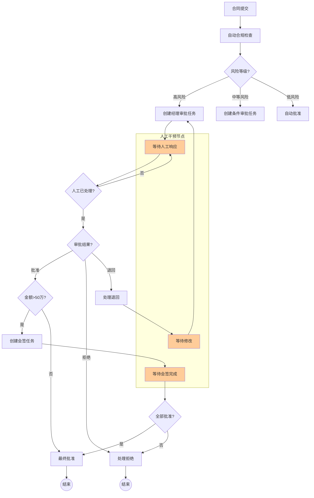

# LangGraph人工干预节点系统

我将构建一个**智能合同审批系统**，展示LangGraph中人工干预节点的完整功能，包括**审批流程、多级审核、会签、或签、自动/人工混合流程**等企业级功能。

## 🚀 完整实现代码

```python
from typing import TypedDict, List, Dict, Any, Optional, Literal, Annotated
from langgraph.graph import StateGraph, END, START
from langgraph.checkpoint.sqlite import SqliteSaver
from datetime import datetime, timedelta
import json
import asyncio
import uuid
from enum import Enum
from dataclasses import dataclass, asdict, field
import threading
import time

# ===================== 1. 数据模型与状态定义 =====================
class ApprovalStatus(Enum):
    """审批状态枚举"""
    PENDING = "pending"       # 等待审批
    APPROVED = "approved"     # 已批准
    REJECTED = "rejected"     # 已拒绝
    RETURNED = "returned"     # 已退回
    CANCELLED = "cancelled"   # 已取消

class InterventionType(Enum):
    """人工干预类型"""
    APPROVAL = "approval"          # 审批
    REVIEW = "review"              # 评审
    CONFIRMATION = "confirmation"  # 确认
    INPUT = "input"                # 输入
    VERIFICATION = "verification"  # 验证

@dataclass
class HumanInterventionTask:
    """人工干预任务"""
    task_id: str
    intervention_type: InterventionType
    assignee: str  # 处理人
    title: str
    description: str
    required: bool = True  # 是否必须处理
    timeout_hours: int = 24  # 超时时间（小时）
    created_at: datetime = field(default_factory=datetime.now)
    completed_at: Optional[datetime] = None
    status: ApprovalStatus = ApprovalStatus.PENDING
    user_input: Optional[Dict[str, Any]] = None
    comments: List[str] = field(default_factory=list)
    
    def is_expired(self) -> bool:
        if self.completed_at:
            return False
        expiry_time = self.created_at + timedelta(hours=self.timeout_hours)
        return datetime.now() > expiry_time

class ContractState(TypedDict):
    """合同审批状态"""
    # 合同信息
    contract_id: str
    contract_name: str
    contract_type: str
    amount: float
    department: str
    applicant: str
    
    # 审批流程
    current_step: str
    workflow_stage: str
    approval_path: List[str]
    
    # 人工干预任务
    pending_interventions: List[HumanInterventionTask]
    completed_interventions: List[HumanInterventionTask]
    current_intervention_id: Optional[str]
    
    # 审批结果
    approvals: Dict[str, ApprovalStatus]  # 审批人 -> 状态
    approval_chain: List[Dict[str, Any]]  # 审批链历史
    overall_status: ApprovalStatus
    
    # 元数据
    created_at: str
    updated_at: str
    deadline: str
    
    # 自动处理结果
    auto_check_results: Dict[str, bool]
    risk_level: Literal["low", "medium", "high"]
    
    # 流程控制
    waiting_for_human: bool
    human_input_required: bool
    pause_reason: Optional[str]

# ===================== 2. 人工干预管理器 =====================
class HumanInterventionManager:
    """人工干预管理器 - 负责任务分配、跟踪和恢复"""
    
    def __init__(self):
        self.active_tasks = {}  # task_id -> HumanInterventionTask
        self.task_queue = asyncio.Queue()
        self.task_callbacks = {}  # task_id -> callback function
        self.lock = threading.Lock()
        
        # 模拟用户数据库
        self.users = {
            "manager_zhang": {"name": "张经理", "role": "部门经理", "level": 2},
            "director_li": {"name": "李总监", "role": "部门总监", "level": 3},
            "vp_wang": {"name": "王副总裁", "role": "副总裁", "level": 4},
            "finance_zhao": {"name": "赵会计", "role": "财务专员", "level": 1},
            "legal_qian": {"name": "钱法务", "role": "法务专员", "level": 1}
        }
        
        # 启动任务监控器
        self.monitor_thread = threading.Thread(target=self._monitor_tasks, daemon=True)
        self.monitor_thread.start()
        
        print("✅ 人工干预管理器已启动")
    
    def create_intervention_task(
        self,
        intervention_type: InterventionType,
        assignee: str,
        title: str,
        description: str,
        required: bool = True,
        timeout_hours: int = 24,
        metadata: Optional[Dict] = None
    ) -> HumanInterventionTask:
        """创建人工干预任务"""
        task_id = f"TASK-{uuid.uuid4().hex[:8].upper()}"
        
        task = HumanInterventionTask(
            task_id=task_id,
            intervention_type=intervention_type,
            assignee=assignee,
            title=title,
            description=description,
            required=required,
            timeout_hours=timeout_hours,
            status=ApprovalStatus.PENDING
        )
        
        with self.lock:
            self.active_tasks[task_id] = task
        
        print(f"📋 创建人工干预任务: {task_id}")
        print(f"   类型: {intervention_type.value}")
        print(f"   处理人: {self.users.get(assignee, {}).get('name', assignee)}")
        print(f"   标题: {title}")
        print(f"   截止: {task.created_at + timedelta(hours=timeout_hours)}")
        
        # 发送通知（模拟）
        self._send_notification(task)
        
        return task
    
    def _send_notification(self, task: HumanInterventionTask):
        """发送任务通知（模拟）"""
        user_info = self.users.get(task.assignee, {})
        user_name = user_info.get("name", task.assignee)
        
        notification = f"""
        🔔 新审批任务通知 🔔
        
        任务ID: {task.task_id}
        标题: {task.title}
        描述: {task.description}
        处理人: {user_name}
        截止时间: {task.created_at + timedelta(hours=task.timeout_hours)}
        任务类型: {task.intervention_type.value}
        
        请及时处理！
        """
        
        print(notification)
        
        # 在实际系统中，这里会发送邮件、钉钉、企业微信等通知
        # self._send_email(task.assignee, notification)
        # self._send_dingtalk(task.assignee, notification)
    
    def submit_human_response(
        self, 
        task_id: str, 
        user_input: Dict[str, Any],
        comments: List[str] = None
    ) -> bool:
        """提交人工处理结果"""
        with self.lock:
            if task_id not in self.active_tasks:
                print(f"❌ 任务 {task_id} 不存在")
                return False
            
            task = self.active_tasks[task_id]
            
            if task.status != ApprovalStatus.PENDING:
                print(f"❌ 任务 {task_id} 已处理，状态: {task.status.value}")
                return False
            
            # 更新任务状态
            task.user_input = user_input
            task.comments = comments or []
            task.completed_at = datetime.now()
            
            # 根据输入决定状态
            decision = user_input.get("decision", "").lower()
            if decision == "approve":
                task.status = ApprovalStatus.APPROVED
            elif decision == "reject":
                task.status = ApprovalStatus.REJECTED
            elif decision == "return":
                task.status = ApprovalStatus.RETURNED
            else:
                task.status = ApprovalStatus.PENDING
            
            print(f"✅ 任务 {task_id} 已处理")
            print(f"   处理结果: {task.status.value}")
            print(f"   处理时间: {task.completed_at}")
            print(f"   用户输入: {user_input}")
            
            # 触发回调
            if task_id in self.task_callbacks:
                callback = self.task_callbacks[task_id]
                try:
                    callback(task)
                except Exception as e:
                    print(f"⚠️ 回调执行失败: {e}")
            
            # 移动到已完成（在实际系统中可能移动到历史记录）
            del self.active_tasks[task_id]
            
            return True
    
    def wait_for_human_response(self, task_id: str, timeout_seconds: int = 30) -> Optional[HumanInterventionTask]:
        """等待人工响应（模拟阻塞等待）"""
        print(f"⏳ 等待人工响应 - 任务ID: {task_id}")
        print("   流程在此暂停，等待人工处理...")
        
        start_time = time.time()
        
        # 模拟等待人工处理
        while time.time() - start_time < timeout_seconds:
            with self.lock:
                task = self.active_tasks.get(task_id)
                if task and task.completed_at:
                    return task
            
            # 检查任务是否超时
            with self.lock:
                task = self.active_tasks.get(task_id)
                if task and task.is_expired():
                    print(f"⏰ 任务 {task_id} 已超时")
                    task.status = ApprovalStatus.REJECTED  # 超时默认拒绝
                    task.comments = ["处理超时，自动拒绝"]
                    return task
            
            time.sleep(1)  # 每秒检查一次
        
        print(f"⏰ 等待超时 - 任务ID: {task_id}")
        return None
    
    def _monitor_tasks(self):
        """监控任务状态（后台线程）"""
        while True:
            time.sleep(60)  # 每分钟检查一次
            
            with self.lock:
                expired_tasks = []
                for task_id, task in self.active_tasks.items():
                    if task.is_expired() and task.status == ApprovalStatus.PENDING:
                        print(f"⏰ 任务 {task_id} 已超时，自动拒绝")
                        task.status = ApprovalStatus.REJECTED
                        task.comments = ["处理超时，系统自动拒绝"]
                        expired_tasks.append(task_id)
                
                for task_id in expired_tasks:
                    del self.active_tasks[task_id]

# ===================== 3. 人工干预节点实现 =====================
class HumanInterventionNodes:
    """人工干预节点集合"""
    
    def __init__(self, intervention_manager: HumanInterventionManager):
        self.manager = intervention_manager
        self.node_counter = 0
    
    def _log_node(self, node_name: str, state: ContractState):
        """记录节点执行日志"""
        self.node_counter += 1
        print(f"\n{'='*60}")
        print(f"节点 {self.node_counter}: {node_name}")
        print(f"合同: {state['contract_name']} ({state['contract_id']})")
        print(f"当前阶段: {state['workflow_stage']}")
        print(f"{'='*60}")
    
    def initialize_contract(self, state: ContractState) -> ContractState:
        """节点1：初始化合同"""
        self._log_node("合同初始化", state)
        
        # 设置初始状态
        state["workflow_stage"] = "initial_review"
        state["current_step"] = "auto_compliance_check"
        state["approval_path"] = ["auto_check", "manager_approval", "finance_review"]
        state["pending_interventions"] = []
        state["completed_interventions"] = []
        state["approvals"] = {}
        state["approval_chain"] = []
        state["overall_status"] = ApprovalStatus.PENDING
        state["auto_check_results"] = {}
        state["risk_level"] = "low"
        state["waiting_for_human"] = False
        state["human_input_required"] = False
        
        state["created_at"] = datetime.now().isoformat()
        state["updated_at"] = datetime.now().isoformat()
        
        # 设置截止时间（7天后）
        deadline = datetime.now() + timedelta(days=7)
        state["deadline"] = deadline.isoformat()
        
        print(f"合同初始化完成")
        print(f"审批路径: {' → '.join(state['approval_path'])}")
        print(f"截止时间: {deadline}")
        
        return state
    
    def auto_compliance_check(self, state: ContractState) -> ContractState:
        """节点2：自动合规检查"""
        self._log_node("自动合规检查", state)
        
        # 模拟自动检查
        checks = {
            "amount_within_limit": state["amount"] <= 1000000,  # 金额不超过100万
            "department_authorized": state["department"] in ["销售部", "技术部", "市场部"],
            "contract_type_valid": state["contract_type"] in ["采购", "服务", "合作"],
            "applicant_authorized": len(state["applicant"]) > 0
        }
        
        state["auto_check_results"] = checks
        
        # 计算风险等级
        passed_checks = sum(checks.values())
        total_checks = len(checks)
        
        if passed_checks == total_checks:
            state["risk_level"] = "low"
        elif passed_checks >= total_checks * 0.7:
            state["risk_level"] = "medium"
        else:
            state["risk_level"] = "high"
        
        print(f"合规检查结果:")
        for check_name, passed in checks.items():
            status = "✅" if passed else "❌"
            print(f"  {status} {check_name}: {'通过' if passed else '失败'}")
        
        print(f"风险等级: {state['risk_level']}")
        
        # 根据风险等级决定下一步
        if state["risk_level"] == "high":
            state["current_step"] = "manager_intervention"  # 高风险需要人工干预
            state["human_input_required"] = True
        else:
            state["current_step"] = "risk_assessment"
        
        return state
    
    def create_manager_approval_task(self, state: ContractState) -> ContractState:
        """节点3：创建经理审批任务"""
        self._log_node("创建经理审批任务", state)
        
        # 确定审批人
        approver = "manager_zhang"  # 默认张经理
        
        # 创建人工干预任务
        task = self.manager.create_intervention_task(
            intervention_type=InterventionType.APPROVAL,
            assignee=approver,
            title=f"合同审批: {state['contract_name']}",
            description=f"""
            合同ID: {state['contract_id']}
            合同名称: {state['contract_name']}
            合同类型: {state['contract_type']}
            金额: ¥{state['amount']:,.2f}
            申请部门: {state['department']}
            申请人: {state['applicant']}
            风险等级: {state['risk_level']}
            
            请审批此合同，选择以下操作：
            1. 批准 - 进入下一审批环节
            2. 拒绝 - 终止合同流程
            3. 退回 - 退回给申请人修改
            """,
            required=True,
            timeout_hours=48  # 48小时超时
        )
        
        # 更新状态
        state["pending_interventions"].append(task)
        state["current_intervention_id"] = task.task_id
        state["waiting_for_human"] = True
        state["current_step"] = "awaiting_manager_approval"
        state["workflow_stage"] = "manager_approval"
        
        print(f"已创建经理审批任务: {task.task_id}")
        print(f"审批人: {self.manager.users[approver]['name']}")
        print(f"流程暂停，等待人工处理...")
        
        return state
    
    def await_human_response(self, state: ContractState) -> ContractState:
        """节点4：等待人工响应"""
        self._log_node("等待人工响应", state)
        
        task_id = state["current_intervention_id"]
        if not task_id:
            print("⚠️ 没有当前干预任务ID，跳过等待")
            state["waiting_for_human"] = False
            return state
        
        # 等待人工响应
        task = self.manager.wait_for_human_response(task_id, timeout_seconds=10)
        
        if task:
            # 任务已完成，更新状态
            state["pending_interventions"] = [
                t for t in state["pending_interventions"]
                if t.task_id != task_id
            ]
            state["completed_interventions"].append(task)
            
            # 记录审批结果
            approver_name = self.manager.users.get(task.assignee, {}).get("name", task.assignee)
            state["approvals"][approver_name] = task.status
            
            state["approval_chain"].append({
                "task_id": task.task_id,
                "approver": approver_name,
                "decision": task.status.value,
                "comments": task.comments,
                "completed_at": task.completed_at.isoformat() if task.completed_at else None,
                "user_input": task.user_input
            })
            
            state["current_intervention_id"] = None
            state["waiting_for_human"] = False
            
            print(f"人工响应已收到")
            print(f"处理人: {approver_name}")
            print(f"决策: {task.status.value}")
            print(f"意见: {task.comments}")
            
            # 根据决策设置下一步
            if task.status == ApprovalStatus.APPROVED:
                state["current_step"] = "check_approval_chain"
            elif task.status == ApprovalStatus.REJECTED:
                state["current_step"] = "handle_rejection"
            elif task.status == ApprovalStatus.RETURNED:
                state["current_step"] = "handle_return"
            else:
                state["current_step"] = "error_handling"
        else:
            # 任务未完成或超时
            print("⏳ 人工响应未完成，继续保持等待状态")
            state["waiting_for_human"] = True
        
        return state
    
    def create_parallel_approval_tasks(self, state: ContractState) -> ContractState:
        """节点5：创建并行审批任务（会签）"""
        self._log_node("创建并行审批任务（会签）", state)
        
        # 需要会签的审批人
        approvers = ["finance_zhao", "legal_qian"]  # 财务和法务并行审批
        
        print(f"创建并行审批任务（会签）:")
        print(f"审批人: {', '.join([self.manager.users[a]['name'] for a in approvers])}")
        
        # 为每个审批人创建任务
        tasks = []
        for approver in approvers:
            task = self.manager.create_intervention_task(
                intervention_type=InterventionType.REVIEW,
                assignee=approver,
                title=f"合同会签审批: {state['contract_name']}",
                description=f"""
                合同ID: {state['contract_id']}
                合同名称: {state['contract_name']}
                合同类型: {state['contract_type']}
                金额: ¥{state['amount']:,.2f}
                
                请从您的专业角度（财务/法务）进行审批。
                所有会签审批人必须全部同意才能进入下一环节。
                """,
                required=True,
                timeout_hours=72
            )
            tasks.append(task)
        
        # 更新状态
        state["pending_interventions"].extend(tasks)
        state["workflow_stage"] = "parallel_approval"
        state["current_step"] = "awaiting_parallel_approval"
        state["waiting_for_human"] = True
        
        print(f"已创建 {len(tasks)} 个并行审批任务")
        print(f"流程暂停，等待所有会签审批人处理...")
        
        return state
    
    def check_parallel_approval_status(self, state: ContractState) -> ContractState:
        """节点6：检查并行审批状态"""
        self._log_node("检查并行审批状态", state)
        
        pending_tasks = state["pending_interventions"]
        completed_tasks = state["completed_interventions"]
        
        print(f"待处理任务: {len(pending_tasks)}")
        print(f"已完成任务: {len(completed_tasks)}")
        
        # 检查所有并行任务是否完成
        all_completed = all(
            any(t.task_id == pending.task_id for t in completed_tasks)
            for pending in pending_tasks
            if pending.created_at > datetime.now() - timedelta(hours=1)  # 最近1小时创建的任务
        )
        
        if all_completed:
            print("✅ 所有并行审批任务已完成")
            
            # 检查审批结果
            approvals = {}
            for task in completed_tasks:
                if task.assignee in ["finance_zhao", "legal_qian"]:
                    approver_name = self.manager.users.get(task.assignee, {}).get("name", task.assignee)
                    approvals[approver_name] = task.status
            
            # 判断是否全部批准
            all_approved = all(status == ApprovalStatus.APPROVED for status in approvals.values())
            
            if all_approved:
                print("✅ 所有会签审批人已批准")
                state["current_step"] = "director_approval"
            else:
                print("❌ 会签未通过")
                rejected_approvers = [name for name, status in approvals.items() 
                                     if status != ApprovalStatus.APPROVED]
                print(f"拒绝的审批人: {', '.join(rejected_approvers)}")
                state["current_step"] = "handle_rejection"
            
            state["waiting_for_human"] = False
        else:
            print("⏳ 还有未完成的并行审批任务")
            state["waiting_for_human"] = True
            state["current_step"] = "awaiting_parallel_approval"  # 保持当前步骤
        
        return state
    
    def create_conditional_approval_task(self, state: ContractState) -> ContractState:
        """节点7：创建条件审批任务（或签）"""
        self._log_node("创建条件审批任务（或签）", state)
        
        # 根据金额决定审批路径
        amount = state["amount"]
        
        if amount <= 50000:
            # 5万以下只需要经理审批
            approvers = ["manager_zhang"]
            condition = "金额≤5万，仅需经理审批"
        elif amount <= 200000:
            # 5-20万需要总监审批
            approvers = ["director_li"]
            condition = "5万<金额≤20万，需要总监审批"
        else:
            # 20万以上需要副总裁审批
            approvers = ["vp_wang"]
            condition = "金额>20万，需要副总裁审批"
        
        print(f"条件审批: {condition}")
        print(f"审批人: {', '.join([self.manager.users[a]['name'] for a in approvers])}")
        
        # 创建审批任务
        task = self.manager.create_intervention_task(
            intervention_type=InterventionType.APPROVAL,
            assignee=approvers[0],  # 或签只需要一个人
            title=f"合同条件审批: {state['contract_name']}",
            description=f"""
            合同ID: {state['contract_id']}
            合同名称: {state['contract_name']}
            合同类型: {state['contract_type']}
            金额: ¥{state['amount']:,.2f}
            
            {condition}
            
            请审批此合同。
            """,
            required=True,
            timeout_hours=24
        )
        
        # 更新状态
        state["pending_interventions"].append(task)
        state["current_intervention_id"] = task.task_id
        state["workflow_stage"] = "conditional_approval"
        state["current_step"] = "awaiting_conditional_approval"
        state["waiting_for_human"] = True
        
        return state
    
    def handle_rejection(self, state: ContractState) -> ContractState:
        """节点8：处理拒绝情况"""
        self._log_node("处理拒绝", state)
        
        state["overall_status"] = ApprovalStatus.REJECTED
        state["workflow_stage"] = "rejected"
        state["current_step"] = "notify_applicant"
        
        # 获取拒绝原因
        latest_approval = state["approval_chain"][-1] if state["approval_chain"] else {}
        rejection_comments = latest_approval.get("comments", ["无具体原因"])
        
        print(f"合同被拒绝")
        print(f"拒绝原因: {rejection_comments}")
        print(f"审批链历史: {len(state['approval_chain'])} 条记录")
        
        # 创建通知任务
        task = self.manager.create_intervention_task(
            intervention_type=InterventionType.NOTIFICATION,
            assignee=state["applicant"],  # 通知申请人
            title=f"合同审批结果通知: {state['contract_name']}",
            description=f"""
            您的合同申请已被拒绝。
            
            合同信息:
            - ID: {state['contract_id']}
            - 名称: {state['contract_name']}
            - 金额: ¥{state['amount']:,.2f}
            
            拒绝原因: {rejection_comments}
            
            如有疑问，请联系相关审批人。
            """,
            required=False,
            timeout_hours=168  # 7天
        )
        
        return state
    
    def handle_return(self, state: ContractState) -> ContractState:
        """节点9：处理退回情况"""
        self._log_node("处理退回", state)
        
        state["workflow_stage"] = "returned_for_revision"
        state["current_step"] = "wait_for_revision"
        
        # 获取退回意见
        latest_approval = state["approval_chain"][-1] if state["approval_chain"] else {}
        return_comments = latest_approval.get("comments", ["请修改"])
        
        print(f"合同被退回修改")
        print(f"修改意见: {return_comments}")
        
        # 创建修改任务
        task = self.manager.create_intervention_task(
            intervention_type=InterventionType.INPUT,
            assignee=state["applicant"],  # 申请人修改
            title=f"合同修改要求: {state['contract_name']}",
            description=f"""
            您的合同申请需要修改。
            
            修改意见: {return_comments}
            
            请根据意见修改合同，然后重新提交。
            """,
            required=True,
            timeout_hours=72  # 3天
        )
        
        state["pending_interventions"].append(task)
        state["current_intervention_id"] = task.task_id
        state["waiting_for_human"] = True
        
        return state
    
    def final_approval(self, state: ContractState) -> ContractState:
        """节点10：最终批准"""
        self._log_node("最终批准", state)
        
        state["overall_status"] = ApprovalStatus.APPROVED
        state["workflow_stage"] = "approved"
        state["current_step"] = "generate_contract"
        
        # 生成合同编号
        contract_number = f"CONTRACT-{state['contract_id']}-{datetime.now().strftime('%Y%m%d')}"
        
        print(f"✅ 合同最终批准")
        print(f"合同编号: {contract_number}")
        print(f"总审批人: {len(state['approvals'])}")
        print(f"审批通过时间: {datetime.now()}")
        
        # 记录最终状态
        state["approval_chain"].append({
            "action": "final_approval",
            "contract_number": contract_number,
            "approved_at": datetime.now().isoformat(),
            "summary": {
                "total_approvers": len(state["approvals"]),
                "approval_path": state["approval_path"],
                "total_amount": state["amount"],
                "risk_level": state["risk_level"]
            }
        })
        
        return state

# ===================== 4. 构建人工干预流程图 =====================
def create_human_intervention_workflow():
    """创建包含人工干预节点的审批工作流"""
    
    # 初始化人工干预管理器
    intervention_manager = HumanInterventionManager()
    
    # 初始化节点
    nodes = HumanInterventionNodes(intervention_manager)
    
    # 创建图
    workflow = StateGraph(ContractState)
    
    # 添加节点
    workflow.add_node("initialize", nodes.initialize_contract)
    workflow.add_node("auto_check", nodes.auto_compliance_check)
    workflow.add_node("create_manager_task", nodes.create_manager_approval_task)
    workflow.add_node("await_response", nodes.await_human_response)
    workflow.add_node("create_parallel_tasks", nodes.create_parallel_approval_tasks)
    workflow.add_node("check_parallel_status", nodes.check_parallel_approval_status)
    workflow.add_node("create_conditional_task", nodes.create_conditional_approval_task)
    workflow.add_node("handle_rejection", nodes.handle_rejection)
    workflow.add_node("handle_return", nodes.handle_return)
    workflow.add_node("final_approval", nodes.final_approval)
    
    # 设置入口点
    workflow.set_entry_point("initialize")
    
    # 添加边 - 主流程
    workflow.add_edge("initialize", "auto_check")
    
    # 条件边：根据风险等级决定是否需人工干预
    def after_auto_check(state: ContractState) -> str:
        if state["risk_level"] == "high":
            return "create_manager_task"  # 高风险需要经理人工审批
        elif state["amount"] > 10000:  # 金额大于1万
            return "create_conditional_task"  # 条件审批
        else:
            return "final_approval"  # 低风险低金额直接批准
    
    workflow.add_conditional_edges(
        "auto_check",
        after_auto_check,
        {
            "create_manager_task": "create_manager_task",
            "create_conditional_task": "create_conditional_task",
            "final_approval": "final_approval"
        }
    )
    
    # 经理审批路径
    workflow.add_edge("create_manager_task", "await_response")
    
    def after_manager_response(state: ContractState) -> str:
        if state["waiting_for_human"]:
            return "await_response"  # 继续等待
        
        # 检查审批结果
        latest_approval = state["approval_chain"][-1] if state["approval_chain"] else {}
        decision = latest_approval.get("decision", "")
        
        if decision == "approved":
            if state["amount"] > 50000:  # 金额大于5万需要会签
                return "create_parallel_tasks"
            else:
                return "final_approval"
        elif decision == "rejected":
            return "handle_rejection"
        elif decision == "returned":
            return "handle_return"
        else:
            return "await_response"  # 未知状态，继续等待
    
    workflow.add_conditional_edges(
        "await_response",
        after_manager_response,
        {
            "await_response": "await_response",
            "create_parallel_tasks": "create_parallel_tasks",
            "final_approval": "final_approval",
            "handle_rejection": "handle_rejection",
            "handle_return": "handle_return"
        }
    )
    
    # 并行审批（会签）路径
    workflow.add_edge("create_parallel_tasks", "check_parallel_status")
    
    def after_parallel_check(state: ContractState) -> str:
        if state["waiting_for_human"]:
            return "check_parallel_status"  # 继续检查状态
        else:
            return "final_approval"  # 并行审批完成，进入最终批准
    
    workflow.add_conditional_edges(
        "check_parallel_status",
        after_parallel_check,
        {
            "check_parallel_status": "check_parallel_status",
            "final_approval": "final_approval",
            "handle_rejection": "handle_rejection"
        }
    )
    
    # 条件审批路径
    workflow.add_edge("create_conditional_task", "await_response")
    
    # 处理拒绝和退回的路径
    workflow.add_edge("handle_rejection", END)
    workflow.add_edge("handle_return", "await_response")  # 退回后等待修改
    
    # 最终批准路径
    workflow.add_edge("final_approval", END)
    
    # 编译图
    print("\n" + "✅" * 30)
    print("人工干预审批工作流构建完成")
    print("✅" * 30)
    
    return workflow.compile(), intervention_manager

# ===================== 5. 模拟人工干预演示 =====================
class HumanInterventionDemo:
    """人工干预功能演示"""
    
    def __init__(self, compiled_graph, intervention_manager):
        self.graph = compiled_graph
        self.manager = intervention_manager
        self.demo_scenarios = [
            {
                "name": "低风险低金额合同",
                "contract_id": "CT20240115001",
                "contract_name": "办公用品采购合同",
                "contract_type": "采购",
                "amount": 5000.00,
                "department": "行政部",
                "applicant": "zhangsan@company.com"
            },
            {
                "name": "高风险合同（需经理人工审批）",
                "contract_id": "CT20240115002",
                "contract_name": "战略合作协议",
                "contract_type": "合作",
                "amount": 1500000.00,  # 150万，高风险
                "department": "市场部",
                "applicant": "lisi@company.com"
            },
            {
                "name": "中等金额合同（需条件审批）",
                "contract_id": "CT20240115003",
                "contract_name": "软件服务合同",
                "contract_type": "服务",
                "amount": 150000.00,  # 15万，需总监审批
                "department": "技术部",
                "applicant": "wangwu@company.com"
            },
            {
                "name": "大额合同（需会签审批）",
                "contract_id": "CT20240115004",
                "contract_name": "设备采购合同",
                "contract_type": "采购",
                "amount": 800000.00,  # 80万，需会签
                "department": "技术部",
                "applicant": "zhaoliu@company.com"
            }
        ]
    
    def run_demo_scenario(self, scenario_index: int):
        """运行演示场景"""
        scenario = self.demo_scenarios[scenario_index]
        
        print("\n" + "🎬" * 60)
        print(f"演示场景: {scenario['name']}")
        print("🎬" * 60)
        
        # 创建初始状态
        initial_state = ContractState(
            contract_id=scenario["contract_id"],
            contract_name=scenario["contract_name"],
            contract_type=scenario["contract_type"],
            amount=scenario["amount"],
            department=scenario["department"],
            applicant=scenario["applicant"],
            current_step="",
            workflow_stage="",
            approval_path=[],
            pending_interventions=[],
            completed_interventions=[],
            current_intervention_id=None,
            approvals={},
            approval_chain=[],
            overall_status=ApprovalStatus.PENDING,
            created_at="",
            updated_at="",
            deadline="",
            auto_check_results={},
            risk_level="low",
            waiting_for_human=False,
            human_input_required=False,
            pause_reason=None
        )
        
        # 运行工作流
        print(f"\n开始执行工作流...")
        print(f"合同信息: {scenario['contract_name']} (¥{scenario['amount']:,.2f})")
        
        result_state = self.graph.invoke(initial_state)
        
        print(f"\n工作流执行完成")
        print(f"最终状态: {result_state['overall_status'].value}")
        print(f"工作流阶段: {result_state['workflow_stage']}")
        
        return result_state
    
    def simulate_human_response(self, task_id: str, decision: str, comments: List[str] = None):
        """模拟人工响应"""
        print(f"\n🤖 模拟人工响应")
        print(f"任务ID: {task_id}")
        print(f"决策: {decision}")
        
        user_input = {
            "decision": decision,
            "timestamp": datetime.now().isoformat(),
            "simulated": True
        }
        
        success = self.manager.submit_human_response(
            task_id=task_id,
            user_input=user_input,
            comments=comments or [f"模拟{decision}决策"]
        )
        
        return success
    
    def interactive_demo(self):
        """交互式演示"""
        print("\n" + "🎮" * 60)
        print("交互式人工干预演示")
        print("🎮" * 60)
        
        # 选择场景
        print("\n请选择演示场景:")
        for i, scenario in enumerate(self.demo_scenarios):
            print(f"{i+1}. {scenario['name']} (¥{scenario['amount']:,.2f})")
        
        try:
            choice = int(input("\n请输入场景编号 (1-4): ")) - 1
            if 0 <= choice < len(self.demo_scenarios):
                # 运行场景
                result = self.run_demo_scenario(choice)
                
                # 检查是否需要人工干预
                if result.get("waiting_for_human") and result.get("current_intervention_id"):
                    task_id = result["current_intervention_id"]
                    
                    print(f"\n⏸️ 流程已暂停，等待人工干预")
                    print(f"人工干预任务ID: {task_id}")
                    
                    # 模拟人工决策
                    print("\n请模拟人工决策:")
                    print("1. 批准 (approve)")
                    print("2. 拒绝 (reject)")
                    print("3. 退回 (return)")
                    
                    decision_map = {"1": "approve", "2": "reject", "3": "return"}
                    decision_choice = input("\n请选择操作 (1-3): ")
                    
                    if decision_choice in decision_map:
                        decision = decision_map[decision_choice]
                        comments = [input("请输入审批意见: ") or f"模拟{decision}意见"]
                        
                        # 提交人工响应
                        self.simulate_human_response(task_id, decision, comments)
                        
                        # 继续执行工作流
                        print(f"\n🔄 继续执行工作流...")
                        continued_state = self.graph.invoke(result)
                        
                        print(f"\n最终结果:")
                        print(f"合同状态: {continued_state['overall_status'].value}")
                        print(f"审批链长度: {len(continued_state['approval_chain'])}")
                        
                        # 显示审批历史
                        print("\n审批历史:")
                        for i, record in enumerate(continued_state["approval_chain"], 1):
                            print(f"{i}. {record.get('approver', '系统')}: "
                                  f"{record.get('decision', '自动处理')}")
                    else:
                        print("无效选择，演示结束")
                else:
                    print("此场景无需人工干预，演示结束")
            else:
                print("无效的场景编号")
        except ValueError:
            print("请输入有效的数字")

# ===================== 6. 高级人工干预模式 =====================
class AdvancedInterventionPatterns:
    """高级人工干预模式"""
    
    @staticmethod
    def demonstrate_escalation_pattern():
        """演示升级审批模式"""
        print("\n" + "⬆️" * 60)
        print("升级审批模式演示")
        print("⬆️" * 60)
        
        patterns = [
            {
                "name": "时间升级",
                "description": "审批超时后自动升级到上级领导",
                "conditions": ["处理时间 > 24小时"],
                "actions": ["自动升级审批层级", "通知原审批人", "通知上级领导"]
            },
            {
                "name": "金额升级", 
                "description": "根据金额阈值自动升级审批权限",
                "conditions": ["金额 > 100000", "金额 > 500000", "金额 > 1000000"],
                "actions": ["经理 → 总监", "总监 → 副总裁", "副总裁 → 总裁"]
            },
            {
                "name": "风险升级",
                "description": "检测到高风险时升级审批",
                "conditions": ["高风险关键词", "异常模式", "合规问题"],
                "actions": ["普通审批 → 专家会审", "增加审批节点", "法务介入"]
            },
            {
                "name": "争议升级",
                "description": "审批意见不一致时升级决策",
                "conditions": ["审批人意见分歧", "投票未通过"],
                "actions": ["升级到委员会", "上级领导裁决", "重新评估"]
            }
        ]
        
        for pattern in patterns:
            print(f"\n🔸 {pattern['name']}:")
            print(f"   描述: {pattern['description']}")
            print(f"   触发条件: {', '.join(pattern['conditions'])}")
            print(f"   执行动作: {', '.join(pattern['actions'])}")
    
    @staticmethod
    def demonstrate_delegation_pattern():
        """演示委托审批模式"""
        print("\n" + "🔄" * 60)
        print("委托审批模式演示")
        print("🔄" * 60)
        
        delegation_types = [
            {
                "type": "临时委托",
                "scenario": "审批人休假/出差",
                "mechanism": "设置委托规则，自动转发待办",
                "recovery": "审批人返回后自动收回权限"
            },
            {
                "type": "层级委托", 
                "scenario": "下级代上级审批",
                "mechanism": "基于组织架构的委托链",
                "recovery": "保持原审批流程记录"
            },
            {
                "type": "专家委托",
                "scenario": "专业问题需要专家意见",
                "mechanism": "特定类型合同委托给专家",
                "recovery": "专家意见作为参考，原审批人决策"
            },
            {
                "type": "集体委托",
                "scenario": "重要决策需要集体智慧",
                "mechanism": "委托给委员会或投票小组",
                "recovery": "汇总集体意见，领导最终决策"
            }
        ]
        
        for delegate in delegation_types:
            print(f"\n🔸 {delegate['type']}:")
            print(f"   适用场景: {delegate['scenario']}")
            print(f"   委托机制: {delegate['mechanism']}")
            print(f"   权限回收: {delegate['recovery']}")

# ===================== 7. 主演示函数 =====================
def main():
    """主演示函数"""
    print("=" * 70)
    print("LangGraph 人工干预节点系统完整演示")
    print("=" * 70)
    
    # 1. 创建工作流
    compiled_graph, intervention_manager = create_human_intervention_workflow()
    
    # 2. 运行演示
    demo = HumanInterventionDemo(compiled_graph, intervention_manager)
    
    # 交互式演示
    demo.interactive_demo()
    
    # 3. 演示高级模式
    print("\n" + "🌟" * 60)
    print("高级人工干预模式")
    print("🌟" * 60)
    
    AdvancedInterventionPatterns.demonstrate_escalation_pattern()
    AdvancedInterventionPatterns.demonstrate_delegation_pattern()
    
    # 4. 技术架构总结
    print("\n" + "🏗️" * 60)
    print("人工干预节点技术架构")
    print("🏗️" * 60)
    
    architecture = {
        "核心组件": [
            "HumanInterventionManager: 任务管理与分发",
            "HumanInterventionTask: 任务数据模型",
            "HumanInterventionNodes: 干预节点实现",
            "StateGraph: 工作流编排引擎"
        ],
        "关键特性": [
            "异步任务处理",
            "超时自动处理",
            "多级审批支持",
            "并行/串行审批",
            "条件审批路径",
            "任务委托机制",
            "审批升级机制"
        ],
        "集成方式": [
            "REST API 集成",
            "消息队列集成",
            "邮件/即时通讯通知",
            "与现有审批系统对接",
            "单点登录集成"
        ],
        "监控与审计": [
            "完整的审批链记录",
            "任务状态实时监控",
            "处理时间统计分析",
            "审批人效率报告",
            "合规性审计日志"
        ]
    }
    
    for category, items in architecture.items():
        print(f"\n📁 {category}:")
        for item in items:
            print(f"   • {item}")
    
    # 5. 实际应用示例
    print("\n" + "💼" * 60)
    print("实际应用场景示例")
    print("💼" * 60)
    
    scenarios = [
        {
            "industry": "金融服务",
            "use_cases": [
                "贷款审批流程",
                "风险交易审核",
                "大额转账授权",
                "投资决策审批"
            ]
        },
        {
            "industry": "医疗健康", 
            "use_cases": [
                "处方审核",
                "手术审批",
                "医疗设备采购",
                "临床试验审批"
            ]
        },
        {
            "industry": "制造业",
            "use_cases": [
                "供应商审核",
                "采购订单审批",
                "质量异常处理",
                "设备维护审批"
            ]
        },
        {
            "industry": "政府部门",
            "use_cases": [
                "行政许可审批",
                "采购招标审核",
                "财政支出审批",
                "政策文件会签"
            ]
        }
    ]
    
    for scenario in scenarios:
        print(f"\n🏭 {scenario['industry']}:")
        for use_case in scenario['use_cases']:
            print(f"   ✓ {use_case}")

if __name__ == "__main__":
    main()
```

## 🎯 核心功能详解

### 1. **人工干预节点的基本架构**

```python
class HumanInterventionManager:
    """人工干预管理器 - 核心组件"""
    
    def create_intervention_task(self, intervention_type, assignee, title, description):
        """创建人工干预任务"""
        task = HumanInterventionTask(
            task_id=f"TASK-{uuid.uuid4().hex[:8].upper()}",
            intervention_type=intervention_type,
            assignee=assignee,
            title=title,
            description=description
        )
        
        # 存储任务
        self.active_tasks[task.task_id] = task
        
        # 发送通知
        self._send_notification(task)
        
        return task
    
    def wait_for_human_response(self, task_id, timeout_seconds=30):
        """等待人工响应 - 阻塞工作流"""
        while time.time() - start_time < timeout_seconds:
            task = self.active_tasks.get(task_id)
            if task and task.completed_at:
                return task  # 人工已处理
            
            if task and task.is_expired():
                task.status = ApprovalStatus.REJECTED  # 超时自动拒绝
                return task
            
            time.sleep(1)  # 每秒检查一次
        
        return None  # 超时未处理
```

### 2. **工作流中的干预节点集成**

```python
def create_manager_approval_task(state: ContractState) -> ContractState:
    """创建经理审批任务节点"""
    
    # 1. 创建人工干预任务
    task = manager.create_intervention_task(
        intervention_type=InterventionType.APPROVAL,
        assignee="manager_zhang",
        title=f"合同审批: {state['contract_name']}",
        description="请审批此合同..."
    )
    
    # 2. 更新状态，标记为等待人工
    state["pending_interventions"].append(task)
    state["current_intervention_id"] = task.task_id
    state["waiting_for_human"] = True  # 关键：标记需要人工干预
    
    # 3. 流程在此暂停
    print("流程暂停，等待人工处理...")
    
    return state

def await_human_response(state: ContractState) -> ContractState:
    """等待人工响应节点"""
    
    task_id = state["current_intervention_id"]
    
    # 阻塞等待人工响应
    task = manager.wait_for_human_response(task_id)
    
    if task:
        # 人工已响应，继续流程
        state["waiting_for_human"] = False
        
        # 根据决策路由到不同分支
        if task.status == ApprovalStatus.APPROVED:
            state["current_step"] = "next_approval"
        elif task.status == ApprovalStatus.REJECTED:
            state["current_step"] = "handle_rejection"
    
    return state
```

### 3. **条件边与人工干预的配合**

```python
# 条件边：根据人工决策决定下一步
def after_human_response(state: ContractState) -> str:
    """人工响应后的路由函数"""
    
    if state["waiting_for_human"]:
        return "await_response"  # 继续等待
    
    # 获取最新的人工决策
    latest_task = state["completed_interventions"][-1]
    
    if latest_task.status == ApprovalStatus.APPROVED:
        if state["amount"] > 100000:
            return "parallel_approval"  # 大额需要会签
        else:
            return "final_approval"     # 小额直接批准
    elif latest_task.status == ApprovalStatus.REJECTED:
        return "handle_rejection"
    elif latest_task.status == ApprovalStatus.RETURNED:
        return "handle_return"

# 添加条件边
workflow.add_conditional_edges(
    "await_response",
    after_human_response,
    {
        "await_response": "await_response",
        "parallel_approval": "parallel_approval",
        "final_approval": "final_approval",
        "handle_rejection": "handle_rejection",
        "handle_return": "handle_return"
    }
)
```

### 4. **人工干预模式可视化**



### 5. **多种人工干预模式**

#### **串行审批**
```python
# 一个接一个审批
approval_chain = ["经理审批", "总监审批", "副总裁审批"]
for approver in approval_chain:
    task = create_approval_task(approver)
    wait_for_response(task)  # 等待当前审批完成
```

#### **并行审批（会签）**
```python
# 同时发送给多人，所有人都要同意
approvers = ["财务审批", "法务审批", "技术审批"]
tasks = [create_approval_task(approver) for approver in approvers]

# 等待所有任务完成
while not all(task.completed_at for task in tasks):
    time.sleep(1)
```

#### **条件审批**
```python
# 根据条件选择审批人
if amount <= 50000:
    approver = "经理"
elif amount <= 200000:
    approver = "总监"
else:
    approver = "副总裁"

create_approval_task(approver)
```

#### **升级审批**
```python
# 超时或拒绝时升级
def escalate_approval(task, reason):
    if reason == "timeout":
        higher_approver = get_higher_approver(task.assignee)
        create_approval_task(higher_approver)
    elif reason == "rejected":
        committee = ["总监", "副总裁", "法务总监"]
        create_committee_review(committee)
```

### 6. **任务管理与通知系统**

```python
class HumanInterventionManager:
    """完整的人工干预任务管理"""
    
    def create_intervention_task(self, **kwargs):
        task = HumanInterventionTask(**kwargs)
        
        # 1. 存储任务
        self.active_tasks[task.task_id] = task
        
        # 2. 发送多通道通知
        self._send_email_notification(task)
        self._send_instant_message(task)
        self._update_task_dashboard(task)
        
        # 3. 记录审计日志
        self._log_audit_trail(task)
        
        # 4. 启动超时监控
        self._start_timeout_monitor(task)
        
        return task
    
    def _send_instant_message(self, task):
        """发送即时消息通知"""
        platforms = {
            "dingtalk": DingTalkSender(),
            "wechat": WeChatSender(),
            "slack": SlackSender(),
            "teams": TeamsSender()
        }
        
        for platform_name, sender in platforms.items():
            try:
                sender.send(task.assignee, task.title, task.description)
            except Exception as e:
                print(f"{platform_name}通知发送失败: {e}")
```

### 7. **状态恢复与断点续审**

```python
def resume_from_intervention(contract_id, task_id, user_input):
    """从人工干预点恢复流程"""
    
    # 1. 加载合同状态
    state = load_contract_state(contract_id)
    
    # 2. 提交人工响应
    manager.submit_human_response(task_id, user_input)
    
    # 3. 找到中断的节点
    interrupted_node = state["current_step"]
    
    # 4. 从该节点继续执行
    if interrupted_node == "awaiting_manager_approval":
        return continue_from_manager_approval(state)
    elif interrupted_node == "awaiting_parallel_approval":
        return continue_from_parallel_approval(state)
    
    return state
```

### 8. **审批链与审计跟踪**

```python
def record_approval_chain(state, task):
    """记录完整的审批链"""
    
    approval_record = {
        "task_id": task.task_id,
        "approver": task.assignee,
        "decision": task.status.value,
        "timestamp": task.completed_at.isoformat(),
        "comments": task.comments,
        "user_input": task.user_input,
        "duration_seconds": (
            task.completed_at - task.created_at
        ).total_seconds() if task.completed_at else None
    }
    
    state["approval_chain"].append(approval_record)
    
    # 生成审计报告
    audit_report = generate_audit_report(state["approval_chain"])
    
    # 存储到区块链或不可变存储
    if config.ENABLE_BLOCKCHAIN_AUDIT:
        store_on_blockchain(approval_record)
```

## 💡 企业级应用模式

### 1. **四眼原则（Four Eyes Principle）**
```python
def four_eyes_approval(state):
    """四眼原则：至少两人独立审批"""
    
    # 第一人审批
    task1 = create_approval_task("approver1")
    wait_for_response(task1)
    
    if task1.status != ApprovalStatus.APPROVED:
        return handle_rejection(state)
    
    # 第二人审批（必须与第一人不同部门）
    approver2 = get_independent_approver("approver1")
    task2 = create_approval_task(approver2)
    wait_for_response(task2)
    
    return task2.status == ApprovalStatus.APPROVED
```

### 2. **分级授权矩阵**
```python
def get_approver_by_matrix(amount, department, contract_type):
    """根据授权矩阵获取审批人"""
    
    authorization_matrix = {
        "sales": {
            "service": {
                (0, 10000): "manager",
                (10001, 50000): "director",
                (50001, float('inf')): "vp"
            },
            "purchase": {
                (0, 5000): "manager",
                (5001, 20000): "director",
                (20001, float('inf')): "vp"
            }
        }
        # 其他部门...
    }
    
    # 查找匹配的审批人
    dept_rules = authorization_matrix.get(department, {})
    type_rules = dept_rules.get(contract_type, {})
    
    for (min_amount, max_amount), approver in type_rules.items():
        if min_amount <= amount <= max_amount:
            return approver
    
    return "vp"  # 默认最高权限
```

### 3. **动态审批路由**
```python
def dynamic_approval_routing(state):
    """动态审批路由"""
    
    # 根据多种因素计算审批路径
    factors = {
        "amount": calculate_amount_factor(state["amount"]),
        "risk": calculate_risk_factor(state["risk_level"]),
        "urgency": calculate_urgency_factor(state["deadline"]),
        "complexity": calculate_complexity_factor(state["contract_type"])
    }
    
    # 使用规则引擎决定审批路径
    if factors["risk"] > 0.8:
        return ["manager", "director", "vp", "finance", "legal"]
    elif factors["amount"] > 0.7:
        return ["manager", "director", "finance"]
    else:
        return ["manager"]
```

### 4. **智能催办系统**
```python
class SmartReminderSystem:
    """智能催办系统"""
    
    def send_reminders(self, task):
        """发送智能催办"""
        
        # 计算催办策略
        hours_pending = (datetime.now() - task.created_at).total_seconds() / 3600
        
        if 24 <= hours_pending < 48:
            # 第一次温和催办
            self._send_gentle_reminder(task)
        elif 48 <= hours_pending < 72:
            # 第二次正式催办
            self._send_formal_reminder(task)
        elif hours_pending >= 72:
            # 升级催办（通知上级）
            self._send_escalation_reminder(task)
            
            # 考虑自动委托
            if task.required:
                delegatee = self._find_delegatee(task.assignee)
                self._delegate_task(task, delegatee)
```

## 🎖️ 总结

LangGraph的人工干预节点系统提供了**企业级审批流程**的完整解决方案：

### **核心价值**：
1. **人机协同**：AI处理常规，人工处理异常，完美结合
2. **流程合规**：确保所有审批步骤可追踪、可审计
3. **灵活配置**：支持串行、并行、条件、升级等多种审批模式
4. **高可用性**：超时处理、任务委托、断点续审等保障机制

### **关键技术**：
1. **状态管理**：`waiting_for_human`标志控制流程暂停/继续
2. **任务分发**：多通道通知确保任务送达
3. **条件路由**：根据人工决策动态调整流程路径
4. **审计跟踪**：完整的审批链记录，满足合规要求

### **适用场景**：
- **金融行业**：贷款审批、风险交易审核
- **医疗行业**：处方审核、手术审批  
- **制造业**：采购审批、质量异常处理
- **政府部门**：行政许可、财政支出审批
- **企业办公**：费用报销、合同审批、请假申请

通过LangGraph的人工干预节点，你可以将复杂的审批流程从**代码逻辑**转变为**可配置的工作流**，大大提高了系统的灵活性和可维护性。

如果需要进一步了解特定功能（如与现有OA系统集成、移动端审批或AI辅助决策），我可以提供更详细的实现方案。