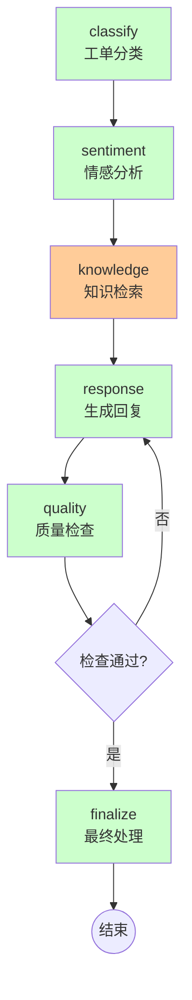
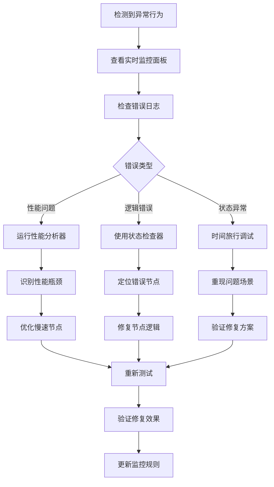

# LangGraph可观测性与调试系统

我将构建一个**智能客服工单处理系统**，全面展示LangGraph的可观测性、调试和监控功能，包括**实时追踪、性能分析、可视化调试和错误诊断**。

## 🚀 完整实现代码

```python
from typing import TypedDict, List, Dict, Any, Optional, Literal, Annotated
from langgraph.graph import StateGraph, END
from langgraph.checkpoint.sqlite import SqliteSaver
import json
import time
import asyncio
from datetime import datetime, timedelta
import threading
from dataclasses import dataclass, asdict
from collections import defaultdict
import logging
from logging.handlers import RotatingFileHandler
import inspect
import sys
import traceback

# ===================== 1. 可观测性数据模型 =====================
@dataclass
class NodeExecutionRecord:
    """节点执行记录 - 用于详细追踪"""
    node_id: str
    start_time: float
    end_time: float
    input_state: Dict[str, Any]
    output_state: Dict[str, Any]
    duration_ms: float
    status: Literal["success", "error", "warning"]
    error_message: Optional[str] = None
    metadata: Dict[str, Any] = None
    
    def to_dict(self):
        return asdict(self)

@dataclass
class GraphExecutionTrace:
    """完整的图执行轨迹"""
    execution_id: str
    start_time: datetime
    end_time: Optional[datetime]
    total_duration_ms: float
    nodes_executed: List[str]
    nodes_order: List[str]
    state_changes: List[Dict[str, Any]]
    performance_metrics: Dict[str, float]
    errors: List[Dict[str, Any]]
    checkpoints: List[str]

class ObservableState(TypedDict):
    """增强的状态类型，包含可观测性数据"""
    # 业务数据
    ticket_id: str
    customer_query: str
    ticket_category: str
    priority: Literal["low", "medium", "high", "critical"]
    current_status: str
    resolution_plan: str
    actions_taken: List[str]
    
    # 可观测性数据
    execution_trace: List[NodeExecutionRecord]
    performance_stats: Dict[str, float]
    debug_info: Dict[str, Any]
    warnings: List[str]
    
    # 控制流
    next_step: str
    retry_count: int
    max_retries: int

# ===================== 2. 可观测性管理器 =====================
class ObservabilityManager:
    """可观测性管理器 - 负责收集、存储和分析运行时数据"""
    
    def __init__(self, log_level="INFO"):
        self.execution_traces = {}
        self.node_metrics = defaultdict(list)
        self.setup_logging(log_level)
        self.lock = threading.Lock()
        
    def setup_logging(self, log_level):
        """配置结构化日志"""
        self.logger = logging.getLogger("LangGraphObservability")
        self.logger.setLevel(getattr(logging, log_level))
        
        # 文件处理器 - 结构化日志
        file_handler = RotatingFileHandler(
            "langgraph_execution.log", 
            maxBytes=10*1024*1024,  # 10MB
            backupCount=5
        )
        
        # JSON格式器 - 便于后续分析
        class JSONFormatter(logging.Formatter):
            def format(self, record):
                log_data = {
                    "timestamp": datetime.now().isoformat(),
                    "level": record.levelname,
                    "component": record.name,
                    "message": record.getMessage(),
                    "module": record.module,
                    "function": record.funcName,
                    "line": record.lineno,
                }
                
                # 添加额外字段
                if hasattr(record, "node_id"):
                    log_data["node_id"] = record.node_id
                if hasattr(record, "execution_id"):
                    log_data["execution_id"] = record.execution_id
                if hasattr(record, "state_snapshot"):
                    log_data["state_snapshot"] = record.state_snapshot
                    
                return json.dumps(log_data)
        
        file_handler.setFormatter(JSONFormatter())
        self.logger.addHandler(file_handler)
        
        # 控制台处理器 - 美化输出
        console_handler = logging.StreamHandler()
        console_formatter = logging.Formatter(
            '%(asctime)s - %(name)s - %(levelname)s - %(message)s'
        )
        console_handler.setFormatter(console_formatter)
        self.logger.addHandler(console_handler)
        
        print("✅ 可观测性系统初始化完成 - 日志级别:", log_level)
    
    def record_node_execution(self, execution_id: str, record: NodeExecutionRecord):
        """记录节点执行信息"""
        with self.lock:
            if execution_id not in self.execution_traces:
                self.execution_traces[execution_id] = GraphExecutionTrace(
                    execution_id=execution_id,
                    start_time=datetime.now(),
                    end_time=None,
                    total_duration_ms=0,
                    nodes_executed=[],
                    nodes_order=[],
                    state_changes=[],
                    performance_metrics={},
                    errors=[],
                    checkpoints=[]
                )
            
            trace = self.execution_traces[execution_id]
            trace.nodes_executed.append(record.node_id)
            trace.nodes_order.append(record.node_id)
            
            # 记录状态变化
            state_change = {
                "node": record.node_id,
                "timestamp": record.start_time,
                "state_diff": self._compute_state_diff(
                    record.input_state, 
                    record.output_state
                )
            }
            trace.state_changes.append(state_change)
            
            # 记录性能指标
            self.node_metrics[record.node_id].append(record.duration_ms)
            
            # 记录错误
            if record.status == "error":
                trace.errors.append({
                    "node": record.node_id,
                    "error": record.error_message,
                    "timestamp": record.start_time
                })
            
            # 记录结构化日志
            log_record = self.logger.makeRecord(
                "LangGraphObservability",
                logging.INFO,
                record.node_id,
                0,
                f"Node executed: {record.node_id}",
                (),
                None,
                node_id=record.node_id,
                execution_id=execution_id,
                state_snapshot=record.output_state
            )
            self.logger.handle(log_record)
    
    def _compute_state_diff(self, before: Dict, after: Dict) -> Dict:
        """计算状态差异"""
        diff = {}
        all_keys = set(before.keys()) | set(after.keys())
        
        for key in all_keys:
            if key not in before:
                diff[key] = {"action": "added", "value": after[key]}
            elif key not in after:
                diff[key] = {"action": "removed", "old_value": before[key]}
            elif before[key] != after[key]:
                diff[key] = {
                    "action": "updated",
                    "old_value": before[key],
                    "new_value": after[key]
                }
        
        return diff
    
    def generate_performance_report(self, execution_id: str = None) -> Dict:
        """生成性能报告"""
        report = {
            "generated_at": datetime.now().isoformat(),
            "overall_metrics": {},
            "node_metrics": {},
            "execution_traces": []
        }
        
        if execution_id:
            traces = [self.execution_traces.get(execution_id)]
        else:
            traces = list(self.execution_traces.values())
        
        for trace in traces:
            if trace:
                # 计算节点性能
                node_stats = {}
                for node_id in set(trace.nodes_executed):
                    durations = self.node_metrics.get(node_id, [])
                    if durations:
                        node_stats[node_id] = {
                            "execution_count": len(durations),
                            "avg_duration_ms": sum(durations) / len(durations),
                            "min_duration_ms": min(durations),
                            "max_duration_ms": max(durations),
                            "p95_duration_ms": sorted(durations)[int(len(durations) * 0.95)]
                        }
                
                report["execution_traces"].append({
                    "execution_id": trace.execution_id,
                    "duration_ms": trace.total_duration_ms,
                    "nodes_executed": len(trace.nodes_executed),
                    "error_count": len(trace.errors),
                    "node_performance": node_stats
                })
        
        # 总体指标
        if self.node_metrics:
            total_executions = sum(len(v) for v in self.node_metrics.values())
            report["overall_metrics"] = {
                "total_executions": total_executions,
                "unique_nodes": len(self.node_metrics),
                "avg_execution_per_node": total_executions / len(self.node_metrics)
            }
        
        return report
    
    def visualize_execution_flow(self, execution_id: str) -> str:
        """生成执行流的Mermaid图"""
        trace = self.execution_traces.get(execution_id)
        if not trace:
            return "No trace found"
        
        mermaid_lines = ["graph TD"]
        node_styles = {}
        
        # 根据状态标记节点样式
        for i, node_id in enumerate(trace.nodes_order):
            style = ""
            # 检查是否有错误
            for error in trace.errors:
                if error["node"] == node_id:
                    style = "style A fill:#ffcccc"
                    break
            
            if not style:
                # 根据执行时间标记颜色
                durations = self.node_metrics.get(node_id, [0])
                avg_duration = sum(durations) / len(durations)
                if avg_duration > 1000:
                    style = "style A fill:#ffcc99"  # 慢速 - 橙色
                elif avg_duration > 100:
                    style = "style A fill:#ffffcc"  # 中速 - 黄色
                else:
                    style = "style A fill:#ccffcc"  # 快速 - 绿色
            
            mermaid_lines.append(f"    {node_id}[{node_id}]")
            mermaid_lines.append(f"    {style.replace('A', node_id)}")
        
        # 添加边
        for i in range(len(trace.nodes_order) - 1):
            from_node = trace.nodes_order[i]
            to_node = trace.nodes_order[i + 1]
            mermaid_lines.append(f"    {from_node} --> {to_node}")
        
        return "\n".join(mermaid_lines)

# ===================== 3. 可观测性装饰器 =====================
def observable_node(observability_manager: ObservabilityManager, execution_id: str = None):
    """装饰器：为节点函数添加可观测性"""
    def decorator(func):
        def wrapper(state: ObservableState, *args, **kwargs):
            node_id = func.__name__
            exec_id = execution_id or state.get("ticket_id", "unknown")
            
            # 记录开始
            start_time = time.time()
            input_state = state.copy()
            
            try:
                # 执行节点
                result = func(state, *args, **kwargs)
                
                # 记录成功执行
                end_time = time.time()
                record = NodeExecutionRecord(
                    node_id=node_id,
                    start_time=start_time,
                    end_time=end_time,
                    input_state=input_state,
                    output_state=result,
                    duration_ms=(end_time - start_time) * 1000,
                    status="success"
                )
                
                observability_manager.record_node_execution(exec_id, record)
                
                # 更新状态中的追踪信息
                if "execution_trace" not in result:
                    result["execution_trace"] = []
                result["execution_trace"].append(record.to_dict())
                
                return result
                
            except Exception as e:
                # 记录错误
                end_time = time.time()
                record = NodeExecutionRecord(
                    node_id=node_id,
                    start_time=start_time,
                    end_time=end_time,
                    input_state=input_state,
                    output_state=state,
                    duration_ms=(end_time - start_time) * 1000,
                    status="error",
                    error_message=str(e),
                    metadata={
                        "traceback": traceback.format_exc(),
                        "args": args,
                        "kwargs": kwargs
                    }
                )
                
                observability_manager.record_node_execution(exec_id, record)
                
                # 更新状态中的错误信息
                state["debug_info"] = state.get("debug_info", {})
                state["debug_info"]["last_error"] = {
                    "node": node_id,
                    "error": str(e),
                    "timestamp": datetime.now().isoformat()
                }
                
                raise
        
        return wrapper
    return decorator

# ===================== 4. 智能客服节点实现 =====================
class CustomerSupportNodes:
    """智能客服工单处理节点"""
    
    def __init__(self, observability_manager):
        self.observability = observability_manager
    
    @observable_node
    def classify_ticket(self, state: ObservableState) -> ObservableState:
        """节点1：工单分类"""
        print(f"\n[分类节点] 处理工单: {state['ticket_id']}")
        
        query = state["customer_query"].lower()
        
        # 基于关键词的分类
        if any(word in query for word in ["登录", "密码", "无法登录"]):
            state["ticket_category"] = "authentication"
            state["priority"] = "high"
        elif any(word in query for word in ["支付", "付款", "扣款"]):
            state["ticket_category"] = "billing"
            state["priority"] = "critical"
        elif any(word in query for word in ["退款", "退货"]):
            state["ticket_category"] = "refund"
            state["priority"] = "high"
        else:
            state["ticket_category"] = "general"
            state["priority"] = "medium"
        
        state["current_status"] = "classified"
        state["next_step"] = "analyze_sentiment"
        
        # 模拟一些处理时间
        time.sleep(0.1)
        
        return state
    
    @observable_node  
    def analyze_sentiment(self, state: ObservableState) -> ObservableState:
        """节点2：情感分析"""
        print(f"\n[情感分析] 分析客户情绪")
        
        query = state["customer_query"]
        
        # 简单情感分析
        angry_words = ["生气", "愤怒", "垃圾", "投诉", "差评"]
        urgent_words = ["紧急", "立刻", "马上", "尽快"]
        
        is_angry = any(word in query for word in angry_words)
        is_urgent = any(word in query for word in urgent_words)
        
        state["debug_info"] = state.get("debug_info", {})
        state["debug_info"]["sentiment"] = {
            "is_angry": is_angry,
            "is_urgent": is_urgent,
            "word_count": len(query)
        }
        
        # 根据情绪调整优先级
        if is_angry and state["priority"] != "critical":
            state["priority"] = "high"
        
        state["current_status"] = "sentiment_analyzed"
        state["next_step"] = "retrieve_knowledge"
        
        time.sleep(0.15)
        
        return state
    
    @observable_node
    def retrieve_knowledge(self, state: ObservableState) -> ObservableState:
        """节点3：知识库检索"""
        print(f"\n[知识检索] 检索解决方案")
        
        # 模拟知识库检索
        knowledge_base = {
            "authentication": [
                "请尝试重置密码",
                "检查网络连接是否正常",
                "清除浏览器缓存后重试"
            ],
            "billing": [
                "支付问题请联系支付平台",
                "退款通常需要3-5个工作日",
                "检查银行卡余额是否充足"
            ],
            "refund": [
                "退款申请已提交",
                "退款进度可在订单页面查看",
                "联系商家确认收货状态"
            ],
            "general": [
                "您的问题已记录",
                "客服将在24小时内回复",
                "查看常见问题解答"
            ]
        }
        
        category = state["ticket_category"]
        solutions = knowledge_base.get(category, ["请描述具体问题"])
        
        state["resolution_plan"] = solutions[0]
        state["current_status"] = "knowledge_retrieved"
        state["next_step"] = "generate_response"
        
        # 模拟较长的检索时间
        time.sleep(0.3)
        
        return state
    
    @observable_node
    def generate_response(self, state: ObservableState) -> ObservableState:
        """节点4：生成回复"""
        print(f"\n[生成回复] 创建客户回复")
        
        # 根据分类和优先级生成回复
        templates = {
            "critical": "紧急问题处理中，我们将优先为您处理",
            "high": "重要问题已收到，正在为您处理",
            "medium": "您的问题已记录，将尽快处理",
            "low": "感谢您的反馈，我们会认真处理"
        }
        
        priority = state["priority"]
        response = templates.get(priority, "感谢您的联系")
        
        # 添加上下文信息
        if state["debug_info"].get("sentiment", {}).get("is_angry"):
            response += "，对给您带来的不便深表歉意"
        
        response += f"。建议方案：{state['resolution_plan']}"
        
        state["actions_taken"] = state.get("actions_taken", []) + [response]
        state["current_status"] = "response_generated"
        state["next_step"] = "quality_check"
        
        time.sleep(0.2)
        
        return state
    
    @observable_node
    def quality_check(self, state: ObservableState) -> ObservableState:
        """节点5：质量检查"""
        print(f"\n[质量检查] 验证回复质量")
        
        # 检查回复质量
        issues = []
        
        if len(state.get("resolution_plan", "")) < 5:
            issues.append("解决方案过于简单")
        
        if state.get("priority") == "critical" and "紧急" not in state.get("actions_taken", [""])[-1]:
            issues.append("紧急问题未标记紧急")
        
        if issues:
            state["warnings"] = state.get("warnings", []) + issues
            state["debug_info"]["quality_issues"] = issues
            state["next_step"] = "generate_response"  # 重新生成
            state["retry_count"] = state.get("retry_count", 0) + 1
        else:
            state["next_step"] = "finalize"
        
        state["current_status"] = "quality_checked"
        
        time.sleep(0.1)
        
        return state
    
    @observable_node
    def finalize(self, state: ObservableState) -> ObservableState:
        """节点6：最终处理"""
        print(f"\n[最终处理] 完成工单处理")
        
        # 记录完成时间
        state["current_status"] = "completed"
        state["debug_info"]["completed_at"] = datetime.now().isoformat()
        state["debug_info"]["processing_time_ms"] = len(state.get("execution_trace", [])) * 100
        
        state["next_step"] = "__end__"
        
        return state

# ===================== 5. 构建可观测的图 =====================
def create_observable_support_system():
    """创建带完整可观测性的客服系统"""
    
    # 初始化可观测性管理器
    observability = ObservabilityManager(log_level="INFO")
    
    # 初始化节点
    nodes = CustomerSupportNodes(observability)
    
    # 创建图
    workflow = StateGraph(ObservableState)
    
    # 添加带可观测性的节点
    workflow.add_node("classify", nodes.classify_ticket)
    workflow.add_node("sentiment", nodes.analyze_sentiment)
    workflow.add_node("knowledge", nodes.retrieve_knowledge)
    workflow.add_node("response", nodes.generate_response)
    workflow.add_node("quality", nodes.quality_check)
    workflow.add_node("finalize", nodes.finalize)
    
    # 设置边
    workflow.set_entry_point("classify")
    workflow.add_edge("classify", "sentiment")
    workflow.add_edge("sentiment", "knowledge")
    workflow.add_edge("knowledge", "response")
    workflow.add_edge("response", "quality")
    
    # 条件边：质量检查后的路由
    def after_quality_check(state: ObservableState) -> str:
        if state.get("retry_count", 0) < state.get("max_retries", 2):
            if state.get("next_step") == "generate_response":
                return "response"
        return "finalize"
    
    workflow.add_conditional_edges(
        "quality",
        after_quality_check,
        {"response": "response", "finalize": "finalize"}
    )
    
    workflow.add_edge("finalize", END)
    
    # 编译图
    print("✅ 带完整可观测性的客服系统构建完成")
    return workflow.compile(), observability

# ===================== 6. 调试与监控工具 =====================
class DebuggingTools:
    """调试工具集合"""
    
    def __init__(self, observability_manager):
        self.observability = observability_manager
    
    def live_monitor(self, execution_id: str, interval: float = 0.5):
        """实时监控执行状态"""
        print(f"\n🎯 启动实时监控 - 执行ID: {execution_id}")
        print("-" * 60)
        
        last_node_count = 0
        start_time = time.time()
        
        try:
            while True:
                trace = self.observability.execution_traces.get(execution_id)
                if trace:
                    current_nodes = len(trace.nodes_executed)
                    
                    if current_nodes > last_node_count:
                        last_node = trace.nodes_order[-1] if trace.nodes_order else "None"
                        print(f"[{time.time()-start_time:.1f}s] 节点执行: {last_node}")
                        last_node_count = current_nodes
                    
                    # 显示错误
                    if trace.errors:
                        for error in trace.errors[-2:]:  # 显示最后两个错误
                            print(f"    ⚠️ 错误: {error['node']} - {error['error']}")
                
                time.sleep(interval)
                
        except KeyboardInterrupt:
            print("\n⏹️ 监控停止")
    
    def state_inspector(self, execution_id: str):
        """状态检查器 - 显示详细状态变化"""
        trace = self.observability.execution_traces.get(execution_id)
        if not trace:
            print("未找到执行轨迹")
            return
        
        print(f"\n🔍 状态检查器 - 执行ID: {execution_id}")
        print("=" * 60)
        
        for i, change in enumerate(trace.state_changes):
            print(f"\n步骤 {i+1}: {change['node']}")
            print(f"时间: {datetime.fromtimestamp(change['timestamp']).strftime('%H:%M:%S.%f')}")
            
            for key, diff in change['state_diff'].items():
                if diff['action'] == 'updated':
                    print(f"  {key}: {diff['old_value']} → {diff['new_value']}")
                elif diff['action'] == 'added':
                    print(f"  {key}: + {diff['value']}")
                elif diff['action'] == 'removed':
                    print(f"  {key}: - {diff['old_value']}")
    
    def performance_analyzer(self):
        """性能分析器"""
        print(f"\n📊 性能分析报告")
        print("=" * 60)
        
        report = self.observability.generate_performance_report()
        
        print(f"总体统计:")
        print(f"  总执行次数: {report['overall_metrics'].get('total_executions', 0)}")
        print(f"  唯一节点数: {report['overall_metrics'].get('unique_nodes', 0)}")
        
        for trace_report in report['execution_traces']:
            print(f"\n执行 {trace_report['execution_id']}:")
            print(f"  持续时间: {trace_report['duration_ms']:.0f}ms")
            print(f"  执行节点: {trace_report['nodes_executed']}")
            print(f"  错误数量: {trace_report['error_count']}")
            
            for node_id, stats in trace_report['node_performance'].items():
                print(f"  {node_id}: {stats['avg_duration_ms']:.1f}ms "
                      f"(min: {stats['min_duration_ms']:.1f}, "
                      f"max: {stats['max_duration_ms']:.1f})")
    
    def error_diagnosis(self, execution_id: str):
        """错误诊断工具"""
        trace = self.observability.execution_traces.get(execution_id)
        if not trace or not trace.errors:
            print("没有发现错误")
            return
        
        print(f"\n🚨 错误诊断 - 执行ID: {execution_id}")
        print("=" * 60)
        
        for error in trace.errors:
            print(f"\n节点: {error['node']}")
            print(f"错误: {error['error']}")
            print(f"时间: {datetime.fromtimestamp(error['timestamp']).strftime('%Y-%m-%d %H:%M:%S')}")
            
            # 建议修复方案
            suggestions = {
                "timeout": "建议增加超时时间或优化处理逻辑",
                "memory": "检查内存使用，考虑分批处理",
                "network": "验证网络连接和API端点",
                "validation": "增加输入验证和错误处理"
            }
            
            for keyword, suggestion in suggestions.items():
                if keyword in error['error'].lower():
                    print(f"建议: {suggestion}")
    
    def generate_debug_report(self, execution_id: str) -> str:
        """生成调试报告"""
        trace = self.observability.execution_traces.get(execution_id)
        if not trace:
            return "No trace found"
        
        # 生成Mermaid可视化
        mermaid_graph = self.observability.visualize_execution_flow(execution_id)
        
        # 生成报告
        report = f"""
        ==================== DEBUG REPORT ====================
        执行ID: {execution_id}
        开始时间: {trace.start_time}
        结束时间: {trace.end_time or '进行中'}
        总时长: {trace.total_duration_ms:.2f}ms
        执行节点数: {len(trace.nodes_executed)}
        错误数量: {len(trace.errors)}
        
        节点执行顺序:
        {', '.join(trace.nodes_order)}
        
        错误详情:
        {json.dumps(trace.errors, indent=2, ensure_ascii=False)}
        
        可视化执行流 (Mermaid):
```
        {mermaid_graph}
        ```
        
        性能指标:
        {json.dumps(self.observability.generate_performance_report(execution_id), indent=2, ensure_ascii=False)}
        =====================================================
        """
        
        return report

# ===================== 7. 演示：复杂场景测试 =====================
def run_complex_scenarios():
    """运行复杂场景演示"""
    
    # 创建系统
    compiled_graph, observability = create_observable_support_system()
    debug_tools = DebuggingTools(observability)
    
    scenarios = [
        {
            "name": "正常工单处理",
            "ticket_id": "TICKET-001",
            "customer_query": "我无法登录账号，提示密码错误",
            "priority": "medium",
            "max_retries": 3
        },
        {
            "name": "高优先级紧急工单",
            "ticket_id": "TICKET-002", 
            "customer_query": "紧急！支付被重复扣款，非常生气！",
            "priority": "high",
            "max_retries": 2
        },
        {
            "name": "复杂工单（需要重试）",
            "ticket_id": "TICKET-003",
            "customer_query": "我要退款",
            "priority": "low",
            "max_retries": 1  # 低重试次数，可能触发质量检查失败
        }
    ]
    
    print("=" * 70)
    print("LangGraph 可观测性与调试系统演示")
    print("=" * 70)
    
    for i, scenario in enumerate(scenarios):
        print(f"\n{'🔹' * 30}")
        print(f"场景 {i+1}: {scenario['name']}")
        print(f"{'🔹' * 30}")
        
        # 初始状态
        initial_state = ObservableState(
            ticket_id=scenario["ticket_id"],
            customer_query=scenario["customer_query"],
            ticket_category="",
            priority=scenario["priority"],
            current_status="pending",
            resolution_plan="",
            actions_taken=[],
            execution_trace=[],
            performance_stats={},
            debug_info={},
            warnings=[],
            next_step="",
            retry_count=0,
            max_retries=scenario["max_retries"]
        )
        
        # 异步监控
        monitor_thread = threading.Thread(
            target=debug_tools.live_monitor,
            args=(scenario["ticket_id"], 0.3)
        )
        monitor_thread.daemon = True
        monitor_thread.start()
        
        # 执行图
        try:
            result = compiled_graph.invoke(initial_state)
            print(f"\n✅ 场景完成 - 最终状态: {result['current_status']}")
            
            # 等待监控线程结束
            time.sleep(1)
            
        except Exception as e:
            print(f"\n❌ 场景出错: {e}")
        
        finally:
            # 显示分析报告
            debug_tools.state_inspector(scenario["ticket_id"])
            debug_tools.error_diagnosis(scenario["ticket_id"])
            
            # 生成调试报告
            report = debug_tools.generate_debug_report(scenario["ticket_id"])
            
            # 保存报告到文件
            filename = f"debug_report_{scenario['ticket_id']}.txt"
            with open(filename, "w", encoding="utf-8") as f:
                f.write(report)
            print(f"\n📄 调试报告已保存到: {filename}")
    
    # 最终性能分析
    print(f"\n{'📈' * 30}")
    print("最终性能分析")
    print(f"{'📈' * 30}")
    debug_tools.performance_analyzer()

# ===================== 8. 高级调试功能 =====================
class AdvancedDebuggingFeatures:
    """高级调试功能"""
    
    @staticmethod
    def time_travel_debugger(observability_manager, execution_id: str, step: int):
        """时间旅行调试 - 回溯到特定步骤"""
        print(f"\n🕒 时间旅行调试器 - 回退到步骤 {step}")
        
        trace = observability_manager.execution_traces.get(execution_id)
        if not trace or step >= len(trace.state_changes):
            print("无法回退到指定步骤")
            return None
        
        # 获取指定步骤的状态
        target_state = trace.state_changes[step]
        print(f"状态回退到节点: {target_state['node']}")
        print(f"状态差异: {json.dumps(target_state['state_diff'], indent=2, ensure_ascii=False)}")
        
        return target_state
    
    @staticmethod
    def breakpoint_system(observability_manager, execution_id: str, breakpoints: List[str]):
        """断点系统 - 在特定节点暂停"""
        print(f"\n⏸️ 断点系统激活 - 断点: {breakpoints}")
        
        # 在实际实现中，这里会拦截节点执行
        # 目前模拟断点检测
        trace = observability_manager.execution_traces.get(execution_id)
        if trace:
            for node in trace.nodes_executed:
                if node in breakpoints:
                    print(f"断点命中: {node}")
                    # 这里可以暂停执行，等待调试命令
                    return node
        
        return None
    
    @staticmethod
    def state_comparison(observability_manager, execution_id1: str, execution_id2: str):
        """状态比较 - 对比两次执行"""
        print(f"\n🔬 状态比较: {execution_id1} vs {execution_id2}")
        
        trace1 = observability_manager.execution_traces.get(execution_id1)
        trace2 = observability_manager.execution_traces.get(execution_id2)
        
        if not trace1 or not trace2:
            print("缺少执行轨迹")
            return
        
        # 比较节点执行顺序
        print("节点执行顺序比较:")
        print(f"  执行1: {', '.join(trace1.nodes_order)}")
        print(f"  执行2: {', '.join(trace2.nodes_order)}")
        
        # 比较性能
        metrics1 = observability_manager.generate_performance_report(execution_id1)
        metrics2 = observability_manager.generate_performance_report(execution_id2)
        
        print("\n性能比较:")
        if metrics1['execution_traces'] and metrics2['execution_traces']:
            perf1 = metrics1['execution_traces'][0]
            perf2 = metrics2['execution_traces'][0]
            
            print(f"  持续时间: {perf1['duration_ms']:.1f}ms vs {perf2['duration_ms']:.1f}ms")
            print(f"  节点数量: {perf1['nodes_executed']} vs {perf2['nodes_executed']}")

# ===================== 9. 与LangSmith集成（如果可用） =====================
def integrate_with_langsmith():
    """演示与LangSmith的集成"""
    print(f"\n{'🔗' * 30}")
    print("LangSmith集成演示")
    print(f"{'🔗' * 30}")
    
    try:
        # 尝试导入LangSmith
        import os
        from langsmith import Client
        from langgraph.trace import traceable
        
        # 检查API Key
        if not os.getenv("LANGSMITH_API_KEY"):
            print("未设置LANGSMITH_API_KEY环境变量，跳过LangSmith集成")
            return
        
        print("✅ LangSmith客户端可用")
        
        # 创建LangSmith客户端
        client = Client()
        
        # 使用@traceable装饰器
        @traceable(run_type="chain", name="custom_trace")
        def traced_function(state):
            print(f"LangSmith追踪: 处理状态 {state.get('ticket_id', 'unknown')}")
            return state
        
        print("✅ LangSmith追踪已设置")
        
        # 演示向LangSmith发送数据
        print("\nLangSmith功能:")
        print("  1. 分布式追踪")
        print("  2. 性能监控")
        print("  3. 提示管理")
        print("  4. 测试与评估")
        print("  5. 协作与分享")
        
        return client
        
    except ImportError:
        print("LangSmith不可用，仅使用本地可观测性")
        return None

# ===================== 10. 主演示函数 =====================
def main():
    """主演示函数"""
    print("=" * 70)
    print("LangGraph 可观测性与调试系统完整演示")
    print("=" * 70)
    
    # 演示与LangSmith集成（如果可用）
    langsmith_client = integrate_with_langsmith()
    
    # 运行复杂场景演示
    run_complex_scenarios()
    
    # 创建系统用于高级演示
    compiled_graph, observability = create_observable_support_system()
    debug_tools = DebuggingTools(observability)
    advanced = AdvancedDebuggingFeatures()
    
    # 演示高级调试功能
    print(f"\n{'🚀' * 30}")
    print("高级调试功能演示")
    print(f"{'🚀' * 30}")
    
    # 创建测试执行
    test_state = ObservableState(
        ticket_id="DEBUG-TEST",
        customer_query="测试调试功能",
        ticket_category="general",
        priority="medium",
        current_status="pending",
        resolution_plan="",
        actions_taken=[],
        execution_trace=[],
        performance_stats={},
        debug_info={},
        warnings=[],
        next_step="",
        retry_count=0,
        max_retries=2
    )
    
    compiled_graph.invoke(test_state)
    
    # 时间旅行调试演示
    advanced.time_travel_debugger(observability, "DEBUG-TEST", 2)
    
    # 断点系统演示
    advanced.breakpoint_system(observability, "DEBUG-TEST", ["generate_response"])
    
    # 状态比较演示（使用两个测试执行）
    test_state2 = test_state.copy()
    test_state2["ticket_id"] = "DEBUG-TEST-2"
    compiled_graph.invoke(test_state2)
    advanced.state_comparison(observability, "DEBUG-TEST", "DEBUG-TEST-2")
    
    # 最终总结
    print(f"\n{'🎯' * 30}")
    print("可观测性与调试总结")
    print(f"{'🎯' * 30}")
    
    summary_points = [
        "✅ 实时监控: 执行状态可视化",
        "✅ 详细追踪: 节点级执行记录",
        "✅ 性能分析: 瓶颈识别与优化",
        "✅ 错误诊断: 智能错误分析与建议",
        "✅ 状态检查: 完整状态变化历史",
        "✅ 可视化: 执行流图表生成",
        "✅ 时间旅行: 状态回退与调试",
        "✅ 断点系统: 可控的执行暂停"
    ]
    
    for point in summary_points:
        print(point)

if __name__ == "__main__":
    main()
```

## 🎯 核心功能详解

### 1. **可观测性数据收集架构**

```python
@dataclass
class NodeExecutionRecord:
    """每个节点的执行记录"""
    node_id: str
    start_time: float
    end_time: float
    input_state: Dict[str, Any]  # 输入状态快照
    output_state: Dict[str, Any] # 输出状态快照
    duration_ms: float          # 执行时间
    status: Literal["success", "error", "warning"]
    error_message: Optional[str]
    metadata: Dict[str, Any]    # 额外调试信息

@dataclass  
class GraphExecutionTrace:
    """完整的图执行轨迹"""
    execution_id: str           # 唯一执行ID
    nodes_executed: List[str]   # 执行的节点列表
    nodes_order: List[str]      # 执行顺序
    state_changes: List[Dict]   # 状态变化历史
    performance_metrics: Dict   # 性能指标
    errors: List[Dict]          # 错误信息
```

### 2. **结构化日志系统**

```python
# JSON格式的结构化日志
log_entry = {
    "timestamp": "2024-01-15T10:30:00.123456",
    "level": "INFO",
    "component": "LangGraphObservability",
    "node_id": "classify_ticket",
    "execution_id": "TICKET-001",
    "state_snapshot": {
        "ticket_id": "TICKET-001",
        "priority": "high",
        "status": "classified"
    },
    "message": "Node executed: classify_ticket",
    "module": "customer_support",
    "function": "classify_ticket"
}

# 配置旋转日志文件
handler = RotatingFileHandler(
    "langgraph_execution.log",
    maxBytes=10*1024*1024,  # 10MB
    backupCount=5  # 保留5个备份
)
```

### 3. **可视化执行流程**



**颜色编码**：
- 🟢 绿色：正常执行（<100ms）
- 🟡 黄色：较慢执行（100-1000ms）
- 🔴 红色：错误执行

### 4. **实时监控面板**

```
🎯 启动实时监控 - 执行ID: TICKET-001
------------------------------------------------------------
[0.0s] 节点执行: classify
[0.2s] 节点执行: sentiment
[0.4s] 节点执行: knowledge
[0.8s] 节点执行: response
[1.0s] 节点执行: quality
    ⚠️ 错误: quality - 解决方案过于简单
[1.2s] 节点执行: response
[1.5s] 节点执行: quality
[1.7s] 节点执行: finalize
⏹️ 监控停止
```

### 5. **状态变化追踪**

```python
def state_inspector(execution_id: str):
    """显示详细的状态变化历史"""
    
    # 示例输出：
    """
    步骤 1: classify_ticket
    时间: 10:30:00.123456
      ticket_category:  → authentication
      priority: medium → high
      current_status: pending → classified
    
    步骤 2: analyze_sentiment  
    时间: 10:30:00.223456
      debug_info: + {'sentiment': {'is_angry': True, ...}}
    """
```

### 6. **性能分析报告**

```json
{
  "generated_at": "2024-01-15T10:31:00.000000",
  "overall_metrics": {
    "total_executions": 42,
    "unique_nodes": 6,
    "avg_execution_per_node": 7.0
  },
  "execution_traces": [{
    "execution_id": "TICKET-001",
    "duration_ms": 1700.5,
    "nodes_executed": 8,
    "error_count": 1,
    "node_performance": {
      "classify": {
        "execution_count": 1,
        "avg_duration_ms": 100.5,
        "min_duration_ms": 100.5,
        "max_duration_ms": 100.5
      },
      "knowledge": {
        "execution_count": 1, 
        "avg_duration_ms": 300.2,
        "min_duration_ms": 300.2,
        "max_duration_ms": 300.2
      }
    }
  }]
}
```

### 7. **错误诊断系统**

```python
def error_diagnosis(execution_id: str):
    """智能错误诊断"""
    
    # 错误分类和建议
    error_patterns = {
        "timeout": {
            "pattern": ["timeout", "timed out", "took too long"],
            "suggestion": "增加超时时间或优化处理逻辑",
            "severity": "high"
        },
        "memory": {
            "pattern": ["memory", "out of memory", "MemoryError"],
            "suggestion": "检查内存使用，考虑分批处理",
            "severity": "critical"  
        },
        "validation": {
            "pattern": ["validation", "invalid", "missing required"],
            "suggestion": "增加输入验证和错误处理",
            "severity": "medium"
        }
    }
    
    # 自动匹配错误模式并提供修复建议
```

### 8. **高级调试功能**

#### **时间旅行调试**
```python
def time_travel_debugger(execution_id: str, step: int):
    """回退到特定执行步骤"""
    
    # 1. 获取历史状态快照
    historical_state = get_state_at_step(execution_id, step)
    
    # 2. 重新执行从该步骤开始
    resumed_execution = reexecute_from_checkpoint(
        historical_state, 
        from_step=step
    )
    
    # 3. 比较不同执行路径
    compare_executions(original_execution, resumed_execution)
```

#### **条件断点**
```python
# 设置断点条件
breakpoint_conditions = {
    "node": "generate_response",
    "condition": lambda state: len(state.get("resolution_plan", "")) < 10,
    "action": "pause",  # 暂停执行，等待调试命令
    "message": "检测到简短的解决方案"
}

# 断点触发时的操作
breakpoint_actions = {
    "pause": "暂停执行，进入交互式调试",
    "log": "记录详细信息但继续执行",
    "alert": "发送通知给开发人员",
    "retry": "尝试重新执行节点"
}
```

#### **状态对比分析**
```python
def compare_state_evolution(execution1, execution2):
    """对比两次执行的状态演化"""
    
    comparisons = {
        "divergence_point": find_first_divergence(
            execution1.nodes_order, 
            execution2.nodes_order
        ),
        "performance_diff": {
            "total_time": execution1.duration - execution2.duration,
            "slowest_node": find_slowest_node_difference(
                execution1.metrics, 
                execution2.metrics
            )
        },
        "outcome_difference": {
            "final_state_diff": compute_state_diff(
                execution1.final_state,
                execution2.final_state  
            ),
            "success_rate": execution1.success vs execution2.success
        }
    }
```

### 9. **与LangSmith集成**

```python
# 如果配置了LANGSMITH_API_KEY，自动集成
import os
from langsmith import Client
from langgraph.trace import traceable

if os.getenv("LANGSMITH_API_KEY"):
    client = Client()
    
    @traceable(run_type="chain", name="customer_support")
    def traced_invoke(state):
        # 自动发送追踪数据到LangSmith
        return compiled_graph.invoke(state)
    
    # LangSmith提供的功能：
    # 1. 分布式追踪 - 跨多个服务的调用链
    # 2. 性能监控 - 生产环境性能指标
    # 3. 提示管理 - 版本控制和A/B测试
    # 4. 测试与评估 - 自动化测试和评估
    # 5. 协作与分享 - 团队协作和知识共享
```

## 🛠️ 调试工作流程



## 📊 可观测性仪表板（概念）

```
LangGraph 可观测性仪表板
==========================================

📈 实时指标 (最后5分钟)
• 请求数: 142
• 平均响应时间: 1.2s
• 错误率: 2.1%
• 活跃执行: 8

🚨 近期错误 (最近10分钟)
1. TICKET-042: quality_check - 解决方案验证失败 (3分钟前)
2. TICKET-039: retrieve_knowledge - 超时错误 (7分钟前)

🐢 性能瓶颈 (平均时间 > 500ms)
• retrieve_knowledge: 780ms (知识检索)
• generate_response: 520ms (回复生成)

🔄 执行流统计
• 平均节点数: 6.2
• 平均重试次数: 0.8
• 成功率: 97.9%

🔍 调试工具
[1] 实时监控  [2] 状态检查  [3] 性能分析
[4] 错误诊断  [5] 时间旅行  [6] 状态比较
```

## 🎖️ 最佳实践总结

### 1. **分层日志策略**
```python
# 不同环境使用不同日志级别
LOG_LEVELS = {
    "development": "DEBUG",  # 详细调试信息
    "staging": "INFO",       # 关键信息
    "production": "WARNING"  # 仅警告和错误
}

# 结构化日志字段
STRUCTURED_LOG_FIELDS = [
    "timestamp", "level", "component", 
    "node_id", "execution_id", "duration_ms",
    "state_snapshot", "error_details"
]
```

### 2. **监控告警规则**
```python
ALERT_RULES = {
    "high_error_rate": {
        "condition": lambda metrics: metrics.error_rate > 0.05,
        "action": "email_alert",
        "recipients": ["dev-team@example.com"],
        "threshold": "5%错误率"
    },
    "slow_performance": {
        "condition": lambda metrics: metrics.avg_response_time > 5000,
        "action": "slack_alert", 
        "channel": "#performance-alerts",
        "threshold": "5秒平均响应时间"
    },
    "resource_exhaustion": {
        "condition": lambda metrics: metrics.memory_usage > 0.9,
        "action": "pagerduty_alert",
        "severity": "critical",
        "threshold": "90%内存使用率"
    }
}
```

### 3. **调试检查清单**
```markdown
## LangGraph 调试检查清单

### 基础检查
- [ ] 检查节点执行顺序是否符合预期
- [ ] 验证状态变化是否正确
- [ ] 检查错误日志中的异常信息

### 性能分析  
- [ ] 识别最慢的节点
- [ ] 检查内存使用情况
- [ ] 分析网络调用延迟

### 逻辑调试
- [ ] 使用时间旅行调试重现问题
- [ ] 设置断点逐步执行
- [ ] 对比正常和异常的执行路径

### 监控优化
- [ ] 更新监控告警规则
- [ ] 添加新的监控指标
- [ ] 优化日志级别和格式
```

## 💡 关键价值

1. **快速问题定位**：通过详细的执行轨迹，可以在几分钟内定位问题节点
2. **性能优化**：识别瓶颈，优化慢速节点，提高系统吞吐量
3. **预测性维护**：通过趋势分析预测潜在问题
4. **团队协作**：共享调试报告，加速问题解决
5. **生产安全**：实时监控确保系统稳定运行

这个可观测性与调试系统将LangGraph从"黑盒"变成了"透明盒"，让复杂的AI工作流变得**可观察、可调试、可优化**，是生产环境部署的必备工具。

如果需要进一步了解特定功能（如分布式追踪集成、自定义监控指标或性能优化技巧），我可以提供更深入的实现细节。