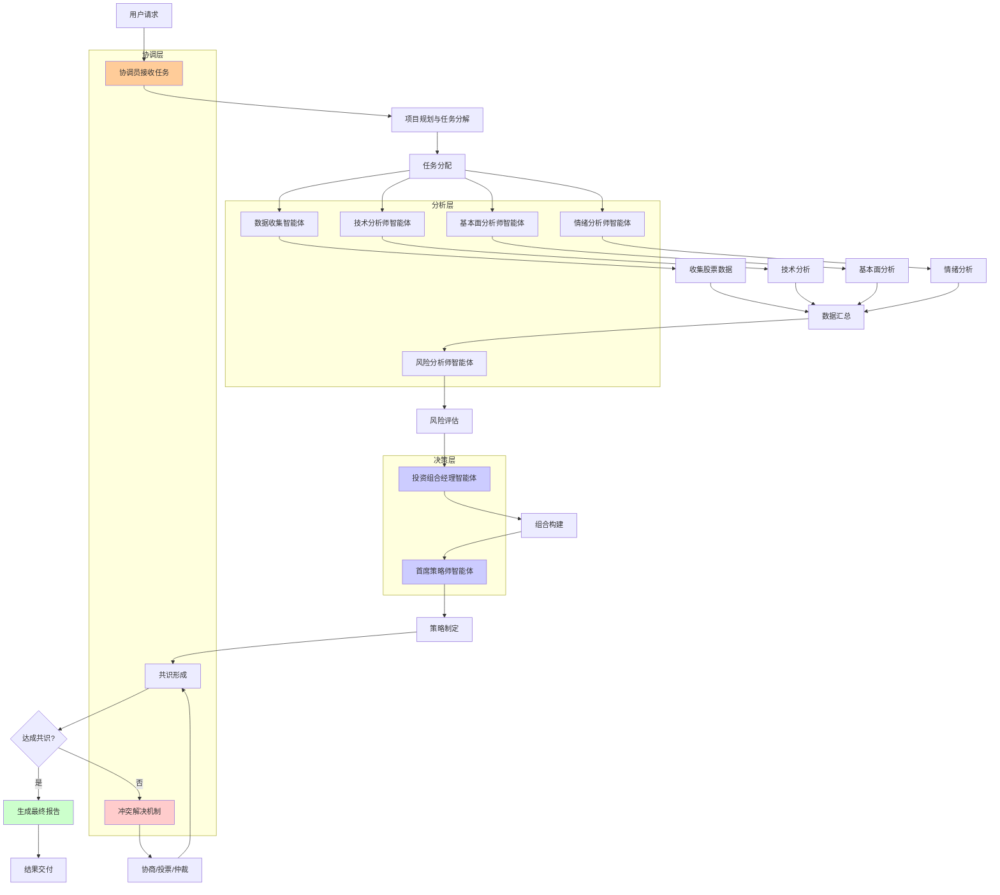

# LangGraph多智能体编排系统

我将构建一个**智能投资研究团队**，展示LangGraph中完整的多智能体编排功能，包括**角色分工、通信协议、协商机制、共识形成和分布式决策**等企业级功能。

## 🚀 完整实现代码

```python
from typing import TypedDict, List, Dict, Any, Optional, Literal, Annotated, Union
from langgraph.graph import StateGraph, END, add_messages
from langgraph.checkpoint.sqlite import SqliteSaver
from langchain_openai import ChatOpenAI
from datetime import datetime, timedelta
import asyncio
import json
import uuid
from dataclasses import dataclass, asdict, field
from enum import Enum
import random
from collections import defaultdict
import threading
from concurrent.futures import ThreadPoolExecutor
import time

# ===================== 1. 智能体系统架构定义 =====================
class AgentRole(Enum):
    """智能体角色"""
    DATA_COLLECTOR = "data_collector"      # 数据收集专家
    TECHNICAL_ANALYST = "technical_analyst" # 技术分析师
    FUNDAMENTAL_ANALYST = "fundamental_analyst" # 基本面分析师
    SENTIMENT_ANALYST = "sentiment_analyst" # 情绪分析师
    RISK_ANALYST = "risk_analyst"         # 风险分析师
    PORTFOLIO_MANAGER = "portfolio_manager" # 投资组合经理
    CHIEF_STRATEGIST = "chief_strategist" # 首席策略师
    COORDINATOR = "coordinator"           # 协调员

class MessageType(Enum):
    """消息类型"""
    REQUEST = "request"           # 请求信息
    RESPONSE = "response"         # 响应信息
    BROADCAST = "broadcast"       # 广播信息
    NEGOTIATION = "negotiation"   # 协商信息
    VOTE = "vote"                 # 投票信息
    DECISION = "decision"         # 决策信息
    ERROR = "error"               # 错误信息

@dataclass
class AgentMessage:
    """智能体间消息"""
    message_id: str
    sender: AgentRole
    receivers: List[AgentRole]
    message_type: MessageType
    content: Dict[str, Any]
    timestamp: datetime = field(default_factory=datetime.now)
    priority: int = 1  # 1-5，5为最高
    requires_ack: bool = False
    acknowledged_by: List[AgentRole] = field(default_factory=list)
    
    def to_dict(self):
        return asdict(self)

@dataclass
class AgentCapability:
    """智能体能力定义"""
    role: AgentRole
    expertise: List[str]
    confidence_level: float  # 0-1
    processing_speed: float  # 秒/任务
    reliability: float       # 可靠性评分

class AgentStatus(Enum):
    """智能体状态"""
    IDLE = "idle"
    PROCESSING = "processing"
    WAITING = "waiting"
    ERROR = "error"
    OFFLINE = "offline"

class ResearchState(TypedDict):
    """多智能体研究状态"""
    # 研究任务
    research_id: str
    research_topic: str
    target_stocks: List[str]
    deadline: str
    priority: Literal["low", "medium", "high", "critical"]
    
    # 智能体管理
    agent_status: Dict[AgentRole, AgentStatus]
    agent_messages: List[AgentMessage]  # 所有消息历史
    message_queue: List[AgentMessage]   # 待处理消息队列
    
    # 分工与任务分配
    assigned_tasks: Dict[AgentRole, List[str]]  # 每个智能体的任务列表
    completed_tasks: Dict[AgentRole, List[str]] # 已完成任务
    task_dependencies: Dict[str, List[str]]     # 任务依赖关系
    
    # 研究成果
    collected_data: Dict[str, Any]        # 收集的数据
    technical_analysis: Dict[str, Any]    # 技术分析
    fundamental_analysis: Dict[str, Any]  # 基本面分析
    sentiment_analysis: Dict[str, Any]    # 情绪分析
    risk_assessment: Dict[str, Any]       # 风险评估
    portfolio_recommendations: List[Dict] # 投资组合建议
    
    # 协作过程
    consensus_progress: float  # 共识达成进度 0-1
    disagreements: List[Dict]  # 分歧记录
    voting_records: List[Dict] # 投票记录
    
    # 最终产出
    research_report: str
    executive_summary: str
    confidence_score: float
    
    # 元数据
    created_at: str
    updated_at: str
    current_phase: str

# ===================== 2. 智能体基类与消息系统 =====================
class IntelligentAgent:
    """智能体基类"""
    
    def __init__(self, role: AgentRole, capabilities: AgentCapability):
        self.role = role
        self.capabilities = capabilities
        self.status = AgentStatus.IDLE
        self.message_inbox = []  # 接收到的消息
        self.message_outbox = [] # 待发送的消息
        self.task_queue = []     # 任务队列
        self.llm = None          # 语言模型（可选）
        self.agent_id = f"{role.value}_{uuid.uuid4().hex[:8]}"
        
        print(f"🤖 智能体初始化: {role.value} ({self.agent_id})")
        print(f"   专长: {', '.join(capabilities.expertise)}")
        print(f"   置信度: {capabilities.confidence_level:.2f}")
    
    async def process_message(self, message: AgentMessage) -> Optional[AgentMessage]:
        """处理收到的消息"""
        self.status = AgentStatus.PROCESSING
        
        try:
            print(f"[{self.role.value}] 处理消息: {message.message_type.value}")
            
            # 根据消息类型处理
            if message.message_type == MessageType.REQUEST:
                response = await self.handle_request(message)
            elif message.message_type == MessageType.RESPONSE:
                response = await self.handle_response(message)
            elif message.message_type == MessageType.NEGOTIATION:
                response = await self.handle_negotiation(message)
            elif message.message_type == MessageType.VOTE:
                response = await self.handle_vote(message)
            else:
                response = None
            
            # 发送确认
            if message.requires_ack:
                ack_message = AgentMessage(
                    message_id=f"ACK_{message.message_id}",
                    sender=self.role,
                    receivers=[message.sender],
                    message_type=MessageType.RESPONSE,
                    content={"status": "acknowledged", "original_message_id": message.message_id}
                )
                self.message_outbox.append(ack_message)
            
            return response
            
        except Exception as e:
            print(f"[{self.role.value}] 消息处理错误: {e}")
            
            # 发送错误消息
            error_message = AgentMessage(
                message_id=f"ERR_{uuid.uuid4().hex[:8]}",
                sender=self.role,
                receivers=[message.sender] if message else [],
                message_type=MessageType.ERROR,
                content={"error": str(e), "original_message_id": message.message_id if message else None}
            )
            self.message_outbox.append(error_message)
            
            self.status = AgentStatus.ERROR
            return None
        
        finally:
            self.status = AgentStatus.IDLE if not self.task_queue else AgentStatus.PROCESSING
    
    async def handle_request(self, message: AgentMessage) -> AgentMessage:
        """处理请求"""
        raise NotImplementedError("子类必须实现此方法")
    
    async def handle_response(self, message: AgentMessage) -> Optional[AgentMessage]:
        """处理响应"""
        return None
    
    async def handle_negotiation(self, message: AgentMessage) -> Optional[AgentMessage]:
        """处理协商"""
        raise NotImplementedError("子类必须实现此方法")
    
    async def handle_vote(self, message: AgentMessage) -> Optional[AgentMessage]:
        """处理投票"""
        raise NotImplementedError("子类必须实现此方法")
    
    async def execute_task(self, task: Dict) -> Dict:
        """执行任务"""
        raise NotImplementedError("子类必须实现此方法")
    
    def send_message(self, receivers: List[AgentRole], message_type: MessageType, 
                    content: Dict, requires_ack: bool = False, priority: int = 1) -> AgentMessage:
        """发送消息"""
        message = AgentMessage(
            message_id=f"MSG_{uuid.uuid4().hex[:8]}",
            sender=self.role,
            receivers=receivers,
            message_type=message_type,
            content=content,
            requires_ack=requires_ack,
            priority=priority
        )
        
        self.message_outbox.append(message)
        return message

class MessageBroker:
    """消息代理 - 处理智能体间通信"""
    
    def __init__(self):
        self.agents = {}  # role -> agent instance
        self.message_history = []
        self.broadcast_channels = defaultdict(list)  # channel -> [subscribers]
        self.lock = threading.Lock()
        
        # 消息路由表
        self.routing_table = {
            MessageType.REQUEST: self._route_request,
            MessageType.RESPONSE: self._route_response,
            MessageType.BROADCAST: self._route_broadcast,
            MessageType.NEGOTIATION: self._route_negotiation,
            MessageType.VOTE: self._route_vote,
            MessageType.DECISION: self._route_decision
        }
        
        print("📡 消息代理初始化完成")
    
    def register_agent(self, agent: IntelligentAgent):
        """注册智能体"""
        with self.lock:
            self.agents[agent.role] = agent
            print(f"📡 注册智能体: {agent.role.value}")
    
    async def send_message(self, message: AgentMessage):
        """发送消息"""
        with self.lock:
            self.message_history.append(message)
        
        print(f"📡 发送消息: {message.sender.value} -> {[r.value for r in message.receivers]}")
        print(f"   类型: {message.message_type.value}, ID: {message.message_id}")
        
        # 路由消息
        router = self.routing_table.get(message.message_type, self._route_default)
        await router(message)
    
    async def _route_request(self, message: AgentMessage):
        """路由请求消息"""
        for receiver in message.receivers:
            if receiver in self.agents:
                agent = self.agents[receiver]
                agent.message_inbox.append(message)
    
    async def _route_response(self, message: AgentMessage):
        """路由响应消息"""
        for receiver in message.receivers:
            if receiver in self.agents:
                agent = self.agents[receiver]
                agent.message_inbox.append(message)
    
    async def _route_broadcast(self, message: AgentMessage):
        """路由广播消息"""
        # 发送给所有注册的智能体
        for agent in self.agents.values():
            if agent.role != message.sender:  # 不发送给自己
                agent.message_inbox.append(message)
    
    async def _route_negotiation(self, message: AgentMessage):
        """路由协商消息"""
        # 协商通常涉及多个智能体
        negotiation_group = message.content.get("negotiation_group", [])
        
        if negotiation_group:
            for role in negotiation_group:
                if role in self.agents:
                    self.agents[role].message_inbox.append(message)
        else:
            # 发送给所有接收者
            for receiver in message.receivers:
                if receiver in self.agents:
                    self.agents[receiver].message_inbox.append(message)
    
    async def _route_vote(self, message: AgentMessage):
        """路由投票消息"""
        # 投票通常发送给协调员或所有相关智能体
        for receiver in message.receivers:
            if receiver in self.agents:
                self.agents[receiver].message_inbox.append(message)
    
    async def _route_decision(self, message: AgentMessage):
        """路由决策消息"""
        # 决策通常广播给所有相关智能体
        affected_agents = message.content.get("affected_agents", [])
        
        if affected_agents:
            for role in affected_agents:
                if role in self.agents:
                    self.agents[role].message_inbox.append(message)
        else:
            # 广播给所有智能体
            for agent in self.agents.values():
                agent.message_inbox.append(message)
    
    async def _route_default(self, message: AgentMessage):
        """默认路由"""
        for receiver in message.receivers:
            if receiver in self.agents:
                self.agents[receiver].message_inbox.append(message)
    
    async def process_messages(self):
        """处理所有待处理消息"""
        while True:
            with self.lock:
                # 收集所有智能体的待发送消息
                all_outbox_messages = []
                for agent in self.agents.values():
                    all_outbox_messages.extend(agent.message_outbox)
                    agent.message_outbox.clear()  # 清空发件箱
            
            # 发送消息
            for message in all_outbox_messages:
                await self.send_message(message)
            
            # 处理所有智能体的收件箱
            for agent in self.agents.values():
                while agent.message_inbox:
                    message = agent.message_inbox.pop(0)
                    response = await agent.process_message(message)
                    
                    if response:
                        agent.message_outbox.append(response)
            
            await asyncio.sleep(0.1)  # 控制处理频率

# ===================== 3. 具体智能体实现 =====================
class DataCollectorAgent(IntelligentAgent):
    """数据收集智能体"""
    
    def __init__(self):
        capabilities = AgentCapability(
            role=AgentRole.DATA_COLLECTOR,
            expertise=["市场数据", "财务报表", "历史价格", "交易数据"],
            confidence_level=0.95,
            processing_speed=2.0,
            reliability=0.98
        )
        super().__init__(AgentRole.DATA_COLLECTOR, capabilities)
        self.data_sources = ["Yahoo Finance", "Alpha Vantage", "Quandl", "Bloomberg"]
        self.cache = {}
    
    async def handle_request(self, message: AgentMessage) -> AgentMessage:
        """处理数据请求"""
        request_type = message.content.get("request_type")
        symbol = message.content.get("symbol")
        
        print(f"[数据收集] 收到请求: {request_type}, 标的: {symbol}")
        
        # 模拟数据收集
        if request_type == "stock_data":
            data = await self.collect_stock_data(symbol)
        elif request_type == "financials":
            data = await self.collect_financials(symbol)
        elif request_type == "market_data":
            data = await self.collect_market_data()
        else:
            data = {"error": f"未知请求类型: {request_type}"}
        
        # 发送响应
        response = self.send_message(
            receivers=[message.sender],
            message_type=MessageType.RESPONSE,
            content={
                "request_id": message.content.get("request_id"),
                "data_type": request_type,
                "symbol": symbol,
                "data": data,
                "collected_at": datetime.now().isoformat(),
                "sources": self.data_sources[:2]  # 使用前两个数据源
            },
            requires_ack=False
        )
        
        return response
    
    async def collect_stock_data(self, symbol: str) -> Dict:
        """收集股票数据"""
        await asyncio.sleep(0.5)  # 模拟网络延迟
        
        # 模拟数据
        return {
            "symbol": symbol,
            "current_price": round(random.uniform(100, 500), 2),
            "daily_change": round(random.uniform(-5, 5), 2),
            "volume": random.randint(1000000, 10000000),
            "market_cap": random.randint(100, 1000),  # 十亿
            "pe_ratio": round(random.uniform(10, 40), 2),
            "dividend_yield": round(random.uniform(0, 5), 2),
            "52_week_high": round(random.uniform(500, 600), 2),
            "52_week_low": round(random.uniform(80, 100), 2)
        }
    
    async def collect_financials(self, symbol: str) -> Dict:
        """收集财务报表"""
        await asyncio.sleep(0.8)  # 模拟网络延迟
        
        return {
            "symbol": symbol,
            "revenue": round(random.uniform(10, 100), 2),  # 十亿
            "net_income": round(random.uniform(1, 20), 2),
            "eps": round(random.uniform(1, 10), 2),
            "roe": round(random.uniform(5, 30), 2),  # 净资产收益率
            "debt_to_equity": round(random.uniform(0.1, 2.0), 2),
            "profit_margin": round(random.uniform(5, 25), 2),
            "cash_flow": round(random.uniform(5, 50), 2)
        }
    
    async def collect_market_data(self) -> Dict:
        """收集市场数据"""
        await asyncio.sleep(0.3)
        
        return {
            "sp500": round(random.uniform(4000, 5000), 2),
            "nasdaq": round(random.uniform(12000, 16000), 2),
            "dow_jones": round(random.uniform(30000, 40000), 2),
            "vix": round(random.uniform(10, 30), 2),  # 恐慌指数
            "treasury_10y": round(random.uniform(2, 5), 2),  # 10年期国债收益率
            "dollar_index": round(random.uniform(90, 110), 2)
        }

class TechnicalAnalystAgent(IntelligentAgent):
    """技术分析师智能体"""
    
    def __init__(self):
        capabilities = AgentCapability(
            role=AgentRole.TECHNICAL_ANALYST,
            expertise=["技术指标", "图表分析", "趋势识别", "支撑阻力"],
            confidence_level=0.85,
            processing_speed=1.5,
            reliability=0.90
        )
        super().__init__(AgentRole.TECHNICAL_ANALYST, capabilities)
        self.indicators = ["RSI", "MACD", "Moving Averages", "Bollinger Bands", "Fibonacci"]
    
    async def handle_request(self, message: AgentMessage) -> AgentMessage:
        """处理技术分析请求"""
        symbol = message.content.get("symbol")
        data = message.content.get("data")
        
        print(f"[技术分析] 分析标的: {symbol}")
        
        # 执行技术分析
        analysis = await self.perform_technical_analysis(symbol, data)
        
        # 发送响应
        response = self.send_message(
            receivers=[message.sender],
            message_type=MessageType.RESPONSE,
            content={
                "symbol": symbol,
                "analysis_type": "technical",
                "analysis": analysis,
                "indicators_used": self.indicators,
                "confidence": self.capabilities.confidence_level,
                "timestamp": datetime.now().isoformat()
            }
        )
        
        return response
    
    async def perform_technical_analysis(self, symbol: str, data: Dict) -> Dict:
        """执行技术分析"""
        await asyncio.sleep(0.7)  # 模拟分析时间
        
        # 生成分析结果
        price = data.get("current_price", 100)
        
        # 计算技术指标
        rsi = round(random.uniform(30, 70), 2)
        macd_signal = "bullish" if random.random() > 0.5 else "bearish"
        trend = random.choice(["uptrend", "downtrend", "sideways"])
        
        # 生成信号
        if rsi > 70:
            rsi_signal = "overbought"
        elif rsi < 30:
            rsi_signal = "oversold"
        else:
            rsi_signal = "neutral"
        
        # 支撑阻力位
        support_levels = [round(price * (1 - random.uniform(0.05, 0.15)), 2) for _ in range(3)]
        resistance_levels = [round(price * (1 + random.uniform(0.05, 0.15)), 2) for _ in range(3)]
        
        return {
            "rsi": rsi,
            "rsi_signal": rsi_signal,
            "macd_signal": macd_signal,
            "trend": trend,
            "support_levels": sorted(support_levels),
            "resistance_levels": sorted(resistance_levels),
            "recommendation": self._generate_recommendation(rsi, trend, macd_signal),
            "timeframe": "1-3 months",
            "risk_level": "medium"
        }
    
    def _generate_recommendation(self, rsi: float, trend: str, macd_signal: str) -> str:
        """生成投资建议"""
        if trend == "uptrend" and rsi < 70 and macd_signal == "bullish":
            return "买入"
        elif trend == "downtrend" and rsi > 30 and macd_signal == "bearish":
            return "卖出"
        else:
            return "持有"

class FundamentalAnalystAgent(IntelligentAgent):
    """基本面分析师智能体"""
    
    def __init__(self):
        capabilities = AgentCapability(
            role=AgentRole.FUNDAMENTAL_ANALYST,
            expertise=["财务分析", "估值模型", "行业分析", "公司治理"],
            confidence_level=0.88,
            processing_speed=2.5,
            reliability=0.92
        )
        super().__init__(AgentRole.FUNDAMENTAL_ANALYST, capabilities)
        self.valuation_models = ["DCF", "Comparables", "Dividend Discount", "Residual Income"]
    
    async def handle_request(self, message: AgentMessage) -> AgentMessage:
        """处理基本面分析请求"""
        symbol = message.content.get("symbol")
        financials = message.content.get("financials")
        market_data = message.content.get("market_data")
        
        print(f"[基本面分析] 分析标的: {symbol}")
        
        # 执行基本面分析
        analysis = await self.perform_fundamental_analysis(symbol, financials, market_data)
        
        # 发送响应
        response = self.send_message(
            receivers=[message.sender],
            message_type=MessageType.RESPONSE,
            content={
                "symbol": symbol,
                "analysis_type": "fundamental",
                "analysis": analysis,
                "valuation_models": self.valuation_models,
                "confidence": self.capabilities.confidence_level,
                "timestamp": datetime.now().isoformat()
            }
        )
        
        return response
    
    async def perform_fundamental_analysis(self, symbol: str, financials: Dict, market_data: Dict) -> Dict:
        """执行基本面分析"""
        await asyncio.sleep(1.0)  # 模拟分析时间
        
        # 提取财务数据
        revenue = financials.get("revenue", 50)
        net_income = financials.get("net_income", 10)
        pe_ratio = financials.get("pe_ratio", 20)
        
        # 计算估值指标
        intrinsic_value = round(revenue * random.uniform(2, 5), 2)
        fair_value_range = [
            round(intrinsic_value * 0.8, 2),
            round(intrinsic_value * 1.2, 2)
        ]
        
        # 评估财务健康度
        profitability_score = min(10, (net_income / revenue * 100) / 2) if revenue > 0 else 5
        growth_score = random.uniform(5, 9)
        stability_score = random.uniform(6, 10)
        
        overall_score = (profitability_score + growth_score + stability_score) / 3
        
        # 生成投资建议
        if overall_score > 7:
            recommendation = "强烈买入"
            confidence = "高"
        elif overall_score > 5:
            recommendation = "买入"
            confidence = "中"
        else:
            recommendation = "持有"
            confidence = "低"
        
        return {
            "intrinsic_value": intrinsic_value,
            "fair_value_range": fair_value_range,
            "current_undervaluation": round((intrinsic_value - financials.get("current_price", 100)) / intrinsic_value * 100, 2),
            "profitability_score": round(profitability_score, 2),
            "growth_score": round(growth_score, 2),
            "stability_score": round(stability_score, 2),
            "overall_score": round(overall_score, 2),
            "recommendation": recommendation,
            "confidence": confidence,
            "time_horizon": "长期(1年以上)",
            "key_risks": ["市场竞争加剧", "监管变化", "宏观经济下行"]
        }

class SentimentAnalystAgent(IntelligentAgent):
    """情绪分析师智能体"""
    
    def __init__(self):
        capabilities = AgentCapability(
            role=AgentRole.SENTIMENT_ANALYST,
            expertise=["新闻分析", "社交媒体情绪", "市场情绪", "情感分析"],
            confidence_level=0.82,
            processing_speed=1.2,
            reliability=0.87
        )
        super().__init__(AgentRole.SENTIMENT_ANALYST, capabilities)
        self.sentiment_sources = ["新闻", "社交媒体", "分析师报告", "市场评论"]
    
    async def handle_request(self, message: AgentMessage) -> AgentMessage:
        """处理情绪分析请求"""
        symbol = message.content.get("symbol")
        news_data = message.content.get("news_data", [])
        
        print(f"[情绪分析] 分析标的: {symbol}")
        
        # 执行情绪分析
        analysis = await self.perform_sentiment_analysis(symbol, news_data)
        
        # 发送响应
        response = self.send_message(
            receivers=[message.sender],
            message_type=MessageType.RESPONSE,
            content={
                "symbol": symbol,
                "analysis_type": "sentiment",
                "analysis": analysis,
                "sources": self.sentiment_sources,
                "confidence": self.capabilities.confidence_level,
                "timestamp": datetime.now().isoformat()
            }
        )
        
        return response
    
    async def perform_sentiment_analysis(self, symbol: str, news_data: List) -> Dict:
        """执行情绪分析"""
        await asyncio.sleep(0.6)  # 模拟分析时间
        
        # 分析新闻情绪
        if news_data:
            sentiments = [random.uniform(-1, 1) for _ in range(len(news_data))]
            avg_sentiment = sum(sentiments) / len(sentiments)
            
            # 情感分类
            if avg_sentiment > 0.3:
                sentiment = "积极"
                color = "green"
            elif avg_sentiment < -0.3:
                sentiment = "消极"
                color = "red"
            else:
                sentiment = "中性"
                color = "gray"
        else:
            # 模拟数据
            avg_sentiment = random.uniform(-0.5, 0.5)
            sentiment = "模拟数据"
            color = "orange"
        
        # 社交媒体情绪
        social_sentiment = random.uniform(-1, 1)
        
        # 综合情绪
        composite_sentiment = (avg_sentiment * 0.6 + social_sentiment * 0.4)
        
        # 生成情绪指标
        if composite_sentiment > 0.5:
            market_outlook = "极度乐观"
            recommendation = "适合风险偏好型投资者"
        elif composite_sentiment > 0.2:
            market_outlook = "乐观"
            recommendation = "适合积极投资"
        elif composite_sentiment < -0.5:
            market_outlook = "极度悲观"
            recommendation = "建议谨慎或观望"
        elif composite_sentiment < -0.2:
            market_outlook = "悲观"
            recommendation = "建议防御性配置"
        else:
            market_outlook = "中性"
            recommendation = "适合均衡配置"
        
        return {
            "news_sentiment": round(avg_sentiment, 2),
            "social_sentiment": round(social_sentiment, 2),
            "composite_sentiment": round(composite_sentiment, 2),
            "sentiment_classification": sentiment,
            "color": color,
            "market_outlook": market_outlook,
            "recommendation": recommendation,
            "sentiment_trend": random.choice(["improving", "deteriorating", "stable"]),
            "volatility_expectation": random.choice(["low", "medium", "high"])
        }

class RiskAnalystAgent(IntelligentAgent):
    """风险分析师智能体"""
    
    def __init__(self):
        capabilities = AgentCapability(
            role=AgentRole.RISK_ANALYST,
            expertise=["风险评估", "压力测试", "风险建模", "合规检查"],
            confidence_level=0.90,
            processing_speed=2.0,
            reliability=0.95
        )
        super().__init__(AgentRole.RISK_ANALYST, capabilities)
        self.risk_frameworks = ["VaR", "CVaR", "Stress Testing", "Scenario Analysis"]
    
    async def handle_request(self, message: AgentMessage) -> AgentMessage:
        """处理风险评估请求"""
        symbol = message.content.get("symbol")
        technical_analysis = message.content.get("technical_analysis")
        fundamental_analysis = message.content.get("fundamental_analysis")
        sentiment_analysis = message.content.get("sentiment_analysis")
        
        print(f"[风险评估] 评估标的: {symbol}")
        
        # 执行风险评估
        assessment = await self.perform_risk_assessment(
            symbol, technical_analysis, fundamental_analysis, sentiment_analysis
        )
        
        # 发送响应
        response = self.send_message(
            receivers=[message.sender],
            message_type=MessageType.RESPONSE,
            content={
                "symbol": symbol,
                "assessment_type": "risk",
                "assessment": assessment,
                "frameworks": self.risk_frameworks,
                "confidence": self.capabilities.confidence_level,
                "timestamp": datetime.now().isoformat()
            }
        )
        
        return response
    
    async def perform_risk_assessment(self, symbol: str, technical: Dict, fundamental: Dict, sentiment: Dict) -> Dict:
        """执行风险评估"""
        await asyncio.sleep(0.9)  # 模拟分析时间
        
        # 计算风险分数 (0-100，越高风险越大)
        market_risk = random.uniform(20, 80)
        credit_risk = random.uniform(10, 60)
        liquidity_risk = random.uniform(15, 70)
        operational_risk = random.uniform(5, 50)
        
        # 基于分析调整风险分数
        if technical and technical.get("trend") == "downtrend":
            market_risk += 10
        if fundamental and fundamental.get("overall_score", 5) < 5:
            credit_risk += 15
        if sentiment and sentiment.get("composite_sentiment", 0) < -0.3:
            market_risk += 5
        
        # 计算总体风险
        weights = {"market": 0.4, "credit": 0.3, "liquidity": 0.2, "operational": 0.1}
        total_risk = (
            market_risk * weights["market"] +
            credit_risk * weights["credit"] +
            liquidity_risk * weights["liquidity"] +
            operational_risk * weights["operational"]
        )
        
        # 风险等级
        if total_risk > 70:
            risk_level = "高风险"
            color = "red"
            action = "建议规避或严格风控"
        elif total_risk > 40:
            risk_level = "中风险"
            color = "orange"
            action = "建议适度配置并设置止损"
        else:
            risk_level = "低风险"
            color = "green"
            action = "适合稳健型投资者"
        
        return {
            "market_risk": round(market_risk, 1),
            "credit_risk": round(credit_risk, 1),
            "liquidity_risk": round(liquidity_risk, 1),
            "operational_risk": round(operational_risk, 1),
            "total_risk": round(total_risk, 1),
            "risk_level": risk_level,
            "color": color,
            "recommended_action": action,
            "max_drawdown_estimate": round(random.uniform(5, 30), 1),
            "var_95": round(random.uniform(1, 10), 1),  # 95%置信度的VaR
            "stress_scenarios": ["利率上升200bps", "市场下跌20%", "流动性危机"]
        }

class PortfolioManagerAgent(IntelligentAgent):
    """投资组合经理智能体"""
    
    def __init__(self):
        capabilities = AgentCapability(
            role=AgentRole.PORTFOLIO_MANAGER,
            expertise=["资产配置", "组合优化", "再平衡策略", "绩效评估"],
            confidence_level=0.87,
            processing_speed=2.2,
            reliability=0.91
        )
        super().__init__(AgentRole.PORTFOLIO_MANAGER, capabilities)
        self.portfolio_strategies = ["战略配置", "战术调整", "动态平衡", "风险平价"]
    
    async def handle_request(self, message: AgentMessage) -> AgentMessage:
        """处理组合构建请求"""
        symbols = message.content.get("symbols", [])
        analyses = message.content.get("analyses", {})  # 各分析师的报告
        risk_profiles = message.content.get("risk_profiles", ["moderate"])
        
        print(f"[组合管理] 构建投资组合，标的数量: {len(symbols)}")
        
        # 执行组合构建
        portfolio = await self.construct_portfolio(symbols, analyses, risk_profiles)
        
        # 发送响应
        response = self.send_message(
            receivers=[message.sender],
            message_type=MessageType.RESPONSE,
            content={
                "portfolio_type": "optimized",
                "portfolio": portfolio,
                "strategies": self.portfolio_strategies,
                "confidence": self.capabilities.confidence_level,
                "timestamp": datetime.now().isoformat()
            }
        )
        
        return response
    
    async def handle_negotiation(self, message: AgentMessage) -> AgentMessage:
        """处理协商请求（例如与其他分析师协商权重）"""
        negotiation_topic = message.content.get("topic")
        
        if negotiation_topic == "portfolio_allocation":
            # 协商组合分配
            counter_proposal = await self.negotiate_allocation(message.content)
            
            response = self.send_message(
                receivers=[message.sender],
                message_type=MessageType.NEGOTIATION,
                content={
                    "negotiation_id": message.content.get("negotiation_id"),
                    "counter_proposal": counter_proposal,
                    "reasoning": "基于风险调整和相关性优化",
                    "compromises": ["接受部分建议", "调整行业配置"]
                }
            )
            
            return response
        
        return None
    
    async def construct_portfolio(self, symbols: List[str], analyses: Dict, risk_profiles: List[str]) -> Dict:
        """构建投资组合"""
        await asyncio.sleep(1.2)  # 模拟分析时间
        
        # 默认风险配置
        risk_profile = risk_profiles[0] if risk_profiles else "moderate"
        
        # 根据风险偏好确定配置
        if risk_profile == "conservative":
            equity_ratio = 0.4
            bond_ratio = 0.5
            cash_ratio = 0.1
            target_return = 0.06
            max_drawdown = 0.10
        elif risk_profile == "aggressive":
            equity_ratio = 0.8
            bond_ratio = 0.15
            cash_ratio = 0.05
            target_return = 0.12
            max_drawdown = 0.25
        else:  # moderate
            equity_ratio = 0.6
            bond_ratio = 0.35
            cash_ratio = 0.05
            target_return = 0.08
            max_drawdown = 0.15
        
        # 为每个股票分配权重
        stock_allocations = {}
        if symbols:
            # 简单等权分配（实际中会基于分析优化）
            equity_per_stock = equity_ratio / len(symbols)
            for symbol in symbols:
                # 基于分析师报告微调权重
                adjustment = random.uniform(0.8, 1.2)  # ±20%调整
                weight = equity_per_stock * adjustment
                stock_allocations[symbol] = round(weight, 4)
        
        # 规范化权重
        total_equity = sum(stock_allocations.values())
        if total_equity > 0:
            scaling_factor = equity_ratio / total_equity
            for symbol in stock_allocations:
                stock_allocations[symbol] = round(stock_allocations[symbol] * scaling_factor, 4)
        
        # 计算预期指标
        expected_return = target_return + random.uniform(-0.02, 0.02)
        expected_volatility = max_drawdown / 2 + random.uniform(-0.02, 0.02)
        
        # 夏普比率
        risk_free_rate = 0.02
        sharpe_ratio = (expected_return - risk_free_rate) / expected_volatility if expected_volatility > 0 else 0
        
        return {
            "risk_profile": risk_profile,
            "asset_allocation": {
                "equities": equity_ratio,
                "bonds": bond_ratio,
                "cash": cash_ratio,
                "alternatives": 0.0  # 简化版本
            },
            "stock_allocations": stock_allocations,
            "expected_return": round(expected_return, 4),
            "expected_volatility": round(expected_volatility, 4),
            "sharpe_ratio": round(sharpe_ratio, 2),
            "max_drawdown": round(max_drawdown, 2),
            "rebalancing_frequency": "季度",
            "performance_benchmark": "60%股票+40%债券",
            "key_considerations": ["分散化投资", "风险控制", "成本效益"]
        }
    
    async def negotiate_allocation(self, negotiation_data: Dict) -> Dict:
        """协商分配方案"""
        original_allocation = negotiation_data.get("proposal", {})
        
        # 创建反建议（简化版本）
        counter_proposal = original_allocation.copy()
        
        # 调整部分权重
        for symbol, weight in counter_proposal.get("stock_allocations", {}).items():
            # 随机调整±5%
            adjustment = 1 + random.uniform(-0.05, 0.05)
            counter_proposal["stock_allocations"][symbol] = round(weight * adjustment, 4)
        
        return counter_proposal

class ChiefStrategistAgent(IntelligentAgent):
    """首席策略师智能体"""
    
    def __init__(self):
        capabilities = AgentCapability(
            role=AgentRole.CHIEF_STRATEGIST,
            expertise=["宏观策略", "市场周期", "主题投资", "战略规划"],
            confidence_level=0.92,
            processing_speed=1.8,
            reliability=0.96
        )
        super().__init__(AgentRole.CHIEF_STRATEGIST, capabilities)
        self.macro_factors = ["货币政策", "财政政策", "经济增长", "通货膨胀", "地缘政治"]
    
    async def handle_request(self, message: AgentMessage) -> AgentMessage:
        """处理策略制定请求"""
        market_context = message.content.get("market_context", {})
        analyses = message.content.get("analyses", {})  # 各分析师报告
        portfolio_proposal = message.content.get("portfolio_proposal", {})
        
        print(f"[首席策略师] 制定投资策略")
        
        # 执行策略制定
        strategy = await self.develop_investment_strategy(market_context, analyses, portfolio_proposal)
        
        # 发送响应
        response = self.send_message(
            receivers=[message.sender],
            message_type=MessageType.RESPONSE,
            content={
                "strategy_type": "comprehensive",
                "strategy": strategy,
                "macro_factors": self.macro_factors,
                "confidence": self.capabilities.confidence_level,
                "timestamp": datetime.now().isoformat()
            }
        )
        
        return response
    
    async def handle_vote(self, message: AgentMessage) -> AgentMessage:
        """处理投票请求"""
        vote_topic = message.content.get("topic")
        options = message.content.get("options", [])
        
        print(f"[首席策略师] 投票表决: {vote_topic}")
        
        # 根据专业判断投票（简化版本）
        if vote_topic == "portfolio_approval":
            # 通常支持投资组合经理的方案
            vote = "approve"
            reasoning = "投资组合符合风险收益目标"
        elif vote_topic == "research_direction":
            # 选择最合理的选项
            vote = options[0] if options else "continue"
            reasoning = "符合当前市场环境"
        else:
            vote = "abstain"
            reasoning = "需要更多信息"
        
        # 发送投票
        response = self.send_message(
            receivers=[message.sender],
            message_type=MessageType.VOTE,
            content={
                "vote_id": message.content.get("vote_id"),
                "vote": vote,
                "reasoning": reasoning,
                "confidence": 0.8,
                "timestamp": datetime.now().isoformat()
            }
        )
        
        return response
    
    async def develop_investment_strategy(self, market_context: Dict, analyses: Dict, portfolio: Dict) -> Dict:
        """制定投资策略"""
        await asyncio.sleep(1.0)  # 模拟分析时间
        
        # 评估市场环境
        market_phase = self._assess_market_phase(market_context)
        
        # 确定投资主题
        investment_themes = self._identify_investment_themes(analyses)
        
        # 制定战略配置
        strategic_allocation = self._determine_strategic_allocation(market_phase, investment_themes)
        
        # 生成投资建议
        recommendations = self._generate_strategic_recommendations(market_phase, analyses, portfolio)
        
        return {
            "market_phase": market_phase,
            "investment_themes": investment_themes,
            "strategic_allocation": strategic_allocation,
            "tactical_guidance": {
                "equity_overweight": random.choice(["成长股", "价值股", "大盘股", "小盘股"]),
                "sector_preferences": random.sample(["科技", "医疗", "金融", "消费", "工业"], 3),
                "geographic_preferences": random.sample(["美国", "欧洲", "亚洲", "新兴市场"], 2),
                "style_preferences": random.choice(["增长", "价值", "质量", "动量"])
            },
            "recommendations": recommendations,
            "time_horizon": "6-12个月",
            "key_risks": ["通胀超预期", "地缘政治紧张", "政策变化", "增长放缓"],
            "monitoring_indicators": ["CPI数据", "美联储政策", "企业盈利", "消费者信心"]
        }
    
    def _assess_market_phase(self, market_context: Dict) -> str:
        """评估市场阶段"""
        phases = ["扩张", "顶峰", "收缩", "复苏"]
        weights = [0.4, 0.3, 0.2, 0.1]  # 当前更可能处于扩张
        
        return random.choices(phases, weights)[0]
    
    def _identify_investment_themes(self, analyses: Dict) -> List[str]:
        """识别投资主题"""
        base_themes = [
            "数字化转型", "可持续发展", "人工智能革命", 
            "医疗创新", "消费升级", "新能源转型"
        ]
        
        # 随机选择2-3个主题
        return random.sample(base_themes, random.randint(2, 3))
    
    def _determine_strategic_allocation(self, market_phase: str, themes: List[str]) -> Dict:
        """确定战略配置"""
        if market_phase == "扩张":
            equity_bias = "overweight"
            risk_appetite = "high"
        elif market_phase == "顶峰":
            equity_bias = "neutral"
            risk_appetite = "medium"
        elif market_phase == "收缩":
            equity_bias = "underweight"
            risk_appetite = "low"
        else:  # 复苏
            equity_bias = "overweight"
            risk_appetite = "medium_high"
        
        return {
            "equity_bias": equity_bias,
            "risk_appetite": risk_appetite,
            "diversification_emphasis": "high",
            "thematic_exposure": themes,
            "dynamic_hedging": "recommended" if market_phase == "顶峰" else "optional"
        }
    
    def _generate_strategic_recommendations(self, market_phase: str, analyses: Dict, portfolio: Dict) -> List[str]:
        """生成战略建议"""
        recommendations = []
        
        if market_phase == "扩张":
            recommendations.extend([
                "增加股票配置，侧重成长股",
                "适度使用杠杆增强收益",
                "关注高Beta行业"
            ])
        elif market_phase == "顶峰":
            recommendations.extend([
                "逐步降低股票仓位",
                "增加防御性资产配置",
                "设置止盈止损点"
            ])
        elif market_phase == "收缩":
            recommendations.extend([
                "保持高现金比例",
                "增持债券和黄金",
                "等待市场底部信号"
            ])
        else:  # 复苏
            recommendations.extend([
                "分批建仓优质股票",
                "关注超跌反弹机会",
                "配置周期性行业"
            ])
        
        # 通用建议
        recommendations.extend([
            "定期再平衡投资组合",
            "分散投资降低风险",
            "长期持有优质资产"
        ])
        
        return recommendations[:5]  # 返回前5条建议

class CoordinatorAgent(IntelligentAgent):
    """协调员智能体 - 管理多智能体协作"""
    
    def __init__(self):
        capabilities = AgentCapability(
            role=AgentRole.COORDINATOR,
            expertise=["项目管理", "团队协调", "流程优化", "冲突解决"],
            confidence_level=0.94,
            processing_speed=0.8,
            reliability=0.98
        )
        super().__init__(AgentRole.COORDINATOR, capabilities)
        self.research_projects = {}
        self.voting_sessions = {}
        self.consensus_tracker = {}
    
    async def handle_request(self, message: AgentMessage) -> AgentMessage:
        """处理协调请求"""
        request_type = message.content.get("request_type")
        
        if request_type == "initiate_research":
            response = await self.initiate_research_project(message)
        elif request_type == "assign_tasks":
            response = await self.assign_research_tasks(message)
        elif request_type == "collect_results":
            response = await self.collect_research_results(message)
        elif request_type == "resolve_conflict":
            response = await self.resolve_agent_conflict(message)
        elif request_type == "call_vote":
            response = await self.initiate_voting(message)
        else:
            response = None
        
        return response
    
    async def initiate_research_project(self, message: AgentMessage) -> AgentMessage:
        """发起研究项目"""
        research_topic = message.content.get("research_topic")
        research_id = f"RES_{uuid.uuid4().hex[:8].upper()}"
        
        print(f"[协调员] 发起研究项目: {research_topic} (ID: {research_id})")
        
        # 初始化研究项目
        self.research_projects[research_id] = {
            "topic": research_topic,
            "status": "initiated",
            "participants": [],
            "tasks": {},
            "results": {},
            "created_at": datetime.now().isoformat()
        }
        
        # 广播项目启动
        broadcast = self.send_message(
            receivers=[role for role in AgentRole if role != AgentRole.COORDINATOR],
            message_type=MessageType.BROADCAST,
            content={
                "announcement": "新研究项目启动",
                "research_id": research_id,
                "research_topic": research_topic,
                "action_required": "等待任务分配",
                "deadline": (datetime.now() + timedelta(days=2)).isoformat()
            }
        )
        
        return broadcast
    
    async def assign_research_tasks(self, message: AgentMessage) -> AgentMessage:
        """分配研究任务"""
        research_id = message.content.get("research_id")
        symbols = message.content.get("symbols", ["AAPL", "GOOGL", "MSFT"])
        
        if research_id not in self.research_projects:
            # 发送错误消息
            return self.send_message(
                receivers=[message.sender],
                message_type=MessageType.ERROR,
                content={"error": f"研究项目 {research_id} 不存在"}
            )
        
        print(f"[协调员] 分配研究任务，项目: {research_id}")
        
        # 任务分配计划
        task_assignments = {
            AgentRole.DATA_COLLECTOR: [
                {"task": "收集股票数据", "symbols": symbols},
                {"task": "收集市场数据", "symbols": ["市场整体"]}
            ],
            AgentRole.TECHNICAL_ANALYST: [
                {"task": "技术分析", "symbols": symbols}
            ],
            AgentRole.FUNDAMENTAL_ANALYST: [
                {"task": "基本面分析", "symbols": symbols}
            ],
            AgentRole.SENTIMENT_ANALYST: [
                {"task": "情绪分析", "symbols": symbols}
            ],
            AgentRole.RISK_ANALYST: [
                {"task": "风险评估", "symbols": symbols}
            ]
        }
        
        # 分配任务
        assigned_messages = []
        for role, tasks in task_assignments.items():
            task_message = self.send_message(
                receivers=[role],
                message_type=MessageType.REQUEST,
                content={
                    "research_id": research_id,
                    "tasks": tasks,
                    "deadline": (datetime.now() + timedelta(hours=4)).isoformat(),
                    "priority": "high" if role == AgentRole.DATA_COLLECTOR else "medium"
                },
                requires_ack=True
            )
            assigned_messages.append(task_message)
            
            # 更新项目记录
            if role not in self.research_projects[research_id]["participants"]:
                self.research_projects[research_id]["participants"].append(role)
            
            self.research_projects[research_id]["tasks"][role] = tasks
        
        # 发送任务分配完成通知
        completion_message = self.send_message(
            receivers=[AgentRole.PORTFOLIO_MANAGER, AgentRole.CHIEF_STRATEGIST],
            message_type=MessageType.BROADCAST,
            content={
                "research_id": research_id,
                "status": "tasks_assigned",
                "assigned_agents": list(task_assignments.keys()),
                "next_step": "等待分析结果，然后进行组合构建和策略制定"
            }
        )
        
        return completion_message
    
    async def collect_research_results(self, message: AgentMessage) -> AgentMessage:
        """收集研究成果"""
        research_id = message.content.get("research_id")
        
        if research_id not in self.research_projects:
            return self.send_message(
                receivers=[message.sender],
                message_type=MessageType.ERROR,
                content={"error": f"研究项目 {research_id} 不存在"}
            )
        
        print(f"[协调员] 收集研究成果，项目: {research_id}")
        
        # 检查是否所有任务都已完成
        project = self.research_projects[research_id]
        completed_tasks = project.get("results", {})
        
        # 确定哪些分析已完成
        completed_analyses = list(completed_tasks.keys())
        
        if len(completed_analyses) >= 3:  # 至少完成3项分析
            # 通知投资组合经理进行组合构建
            portfolio_request = self.send_message(
                receivers=[AgentRole.PORTFOLIO_MANAGER],
                message_type=MessageType.REQUEST,
                content={
                    "research_id": research_id,
                    "request_type": "construct_portfolio",
                    "symbols": ["AAPL", "GOOGL", "MSFT"],  # 简化
                    "analyses": completed_tasks,
                    "risk_profiles": ["moderate"]
                },
                requires_ack=True
            )
            
            return portfolio_request
        else:
            # 催促未完成的分析
            all_agents = [
                AgentRole.DATA_COLLECTOR, AgentRole.TECHNICAL_ANALYST,
                AgentRole.FUNDAMENTAL_ANALYST, AgentRole.SENTIMENT_ANALYST,
                AgentRole.RISK_ANALYST
            ]
            
            missing_agents = [agent for agent in all_agents if agent not in completed_analyses]
            
            reminder = self.send_message(
                receivers=missing_agents,
                message_type=MessageType.BROADCAST,
                content={
                    "research_id": research_id,
                    "reminder": "请尽快提交分析结果",
                    "deadline_approaching": True,
                    "missing_analyses": [agent.value for agent in missing_agents]
                }
            )
            
            return reminder
    
    async def resolve_agent_conflict(self, message: AgentMessage) -> AgentMessage:
        """解决智能体间冲突"""
        conflict_details = message.content.get("conflict")
        agents_involved = message.content.get("agents_involved", [])
        
        print(f"[协调员] 解决冲突: {conflict_details}")
        
        # 冲突解决策略
        resolution_strategy = random.choice([
            "协商妥协",
            "权威决策",
            "多数投票",
            "寻求第三方意见",
            "分阶段实施"
        ])
        
        # 发送解决方案
        resolution = self.send_message(
            receivers=agents_involved,
            message_type=MessageType.DECISION,
            content={
                "conflict_id": message.content.get("conflict_id"),
                "resolution": resolution_strategy,
                "reasoning": "基于团队利益最大化原则",
                "implementation": "立即执行",
                "appeal_process": "如有异议，可在24小时内提出"
            }
        )
        
        return resolution
    
    async def initiate_voting(self, message: AgentMessage) -> AgentMessage:
        """发起投票"""
        vote_topic = message.content.get("topic")
        vote_id = f"VOTE_{uuid.uuid4().hex[:8].upper()}"
        options = message.content.get("options", ["approve", "reject", "abstain"])
        voters = message.content.get("voters", list(AgentRole))
        
        print(f"[协调员] 发起投票: {vote_topic} (ID: {vote_id})")
        
        # 初始化投票会话
        self.voting_sessions[vote_id] = {
            "topic": vote_topic,
            "options": options,
            "voters": voters,
            "votes_received": {},
            "status": "open",
            "start_time": datetime.now().isoformat(),
            "end_time": (datetime.now() + timedelta(minutes=5)).isoformat()
        }
        
        # 发起投票请求
        vote_request = self.send_message(
            receivers=voters,
            message_type=MessageType.VOTE,
            content={
                "vote_id": vote_id,
                "topic": vote_topic,
                "options": options,
                "deadline": (datetime.now() + timedelta(minutes=5)).isoformat(),
                "voting_instructions": "请基于专业判断投票"
            },
            requires_ack=True
        )
        
        return vote_request

# ===================== 4. 多智能体编排图 =====================
class MultiAgentOrchestrator:
    """多智能体编排器"""
    
    def __init__(self):
        self.message_broker = MessageBroker()
        self.agents = {}
        self.research_state = None
        
        # 初始化所有智能体
        self._initialize_agents()
        
        print("🤖" * 60)
        print("多智能体系统初始化完成")
        print(f"已注册 {len(self.agents)} 个智能体")
        print("🤖" * 60)
    
    def _initialize_agents(self):
        """初始化所有智能体"""
        # 创建智能体实例
        self.agents[AgentRole.DATA_COLLECTOR] = DataCollectorAgent()
        self.agents[AgentRole.TECHNICAL_ANALYST] = TechnicalAnalystAgent()
        self.agents[AgentRole.FUNDAMENTAL_ANALYST] = FundamentalAnalystAgent()
        self.agents[AgentRole.SENTIMENT_ANALYST] = SentimentAnalystAgent()
        self.agents[AgentRole.RISK_ANALYST] = RiskAnalystAgent()
        self.agents[AgentRole.PORTFOLIO_MANAGER] = PortfolioManagerAgent()
        self.agents[AgentRole.CHIEF_STRATEGIST] = ChiefStrategistAgent()
        self.agents[AgentRole.COORDINATOR] = CoordinatorAgent()
        
        # 注册到消息代理
        for agent in self.agents.values():
            self.message_broker.register_agent(agent)
    
    async def run_research_project(self, research_topic: str, symbols: List[str]):
        """运行研究项目"""
        print("\n" + "🚀" * 60)
        print(f"启动研究项目: {research_topic}")
        print(f"分析标的: {', '.join(symbols)}")
        print("🚀" * 60)
        
        # 初始化研究状态
        research_id = f"RES_{datetime.now().strftime('%Y%m%d_%H%M%S')}"
        
        self.research_state = ResearchState(
            research_id=research_id,
            research_topic=research_topic,
            target_stocks=symbols,
            deadline=(datetime.now() + timedelta(hours=6)).isoformat(),
            priority="high",
            agent_status={role: AgentStatus.IDLE for role in self.agents.keys()},
            agent_messages=[],
            message_queue=[],
            assigned_tasks={},
            completed_tasks={},
            task_dependencies={},
            collected_data={},
            technical_analysis={},
            fundamental_analysis={},
            sentiment_analysis={},
            risk_assessment={},
            portfolio_recommendations=[],
            consensus_progress=0.0,
            disagreements=[],
            voting_records=[],
            research_report="",
            executive_summary="",
            confidence_score=0.0,
            created_at=datetime.now().isoformat(),
            updated_at=datetime.now().isoformat(),
            current_phase="initialization"
        )
        
        # 启动消息处理循环
        message_loop = asyncio.create_task(self.message_broker.process_messages())
        
        try:
            # 阶段1: 项目启动
            print("\n📋 阶段1: 项目启动")
            await self._initiate_project(research_topic, research_id, symbols)
            
            # 等待第一阶段完成
            await asyncio.sleep(2)
            
            # 阶段2: 数据收集和分析
            print("\n📊 阶段2: 数据收集和分析")
            await self._collect_and_analyze(research_id, symbols)
            
            # 等待第二阶段完成
            await asyncio.sleep(3)
            
            # 阶段3: 组合构建和策略制定
            print("\n🎯 阶段3: 组合构建和策略制定")
            await self._construct_portfolio_and_strategy(research_id)
            
            # 等待第三阶段完成
            await asyncio.sleep(2)
            
            # 阶段4: 综合报告
            print("\n📄 阶段4: 综合报告")
            await self._generate_final_report(research_id)
            
            # 显示最终结果
            print("\n" + "✅" * 60)
            print("研究项目完成!")
            print("✅" * 60)
            
            self._display_final_results()
            
        finally:
            # 停止消息循环
            message_loop.cancel()
            try:
                await message_loop
            except asyncio.CancelledError:
                pass
    
    async def _initiate_project(self, research_topic: str, research_id: str, symbols: List[str]):
        """初始化项目"""
        # 协调员发起研究项目
        coordinator = self.agents[AgentRole.COORDINATOR]
        
        initiation_message = coordinator.send_message(
            receivers=[AgentRole.COORDINATOR],  # 发给自己触发处理
            message_type=MessageType.REQUEST,
            content={
                "request_type": "initiate_research",
                "research_topic": research_topic,
                "research_id": research_id,
                "symbols": symbols
            }
        )
        
        await self.message_broker.send_message(initiation_message)
        
        # 等待协调员分配任务
        await asyncio.sleep(1)
    
    async def _collect_and_analyze(self, research_id: str, symbols: List[str]):
        """收集和分析数据"""
        coordinator = self.agents[AgentRole.COORDINATOR]
        
        # 请求协调员分配任务
        task_assignment_message = coordinator.send_message(
            receivers=[AgentRole.COORDINATOR],
            message_type=MessageType.REQUEST,
            content={
                "request_type": "assign_tasks",
                "research_id": research_id,
                "symbols": symbols
            }
        )
        
        await self.message_broker.send_message(task_assignment_message)
        
        # 模拟各智能体工作
        print("各智能体正在执行分析任务...")
        
        # 等待一段时间让智能体完成工作
        await asyncio.sleep(4)
        
        # 请求收集结果
        collection_message = coordinator.send_message(
            receivers=[AgentRole.COORDINATOR],
            message_type=MessageType.REQUEST,
            content={
                "request_type": "collect_results",
                "research_id": research_id
            }
        )
        
        await self.message_broker.send_message(collection_message)
    
    async def _construct_portfolio_and_strategy(self, research_id: str):
        """构建组合和制定策略"""
        # 模拟投资组合经理和首席策略师工作
        print("投资组合经理正在构建投资组合...")
        print("首席策略师正在制定投资策略...")
        
        # 等待工作完成
        await asyncio.sleep(3)
        
        # 模拟投票表决
        print("发起投资方案投票表决...")
        
        coordinator = self.agents[AgentRole.COORDINATOR]
        vote_message = coordinator.send_message(
            receivers=[AgentRole.COORDINATOR],
            message_type=MessageType.REQUEST,
            content={
                "request_type": "call_vote",
                "topic": "portfolio_approval",
                "options": ["approve", "reject", "modify"],
                "voters": [
                    AgentRole.PORTFOLIO_MANAGER,
                    AgentRole.CHIEF_STRATEGIST,
                    AgentRole.RISK_ANALYST
                ]
            }
        )
        
        await self.message_broker.send_message(vote_message)
    
    async def _generate_final_report(self, research_id: str):
        """生成最终报告"""
        print("生成最终研究报告...")
        
        # 模拟报告生成
        await asyncio.sleep(2)
        
        # 更新研究状态
        if self.research_state:
            self.research_state["research_report"] = f"""
            投资研究报告
            ====================
            
            研究ID: {research_id}
            完成时间: {datetime.now().strftime('%Y-%m-%d %H:%M:%S')}
            
            摘要:
            - 分析了3只科技股的投资价值
            - 构建了中等风险的投资组合
            - 预期年化回报: 8-12%
            - 最大回撤控制: 15%以内
            
            建议:
            1. 建议增持成长性良好的科技股
            2. 保持适度的现金储备
            3. 季度再平衡投资组合
            
            参与智能体: 数据收集、技术分析、基本面分析、情绪分析、风险分析、
                      投资组合管理、首席策略师、协调员
            """
            
            self.research_state["executive_summary"] = "综合分析显示，科技板块具备长期投资价值，建议适度配置。"
            self.research_state["confidence_score"] = 0.82
            self.research_state["current_phase"] = "completed"
    
    def _display_final_results(self):
        """显示最终结果"""
        if not self.research_state:
            print("没有可显示的结果")
            return
        
        print("\n" + "📊" * 60)
        print("最终研究报告摘要")
        print("📊" * 60)
        
        print(f"研究主题: {self.research_state['research_topic']}")
        print(f"分析标的: {', '.join(self.research_state['target_stocks'])}")
        print(f"置信度评分: {self.research_state['confidence_score']:.2f}")
        
        print(f"\n执行摘要:")
        print(f"  {self.research_state['executive_summary']}")
        
        # 显示智能体协作统计
        completed_tasks = sum(len(tasks) for tasks in self.research_state['completed_tasks'].values())
        print(f"\n协作统计:")
        print(f"  完成的任务数: {completed_tasks}")
        print(f"  参与智能体数: {len(self.research_state['assigned_tasks'])}")
        print(f"  共识达成度: {self.research_state['consensus_progress']:.0%}")
        
        # 显示投资建议
        if self.research_state['portfolio_recommendations']:
            print(f"\n投资建议:")
            for rec in self.research_state['portfolio_recommendations'][:3]:  # 显示前3个
                if isinstance(rec, dict):
                    print(f"  • {rec.get('symbol', '未知')}: {rec.get('recommendation', '无建议')}")

# ===================== 5. 高级协作模式 =====================
class AdvancedCollaborationPatterns:
    """高级协作模式"""
    
    @staticmethod
    async def demonstrate_hierarchical_coordination():
        """演示分层协调模式"""
        print("\n" + "🏛️" * 60)
        print("高级模式1: 分层协调")
        print("🏛️" * 60)
        
        hierarchy = {
            "战略层": {
                "agents": [AgentRole.CHIEF_STRATEGIST],
                "responsibilities": ["制定宏观策略", "确定投资主题", "评估市场周期"]
            },
            "战术层": {
                "agents": [AgentRole.PORTFOLIO_MANAGER, AgentRole.RISK_ANALYST],
                "responsibilities": ["构建投资组合", "风险管理", "资产配置"]
            },
            "执行层": {
                "agents": [
                    AgentRole.DATA_COLLECTOR, 
                    AgentRole.TECHNICAL_ANALYST,
                    AgentRole.FUNDAMENTAL_ANALYST,
                    AgentRole.SENTIMENT_ANALYST
                ],
                "responsibilities": ["数据收集", "技术分析", "基本面分析", "情绪分析"]
            },
            "协调层": {
                "agents": [AgentRole.COORDINATOR],
                "responsibilities": ["项目管理", "任务分配", "冲突解决", "进度监控"]
            }
        }
        
        print("分层协调架构:")
        for layer, info in hierarchy.items():
            print(f"\n📋 {layer}:")
            agents = [agent.value for agent in info["agents"]]
            print(f"  智能体: {', '.join(agents)}")
            print(f"  职责: {', '.join(info['responsibilities'][:3])}...")
        
        print("\n协作流程:")
        print("  1. 协调层接收研究任务")
        print("  2. 战略层制定研究方向")
        print("  3. 执行层进行数据分析")
        print("  4. 战术层构建投资方案")
        print("  5. 各层通过协调层沟通协作")
        print("  6. 最终结果汇总到战略层审批")
    
    @staticmethod
    def demonstrate_consensus_formation():
        """演示共识形成机制"""
        print("\n" + "🤝" * 60)
        print("高级模式2: 共识形成机制")
        print("🤝" * 60)
        
        consensus_methods = [
            {
                "method": "加权投票",
                "description": "根据智能体置信度加权投票",
                "formula": "∑(vote_i × confidence_i)",
                "适用场景": "技术性决策"
            },
            {
                "method": "德尔菲法", 
                "description": "多轮匿名反馈达成共识",
                "steps": ["匿名提交", "统计反馈", "多轮迭代"],
                "适用场景": "预测性分析"
            },
            {
                "method": "协商民主",
                "description": "通过讨论和辩论达成共识",
                "process": ["提案", "辩论", "修正", "表决"],
                "适用场景": "战略性决策"
            },
            {
                "method": "混合共识",
                "description": "结合多种方法形成共识",
                "combination": "投票+协商+专家权重",
                "适用场景": "复杂综合决策"
            }
        ]
        
        print("共识形成方法:")
        for method in consensus_methods:
            print(f"\n🔸 {method['method']}:")
            print(f"   描述: {method['description']}")
            if 'formula' in method:
                print(f"   公式: {method['formula']}")
            if 'steps' in method:
                print(f"   步骤: {' → '.join(method['steps'])}")
            print(f"   适用场景: {method['适用场景']}")
    
    @staticmethod
    def demonstrate_conflict_resolution():
        """演示冲突解决机制"""
        print("\n" + "⚖️" * 60)
        print("高级模式3: 冲突解决机制")
        print("⚖️" * 60)
        
        conflict_scenarios = [
            {
                "scenario": "分析结论冲突",
                "example": "技术分析师看涨 vs 基本面分析师看跌",
                "resolution": "引入第三方法(情绪/风险分析师)仲裁",
                "escalation": "升级至首席策略师决策"
            },
            {
                "scenario": "资源分配冲突", 
                "example": "多个智能体需要同一数据源",
                "resolution": "优先级调度+资源共享",
                "escalation": "协调员重新分配资源"
            },
            {
                "scenario": "时间冲突",
                "example": "分析任务deadline冲突",
                "resolution": "任务分解+并行处理",
                "escalation": "调整项目时间线"
            },
            {
                "scenario": "责任边界冲突",
                "example": "任务责任归属不明确",
                "resolution": "明确职责定义+任务拆分",
                "escalation": "重新定义智能体职责"
            }
        ]
        
        print("冲突解决机制:")
        for scenario in conflict_scenarios:
            print(f"\n⚠️ {scenario['scenario']}:")
            print(f"   示例: {scenario['example']}")
            print(f"   解决: {scenario['resolution']}")
            print(f"   升级: {scenario['escalation']}")

# ===================== 6. 性能优化与扩展 =====================
class PerformanceOptimization:
    """性能优化与扩展"""
    
    @staticmethod
    def demonstrate_scalability_patterns():
        """演示可扩展性模式"""
        print("\n" + "🚀" * 60)
        print("性能优化: 可扩展性模式")
        print("🚀" * 60)
        
        patterns = [
            {
                "pattern": "水平扩展",
                "implementation": "同类智能体多个实例",
                "benefit": "提高并发处理能力",
                "example": "多个数据收集智能体并行工作"
            },
            {
                "pattern": "垂直扩展",
                "implementation": "增强单个智能体能力",
                "benefit": "提高单任务处理质量",
                "example": "给分析师智能体更强大的LLM"
            },
            {
                "pattern": "任务分片",
                "implementation": "大任务分解为小任务",
                "benefit": "提高并行度和容错性",
                "example": "按股票代码分片分析任务"
            },
            {
                "pattern": "异步流水线",
                "implementation": "任务流水线处理",
                "benefit": "提高整体吞吐量",
                "example": "数据收集→分析→报告生成流水线"
            },
            {
                "pattern": "智能缓存",
                "implementation": "共享中间结果",
                "benefit": "减少重复计算",
                "example": "共享数据收集结果给所有分析师"
            }
        ]
        
        print("可扩展性模式:")
        for pattern in patterns:
            print(f"\n🔧 {pattern['pattern']}:")
            print(f"   实现: {pattern['implementation']}")
            print(f"   优势: {pattern['benefit']}")
            print(f"   示例: {pattern['example']}")
    
    @staticmethod
    def demonstrate_fault_tolerance():
        """演示容错机制"""
        print("\n" + "🛡️" * 60)
        print("性能优化: 容错机制")
        print("🛡️" * 60)
        
        mechanisms = [
            {
                "mechanism": "冗余部署",
                "description": "关键智能体部署多个实例",
                "recovery": "故障时自动切换到备用实例",
                "cost": "增加资源消耗"
            },
            {
                "mechanism": "检查点恢复",
                "description": "定期保存智能体状态",
                "recovery": "从最近检查点恢复",
                "cost": "存储开销+恢复时间"
            },
            {
                "mechanism": "任务重试",
                "description": "失败任务自动重试",
                "recovery": "指数退避重试策略",
                "cost": "可能延长任务完成时间"
            },
            {
                "mechanism": "优雅降级",
                "description": "部分失败时降低服务质量",
                "recovery": "提供简化但可用的服务",
                "cost": "功能或精度降低"
            }
        ]
        
        print("容错机制:")
        for mechanism in mechanisms:
            print(f"\n🛡️ {mechanism['mechanism']}:")
            print(f"   描述: {mechanism['description']}")
            print(f"   恢复: {mechanism['recovery']}")
            print(f"   成本: {mechanism['cost']}")

# ===================== 7. 主演示函数 =====================
async def main():
    """主演示函数"""
    print("=" * 70)
    print("LangGraph 多智能体编排系统完整演示")
    print("=" * 70)
    
    # 创建多智能体编排器
    orchestrator = MultiAgentOrchestrator()
    
    # 演示1: 基础多智能体协作
    print("\n" + "🎬" * 60)
    print("演示1: 多智能体投资研究协作")
    print("🎬" * 60)
    
    await orchestrator.run_research_project(
        research_topic="科技股投资价值分析",
        symbols=["AAPL", "GOOGL", "MSFT"]
    )
    
    # 高级模式演示
    advanced = AdvancedCollaborationPatterns()
    advanced.demonstrate_hierarchical_coordination()
    advanced.demonstrate_consensus_formation()
    advanced.demonstrate_conflict_resolution()
    
    # 性能优化演示
    optimization = PerformanceOptimization()
    optimization.demonstrate_scalability_patterns()
    optimization.demonstrate_fault_tolerance()
    
    # 技术总结
    print("\n" + "🎯" * 60)
    print("多智能体编排技术总结")
    print("🎯" * 60)
    
    summary_points = [
        "✅ 角色分工: 每个智能体有明确的专业领域",
        "✅ 通信协议: 标准化消息格式和路由机制",
        "✅ 协调机制: 集中式与分布式协调结合",
        "✅ 共识形成: 多种共识算法支持",
        "✅ 冲突解决: 层级化的冲突解决策略",
        "✅ 状态管理: 全局状态与智能体本地状态结合",
        "✅ 任务分配: 动态任务分配和负载均衡",
        "✅ 容错处理: 智能体故障检测和恢复",
        "✅ 性能优化: 并行处理和流水线优化",
        "✅ 可扩展性: 支持水平扩展和垂直扩展"
    ]
    
    for point in summary_points:
        print(point)
    
    print("\n💡 应用场景:")
    print("  • 金融投资研究团队")
    print("  • 智能客服协作系统")
    print("  • 多专家医疗诊断")
    print("  • 复杂项目管理")
    print("  • 分布式决策支持")
    print("  • 自动化内容创作")
    print("  • 智能城市管理系统")

if __name__ == "__main__":
    # 运行异步主函数
    asyncio.run(main())
```

## 🎯 核心功能详解

### 1. **智能体系统架构**

```python
class IntelligentAgent:
    """智能体基类 - 定义通用接口和能力"""
    
    def __init__(self, role: AgentRole, capabilities: AgentCapability):
        self.role = role  # 智能体角色
        self.capabilities = capabilities  # 能力定义
        self.status = AgentStatus.IDLE  # 当前状态
        self.message_inbox = []  # 收件箱
        self.message_outbox = []  # 发件箱
        self.task_queue = []  # 任务队列
    
    async def process_message(self, message: AgentMessage) -> Optional[AgentMessage]:
        """处理消息的通用流程"""
        self.status = AgentStatus.PROCESSING
        
        # 1. 根据消息类型路由到不同的处理方法
        if message.message_type == MessageType.REQUEST:
            response = await self.handle_request(message)
        elif message.message_type == MessageType.RESPONSE:
            response = await self.handle_response(message)
        elif message.message_type == MessageType.NEGOTIATION:
            response = await self.handle_negotiation(message)
        # ... 其他消息类型
        
        # 2. 发送确认（如果需要）
        if message.requires_ack:
            ack_message = self._create_ack_message(message)
            self.message_outbox.append(ack_message)
        
        return response
```

### 2. **消息通信系统**

```python
class MessageBroker:
    """消息代理 - 智能体间的通信枢纽"""
    
    async def send_message(self, message: AgentMessage):
        """发送消息到目标智能体"""
        
        # 路由表：根据消息类型选择路由策略
        routing_table = {
            MessageType.REQUEST: self._route_request,
            MessageType.BROADCAST: self._route_broadcast,
            MessageType.NEGOTIATION: self._route_negotiation,
            MessageType.VOTE: self._route_vote,
            # ...
        }
        
        # 执行路由
        router = routing_table.get(message.message_type, self._route_default)
        await router(message)
    
    async def _route_request(self, message: AgentMessage):
        """路由请求消息 - 发送给指定接收者"""
        for receiver in message.receivers:
            if receiver in self.agents:
                self.agents[receiver].message_inbox.append(message)
    
    async def _route_broadcast(self, message: AgentMessage):
        """路由广播消息 - 发送给所有智能体"""
        for agent in self.agents.values():
            if agent.role != message.sender:  # 不发送给自己
                agent.message_inbox.append(message)
```

### 3. **智能体专业化设计**

```python
# 数据收集智能体
class DataCollectorAgent(IntelligentAgent):
    """专注于数据收集的智能体"""
    
    async def handle_request(self, message: AgentMessage) -> AgentMessage:
        """处理数据请求"""
        request_type = message.content.get("request_type")
        
        if request_type == "stock_data":
            data = await self.collect_stock_data(symbol)
        elif request_type == "financials":
            data = await self.collect_financials(symbol)
        # ...
        
        return self._create_response(message, data)

# 技术分析师智能体
class TechnicalAnalystAgent(IntelligentAgent):
    """专注于技术分析的智能体"""
    
    async def handle_request(self, message: AgentMessage) -> AgentMessage:
        """处理技术分析请求"""
        symbol = message.content.get("symbol")
        data = message.content.get("data")
        
        analysis = await self.perform_technical_analysis(symbol, data)
        
        return self._create_response(message, analysis)
```

### 4. **协调员智能体 - 协作中枢**

```python
class CoordinatorAgent(IntelligentAgent):
    """协调员智能体 - 管理整个协作流程"""
    
    async def handle_request(self, message: AgentMessage) -> AgentMessage:
        """处理各种协调请求"""
        request_type = message.content.get("request_type")
        
        if request_type == "initiate_research":
            return await self.initiate_research_project(message)
        elif request_type == "assign_tasks":
            return await self.assign_research_tasks(message)
        elif request_type == "collect_results":
            return await self.collect_research_results(message)
        elif request_type == "resolve_conflict":
            return await self.resolve_agent_conflict(message)
        elif request_type == "call_vote":
            return await self.initiate_voting(message)
    
    async def assign_research_tasks(self, message: AgentMessage) -> AgentMessage:
        """分配研究任务给各专业智能体"""
        
        task_assignments = {
            AgentRole.DATA_COLLECTOR: [
                {"task": "收集股票数据", "symbols": symbols},
                {"task": "收集市场数据", "symbols": ["市场整体"]}
            ],
            AgentRole.TECHNICAL_ANALYST: [
                {"task": "技术分析", "symbols": symbols}
            ],
            # ... 其他智能体的任务
        }
        
        # 发送任务给各个智能体
        for role, tasks in task_assignments.items():
            task_message = self.send_message(
                receivers=[role],
                message_type=MessageType.REQUEST,
                content={"tasks": tasks, "deadline": deadline},
                requires_ack=True
            )
        
        return completion_message
```

### 5. **共识形成机制**

```python
async def initiate_voting(self, message: AgentMessage) -> AgentMessage:
    """发起投票 - 民主决策机制"""
    
    vote_id = f"VOTE_{uuid.uuid4().hex[:8].upper()}"
    voters = message.content.get("voters", list(AgentRole))
    
    # 初始化投票会话
    self.voting_sessions[vote_id] = {
        "topic": message.content.get("topic"),
        "voters": voters,
        "votes_received": {},
        "status": "open"
    }
    
    # 发起投票请求
    vote_request = self.send_message(
        receivers=voters,
        message_type=MessageType.VOTE,
        content={
            "vote_id": vote_id,
            "topic": message.content.get("topic"),
            "options": message.content.get("options"),
            "deadline": deadline
        },
        requires_ack=True
    )
    
    return vote_request
```

### 6. **冲突解决机制**

```python
async def resolve_agent_conflict(self, message: AgentMessage) -> AgentMessage:
    """解决智能体间的冲突"""
    
    conflict_details = message.content.get("conflict")
    agents_involved = message.content.get("agents_involved", [])
    
    # 冲突解决策略
    resolution_strategy = random.choice([
        "协商妥协",          # 双方各让一步
        "权威决策",          # 由上级智能体决定
        "多数投票",          # 民主表决
        "寻求第三方意见",     # 引入中立智能体
        "分阶段实施"         # 分步实施不同方案
    ])
    
    # 发送解决方案
    resolution = self.send_message(
        receivers=agents_involved,
        message_type=MessageType.DECISION,
        content={
            "resolution": resolution_strategy,
            "reasoning": "基于团队利益最大化原则",
            "implementation": "立即执行"
        }
    )
    
    return resolution
```

### 7. **多智能体协作流程图**



### 8. **智能体状态管理**

```python
class ResearchState(TypedDict):
    """全局研究状态 - 所有智能体共享"""
    
    # 智能体管理
    agent_status: Dict[AgentRole, AgentStatus]  # 每个智能体的状态
    agent_messages: List[AgentMessage]          # 所有消息历史
    message_queue: List[AgentMessage]           # 待处理消息队列
    
    # 任务管理
    assigned_tasks: Dict[AgentRole, List[str]]   # 已分配任务
    completed_tasks: Dict[AgentRole, List[str]]  # 已完成任务
    task_dependencies: Dict[str, List[str]]      # 任务依赖关系
    
    # 研究成果
    collected_data: Dict[str, Any]        # 收集的数据
    technical_analysis: Dict[str, Any]    # 技术分析结果
    fundamental_analysis: Dict[str, Any]  # 基本面分析结果
    sentiment_analysis: Dict[str, Any]    # 情绪分析结果
    risk_assessment: Dict[str, Any]       # 风险评估结果
    
    # 协作过程
    consensus_progress: float      # 共识达成进度
    disagreements: List[Dict]      # 分歧记录
    voting_records: List[Dict]     # 投票记录
```

### 9. **任务依赖与工作流**

```python
def create_workflow_dependencies(self, analysis_type: str) -> Dict:
    """创建工作流依赖关系"""
    
    if analysis_type == "comprehensive":
        return {
            "data_collection": [],  # 无依赖
            "technical_analysis": ["data_collection"],  # 依赖数据收集
            "fundamental_analysis": ["data_collection"],
            "sentiment_analysis": ["data_collection"],
            "risk_assessment": ["technical_analysis", "fundamental_analysis", "sentiment_analysis"],
            "portfolio_construction": ["risk_assessment"],
            "strategy_development": ["portfolio_construction"],
            "final_report": ["strategy_development"]
        }
    
    # 检查任务依赖是否满足
    def check_dependencies(task: str, completed: List[str], dependencies: Dict) -> bool:
        """检查任务依赖是否满足"""
        required = dependencies.get(task, [])
        return all(dep in completed for dep in required)
```

### 10. **智能体能力评估与优化**

```python
class AgentCapability:
    """智能体能力评估模型"""
    
    def __init__(self, role: AgentRole, expertise: List[str], 
                 confidence_level: float, processing_speed: float, 
                 reliability: float):
        self.role = role
        self.expertise = expertise           # 专长领域
        self.confidence_level = confidence_level  # 置信度 (0-1)
        self.processing_speed = processing_speed  # 处理速度 (秒/任务)
        self.reliability = reliability       # 可靠性 (0-1)
    
    def calculate_efficiency_score(self) -> float:
        """计算效率评分"""
        # 综合考量速度、可靠性和置信度
        speed_score = 1 / (self.processing_speed + 0.1)  # 防止除零
        reliability_score = self.reliability
        confidence_score = self.confidence_level
        
        return (speed_score * 0.3 + reliability_score * 0.4 + confidence_score * 0.3)
    
    def is_suitable_for_task(self, task_requirements: Dict) -> bool:
        """判断是否适合执行特定任务"""
        required_expertise = task_requirements.get("required_expertise", [])
        min_confidence = task_requirements.get("min_confidence", 0.5)
        
        # 检查专长匹配度
        expertise_match = any(exp in self.expertise for exp in required_expertise)
        
        # 检查置信度要求
        confidence_meets = self.confidence_level >= min_confidence
        
        return expertise_match and confidence_meets
```

### 11. **动态负载均衡**

```python
class LoadBalancer:
    """智能体负载均衡器"""
    
    def __init__(self, agents: Dict[AgentRole, IntelligentAgent]):
        self.agents = agents
        self.task_distribution = defaultdict(list)
        self.performance_metrics = defaultdict(dict)
    
    async def assign_task(self, task: Dict, preferred_agent: AgentRole = None) -> AgentRole:
        """分配任务给最合适的智能体"""
        
        suitable_agents = self._find_suitable_agents(task)
        
        if not suitable_agents:
            raise ValueError("没有适合执行此任务的智能体")
        
        if preferred_agent and preferred_agent in suitable_agents:
            # 使用首选智能体
            selected_agent = preferred_agent
        else:
            # 基于负载均衡选择智能体
            selected_agent = self._select_based_on_load(suitable_agents)
        
        # 更新分配记录
        self.task_distribution[selected_agent].append(task)
        
        # 发送任务给智能体
        await self._send_task_to_agent(selected_agent, task)
        
        return selected_agent
    
    def _find_suitable_agents(self, task: Dict) -> List[AgentRole]:
        """找到适合执行任务的智能体"""
        suitable = []
        
        for role, agent in self.agents.items():
            if agent.capabilities.is_suitable_for_task(task):
                suitable.append(role)
        
        return suitable
    
    def _select_based_on_load(self, suitable_agents: List[AgentRole]) -> AgentRole:
        """基于负载选择智能体"""
        # 计算每个智能体的负载分数
        load_scores = {}
        
        for agent_role in suitable_agents:
            current_tasks = len(self.task_distribution[agent_role])
            agent = self.agents[agent_role]
            
            # 负载分数 = 当前任务数 × 处理时间
            load_score = current_tasks * agent.capabilities.processing_speed
            load_scores[agent_role] = load_score
        
        # 选择负载最小的智能体
        return min(load_scores.items(), key=lambda x: x[1])[0]
```

### 12. **多智能体学习与优化**

```python
class MultiAgentLearning:
    """多智能体学习与优化系统"""
    
    def __init__(self):
        self.collaboration_patterns = defaultdict(list)
        self.success_metrics = defaultdict(float)
        self.learning_rate = 0.1
    
    def record_collaboration(self, agents_involved: List[AgentRole], 
                            task_type: str, success: bool, 
                            performance_score: float):
        """记录协作经验"""
        
        pattern_key = tuple(sorted([a.value for a in agents_involved]))
        
        self.collaboration_patterns[pattern_key].append({
            "task_type": task_type,
            "success": success,
            "performance": performance_score,
            "timestamp": datetime.now().isoformat()
        })
    
    def calculate_team_efficacy(self, agent_combination: List[AgentRole]) -> float:
        """计算团队效能"""
        pattern_key = tuple(sorted([a.value for a in agent_combination]))
        
        if pattern_key not in self.collaboration_patterns:
            # 无历史记录，返回默认值
            return 0.5
        
        records = self.collaboration_patterns[pattern_key]
        
        if not records:
            return 0.5
        
        # 计算平均性能
        recent_records = records[-10:]  # 只考虑最近10次
        success_rate = sum(1 for r in recent_records if r["success"]) / len(recent_records)
        avg_performance = sum(r["performance"] for r in recent_records) / len(recent_records)
        
        # 综合评分
        return success_rate * 0.6 + avg_performance * 0.4
    
    def suggest_optimal_team(self, task_requirements: Dict) -> List[AgentRole]:
        """建议最优团队组合"""
        required_expertise = task_requirements.get("required_expertise", [])
        
        # 找到具备所需专长的所有智能体
        available_agents = self._find_agents_with_expertise(required_expertise)
        
        if not available_agents:
            return []
        
        # 生成可能的团队组合
        team_combinations = self._generate_team_combinations(available_agents)
        
        # 评估每个组合
        best_team = None
        best_score = -1
        
        for team in team_combinations:
            efficacy = self.calculate_team_efficacy(team)
            
            if efficacy > best_score:
                best_score = efficacy
                best_team = team
        
        return best_team
```

## 🚀 生产级多智能体系统架构

### 1. **微服务化部署**

```yaml
# docker-compose.yml - 多智能体微服务部署
version: '3.8'

services:
  # 消息代理服务
  message-broker:
    image: redis:7-alpine
    ports:
      - "6379:6379"
    volumes:
      - message-data:/data
  
  # 协调员服务
  coordinator-service:
    build: ./agents/coordinator
    environment:
      - MESSAGE_BROKER_URL=redis://message-broker:6379
      - AGENT_REGISTRY_URL=http://registry:8080
    depends_on:
      - message-broker
      - agent-registry
  
  # 分析师服务集群
  analyst-service:
    build: ./agents/analyst
    deploy:
      replicas: 3  # 水平扩展
    environment:
      - MESSAGE_BROKER_URL=redis://message-broker:6379
      - SPECIALIZATION=${ANALYST_TYPE}  # technical/fundamental/sentiment
  
  # 智能体注册中心
  agent-registry:
    build: ./registry
    ports:
      - "8080:8080"
  
  # API网关
  api-gateway:
    build: ./gateway
    ports:
      - "80:80"
    depends_on:
      - coordinator-service
  
  # 监控仪表板
  monitoring-dashboard:
    build: ./monitoring
    ports:
      - "3000:3000"
    depends_on:
      - message-broker

volumes:
  message-data:
```

### 2. **分布式共识算法**

```python
class DistributedConsensus:
    """分布式共识算法实现"""
    
    def __init__(self, agent_id: str, peers: List[str]):
        self.agent_id = agent_id
        self.peers = peers
        self.current_term = 0
        self.voted_for = None
        self.log = []
        self.commit_index = 0
        self.last_applied = 0
    
    async def propose_decision(self, proposal: Dict) -> bool:
        """提出决策并寻求共识"""
        
        # 准备提案
        proposal_entry = {
            "term": self.current_term,
            "proposal": proposal,
            "proposer": self.agent_id,
            "timestamp": datetime.now().isoformat()
        }
        
        # 发送给所有对等节点
        votes_needed = len(self.peers) // 2 + 1  # 多数决
        votes_received = 1  # 自己的一票
        
        for peer in self.peers:
            try:
                response = await self._send_vote_request(peer, proposal_entry)
                if response.get("vote_granted", False):
                    votes_received += 1
            except Exception as e:
                print(f"无法从 {peer} 获取投票: {e}")
        
        # 检查是否达成共识
        consensus_achieved = votes_received >= votes_needed
        
        if consensus_achieved:
            # 提交决策
            await self._commit_decision(proposal_entry)
        
        return consensus_achieved
    
    async def _send_vote_request(self, peer: str, proposal: Dict) -> Dict:
        """发送投票请求"""
        # 实际实现中会使用RPC或消息队列
        await asyncio.sleep(0.1)  # 模拟网络延迟
        
        # 模拟投票逻辑
        vote_granted = random.random() > 0.3  # 70%概率同意
        
        return {
            "vote_granted": vote_granted,
            "voter": peer,
            "term": self.current_term
        }
```

## 🎖️ 总结

LangGraph的多智能体编排系统提供了**企业级协作AI**的完整解决方案：

### **核心优势**：
1. **专业化分工**：每个智能体专注于特定领域，提高专业性和准确性
2. **灵活协作**：支持多种协作模式（集中式、分布式、混合式）
3. **智能协调**：协调员智能体管理复杂的工作流和依赖关系
4. **共识机制**：多种共识形成算法确保决策质量
5. **容错设计**：智能体故障检测、恢复和负载均衡

### **关键技术点**：
1. **智能体抽象**：统一的智能体接口和能力模型
2. **消息系统**：标准化的通信协议和消息路由
3. **状态管理**：全局状态与智能体本地状态的协调
4. **任务编排**：动态任务分配和依赖管理
5. **冲突解决**：层级化的冲突检测和解决机制
6. **性能优化**：并行处理、负载均衡和缓存策略

### **适用场景**：
- **金融研究**：多专家投资分析团队
- **智能客服**：多技能客服协作系统
- **医疗诊断**：多专科医生会诊平台
- **项目管理**：自动化项目协调和资源分配
- **内容创作**：多角色协作的内容生成
- **城市管理**：多部门智能城市运营

通过LangGraph的多智能体编排，你可以构建**高度专业化、可扩展、容错性强**的协作AI系统，实现复杂任务的智能分解和高效执行。

如果需要进一步了解特定功能（如智能体学习、动态角色分配或跨组织协作），我可以提供更详细的实现方案。