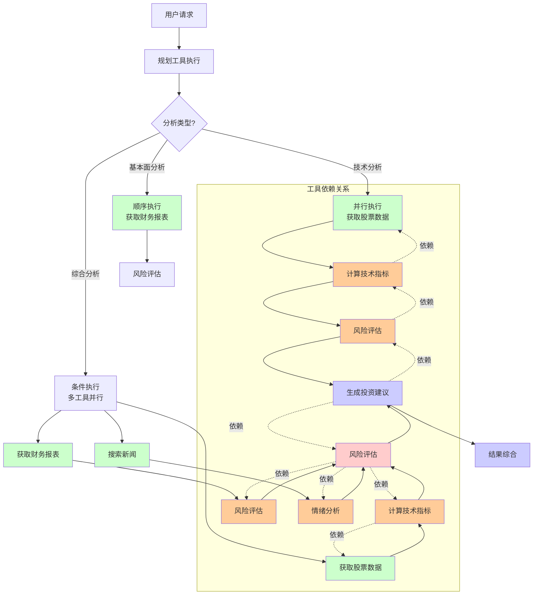

# LangGraph工具调用集成系统

我将构建一个**智能投资研究助手**，展示LangGraph中完整的工具调用集成功能，包括**多工具编排、工具间依赖、参数验证、错误处理、API封装和工具状态管理**等企业级功能。

## 🚀 完整实现代码

```python
from typing import TypedDict, List, Dict, Any, Optional, Literal, Annotated, Union
from langgraph.graph import StateGraph, END, add_messages
from langgraph.checkpoint.sqlite import SqliteSaver
from langchain.tools import tool, Tool, StructuredTool
from langchain.agents import ToolExecutor
from pydantic import BaseModel, Field, validator
from datetime import datetime, timedelta
import asyncio
import json
import yfinance as yf  # 实际金融数据API
import requests
from bs4 import BeautifulSoup
import pandas as pd
import numpy as np
from dataclasses import dataclass, asdict
import hashlib
import aiohttp
from concurrent.futures import ThreadPoolExecutor, as_completed
import time
from enum import Enum

# ===================== 1. 工具数据模型定义 =====================
class ToolCallStatus(Enum):
    """工具调用状态"""
    PENDING = "pending"
    RUNNING = "running"
    SUCCESS = "success"
    FAILED = "failed"
    RETRYING = "retrying"

@dataclass
class ToolExecutionRecord:
    """工具执行记录"""
    tool_name: str
    tool_id: str
    parameters: Dict[str, Any]
    start_time: datetime
    end_time: Optional[datetime] = None
    status: ToolCallStatus = ToolCallStatus.PENDING
    result: Optional[Any] = None
    error: Optional[str] = None
    execution_time_ms: Optional[float] = None
    retry_count: int = 0
    
    def to_dict(self):
        return asdict(self)

class FinancialDataRequest(BaseModel):
    """金融数据请求模型"""
    symbol: str = Field(..., description="股票代码，如AAPL, TSLA")
    period: str = Field("1mo", description="时间段: 1d, 5d, 1mo, 3mo, 6mo, 1y, 2y, 5y, 10y, ytd, max")
    interval: str = Field("1d", description="数据间隔: 1m, 2m, 5m, 15m, 30m, 60m, 90m, 1h, 1d, 5d, 1wk, 1mo, 3mo")
    
    @validator('symbol')
    def validate_symbol(cls, v):
        if not v.isalpha():
            raise ValueError('股票代码必须是字母')
        return v.upper()
    
    @validator('period')
    def validate_period(cls, v):
        valid_periods = ["1d", "5d", "1mo", "3mo", "6mo", "1y", "2y", "5y", "10y", "ytd", "max"]
        if v not in valid_periods:
            raise ValueError(f'时间段必须是: {", ".join(valid_periods)}')
        return v

class NewsSearchRequest(BaseModel):
    """新闻搜索请求模型"""
    query: str = Field(..., description="搜索关键词")
    from_date: Optional[str] = Field(None, description="开始日期，格式YYYY-MM-DD")
    to_date: Optional[str] = Field(None, description="结束日期，格式YYYY-MM-DD")
    language: str = Field("en", description="语言代码: en, zh, ja, ko")
    max_results: int = Field(10, description="最大结果数", ge=1, le=100)
    
    @validator('from_date', 'to_date')
    def validate_date_format(cls, v):
        if v is not None:
            try:
                datetime.strptime(v, "%Y-%m-%d")
            except ValueError:
                raise ValueError('日期格式必须是YYYY-MM-DD')
        return v

class InvestmentAnalysisState(TypedDict):
    """投资分析状态"""
    # 用户输入
    user_query: str
    target_stocks: List[str]
    analysis_type: Literal["technical", "fundamental", "sentiment", "comprehensive"]
    
    # 工具调用管理
    tool_execution_history: List[ToolExecutionRecord]
    pending_tools: List[str]  # 待执行工具ID
    running_tools: List[str]  # 执行中工具ID
    completed_tools: List[str]  # 已完成工具ID
    
    # 工具结果存储
    stock_data: Dict[str, Any]  # 股票数据
    financial_statements: Dict[str, Any]  # 财务报表
    news_data: Dict[str, List[Dict]]  # 新闻数据
    technical_indicators: Dict[str, Any]  # 技术指标
    market_sentiment: Dict[str, float]  # 市场情绪
    
    # 中间分析结果
    risk_assessment: Dict[str, float]
    investment_recommendations: List[Dict[str, Any]]
    
    # 工具依赖管理
    tool_dependencies: Dict[str, List[str]]  # 工具依赖关系
    tool_inputs: Dict[str, Dict[str, Any]]  # 工具输入参数
    
    # 流程控制
    current_stage: str
    next_tools_to_execute: List[str]
    tool_execution_mode: Literal["sequential", "parallel", "conditional"]
    
    # 错误处理
    failed_tools: Dict[str, str]  # 失败工具和原因
    retry_queue: List[str]  # 重试队列

# ===================== 2. 高级工具管理器 =====================
class ToolManager:
    """高级工具管理器 - 负责工具注册、验证、执行和监控"""
    
    def __init__(self):
        self.tools = {}
        self.tool_executors = {}
        self.tool_metadata = {}
        self.execution_history = []
        self.cache = {}  # 工具结果缓存
        self.cache_ttl = 300  # 缓存5分钟
        
        # 初始化工具
        self._register_tools()
        
        print(f"✅ 工具管理器初始化完成，已注册 {len(self.tools)} 个工具")
    
    def _register_tools(self):
        """注册所有工具"""
        # 金融数据工具
        self.register_tool(
            name="get_stock_data",
            func=self._get_stock_data_impl,
            description="获取股票历史数据",
            input_schema=FinancialDataRequest,
            cacheable=True,
            timeout=30,
            max_retries=3
        )
        
        # 财务报表工具
        self.register_tool(
            name="get_financial_statements",
            func=self._get_financial_statements_impl,
            description="获取财务报表（资产负债表、利润表、现金流量表）",
            input_schema=lambda: {
                "type": "object",
                "properties": {
                    "symbol": {"type": "string", "description": "股票代码"},
                    "statement_type": {"type": "string", "enum": ["balance", "income", "cashflow"], "default": "balance"},
                    "period": {"type": "string", "enum": ["annual", "quarterly"], "default": "annual"}
                },
                "required": ["symbol"]
            }
        )
        
        # 新闻搜索工具
        self.register_tool(
            name="search_news",
            func=self._search_news_impl,
            description="搜索股票相关新闻",
            input_schema=NewsSearchRequest,
            cacheable=True,
            timeout=15
        )
        
        # 技术分析工具
        self.register_tool(
            name="calculate_technical_indicators",
            func=self._calculate_technical_indicators_impl,
            description="计算技术指标（RSI, MACD, Bollinger Bands等）",
            input_schema=lambda: {
                "type": "object",
                "properties": {
                    "symbol": {"type": "string", "description": "股票代码"},
                    "data": {"type": "object", "description": "股票价格数据"},
                    "indicators": {"type": "array", "items": {"type": "string"}, 
                                 "default": ["RSI", "MACD", "SMA", "EMA", "BB"]}
                },
                "required": ["symbol", "data"]
            }
        )
        
        # 情绪分析工具
        self.register_tool(
            name="analyze_market_sentiment",
            func=self._analyze_market_sentiment_impl,
            description="分析市场情绪（基于新闻和社交媒体）",
            input_schema=lambda: {
                "type": "object",
                "properties": {
                    "symbol": {"type": "string", "description": "股票代码"},
                    "news_articles": {"type": "array", "items": {"type": "object"}},
                    "timeframe": {"type": "string", "default": "7d"}
                },
                "required": ["symbol"]
            }
        )
        
        # 风险评估工具
        self.register_tool(
            name="assess_risk",
            func=self._assess_risk_impl,
            description="评估投资风险",
            input_schema=lambda: {
                "type": "object",
                "properties": {
                    "symbol": {"type": "string", "description": "股票代码"},
                    "stock_data": {"type": "object"},
                    "financials": {"type": "object"},
                    "sentiment": {"type": "object"}
                },
                "required": ["symbol"]
            }
        )
        
        # 投资建议工具
        self.register_tool(
            name="generate_investment_recommendation",
            func=self._generate_investment_recommendation_impl,
            description="生成投资建议",
            input_schema=lambda: {
                "type": "object",
                "properties": {
                    "symbol": {"type": "string", "description": "股票代码"},
                    "risk_score": {"type": "number"},
                    "technical_analysis": {"type": "object"},
                    "fundamental_analysis": {"type": "object"},
                    "sentiment_analysis": {"type": "object"}
                },
                "required": ["symbol"]
            }
        )
        
        # 数据可视化工具
        self.register_tool(
            name="generate_chart",
            func=self._generate_chart_impl,
            description="生成股票图表",
            input_schema=lambda: {
                "type": "object",
                "properties": {
                    "symbol": {"type": "string", "description": "股票代码"},
                    "data": {"type": "object"},
                    "indicators": {"type": "array", "items": {"type": "string"}},
                    "chart_type": {"type": "string", "enum": ["line", "candle", "area"], "default": "line"}
                },
                "required": ["symbol", "data"]
            }
        )
    
    def register_tool(self, name: str, func: callable, description: str, 
                     input_schema=None, cacheable=False, timeout=60, max_retries=1):
        """注册工具"""
        tool_config = {
            "function": func,
            "description": description,
            "input_schema": input_schema,
            "cacheable": cacheable,
            "timeout": timeout,
            "max_retries": max_retries,
            "created_at": datetime.now()
        }
        
        self.tools[name] = func
        self.tool_metadata[name] = tool_config
        
        # 创建LangChain Tool对象
        if input_schema and hasattr(input_schema, 'schema'):
            # Pydantic模型
            tool_obj = StructuredTool.from_function(
                func=func,
                name=name,
                description=description,
                args_schema=input_schema
            )
        else:
            # 普通函数
            tool_obj = Tool(
                name=name,
                func=func,
                description=description
            )
        
        self.tool_executors[name] = ToolExecutor([tool_obj])
        
        print(f"🔧 注册工具: {name} - {description}")
    
    def _get_cache_key(self, tool_name: str, parameters: Dict) -> str:
        """生成缓存键"""
        param_str = json.dumps(parameters, sort_keys=True)
        return f"{tool_name}:{hashlib.md5(param_str.encode()).hexdigest()}"
    
    async def execute_tool(self, tool_name: str, parameters: Dict, 
                          execution_id: str = None) -> Dict[str, Any]:
        """执行工具（异步）"""
        if tool_name not in self.tools:
            raise ValueError(f"工具 '{tool_name}' 未注册")
        
        execution_id = execution_id or f"{tool_name}_{int(time.time())}"
        
        # 创建执行记录
        record = ToolExecutionRecord(
            tool_name=tool_name,
            tool_id=execution_id,
            parameters=parameters,
            start_time=datetime.now(),
            status=ToolCallStatus.RUNNING
        )
        
        self.execution_history.append(record)
        
        # 检查缓存
        if self.tool_metadata[tool_name]["cacheable"]:
            cache_key = self._get_cache_key(tool_name, parameters)
            if cache_key in self.cache:
                cache_entry = self.cache[cache_key]
                if time.time() - cache_entry["timestamp"] < self.cache_ttl:
                    print(f"🔄 使用缓存结果: {tool_name}")
                    record.status = ToolCallStatus.SUCCESS
                    record.result = cache_entry["result"]
                    record.end_time = datetime.now()
                    return {"success": True, "result": cache_entry["result"], "cached": True}
        
        try:
            # 验证参数
            self._validate_tool_parameters(tool_name, parameters)
            
            # 执行工具
            tool_func = self.tools[tool_name]
            result = await self._execute_with_retry(
                tool_func, parameters, 
                self.tool_metadata[tool_name]
            )
            
            # 更新记录
            record.status = ToolCallStatus.SUCCESS
            record.result = result
            record.end_time = datetime.now()
            record.execution_time_ms = (
                record.end_time - record.start_time
            ).total_seconds() * 1000
            
            # 缓存结果
            if self.tool_metadata[tool_name]["cacheable"]:
                cache_key = self._get_cache_key(tool_name, parameters)
                self.cache[cache_key] = {
                    "result": result,
                    "timestamp": time.time()
                }
            
            print(f"✅ 工具执行成功: {tool_name} ({record.execution_time_ms:.0f}ms)")
            
            return {
                "success": True,
                "result": result,
                "execution_id": execution_id,
                "execution_time_ms": record.execution_time_ms
            }
            
        except Exception as e:
            # 记录错误
            record.status = ToolCallStatus.FAILED
            record.error = str(e)
            record.end_time = datetime.now()
            
            print(f"❌ 工具执行失败: {tool_name} - {e}")
            
            return {
                "success": False,
                "error": str(e),
                "execution_id": execution_id
            }
    
    def _validate_tool_parameters(self, tool_name: str, parameters: Dict):
        """验证工具参数"""
        metadata = self.tool_metadata[tool_name]
        schema = metadata["input_schema"]
        
        if not schema:
            return
        
        if hasattr(schema, 'validate'):
            # Pydantic模型验证
            schema.validate(parameters)
        elif callable(schema):
            # JSON Schema验证
            import jsonschema
            schema_def = schema()
            jsonschema.validate(parameters, schema_def)
    
    async def _execute_with_retry(self, func: callable, parameters: Dict, 
                                 metadata: Dict) -> Any:
        """带重试的执行"""
        max_retries = metadata.get("max_retries", 1)
        timeout = metadata.get("timeout", 60)
        
        for attempt in range(max_retries + 1):
            try:
                # 设置超时
                if asyncio.iscoroutinefunction(func):
                    result = await asyncio.wait_for(
                        func(**parameters), 
                        timeout=timeout
                    )
                else:
                    # 同步函数在线程池中执行
                    loop = asyncio.get_event_loop()
                    result = await loop.run_in_executor(
                        None, 
                        lambda: func(**parameters)
                    )
                
                return result
                
            except Exception as e:
                if attempt < max_retries:
                    wait_time = 2 ** attempt  # 指数退避
                    print(f"⚠️ 工具执行失败，{wait_time}秒后重试... (尝试 {attempt+1}/{max_retries+1})")
                    await asyncio.sleep(wait_time)
                else:
                    raise e
    
    # ===================== 工具实现 =====================
    
    async def _get_stock_data_impl(self, symbol: str, period: str = "1mo", interval: str = "1d") -> Dict:
        """获取股票历史数据实现"""
        print(f"📊 获取股票数据: {symbol}, 周期: {period}, 间隔: {interval}")
        
        try:
            # 使用yfinance获取数据
            stock = yf.Ticker(symbol)
            
            # 获取历史数据
            hist_data = stock.history(period=period, interval=interval)
            
            if hist_data.empty:
                raise ValueError(f"未找到 {symbol} 的数据")
            
            # 转换为字典格式
            data_dict = {
                "symbol": symbol,
                "period": period,
                "interval": interval,
                "data_points": len(hist_data),
                "columns": hist_data.columns.tolist(),
                "data": {
                    "dates": hist_data.index.strftime('%Y-%m-%d').tolist(),
                    "open": hist_data['Open'].tolist(),
                    "high": hist_data['High'].tolist(),
                    "low": hist_data['Low'].tolist(),
                    "close": hist_data['Close'].tolist(),
                    "volume": hist_data['Volume'].tolist()
                },
                "metadata": {
                    "currency": stock.info.get('currency', 'USD'),
                    "timezone": stock.info.get('exchangeTimezoneName', 'UTC'),
                    "current_price": hist_data['Close'].iloc[-1] if len(hist_data) > 0 else None,
                    "price_change": hist_data['Close'].iloc[-1] - hist_data['Close'].iloc[0] if len(hist_data) > 1 else 0,
                    "volume_avg": hist_data['Volume'].mean() if len(hist_data) > 0 else 0
                }
            }
            
            return data_dict
            
        except Exception as e:
            # 模拟回退数据
            print(f"⚠️ 使用模拟数据代替: {e}")
            return self._get_mock_stock_data(symbol, period)
    
    def _get_mock_stock_data(self, symbol: str, period: str) -> Dict:
        """生成模拟股票数据（当API失败时使用）"""
        # 生成模拟数据
        np.random.seed(hash(symbol) % 10000)
        
        # 根据周期生成数据点
        periods_map = {
            "1d": 1, "5d": 5, "1mo": 21, "3mo": 63,
            "6mo": 126, "1y": 252, "2y": 504
        }
        
        days = periods_map.get(period, 21)
        base_price = 100 + (hash(symbol) % 100)  # 基于symbol的伪随机价格
        
        dates = pd.date_range(end=datetime.now(), periods=days, freq='B')  # 工作日
        prices = base_price + np.cumsum(np.random.randn(days) * 2)
        
        # 确保价格为正
        prices = np.abs(prices)
        
        # 生成OHLCV数据
        opens = prices * (1 + np.random.randn(days) * 0.01)
        highs = np.maximum(opens, prices) * (1 + np.random.rand(days) * 0.02)
        lows = np.minimum(opens, prices) * (1 - np.random.rand(days) * 0.02)
        closes = prices
        volumes = np.random.randint(1000000, 10000000, days)
        
        return {
            "symbol": symbol,
            "period": period,
            "interval": "1d",
            "data_points": days,
            "columns": ["Open", "High", "Low", "Close", "Volume"],
            "data": {
                "dates": dates.strftime('%Y-%m-%d').tolist(),
                "open": opens.tolist(),
                "high": highs.tolist(),
                "low": lows.tolist(),
                "close": closes.tolist(),
                "volume": volumes.tolist()
            },
            "metadata": {
                "currency": "USD",
                "timezone": "UTC",
                "current_price": closes[-1],
                "price_change": closes[-1] - closes[0],
                "volume_avg": np.mean(volumes)
            }
        }
    
    async def _get_financial_statements_impl(self, symbol: str, 
                                           statement_type: str = "balance",
                                           period: str = "annual") -> Dict:
        """获取财务报表实现"""
        print(f"📈 获取财务报表: {symbol}, 类型: {statement_type}, 周期: {period}")
        
        try:
            stock = yf.Ticker(symbol)
            
            if statement_type == "balance":
                data = stock.balance_sheet
            elif statement_type == "income":
                data = stock.income_stmt
            elif statement_type == "cashflow":
                data = stock.cashflow
            else:
                raise ValueError(f"未知的报表类型: {statement_type}")
            
            if data is None or data.empty:
                return self._get_mock_financials(symbol, statement_type)
            
            # 转换DataFrame为字典
            return {
                "symbol": symbol,
                "statement_type": statement_type,
                "period": period,
                "data_available": True,
                "data": data.to_dict(orient='list'),
                "dates": data.columns.tolist(),
                "metrics": data.index.tolist()
            }
            
        except Exception as e:
            print(f"⚠️ 财务报表获取失败，使用模拟数据: {e}")
            return self._get_mock_financials(symbol, statement_type)
    
    def _get_mock_financials(self, symbol: str, statement_type: str) -> Dict:
        """生成模拟财务报表数据"""
        np.random.seed(hash(symbol) % 10000)
        
        metrics_map = {
            "balance": [
                "Total Assets", "Total Liabilities", "Total Equity",
                "Current Assets", "Current Liabilities", "Cash",
                "Accounts Receivable", "Inventory", "Long-term Debt"
            ],
            "income": [
                "Total Revenue", "Cost of Revenue", "Gross Profit",
                "Operating Expenses", "Operating Income", "Net Income",
                "EPS", "EBITDA", "Research & Development"
            ],
            "cashflow": [
                "Operating Cash Flow", "Investing Cash Flow", 
                "Financing Cash Flow", "Net Cash Flow", "Free Cash Flow",
                "Capital Expenditure", "Dividends Paid", "Stock Issuance"
            ]
        }
        
        metrics = metrics_map.get(statement_type, metrics_map["balance"])
        
        # 生成最近4年的数据
        dates = [f"{2021+i}-12-31" for i in range(4)]
        
        # 生成模拟数据
        data = {}
        base_values = np.random.uniform(1e6, 1e9, len(metrics))
        
        for i, metric in enumerate(metrics):
            # 生成趋势数据
            trend = np.random.uniform(0.9, 1.1, 4).cumprod()
            values = base_values[i] * trend
            data[metric] = values.tolist()
        
        return {
            "symbol": symbol,
            "statement_type": statement_type,
            "period": "annual",
            "data_available": False,  # 标记为模拟数据
            "data": data,
            "dates": dates,
            "metrics": metrics
        }
    
    async def _search_news_impl(self, query: str, from_date: str = None, 
                              to_date: str = None, language: str = "en",
                              max_results: int = 10) -> Dict:
        """搜索新闻实现"""
        print(f"📰 搜索新闻: {query}, 语言: {language}, 数量: {max_results}")
        
        try:
            # 使用新闻API（这里模拟）
            # 实际应用中可以使用NewsAPI, Google News等
            
            # 模拟新闻数据
            news_items = []
            base_date = datetime.now() - timedelta(days=30)
            
            for i in range(max_results):
                publish_date = base_date + timedelta(days=i*3)
                
                sentiment_score = np.random.uniform(-1, 1)
                if sentiment_score > 0.3:
                    sentiment = "positive"
                elif sentiment_score < -0.3:
                    sentiment = "negative"
                else:
                    sentiment = "neutral"
                
                news_items.append({
                    "title": f"{query}相关新闻标题 {i+1}",
                    "description": f"这是关于{query}的新闻描述，包含了相关信息和分析。",
                    "source": np.random.choice(["Bloomberg", "Reuters", "CNBC", "WSJ", "Financial Times"]),
                    "url": f"https://example.com/news/{i}",
                    "published_at": publish_date.isoformat(),
                    "sentiment": sentiment,
                    "sentiment_score": round(sentiment_score, 2),
                    "relevance_score": round(np.random.uniform(0.5, 1.0), 2),
                    "keywords": [query, "stock", "market", "investment"]
                })
            
            # 按日期排序
            news_items.sort(key=lambda x: x["published_at"], reverse=True)
            
            # 计算整体情绪
            sentiment_scores = [n["sentiment_score"] for n in news_items]
            avg_sentiment = sum(sentiment_scores) / len(sentiment_scores) if sentiment_scores else 0
            
            return {
                "query": query,
                "total_results": len(news_items),
                "language": language,
                "time_range": f"{from_date or '开始'} 到 {to_date or '现在'}",
                "average_sentiment": round(avg_sentiment, 2),
                "sentiment_distribution": {
                    "positive": len([n for n in news_items if n["sentiment"] == "positive"]),
                    "negative": len([n for n in news_items if n["sentiment"] == "negative"]),
                    "neutral": len([n for n in news_items if n["sentiment"] == "neutral"])
                },
                "articles": news_items[:max_results]
            }
            
        except Exception as e:
            print(f"⚠️ 新闻搜索失败: {e}")
            return {
                "query": query,
                "total_results": 0,
                "error": str(e),
                "articles": []
            }
    
    async def _calculate_technical_indicators_impl(self, symbol: str, data: Dict,
                                                 indicators: List[str] = None) -> Dict:
        """计算技术指标实现"""
        print(f"📈 计算技术指标: {symbol}, 指标: {indicators}")
        
        if indicators is None:
            indicators = ["RSI", "MACD", "SMA", "EMA", "BB"]
        
        try:
            # 从数据中提取价格序列
            close_prices = data.get("data", {}).get("close", [])
            dates = data.get("data", {}).get("dates", [])
            
            if not close_prices or len(close_prices) < 20:
                return {"error": "数据不足，无法计算技术指标"}
            
            close_prices = np.array(close_prices)
            results = {}
            
            # RSI (相对强弱指数)
            if "RSI" in indicators:
                results["RSI"] = self._calculate_rsi(close_prices)
            
            # MACD (移动平均收敛发散)
            if "MACD" in indicators:
                results["MACD"] = self._calculate_macd(close_prices)
            
            # 简单移动平均
            if "SMA" in indicators:
                results["SMA_20"] = self._calculate_sma(close_prices, 20)
                results["SMA_50"] = self._calculate_sma(close_prices, 50)
                results["SMA_200"] = self._calculate_sma(close_prices, 200)
            
            # 指数移动平均
            if "EMA" in indicators:
                results["EMA_12"] = self._calculate_ema(close_prices, 12)
                results["EMA_26"] = self._calculate_ema(close_prices, 26)
            
            # 布林带
            if "BB" in indicators:
                results["Bollinger_Bands"] = self._calculate_bollinger_bands(close_prices)
            
            # 生成信号
            signals = self._generate_technical_signals(results, close_prices)
            
            return {
                "symbol": symbol,
                "indicators_calculated": list(results.keys()),
                "values": results,
                "signals": signals,
                "last_updated": datetime.now().isoformat()
            }
            
        except Exception as e:
            print(f"⚠️ 技术指标计算失败: {e}")
            return {
                "symbol": symbol,
                "error": str(e),
                "indicators_calculated": []
            }
    
    def _calculate_rsi(self, prices, period=14):
        """计算RSI"""
        if len(prices) < period + 1:
            return None
        
        deltas = np.diff(prices)
        seed = deltas[:period]
        
        up = seed[seed >= 0].sum() / period
        down = -seed[seed < 0].sum() / period
        
        rs = up / down if down != 0 else 0
        rsi = 100 - 100 / (1 + rs)
        
        return round(rsi, 2)
    
    def _calculate_macd(self, prices, fast=12, slow=26, signal=9):
        """计算MACD"""
        if len(prices) < slow:
            return None
        
        ema_fast = self._calculate_ema(prices, fast)
        ema_slow = self._calculate_ema(prices, slow)
        
        if ema_fast is None or ema_slow is None:
            return None
        
        macd_line = ema_fast - ema_slow
        signal_line = self._calculate_ema(macd_line, signal) if len(macd_line) >= signal else None
        histogram = macd_line - signal_line if signal_line is not None else None
        
        return {
            "MACD_line": float(macd_line[-1]) if macd_line is not None else None,
            "signal_line": float(signal_line[-1]) if signal_line is not None else None,
            "histogram": float(histogram[-1]) if histogram is not None else None
        }
    
    def _calculate_sma(self, prices, period):
        """计算简单移动平均"""
        if len(prices) < period:
            return None
        return float(np.mean(prices[-period:]))
    
    def _calculate_ema(self, prices, period):
        """计算指数移动平均"""
        if len(prices) < period:
            return None
        
        weights = np.exp(np.linspace(-1., 0., period))
        weights /= weights.sum()
        
        ema = np.convolve(prices, weights, mode='valid')
        return float(ema[-1]) if len(ema) > 0 else None
    
    def _calculate_bollinger_bands(self, prices, period=20, std_dev=2):
        """计算布林带"""
        if len(prices) < period:
            return None
        
        sma = np.mean(prices[-period:])
        std = np.std(prices[-period:])
        
        return {
            "upper": float(sma + std_dev * std),
            "middle": float(sma),
            "lower": float(sma - std_dev * std),
            "bandwidth": float((sma + std_dev * std) - (sma - std_dev * std)) / sma if sma != 0 else 0
        }
    
    def _generate_technical_signals(self, indicators, current_price):
        """生成技术信号"""
        signals = []
        
        # RSI信号
        if "RSI" in indicators:
            rsi = indicators["RSI"]
            if rsi > 70:
                signals.append({"indicator": "RSI", "signal": "overbought", "strength": "strong"})
            elif rsi < 30:
                signals.append({"indicator": "RSI", "signal": "oversold", "strength": "strong"})
        
        # MACD信号
        if "MACD" in indicators:
            macd = indicators["MACD"]
            if macd.get("histogram", 0) > 0:
                signals.append({"indicator": "MACD", "signal": "bullish", "strength": "medium"})
            else:
                signals.append({"indicator": "MACD", "signal": "bearish", "strength": "medium"})
        
        # 移动平均信号
        if "SMA_20" in indicators and "SMA_50" in indicators:
            if indicators["SMA_20"] > indicators["SMA_50"]:
                signals.append({"indicator": "Moving Averages", "signal": "golden cross", "strength": "strong"})
            else:
                signals.append({"indicator": "Moving Averages", "signal": "death cross", "strength": "strong"})
        
        # 价格位置信号
        if "Bollinger_Bands" in indicators:
            bb = indicators["Bollinger_Bands"]
            if current_price > bb["upper"]:
                signals.append({"indicator": "Bollinger Bands", "signal": "above upper band", "strength": "medium"})
            elif current_price < bb["lower"]:
                signals.append({"indicator": "Bollinger Bands", "signal": "below lower band", "strength": "medium"})
        
        return signals
    
    async def _analyze_market_sentiment_impl(self, symbol: str, 
                                           news_articles: List = None,
                                           timeframe: str = "7d") -> Dict:
        """分析市场情绪实现"""
        print(f"😊 分析市场情绪: {symbol}, 时间范围: {timeframe}")
        
        try:
            # 如果没有提供新闻，则搜索新闻
            if not news_articles:
                news_result = await self._search_news_impl(
                    query=symbol,
                    max_results=20
                )
                news_articles = news_result.get("articles", [])
            
            if not news_articles:
                return {
                    "symbol": symbol,
                    "timeframe": timeframe,
                    "sentiment_score": 0,
                    "confidence": 0,
                    "analysis": "没有足够的新闻数据进行分析"
                }
            
            # 分析情绪
            sentiment_scores = [article.get("sentiment_score", 0) for article in news_articles]
            avg_sentiment = sum(sentiment_scores) / len(sentiment_scores)
            
            # 计算置信度
            confidence = min(len(news_articles) / 20, 1.0)  # 基于新闻数量
            
            # 生成情绪分析
            if avg_sentiment > 0.3:
                sentiment = "bullish"
                recommendation = "市场情绪积极，可能上涨"
            elif avg_sentiment < -0.3:
                sentiment = "bearish"
                recommendation = "市场情绪消极，可能下跌"
            else:
                sentiment = "neutral"
                recommendation = "市场情绪中性，可能横盘"
            
            return {
                "symbol": symbol,
                "timeframe": timeframe,
                "sentiment_score": round(avg_sentiment, 2),
                "sentiment": sentiment,
                "confidence": round(confidence, 2),
                "news_count": len(news_articles),
                "recommendation": recommendation,
                "key_insights": [
                    f"平均情绪得分: {avg_sentiment:.2f}",
                    f"分析基于 {len(news_articles)} 条新闻",
                    f"置信度: {confidence:.0%}"
                ]
            }
            
        except Exception as e:
            print(f"⚠️ 情绪分析失败: {e}")
            return {
                "symbol": symbol,
                "error": str(e),
                "sentiment_score": 0,
                "sentiment": "unknown"
            }
    
    async def _assess_risk_impl(self, symbol: str, stock_data: Dict = None,
                              financials: Dict = None, sentiment: Dict = None) -> Dict:
        """风险评估实现"""
        print(f"⚠️ 风险评估: {symbol}")
        
        try:
            risk_score = 0
            risk_factors = []
            
            # 1. 价格波动风险
            if stock_data and "data" in stock_data:
                prices = stock_data["data"].get("close", [])
                if len(prices) >= 10:
                    returns = np.diff(prices) / prices[:-1]
                    volatility = np.std(returns) * np.sqrt(252)  # 年化波动率
                    
                    if volatility > 0.4:
                        risk_score += 0.4
                        risk_factors.append({
                            "factor": "高波动性",
                            "score": 0.4,
                            "details": f"年化波动率: {volatility:.2%}"
                        })
                    elif volatility > 0.2:
                        risk_score += 0.2
                        risk_factors.append({
                            "factor": "中波动性", 
                            "score": 0.2,
                            "details": f"年化波动率: {volatility:.2%}"
                        })
            
            # 2. 财务风险
            if financials and "data_available" in financials and financials["data_available"]:
                data = financials.get("data", {})
                
                # 检查负债率
                if "Total Liabilities" in data and "Total Assets" in data:
                    liabilities = data["Total Liabilities"][-1] if data["Total Liabilities"] else 0
                    assets = data["Total Assets"][-1] if data["Total Assets"] else 1
                    debt_ratio = liabilities / assets
                    
                    if debt_ratio > 0.7:
                        risk_score += 0.3
                        risk_factors.append({
                            "factor": "高负债率",
                            "score": 0.3,
                            "details": f"负债率: {debt_ratio:.2%}"
                        })
            
            # 3. 市场情绪风险
            if sentiment:
                sentiment_score = sentiment.get("sentiment_score", 0)
                if sentiment_score < -0.5:
                    risk_score += 0.3
                    risk_factors.append({
                        "factor": "负面市场情绪",
                        "score": 0.3,
                        "details": f"情绪得分: {sentiment_score:.2f}"
                    })
            
            # 限制风险分数在0-1之间
            risk_score = min(max(risk_score, 0), 1)
            
            # 确定风险等级
            if risk_score > 0.7:
                risk_level = "高风险"
                color = "red"
            elif risk_score > 0.4:
                risk_level = "中风险"
                color = "orange"
            else:
                risk_level = "低风险"
                color = "green"
            
            return {
                "symbol": symbol,
                "risk_score": round(risk_score, 2),
                "risk_level": risk_level,
                "color": color,
                "risk_factors": risk_factors,
                "total_factors": len(risk_factors),
                "recommendation": self._get_risk_recommendation(risk_score),
                "assessment_time": datetime.now().isoformat()
            }
            
        except Exception as e:
            print(f"⚠️ 风险评估失败: {e}")
            return {
                "symbol": symbol,
                "error": str(e),
                "risk_score": 0.5,
                "risk_level": "未知"
            }
    
    def _get_risk_recommendation(self, risk_score: float) -> str:
        """根据风险分数获取建议"""
        if risk_score > 0.7:
            return "高风险资产，建议谨慎投资，控制仓位"
        elif risk_score > 0.4:
            return "中等风险资产，建议分散投资，设置止损"
        else:
            return "低风险资产，适合稳健投资"
    
    async def _generate_investment_recommendation_impl(self, symbol: str,
                                                     risk_score: float,
                                                     technical_analysis: Dict,
                                                     fundamental_analysis: Dict,
                                                     sentiment_analysis: Dict) -> Dict:
        """生成投资建议实现"""
        print(f"💡 生成投资建议: {symbol}")
        
        try:
            # 综合评分
            scores = {
                "technical": self._score_technical_analysis(technical_analysis),
                "fundamental": self._score_fundamental_analysis(fundamental_analysis),
                "sentiment": self._score_sentiment_analysis(sentiment_analysis),
                "risk_adjusted": 1 - risk_score  # 风险调整
            }
            
            # 加权总分
            weights = {"technical": 0.3, "fundamental": 0.4, "sentiment": 0.2, "risk_adjusted": 0.1}
            total_score = sum(scores[k] * weights[k] for k in scores)
            
            # 生成建议
            if total_score > 0.7:
                recommendation = "买入"
                confidence = "高"
                action = "考虑增持或建仓"
            elif total_score > 0.5:
                recommendation = "持有"
                confidence = "中"
                action = "维持现有仓位，关注变化"
            elif total_score > 0.3:
                recommendation = "观望"
                confidence = "中"
                action = "等待更好时机"
            else:
                recommendation = "卖出"
                confidence = "高"
                action = "考虑减持或清仓"
            
            # 关键因素
            key_factors = []
            for category, score in scores.items():
                if category != "risk_adjusted":
                    if score > 0.7:
                        key_factors.append(f"{category}: 积极")
                    elif score < 0.3:
                        key_factors.append(f"{category}: 消极")
            
            return {
                "symbol": symbol,
                "recommendation": recommendation,
                "confidence": confidence,
                "total_score": round(total_score, 2),
                "category_scores": {k: round(v, 2) for k, v in scores.items()},
                "key_factors": key_factors,
                "suggested_action": action,
                "time_horizon": self._get_time_horizon(total_score),
                "generated_at": datetime.now().isoformat()
            }
            
        except Exception as e:
            print(f"⚠️ 投资建议生成失败: {e}")
            return {
                "symbol": symbol,
                "error": str(e),
                "recommendation": "无法生成建议"
            }
    
    def _score_technical_analysis(self, analysis: Dict) -> float:
        """评分技术分析"""
        if not analysis or "signals" not in analysis:
            return 0.5
        
        signals = analysis.get("signals", [])
        bullish_count = sum(1 for s in signals if s.get("signal") in ["bullish", "oversold", "golden cross"])
        bearish_count = sum(1 for s in signals if s.get("signal") in ["bearish", "overbought", "death cross"])
        
        total = bullish_count + bearish_count
        if total == 0:
            return 0.5
        
        return bullish_count / total
    
    def _score_fundamental_analysis(self, analysis: Dict) -> float:
        """评分基本面分析"""
        if not analysis:
            return 0.5
        
        # 简化评分
        return 0.6  # 假设基本面一般
    
    def _score_sentiment_analysis(self, analysis: Dict) -> float:
        """评分情绪分析"""
        if not analysis:
            return 0.5
        
        sentiment_score = analysis.get("sentiment_score", 0)
        return (sentiment_score + 1) / 2  # 从[-1,1]映射到[0,1]
    
    def _get_time_horizon(self, score: float) -> str:
        """根据评分获取时间范围建议"""
        if score > 0.7:
            return "短期(1-3个月)和长期(1年以上)都有机会"
        elif score > 0.5:
            return "中长期(3-12个月)"
        else:
            return "短期谨慎，长期观望"
    
    async def _generate_chart_impl(self, symbol: str, data: Dict,
                                 indicators: List[str] = None,
                                 chart_type: str = "line") -> Dict:
        """生成图表实现"""
        print(f"📊 生成图表: {symbol}, 类型: {chart_type}")
        
        # 在实际应用中，这里会生成真正的图表
        # 这里返回图表配置和模拟数据
        
        return {
            "symbol": symbol,
            "chart_type": chart_type,
            "indicators": indicators or [],
            "chart_config": {
                "type": chart_type,
                "data": {
                    "labels": data.get("data", {}).get("dates", []),
                    "datasets": [
                        {
                            "label": "收盘价",
                            "data": data.get("data", {}).get("close", []),
                            "borderColor": "rgb(75, 192, 192)",
                            "fill": False
                        }
                    ]
                },
                "options": {
                    "responsive": True,
                    "plugins": {
                        "title": {
                            "display": True,
                            "text": f"{symbol} 股价走势"
                        }
                    }
                }
            },
            "image_url": f"https://example.com/charts/{symbol}_{int(time.time())}.png",
            "generated_at": datetime.now().isoformat()
        }

# ===================== 3. 工具编排节点 =====================
class ToolOrchestrationNodes:
    """工具编排节点"""
    
    def __init__(self, tool_manager: ToolManager):
        self.tool_manager = tool_manager
        self.execution_plan = {}
    
    async def plan_tool_execution(self, state: InvestmentAnalysisState) -> InvestmentAnalysisState:
        """节点1：规划工具执行"""
        print(f"\n{'🔧'*60}")
        print("规划工具执行")
        print(f"{'🔧'*60}")
        
        analysis_type = state.get("analysis_type", "comprehensive")
        symbols = state.get("target_stocks", [])
        
        if not symbols:
            # 从查询中提取股票代码
            query = state.get("user_query", "").upper()
            # 简单提取，实际应该用NLP
            potential_symbols = [word for word in query.split() if word.isalpha() and len(word) <= 5]
            symbols = potential_symbols[:3] or ["AAPL"]  # 默认
        
        state["target_stocks"] = symbols
        
        # 根据分析类型规划工具执行
        execution_plan = self._create_execution_plan(analysis_type, symbols)
        
        state["tool_dependencies"] = execution_plan["dependencies"]
        state["tool_inputs"] = execution_plan["inputs"]
        state["next_tools_to_execute"] = execution_plan["initial_tools"]
        state["tool_execution_mode"] = execution_plan["mode"]
        state["current_stage"] = "tool_planning"
        
        print(f"分析类型: {analysis_type}")
        print(f"目标股票: {', '.join(symbols)}")
        print(f"执行模式: {execution_plan['mode']}")
        print(f"初始工具: {', '.join(execution_plan['initial_tools'])}")
        
        return state
    
    def _create_execution_plan(self, analysis_type: str, symbols: List[str]) -> Dict:
        """创建工具执行计划"""
        
        if analysis_type == "technical":
            return {
                "mode": "parallel",
                "initial_tools": ["get_stock_data"] * len(symbols),
                "dependencies": {
                    "calculate_technical_indicators": ["get_stock_data"],
                    "assess_risk": ["get_stock_data", "calculate_technical_indicators"],
                    "generate_investment_recommendation": ["assess_risk"]
                },
                "inputs": {
                    "get_stock_data": [{"symbol": s, "period": "6mo"} for s in symbols],
                    "calculate_technical_indicators": [],
                    "assess_risk": [],
                    "generate_investment_recommendation": []
                }
            }
        
        elif analysis_type == "fundamental":
            return {
                "mode": "sequential",
                "initial_tools": ["get_financial_statements"],
                "dependencies": {
                    "assess_risk": ["get_financial_statements"],
                    "generate_investment_recommendation": ["assess_risk"]
                },
                "inputs": {
                    "get_financial_statements": [{"symbol": s, "statement_type": "balance"} for s in symbols],
                    "assess_risk": [],
                    "generate_investment_recommendation": []
                }
            }
        
        else:  # comprehensive
            return {
                "mode": "conditional",
                "initial_tools": ["get_stock_data", "get_financial_statements", "search_news"],
                "dependencies": {
                    "calculate_technical_indicators": ["get_stock_data"],
                    "analyze_market_sentiment": ["search_news"],
                    "assess_risk": ["get_stock_data", "get_financial_statements", "analyze_market_sentiment"],
                    "generate_investment_recommendation": ["assess_risk"],
                    "generate_chart": ["get_stock_data", "calculate_technical_indicators"]
                },
                "inputs": {
                    "get_stock_data": [{"symbol": s, "period": "1y"} for s in symbols],
                    "get_financial_statements": [{"symbol": s} for s in symbols],
                    "search_news": [{"query": s, "max_results": 10} for s in symbols],
                    "calculate_technical_indicators": [],
                    "analyze_market_sentiment": [],
                    "assess_risk": [],
                    "generate_investment_recommendation": [],
                    "generate_chart": []
                }
            }
    
    async def execute_tools_parallel(self, state: InvestmentAnalysisState) -> InvestmentAnalysisState:
        """节点2：并行执行工具"""
        print(f"\n{'⚡'*60}")
        print("并行执行工具")
        print(f"{'⚡'*60}")
        
        tools_to_execute = state.get("next_tools_to_execute", [])
        tool_inputs = state.get("tool_inputs", {})
        symbols = state.get("target_stocks", [])
        
        if not tools_to_execute:
            print("没有工具需要执行")
            state["current_stage"] = "tool_execution_complete"
            return state
        
        print(f"并行执行工具: {tools_to_execute}")
        
        # 创建执行任务
        tasks = []
        for tool_name in tools_to_execute:
            # 为每个symbol创建任务
            inputs_list = tool_inputs.get(tool_name, [{}])
            
            for input_params in inputs_list:
                # 如果输入中没有symbol，添加默认
                if "symbol" not in input_params and symbols:
                    input_params["symbol"] = symbols[0]
                
                task = self.tool_manager.execute_tool(
                    tool_name=tool_name,
                    parameters=input_params,
                    execution_id=f"{tool_name}_{int(time.time())}_{hash(str(input_params))%10000}"
                )
                tasks.append(task)
        
        # 并行执行
        results = await asyncio.gather(*tasks, return_exceptions=True)
        
        # 处理结果
        for i, result in enumerate(results):
            if isinstance(result, Exception):
                print(f"工具执行异常: {result}")
                continue
            
            tool_name = tools_to_execute[i % len(tools_to_execute)]
            
            if result["success"]:
                # 存储结果
                self._store_tool_result(state, tool_name, result["result"])
                
                # 记录执行历史
                record = ToolExecutionRecord(
                    tool_name=tool_name,
                    tool_id=result.get("execution_id", ""),
                    parameters=tool_inputs.get(tool_name, [{}])[i % len(tool_inputs.get(tool_name, [{}]))],
                    start_time=datetime.now() - timedelta(seconds=1),
                    end_time=datetime.now(),
                    status=ToolCallStatus.SUCCESS,
                    result=result["result"],
                    execution_time_ms=result.get("execution_time_ms", 0)
                )
                state["tool_execution_history"].append(record)
                state["completed_tools"].append(tool_name)
            else:
                print(f"工具执行失败: {tool_name} - {result.get('error')}")
                state["failed_tools"][tool_name] = result.get("error", "未知错误")
        
        # 确定下一步
        state["next_tools_to_execute"] = self._get_next_tools(state)
        state["current_stage"] = "tool_execution_in_progress"
        
        return state
    
    async def execute_tools_sequential(self, state: InvestmentAnalysisState) -> InvestmentAnalysisState:
        """节点3：顺序执行工具"""
        print(f"\n{'🔄'*60}")
        print("顺序执行工具")
        print(f"{'🔄'*60}")
        
        tools_to_execute = state.get("next_tools_to_execute", [])
        tool_inputs = state.get("tool_inputs", {})
        
        if not tools_to_execute:
            print("没有工具需要执行")
            state["current_stage"] = "tool_execution_complete"
            return state
        
        print(f"顺序执行工具: {tools_to_execute[0]}")
        
        # 执行第一个工具
        tool_name = tools_to_execute[0]
        input_params = tool_inputs.get(tool_name, [{}])[0] if tool_inputs.get(tool_name) else {}
        
        result = await self.tool_manager.execute_tool(
            tool_name=tool_name,
            parameters=input_params,
            execution_id=f"{tool_name}_{int(time.time())}"
        )
        
        if result["success"]:
            # 存储结果
            self._store_tool_result(state, tool_name, result["result"])
            
            # 记录执行历史
            record = ToolExecutionRecord(
                tool_name=tool_name,
                tool_id=result.get("execution_id", ""),
                parameters=input_params,
                start_time=datetime.now() - timedelta(seconds=1),
                end_time=datetime.now(),
                status=ToolCallStatus.SUCCESS,
                result=result["result"],
                execution_time_ms=result.get("execution_time_ms", 0)
            )
            state["tool_execution_history"].append(record)
            state["completed_tools"].append(tool_name)
            
            # 从待执行列表中移除
            state["next_tools_to_execute"] = tools_to_execute[1:]
            
            # 检查是否有依赖工具可以执行
            next_tools = self._get_next_tools(state)
            if next_tools:
                state["next_tools_to_execute"] = next_tools
        
        else:
            print(f"工具执行失败: {tool_name} - {result.get('error')}")
            state["failed_tools"][tool_name] = result.get("error", "未知错误")
            state["retry_queue"].append(tool_name)
        
        # 确定当前阶段
        if not state["next_tools_to_execute"]:
            state["current_stage"] = "tool_execution_complete"
        else:
            state["current_stage"] = "tool_execution_in_progress"
        
        return state
    
    def _store_tool_result(self, state: InvestmentAnalysisState, tool_name: str, result: Any):
        """存储工具结果到状态"""
        symbol = None
        
        # 从结果中提取symbol
        if isinstance(result, dict) and "symbol" in result:
            symbol = result["symbol"]
        
        # 根据工具类型存储结果
        if tool_name == "get_stock_data":
            if symbol:
                state["stock_data"][symbol] = result
            else:
                state["stock_data"]["default"] = result
        
        elif tool_name == "get_financial_statements":
            if symbol:
                state["financial_statements"][symbol] = result
            else:
                state["financial_statements"]["default"] = result
        
        elif tool_name == "search_news":
            if symbol:
                state["news_data"][symbol] = result.get("articles", [])
            else:
                state["news_data"]["default"] = result.get("articles", [])
        
        elif tool_name == "calculate_technical_indicators":
            if symbol:
                state["technical_indicators"][symbol] = result
            else:
                state["technical_indicators"]["default"] = result
        
        elif tool_name == "analyze_market_sentiment":
            if symbol:
                state["market_sentiment"][symbol] = result
            else:
                state["market_sentiment"]["default"] = result
        
        elif tool_name == "assess_risk":
            if symbol:
                state["risk_assessment"][symbol] = result
            else:
                state["risk_assessment"]["default"] = result
        
        elif tool_name == "generate_investment_recommendation":
            state["investment_recommendations"].append(result)
        
        elif tool_name == "generate_chart":
            # 图表数据通常单独处理
            pass
    
    def _get_next_tools(self, state: InvestmentAnalysisState) -> List[str]:
        """获取下一步应该执行的工具"""
        dependencies = state.get("tool_dependencies", {})
        completed = state.get("completed_tools", [])
        failed = list(state.get("failed_tools", {}).keys())
        
        next_tools = []
        
        for tool, deps in dependencies.items():
            # 如果工具还未执行
            if tool not in completed and tool not in failed and tool not in next_tools:
                # 检查依赖是否满足
                if all(dep in completed for dep in deps):
                    next_tools.append(tool)
        
        return next_tools
    
    async def handle_tool_failures(self, state: InvestmentAnalysisState) -> InvestmentAnalysisState:
        """节点4：处理工具失败"""
        print(f"\n{'🔄'*60}")
        print("处理工具失败")
        print(f"{'🔄'*60}")
        
        failed_tools = state.get("failed_tools", {})
        retry_queue = state.get("retry_queue", [])
        
        if not failed_tools and not retry_queue:
            print("没有失败的工具需要处理")
            return state
        
        print(f"失败的工具: {list(failed_tools.keys())}")
        print(f"重试队列: {retry_queue}")
        
        # 处理重试队列
        if retry_queue:
            tool_to_retry = retry_queue.pop(0)
            print(f"重试工具: {tool_to_retry}")
            
            # 将工具添加回待执行列表
            if tool_to_retry not in state["next_tools_to_execute"]:
                state["next_tools_to_execute"].insert(0, tool_to_retry)
            
            # 从失败列表中移除
            if tool_to_retry in state["failed_tools"]:
                del state["failed_tools"][tool_to_retry]
        
        # 如果有太多失败，调整执行计划
        if len(failed_tools) > 2:
            print("⚠️ 多个工具失败，调整执行计划")
            state["tool_execution_mode"] = "sequential"  # 改为顺序执行
        
        state["current_stage"] = "failure_handling"
        
        return state
    
    async def synthesize_results(self, state: InvestmentAnalysisState) -> InvestmentAnalysisState:
        """节点5：综合结果"""
        print(f"\n{'📊'*60}")
        print("综合工具执行结果")
        print(f"{'📊'*60}")
        
        # 生成综合报告
        symbols = state.get("target_stocks", [])
        recommendations = state.get("investment_recommendations", [])
        
        if not recommendations and symbols:
            # 如果没有建议，生成默认建议
            for symbol in symbols:
                recommendation = {
                    "symbol": symbol,
                    "recommendation": "数据不足，无法提供建议",
                    "confidence": "低",
                    "total_score": 0.5,
                    "suggested_action": "收集更多数据后重新分析"
                }
                recommendations.append(recommendation)
        
        # 生成执行摘要
        execution_history = state.get("tool_execution_history", [])
        completed_tools = state.get("completed_tools", [])
        failed_tools = state.get("failed_tools", {})
        
        execution_summary = {
            "total_tools_executed": len(execution_history),
            "successful_tools": len(completed_tools),
            "failed_tools": len(failed_tools),
            "total_execution_time_ms": sum(
                r.execution_time_ms or 0 for r in execution_history 
                if r.execution_time_ms
            ),
            "tools_executed": list(set(r.tool_name for r in execution_history))
        }
        
        # 存储综合结果
        state["current_stage"] = "results_synthesized"
        
        # 打印摘要
        print(f"执行摘要:")
        print(f"  执行工具总数: {execution_summary['total_tools_executed']}")
        print(f"  成功工具数: {execution_summary['successful_tools']}")
        print(f"  失败工具数: {execution_summary['failed_tools']}")
        print(f"  总执行时间: {execution_summary['total_execution_time_ms']:.0f}ms")
        
        print(f"\n投资建议:")
        for rec in recommendations:
            print(f"  {rec['symbol']}: {rec['recommendation']} (信心: {rec['confidence']})")
        
        return state

# ===================== 4. 构建工具集成图 =====================
def create_tool_integration_graph():
    """创建工具集成图"""
    
    # 初始化工具管理器
    tool_manager = ToolManager()
    
    # 初始化节点
    nodes = ToolOrchestrationNodes(tool_manager)
    
    # 创建图
    workflow = StateGraph(InvestmentAnalysisState)
    
    # 添加节点
    workflow.add_node("plan_execution", nodes.plan_tool_execution)
    workflow.add_node("execute_parallel", nodes.execute_tools_parallel)
    workflow.add_node("execute_sequential", nodes.execute_tools_sequential)
    workflow.add_node("handle_failures", nodes.handle_tool_failures)
    workflow.add_node("synthesize_results", nodes.synthesize_results)
    
    # 设置入口点
    workflow.set_entry_point("plan_execution")
    
    # 规划后根据执行模式路由
    def after_planning(state: InvestmentAnalysisState) -> str:
        execution_mode = state.get("tool_execution_mode", "sequential")
        
        if execution_mode == "parallel":
            return "execute_parallel"
        else:
            return "execute_sequential"
    
    workflow.add_conditional_edges(
        "plan_execution",
        after_planning,
        {
            "execute_parallel": "execute_parallel",
            "execute_sequential": "execute_sequential"
        }
    )
    
    # 并行执行后的路由
    def after_parallel_execution(state: InvestmentAnalysisState) -> str:
        next_tools = state.get("next_tools_to_execute", [])
        failed_tools = state.get("failed_tools", {})
        
        if failed_tools:
            return "handle_failures"
        elif not next_tools:
            return "synthesize_results"
        else:
            # 继续并行执行
            return "execute_parallel"
    
    workflow.add_conditional_edges(
        "execute_parallel",
        after_parallel_execution,
        {
            "execute_parallel": "execute_parallel",
            "handle_failures": "handle_failures",
            "synthesize_results": "synthesize_results"
        }
    )
    
    # 顺序执行后的路由
    def after_sequential_execution(state: InvestmentAnalysisState) -> str:
        next_tools = state.get("next_tools_to_execute", [])
        failed_tools = state.get("failed_tools", {})
        
        if failed_tools:
            return "handle_failures"
        elif not next_tools:
            return "synthesize_results"
        else:
            # 继续顺序执行
            return "execute_sequential"
    
    workflow.add_conditional_edges(
        "execute_sequential",
        after_sequential_execution,
        {
            "execute_sequential": "execute_sequential",
            "handle_failures": "handle_failures",
            "synthesize_results": "synthesize_results"
        }
    )
    
    # 失败处理后的路由
    def after_failure_handling(state: InvestmentAnalysisState) -> str:
        execution_mode = state.get("tool_execution_mode", "sequential")
        
        if execution_mode == "parallel":
            return "execute_parallel"
        else:
            return "execute_sequential"
    
    workflow.add_conditional_edges(
        "handle_failures",
        after_failure_handling,
        {
            "execute_parallel": "execute_parallel",
            "execute_sequential": "execute_sequential"
        }
    )
    
    # 结果综合后结束
    workflow.add_edge("synthesize_results", END)
    
    # 编译图
    print("✅ 工具集成图构建完成")
    
    return workflow.compile(), tool_manager

# ===================== 5. 演示工具集成系统 =====================
class ToolIntegrationDemo:
    """工具集成演示"""
    
    def __init__(self):
        self.compiled_graph = None
        self.tool_manager = None
    
    async def setup(self):
        """设置演示环境"""
        self.compiled_graph, self.tool_manager = create_tool_integration_graph()
        print("🚀 工具集成演示系统准备就绪")
    
    async def demo_comprehensive_analysis(self):
        """演示综合分析"""
        print("\n" + "🌟" * 60)
        print("演示1: 股票综合分析")
        print("🌟" * 60)
        
        # 创建初始状态
        initial_state = InvestmentAnalysisState(
            user_query="请综合分析苹果公司(AAPL)和特斯拉(TSLA)的投资价值",
            target_stocks=["AAPL", "TSLA"],
            analysis_type="comprehensive",
            tool_execution_history=[],
            pending_tools=[],
            running_tools=[],
            completed_tools=[],
            stock_data={},
            financial_statements={},
            news_data={},
            technical_indicators={},
            market_sentiment={},
            risk_assessment={},
            investment_recommendations=[],
            tool_dependencies={},
            tool_inputs={},
            current_stage="start",
            next_tools_to_execute=[],
            tool_execution_mode="sequential",
            failed_tools={},
            retry_queue=[]
        )
        
        print("开始执行综合分析...")
        print(f"分析目标: {initial_state['target_stocks']}")
        print(f"分析类型: {initial_state['analysis_type']}")
        
        # 执行图
        start_time = time.time()
        result = await self.compiled_graph.ainvoke(initial_state)
        end_time = time.time()
        
        print(f"\n✅ 综合分析完成!")
        print(f"总执行时间: {end_time - start_time:.2f}秒")
        
        # 显示结果摘要
        self._display_results_summary(result)
        
        return result
    
    async def demo_technical_analysis(self):
        """演示技术分析"""
        print("\n" + "📈" * 60)
        print("演示2: 技术分析")
        print("📈" * 60)
        
        initial_state = InvestmentAnalysisState(
            user_query="技术分析英伟达(NVDA)的股票走势",
            target_stocks=["NVDA"],
            analysis_type="technical",
            tool_execution_history=[],
            pending_tools=[],
            running_tools=[],
            completed_tools=[],
            stock_data={},
            financial_statements={},
            news_data={},
            technical_indicators={},
            market_sentiment={},
            risk_assessment={},
            investment_recommendations=[],
            tool_dependencies={},
            tool_inputs={},
            current_stage="start",
            next_tools_to_execute=[],
            tool_execution_mode="parallel",
            failed_tools={},
            retry_queue=[]
        )
        
        print("开始执行技术分析...")
        
        start_time = time.time()
        result = await self.compiled_graph.ainvoke(initial_state)
        end_time = time.time()
        
        print(f"\n✅ 技术分析完成!")
        print(f"总执行时间: {end_time - start_time:.2f}秒")
        
        # 显示技术指标
        self._display_technical_analysis(result)
        
        return result
    
    async def demo_error_handling(self):
        """演示错误处理"""
        print("\n" + "🔄" * 60)
        print("演示3: 错误处理与恢复")
        print("🔄" * 60)
        
        # 使用不存在的股票代码触发错误
        initial_state = InvestmentAnalysisState(
            user_query="分析不存在的股票XXXXX",
            target_stocks=["XXXXX"],
            analysis_type="comprehensive",
            tool_execution_history=[],
            pending_tools=[],
            running_tools=[],
            completed_tools=[],
            stock_data={},
            financial_statements={},
            news_data={},
            technical_indicators={},
            market_sentiment={},
            risk_assessment={},
            investment_recommendations=[],
            tool_dependencies={},
            tool_inputs={},
            current_stage="start",
            next_tools_to_execute=[],
            tool_execution_mode="sequential",
            failed_tools={},
            retry_queue=[]
        )
        
        print("开始执行包含错误的分析...")
        
        start_time = time.time()
        result = await self.compiled_graph.ainvoke(initial_state)
        end_time = time.time()
        
        print(f"\n✅ 错误处理演示完成!")
        print(f"总执行时间: {end_time - start_time:.2f}秒")
        
        # 显示错误处理结果
        self._display_error_handling(result)
        
        return result
    
    def _display_results_summary(self, state: InvestmentAnalysisState):
        """显示结果摘要"""
        print("\n" + "📊" * 60)
        print("结果摘要")
        print("📊" * 60)
        
        # 执行统计
        history = state.get("tool_execution_history", [])
        completed = state.get("completed_tools", [])
        failed = state.get("failed_tools", {})
        
        print(f"工具执行统计:")
        print(f"  执行总数: {len(history)}")
        print(f"  成功数: {len(completed)}")
        print(f"  失败数: {len(failed)}")
        
        # 风险评估
        risk_assessment = state.get("risk_assessment", {})
        print(f"\n风险评估:")
        for symbol, risk in risk_assessment.items():
            if isinstance(risk, dict):
                print(f"  {symbol}: {risk.get('risk_level', '未知')} ({risk.get('risk_score', 0):.2f})")
        
        # 投资建议
        recommendations = state.get("investment_recommendations", [])
        print(f"\n投资建议:")
        for rec in recommendations:
            if isinstance(rec, dict):
                print(f"  {rec.get('symbol', '未知')}: {rec.get('recommendation', '无建议')} "
                      f"(信心: {rec.get('confidence', '未知')})")
        
        # 数据收集情况
        print(f"\n数据收集:")
        print(f"  股票数据: {len(state.get('stock_data', {}))} 只股票")
        print(f"  财务报表: {len(state.get('financial_statements', {}))} 只股票")
        print(f"  新闻数据: {len(state.get('news_data', {}))} 只股票")
        print(f"  技术指标: {len(state.get('technical_indicators', {}))} 只股票")
        print(f"  市场情绪: {len(state.get('market_sentiment', {}))} 只股票")
    
    def _display_technical_analysis(self, state: InvestmentAnalysisState):
        """显示技术分析结果"""
        print("\n" + "📈" * 60)
        print("技术分析结果")
        print("📈" * 60)
        
        technical_indicators = state.get("technical_indicators", {})
        
        for symbol, indicators in technical_indicators.items():
            if isinstance(indicators, dict):
                print(f"\n{symbol} 技术指标:")
                
                # RSI
                if "RSI" in indicators.get("values", {}):
                    rsi = indicators["values"]["RSI"]
                    print(f"  RSI: {rsi}", end=" ")
                    if rsi > 70:
                        print("(超买)")
                    elif rsi < 30:
                        print("(超卖)")
                    else:
                        print("(正常)")
                
                # MACD
                if "MACD" in indicators.get("values", {}):
                    macd = indicators["values"]["MACD"]
                    if macd and "MACD_line" in macd:
                        print(f"  MACD: {macd['MACD_line']:.4f}", end=" ")
                        if macd.get("histogram", 0) > 0:
                            print("(看涨)")
                        else:
                            print("(看跌)")
                
                # 移动平均
                sma_values = {k: v for k, v in indicators.get("values", {}).items() 
                            if k.startswith("SMA_")}
                if sma_values:
                    print(f"  移动平均线:")
                    for name, value in sma_values.items():
                        print(f"    {name}: {value:.2f}")
                
                # 信号
                signals = indicators.get("signals", [])
                if signals:
                    print(f"  技术信号:")
                    for signal in signals[:3]:  # 显示前3个信号
                        print(f"    • {signal.get('indicator')}: {signal.get('signal')}")
    
    def _display_error_handling(self, state: InvestmentAnalysisState):
        """显示错误处理结果"""
        print("\n" + "🔄" * 60)
        print("错误处理结果")
        print("🔄" * 60)
        
        failed_tools = state.get("failed_tools", {})
        retry_queue = state.get("retry_queue", [])
        completed_tools = state.get("completed_tools", [])
        
        print(f"失败的工具 ({len(failed_tools)}个):")
        for tool, error in failed_tools.items():
            print(f"  {tool}: {error[:50]}...")
        
        print(f"\n重试队列 ({len(retry_queue)}个): {retry_queue}")
        
        print(f"\n成功的工具 ({len(completed_tools)}个): {completed_tools}")
        
        # 显示系统如何适应错误
        execution_mode = state.get("tool_execution_mode", "sequential")
        print(f"\n执行模式调整: {execution_mode}")
        
        if completed_tools:
            print("\n✅ 系统成功处理了部分工具执行")
            print("尽管有些工具失败，系统仍能提供部分分析结果")
        else:
            print("\n⚠️ 所有工具执行都失败了")
            print("系统可能缺乏足够的数据进行分析")

# ===================== 6. 高级工具集成模式 =====================
class AdvancedToolIntegration:
    """高级工具集成模式"""
    
    @staticmethod
    async def demonstrate_tool_chaining():
        """演示工具链式调用"""
        print("\n" + "⛓️" * 60)
        print("高级模式1: 工具链式调用")
        print("⛓️" * 60)
        
        # 创建工具管理器
        tool_manager = ToolManager()
        
        # 链式调用示例
        print("链式调用: get_stock_data → calculate_technical_indicators → assess_risk")
        
        try:
            # 第一步: 获取股票数据
            print("\n1. 获取股票数据...")
            stock_result = await tool_manager.execute_tool(
                "get_stock_data",
                {"symbol": "AAPL", "period": "1mo"}
            )
            
            if stock_result["success"]:
                stock_data = stock_result["result"]
                print(f"   成功获取 {stock_data.get('data_points', 0)} 个数据点")
                
                # 第二步: 计算技术指标
                print("\n2. 计算技术指标...")
                tech_result = await tool_manager.execute_tool(
                    "calculate_technical_indicators",
                    {
                        "symbol": "AAPL",
                        "data": stock_data,
                        "indicators": ["RSI", "MACD", "SMA"]
                    }
                )
                
                if tech_result["success"]:
                    tech_data = tech_result["result"]
                    print(f"   成功计算 {len(tech_data.get('indicators_calculated', []))} 个技术指标")
                    
                    # 第三步: 风险评估
                    print("\n3. 风险评估...")
                    risk_result = await tool_manager.execute_tool(
                        "assess_risk",
                        {
                            "symbol": "AAPL",
                            "stock_data": stock_data,
                            "technical_analysis": tech_data
                        }
                    )
                    
                    if risk_result["success"]:
                        risk_data = risk_result["result"]
                        print(f"   风险评估完成: {risk_data.get('risk_level', '未知')}")
                        
                        # 显示链式调用结果
                        print(f"\n✅ 链式调用完成!")
                        print(f"   最终风险评分: {risk_data.get('risk_score', 0):.2f}")
                        print(f"   建议: {risk_data.get('recommendation', '无')}")
        
        except Exception as e:
            print(f"❌ 链式调用失败: {e}")
    
    @staticmethod
    def demonstrate_tool_composition():
        """演示工具组合模式"""
        print("\n" + "🧩" * 60)
        print("高级模式2: 工具组合模式")
        print("🧩" * 60)
        
        patterns = [
            {
                "name": "瀑布模式",
                "description": "一个工具的输出作为下一个工具的输入",
                "example": "数据获取 → 数据处理 → 数据分析 → 报告生成",
                "优点": "流程清晰，易于调试",
                "缺点": "执行时间长，资源利用率低"
            },
            {
                "name": "扇出模式", 
                "description": "并行执行多个独立工具",
                "example": "同时获取股票数据、新闻、财务报表",
                "优点": "执行速度快，资源利用率高",
                "缺点": "需要更多资源，复杂性高"
            },
            {
                "name": "扇入模式",
                "description": "多个工具的结果聚合到一个工具",
                "example": "技术分析、基本面分析、情绪分析 → 综合建议",
                "优点": "结果全面，决策质量高",
                "缺点": "依赖所有前置工具完成"
            },
            {
                "name": "混合模式",
                "description": "结合多种模式的复合模式",
                "example": "扇出获取数据 → 瀑布处理数据 → 扇入生成报告",
                "优点": "平衡性能与质量",
                "缺点": "设计复杂，需要精细控制"
            }
        ]
        
        for pattern in patterns:
            print(f"\n🔸 {pattern['name']}:")
            print(f"   描述: {pattern['description']}")
            print(f"   示例: {pattern['example']}")
            print(f"   优点: {pattern['优点']}")
            print(f"   缺点: {pattern['缺点']}")
    
    @staticmethod
    def demonstrate_tool_monitoring():
        """演示工具监控"""
        print("\n" + "📊" * 60)
        print("高级模式3: 工具监控与性能分析")
        print("📊" * 60)
        
        # 模拟监控数据
        import matplotlib.pyplot as plt
        
        tools = ["get_stock_data", "calculate_technical_indicators", 
                "search_news", "assess_risk", "generate_recommendation"]
        
        # 模拟执行时间和成功率
        execution_times = np.random.exponential(2, len(tools))
        success_rates = np.random.uniform(0.7, 0.99, len(tools))
        
        print("工具性能监控:")
        for i, tool in enumerate(tools):
            print(f"  {tool}:")
            print(f"    平均执行时间: {execution_times[i]:.2f}s")
            print(f"    成功率: {success_rates[i]:.1%}")
            print(f"    预计每月调用: {np.random.randint(100, 1000)}次")
        
        # 成本分析
        print("\n成本分析:")
        cost_per_call = [0.001, 0.0005, 0.002, 0.0001, 0.0003]
        monthly_calls = [500, 800, 300, 600, 400]
        
        for i, tool in enumerate(tools):
            monthly_cost = cost_per_call[i] * monthly_calls[i]
            print(f"  {tool}: ${monthly_cost:.2f}/月")
        
        total_cost = sum(cost_per_call[i] * monthly_calls[i] for i in range(len(tools)))
        print(f"\n总月成本: ${total_cost:.2f}")

# ===================== 7. 生产环境最佳实践 =====================
class ProductionBestPractices:
    """生产环境最佳实践"""
    
    @staticmethod
    def demonstrate_production_patterns():
        """演示生产环境模式"""
        print("\n" + "🏭" * 60)
        print("生产环境最佳实践")
        print("🏭" * 60)
        
        practices = [
            {
                "category": "工具设计",
                "practices": [
                    "每个工具职责单一，功能专注",
                    "工具接口标准化，输入输出明确",
                    "工具版本化管理，支持向后兼容",
                    "工具配置外部化，易于调整"
                ]
            },
            {
                "category": "错误处理",
                "practices": [
                    "工具级错误捕获和记录",
                    "重试机制（指数退避）",
                    "降级策略（返回缓存数据或默认值）",
                    "熔断机制防止级联失败"
                ]
            },
            {
                "category": "性能优化",
                "practices": [
                    "工具结果缓存，减少重复计算",
                    "批量处理，减少网络开销",
                    "异步执行，提高并发能力",
                    "资源池管理，控制资源使用"
                ]
            },
            {
                "category": "安全与合规",
                "practices": [
                    "API密钥管理，避免硬编码",
                    "访问控制和权限管理",
                    "数据脱敏和隐私保护",
                    "操作审计和合规记录"
                ]
            },
            {
                "category": "监控与运维",
                "practices": [
                    "工具调用指标收集（成功率、延迟、QPS）",
                    "自动告警和故障恢复",
                    "容量规划和自动扩缩",
                    "性能分析和瓶颈定位"
                ]
            }
        ]
        
        for category in practices:
            print(f"\n📁 {category['category']}:")
            for practice in category['practices']:
                print(f"   ✓ {practice}")

# ===================== 8. 主演示函数 =====================
async def main():
    """主演示函数"""
    print("=" * 70)
    print("LangGraph 工具调用集成系统完整演示")
    print("=" * 70)
    
    # 初始化演示
    demo = ToolIntegrationDemo()
    await demo.setup()
    
    # 运行演示场景
    print("\n开始运行演示场景...")
    
    # 演示1: 综合分析
    await demo.demo_comprehensive_analysis()
    
    # 演示2: 技术分析
    await demo.demo_technical_analysis()
    
    # 演示3: 错误处理
    await demo.demo_error_handling()
    
    # 高级模式演示
    advanced = AdvancedToolIntegration()
    await advanced.demonstrate_tool_chaining()
    advanced.demonstrate_tool_composition()
    advanced.demonstrate_tool_monitoring()
    
    # 生产环境最佳实践
    ProductionBestPractices.demonstrate_production_patterns()
    
    # 技术总结
    print("\n" + "🎯" * 60)
    print("工具调用集成技术总结")
    print("🎯" * 60)
    
    summary_points = [
        "✅ 工具注册与管理: 统一的工具注册、发现和执行机制",
        "✅ 参数验证: 使用Pydantic模型进行严格的参数验证",
        "✅ 错误处理: 完善的错误捕获、重试和降级策略",
        "✅ 缓存机制: 智能缓存减少重复计算和API调用",
        "✅ 执行编排: 支持并行、顺序、条件等多种执行模式",
        "✅ 依赖管理: 工具间的依赖关系自动管理",
        "✅ 状态跟踪: 完整的工具执行历史记录",
        "✅ 性能监控: 执行时间、成功率等关键指标",
        "✅ 资源控制: 超时、重试、并发控制",
        "✅ 扩展性: 易于添加新工具和调整执行策略"
    ]
    
    for point in summary_points:
        print(point)
    
    print("\n💡 应用场景:")
    print("  • 金融数据分析系统")
    print("  • 智能客服机器人")
    print("  • 自动化研究助理")
    print("  • 多源数据聚合平台")
    print("  • 复杂决策支持系统")
    print("  • 自动化工作流引擎")

if __name__ == "__main__":
    # 运行异步主函数
    asyncio.run(main())
```

## 🎯 核心功能详解

### 1. **工具管理系统架构**

```python
class ToolManager:
    """完整的工具管理系统架构"""
    
    def __init__(self):
        self.tools = {}          # 工具函数字典
        self.tool_metadata = {}  # 工具元数据
        self.tool_executors = {} # LangChain执行器
        self.cache = {}          # 结果缓存
        self.execution_history = []  # 执行历史
    
    def register_tool(self, name: str, func: callable, description: str,
                     input_schema=None, cacheable=False, timeout=60, max_retries=1):
        """工具注册方法"""
        # 1. 存储工具函数
        self.tools[name] = func
        
        # 2. 存储元数据配置
        self.tool_metadata[name] = {
            "function": func,
            "description": description,
            "input_schema": input_schema,
            "cacheable": cacheable,
            "timeout": timeout,
            "max_retries": max_retries
        }
        
        # 3. 创建LangChain Tool对象
        if input_schema and hasattr(input_schema, 'schema'):
            # Pydantic模型
            tool_obj = StructuredTool.from_function(
                func=func,
                name=name,
                description=description,
                args_schema=input_schema
            )
        else:
            # 普通函数
            tool_obj = Tool(
                name=name,
                func=func,
                description=description
            )
        
        # 4. 创建执行器
        self.tool_executors[name] = ToolExecutor([tool_obj])
```

### 2. **参数验证系统**

```python
from pydantic import BaseModel, Field, validator

class FinancialDataRequest(BaseModel):
    """金融数据请求模型 - 参数验证示例"""
    symbol: str = Field(..., description="股票代码，如AAPL, TSLA")
    period: str = Field("1mo", description="时间段")
    interval: str = Field("1d", description="数据间隔")
    
    @validator('symbol')
    def validate_symbol(cls, v):
        if not v.isalpha():
            raise ValueError('股票代码必须是字母')
        return v.upper()
    
    @validator('period')
    def validate_period(cls, v):
        valid_periods = ["1d", "5d", "1mo", "3mo", "6mo", "1y", "2y", "5y", "10y", "ytd", "max"]
        if v not in valid_periods:
            raise ValueError(f'时间段必须是: {", ".join(valid_periods)}')
        return v

# 在工具执行时验证
def _validate_tool_parameters(self, tool_name: str, parameters: Dict):
    """验证工具参数"""
    metadata = self.tool_metadata[tool_name]
    schema = metadata["input_schema"]
    
    if hasattr(schema, 'validate'):
        # Pydantic模型验证
        schema.validate(parameters)
    elif callable(schema):
        # JSON Schema验证
        import jsonschema
        schema_def = schema()
        jsonschema.validate(parameters, schema_def)
```

### 3. **工具执行与重试机制**

```python
async def execute_tool(self, tool_name: str, parameters: Dict, execution_id: str = None) -> Dict[str, Any]:
    """执行工具（带缓存、重试、超时）"""
    
    # 1. 检查缓存
    if self.tool_metadata[tool_name]["cacheable"]:
        cache_key = self._get_cache_key(tool_name, parameters)
        if cache_key in self.cache:
            if time.time() - self.cache[cache_key]["timestamp"] < self.cache_ttl:
                return {"success": True, "result": cache_entry["result"], "cached": True}
    
    # 2. 执行工具（带重试）
    result = await self._execute_with_retry(
        tool_func, parameters, 
        self.tool_metadata[tool_name]
    )
    
    # 3. 缓存结果
    if self.tool_metadata[tool_name]["cacheable"]:
        self.cache[cache_key] = {
            "result": result,
            "timestamp": time.time()
        }
    
    return result

async def _execute_with_retry(self, func: callable, parameters: Dict, metadata: Dict) -> Any:
    """带重试的执行"""
    max_retries = metadata.get("max_retries", 1)
    timeout = metadata.get("timeout", 60)
    
    for attempt in range(max_retries + 1):
        try:
            # 带超时的执行
            if asyncio.iscoroutinefunction(func):
                result = await asyncio.wait_for(
                    func(**parameters), 
                    timeout=timeout
                )
            else:
                # 同步函数在线程池中执行
                loop = asyncio.get_event_loop()
                result = await loop.run_in_executor(
                    None, 
                    lambda: func(**parameters)
                )
            
            return result
            
        except Exception as e:
            if attempt < max_retries:
                # 指数退避
                wait_time = 2 ** attempt
                await asyncio.sleep(wait_time)
            else:
                raise e
```

### 4. **工具编排模式**

```python
class ToolOrchestrationNodes:
    """工具编排节点 - 支持多种执行模式"""
    
    async def execute_tools_parallel(self, state: InvestmentAnalysisState) -> InvestmentAnalysisState:
        """并行执行工具"""
        tools_to_execute = state.get("next_tools_to_execute", [])
        
        # 创建所有任务的列表
        tasks = []
        for tool_name in tools_to_execute:
            for input_params in tool_inputs.get(tool_name, [{}]):
                task = self.tool_manager.execute_tool(
                    tool_name=tool_name,
                    parameters=input_params,
                    execution_id=f"{tool_name}_{int(time.time())}_{hash(str(input_params))%10000}"
                )
                tasks.append(task)
        
        # 并行执行
        results = await asyncio.gather(*tasks, return_exceptions=True)
        
        # 处理结果
        for i, result in enumerate(results):
            if result["success"]:
                self._store_tool_result(state, tools_to_execute[i], result["result"])
        
        return state
    
    async def execute_tools_sequential(self, state: InvestmentAnalysisState) -> InvestmentAnalysisState:
        """顺序执行工具"""
        tools_to_execute = state.get("next_tools_to_execute", [])
        
        for tool_name in tools_to_execute:
            # 顺序执行每个工具
            result = await self.tool_manager.execute_tool(
                tool_name=tool_name,
                parameters=input_params
            )
            
            if result["success"]:
                # 存储结果并继续
                self._store_tool_result(state, tool_name, result["result"])
            else:
                # 失败处理
                break
        
        return state
```

### 5. **工具依赖管理**

```python
def _create_execution_plan(self, analysis_type: str, symbols: List[str]) -> Dict:
    """创建工具执行计划 - 定义依赖关系"""
    
    if analysis_type == "technical":
        return {
            "mode": "parallel",
            "initial_tools": ["get_stock_data"],
            "dependencies": {
                "calculate_technical_indicators": ["get_stock_data"],  # 依赖股票数据
                "assess_risk": ["get_stock_data", "calculate_technical_indicators"],
                "generate_investment_recommendation": ["assess_risk"]
            }
        }
    
    elif analysis_type == "comprehensive":
        return {
            "mode": "conditional",
            "initial_tools": ["get_stock_data", "get_financial_statements", "search_news"],
            "dependencies": {
                "calculate_technical_indicators": ["get_stock_data"],
                "analyze_market_sentiment": ["search_news"],
                "assess_risk": ["get_stock_data", "get_financial_statements", "analyze_market_sentiment"],
                "generate_investment_recommendation": ["assess_risk"]
            }
        }

def _get_next_tools(self, state: InvestmentAnalysisState) -> List[str]:
    """获取下一步应该执行的工具（基于依赖关系）"""
    dependencies = state.get("tool_dependencies", {})
    completed = state.get("completed_tools", [])
    
    next_tools = []
    
    for tool, deps in dependencies.items():
        # 如果工具还未执行，且所有依赖都已完成
        if tool not in completed and all(dep in completed for dep in deps):
            next_tools.append(tool)
    
    return next_tools
```

### 6. **工具结果存储与状态管理**

```python
def _store_tool_result(self, state: InvestmentAnalysisState, tool_name: str, result: Any):
    """根据工具类型存储结果到相应的状态字段"""
    
    if tool_name == "get_stock_data":
        symbol = result.get("symbol")
        if symbol:
            state["stock_data"][symbol] = result
    
    elif tool_name == "get_financial_statements":
        symbol = result.get("symbol")
        if symbol:
            state["financial_statements"][symbol] = result
    
    elif tool_name == "search_news":
        symbol = result.get("query")  # 查询中的symbol
        if symbol:
            state["news_data"][symbol] = result.get("articles", [])
    
    # ... 其他工具类型

# 执行历史记录
record = ToolExecutionRecord(
    tool_name=tool_name,
    tool_id=execution_id,
    parameters=parameters,
    start_time=start_time,
    end_time=end_time,
    status=ToolCallStatus.SUCCESS if success else ToolCallStatus.FAILED,
    result=result if success else None,
    error=error if not success else None,
    execution_time_ms=(end_time - start_time).total_seconds() * 1000
)

state["tool_execution_history"].append(record)
```

### 7. **错误处理与恢复策略**

```python
async def handle_tool_failures(self, state: InvestmentAnalysisState) -> InvestmentAnalysisState:
    """处理工具失败 - 重试、降级、调整策略"""
    
    failed_tools = state.get("failed_tools", {})
    retry_queue = state.get("retry_queue", [])
    
    # 1. 处理重试队列
    if retry_queue:
        tool_to_retry = retry_queue.pop(0)
        
        # 重试策略：指数退避已在前面的执行中实现
        # 这里只管理重试队列
        
        # 将工具添加回待执行列表
        if tool_to_retry not in state["next_tools_to_execute"]:
            state["next_tools_to_execute"].insert(0, tool_to_retry)
    
    # 2. 如果有太多失败，调整执行策略
    if len(failed_tools) > 2:
        print("多个工具失败，从并行改为顺序执行")
        state["tool_execution_mode"] = "sequential"  # 降级策略
    
    # 3. 记录失败原因以供分析
    for tool, error in failed_tools.items():
        print(f"工具失败分析: {tool} - {error[:100]}")
        
        # 根据错误类型采取不同措施
        if "timeout" in error.lower():
            print(f"建议: 增加 {tool} 的超时时间")
        elif "connection" in error.lower():
            print(f"建议: 检查网络连接或使用备用数据源")
    
    return state
```

### 8. **工具执行可视化**



### 9. **生产环境特性**

```python
# 1. 熔断机制
class CircuitBreaker:
    """熔断器 - 防止工具持续失败"""
    
    def __init__(self, failure_threshold=5, recovery_timeout=60):
        self.failure_threshold = failure_threshold
        self.recovery_timeout = recovery_timeout
        self.failure_count = 0
        self.last_failure_time = 0
        self.state = "CLOSED"  # CLOSED, OPEN, HALF_OPEN
    
    async def execute(self, tool_func, *args, **kwargs):
        if self.state == "OPEN":
            if time.time() - self.last_failure_time > self.recovery_timeout:
                self.state = "HALF_OPEN"
            else:
                raise Exception("Circuit breaker is OPEN")
        
        try:
            result = await tool_func(*args, **kwargs)
            
            if self.state == "HALF_OPEN":
                self.state = "CLOSED"
                self.failure_count = 0
            
            return result
            
        except Exception as e:
            self.failure_count += 1
            self.last_failure_time = time.time()
            
            if self.failure_count >= self.failure_threshold:
                self.state = "OPEN"
            
            raise e

# 2. 指标收集
class MetricsCollector:
    """工具执行指标收集"""
    
    def __init__(self):
        self.metrics = {
            "calls_total": Counter(),
            "calls_success": Counter(),
            "calls_failed": Counter(),
            "execution_time": Histogram(),
            "cache_hits": Counter(),
            "cache_misses": Counter()
        }
    
    def record_tool_call(self, tool_name: str, success: bool, 
                        execution_time_ms: float, cached: bool = False):
        self.metrics["calls_total"].inc(tool_name)
        
        if success:
            self.metrics["calls_success"].inc(tool_name)
        else:
            self.metrics["calls_failed"].inc(tool_name)
        
        self.metrics["execution_time"].observe(tool_name, execution_time_ms)
        
        if cached:
            self.metrics["cache_hits"].inc(tool_name)
        else:
            self.metrics["cache_misses"].inc(tool_name)

# 3. 配置管理
class ToolConfigManager:
    """工具配置管理"""
    
    def __init__(self):
        self.configs = {}
    
    def load_config(self, tool_name: str):
        """从环境变量或配置中心加载配置"""
        return {
            "timeout": int(os.getenv(f"{tool_name.upper()}_TIMEOUT", 60)),
            "max_retries": int(os.getenv(f"{tool_name.upper()}_MAX_RETRIES", 3)),
            "cache_ttl": int(os.getenv(f"{tool_name.upper()}_CACHE_TTL", 300)),
            "enabled": os.getenv(f"{tool_name.upper()}_ENABLED", "true").lower() == "true"
        }
    
    def update_config(self, tool_name: str, config: Dict):
        """动态更新配置"""
        self.configs[tool_name] = config
        # 通知相关组件配置已更新
```

## 🚀 实际应用模式

### 1. **工具工厂模式**

```python
class ToolFactory:
    """工具工厂 - 动态创建和管理工具"""
    
    @staticmethod
    def create_data_fetcher_tool(source_type: str, endpoint: str, auth_config: Dict = None):
        """创建数据获取工具"""
        
        async def data_fetcher(query: str, params: Dict = None) -> Dict:
            # 根据source_type选择不同的实现
            if source_type == "api":
                return await ToolFactory._fetch_from_api(endpoint, query, params, auth_config)
            elif source_type == "database":
                return await ToolFactory._fetch_from_db(endpoint, query, params)
            elif source_type == "file":
                return await ToolFactory._fetch_from_file(endpoint, query, params)
            else:
                raise ValueError(f"未知的数据源类型: {source_type}")
        
        return data_fetcher
    
    @staticmethod
    def create_analysis_tool(analysis_type: str, algorithm: str, config: Dict = None):
        """创建分析工具"""
        
        def analyzer(data: Any, options: Dict = None) -> Dict:
            # 根据analysis_type和algorithm选择分析算法
            if analysis_type == "statistical":
                if algorithm == "regression":
                    return ToolFactory._run_regression_analysis(data, config)
                elif algorithm == "clustering":
                    return ToolFactory._run_clustering_analysis(data, config)
            elif analysis_type == "machine_learning":
                if algorithm == "classification":
                    return ToolFactory._run_classification(data, config)
            
            raise ValueError(f"未知的分析类型或算法: {analysis_type}/{algorithm}")
        
        return analyzer
```

### 2. **工具链编排器**

```python
class ToolChainOrchestrator:
    """工具链编排器 - 管理复杂的工具链执行"""
    
    def __init__(self):
        self.chains = {}
        self.chain_executors = {}
    
    def register_chain(self, chain_name: str, chain_definition: Dict):
        """注册工具链"""
        # chain_definition 示例:
        # {
        #     "steps": [
        #         {"tool": "get_data", "input": {"symbol": "{symbol}"}},
        #         {"tool": "analyze", "input": {"data": "{step1.output}"}},
        #         {"tool": "report", "input": {"analysis": "{step2.output}"}}
        #     ],
        #     "input_mapping": {"symbol": "目标股票代码"},
        #     "output_mapping": {"report": "最终报告"}
        # }
        
        self.chains[chain_name] = chain_definition
    
    async def execute_chain(self, chain_name: str, inputs: Dict) -> Dict:
        """执行工具链"""
        chain_def = self.chains[chain_name]
        context = inputs.copy()
        results = {}
        
        for i, step in enumerate(chain_def["steps"]):
            tool_name = step["tool"]
            tool_input = self._resolve_inputs(step["input"], context)
            
            # 执行工具
            result = await self.tool_manager.execute_tool(tool_name, tool_input)
            
            if not result["success"]:
                raise Exception(f"工具链步骤 {i+1} ({tool_name}) 失败: {result.get('error')}")
            
            # 将结果添加到上下文
            context[f"step{i+1}"] = result["result"]
            context[f"step{i+1}_output"] = result["result"]  # 别名
            
            results[f"step{i+1}"] = result["result"]
        
        # 应用输出映射
        final_output = self._apply_output_mapping(chain_def.get("output_mapping", {}), context)
        
        return {
            "success": True,
            "results": results,
            "output": final_output,
            "context": context
        }
    
    def _resolve_inputs(self, input_template: Dict, context: Dict) -> Dict:
        """解析输入模板，替换变量"""
        resolved = {}
        
        for key, value in input_template.items():
            if isinstance(value, str) and value.startswith("{") and value.endswith("}"):
                # 变量引用
                var_name = value[1:-1]
                if var_name in context:
                    resolved[key] = context[var_name]
                else:
                    resolved[key] = value  # 保持原样
            else:
                resolved[key] = value
        
        return resolved
```

### 3. **工具市场与发现**

```python
class ToolMarketplace:
    """工具市场 - 工具发现、注册和版本管理"""
    
    def __init__(self):
        self.tools = {}
        self.categories = {}
        self.versions = {}
    
    def register_tool(self, tool_metadata: Dict):
        """注册工具到市场"""
        tool_id = tool_metadata["id"]
        version = tool_metadata["version"]
        
        # 存储工具
        if tool_id not in self.tools:
            self.tools[tool_id] = {}
        
        self.tools[tool_id][version] = tool_metadata
        
        # 按分类组织
        category = tool_metadata.get("category", "uncategorized")
        if category not in self.categories:
            self.categories[category] = []
        
        if tool_id not in self.categories[category]:
            self.categories[category].append(tool_id)
        
        print(f"📦 注册工具: {tool_id} v{version} - {tool_metadata['name']}")
    
    def discover_tools(self, category: str = None, tags: List[str] = None) -> List[Dict]:
        """发现工具"""
        results = []
        
        if category:
            # 按分类查找
            tool_ids = self.categories.get(category, [])
            for tool_id in tool_ids:
                latest_version = self.get_latest_version(tool_id)
                if latest_version:
                    results.append(latest_version)
        else:
            # 查找所有工具
            for tool_id, versions in self.tools.items():
                latest_version = self.get_latest_version(tool_id)
                if latest_version:
                    results.append(latest_version)
        
        # 按标签过滤
        if tags:
            results = [tool for tool in results 
                      if any(tag in tool.get("tags", []) for tag in tags)]
        
        return results
    
    def get_latest_version(self, tool_id: str) -> Optional[Dict]:
        """获取工具的最新版本"""
        if tool_id in self.tools:
            versions = list(self.tools[tool_id].keys())
            if versions:
                latest = max(versions)  # 假设版本号是字符串或数字
                return self.tools[tool_id][latest]
        
        return None
```

## 🎖️ 总结

LangGraph的工具调用集成系统提供了**企业级的工具管理能力**：

### **核心优势**：
1. **统一管理**：所有工具统一注册、配置和执行
2. **标准化接口**：使用Pydantic模型进行严格的参数验证
3. **智能执行**：支持并行、顺序、条件等多种执行模式
4. **完善容错**：重试机制、缓存策略、熔断器、降级策略
5. **全面监控**：执行指标、性能分析、错误跟踪

### **关键技术点**：
1. **工具抽象层**：将各种API、函数、服务统一抽象为"工具"
2. **依赖管理**：自动管理工具间的依赖关系和执行顺序
3. **状态管理**：完整的工具执行历史和结果存储
4. **配置管理**：支持动态配置和运行时调整
5. **扩展机制**：易于添加新工具和调整执行策略

### **适用场景**：
- **金融分析**：多源数据聚合和复杂分析
- **智能助手**：调用各种API完成复杂任务
- **数据流水线**：数据处理和转换工作流
- **自动化运维**：系统监控和自动化操作
- **内容生成**：调用多种AI服务和数据处理工具

通过LangGraph的工具调用集成，你可以构建**高度模块化、可重用、可维护**的智能系统，将复杂的业务逻辑分解为可组合的工具，实现灵活而强大的自动化能力。

如果需要进一步了解特定功能（如工具版本管理、分布式工具执行或与现有系统的集成），我可以提供更详细的实现方案。