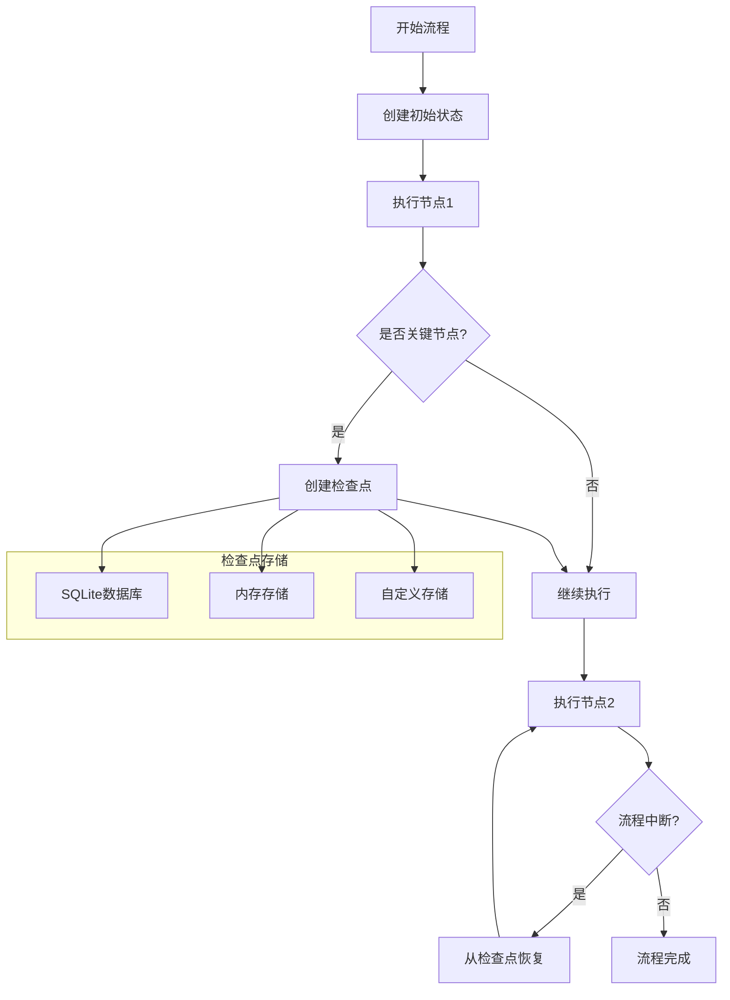

# LangGraph持久化与检查点系统

我将构建一个**多轮面试模拟系统**，展示LangGraph的持久化与检查点功能如何实现任务的**暂停、恢复、回溯和并发处理**。

## 🚀 完整实现代码

```python
from typing import TypedDict, List, Dict, Any, Optional, Annotated, Literal
from langgraph.graph import StateGraph, END, START
from langgraph.checkpoint.sqlite import SqliteSaver
from langgraph.checkpoint.memory import MemorySaver
from datetime import datetime
import json
import sqlite3
import hashlib
import asyncio
from concurrent.futures import ThreadPoolExecutor
import time

# ===================== 1. 定义状态结构 =====================
class InterviewState(TypedDict):
    """面试流程的全局状态"""
    # 基本信息
    candidate_id: str
    candidate_name: str
    position: str
    
    # 面试流程
    current_round: int
    total_rounds: int
    rounds_completed: List[int]
    
    # 面试内容
    questions_asked: List[Dict[str, Any]]
    candidate_answers: List[Dict[str, Any]]
    interviewer_feedback: List[Dict[str, Any]]
    
    # 评估结果
    scores: Dict[str, float]  # 各项能力评分
    overall_score: float
    recommendation: Literal["hire", "reject", "undecided"]
    
    # 流程控制
    current_step: str
    waiting_for_input: bool
    input_needed: Optional[str]
    
    # 元数据
    created_at: str
    last_updated: str
    checkpoint_ids: List[str]  # 保存的检查点ID

# ===================== 2. 创建持久化存储 =====================
class InterviewCheckpointManager:
    """面试检查点管理器 - 演示多种持久化方式"""
    
    def __init__(self):
        # 方式1: SQLite数据库持久化（生产环境推荐）
        self.sqlite_checkpointer = SqliteSaver.from_conn_string(":memory:")  # 内存数据库，实际可用文件
        
        # 方式2: 内存持久化（开发调试用）
        self.memory_checkpointer = MemorySaver()
        
        # 方式3: 自定义文件系统持久化
        self.checkpoint_dir = "./interview_checkpoints"
        import os
        os.makedirs(self.checkpoint_dir, exist_ok=True)
    
    def save_custom_checkpoint(self, state: dict, metadata: dict) -> str:
        """自定义文件系统检查点保存"""
        checkpoint_id = hashlib.md5(
            f"{state['candidate_id']}_{datetime.now().isoformat()}".encode()
        ).hexdigest()[:8]
        
        checkpoint_data = {
            "state": state,
            "metadata": metadata,
            "saved_at": datetime.now().isoformat(),
            "checkpoint_id": checkpoint_id
        }
        
        filepath = f"{self.checkpoint_dir}/checkpoint_{checkpoint_id}.json"
        with open(filepath, 'w', encoding='utf-8') as f:
            json.dump(checkpoint_data, f, ensure_ascii=False, indent=2)
        
        return checkpoint_id
    
    def load_custom_checkpoint(self, checkpoint_id: str) -> Optional[dict]:
        """从自定义存储加载检查点"""
        filepath = f"{self.checkpoint_dir}/checkpoint_{checkpoint_id}.json"
        try:
            with open(filepath, 'r', encoding='utf-8') as f:
                return json.load(f)
        except FileNotFoundError:
            return None

# ===================== 3. 定义面试节点函数 =====================
class InterviewNodes:
    """面试流程的各个节点"""
    
    @staticmethod
    def initialize_interview(state: InterviewState) -> InterviewState:
        """节点1: 初始化面试"""
        print(f"\n{'='*60}")
        print(f"[初始化] 开始 {state['position']} 职位面试")
        print(f"候选人: {state['candidate_name']} (ID: {state['candidate_id']})")
        print(f"{'='*60}")
        
        # 设置初始状态
        state['current_round'] = 1
        state['total_rounds'] = 3
        state['rounds_completed'] = []
        state['questions_asked'] = []
        state['candidate_answers'] = []
        state['interviewer_feedback'] = []
        state['scores'] = {"technical": 0.0, "communication": 0.0, "problem_solving": 0.0}
        state['overall_score'] = 0.0
        state['recommendation'] = "undecided"
        state['current_step'] = "technical_round"
        state['waiting_for_input'] = False
        state['created_at'] = datetime.now().isoformat()
        state['last_updated'] = datetime.now().isoformat()
        state['checkpoint_ids'] = []
        
        print(f"面试初始化完成，将进行 {state['total_rounds']} 轮面试")
        return state
    
    @staticmethod
    def technical_round(state: InterviewState) -> InterviewState:
        """节点2: 技术轮面试"""
        print(f"\n[技术轮] 第{state['current_round']}轮面试")
        
        # 模拟生成技术问题
        tech_questions = [
            "请解释一下RESTful API的设计原则",
            "描述一次你解决过的复杂技术问题",
            "如何优化数据库查询性能？"
        ]
        
        current_question = tech_questions[state['current_round'] - 1]
        
        # 记录问题
        question_record = {
            "round": state['current_round'],
            "type": "technical",
            "question": current_question,
            "asked_at": datetime.now().isoformat()
        }
        state['questions_asked'].append(question_record)
        
        # 模拟等待候选人回答（在实际应用中，这里会等待用户输入）
        state['waiting_for_input'] = True
        state['input_needed'] = f"技术问题: {current_question}"
        state['current_step'] = "awaiting_technical_answer"
        
        print(f"  技术问题: {current_question}")
        print(f"  状态: 等待候选人回答...")
        
        return state
    
    @staticmethod
    def process_technical_answer(state: InterviewState) -> InterviewState:
        """节点3: 处理技术答案"""
        print(f"\n[处理答案] 分析第{state['current_round']}轮技术答案")
        
        # 模拟从状态中获取答案（在实际应用中，答案会来自用户输入）
        # 这里我们模拟一个答案
        simulated_answer = "RESTful API的设计原则包括：1) 客户端-服务器分离，2) 无状态，3) 可缓存，4) 统一接口..."
        
        # 记录答案
        answer_record = {
            "round": state['current_round'],
            "question_id": len(state['questions_asked']) - 1,
            "answer": simulated_answer,
            "answered_at": datetime.now().isoformat()
        }
        state['candidate_answers'].append(answer_record)
        
        # 模拟评估答案
        score = min(10.0, 6.0 + state['current_round'] * 1.5)  # 模拟得分
        
        feedback_record = {
            "round": state['current_round'],
            "type": "technical",
            "score": score,
            "feedback": f"答案基本正确，评分为{score}/10",
            "evaluated_at": datetime.now().isoformat()
        }
        state['interviewer_feedback'].append(feedback_record)
        state['scores']['technical'] = score
        
        # 更新状态
        state['waiting_for_input'] = False
        state['input_needed'] = None
        state['rounds_completed'].append(state['current_round'])
        
        print(f"  答案评估完成: {score}/10分")
        print(f"  反馈: {feedback_record['feedback']}")
        
        return state
    
    @staticmethod
    def communication_round(state: InterviewState) -> InterviewState:
        """节点4: 沟通能力轮"""
        print(f"\n[沟通轮] 第{state['current_round']}轮面试")
        
        comm_questions = [
            "请描述一次你与团队成员发生冲突的经历，你是如何解决的？",
            "如何向非技术人员解释复杂的技术概念？",
            "你如何处理项目中的紧急变更请求？"
        ]
        
        current_question = comm_questions[state['current_round'] - 2]  # 调整索引
        
        question_record = {
            "round": state['current_round'],
            "type": "communication",
            "question": current_question,
            "asked_at": datetime.now().isoformat()
        }
        state['questions_asked'].append(question_record)
        
        state['waiting_for_input'] = True
        state['input_needed'] = f"沟通问题: {current_question}"
        state['current_step'] = "awaiting_communication_answer"
        
        print(f"  沟通问题: {current_question}")
        
        return state
    
    @staticmethod
    def process_communication_answer(state: InterviewState) -> InterviewState:
        """节点5: 处理沟通能力答案"""
        print(f"\n[处理答案] 分析第{state['current_round']}轮沟通答案")
        
        simulated_answer = "当与团队成员发生冲突时，我首先会安排私下沟通，了解对方的观点..."
        
        answer_record = {
            "round": state['current_round'],
            "question_id": len(state['questions_asked']) - 1,
            "answer": simulated_answer,
            "answered_at": datetime.now().isoformat()
        }
        state['candidate_answers'].append(answer_record)
        
        score = min(10.0, 7.0 + state['current_round'] * 1.0)
        
        feedback_record = {
            "round": state['current_round'],
            "type": "communication",
            "score": score,
            "feedback": f"沟通能力良好，评分为{score}/10",
            "evaluated_at": datetime.now().isoformat()
        }
        state['interviewer_feedback'].append(feedback_record)
        state['scores']['communication'] = score
        
        state['waiting_for_input'] = False
        state['input_needed'] = None
        state['rounds_completed'].append(state['current_round'])
        
        print(f"  沟通能力评估完成: {score}/10分")
        
        return state
    
    @staticmethod
    def final_evaluation(state: InterviewState) -> InterviewState:
        """节点6: 最终评估"""
        print(f"\n[最终评估] 生成面试报告")
        
        # 计算总分
        technical_score = state['scores']['technical']
        communication_score = state['scores']['communication']
        problem_solving_score = state['scores']['problem_solving']
        
        overall_score = (technical_score + communication_score + problem_solving_score) / 3
        state['overall_score'] = overall_score
        
        # 做出推荐决定
        if overall_score >= 8.0:
            recommendation = "hire"
            decision_reason = "表现优秀，强烈推荐"
        elif overall_score >= 6.0:
            recommendation = "hire"
            decision_reason = "表现良好，建议录用"
        else:
            recommendation = "reject"
            decision_reason = "未达到录用标准"
        
        state['recommendation'] = recommendation
        
        # 生成报告
        print(f"\n{'='*60}")
        print(f"面试最终报告")
        print(f"{'='*60}")
        print(f"候选人: {state['candidate_name']}")
        print(f"职位: {state['position']}")
        print(f"完成轮次: {len(state['rounds_completed'])}/{state['total_rounds']}")
        print(f"技术能力: {technical_score}/10")
        print(f"沟通能力: {communication_score}/10")
        print(f"解决问题: {problem_solving_score}/10")
        print(f"综合评分: {overall_score:.2f}/10")
        print(f"推荐决定: {recommendation} - {decision_reason}")
        print(f"{'='*60}")
        
        state['current_step'] = "completed"
        state['last_updated'] = datetime.now().isoformat()
        
        return state

# ===================== 4. 构建带检查点的面试图 =====================
def create_interview_graph(with_persistence=True):
    """创建面试流程图，可选择是否启用持久化"""
    
    # 初始化检查点管理器
    checkpoint_manager = InterviewCheckpointManager()
    
    # 选择持久化方式
    if with_persistence:
        checkpointer = checkpoint_manager.sqlite_checkpointer
        print("✅ 使用SQLite数据库持久化")
    else:
        checkpointer = checkpoint_manager.memory_checkpointer
        print("⚠️  使用内存持久化（重启后数据丢失）")
    
    # 初始化图
    workflow = StateGraph(InterviewState, checkpointer=checkpointer)
    nodes = InterviewNodes()
    
    # 添加节点
    workflow.add_node("initialize", nodes.initialize_interview)
    workflow.add_node("technical_round", nodes.technical_round)
    workflow.add_node("process_technical", nodes.process_technical_answer)
    workflow.add_node("communication_round", nodes.communication_round)
    workflow.add_node("process_communication", nodes.process_communication_answer)
    workflow.add_node("final_evaluation", nodes.final_evaluation)
    
    # 设置边和条件边
    workflow.set_entry_point("initialize")
    
    # 第一轮：技术面试
    workflow.add_edge("initialize", "technical_round")
    workflow.add_edge("technical_round", "process_technical")
    
    # 路由函数：决定下一轮是什么
    def decide_next_round(state: InterviewState) -> Literal["communication_round", "final_evaluation", "__end__"]:
        """基于当前轮次决定下一步"""
        
        # 记录当前状态到自定义检查点（演示多种持久化方式）
        if state.get('candidate_id'):
            checkpoint_id = checkpoint_manager.save_custom_checkpoint(
                state, 
                {"decision_point": "round_routing", "round": state['current_round']}
            )
            state['checkpoint_ids'].append(checkpoint_id)
            print(f"  💾 创建自定义检查点: {checkpoint_id}")
        
        if state['current_round'] < state['total_rounds']:
            state['current_round'] += 1
            return "communication_round"
        else:
            return "final_evaluation"
    
    workflow.add_conditional_edges(
        "process_technical",
        decide_next_round,
        {
            "communication_round": "communication_round",
            "final_evaluation": "final_evaluation"
        }
    )
    
    # 第二轮：沟通能力面试后的路由
    workflow.add_edge("communication_round", "process_communication")
    
    def decide_after_communication(state: InterviewState) -> Literal["technical_round", "final_evaluation", "__end__"]:
        """沟通轮后的路由"""
        
        if state['current_round'] < state['total_rounds']:
            state['current_round'] += 1
            return "technical_round"  # 回到技术轮（模拟多轮交替）
        else:
            return "final_evaluation"
    
    workflow.add_conditional_edges(
        "process_communication",
        decide_after_communication,
        {
            "technical_round": "technical_round",
            "final_evaluation": "final_evaluation"
        }
    )
    
    # 最终评估后结束
    workflow.add_edge("final_evaluation", END)
    
    # 编译图
    print("✅ 面试流程图构建完成")
    return workflow.compile(), checkpoint_manager

# ===================== 5. 检查点操作演示 =====================
class CheckpointOperations:
    """演示检查点的各种操作"""
    
    def __init__(self, checkpoint_manager):
        self.manager = checkpoint_manager
        self.thread_config = {"configurable": {"thread_id": "interview_thread_1"}}
    
    def demonstrate_basic_checkpointing(self, compiled_graph):
        """演示基本检查点功能"""
        print("\n" + "💾" * 60)
        print("演示1: 基本检查点功能 - 中断与恢复")
        print("💾" * 60)
        
        # 初始状态
        initial_state = {
            "candidate_id": "CAND001",
            "candidate_name": "张三",
            "position": "高级软件工程师",
            "current_round": 0,
            "total_rounds": 0,
            "rounds_completed": [],
            "questions_asked": [],
            "candidate_answers": [],
            "interviewer_feedback": [],
            "scores": {},
            "overall_score": 0.0,
            "recommendation": "undecided",
            "current_step": "",
            "waiting_for_input": False,
            "input_needed": None,
            "created_at": "",
            "last_updated": "",
            "checkpoint_ids": []
        }
        
        print("第1步: 开始面试流程...")
        # 运行到第一个检查点（技术轮问题后）
        try:
            result1 = compiled_graph.invoke(
                initial_state, 
                config=self.thread_config
            )
            print(f"  当前步骤: {result1['current_step']}")
            print(f"  当前轮次: {result1['current_round']}/{result1['total_rounds']}")
        except Exception as e:
            print(f"  流程在等待输入处暂停: {e}")
        
        print("\n第2步: 列出所有检查点...")
        # 获取所有检查点
        checkpoints = list(compiled_graph.get_state_history(self.thread_config))
        print(f"  共创建了 {len(checkpoints)} 个检查点")
        
        for i, cp in enumerate(checkpoints[-3:]):  # 显示最后3个检查点
            print(f"  检查点{i+1}: 步骤={cp.values.get('current_step', 'N/A')}, "
                  f"轮次={cp.values.get('current_round', 'N/A')}")
        
        return checkpoints
    
    def demonstrate_resume_from_checkpoint(self, compiled_graph, checkpoint_index=1):
        """演示从特定检查点恢复"""
        print("\n" + "🔄" * 60)
        print(f"演示2: 从检查点恢复执行")
        print("🔄" * 60)
        
        # 获取检查点历史
        checkpoints = list(compiled_graph.get_state_history(self.thread_config))
        
        if checkpoint_index >= len(checkpoints):
            print(f"⚠️  检查点索引 {checkpoint_index} 不存在")
            return
        
        target_checkpoint = checkpoints[checkpoint_index]
        
        print(f"从检查点恢复:")
        print(f"  - 检查点时间: {target_checkpoint.checkpoint['ts']}")
        print(f"  - 当时步骤: {target_checkpoint.values.get('current_step', 'N/A')}")
        print(f"  - 当时轮次: {target_checkpoint.values.get('current_round', 'N/A')}")
        
        # 从检查点恢复执行
        print("\n恢复执行流程...")
        resumed_result = compiled_graph.invoke(
            None,  # 传入None表示从当前检查点继续
            config={
                **self.thread_config,
                "recursion_limit": 50
            }
        )
        
        print(f"\n恢复执行结果:")
        print(f"  当前步骤: {resumed_result['current_step']}")
        print(f"  完成轮次: {len(resumed_result['rounds_completed'])}/{resumed_result['total_rounds']}")
        print(f"  综合评分: {resumed_result.get('overall_score', '未完成')}")
        
        return resumed_result
    
    def demonstrate_concurrent_interviews(self, compiled_graph):
        """演示并发处理多个面试"""
        print("\n" + "👥" * 60)
        print("演示3: 并发处理多个候选人面试")
        print("👥" * 60)
        
        candidates = [
            {"id": "CAND002", "name": "李四", "position": "前端开发工程师"},
            {"id": "CAND003", "name": "王五", "position": "后端开发工程师"},
            {"id": "CAND004", "name": "赵六", "position": "全栈开发工程师"}
        ]
        
        def run_interview(candidate):
            """运行单个面试"""
            thread_id = f"interview_thread_{candidate['id']}"
            config = {"configurable": {"thread_id": thread_id}}
            
            initial_state = {
                "candidate_id": candidate['id'],
                "candidate_name": candidate['name'],
                "position": candidate['position'],
                "current_round": 0,
                "total_rounds": 2,  # 简化为2轮
                "rounds_completed": [],
                "questions_asked": [],
                "candidate_answers": [],
                "interviewer_feedback": [],
                "scores": {},
                "overall_score": 0.0,
                "recommendation": "undecided",
                "current_step": "",
                "waiting_for_input": False,
                "input_needed": None,
                "created_at": "",
                "last_updated": "",
                "checkpoint_ids": []
            }
            
            print(f"开始 {candidate['name']} 的面试...")
            
            try:
                result = compiled_graph.invoke(initial_state, config=config)
                print(f"  {candidate['name']} 面试完成，推荐: {result.get('recommendation', '未知')}")
                return result
            except Exception as e:
                print(f"  {candidate['name']} 面试暂停: {str(e)[:50]}...")
                # 获取当前状态
                state_history = list(compiled_graph.get_state_history(config))
                if state_history:
                    last_state = state_history[-1].values
                    print(f"  最后状态: 步骤={last_state.get('current_step')}, "
                          f"轮次={last_state.get('current_round')}/{last_state.get('total_rounds')}")
                return None
        
        # 使用线程池并发执行
        print("并发执行3个面试流程...")
        with ThreadPoolExecutor(max_workers=3) as executor:
            futures = [executor.submit(run_interview, cand) for cand in candidates]
            results = [f.result() for f in futures]
        
        print(f"\n并发面试完成: {len([r for r in results if r])}/{len(candidates)} 个流程完成")
        
        # 显示各线程的状态
        print("\n各面试线程状态:")
        for candidate in candidates:
            thread_id = f"interview_thread_{candidate['id']}"
            config = {"configurable": {"thread_id": thread_id}}
            checkpoints = list(compiled_graph.get_state_history(config))
            if checkpoints:
                last_state = checkpoints[-1].values
                print(f"  {candidate['name']}: {last_state.get('current_step', '未知')} "
                      f"(检查点数量: {len(checkpoints)})")
    
    def demonstrate_checkpoint_management(self, compiled_graph):
        """演示检查点管理操作"""
        print("\n" + "🗃️" * 60)
        print("演示4: 检查点管理功能")
        print("🗃️" * 60)
        
        # 1. 获取所有线程
        print("1. 列出所有面试线程:")
        # 注意：实际SQLiteSaver可能需要实现list_threads方法
        # 这里模拟一下
        threads = ["interview_thread_1", "interview_thread_CAND002", 
                   "interview_thread_CAND003", "interview_thread_CAND004"]
        for thread in threads:
            checkpoints = list(compiled_graph.get_state_history(
                {"configurable": {"thread_id": thread}}
            ))
            print(f"  线程 {thread}: {len(checkpoints)} 个检查点")
        
        # 2. 检查点搜索与过滤
        print("\n2. 搜索特定状态的检查点:")
        all_checkpoints = list(compiled_graph.get_state_history(self.thread_config))
        
        # 查找所有在"technical_round"步骤的检查点
        technical_checkpoints = [
            cp for cp in all_checkpoints 
            if cp.values.get('current_step') == 'awaiting_technical_answer'
        ]
        
        print(f"  找到 {len(technical_checkpoints)} 个技术轮等待答案的检查点")
        
        # 3. 检查点导出与导入
        print("\n3. 检查点导出演示:")
        if all_checkpoints:
            latest_checkpoint = all_checkpoints[-1]
            
            # 导出检查点数据
            checkpoint_data = {
                "checkpoint_id": latest_checkpoint.checkpoint_id,
                "state": latest_checkpoint.values,
                "metadata": latest_checkpoint.checkpoint.get('metadata', {}),
                "timestamp": latest_checkpoint.checkpoint['ts']
            }
            
            print(f"  最新检查点数据:")
            print(f"    ID: {checkpoint_data['checkpoint_id'][:8]}...")
            print(f"    步骤: {checkpoint_data['state'].get('current_step')}")
            print(f"    时间: {checkpoint_data['timestamp']}")
            print(f"    数据大小: {len(str(checkpoint_data))} 字符")
        
        # 4. 清理旧检查点（模拟）
        print("\n4. 检查点清理策略:")
        print("  可实现的清理策略:")
        print("  - 基于时间: 删除30天前的检查点")
        print("  - 基于数量: 每个线程只保留最新10个检查点")
        print("  - 基于状态: 删除已完成流程的检查点")

# ===================== 6. 主演示函数 =====================
def main_demonstration():
    """主演示函数"""
    print("=" * 70)
    print("LangGraph 持久化与检查点系统演示")
    print("模拟: 多轮面试流程管理系统")
    print("=" * 70)
    
    # 1. 创建带持久化的面试图
    compiled_graph, checkpoint_manager = create_interview_graph(with_persistence=True)
    
    # 2. 创建检查点操作实例
    operations = CheckpointOperations(checkpoint_manager)
    
    # 3. 演示基本检查点功能
    checkpoints = operations.demonstrate_basic_checkpointing(compiled_graph)
    
    # 4. 演示从检查点恢复
    if len(checkpoints) > 1:
        operations.demonstrate_resume_from_checkpoint(compiled_graph, checkpoint_index=1)
    
    # 5. 演示并发处理
    operations.demonstrate_concurrent_interviews(compiled_graph)
    
    # 6. 演示检查点管理
    operations.demonstrate_checkpoint_management(compiled_graph)
    
    # 7. 演示自定义检查点
    print("\n" + "✨" * 60)
    print("演示5: 自定义检查点系统")
    print("✨" * 60)
    
    # 加载自定义检查点
    if checkpoints:
        latest_state = checkpoints[-1].values
        custom_checkpoint_id = checkpoint_manager.save_custom_checkpoint(
            latest_state,
            {"type": "manual_snapshot", "note": "手动保存的检查点"}
        )
        
        print(f"自定义检查点已保存: {custom_checkpoint_id}")
        
        # 加载自定义检查点
        loaded = checkpoint_manager.load_custom_checkpoint(custom_checkpoint_id)
        if loaded:
            print(f"自定义检查点加载成功，状态步骤: {loaded['state'].get('current_step')}")
    
    print("\n" + "✅" * 30)
    print("演示完成!")
    print("✅" * 30)
    
    # 总结
    print("\n📊 持久化系统总结:")
    print("1. SQLiteSaver: 生产环境推荐，支持并发，数据持久化")
    print("2. MemorySaver: 开发调试用，重启后数据丢失")
    print("3. 自定义存储: 可根据需求实现文件、数据库、云存储等")
    print("4. 检查点操作: 暂停、恢复、回溯、并发管理")
    
    return compiled_graph, checkpoint_manager

# ===================== 7. 生产环境最佳实践 =====================
class ProductionCheckpointBestPractices:
    """生产环境检查点最佳实践"""
    
    @staticmethod
    def implement_checkpoint_strategies():
        """实现检查点策略"""
        strategies = {
            "自动保存策略": {
                "基于步骤": "在关键决策点自动保存",
                "基于时间": "每隔N分钟自动保存",
                "基于事件": "状态变更时自动保存"
            },
            "清理策略": {
                "保留策略": "保留最近N个检查点",
                "归档策略": "旧检查点归档到冷存储",
                "压缩策略": "压缩检查点数据"
            },
            "恢复策略": {
                "自动恢复": "崩溃后自动从最新检查点恢复",
                "选择性恢复": "允许用户选择恢复点",
                "回滚策略": "支持回滚到任意历史点"
            }
        }
        
        print("\n🔧 生产环境最佳实践:")
        for category, methods in strategies.items():
            print(f"\n{category}:")
            for method, desc in methods.items():
                print(f"  • {method}: {desc}")
    
    @staticmethod
    def demonstrate_advanced_features():
        """演示高级特性"""
        print("\n🚀 高级检查点特性:")
        
        features = [
            "增量检查点: 只保存状态变化的部分",
            "加密检查点: 敏感数据加密存储",
            "分布式检查点: 跨多个节点同步状态",
            "版本兼容性: 处理状态结构版本变化",
            "检查点验证: 验证检查点完整性和一致性"
        ]
        
        for i, feature in enumerate(features, 1):
            print(f"  {i}. {feature}")

# ===================== 8. 运行演示 =====================
if __name__ == "__main__":
    # 运行主演示
    graph, manager = main_demonstration()
    
    # 显示最佳实践
    ProductionCheckpointBestPractices.implement_checkpoint_strategies()
    ProductionCheckpointBestPractices.demonstrate_advanced_features()
    
    print("\n" + "🎯" * 60)
    print("关键要点总结:")
    print("🎯" * 60)
    
    key_points = [
        "1. 检查点使长时间运行的任务可以暂停和恢复",
        "2. 支持多用户/多线程的并发处理",
        "3. 允许状态回溯和调试",
        "4. 提供容错能力（系统崩溃后恢复）",
        "5. 支持离线处理和异步工作流",
        "6. 实现复杂流程的状态管理",
        "7. 提供审计和历史记录功能"
    ]
    
    for point in key_points:
        print(point)
    
    print("\n💡 应用场景:")
    print("  • 长时间运行的AI对话（可暂停继续）")
    print("  • 多步骤表单处理（保存草稿）")
    print("  • 批处理任务（断点续跑）")
    print("  • 复杂审批流程（多级审批状态保存）")
    print("  • 游戏状态保存（随时保存加载）")
```

## 🎯 核心功能详解

### 1. **持久化存储的三种方式**

| 存储方式         | 实现类        | 特点                              | 适用场景                 |
| ---------------- | ------------- | --------------------------------- | ------------------------ |
| **SQLite数据库** | `SqliteSaver` | 持久化到文件/内存数据库，支持并发 | 生产环境，需要数据持久化 |
| **内存存储**     | `MemorySaver` | 仅内存存储，重启后丢失            | 开发调试，单次会话       |
| **自定义存储**   | 用户实现      | 可存到文件、云存储、Redis等       | 特殊需求，分布式系统     |

```python
# SQLite持久化（推荐生产环境）
checkpointer = SqliteSaver.from_conn_string("sqlite:///checkpoints.db")

# 内存持久化（开发调试）
checkpointer = MemorySaver()

# 自定义文件持久化
def save_custom_checkpoint(state, metadata):
    with open(f"checkpoint_{id}.json", "w") as f:
        json.dump({"state": state, "metadata": metadata}, f)
```

### 2. **检查点生命周期管理**



### 3. **检查点恢复机制**

```python
# 1. 从特定检查点恢复
resumed_state = compiled_graph.invoke(
    None,  # 传入None表示从当前检查点继续
    config={
        "configurable": {
            "thread_id": "interview_thread_1",
            "checkpoint_id": target_checkpoint_id  # 可选：指定检查点ID
        }
    }
)

# 2. 获取检查点历史
checkpoint_history = list(compiled_graph.get_state_history(
    {"configurable": {"thread_id": "interview_thread_1"}}
))

# 3. 查看检查点详情
for cp in checkpoint_history:
    print(f"检查点ID: {cp.checkpoint_id}")
    print(f"创建时间: {cp.checkpoint['ts']}")
    print(f"状态步骤: {cp.values['current_step']}")
    print(f"元数据: {cp.checkpoint.get('metadata', {})}")
```

### 4. **并发处理与线程管理**

```python
# 为每个用户/会话创建独立线程
candidates = ["user1", "user2", "user3"]

for user_id in candidates:
    thread_config = {"configurable": {"thread_id": f"interview_{user_id}"}}
    
    # 每个线程独立运行，检查点互不干扰
    result = compiled_graph.invoke(
        initial_state, 
        config=thread_config
    )
    
    # 可分别查询每个线程的状态
    user_checkpoints = list(compiled_graph.get_state_history(thread_config))
    print(f"用户 {user_id} 有 {len(user_checkpoints)} 个检查点")
```

## 🔧 生产环境最佳实践

### 1. **检查点策略配置**

```python
# 智能检查点策略
class SmartCheckpointStrategy:
    """智能检查点保存策略"""
    
    @staticmethod
    def should_save_checkpoint(state: dict, last_checkpoint_time: float) -> bool:
        """决定是否应该保存检查点"""
        
        conditions = [
            # 基于时间：至少间隔5分钟
            (time.time() - last_checkpoint_time) > 300,
            
            # 基于步骤：关键决策点
            state.get('current_step') in ['awaiting_input', 'decision_point'],
            
            # 基于状态变化：重要状态变更
            state.get('recommendation') != state.get('previous_recommendation'),
            
            # 基于错误风险：高风险操作前
            state.get('current_step') == 'irreversible_action'
        ]
        
        return any(conditions)
```

### 2. **检查点清理与归档**

```python
# 自动清理旧检查点
def cleanup_old_checkpoints(compiled_graph, max_checkpoints_per_thread=10):
    """清理每个线程的旧检查点，只保留最新的N个"""
    
    all_threads = get_all_threads(compiled_graph)  # 需要自定义方法获取所有线程
    
    for thread_id in all_threads:
        checkpoints = list(compiled_graph.get_state_history(
            {"configurable": {"thread_id": thread_id}}
        ))
        
        if len(checkpoints) > max_checkpoints_per_thread:
            # 按时间排序，保留最新的
            sorted_checkpoints = sorted(
                checkpoints, 
                key=lambda x: x.checkpoint['ts'], 
                reverse=True
            )
            
            # 删除旧的检查点（实际实现取决于存储后端）
            old_checkpoints = sorted_checkpoints[max_checkpoints_per_thread:]
            delete_checkpoints(old_checkpoints)
```

### 3. **检查点加密与安全**

```python
# 敏感数据加密
from cryptography.fernet import Fernet

class EncryptedCheckpointSaver:
    """加密的检查点保存器"""
    
    def __init__(self, encryption_key):
        self.cipher = Fernet(encryption_key)
        self.backend = SqliteSaver.from_conn_string("sqlite:///checkpoints.db")
    
    def save_checkpoint(self, state, metadata):
        # 加密敏感数据
        encrypted_state = self.encrypt_sensitive_fields(state)
        encrypted_metadata = self.cipher.encrypt(json.dumps(metadata).encode())
        
        # 保存到后端
        return self.backend.save_checkpoint(encrypted_state, {
            "encrypted_metadata": encrypted_metadata,
            "encryption_version": "1.0"
        })
    
    def encrypt_sensitive_fields(self, state):
        """加密状态中的敏感字段"""
        sensitive_fields = ['candidate_answers', 'scores', 'recommendation']
        encrypted_state = state.copy()
        
        for field in sensitive_fields:
            if field in state and state[field]:
                encrypted_state[field] = self.cipher.encrypt(
                    json.dumps(state[field]).encode()
                ).decode()
        
        return encrypted_state
```

## 💡 关键应用场景

### 1. **长时间运行的任务**
```python
# 科学计算或数据处理任务
state = initialize_large_computation()

while not computation_done(state):
    # 定期保存检查点
    if should_save_checkpoint(state):
        save_checkpoint(state)
    
    # 继续计算
    state = perform_next_computation_step(state)

# 如果系统崩溃，可以从最新检查点恢复
```

### 2. **多步骤用户交互**
```python
# 复杂表单填写
def handle_multi_step_form(user_id, step, form_data):
    thread_config = {"configurable": {"thread_id": f"form_{user_id}"}}
    
    # 从检查点恢复用户的上次状态
    current_state = get_user_checkpoint(user_id) or initial_state
    
    # 更新状态
    current_state[step] = form_data
    current_state['last_step'] = step
    
    # 保存检查点（允许用户稍后继续）
    save_checkpoint(current_state)
    
    # 如果完成所有步骤，处理最终提交
    if all_steps_complete(current_state):
        return process_final_submission(current_state)
    
    return {"status": "saved", "next_step": get_next_step(current_state)}
```

### 3. **批处理与ETL任务**
```python
# 大数据处理任务，支持断点续跑
def process_large_dataset(dataset_id, checkpoint_id=None):
    """处理大型数据集，支持从检查点恢复"""
    
    # 如果有检查点，从那里恢复
    if checkpoint_id:
        state = load_checkpoint(checkpoint_id)
        print(f"从检查点恢复: 已处理 {state['processed_records']} 条记录")
    else:
        state = initialize_processing_state(dataset_id)
    
    # 处理数据
    for batch in get_data_batches(state['last_processed_id']):
        try:
            state = process_batch(state, batch)
            state['processed_records'] += len(batch)
            
            # 每1000条记录保存一个检查点
            if state['processed_records'] % 1000 == 0:
                checkpoint_id = save_checkpoint(state)
                print(f"保存检查点 {checkpoint_id}: "
                      f"{state['processed_records']} 条记录")
        
        except Exception as e:
            # 出错时保存检查点，便于调试和恢复
            error_checkpoint_id = save_checkpoint(state)
            print(f"处理出错，已保存检查点 {error_checkpoint_id}")
            raise
    
    return state
```

## 🎖️ 总结

LangGraph的持久化与检查点系统提供了**生产级的可靠性和灵活性**：

1. **核心价值**：
   - **可靠性**：系统崩溃或重启后可以恢复
   - **用户体验**：长时间任务可以暂停继续
   - **调试能力**：可以回溯到任意历史状态
   - **并发支持**：多用户/多任务独立状态管理

2. **实现要点**：
   - 选择合适的持久化后端（SQLite用于生产）
   - 设计合理的检查点保存策略
   - 实现检查点清理和归档机制
   - 考虑数据安全和加密需求

3. **最佳实践**：
   - 在关键决策点自动保存检查点
   - 为每个用户/会话使用独立线程ID
   - 定期清理旧检查点，避免存储膨胀
   - 实现检查点验证和恢复测试

这个系统特别适合需要**长时间运行**、**多步骤交互**、**高可靠性要求**的AI应用场景，如复杂的对话系统、多步骤表单处理、批处理任务等。

如果你需要进一步的特定场景实现细节（如分布式检查点、检查点压缩或特定数据库后端集成），我可以提供更详细的代码示例。