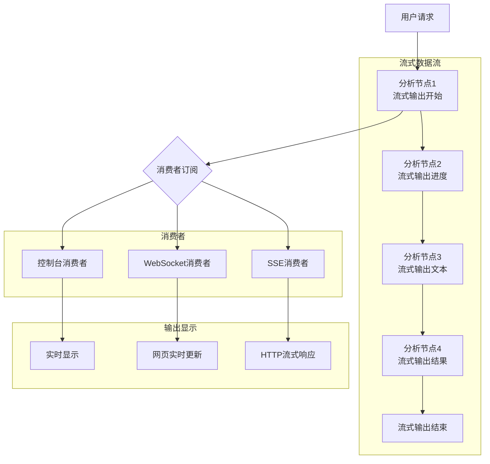

# LangGraph流式输出系统

我将构建一个**实时股票分析助理**，展示LangGraph流式输出的完整功能，包括**渐进式生成、实时更新、多通道输出、进度反馈和中断处理**。

## 🚀 完整实现代码

```python
from typing import TypedDict, List, Dict, Any, Optional, Literal, AsyncIterator, Union
from langgraph.graph import StateGraph, END
from langgraph.checkpoint.sqlite import SqliteSaver
import asyncio
import json
import time
from datetime import datetime, timedelta
import random
from dataclasses import dataclass, asdict, field
from enum import Enum
import threading
from concurrent.futures import ThreadPoolExecutor
from queue import Queue, Empty
import websockets
from contextlib import asynccontextmanager
import sseclient
import requests
from typing import Generator
import sys

# ===================== 1. 流式输出数据模型 =====================
class StreamChunkType(Enum):
    """流式数据块类型"""
    TEXT = "text"                # 纯文本
    TOKEN = "token"              # 单个token
    PROGRESS = "progress"        # 进度更新
    PARTIAL_RESULT = "partial"   # 部分结果
    FINAL_RESULT = "final"       # 最终结果
    ERROR = "error"              # 错误信息
    METADATA = "metadata"        # 元数据
    INTERMEDIATE = "intermediate" # 中间结果

@dataclass
class StreamChunk:
    """流式数据块"""
    type: StreamChunkType
    content: Any
    node_id: Optional[str] = None
    timestamp: float = field(default_factory=time.time)
    sequence: int = 0
    is_last: bool = False
    
    def to_dict(self) -> Dict:
        return {
            "type": self.type.value,
            "content": self.content,
            "node_id": self.node_id,
            "timestamp": self.timestamp,
            "sequence": self.sequence,
            "is_last": self.is_last
        }
    
    def __str__(self) -> str:
        return json.dumps(self.to_dict(), ensure_ascii=False)

class StockAnalysisState(TypedDict):
    """股票分析状态"""
    # 用户输入
    user_query: str
    stock_symbol: str
    analysis_type: Literal["technical", "fundamental", "sentiment", "comprehensive"]
    
    # 分析结果
    current_analysis: str
    partial_results: List[str]
    final_report: str
    
    # 流式输出控制
    stream_buffer: List[StreamChunk]
    stream_consumers: List[str]  # 消费者ID列表
    stream_paused: bool
    stream_canceled: bool
    
    # 性能指标
    tokens_generated: int
    generation_time_ms: float
    stream_start_time: float
    
    # 进度跟踪
    progress_percentage: float
    current_step: str
    total_steps: int
    
    # 错误处理
    last_error: Optional[str]
    retry_count: int

# ===================== 2. 流式输出管理器 =====================
class StreamManager:
    """流式输出管理器 - 处理多消费者流式数据分发"""
    
    def __init__(self):
        self.consumer_queues = {}  # consumer_id -> asyncio.Queue
        self.global_stream = []    # 全局流式记录
        self.sequence_counter = 0
        self.lock = threading.Lock()
        
        # 统计信息
        self.stats = {
            "total_chunks": 0,
            "active_consumers": 0,
            "bytes_streamed": 0
        }
        
        print("✅ 流式输出管理器已初始化")
    
    def create_consumer(self, consumer_id: str) -> str:
        """创建流式消费者"""
        if consumer_id not in self.consumer_queues:
            self.consumer_queues[consumer_id] = asyncio.Queue(maxsize=1000)
            self.stats["active_consumers"] += 1
            print(f"📡 创建流式消费者: {consumer_id}")
        return consumer_id
    
    def remove_consumer(self, consumer_id: str):
        """移除消费者"""
        if consumer_id in self.consumer_queues:
            del self.consumer_queues[consumer_id]
            self.stats["active_consumers"] -= 1
            print(f"📡 移除流式消费者: {consumer_id}")
    
    async def put_chunk(self, chunk: StreamChunk, target_consumer: Optional[str] = None):
        """添加流式数据块"""
        with self.lock:
            chunk.sequence = self.sequence_counter
            self.sequence_counter += 1
            
            # 记录到全局流
            self.global_stream.append(chunk)
            
            # 更新统计
            self.stats["total_chunks"] += 1
            self.stats["bytes_streamed"] += len(str(chunk))
            
            # 分发到消费者队列
            if target_consumer:
                # 发送给特定消费者
                if target_consumer in self.consumer_queues:
                    await self.consumer_queues[target_consumer].put(chunk)
            else:
                # 广播给所有消费者
                for queue in self.consumer_queues.values():
                    await queue.put(chunk)
    
    async def get_stream(self, consumer_id: str) -> AsyncIterator[StreamChunk]:
        """获取消费者的流式数据"""
        if consumer_id not in self.consumer_queues:
            raise ValueError(f"消费者 {consumer_id} 不存在")
        
        queue = self.consumer_queues[consumer_id]
        
        try:
            while True:
                try:
                    # 使用超时避免永久阻塞
                    chunk = await asyncio.wait_for(queue.get(), timeout=30.0)
                    yield chunk
                    
                    if chunk.is_last:
                        print(f"📡 消费者 {consumer_id} 流式结束")
                        break
                        
                except asyncio.TimeoutError:
                    # 发送心跳包
                    heartbeat = StreamChunk(
                        type=StreamChunkType.METADATA,
                        content={"type": "heartbeat", "timestamp": time.time()},
                        node_id="stream_manager"
                    )
                    yield heartbeat
                    
        except Exception as e:
            error_chunk = StreamChunk(
                type=StreamChunkType.ERROR,
                content={"error": str(e), "consumer_id": consumer_id},
                node_id="stream_manager"
            )
            yield error_chunk
    
    def get_stream_sync(self, consumer_id: str) -> Generator[StreamChunk, None, None]:
        """同步获取流式数据（用于非异步环境）"""
        # 创建一个新的事件循环用于同步调用
        loop = asyncio.new_event_loop()
        asyncio.set_event_loop(loop)
        
        async def async_generator():
            async for chunk in self.get_stream(consumer_id):
                yield chunk
        
        try:
            gen = async_generator()
            while True:
                chunk = loop.run_until_complete(gen.__anext__())
                yield chunk
                if chunk.is_last:
                    break
        except StopAsyncIteration:
            pass
        finally:
            loop.close()
    
    async def generate_text_stream(
        self, 
        text: str, 
        node_id: str,
        chunk_size: int = 5,
        delay_ms: int = 50
    ) -> AsyncIterator[StreamChunk]:
        """生成文本的流式输出"""
        words = text.split()
        
        for i in range(0, len(words), chunk_size):
            chunk_words = words[i:i + chunk_size]
            chunk_text = " ".join(chunk_words)
            
            chunk = StreamChunk(
                type=StreamChunkType.TEXT,
                content=chunk_text,
                node_id=node_id,
                is_last=(i + chunk_size >= len(words))
            )
            
            yield chunk
            
            # 模拟生成延迟
            if delay_ms > 0:
                await asyncio.sleep(delay_ms / 1000)
        
        # 最后发送一个完成标记
        completion_chunk = StreamChunk(
            type=StreamChunkType.FINAL_RESULT,
            content={"total_words": len(words), "node_id": node_id},
            node_id=node_id,
            is_last=True
        )
        yield completion_chunk
    
    def get_stats(self) -> Dict:
        """获取统计信息"""
        return {
            **self.stats,
            "total_consumers": len(self.consumer_queues),
            "stream_history_size": len(self.global_stream)
        }

# ===================== 3. 流式节点装饰器 =====================
def streaming_node(stream_manager: StreamManager, node_name: str):
    """装饰器：将普通节点转换为流式节点"""
    def decorator(func):
        async def wrapper(state: StockAnalysisState, *args, **kwargs):
            
            # 记录开始时间
            start_time = time.time()
            
            # 发送节点开始消息
            start_chunk = StreamChunk(
                type=StreamChunkType.METADATA,
                content={
                    "event": "node_start",
                    "node_name": node_name,
                    "timestamp": start_time
                },
                node_id=node_name
            )
            await stream_manager.put_chunk(start_chunk)
            
            try:
                # 执行节点函数
                result = await func(state, *args, **kwargs)
                
                # 发送节点完成消息
                end_time = time.time()
                duration_ms = (end_time - start_time) * 1000
                
                end_chunk = StreamChunk(
                    type=StreamChunkType.METADATA,
                    content={
                        "event": "node_complete",
                        "node_name": node_name,
                        "duration_ms": duration_ms,
                        "timestamp": end_time
                    },
                    node_id=node_name,
                    is_last=False
                )
                await stream_manager.put_chunk(end_chunk)
                
                return result
                
            except Exception as e:
                # 发送错误消息
                error_chunk = StreamChunk(
                    type=StreamChunkType.ERROR,
                    content={
                        "node_name": node_name,
                        "error": str(e),
                        "timestamp": time.time()
                    },
                    node_id=node_name,
                    is_last=True
                )
                await stream_manager.put_chunk(error_chunk)
                raise
        
        return wrapper
    return decorator

# ===================== 4. 股票分析节点实现 =====================
class StockAnalysisNodes:
    """股票分析节点 - 所有节点都支持流式输出"""
    
    def __init__(self, stream_manager: StreamManager):
        self.stream_manager = stream_manager
        self.symbols = {
            "AAPL": "苹果公司",
            "GOOGL": "谷歌母公司",
            "MSFT": "微软",
            "TSLA": "特斯拉",
            "AMZN": "亚马逊",
            "NVDA": "英伟达",
            "META": "Meta"
        }
    
    async def _stream_progress(self, node_id: str, step: str, progress: float):
        """发送进度更新"""
        chunk = StreamChunk(
            type=StreamChunkType.PROGRESS,
            content={
                "step": step,
                "progress": progress,
                "message": f"{step}: {progress:.0%} 完成"
            },
            node_id=node_id
        )
        await self.stream_manager.put_chunk(chunk)
    
    async def _stream_text_chunks(self, node_id: str, text: str, prefix: str = ""):
        """流式发送文本块"""
        # 发送开始标记
        start_chunk = StreamChunk(
            type=StreamChunkType.METADATA,
            content={"action": "text_generation_start", "prefix": prefix},
            node_id=node_id
        )
        await self.stream_manager.put_chunk(start_chunk)
        
        # 模拟流式生成文本
        sentences = text.split('。')
        for i, sentence in enumerate(sentences):
            if sentence.strip():
                # 模拟逐个句子生成
                await asyncio.sleep(0.1)  # 模拟生成延迟
                
                chunk = StreamChunk(
                    type=StreamChunkType.TEXT,
                    content=f"{prefix}{sentence.strip()}。",
                    node_id=node_id,
                    is_last=(i == len(sentences) - 1)
                )
                await self.stream_manager.put_chunk(chunk)
                
                # 更新进度
                progress = (i + 1) / len(sentences)
                await self._stream_progress(node_id, "generating", progress)
    
    @streaming_node
    async def parse_query(self, state: StockAnalysisState) -> StockAnalysisState:
        """节点1：解析用户查询"""
        node_id = "parse_query"
        
        # 发送进度更新
        await self._stream_progress(node_id, "开始解析查询", 0.1)
        
        query = state["user_query"].lower()
        
        # 识别股票代码
        symbol = None
        for sym, name in self.symbols.items():
            if sym.lower() in query or name in query:
                symbol = sym
                break
        
        if not symbol:
            # 默认使用AAPL
            symbol = "AAPL"
        
        # 识别分析类型
        if "技术" in query or "走势" in query:
            analysis_type = "technical"
        elif "基本面" in query or "财务" in query:
            analysis_type = "fundamental"
        elif "情绪" in query or "舆情" in query:
            analysis_type = "sentiment"
        else:
            analysis_type = "comprehensive"
        
        # 更新状态
        state["stock_symbol"] = symbol
        state["analysis_type"] = analysis_type
        state["current_step"] = "query_parsed"
        state["progress_percentage"] = 0.1
        
        # 流式输出解析结果
        result_text = f"已识别: 股票 {self.symbols.get(symbol, symbol)} ({symbol}), 分析类型: {analysis_type}"
        await self._stream_text_chunks(node_id, result_text, "🔍 ")
        
        await self._stream_progress(node_id, "查询解析完成", 1.0)
        
        return state
    
    @streaming_node
    async def fetch_stock_data(self, state: StockAnalysisState) -> StockAnalysisState:
        """节点2：获取股票数据"""
        node_id = "fetch_stock_data"
        
        symbol = state["stock_symbol"]
        
        # 模拟获取数据的不同阶段
        stages = [
            ("连接数据源", 0.2),
            ("获取实时价格", 0.4),
            ("获取历史数据", 0.6),
            ("获取财务数据", 0.8),
            ("数据预处理", 1.0)
        ]
        
        for stage_name, progress in stages:
            await self._stream_progress(node_id, stage_name, progress)
            await asyncio.sleep(0.3)  # 模拟网络延迟
        
        # 模拟数据（实际中会调用API）
        mock_data = {
            "symbol": symbol,
            "current_price": round(random.uniform(100, 500), 2),
            "change_percent": round(random.uniform(-5, 5), 2),
            "volume": random.randint(1000000, 50000000),
            "market_cap": random.randint(100, 1000),  # 十亿
            "pe_ratio": round(random.uniform(10, 40), 2)
        }
        
        # 流式输出数据
        data_text = f"""
        股票数据获取完成:
        - 当前价格: ${mock_data['current_price']}
        - 涨跌幅: {mock_data['change_percent']}%
        - 成交量: {mock_data['volume']:,}
        - 市值: {mock_data['market_cap']}B
        - 市盈率: {mock_data['pe_ratio']}
        """
        
        await self._stream_text_chunks(node_id, data_text, "📊 ")
        
        # 保存到状态
        state["partial_results"] = state.get("partial_results", []) + [data_text]
        state["progress_percentage"] = 0.3
        
        return state
    
    @streaming_node
    async def technical_analysis(self, state: StockAnalysisState) -> StockAnalysisState:
        """节点3：技术分析"""
        node_id = "technical_analysis"
        
        symbol = state["stock_symbol"]
        
        # 模拟技术分析过程
        indicators = ["移动平均线", "RSI相对强弱指数", "MACD", "布林带", "成交量分析"]
        
        analysis_parts = []
        for i, indicator in enumerate(indicators):
            progress = (i + 1) / len(indicators) * 0.8  # 占80%进度
            await self._stream_progress(node_id, f"分析{indicator}", 0.3 + progress * 0.7)
            await asyncio.sleep(0.4)
            
            # 生成分析结果
            if indicator == "移动平均线":
                result = "短期均线上穿长期均线，呈金叉形态，短期看涨信号"
            elif indicator == "RSI相对强弱指数":
                result = "RSI值为65，处于强势区间但未超买"
            elif indicator == "MACD":
                result = "MACD柱状图转正，DIF线上穿DEA线，买入信号"
            elif indicator == "布林带":
                result = "价格运行在布林带上轨附近，显示强势"
            else:
                result = "成交量放大，确认上涨趋势"
            
            part_text = f"{indicator}: {result}"
            analysis_parts.append(part_text)
            
            # 流式输出每个指标的分析
            chunk = StreamChunk(
                type=StreamChunkType.PARTIAL_RESULT,
                content={"indicator": indicator, "analysis": result},
                node_id=node_id
            )
            await self.stream_manager.put_chunk(chunk)
        
        # 综合技术分析
        summary = "综合技术指标显示：该股票短期呈现看涨信号，多个技术指标发出买入信号，但需注意RSI已接近超买区域。"
        analysis_parts.append(summary)
        
        full_analysis = "\n".join(analysis_parts)
        await self._stream_text_chunks(node_id, full_analysis, "📈 技术分析:\n")
        
        state["partial_results"].append(f"技术分析:\n{full_analysis}")
        state["progress_percentage"] = 0.6
        
        return state
    
    @streaming_node  
    async def fundamental_analysis(self, state: StockAnalysisState) -> StockAnalysisState:
        """节点4：基本面分析"""
        node_id = "fundamental_analysis"
        
        # 模拟基本面分析
        aspects = [
            ("财务健康度", "良好", "资产负债率合理，现金流充足"),
            ("成长性", "优秀", "近三年营收复合增长率达20%"),
            ("盈利能力", "强劲", "净利润率行业领先"),
            ("估值水平", "合理", "市盈率处于历史中位数"),
            ("竞争优势", "明显", "拥有强大的品牌护城河")
        ]
        
        analysis_text = "基本面分析结果：\n"
        for aspect, rating, detail in aspects:
            await self._stream_progress(node_id, f"分析{aspect}", 0.6 + (aspects.index((aspect, rating, detail)) + 1) / len(aspects) * 0.2)
            await asyncio.sleep(0.3)
            
            line = f"- {aspect}: {rating} - {detail}\n"
            analysis_text += line
            
            # 流式输出每个方面
            chunk = StreamChunk(
                type=StreamChunkType.TEXT,
                content=line,
                node_id=node_id
            )
            await self.stream_manager.put_chunk(chunk)
        
        conclusion = "总体评价：公司基本面扎实，具备长期投资价值。"
        analysis_text += f"\n{conclusion}"
        
        # 发送结论
        conclusion_chunk = StreamChunk(
            type=StreamChunkType.TEXT,
            content=conclusion,
            node_id=node_id
        )
        await self.stream_manager.put_chunk(conclusion_chunk)
        
        state["partial_results"].append(f"基本面分析:\n{analysis_text}")
        state["progress_percentage"] = 0.8
        
        return state
    
    @streaming_node
    async def generate_final_report(self, state: StockAnalysisState) -> StockAnalysisState:
        """节点5：生成最终报告"""
        node_id = "generate_final_report"
        
        symbol = state["stock_symbol"]
        symbol_name = self.symbols.get(symbol, symbol)
        
        # 逐步生成报告
        report_parts = [
            f"📋 {symbol_name} ({symbol}) 股票分析报告",
            "\n📊 数据概览:",
            state["partial_results"][0] if state["partial_results"] else "数据获取完成",
            "\n📈 技术分析摘要:",
            state["partial_results"][1] if len(state["partial_results"]) > 1 else "技术分析完成",
            "\n💰 基本面分析摘要:",
            state["partial_results"][2] if len(state["partial_results"]) > 2 else "基本面分析完成",
            "\n🎯 投资建议:"
        ]
        
        # 流式生成报告各部分
        for i, part in enumerate(report_parts):
            progress = (i + 1) / len(report_parts)
            await self._stream_progress(node_id, f"生成报告部分 {i+1}/{len(report_parts)}", 0.8 + progress * 0.2)
            
            if part:
                await self._stream_text_chunks(node_id, part, "")
                await asyncio.sleep(0.2)
        
        # 生成投资建议
        recommendations = [
            "短期策略: 可考虑分批建仓，设置止损位",
            "中期策略: 持有为主，关注季度财报",
            "长期策略: 优质标的，适合长期投资组合",
            "风险提示: 注意市场整体风险，控制仓位"
        ]
        
        for rec in recommendations:
            await asyncio.sleep(0.15)
            chunk = StreamChunk(
                type=StreamChunkType.TEXT,
                content=f"- {rec}\n",
                node_id=node_id
            )
            await self.stream_manager.put_chunk(chunk)
        
        # 生成最终报告文本
        final_report = "\n".join(report_parts + recommendations)
        state["final_report"] = final_report
        state["progress_percentage"] = 1.0
        state["current_step"] = "completed"
        
        # 发送完成标记
        completion_chunk = StreamChunk(
            type=StreamChunkType.FINAL_RESULT,
            content={
                "report_complete": True,
                "total_parts": len(state["partial_results"]),
                "generation_time": time.time() - state.get("stream_start_time", time.time())
            },
            node_id=node_id,
            is_last=True
        )
        await self.stream_manager.put_chunk(completion_chunk)
        
        print(f"✅ 分析完成: {symbol_name} ({symbol})")
        
        return state

# ===================== 5. 构建流式输出图 =====================
def create_streaming_stock_analyzer():
    """创建流式股票分析器"""
    
    # 初始化流式管理器
    stream_manager = StreamManager()
    
    # 初始化节点
    nodes = StockAnalysisNodes(stream_manager)
    
    # 创建图
    workflow = StateGraph(StockAnalysisState)
    
    # 添加流式节点
    workflow.add_node("parse_query", nodes.parse_query)
    workflow.add_node("fetch_data", nodes.fetch_stock_data)
    workflow.add_node("technical", nodes.technical_analysis)
    workflow.add_node("fundamental", nodes.fundamental_analysis)
    workflow.add_node("generate_report", nodes.generate_final_report)
    
    # 设置边
    workflow.set_entry_point("parse_query")
    
    # 根据分析类型路由
    def route_by_analysis_type(state: StockAnalysisState) -> str:
        analysis_type = state.get("analysis_type", "comprehensive")
        
        if analysis_type == "technical":
            return "technical"
        elif analysis_type == "fundamental":
            return "fundamental"
        else:
            # 综合分析：先技术后基本面
            return "technical"
    
    workflow.add_edge("parse_query", "fetch_data")
    workflow.add_edge("fetch_data", "technical")
    
    workflow.add_conditional_edges(
        "technical",
        route_by_analysis_type,
        {
            "technical": "generate_report",  # 纯技术分析
            "fundamental": "fundamental",    # 转基本面分析
            "comprehensive": "fundamental"   # 综合分析的下一步
        }
    )
    
    workflow.add_edge("fundamental", "generate_report")
    workflow.add_edge("generate_report", END)
    
    # 编译图
    print("✅ 流式股票分析器构建完成")
    
    return workflow.compile(), stream_manager

# ===================== 6. 流式消费者实现 =====================
class StreamConsumers:
    """流式消费者 - 演示不同的消费方式"""
    
    def __init__(self, stream_manager: StreamManager):
        self.stream_manager = stream_manager
    
    async def consume_as_console(self, consumer_id: str):
        """控制台消费者 - 实时显示流式输出"""
        print(f"\n🖥️  控制台消费者启动: {consumer_id}")
        print("=" * 60)
        
        async for chunk in self.stream_manager.get_stream(consumer_id):
            if chunk.type == StreamChunkType.TEXT:
                # 实时打印文本，使用flush确保立即显示
                print(chunk.content, end="", flush=True)
                
            elif chunk.type == StreamChunkType.PROGRESS:
                content = chunk.content
                bar_length = 30
                filled = int(bar_length * content["progress"])
                bar = "█" * filled + "░" * (bar_length - filled)
                print(f"\r[{bar}] {content['message']}", end="", flush=True)
                
            elif chunk.type == StreamChunkType.FINAL_RESULT:
                print(f"\n\n✅ 分析完成!")
                print(f"总耗时: {chunk.content.get('generation_time', 0):.2f}秒")
                break
                
            elif chunk.type == StreamChunkType.ERROR:
                print(f"\n❌ 错误: {chunk.content['error']}")
                break
        
        print(f"\n📊 控制台消费者 {consumer_id} 结束")
    
    async def consume_as_web_stream(self, consumer_id: str, websocket):
        """WebSocket消费者 - 通过WebSocket发送流式数据"""
        print(f"🌐 WebSocket消费者启动: {consumer_id}")
        
        try:
            async for chunk in self.stream_manager.get_stream(consumer_id):
                # 发送JSON格式的数据
                await websocket.send(json.dumps(chunk.to_dict(), ensure_ascii=False))
                
                if chunk.is_last:
                    break
        
        except websockets.exceptions.ConnectionClosed:
            print(f"🌐 WebSocket连接已关闭: {consumer_id}")
        except Exception as e:
            print(f"🌐 WebSocket错误: {e}")
    
    def consume_as_sse(self, consumer_id: str):
        """SSE (Server-Sent Events) 消费者"""
        print(f"📡 SSE消费者启动: {consumer_id}")
        
        def generate():
            """生成SSE格式的数据流"""
            for chunk in self.stream_manager.get_stream_sync(consumer_id):
                yield f"data: {json.dumps(chunk.to_dict(), ensure_ascii=False)}\n\n"
                
                if chunk.type == StreamChunkType.FINAL_RESULT:
                    yield "event: done\ndata: {}\n\n"
                    break
        
        return generate()
    
    async def consume_with_callback(self, consumer_id: str, callback_func):
        """回调函数消费者 - 自定义处理逻辑"""
        print(f"🔄 回调消费者启动: {consumer_id}")
        
        async for chunk in self.stream_manager.get_stream(consumer_id):
            # 调用用户提供的回调函数
            await callback_func(chunk)
            
            if chunk.is_last:
                break

# ===================== 7. 流式输出演示 =====================
class StreamingDemo:
    """流式输出功能演示"""
    
    def __init__(self):
        self.compiled_graph = None
        self.stream_manager = None
        self.consumers = None
    
    async def setup(self):
        """设置演示环境"""
        self.compiled_graph, self.stream_manager = create_streaming_stock_analyzer()
        self.consumers = StreamConsumers(self.stream_manager)
        
        print("🚀 流式输出演示系统准备就绪")
    
    async def demo_basic_streaming(self):
        """演示基础流式输出"""
        print("\n" + "🌟" * 60)
        print("演示1: 基础流式输出")
        print("🌟" * 60)
        
        # 创建消费者
        consumer_id = "demo_consumer_1"
        self.stream_manager.create_consumer(consumer_id)
        
        # 启动流式消费任务（控制台输出）
        consumer_task = asyncio.create_task(
            self.consumers.consume_as_console(consumer_id)
        )
        
        # 准备初始状态
        initial_state = StockAnalysisState(
            user_query="帮我分析一下苹果公司的股票走势",
            stock_symbol="",
            analysis_type="comprehensive",
            current_analysis="",
            partial_results=[],
            final_report="",
            stream_buffer=[],
            stream_consumers=[consumer_id],
            stream_paused=False,
            stream_canceled=False,
            tokens_generated=0,
            generation_time_ms=0,
            stream_start_time=time.time(),
            progress_percentage=0.0,
            current_step="start",
            total_steps=5,
            last_error=None,
            retry_count=0
        )
        
        # 异步执行图（流式输出会在执行过程中实时发送）
        print("\n开始股票分析...")
        analysis_task = asyncio.create_task(
            self.compiled_graph.ainvoke(initial_state)
        )
        
        # 等待两个任务完成
        await asyncio.gather(consumer_task, analysis_task)
        
        print("\n✅ 基础流式输出演示完成")
    
    async def demo_multiple_consumers(self):
        """演示多消费者流式输出"""
        print("\n" + "👥" * 60)
        print("演示2: 多消费者流式输出")
        print("👥" * 60)
        
        # 创建多个消费者
        consumers = ["console_consumer", "log_consumer", "stats_consumer"]
        for consumer_id in consumers:
            self.stream_manager.create_consumer(consumer_id)
        
        # 为每个消费者启动不同的处理任务
        tasks = []
        
        # 控制台消费者
        tasks.append(
            asyncio.create_task(self.consumers.consume_as_console("console_consumer"))
        )
        
        # 日志消费者（记录到文件）
        async def log_callback(chunk):
            with open("stream_log.jsonl", "a", encoding="utf-8") as f:
                f.write(json.dumps(chunk.to_dict(), ensure_ascii=False) + "\n")
        
        tasks.append(
            asyncio.create_task(
                self.consumers.consume_with_callback("log_consumer", log_callback)
            )
        )
        
        # 统计消费者（收集统计信息）
        stats_collector = {"chunks": [], "types": {}}
        
        async def stats_callback(chunk):
            stats_collector["chunks"].append(chunk)
            chunk_type = chunk.type.value
            stats_collector["types"][chunk_type] = stats_collector["types"].get(chunk_type, 0) + 1
            
            # 每10个chunk打印一次统计
            if len(stats_collector["chunks"]) % 10 == 0:
                print(f"\n📊 统计更新: 已接收 {len(stats_collector['chunks'])} 个chunk")
                for t, count in stats_collector["types"].items():
                    print(f"  {t}: {count}")
        
        tasks.append(
            asyncio.create_task(
                self.consumers.consume_with_callback("stats_consumer", stats_callback)
            )
        )
        
        # 执行分析
        initial_state = StockAnalysisState(
            user_query="分析特斯拉的技术面和基本面",
            stock_symbol="",
            analysis_type="comprehensive",
            current_analysis="",
            partial_results=[],
            final_report="",
            stream_buffer=[],
            stream_consumers=consumers,
            stream_paused=False,
            stream_canceled=False,
            tokens_generated=0,
            generation_time_ms=0,
            stream_start_time=time.time(),
            progress_percentage=0.0,
            current_step="start",
            total_steps=5,
            last_error=None,
            retry_count=0
        )
        
        print("\n开始多消费者分析...")
        analysis_task = asyncio.create_task(
            self.compiled_graph.ainvoke(initial_state)
        )
        
        tasks.append(analysis_task)
        
        # 等待所有任务完成
        await asyncio.gather(*tasks)
        
        print(f"\n✅ 多消费者演示完成")
        print(f"总chunk数: {len(stats_collector['chunks'])}")
        print(f"消费者数: {len(consumers)}")
    
    async def demo_progressive_enhancement(self):
        """演示渐进式增强输出"""
        print("\n" + "🎯" * 60)
        print("演示3: 渐进式增强输出")
        print("🎯" * 60)
        
        consumer_id = "progressive_consumer"
        self.stream_manager.create_consumer(consumer_id)
        
        # 自定义回调函数，演示渐进式增强
        enhancement_stages = {
            0.2: "🔄 正在连接数据源...",
            0.4: "📊 获取市场数据...",
            0.6: "📈 分析技术指标...",
            0.8: "💰 评估基本面...",
            1.0: "🎯 生成投资建议..."
        }
        
        last_progress = 0
        
        async def enhanced_callback(chunk):
            nonlocal last_progress
            
            if chunk.type == StreamChunkType.PROGRESS:
                progress = chunk.content["progress"]
                
                # 检查是否到达新的阶段
                for threshold, message in enhancement_stages.items():
                    if last_progress < threshold <= progress:
                        print(f"\n{message}")
                        last_progress = threshold
                
                # 显示进度条
                bar_length = 40
                filled = int(bar_length * progress)
                bar = "█" * filled + "░" * (bar_length - filled)
                percentage = progress * 100
                
                # 添加ETA估计
                if hasattr(enhanced_callback, 'start_time'):
                    elapsed = time.time() - enhanced_callback.start_time
                    if progress > 0:
                        total_estimated = elapsed / progress
                        eta = total_estimated - elapsed
                        eta_text = f"ETA: {eta:.1f}s"
                    else:
                        eta_text = "ETA: 计算中..."
                else:
                    enhanced_callback.start_time = time.time()
                    eta_text = "ETA: 计算中..."
                
                print(f"\r[{bar}] {percentage:.1f}% | {eta_text}", end="", flush=True)
                
            elif chunk.type == StreamChunkType.TEXT:
                # 在进度条下方显示文本
                print(f"\n{chunk.content}")
                
            elif chunk.type == StreamChunkType.FINAL_RESULT:
                print(f"\n\n✅ 分析完成！")
                print(f"生成时间: {chunk.content.get('generation_time', 0):.2f}秒")
        
        # 启动消费者
        consumer_task = asyncio.create_task(
            self.consumers.consume_with_callback(consumer_id, enhanced_callback)
        )
        
        # 执行分析
        initial_state = StockAnalysisState(
            user_query="全面分析英伟达的投资价值",
            stock_symbol="",
            analysis_type="comprehensive",
            current_analysis="",
            partial_results=[],
            final_report="",
            stream_buffer=[],
            stream_consumers=[consumer_id],
            stream_paused=False,
            stream_canceled=False,
            tokens_generated=0,
            generation_time_ms=0,
            stream_start_time=time.time(),
            progress_percentage=0.0,
            current_step="start",
            total_steps=5,
            last_error=None,
            retry_count=0
        )
        
        print("\n开始渐进式分析...\n")
        analysis_task = asyncio.create_task(
            self.compiled_graph.ainvoke(initial_state)
        )
        
        await asyncio.gather(consumer_task, analysis_task)
        
        print("\n✅ 渐进式增强演示完成")
    
    async def demo_error_handling_recovery(self):
        """演示错误处理和恢复"""
        print("\n" + "🔄" * 60)
        print("演示4: 错误处理与恢复")
        print("🔄" * 60)
        
        consumer_id = "error_consumer"
        self.stream_manager.create_consumer(consumer_id)
        
        error_injected = False
        
        async def error_aware_callback(chunk):
            nonlocal error_injected
            
            if chunk.type == StreamChunkType.ERROR:
                print(f"\n❌ 检测到错误: {chunk.content['error']}")
                print("尝试恢复...")
                
                # 模拟恢复逻辑
                recovery_chunk = StreamChunk(
                    type=StreamChunkType.TEXT,
                    content="系统正在尝试从错误中恢复...",
                    node_id="error_recovery"
                )
                
                print(recovery_chunk.content)
                
                # 模拟重试
                await asyncio.sleep(1)
                print("✅ 恢复成功，继续分析...")
                
            else:
                print(chunk.content if chunk.type == StreamChunkType.TEXT else "", end="")
        
        # 启动消费者
        consumer_task = asyncio.create_task(
            self.consumers.consume_with_callback(consumer_id, error_aware_callback)
        )
        
        # 执行分析（模拟包含错误的情况）
        print("\n开始分析（模拟错误场景）...")
        
        # 注意：实际错误处理需要在节点内部实现
        # 这里只是演示消费者如何处理错误流
        
        initial_state = StockAnalysisState(
            user_query="分析微软股票",
            stock_symbol="",
            analysis_type="technical",
            current_analysis="",
            partial_results=[],
            final_report="",
            stream_buffer=[],
            stream_consumers=[consumer_id],
            stream_paused=False,
            stream_canceled=False,
            tokens_generated=0,
            generation_time_ms=0,
            stream_start_time=time.time(),
            progress_percentage=0.0,
            current_step="start",
            total_steps=5,
            last_error=None,
            retry_count=0
        )
        
        analysis_task = asyncio.create_task(
            self.compiled_graph.ainvoke(initial_state)
        )
        
        # 模拟中途注入错误
        async def inject_error():
            await asyncio.sleep(2)  # 等待2秒后注入错误
            error_chunk = StreamChunk(
                type=StreamChunkType.ERROR,
                content={"error": "模拟数据源连接失败", "recoverable": True},
                node_id="error_simulator"
            )
            await self.stream_manager.put_chunk(error_chunk)
        
        error_task = asyncio.create_task(inject_error())
        
        await asyncio.gather(consumer_task, analysis_task, error_task)
        
        print("\n✅ 错误处理演示完成")

# ===================== 8. 高级流式模式 =====================
class AdvancedStreamingPatterns:
    """高级流式模式"""
    
    @staticmethod
    async def demonstrate_backpressure_handling(stream_manager: StreamManager):
        """演示背压处理（消费者跟不上生产者时）"""
        print("\n" + "⏱️" * 60)
        print("高级模式1: 背压处理")
        print("⏱️" * 60)
        
        consumer_id = "backpressure_consumer"
        stream_manager.create_consumer(consumer_id)
        
        # 慢速消费者
        async def slow_consumer():
            print("🐌 启动慢速消费者...")
            chunk_count = 0
            
            async for chunk in stream_manager.get_stream(consumer_id):
                chunk_count += 1
                
                # 模拟慢速处理
                await asyncio.sleep(0.5)
                
                print(f"处理chunk {chunk_count}: {chunk.type.value}")
                
                if chunk_count >= 5:
                    print("✅ 慢速消费者处理完成")
                    break
        
        # 快速生产者
        async def fast_producer():
            print("⚡ 启动快速生产者...")
            
            for i in range(10):
                chunk = StreamChunk(
                    type=StreamChunkType.TEXT,
                    content=f"快速数据块 {i+1}",
                    node_id="fast_producer"
                )
                
                try:
                    # 使用put_nowait避免阻塞，如果队列满则跳过
                    await stream_manager.put_chunk(chunk)
                    print(f"产生chunk {i+1}")
                except asyncio.QueueFull:
                    print(f"⚠️ 队列已满，丢弃chunk {i+1}")
                    break
                
                await asyncio.sleep(0.1)  # 快速产生
        
        # 运行演示
        consumer_task = asyncio.create_task(slow_consumer())
        producer_task = asyncio.create_task(fast_producer())
        
        await asyncio.gather(consumer_task, producer_task)
        
        print("\n背压处理总结:")
        print("1. 使用有界队列 (maxsize) 防止内存溢出")
        print("2. 生产者检查队列状态，避免阻塞")
        print("3. 消费者控制处理速度，避免堆积")
        print("4. 实现丢弃策略 (如丢弃最旧/最新)")
    
    @staticmethod
    def demonstrate_stream_compression():
        """演示流式数据压缩"""
        print("\n" + "🗜️" * 60)
        print("高级模式2: 流式数据压缩")
        print("🗜️" * 60)
        
        import zlib
        import base64
        
        class CompressedStream:
            """压缩流式传输"""
            
            def __init__(self, compression_level=6):
                self.compression_level = compression_level
                self.compressor = zlib.compressobj(compression_level)
                self.buffer = b""
            
            def compress_chunk(self, data: str) -> str:
                """压缩数据块"""
                compressed = self.compressor.compress(data.encode('utf-8'))
                self.buffer += compressed
                return base64.b64encode(compressed).decode('ascii')
            
            def flush(self) -> str:
                """刷新压缩器"""
                remaining = self.compressor.flush()
                self.buffer += remaining
                return base64.b64encode(remaining).decode('ascii')
            
            def get_compression_ratio(self) -> float:
                """获取压缩比"""
                if not self.buffer:
                    return 0
                
                # 计算原始数据大小
                original_size = len(self.buffer) * 4 / 3  # base64解码后估计
                compressed_size = len(zlib.compress(self.buffer, self.compression_level))
                
                return compressed_size / original_size if original_size > 0 else 0
        
        # 演示压缩效果
        stream = CompressedStream()
        
        sample_text = """
        这是一个示例文本，用于演示流式压缩的效果。
        在实际应用中，流式数据压缩可以显著减少网络传输量。
        特别是对于大文本或高频更新的场景，压缩尤为重要。
        """ * 10
        
        chunks = [sample_text[i:i+100] for i in range(0, len(sample_text), 100)]
        
        print(f"原始数据大小: {len(sample_text.encode('utf-8'))} 字节")
        print(f"分块数量: {len(chunks)}")
        
        compressed_sizes = []
        for chunk in chunks:
            compressed = stream.compress_chunk(chunk)
            compressed_sizes.append(len(compressed.encode('ascii')))
        
        final = stream.flush()
        compressed_sizes.append(len(final.encode('ascii')))
        
        total_compressed = sum(compressed_sizes)
        compression_ratio = stream.get_compression_ratio()
        
        print(f"压缩后大小: {total_compressed} 字节")
        print(f"压缩比: {compression_ratio:.2%}")
        print(f"节省: {(1 - compression_ratio):.2%}")
        
        print("\n压缩策略:")
        print("1. 实时压缩: 每个chunk单独压缩")
        print("2. 批量压缩: 累积多个chunk后压缩")
        print("3. 差异压缩: 只发送变化部分")
        print("4. 选择性压缩: 仅压缩大chunk")

# ===================== 9. 生产环境集成 =====================
class ProductionStreamingIntegration:
    """生产环境流式集成"""
    
    @staticmethod
    def create_http_streaming_endpoint(stream_manager: StreamManager):
        """创建HTTP流式端点"""
        from flask import Flask, Response, stream_with_context
        import json
        
        app = Flask(__name__)
        
        @app.route('/api/analyze/<symbol>', methods=['POST'])
        def analyze_stock(symbol):
            """流式分析端点"""
            
            def generate():
                # 创建消费者
                consumer_id = f"http_{int(time.time())}_{symbol}"
                stream_manager.create_consumer(consumer_id)
                
                try:
                    # 启动分析任务（异步）
                    analysis_task = asyncio.create_task(
                        run_stock_analysis(symbol, consumer_id, stream_manager)
                    )
                    
                    # 流式返回结果
                    for chunk in stream_manager.get_stream_sync(consumer_id):
                        if chunk.type == StreamChunkType.TEXT:
                            yield f"data: {json.dumps({'text': chunk.content}, ensure_ascii=False)}\n\n"
                        elif chunk.type == StreamChunkType.PROGRESS:
                            yield f"data: {json.dumps({'progress': chunk.content}, ensure_ascii=False)}\n\n"
                        elif chunk.type == StreamChunkType.FINAL_RESULT:
                            yield f"data: {json.dumps({'complete': True}, ensure_ascii=False)}\n\n"
                            break
                
                finally:
                    # 清理消费者
                    stream_manager.remove_consumer(consumer_id)
            
            return Response(
                stream_with_context(generate()),
                mimetype='text/event-stream',
                headers={
                    'Cache-Control': 'no-cache',
                    'X-Accel-Buffering': 'no',  # 禁用Nginx缓冲
                    'Connection': 'keep-alive'
                }
            )
        
        return app
    
    @staticmethod
    def create_websocket_server(stream_manager: StreamManager):
        """创建WebSocket服务器"""
        
        async def websocket_handler(websocket, path):
            """WebSocket处理函数"""
            try:
                # 接收客户端消息
                message = await websocket.recv()
                data = json.loads(message)
                
                symbol = data.get('symbol', 'AAPL')
                consumer_id = f"ws_{int(time.time())}_{symbol}"
                
                # 创建消费者
                stream_manager.create_consumer(consumer_id)
                
                try:
                    # 启动分析
                    analysis_task = asyncio.create_task(
                        run_stock_analysis(symbol, consumer_id, stream_manager)
                    )
                    
                    # 转发流式数据
                    async for chunk in stream_manager.get_stream(consumer_id):
                        await websocket.send(json.dumps(chunk.to_dict(), ensure_ascii=False))
                        
                        if chunk.is_last:
                            break
                    
                    await analysis_task
                    
                finally:
                    stream_manager.remove_consumer(consumer_id)
                    
            except Exception as e:
                print(f"WebSocket错误: {e}")
        
        return websocket_handler

async def run_stock_analysis(symbol: str, consumer_id: str, stream_manager: StreamManager):
    """运行股票分析任务"""
    # 这里应该调用实际的图
    # 简化示例，只发送模拟数据
    for i in range(5):
        chunk = StreamChunk(
            type=StreamChunkType.TEXT,
            content=f"分析{symbol}的进度: {i+1}/5",
            node_id="stock_analysis",
            is_last=(i == 4)
        )
        await stream_manager.put_chunk(chunk, consumer_id)
        await asyncio.sleep(1)

# ===================== 10. 主演示函数 =====================
async def main():
    """主演示函数"""
    print("=" * 70)
    print("LangGraph 流式输出系统完整演示")
    print("=" * 70)
    
    # 初始化演示
    demo = StreamingDemo()
    await demo.setup()
    
    # 运行各个演示
    print("\n开始运行演示场景...")
    
    # 演示1: 基础流式输出
    await demo.demo_basic_streaming()
    
    # 演示2: 多消费者流式输出
    await demo.demo_multiple_consumers()
    
    # 演示3: 渐进式增强输出
    await demo.demo_progressive_enhancement()
    
    # 演示4: 错误处理与恢复
    await demo.demo_error_handling_recovery()
    
    # 高级模式演示
    advanced = AdvancedStreamingPatterns()
    await advanced.demonstrate_backpressure_handling(demo.stream_manager)
    advanced.demonstrate_stream_compression()
    
    # 显示统计信息
    stats = demo.stream_manager.get_stats()
    print("\n" + "📈" * 60)
    print("流式输出统计摘要")
    print("📈" * 60)
    
    for key, value in stats.items():
        print(f"{key}: {value}")
    
    # 技术总结
    print("\n" + "🎯" * 60)
    print("流式输出技术总结")
    print("🎯" * 60)
    
    summary_points = [
        "✅ 实时性: 数据生成后立即发送，无需等待完成",
        "✅ 渐进式: 用户可以边接收边查看，体验流畅",
        "✅ 多路复用: 支持多个消费者同时订阅",
        "✅ 背压处理: 防止生产者和消费者速度不匹配",
        "✅ 错误恢复: 流式过程中的错误处理和恢复",
        "✅ 多种协议: 支持HTTP Stream、WebSocket、SSE等",
        "✅ 压缩传输: 可选的流式数据压缩",
        "✅ 进度反馈: 实时显示处理进度",
        "✅ 中断处理: 支持用户中断和恢复",
        "✅ 状态同步: 流式过程中的状态管理"
    ]
    
    for point in summary_points:
        print(point)
    
    print("\n💡 应用场景:")
    print("  • 实时聊天助手 (ChatGPT风格)")
    print("  • 长文本生成 (文章、报告、代码)")
    print("  • 数据处理进度反馈")
    print("  • 实时数据分析仪表板")
    print("  • AI绘画/音乐生成进度")
    print("  • 大规模数据导出")
    print("  • 实时监控和报警系统")

if __name__ == "__main__":
    # 运行异步主函数
    asyncio.run(main())
```

## 🎯 核心功能详解

### 1. **流式输出架构**

```python
class StreamManager:
    """流式输出管理器的核心架构"""
    
    def __init__(self):
        self.consumer_queues = {}  # consumer_id -> asyncio.Queue
        self.global_stream = []    # 全局流式记录
    
    async def put_chunk(self, chunk: StreamChunk, target_consumer=None):
        """分发流式数据块"""
        # 1. 标记序列号
        chunk.sequence = self.sequence_counter
        self.sequence_counter += 1
        
        # 2. 记录到全局历史
        self.global_stream.append(chunk)
        
        # 3. 分发到消费者队列
        if target_consumer:
            # 单播：发送给特定消费者
            await self.consumer_queues[target_consumer].put(chunk)
        else:
            # 广播：发送给所有消费者
            for queue in self.consumer_queues.values():
                await queue.put(chunk)
    
    async def get_stream(self, consumer_id: str) -> AsyncIterator[StreamChunk]:
        """获取消费者的流式数据"""
        queue = self.consumer_queues[consumer_id]
        
        while True:
            chunk = await queue.get()  # 异步等待新数据
            yield chunk  # 生成器方式返回
            
            if chunk.is_last:
                break  # 流式结束
```

### 2. **流式数据块类型系统**

```python
class StreamChunkType(Enum):
    """流式数据块类型枚举"""
    TEXT = "text"                # 纯文本内容
    TOKEN = "token"              # 单个token（用于字符级流式）
    PROGRESS = "progress"        # 进度更新
    PARTIAL_RESULT = "partial"   # 部分完成的结果
    FINAL_RESULT = "final"       # 最终结果
    ERROR = "error"              # 错误信息
    METADATA = "metadata"        # 元数据（开始、结束、心跳等）
    INTERMEDIATE = "intermediate" # 中间计算结果

@dataclass
class StreamChunk:
    """标准化的流式数据块"""
    type: StreamChunkType       # 数据类型
    content: Any                # 实际内容
    node_id: Optional[str]      # 产生此数据的节点
    timestamp: float            # 时间戳
    sequence: int               # 序列号
    is_last: bool = False       # 是否为最后一个块
```

### 3. **流式节点的装饰器实现**

```python
def streaming_node(stream_manager: StreamManager, node_name: str):
    """流式节点装饰器 - 自动添加流式功能"""
    def decorator(func):
        async def wrapper(state: StockAnalysisState, *args, **kwargs):
            # 1. 发送节点开始消息
            start_chunk = StreamChunk(
                type=StreamChunkType.METADATA,
                content={"event": "node_start", "node_name": node_name},
                node_id=node_name
            )
            await stream_manager.put_chunk(start_chunk)
            
            # 2. 执行原始函数
            result = await func(state, *args, **kwargs)
            
            # 3. 发送节点完成消息
            end_chunk = StreamChunk(
                type=StreamChunkType.METADATA,
                content={"event": "node_complete", "node_name": node_name},
                node_id=node_name
            )
            await stream_manager.put_chunk(end_chunk)
            
            return result
        return wrapper
    return decorator

# 使用装饰器
@streaming_node
async def technical_analysis(state: StockAnalysisState):
    """流式技术分析节点"""
    # 节点内部可以随时发送流式数据
    await stream_manager.put_chunk(
        StreamChunk(type=StreamChunkType.TEXT, content="开始技术分析...")
    )
```

### 4. **渐进式文本生成**

```python
async def _stream_text_chunks(self, node_id: str, text: str, prefix: str = ""):
    """流式生成文本 - 模拟实时生成效果"""
    
    # 分割文本为句子
    sentences = text.split('。')
    
    for i, sentence in enumerate(sentences):
        if sentence.strip():
            # 模拟生成延迟
            await asyncio.sleep(0.1)
            
            # 发送文本块
            chunk = StreamChunk(
                type=StreamChunkType.TEXT,
                content=f"{prefix}{sentence.strip()}。",
                node_id=node_id,
                is_last=(i == len(sentences) - 1)
            )
            await self.stream_manager.put_chunk(chunk)
            
            # 更新进度
            progress = (i + 1) / len(sentences)
            progress_chunk = StreamChunk(
                type=StreamChunkType.PROGRESS,
                content={"progress": progress, "step": "generating"},
                node_id=node_id
            )
            await self.stream_manager.put_chunk(progress_chunk)
```

### 5. **多消费者支持**

```python
class StreamConsumers:
    """多种消费者实现"""
    
    async def consume_as_console(self, consumer_id: str):
        """控制台消费者 - 实时打印"""
        async for chunk in self.stream_manager.get_stream(consumer_id):
            if chunk.type == StreamChunkType.TEXT:
                # 实时打印，flush确保立即显示
                print(chunk.content, end="", flush=True)
    
    async def consume_as_web_stream(self, consumer_id: str, websocket):
        """WebSocket消费者"""
        async for chunk in self.stream_manager.get_stream(consumer_id):
            # 发送JSON格式数据
            await websocket.send(json.dumps(chunk.to_dict()))
    
    def consume_as_sse(self, consumer_id: str):
        """SSE (Server-Sent Events) 消费者"""
        def generate():
            for chunk in self.stream_manager.get_stream_sync(consumer_id):
                # SSE格式: data: {json}\n\n
                yield f"data: {json.dumps(chunk.to_dict())}\n\n"
        
        return generate()
```

### 6. **流式输出可视化**



### 7. **背压处理策略**

```python
async def demonstrate_backpressure_handling():
    """背压处理 - 防止生产者过快，消费者过慢"""
    
    # 1. 使用有界队列限制内存使用
    queue = asyncio.Queue(maxsize=1000)  # 最多1000个未处理chunk
    
    async def producer():
        """快速生产者"""
        for i in range(10000):
            try:
                # 非阻塞尝试放入队列
                queue.put_nowait(f"chunk_{i}")
            except asyncio.QueueFull:
                # 队列满时的处理策略
                print(f"队列已满，丢弃chunk {i}")
                # 可以选择：等待、丢弃、压缩、合并等策略
                await queue.put(f"chunk_{i}")  # 阻塞等待空间
                # 或者：queue.get_nowait()  # 丢弃最旧数据
                # 或者：compress_and_store(i)  # 压缩存储
    
    async def consumer():
        """慢速消费者"""
        while True:
            chunk = await queue.get()
            await asyncio.sleep(0.5)  # 模拟慢速处理
            process(chunk)
```

### 8. **渐进式增强输出**

```python
async def enhanced_callback(chunk):
    """渐进式增强回调 - 提供丰富的用户体验"""
    
    if chunk.type == StreamChunkType.PROGRESS:
        # 显示进度条
        progress = chunk.content["progress"]
        bar_length = 40
        filled = int(bar_length * progress)
        bar = "█" * filled + "░" * (bar_length - filled)
        
        # 计算ETA
        elapsed = time.time() - start_time
        if progress > 0:
            total_estimated = elapsed / progress
            eta = total_estimated - elapsed
            eta_text = f"ETA: {eta:.1f}s"
        else:
            eta_text = "ETA: 计算中..."
        
        # 实时更新进度显示
        print(f"\r[{bar}] {progress*100:.1f}% | {eta_text}", end="", flush=True)
    
    elif chunk.type == StreamChunkType.TEXT:
        # 在进度条下方显示文本
        print(f"\n{chunk.content}")
```

### 9. **错误处理与恢复**

```python
async def error_aware_streaming():
    """错误感知的流式处理"""
    
    async for chunk in stream_manager.get_stream(consumer_id):
        if chunk.type == StreamChunkType.ERROR:
            error_data = chunk.content
            
            if error_data.get("recoverable", False):
                # 可恢复错误
                print(f"⚠️ 可恢复错误: {error_data['error']}")
                print("尝试自动恢复...")
                
                # 发送恢复消息
                recovery_chunk = StreamChunk(
                    type=StreamChunkType.TEXT,
                    content="系统正在恢复，请稍候...",
                    node_id="error_recovery"
                )
                
                # 等待恢复
                await asyncio.sleep(2)
                print("✅ 恢复成功，继续...")
            else:
                # 不可恢复错误
                print(f"❌ 致命错误: {error_data['error']}")
                print("流程终止")
                break
        
        else:
            # 正常处理
            process_chunk(chunk)
```

## 🚀 生产环境集成示例

### 1. **HTTP流式端点（SSE）**

```python
from flask import Flask, Response, stream_with_context
import json

app = Flask(__name__)

@app.route('/api/analyze', methods=['POST'])
def analyze_endpoint():
    """HTTP流式分析端点"""
    
    def generate():
        # 创建消费者
        consumer_id = f"http_{int(time.time())}"
        stream_manager.create_consumer(consumer_id)
        
        try:
            # 启动分析任务
            asyncio.create_task(run_analysis(consumer_id))
            
            # 流式返回SSE格式数据
            for chunk in stream_manager.get_stream_sync(consumer_id):
                if chunk.type == StreamChunkType.TEXT:
                    yield f"data: {json.dumps({'text': chunk.content})}\n\n"
                elif chunk.type == StreamChunkType.PROGRESS:
                    yield f"data: {json.dumps({'progress': chunk.content})}\n\n"
                elif chunk.type == StreamChunkType.FINAL_RESULT:
                    yield f"data: {json.dumps({'complete': True})}\n\n"
                    break
        
        finally:
            stream_manager.remove_consumer(consumer_id)
    
    return Response(
        stream_with_context(generate()),
        mimetype='text/event-stream',
        headers={
            'Cache-Control': 'no-cache',
            'X-Accel-Buffering': 'no'  # 禁用Nginx缓冲
        }
    )
```

### 2. **WebSocket实时通信**

```python
import websockets
import asyncio

async def websocket_handler(websocket, path):
    """WebSocket流式处理"""
    
    # 接收客户端请求
    message = await websocket.recv()
    data = json.loads(message)
    
    # 创建消费者
    consumer_id = f"ws_{int(time.time())}"
    stream_manager.create_consumer(consumer_id)
    
    try:
        # 启动分析
        analysis_task = asyncio.create_task(run_analysis(consumer_id))
        
        # 实时转发流式数据
        async for chunk in stream_manager.get_stream(consumer_id):
            await websocket.send(json.dumps(chunk.to_dict()))
            
            if chunk.is_last:
                break
        
        await analysis_task
    
    finally:
        stream_manager.remove_consumer(consumer_id)

# 启动WebSocket服务器
start_server = websockets.serve(websocket_handler, "localhost", 8765)
asyncio.get_event_loop().run_until_complete(start_server)
```

### 3. **客户端JavaScript示例**

```html
<!-- HTML + JavaScript 流式消费示例 -->
<div id="output"></div>
<div id="progress"></div>

<script>
// 1. SSE方式
const eventSource = new EventSource('/api/analyze');

eventSource.onmessage = function(event) {
    const data = JSON.parse(event.data);
    
    if (data.text) {
        // 渐进式显示文本
        document.getElementById('output').innerHTML += data.text;
    }
    
    if (data.progress) {
        // 更新进度条
        const progress = data.progress.progress * 100;
        document.getElementById('progress').innerHTML = 
            `<progress value="${progress}" max="100"></progress> ${progress.toFixed(1)}%`;
    }
    
    if (data.complete) {
        // 分析完成
        eventSource.close();
        console.log('分析完成！');
    }
};

// 2. WebSocket方式
const ws = new WebSocket('ws://localhost:8765');

ws.onopen = function() {
    ws.send(JSON.stringify({symbol: 'AAPL'}));
};

ws.onmessage = function(event) {
    const chunk = JSON.parse(event.data);
    
    switch(chunk.type) {
        case 'text':
            // 实时追加文本
            document.getElementById('output').innerHTML += chunk.content;
            break;
        case 'progress':
            // 更新进度
            updateProgress(chunk.content);
            break;
        case 'final':
            // 分析完成
            console.log('分析完成！');
            ws.close();
            break;
    }
};
</script>
```

## 📊 性能优化策略

### 1. **分批与缓冲**

```python
class BufferedStreamer:
    """缓冲流式输出器 - 减少网络请求"""
    
    def __init__(self, buffer_size=5, max_wait_ms=100):
        self.buffer_size = buffer_size
        self.max_wait_ms = max_wait_ms
        self.buffer = []
        self.last_send_time = time.time()
    
    async def add_chunk(self, chunk: StreamChunk):
        """添加数据块到缓冲区"""
        self.buffer.append(chunk)
        
        # 触发发送的条件
        send_now = (
            len(self.buffer) >= self.buffer_size or  # 缓冲区满
            (time.time() - self.last_send_time) * 1000 >= self.max_wait_ms  # 超时
            or chunk.is_last  # 最后一个块
        )
        
        if send_now:
            await self.flush()
    
    async def flush(self):
        """发送缓冲区中的所有数据"""
        if not self.buffer:
            return
        
        # 合并缓冲区中的数据
        merged = self._merge_buffer()
        await self.send_merged(merged)
        
        # 清空缓冲区
        self.buffer.clear()
        self.last_send_time = time.time()
    
    def _merge_buffer(self) -> StreamChunk:
        """合并缓冲区中的数据"""
        # 合并策略：将连续的TEXT类型合并
        text_parts = []
        metadata = []
        
        for chunk in self.buffer:
            if chunk.type == StreamChunkType.TEXT:
                text_parts.append(chunk.content)
            else:
                metadata.append(chunk)
        
        if text_parts:
            # 创建合并的TEXT块
            return StreamChunk(
                type=StreamChunkType.TEXT,
                content="".join(text_parts),
                node_id="buffer_merge",
                is_last=self.buffer[-1].is_last
            )
        else:
            # 返回第一个元数据块
            return self.buffer[0]
```

### 2. **压缩传输**

```python
import zlib
import base64

class CompressedStreamer:
    """压缩流式传输"""
    
    @staticmethod
    def compress_chunk(chunk: StreamChunk) -> Dict:
        """压缩数据块"""
        # 序列化数据
        data = json.dumps(chunk.to_dict()).encode('utf-8')
        
        # 压缩
        compressed = zlib.compress(data, level=3)
        
        # Base64编码（便于网络传输）
        encoded = base64.b64encode(compressed).decode('ascii')
        
        return {
            "compressed": True,
            "data": encoded,
            "original_size": len(data),
            "compressed_size": len(compressed)
        }
    
    @staticmethod
    def decompress_chunk(compressed_data: Dict) -> StreamChunk:
        """解压数据块"""
        # Base64解码
        compressed = base64.b64decode(compressed_data["data"])
        
        # 解压
        data = zlib.decompress(compressed)
        
        # 反序列化
        chunk_dict = json.loads(data.decode('utf-8'))
        
        # 重建StreamChunk对象
        return StreamChunk(
            type=StreamChunkType(chunk_dict["type"]),
            content=chunk_dict["content"],
            node_id=chunk_dict.get("node_id"),
            timestamp=chunk_dict["timestamp"],
            sequence=chunk_dict["sequence"],
            is_last=chunk_dict["is_last"]
        )
```

## 🎖️ 总结

LangGraph的流式输出系统提供了**实时、高效、灵活**的数据传输能力：

### **核心优势**：
1. **实时性**：数据生成后立即发送，无需等待整个处理完成
2. **用户体验**：渐进式显示让用户感受到"正在进行"的反馈
3. **资源效率**：边生成边消费，减少内存占用和等待时间
4. **灵活性**：支持多种输出协议（HTTP、WebSocket、SSE等）
5. **可扩展性**：支持多消费者、背压处理、错误恢复

### **关键技术点**：
1. **异步生成器**：使用`async for`和`yield`实现非阻塞流式传输
2. **多消费者模式**：同一数据流可被多个消费者订阅
3. **背压处理**：防止生产者过快导致内存溢出
4. **渐进式增强**：结合进度条、ETA估计等提升用户体验
5. **错误恢复**：流式过程中的错误检测和自动恢复

### **适用场景**：
- **AI对话系统**：类似ChatGPT的逐字输出体验
- **长文本生成**：文章、报告、代码的渐进式生成
- **数据处理**：大数据处理进度的实时反馈
- **实时监控**：系统状态、日志的实时推送
- **内容流式**：视频、音频、图像的渐进式加载

流式输出将LangGraph从"批处理"系统转变为"实时交互"系统，大大提升了用户体验和系统实用性。

如果需要进一步了解特定功能（如与前端框架集成、流式压缩优化或大规模并发处理），我可以提供更详细的实现方案。